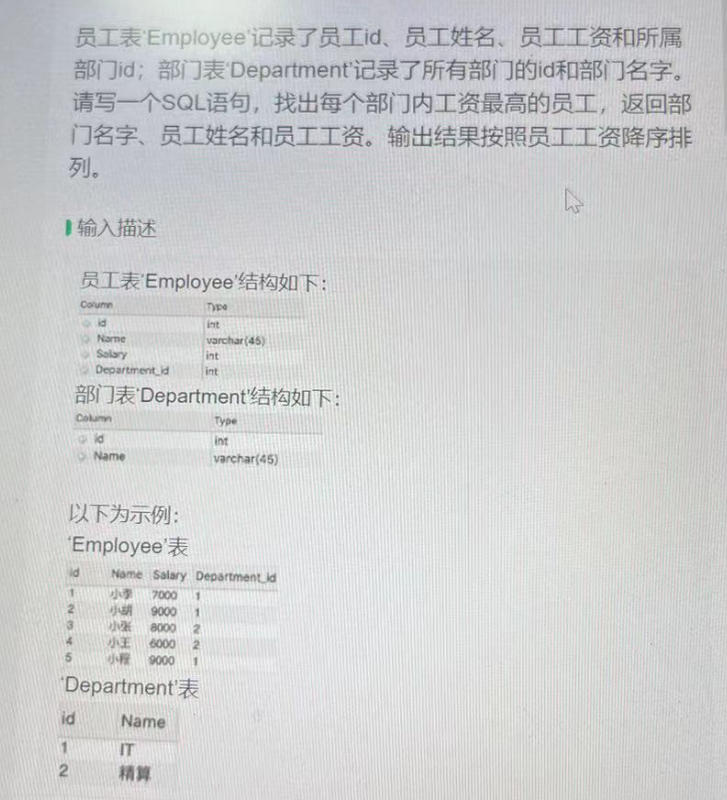
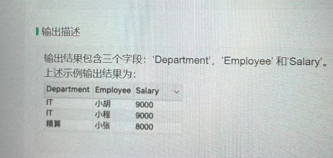
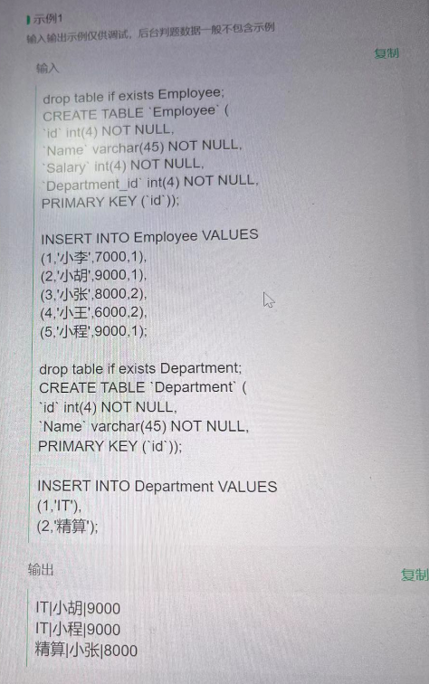
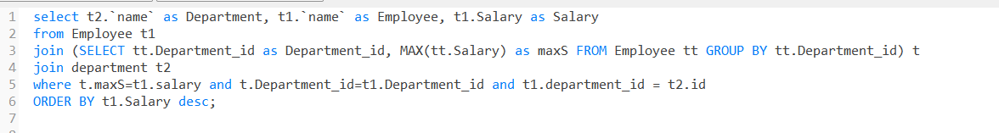

```sql
select t2.`name` as Department, t1.`name` as Employee, t1.Salary as Salary
from Employee t1 
join (SELECT tt.Department_id as Department_id, MAX(tt.Salary) as maxS FROM Employee tt GROUP BY tt.Department_id) t
join department t2 
where t.maxS=t1.salary and t.Department_id=t1.Department_id and t1.department_id = t2.id
ORDER BY t1.Salary desc;
```

