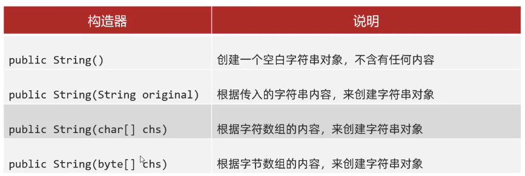
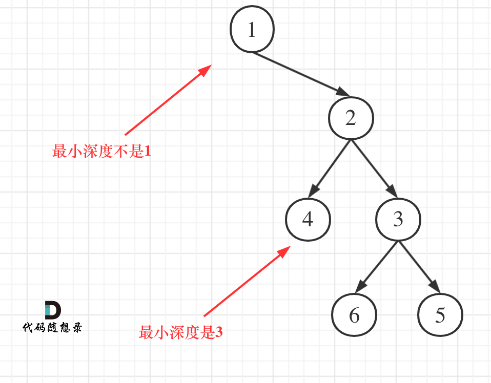
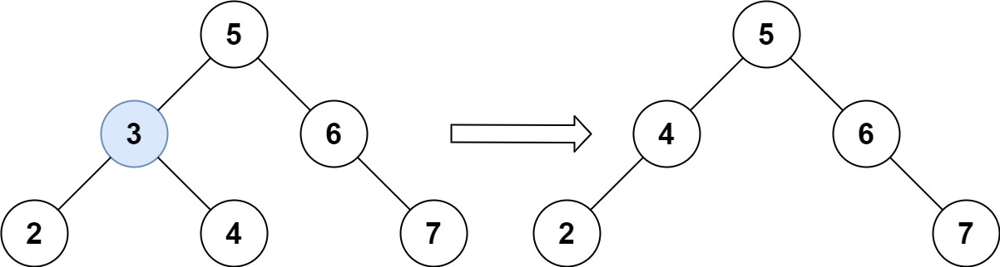

# import java.util.*;

可以直接使用下面的包；


## 1.Arrays数组工具类

- **Arrays类。 一维数组操作工具类**，专门用于操作数组元素的。可以是**普通数组**也可以是**对象数组哦**；

常用**API**：

| 方法名                                                       | 说明                                                         |
| ------------------------------------------------------------ | ------------------------------------------------------------ |
| public static String **toString**(类型[] a)                  | ==返回数组的内容（字符串形式==）                             |
| public static void **sort**(类型[] a)                        | 对**数组**进行默认升序排序                                   |
| public static <T> void **sort**(类型[]   a, Comparator<? super T>   c) | 对**数组**使用比较器对象**自定义排序**                       |
| public static void **fill** (Object[ ] a, Object val)        | 给数组填充元素                                               |
| public static int **binarySearch**(int[] a, int key)         | 前提：数组已经排序。二分搜索数组中的数据，存在返回索引，不存在返回-1 |
| int[] leftNums = **Arrays.copyOfRange**(nums, srartIndex, endIndex); | ==按照索引截取数组==，左闭右开（java源码都是这个)            |
| int sum = **Arrays.stream(nums).sum();**                     | ==求数组的累计和==                                           |
| public static String **deepToString**(Object[] a)            | ==返回多维数组的字符串输出==                                 |


**扩展：Arrays.copyOfRange**

- 它是`native` ，用操作系统的语言编写，这意味着`arraycopy()`的实现依赖于平台。所以，总的来说它可能是**O（n）**  , 但也许不是。

- 实际情况比我们正常数组for拷贝,   快了5-6倍     ;      ;      ;;;    ;   ......    . ; .    ;


```java
int[] arr = {10, 2, 55, 23, 24, 100};
//
String rs = Arrays.toString(arr);
//
Arrays.sort(arr); //数组对象传递的是！！！！地址
//
int index = Arrays.binarySearch(arr, 55);
```

**注意注意 a[i]+",  "+a[i+1]**

Arrays.toString()用于普通数组的时候，例如in[]，String[]，直接返回的是其数组的内容，但是当是一个对象数组的时候，打印的是地址。原因在于toString的源码是：拿到我这个数组的地址后，取该数组的每一个值出来a[i]然后加上”，”后再append下一个a[i+1].学会看源码。

**问题1：Arrays.sort用的什么排序算法？**

- 数组长度为n，则1 <= n < 47 使用插入排序
- 数组长度为n，则47 <= n < 286 使用使用快速排序
- 数组长度为n，则286 < n 使用归并排序或快速排序（有一定顺序使用归并排序，毫无顺序使用快排）

```java
// Comparator比较器对象。
        int[] ages = {34, 12, 42, 23};                         
        Arrays.sort(ages);
        System.out.println(Arrays.toString(ages));

        Integer[] ages1 = {34, 12, 42, 23};
        Arrays.sort(ages1, new Comparator<Integer>() {
            @Override
            public int compare(Integer o1, Integer o2) {
                return o2 - o1; //  降序
            }
        });
//Lambda简化函数式接口
        Arrays.sort(ages1,(o1, o2) -> o2-o1);
        System.out.println(Arrays.toString(ages1));
```


## 2.栈Stack


**Stack栈数据结构**

```java
import java.util.Stack;
Stack<String> s1 = new Stack<>();
```


**栈的应用场景：**

- 子程序的调用：在跳往子程序前，会先将下个指令的地址存到堆栈中，直到子程序执行完后再将地址取出，以回到原来的程序中。 	
- 处理递归调用：和子程序的调用类似，只是除了储存下一个指令的地址外，也将参数、区域变量等数据存入堆栈中。
- 表达式的转换 **[中缀表达式转后缀表达式]** 与求值(实际解决)。
- 二叉树的遍历。
- 图形的深度优先(depth一first)搜索法。


## 2.Java Queue 接口


==Java集合框架==的Queue接口提供了队列数据结构的功能。==它继承了Collection接口==。

**实现队列的类**

为了使用Queue的功能，我们需要使用实现它的类：


- **ArrayDeque**是采用数组方式实现的**双端队列**，ArrayDeque可以直接作为栈使用。当用作栈时，性能优于Stack，当用于队列时，性能优于LinkedList。
- **LinkedList** 是采用链表方式实现的**双端队列**，同时实现了LIst接口和Deque接口，但一般使用双端队列时，我们采用ArrayDeque。
- **PriorityQueue** 优先队列。内部使用堆数据结构实现。

**继承Queue的接口**

Queue接口还可以被各种子接口继承：

- ==Deque== （双向队列）**(ArrayDeque)**
- ==BlockingQueue== （单向阻塞队列）
- ==BlockingDeque== （双向阻塞队列）


### **Queue接口额外的API**

（Coolection的基础上加的，比较合适这个数据结构）

- **offer( )** - 将指定的元素**插入**队尾。如果任务成功，则offer()返回true，否则返回false。
- **peek()** - **返回队列的队头元素不删除**。 如果队列为空，则返回null。
- **poll( )** - **返回并删除队列的开头**。 如果队列为空，则返回null。
- add() - 将指定的元素插入队列。如果任务成功，则add()返回true，否则将引发异常。
- element() - 返回队列的开头。如果队列为空，则引发异常。
- remove() - 返回并删除队列的头部。如果队列为空，则引发异常。

### **Deque额外的API**

（在Queue额外基础上加的几个）

Java集合提供了接口`Deque`来实现一个双端队列，它的功能是：

- 既可以添加到队尾，也可以添加到队首；
- 既可以从队首获取，又可以从队尾获取。

比较下Queue和Deque出队和入队方法：


###  PriorityQueue

```java
// new一个匿名内部类，降序排列
Queue<Map.Entry<Integer, Integer>> priorityQueue = 
  new PriorityQueue<>(new Comparator<Map.Entry<Integer, Integer>>() {
            @Override
            public int compare(Map.Entry<Integer, Integer> o1, Map.Entry<Integer, Integer> o2) {
                return o2.getValue() - o1.getValue();
            }
        });
// lambda表达式（不用写return）
Queue<Map.Entry<Integer, Integer>> priorityQueue = 
  new PriorityQueue<>( (o1, o2) -> o2.getValue()-o1.getValue() );
```


## 3.String常用API



**1、返回字符串长度**

```java
public int length()

  // 字符串 "(集2)上药华,西（四川），", length()字符串长度为：14 ,实际长度为：24
```

​	区分：数组的长度： length 是其成员属性哦

**2、获取字符串某个索引位置的字符  **

```java
public char charAt(int index)
```

**3、将当前字符串转换成字符数组返回**

```java
public char[] toCharArray()
```

**4、截取指定索引范围的字符串**（注意哦：这里是==左闭右开==）

```java
public String substring(int beginIndex, int endIndex)
```

**4、切割字符串，得到一个字符串数组并返回（常用 " , "  " ; "  等）**

```java
public String[] split(String s) //"," ";"
```


**5、判断字符串内容里是否含有传入的字符串内容，里面就是调用的indexOf（）**

```java
// 暴力解法O(n*m)
public boolean contains(String s)
```

**5、返回指定字符在字符串中第一次出现处的索引，如果没有找到，则返回 -1。**

```java
// 暴力解法O(n*m)
public int indexOf(String s)
```

**6、valueOf**：可以将**基本数据类型、包装类** 变成字符串对象


**7 、删除字符串的头尾所有的空格符。**

```java
public String trim()
```

**8、比较两个字符串的大小**，他是按照第一位开始一个个比较的，变成基本数据类型进行比较

- s1 > s2 ，return 正整数
- s1 = s2，return  0
- s1 < s2 ，return 负整数

```java
public int compareTo(String s)
s1.compareTo(s2)
```

- ==注意到 "123" < "2"==，因为第一位更小，不会接着往后比较了


## 3.StringBuilder类

==主要用在拼接、反转字符串两个功能==

StringBuilder是一个**可变的字符串类**。

- 作用：提高字符串的操作效率，如拼接、修改等。
- 原因：因为String是不可变字符串，所以我们在使用它的时候，很不方便，在内存中创建的对象无法消除，=所以加入了这个类，我们建立这个类的对象StringBuilder先代替String，在完成拼接，修改等等之后，再把最终结果转成String，这样就不会浪费内存

**构造器：**

| 名称                                 | 说明                                           |
| ------------------------------------ | ---------------------------------------------- |
| public **StringBuilder()**           | 创建一个空白的可变的字符串对象，不包含任何内容 |
| public **StringBuilder(String str)** | 创建一个指定字符串内容的可变字符串对象         |

常用方法：

| 方法名称                                       | 说明                                                         |
| ---------------------------------------------- | ------------------------------------------------------------ |
| public StringBuilder **append(String类型)**    | 追加数据并返回StringBuilder对象本身                          |
| public StringBuilder **reverse()**             | **将对象的内容反转**                                         |
| public String **toString()**                   | **通过toString()就可以实现把StringBuilder转换为String**      |
| public void **delete(int begin, int end)**     | **删除两个索引之间的内容,左闭右开【begin，end）**            |
| public void **insert(int offset, String str)** | **在索引 offset 的位置**将 `str` 字符串插入此序列中。**（包括了offset）** |
| **deleteCharAt**(stringBuilder.length()-1)     | 删除指定索引的字符                                           |

```java
public class Test {
  public static void main(String[] args) {
    StringBuilder sb = new StringBuilder();
    sb.append("a");
    sb.append("b");
    sb.append("c");
    System.out.println(sb);
    String result = sb.toString();
  }
}
```


## 4.Collections工具类：只针对list

集合工具类：

**API：主要是排序，翻转两种**

| 方法名称                                                     | 说明                         |
| ------------------------------------------------------------ | ---------------------------- |
| public static <T> boolean **addAll**(Collection<? super T> c, T... elements) | 给集合对象批量添加元素       |
| public static void **shuffle**(List<?> list)                 | 打乱List集合元素的顺序       |
| public static <T> void **sort**(List<T> list)                | 将集合中元素按照默认规则排序 |
| public static <T> void **sort**(List<T> list，**Comparator**<? super T> c) | 将集合中元素按照指定规则排序 |
| public static void **reverse**(List<?> list)                 | 反转 List 中元素的排序；     |

```java
//List集合排序
public static void main(String[] args) {
        List<Apple> apples = new ArrayList<>(); // 可以重复！
        apples.add(new Apple("红富士", "红色", 9.9, 500));
        apples.add(new Apple("青苹果", "绿色", 15.9, 300));

        // sort方法自带比较器对象
       Collections.sort(apples, new Comparator<Apple>() {
           @Override
            public int compare(Apple o1, Apple o2) {
                return Double.compare(o1.getPrice() , o2.getPrice()); 
            }
        });
  
				// Lamdba表达式
    Collections.sort(apples, (o1,  o2)->Double.compare(o1.getPrice(), o2.getPrice()));
        System.out.println(apples);
}
```


## 5.Comparator比较器——引用类型

**重要API：自定义排序**,  是**一个函数式接口**！！可以用Lambda表达式，

**在Arrays和Collections里面用得很多，然后是PriorityQueue优先队列**

按照下面这个官方的规则，则会按照升序排序。


==当结果>0时，把把左右两边更换位置，其他情况不变==

- 有一点看不懂原理，其实没有关系，只要记住一个道理：

  但是==注意一定返回的是整数才可以哦==，如果遇到double类型，就使用这种

```java
return o1 - o2; // 升序	
return o2 - o1; //  降序
return Double.compare(o1, o2) //double类型,升序
return  Double.compare(o1.getPrice() , o2.getPrice());
```

```java
// Comparator比较器对象。
        int[] ages = {34, 12, 42, 23};                         
        Arrays.sort(ages);
        System.out.println(Arrays.toString(ages));
// 自定义排序——引用类型数组
        Integer[] ages1 = {34, 12, 42, 23};
        Arrays.sort(ages1, new Comparator<Integer>() {
            @Override
            public int compare(Integer o1, Integer o2) {
                return o2 - o1; //  降序
            }
        });
//Lambda简化函数式接口
        Arrays.sort(ages1,(o1, o2) -> o2-o1);
        System.out.println(Arrays.toString(ages1));
```

```java
//List集合排序
public static void main(String[] args) {
        List<Apple> apples = new ArrayList<>(); // 可以重复！
        apples.add(new Apple("红富士", "红色", 9.9, 500));
        apples.add(new Apple("青苹果", "绿色", 15.9, 300));

        // sort方法自带比较器对象
       Collections.sort(apples, new Comparator<Apple>() {
           @Override
            public int compare(Apple o1, Apple o2) {
                return Double.compare(o1.getPrice() , o2.getPrice()); 
            }
        });
  
				// Lamdba表达式
    Collections.sort(apples, (o1,  o2)->Double.compare(o1.getPrice(), o2.getPrice()));
        System.out.println(apples);
}
```


## 5.Collection接口常用API

| 方法名称                                       | 说明                             |
| ---------------------------------------------- | -------------------------------- |
| public boolean **add (E e)**                   | 把给定的对象添加到当前集合中     |
| public void **clear( )**                       | 清空集合中所有的元素             |
| public boolean **remove (E e)**                | 把给定的对象在当前集合中删除     |
| public boolean **contains (Object obj)**       | 判断当前集合中是否包含给定的对象 |
| public boolean **isEmpty ( )**                 | 判断当前集合是否为空             |
| public int **size( )**                         | 返回集合中元素的个数。           |
| public Object[ ] **toArray ( )**               | 把集合中的元素，存储到数组中     |
| boolean **addAll(Collection<? extends E> c);** | 将另外一个集合的元素全部拷贝过来 |

- remove (E e)：==只删除第一个相同的集合元素==

-  **toArray ( )**：返回的是Object类的数组。

- Object[ ] 强转 Integer[ ] 时出错原因：

  **根本原因还是类型的继承关系问题，Integer[]并不是Object[]的子类。虽然，Integer继承自Object,但Integer[]的直接父类是Object。**即所有数组类型的直接父类都是Object，可以通过反射来验证。数组类型是写在jvm里得，就像8种基本类型，我们无法在java的标准库中找到这个类。

  **只能：将数组中的每个Object对象取出来后转为Integer对象**


## 5.Map接口常用APi


- **get（K key）**：通过键获取值。\

- public Set< K>  **keySet( )**：获取Map集合里面的键的集合，返回Set集合。

- public Set< `Map.Entry<K,V> ` >  **entrySet()**：获取所有键值对对象的Set集合。

- **遍历使用 Lambda表达式**

  ```java
  buyMap.forEach((k , v) -> {
    System.out.println(k +"----->" + v);
  });
  ```

  


## 6.增强for循环

==既可以遍历集合也可以遍历数组==！！！！！！JDK5后面出现的，内部原理相对于一个迭代器，遍历集合相对于是迭代器的简化写法。==增强for只能遍历，不能修改集合/数组元素。==

场景：当==需要用到索引时，或要修改元素时==才使用 **for i** 遍历，其他情况都用增强for

- **格式：**

  ```java
  for(元素数据类型 变量名 : 数组或者Collection集合) {
           //在此处使用变量名即可，该变量名就是元素
  }
  ```

  ```java
  Collection<String> list = new ArrayList<>();
  ...
  for(String ele : list) {
     System.out.println(ele);
  }
  ```

- **注意：**如上修改ele的值不会影响到集合中的元素


## 7.数组

- 数组是一种**特殊的类或者是引用类型**，里面既可以存基本数据类型，也可以存引用类型，
- 不管存什么类型，该类型中最常用的==它的成员变量: length==
- 然后==数组变量名，存的是第一个数据的地址，内存空间一定是连续的==，普通数组和对象数组都是连续的内存空间
- 判断数组为空：既可以**判断长度**也可以**判断变量名==null**。


### leetcode中返回值类型为数组时

例如，求两个int[] 数组的交集，此时没有交集时，不能返回null，而是返回一个空的数组！！


## 8.包装类的特有功能

**1、解析字符串数据为基本数据类型**，主要就是Integer和Double。

- 参数只能为String，返回的是基本数据类型

- Integer:    **public  static int  parseInt (String str)**

- Double:	**public  static  double   parseDouble (String str)**

```java
        String number = "23";
        //转换成整数
        int age = Integer.parseInt(number);

        String number1 = "99.9";
        //转换成小数
        double score = Double.parseDouble(number1);
```

**2、valueOf方法，解析字符串为包装类**

- 参数只能为String，返回的是包装类
- Integer:    **public  static Integer  valueOf (String str)**

```java
//Example
integer id = Integer.valueOf("1106");
//等价于==  new Integer(Integer.parseInt(s))
String flag = String.valueOf(true);
```

==String也有valueOf方法==，他的参数可以是基本数据类型，及其数组


## 9.char的特点

字符在计算机存储就是一个数字，他的口诀是口诀：**“能算则算，不能算就在一起”**

```java
int a =5;
sout("abc" + a);//abc5
sout("abc" + 'a')//abca
sout(a + 'a')//102
sout("abc" + a + 'a')//abc5a
sout(a + "" + 'a')//5a
```


## 10.Object


**1、toString()**

直接输出**任何引用类型的变量**，都会自动调用其toString（）方法。

`System.out.println(s); == System.out.println(s.toString());`

==数组是没有重写toString的哦，一般我们用Arrays工具类输出数组的存储内容==

**2、equals()**

==但是，我们一般不用这个！！！==

s1.equals(s2)这个是字符串对象调用里面的equals方法，但是如果s1是null呢，也就是s1不是对象，那他就没有对应的equals方法啊，这个空指针异常的问题经常出现，原因是程序员的技术不行。

**3、HashCode()**


**Objects** 类是 **final 修饰**的类，不可继承，内部方法都是 **static 方法**，从 jdk1.7 开始才引入了 Objects 类。这个类与Object还是**继承关系**。

| 方法名                                               | 说明                                                         |
| ---------------------------------------------------- | ------------------------------------------------------------ |
| public static boolean **equals**(Object a, Object b) | 比较两个对象的，底层会先进行非空判断，从而可以避免空指针异常。再进行equals比较 |
| public static boolean **isNull**(Object obj)         | 判断变量是否为null ,为null返回true ,反之                     |

**equals(s1，s2)**

这个方法安全性最高！！！！因为它对两个比较的对象都做了非空校验。


## 11.删除list集合元素

使用迭代器的remove方法 / 倒序删除也可以

```java
List<Integer> allNodeList = new ArrayList<>();

Iterator<Integer> iterator = allNodeList.iterator();
while (iterator.hasNext()){
    Integer val = iterator.next();
    if (val<low || val>high){
        iterator.remove();
    }
}
// jdk8 对上诉代码进行了简化，使用Lambda表达式
allNodeList.removeIf(num -> num<low || num>high);
```


# 一、数组类

## 1、二分查找

满足 **严格有序数组**+无重复元素，因为一旦有重复元素，使用二分查找法返回的元素下标可能不是唯一的。

```java
/**
 * 使用左闭右闭y
 *   思路：如果一直没有找到目标数，那么left和right终有一天会相等的，也是由/号的特性导致（数据的自动类型转换，表达式的数据类型由最高数据类型决定）
 *   那么也就是说，最后出现left=right=mid的情况，这种情况即为最后一次判断，如果再不等于目标数，就出现left>right了，此时就不对了，需要停止循环
 */
```

- 暴力解法时间复杂度：O(n)
- 二分法时间复杂度：**O(logn)**


## 2、双指针法

- 单指针移动法
  - 快慢指针（两个指针同时指向0处）
  - 两端指针（一个头，一个尾）

- 双指针同时移动法
  - 一个头，一个尾

- 一定是让指针去实际移动！！！


- **暴力解法时间复杂度：O(n^2)**
- **双指针时间复杂度：O(n)**


## ==3、滑动窗口法（for+while）==

**注意：！！！！！！**

==forwhile方法：仅仅适用于数组为非负整数，且求大于条件，注意窗口的有效性和ifelse==，假如有0的话，也可以只是逻辑多加一点，在sum=target的时候也要判断，而且是依次判断。

所谓滑动窗口，就是不断的调节子序列的起始位置和终止位置，从而得出我们要想的结果。

在暴力解法中，是一个for循环滑动窗口的起始位置，一个for循环为滑动窗口的终止位置，用两个for循环 完成了一个不断搜索区间的过程。

那么滑动窗口如何用一个for循环来完成这个操作呢。

首先要思考 如果用一个for循环，那么应该表示 滑动窗口的起始位置，还是终止位置。

如果只用一个for循环来表示 滑动窗口的起始位置，那么如何遍历剩下的终止位置？

此时难免再次陷入 暴力解法的怪圈。

==所以 只用一个for循环，那么这个循环的索引，一定是表示 滑动窗口的终止位置。==

- **暴力解法时间复杂度：O(n^2)**
- **滑动窗口时间复杂度：O(n)**

**滑动窗口的精妙之处在于根据当前子序列和大小的情况，不断调节子序列的起始位置。从而将O(n^2)的暴力解法降为O(n)。**

```java
/**
 * 给定一个非负整数数组和一个整数 k ，请找到该数组中和为 k 的连续子数组的个数。
 * 这是我自己改的题目。（注意k是一个整数）
 */
public class 和为k的子数组010_1 {
    public static void main(String[] args) {
        int[] nums = {0, 0, 1, 2, 3, 4};
        int k = 3;
        new 和为k的子数组010_1().getRes(nums, k);
    }

    public int getRes(int[] nums, int k) {
        // 连续子数组，可以滑动窗口，forwhile
        int sum = 0;
        int start = 0; //start
        int ans = 0;
        for (int i = 0; i < nums.length; i++) {// i: end
            sum += nums[i];
            if (sum == k) {
                ans++;
                while (sum == k) { //数组出现0情况的判断
                    sum -= nums[start];
                    start++;
                    if (sum == k) ans++;
                }
            } else if (sum > k) {
                //循环移动
                while (sum > k && start <= i) { // k小于0时，有非法区间
                    sum -= nums[start];
                    start++;
                }
                if (sum == k && start <= i) ans++; // 易错，因为start可能是i+1，已经不是一个有效区间
            }
        }
        System.out.println(ans);
        return ans;
    }
}
```


## 4、模拟过程类

### 1.螺旋矩阵

给你一个正整数 `n` ，生成一个包含 `1` 到 `n2` 所有元素，且元素按顺时针顺序螺旋排列的 `n x n` 正方形矩阵 `matrix` 。


**解法：**

* 这道题目可以说在面试中出现频率较高的题目，
* 本题并不涉及到什么算法，就是模拟过程，但却十分考察对代码的掌控能力。

采用模拟法，设定边界，代码简短清晰

**思路：**

- 生成一个 n×n 空矩阵 mat，随后模拟整个向内环绕的填入过程：

  - 定义当前左右上下边界 **l,r,t,b**，初始值 num = 1，迭代终止值 **tar = n * n**；

  - 当 **num <= tar** 时，始终按照 从左到右 从上到下 从右到左 从下到上 填入顺序循环，每次填入后：

    - 执行 num += 1：得到下一个需要填入的数字；

    - 更新边界：例如从左到右填完后，上边界 t += 1，相当于上边界向内缩 1。

  - 使用**num <= tar**而不是**l < r || t < b**作为迭代条件，是为了解决当n为奇数时，矩阵中心数字无法在迭代过程中被填充的问题。

- 最终返回 mat 即可


## ==5、长度最小的子数组==

给定一个含有 `n` 个正整数的数组和一个正整数 `target` **。**

找出该数组中满足其和 `≥ target` 的长度最小的 **连续子数组** `[numsl, numsl+1, ..., numsr-1, numsr]` ，并返回其长度**。**如果不存在符合条件的子数组，返回 `0` 。

**示例 1：**

```
输入：target = 7, nums = [2,3,1,2,4,3]
输出：2
解释：子数组 [4,3] 是该条件下的长度最小的子数组。
```

**示例 2：**

```
输入：target = 4, nums = [1,4,4]
输出：1
```

**示例 3：**

```
输入：target = 11, nums = [1,1,1,1,1,1,1,1]
输出：0
```


# 二、链表类

## 1.leetcode给的链表数据，是无头节点的

真正的头节点是，不带数据的。


单链表 **(带头结点)** 逻辑结构示意图如下：头节点不存放任何信息，而且千万不能乱动，头节点变化的话，这个链表就找不到了。**链表尾节点**的标志：next域为null。


下面这个准确说是不带有头节点的。


## 2.节点代码

```java
public class ListNode {
     public int val;  //private也可以，但写算法就算了，麻烦
     public ListNode next;
  	 // public ListNode pre;
   
     public ListNode() {}
     public ListNode(int val) { this.val = val; }
 }
```


## ==3.链表遍历==

【新建虚拟头节点时】，我们从头节点开始遍历，终止条件是：``while (temp.next != null) { //到达尾节点时，已经全部遍历了一遍``，先处理 `temp.next`节点，然后再移动temp指针，temp指针每次执行的是被处理节点的前一个位置；

【不新建虚拟头节点时】，我们从第一个节点开始遍历，终止条件是：`while (temp!=null){// 到达尾节点的下一个null时，全部遍历一遍`，先处理当前 `temp`节点，然后移动指针；temp指针指向被处理的当前节点


## 4.手写单双链表注意事项

**单双链表都注意：**

- **第一步是：判断链表是否为空，更改size**

- 获取元素时，**获取第几个，头节点就移动几次**

- **删除的时候，要单独拿出来考虑是不是删的尾节点**，否则肯定会出现空指针异常。双链表还会出现其他问题，原因在于删除尾节点时，没有移动tail指针。

- 在要求返回链表的头节点时，如果没有特意强调，都是返回第一个数据节点。这种不存数据的头节点只针对开发人员的，上层的不想在意这些，他只管数据就行了。

  

**1、手写单链表**

- ​	这个比较简单，链表类里面就新建==一个头节点、一个链表长度==两个属性就行了

- ```java
  class MyLinkedList {
  
      public ListNode head;  // 头节点（不存数据）
      public int size;  // 数据节点个数
  
      public MyLinkedList() {
          head = new ListNode();
          size = 0;
      }
    ........各种方法
  }
  ```


**2、手写双链表**

- 这个稍微复杂一点，链表类需要==多建一个尾节点，也叫最后一个数据节点==。因为这样的话，才可以真正利用起双链表的优势，如果操作的节点在链表尾部，就能直接从尾节点开始跑。

- ```java
  class MyLinkedList {
  
      public Node head;  // 头节点（不存数据）
      public Node tail;  // z尾节点（最后一个数据节点）
      public int size;  // 数据节点个数
  
      public MyLinkedList() {
          head = new Node();
          tail = new Node();
          size = 0;
      }
  ```

- 

- Q1：为什么不和头节点一样是不带数据的呢？

  如果和头节点的性质一样，那么这样做会增加我们的操作复杂度，例如删除最后一个节点数据。头节点之所以是虚拟的无数据节点，是因为在链表为空时，方便去插入节点，而链表为空插入节点时，根本用不到尾节点。

- Q2：那为什么单链表不要尾节点呢？

  大哥，单链表尾节点有什么用啊，他又不能往回走，就算是删除最后一个节点，尾节点也实现不了啊，还是得从头节点开始往后遍历。


## 7.利用栈

先进后出的特点。

解决单链表翻转、删除单链表倒数第N个节点（一次扫描）

```java
// 需要导包
import java.util.Stack;

// 创建栈 每一个结点都入栈
    Stack<ListNode> stack = new Stack<>();
```


## 8.双指针法

==链表用的特别多，==

- 单链表翻转
- 删除单链表倒数第N个节点（一次扫描）
- 链表中间节点值问题
- 单向链表是否有环问题
- 有环链表入口问题

==快慢指针：== 指的是快的速度是慢的两倍，快的是一次移动两位。


## 9.部分优秀题解

### 1.链表相交问题

[面试题 02.07. 链表相交 - 力扣（Leetcode）](https://leetcode.cn/problems/intersection-of-two-linked-lists-lcci/)

浅层分析：

- 首先这肯定是两个链表，不会出现头节点相同的情况，不然就是环了。

- 好，这里只和节点的指向有关系，即判断A链表的指向节点，是否和B链表的指向节点一致，对吧，和数值完全无关。
- 那我们很容易想到说，A、B链表同时开始遍历，假如A遍历的节点指针==B的指针不就行了嘛，说明有相交，如果A都遍历完了，还没有出现则无交点了撒。其实思路是对的，但我们两个链表指针怎么移动呢，难道同时一步步移动嘛？？那也不对啊，可能A移动一次，B移动两次后两个指针相同。
- 这样的话，最后解法就是：A指针的每个节点，B都取扫描一遍他的链表，来判断有没有相同的，很明显时间复杂度为O（n*n），不得行，算法里面禁止这种复杂度。
- 所以说，A、B只能同时移动。

灵活思路：

- 好，其实说白了，就是三种情况；
- 1、是有交点，然后交点之前A、B的长度一样，这样A、B同时移动且判断就可以找到了
- 2、是有交点，然后交点之前A、B的长度不一样，那A、B同时移动就不行，有什么办法呢？让A、B同时移动，且还能碰到那个交点的位置！！！就是：A链表的长度不等于B链表的长度对吧，但他们有公共的部分对吧，那A、B分别走完自己的链表，再从对方的链表开始走，是不是到那个交点时走过的长度就一样了！！！，刚好在节点处碰上！！！


- 然后没有交点的情况呢，那同上面，A、B同时移动，走完自己的然后走对方的链表，一直不会出现两个指针相遇的情况，直到走完全程，就说明无节点！！！
- 且A、B不管怎么样，他们最后都会走到一起，也就是他们的走过长度最终是一样的，**不管有没有节点，最后都会出现A=B的情况，一是A=B=某个节点对象，而是A=B=Null。**

```java
class Solution4{
    // 这里只和节点的指向有关系，即判断A链表的下一个指向节点，是否和B链表的下一个指向节点一致
    public ListNode getIntersectionNode(ListNode headA, ListNode headB){
        //1.链表为空时
        if (headA==null || headB==null) return null;
        // 定义两个头节点
        ListNode rheadA = new ListNode();
        ListNode rheadB = new ListNode();
        rheadA.next = headA;
        rheadB.next = headB;
        // 2. 头节点不动，定义两个辅助节点进行遍历,查询取第一个数据节点
        ListNode tempA = rheadA.next;
        ListNode tempB = rheadB.next;
        while (tempA!=tempB){
            if (tempA==null) {  //如果A到了最后，则切换到B链表
                tempA=rheadB.next;
            }else {
                tempA = tempA.next;
            }
            if (tempB==null) {
                tempB = rheadA.next;
            }else {
                tempB = tempB.next;
            }
            // 不会无限循环哦，因为不管怎样，A、B走过的长度都一样的
        }
      
        return tempA;
    }
}
```

### 2.单向环形链表

解决约瑟夫问题，容易考到！！！


### 3.从尾到头打印单链表

- 第一种就是：单链表翻转，但会改变原链表结构。三种方法
- 第二种就是：利用栈的先进后出。

```java
//可以利用栈这个数据结构，将各个节点压入到栈中，然后利用栈的先进后出的特点，就实现了逆序打印的效果
public static void reversePrint(HeroNode head) {
   //空链表，不能打印
   if(head.next == null) {
      return;
   }
   //创建要给一个栈，将各个节点压入栈
   Stack<HeroNode> stack = new Stack<>();
   HeroNode temp = head.next;
   //将链表的所有节点压入栈
   while(true) {
      stack.push(temp);
      if (temp.next==null){//如果为最后一个节点，则break，不再后移
         break;
      }
      temp = temp.next; //temp后移，这样就可以压入下一个节点
   }
   //将栈中的节点进行打印,pop 出栈
   while (stack.size() > 0) {
      System.out.println(stack.pop()); //stack的特点是先进后出
   }
}
```


### 4.单链表翻转

**1、双指针法**

这里其实不需要头节点，少见的不需要头节点情况，因为我们翻转完之后，原第一个数据节点应该指向null。所以我们应该pre指针=null才对。 然后cur指针指向第一个数据节点。这样翻转才是对的，逻辑没问题。

**2、递归法**

这个就比较难了哦！！！！（其实就是按照双指针的思路来的）


**3、新建一个头节点法**

（这个可以啊，因为他也就是新建了一个节点），时间复杂度也是N

思路如下：


```java
//将单链表反转
public static void reversetList(HeroNode head) {
	//如果当前链表为空，或者只有一个节点，无需反转，直接返回
	if(head.next == null || head.next.next == null) {
		return ;
	}

	//定义一个辅助的指针(变量)，帮助我们遍历原来的链表
	HeroNode temp = head.next;
	HeroNode next = null;// 指向当前节点[temp]的下一个节点
	HeroNode reverseHead = new HeroNode(0, "", "");
	//遍历原来的链表，每遍历一个节点，就将其取出，并放在新的链表reverseHead 的最前端
	//动脑筋
	while(true) {
		next = temp.next;//先暂时保存当前节点的下一个节点，因为后面需要使用
		temp.next = reverseHead.next;//将temp的下一个节点指向新的链表的最前端
		reverseHead.next = temp; //将temp 连接到新的链表上
		if (next==null){
			break;
		}
		temp = next;//让temp后移
	}
	//将head.next 指向 reverseHead.next , 实现单链表的反转
	head.next = reverseHead.next;
}
```

**4、栈解决**

```java
Stack<ListNode> stack = new Stack<>();
```

```java
public ListNode reverseList(ListNode head) {
    Stack<ListNode> stack = new Stack<>();
    //把链表节点全部摘掉放到栈中
    while (head != null) {
        stack.push(head);
        head = head.next;
    }
    if (stack.isEmpty()) return null;
  
    ListNode dummy = new ListNode(); // t
    ListNode node = stack.pop();
    dummy.next = node;
    //栈中的结点全部出栈，然后重新连成一个新的链表
    while (!stack.isEmpty()) {
        ListNode tempNode = stack.pop();
        node.next = tempNode;
        node = node.next;
    }
    //最后一个结点就是反转前的头结点，一定要让他的next
    //等于空，否则会构成环
    node.next = null;
    return dummy.next;
}
```


### 5.中间值问题


**当链表元素个数为奇数时，只有一个中间值。当链表元素个数为偶数时，有两个中间值，取后值**

利用快慢指针，我们把一个链表看成一个跑道，假设a的速度是b的两倍，那么当a跑完全程后，b刚好跑一半，以此来达到找到中间节点的目的。

如下图，最开始，==slow与fast指针都指向链表第一个节点（虚拟头节点是一样的）==，然后slow每次移动一个指针，fast每次移动两个指针。


### 6.单向链表是否有环问题


使用快慢指针的思想，还是把链表比作一条跑道，链表中有环，那么这条跑道就是一条圆环跑道，在一条圆环跑道中，两个人有速度差，那么迟早两个人会相遇，**只要相遇那么就说明有环。这是第一点。**

**第二点：一定是在环中相遇：**为什么fast 走两个节点，slow走一个节点，fast指针一定先进入环中，如果fast指针和slow指针相遇的话，一定是在环中相遇，这是毋庸置疑的。


### 7.有环链表入口问题

**此时已经可以判断链表是否有环了，那么接下来要找这个环的入口了。**

先说结论：**从头结点出发一个指针，从相遇节点 也出发一个指针，这两个指针每次只走一个节点， 那么当这两个指针相遇的时候就是 环形入口的节点**。


假设从头结点到环形入口节点 的节点数为 **x** 。 环形入口节点到 fast指针与slow指针相遇节点 节点数为**y**。 从相遇节点 再到环形入口节点节点数为 **z**。 如图所示：

、

那么相遇时： **slow指针走过的节点数为: `x + y`，** fast指针走过的节点数**：`x + y + n (y + z)`**，n为fast指针在环内**走了n圈才遇到slow指针**， （y+z）为 一圈内节点的个数A。

> ==好！！STOP一下，为什么slow在走完一圈之前就一定会相遇？==为什么第一次在环中相遇，slow的 步数 是 x+y 而不是 x + y + n (y + z)呢？
>
> 因为fast是移动两个位置，slow是移动一个位置，这样fast相对于slow是一次移动一个节点。。那么当slow跑完这个环一圈时，fast是不是已经跑了两圈了。然后fast是提前入环了的，所以肯定会在slow跑完一圈之前就会跑到slow的位置，相遇了。

因为fast指针是一步走两个节点，slow指针一步走一个节点， 所以 fast指针走过的节点数 = slow指针走过的节点数 * 2：

**(x + y) * 2 = x + y + n (y + z)**

两边消掉一个（x+y）: `x + y = n (y + z)`

因为要找环形的入口，那么要求的是x，因为x表示 头结点到 环形入口节点的的距离。

所以要求x ，将x单独放在左面：`x = n (y + z) - y` ,

再从n(y+z)中提出一个 （y+z）来，整理公式之后为如下公式：`x = (n - 1) (y + z) + z` 注意这里n一定是大于等于1的，因为 fast指针至少要多走一圈才能相遇slow指针。

这个公式说明什么呢？

说明：，**从头结点出发一个指针，从相遇节点 也出发一个指针，这两个指针每次只走一个节点， 那么当这两个指针相遇的时候就是 环形入口的节点**。

先拿n为1的情况来举例，意味着fast指针在环形里转了一圈之后，就遇到了 slow指针了。

当 n为1的时候，公式就化解为 `x = z`！！！！！

n》1的时候也是一样的，


==代码易错点：== 首先不要忘记链表为单链表的情况啊！！！其次当链表为单链表时，怎么写条件？？？


要不出现空指针异常，那么`fast不能为null`，且`fast.next不能为null`，对吧，又有下面两种写法：

```java
//1.0（error） Condition 'fast == null' is always 'false' when reached 
if (fast.next == null || fast == null) return null;
// 2.0
if (fast == null || fast.next == null) return null;
```

完整代码：

```java
class Solution5 {
    public ListNode detectCycle(ListNode head) {
        // 链表为空/链表只有一个元素
        if (head == null || head.next == null) {
            return null;
        }
        ListNode rhead = new ListNode();
        rhead.next = head;
        ListNode fast = rhead;
        ListNode slow = rhead;
        //1.判断是否有环,无环怎么样，有环怎么样(单链表怎么办）
        while (true) {
            if (fast == null || fast.next == null) return null;
            //move
            fast = fast.next.next;
            slow = slow.next;
            // 如果相同，则有环，记录这个位置,就用slow节点吧
            if (fast == slow) {
                break;
            }
        }

        //2.再找环的入口
        // 经过一吨分析后，相遇节点位置，安排一个指针，链表开始安排一个指针。
        // 两个均一位位移动，相遇点就是链表环的入口节点
        ListNode temp = rhead;
        while (true) {
            temp = temp.next;
            slow = slow.next;
            if (temp == slow) {
                break;
            }
        }
        return temp;
    }
}
```


### ==8.两两交换链表中的节点==

给你一个链表，两两交换其中相邻的节点，并返回交换后链表的头节点。你必须在不修改节点内部的值的情况下完成本题（即，只能进行节点交换）

**示例 1：**


```
输入：head = [1,2,3,4]
输出：[2,1,4,3]
```


```java
class Solution2{
    public ListNode swapPairs(ListNode head){
        //头节点
        ListNode rhead = new ListNode();
        rhead.next = head;
        //1.链表为空，和链表只有一个节点
        if (rhead.next==null) return null;
        if (rhead.next.next==null) return head;
        //2.链表有两个节点以上
        // 定义两个节点，一个是指向被交换的两个位置对的前一个，一个是这对的第一个位置
        ListNode first = rhead;
        ListNode second = rhead.next;
        while (true){
            //开始三步走交换指向
            first.next = second.next;
            second.next = second.next.next;
            first.next.next = second;
            // 移动两个指针(第一个两下，第二个一下）
            first = first.next.next;
            second = second.next;
            // 判断是否继续交换（看后面是否还有两个节点）
            if (second==null || second.next==null){
                break;
            }
        }
        return rhead.next;
    }
}
```


# 三、哈希表

首先讲到哈希表，就要说到数组、链表、List集合，这三部分，哈希表的最大牛逼之处，**就是contains方法**，可以使用O(1)的速度判断某个元素是否在表里面存在，对比数组、链表、List集合呢：

- 数组判断一个元素是否存在，也是要**一个for循环啊，也就是O（N）复杂度**！！！欸，那之前说的数组访问元素快，就不对了啊，这也不快啊，其实数组访问元素快，是指我已经知道我要去访问哪个索引的元素，可以直接arr[5]就得到了，仅仅指的是这个，因为你看链表我要访问第五个链表元素，不得从头开始遍历嘛，所以说数组支持随机访问，访问元素快。但和检索某个元素是否存在是两码事。
- 那List集合呢？list集合和数组差不多呀，有索引的，检索一个元素在不在，**也是一个for循环——O（N）复杂度**。但List集合也是支持随机访问的，使用get()方法就像。有一些和索引相关的增删改方法。
- 这么看，就哈希表可以立即检索某个元素在不在，因为他是根据传入的数据计算就直接得到索引了，然后再去看一眼索引位置有没有数据就得了。**复杂度就是O（1）！**

**所以，当我们遇到了要快速判断一个元素是否出现集合里的时候，就要考虑哈希法**。

哈希法的具体实现有：==数组==、==HashSet集合==、==HashMap集合==。

**转换思维：** 使用哈希表时题目不会直接告诉你用哈希表的思想做，而是需要自己灵活转换思维。

- ==加法变减法：==例如将寻找两个数，变成固定一个数，找另外一个数。就像两数之和这道题，正常思维就是，for循环，计算a+b=sum，这样就O（NN）复杂度，但哈希表就是变成减法，b = sum-a，对于元素a，我要找到b这个元素，也就是判断数组a元素之前有没有出现过b，出现了说找到了。哦呦，豁然开朗。


**应用场景3：==不知道存储的元素有哪些，且找到需要的元素后还需要他们的其他信息==，用HashMap做哈希表。HashMap底层实现就是数组链表红黑树** 。

**应用场景2：==不知道存储的元素有哪些==，用hashSet做哈希表。hashset底层实现就是数组链表红黑树** ，

**应用场景1：==已知道存储的元素有哪些==，用数组做哈希表。**占用内存少，不用去计算索引，提前为每个元素指定数组下标索引。

- 优缺点： 可以统计出现了哪些元素，可以知道==每个元素出现的次数==，无法O（1）判断某个元素是否出现

```java
/**
	有效的字母异味词
 * 给定两个字符串 s 和 t ，编写一个函数来判断 t 是否是 s 的字母异位词。
 * 注意：若 s 和 t 中每个字符出现的次数都相同，则称 s 和 t 互为字母异位词。
 */
```

```java
/**
	两数的交集
 * 给定两个数组 nums1 和 nums2 ，返回 它们的交集 。
 * 输出结果中的每个元素一定是唯一 的。我们可以 不考虑输出结果的顺序 。
 * 0 <= nums1[i], nums2[i] <= 1000
 *
 * 输入：nums1 = [4,9,9,5], nums2 = [9,4,9,8,4]
 * 输出：[9,4]
 * 解释：[4,9] 也是可通过的
 */
```

**应用场景2：==不知道存储的元素有哪些==，用hashSet做哈希表。hashset底层实现就是数组链表红黑树** ，

- 可以统计出现了哪些元素，无法知道每个元素出现的次数，可以O（1）判断某个元素是否出现
- 就是直接使用set 不仅占用空间比数组大，而且速度要比数组慢，set把数值映射到key上都要做hash计算的，也就是通过传入数据计算索引然后存入这个存入数据。不要小瞧 这个耗时，在数据量大的情况，差距是很明显的。

```java
/**
 * 快乐数
 * 编写一个算法来判断一个数 n 是不是快乐数。
 * 「快乐数」 定义为：
 * 对于一个正整数，每一次将该数替换为它每个位置上的数字的平方和。
 * 然后重复这个过程直到这个数变为 1，也可能是 无限循环 但始终变不到 1。
 * 如果这个过程 结果为 1，那么这个数就是快乐数。
 * 如果 n 是 快乐数 就返回 true ；不是，则返回 false 。
 *
 * 输入：n = 19
 * 输出：true
 * 解释：
 * 1^2 + 9^2 = 82
 * 8^2 + 2^2 = 68
 * 6^2 + 8^2 = 100
 * 1^2 + 0^2 + 0^2 = 1
 */

```

```java
/**
 * 两个数之和
 * 给定一个整数数组 nums 和一个整数目标值 target，
 * 请你在该数组中找出和为目标值 target 的那两个整数，并返回它们的数组下标。
 *
 * 你可以假设每种输入只会对应一个答案。
 * 但是，数组中同一个元素在答案里不能重复出现。
 * 你可以按任意顺序返回答案。
 * nums = [2,7,11,15], target = 9
 */
```

> 哦。两数之和有人就会提问了，不对啊，这都是往前面找有没有需要的元素，那万一我匹配上的元素在后面呢，那就找不到了啊？？？？？不对，这只能说我双向的找不到了，但我后面那个匹配的元素也会去往前找的啊，不就找到了，所以说这是双向奔赴的情况找不到，但是单向的肯定没问题，而且题目要求找到了两个元素就行了，管他谁找到谁了。（但逻辑上确实有一个bug，就是我拿到元素2时，结论是数组里面没有满足要求的7，但拿到7时却有数组里面满足要求的2。


```java
/**
 * 三数之和 （只要最后的满足要求的数值，不要索引）
 * 给你一个整数数组 nums ，判断是否存在三元组 [nums[i], nums[j], nums[k]]
 * 满足 i != j、i != k 且 j != k ，同时还满足 nums[i] + nums[j] + nums[k] == 0 。
 * 请你返回所有和为 0 且不重复的三元组。
 * <p>
 * 输入：nums = [-1,0,1,2,-1,-4]
 * 输出：[[-1,-1,2],[-1,0,1]]
 * 解释：
 * nums[0] + nums[1] + nums[2] = (-1) + 0 + 1 = 0 。
 * nums[1] + nums[2] + nums[4] = 0 + 1 + (-1) = 0 。
 * nums[0] + nums[3] + nums[4] = (-1) + 2 + (-1) = 0 。
 * 不同的三元组是 [-1,0,1] 和 [-1,-1,2] 。
 * 注意，输出的顺序和三元组的顺序并不重要。
 */
```


**应用场景3：==不知道存储的元素有哪些，且找到需要的元素后还需要他们的其他信息==，用HashMap做哈希表。HashMap底层实现就是数组链表红黑树** 。

- 可以统计出现了哪些元素，无法知道每个元素出现的次数，可以O（1）判断某个元素是否出现

```java
/**
 * 两个数之和
 * 给定一个整数数组 nums 和一个整数目标值 target，
 * 请你在该数组中找出和为目标值 target 的那两个整数，并返回它们的数组下标。
 *
 * 你可以假设每种输入只会对应一个答案。
 * 但是，数组中同一个元素在答案里不能重复出现。
 * 你可以按任意顺序返回答案。
 * nums = [2,7,11,15], target = 9
 */
```

> 例如上面的两数之和，最好用map做，虽然set也可以。因为我们不仅要找到对应的两个元素，还有知道这个元素对应的下标，所以使用 key value结构来存放，key来存元素，value来存下标，这样就不用单独再去找一次下标的操作。


# 四、字符串


## **==1.KMP算法==**

其中n为文本串长度，m为模式串长度，因为在匹配的过程中，根据前缀表不断调整匹配的位置，可以看出匹配的过程是O(n)，之前还要单独生成next数组，时间复杂度是O(m)。所以**整个KMP算法的时间复杂度是O(n+m)的**。暴力的解法显而易见是O(n × m)，所以**KMP在字符串匹配中极大地提高了搜索的效率。**

- **模式串的前缀表：**从前往后每个前缀子串的最长相等前后缀，一共N个子串，和字符串长度一样；
- **进行匹配时，外层进行文本串的遍历，然后每个字符和模式串进行依次匹配，**当遇到匹配不上的字符时，文本串索引 `i`先卡住，模式串索引跳到当前前缀子串的前一个前缀子串的最长相等前后缀索引位置，即`j = next[j-1]`，然后再次匹配 i、j 索引，不相等就又卡住，跳模式串索引位置再匹配，直到 `j=0 `或匹配上了（一个循环移位），再接着往后匹配，i++。


```java
/**
 * KMP算法，用到前缀表（不减一）
 * 获取前缀表的算法比较难
 */
public int strStr(String haystack, String needle) {
    // 1.简单判断
    if (haystack.length()<needle.length()){
        return -1;
    }
    // 2.next前缀表初始化
    int[] next = new int[needle.length()];
    getNext(next,needle);
    // 3.开始对比查找
    int j=0; //模式串
    for (int i = 0; i < haystack.length(); i++) {
        while (haystack.charAt(i)!=needle.charAt(j) && j>0 ){
            j = next[j-1]; //模式串从该字符的前一个字串的最长相等前后缀的索引..
        }
        if (haystack.charAt(i) == needle.charAt(j)){
            j++;
        }
        if (j == needle.length()){
            return i-needle.length()+1;
        }
    }
    return -1;
}

// 第一步获取模式串的前缀表，这个其实是最难的部分
public void getNext(int[] next, String s) {
    // i: 后缀的末尾，j：前缀的末尾
    int j = 0;
    next[0] = 0;
    for (int i = 1; i < s.length(); i++) {
        while (j > 0 && s.charAt(i) != s.charAt(j)) {
            j = next[j - 1];
            next[i] = j;
        }
        if (s.charAt(i) == s.charAt(j)){
            j++;
            next[i] = j;
        }
    }
}
```


## 2.重复的子字符串

给定一个非空的字符串，判断它是否可以由它的一个子串重复多次构成。给定的字符串只含有小写英文字母，并且长度不超过10000。

示例 1:

输入: "abab"

输出: True

解释: 可由子字符串 "ab" 重复两次构成。


**解答：**

- **1、只要能够重复构成，那该字符串的前缀中一定包含了这个子串！！！所以我们直接从字符串的前缀子串里面去找。**

- **2、这个符合要求的前缀子串长度一定小于等于字符串长度的一半；**

- **3、既然字符串是由几个相同的前缀子串构成，**那么既然前面有相同的子串，后面有相同的子串，用 s + s，这样组成的字符串中，后面的子串做前串，前后的子串做后串，就一定还能组成一个s！！！例如abcabc字符串。

- 所以判断字符串s是否由重复子串组成，只要两个s拼接在一起，里面还出现一个s的话，就说明是由重复子串组成。

- 但是注意：我们在判断 s + s 拼接的字符串里是否出现一个s的的时候，**要刨除 s + s 的首字符和尾字符**，这样避免在s+s中搜索出原来的s，我们要搜索的是中间拼接出来的s。

  

  

```java
class Solution5 {
    public boolean repeatedSubstringPattern(String s) {
        String ss = s + s;
        // 判断ss字符串里面有没有重复出现s
        //要刨除 s + s 的首字符和尾字符，这样避免在s+s中搜索出原来的s，我们要搜索的是中间拼接出来的s。
        String substring = ss.substring(1, ss.length() - 1);
        //boolean result = substring.contains(s);//调用的就是 String.indexOf方法，暴力解法M*N。
        // 模式串匹配的KMP，M+N复杂度。
        boolean result = KMP(substring, s) != -1;
        return result;
    }

    public int KMP(String queryString, String patternString) {
        // 1.简单判断
        if (queryString.length() < patternString.length()) {
            return -1;
        }
        // 2.next前缀表初始化
        int[] next = new int[patternString.length()];
        getNext(next, patternString);
        // 3.开始对比查找
        int j = 0;
        for (int i = 0; i < queryString.length(); i++) {
            while (queryString.charAt(i) != patternString.charAt(j) && j > 0) {
                j = next[j - 1]; //模式串从该字符的前一个字串的最长相等前后缀的索引..
            }
            if (queryString.charAt(i) == patternString.charAt(j)) {
                j++;
            }
            if (j == patternString.length()) {
                return i - patternString.length() + 1;
            }
        }
        return -1;
    }

    public void getNext(int[] next, String s) {
        // i: 后缀的末尾，j：前缀的末尾
        int j = 0;
        next[0] = 0;
        for (int i = 1; i < s.length(); i++) {
            while (j > 0 && s.charAt(i) != s.charAt(j)) {
                j = next[j - 1];
                next[i] = j;
            }
            if (s.charAt(i) == s.charAt(j)) {
                j++;
                next[i] = j;
            }
        }
    }
}
```


# 五.栈和队列

## 1.前缀、中缀、后缀表达式

**前缀表达式 ——(波兰表达式)**：前缀表达式的运算符位于操作数之前。

举例说明： (3+4)×5-6 对应的前缀表达式就是 **- × + 3 4 5 6**

从右至左扫描表达式，遇到数字时，将数字压入堆栈，遇到运算符时，弹出栈顶的两个数，用运算符对它们做相应的计算（栈顶元素 和 次顶元素），并将结果入栈；重复上述过程直到表达式最左端，最后运算得出的值即为表达式的结果。

**中缀表达式**：就是我们人学习的运算表达式，如(3+4)×5-6

中缀表达式的求值是我们人最熟悉的，但是对计算机来说却不好操作(前面我们讲的案例就能看的这个问题)，因此，在计算结果时，往往会将中缀表达式转成其它表达式来操作(一般转成后缀表达式.)

**后缀表达式（逆波兰表达式）**：与前缀表达式相似，只是运算符位于操作数之后。这哪里相似了啊，我草，完全不一样.......................................

举例说明： (3+4)×5-6 对应的后缀表达式就是 3 4 + 5 × 6 –

​      ==从左至右扫描表达式==，遇到数字时，将数字压入堆栈，遇到运算符时，弹出栈顶的两个数，用运算符对它们做相应的计算（次顶元素 和 栈顶元素），并将结果入栈；重复上述过程直到表达式最右端，最后栈里面的数据就是结果。


## 2.删除字符串中的所有相邻重复项

```java
* 给出由小写字母组成的字符串 S，重复项删除操作会选择两个相邻且相同的字母，
* 并删除它们。
*
* 在 S 上反复执行重复项删除操作，直到无法继续删除。
*
* 在完成所有重复项删除操作后返回最终的字符串。答案保证唯一。
```

==当想到递归时，就要想到栈，尽量使用栈解决==

**递归的实现就是：每一次递归调用都会把函数的局部变量、参数值和返回地址等压入调用栈中**，然后递归返回的时候，从栈顶弹出上一次递归的各项参数，所以这就是递归为什么可以返回上一层位置的原因。

而且**在企业项目开发中，尽量不要使用递归**！在项目比较大的时候，由于参数多，全局变量等等，使用递归很容易判断不充分return的条件，非常容易无限递归（或者递归层级过深），**造成栈溢出错误（这种问题还不好排查！）**


## 3.逆序输出栈里面的字符

例如，栈里面存的字符顺序为：【apple，我们希望得到输出字符串为apple。不能重新开辟新的数据结构，例如栈。要使用O(1)时间复杂度。


```java
// 栈内剩下的就是字符串
StringBuilder res = new StringBuilder();
while (!stack.isEmpty()){
    res.insert(0, stack.pop());
}
return res.toString();
```


## ==4.滑动窗口最大值==

这是使用单调队列的经典题目。但是这种数据结构没有现存的，需要我们自己用双端队列去实现。

单调队列是一个限制只能 **队尾插入**，但是可以 **两端删除** 的 **双端队列** 。**单调队列** 存储的元素值，是从 **队首** 到 **队尾** 呈单调性的（要么单调递增，要么单调递减）。

能够完美支持下面三种操作的一种容器：

1）【获取最大值】通过 O(1) 的时间，获取容器中元素的最大值。

2）【删除某个值】通过 O(1) 的时间，删除某个元素；

3）【插入某个值】通过 O(1) 的时间，插入某个元素；

```java
class MonotonicQueue {
    // 1.定义双端队列
    Deque<Integer> deque = new ArrayDeque<>();

    //1.定义队列的删除，每次调用这个都是队首的删除哇！！插入才伴随的队尾删除
    public void poll(int val) {
        if (!deque.isEmpty() && val == deque.peek()) {
            deque.poll();
        }
    }

    //2.定义队列的插入，
    public void offer(int val) {
        while (!deque.isEmpty() && deque.peekLast() < val) {
            deque.pollLast();
        }
        deque.offer(val);
    }
  
    //3. 定义获取当前队列最大值
    public Integer getMaxK(){
        if (deque.isEmpty()) return null;
        return deque.peek();
    }

}
```

```java
/**
 * 单调队列：只能队尾进，但可以两端删除的双端队列。
 */
public int[] maxSlidingWindow2(int[] nums, int k){
    // 1.如果数组长度小于等于k呢
    if (nums.length <= k) {
        // 不进入队列中，直接求最大值
        int max = nums[0];
        for (int i = 0; i < nums.length; i++) {
            if (nums[i] > max) {
                max = nums[i];
            }
        }
        return new int[]{max};
    }
    MonotonicQueue monotonicQueue = new MonotonicQueue();
    //2. 先放入数组前K个数
    for (int i = 0; i < k; i++) {
        monotonicQueue.offer(nums[i]); //此时队列内元素个数小于等于k，队首是最大的元素
    }
    int[] res = new int[nums.length - k +1]; //结果对象,不对会有默认值0
    res[0] = monotonicQueue.getMaxK();
    int j = 1;
    // 3. 然后剩余的数一个个进入
    for (int i = k; i < nums.length; i++) {
        // 先入再出，先出再入都是一样的
        monotonicQueue.poll(nums[i-k]);
        monotonicQueue.offer(nums[i]);
        // 只能放在得到目前窗口的最大值
        res[j++] = monotonicQueue.getMaxK();
    }
    return res;
}
```


## ==5.前 K 个高频元素==

> 给你一个整数数组 `nums` 和一个整数 `k` ，请你返回其中出现频率前 `k` 高的元素。你可以按 **任意顺序** 返回答案。
>
> **进阶：**你所设计算法的时间复杂度 **必须** 优于 `O(n log n)` ，其中 `n` 是数组大小。

主要涉及到如下三块内容：

1. 要统计元素出现频率
2. 对频率排序
3. 找出前K个高频元素

对吧，好第一个我们可以使用Map集合解决这个问题。统计频率很简单的撒，然后呢，这个要把value排序。我们可以使用Map.entry键值对对象吗，得到的是一个Set集合。那Set集合可以转换成List集合呀，对的，没错。然后对List集合进行排序不就行了吗，排序的属性为value！！。好看一下这个排序的时间复杂度，快速排序算法都是**O(NlogN)。**完了不满足要求。

那如何去完成这个频率的排序呢，而且我们只要前K个高频元素。也就是获取队列里面元素的最大值，那我们不是可以使用优先队列的嘛，我们知道堆排序的时间复杂度，优先队列的时间复杂度，这两个其实是一个意思都，就是将队列里面所有的元素取出时，复杂度为 `O(n log n)` ，但是这里我们不是只取出前K个元素嘛，那就低于 `O(n log n)` 啊，奈斯啊。将键值对对象集合，放到优先队列里面去，指定排序规则。

```java
    public int[] topKFrequent(int[] nums, int k) {
        // 1.map集合计算每个元素及其频率
        Map<Integer, Integer> map = new HashMap<>();
        for (int num : nums) {
            if (map.containsKey(num)){
                map.put(num,map.get(num)+1);
            }else {
                map.put(num,1);
            }
        }
        //2. 将map集合遍历，直接获取键值对对象呀
        Set<Map.Entry<Integer, Integer>> entrySet = map.entrySet();

        //3. 优先队列，放我们的entry对象了。
        Queue<Map.Entry<Integer, Integer>> priorityQueue = new PriorityQueue<>((o1, o2) -> o2.getValue()-o1.getValue());
        for (Map.Entry<Integer, Integer> entry : entrySet) {
            priorityQueue.offer(entry);
        }
        // 4.依次取出队列头，保证队头为最大值。取完了之后，他会去进行堆重构再次选出最大值
        int[] res = new int[k];
        int j = 0;
        for (int i = 0; i < k; i++) {
            Map.Entry<Integer, Integer> poll = priorityQueue.poll();
            res[j++] = poll.getKey();
        }
        return res;

    }
```


# 六、二叉树（链式存储）

## 递归写法汇总

==（二叉树的题一般都是有提示的，就是我们递归的返回值，特别是返回值为TreeNode时，就是挂载的意思，我们顺着写就行了）==

**【递归的三部曲】**

​	每次写递归，都按照这三要素来写，可以保证大家写出正确的递归算法！

- **1、确定递归函数的参数和返回值：** 确定哪些参数是递归的过程中需要处理的，那么就在递归函数里加上这个参数， 并且还要明确每次递归的返回值是什么。

  有关我们要得到的数据是通过参数传递，还是返回值。我们是需要通过逻辑分析的，

  大概基本准则就是：==引用数据类型的我们就通过参数传递，基本数据类型的需要返回值，但TreeNode比较特殊-挂载==（有返回值的也就是说我们要将当前节点的信息给到上一层，==只能使用后序遍历==）。

  - 例如前序遍历；`public void preorder(TreeNode node, List<Integer> list)`；
  - 翻转二叉树：`public void swap(TreeNode node)`
  - 例如对称二叉树这里：`public boolean isMatch(TreeNode left, TreeNode right)`

- **2、确定终止条件：根据传入的参数来定, 终止条件确立要带有题目逻辑。** 写完了递归算法, 运行的时候，经常会遇到==栈溢出==的错误，就是没写终止条件或者终止条件写的不对，操作系统也是用一个栈的结构来保存每一层递归的信息，如果递归没有终止，操作系统的内存栈必然就会溢出。

- **3、确定单层递归的逻辑：带着题目逻辑思考，把根节点扔进去考虑第一层就行了** 确定每一层递归需要处理的信息。在这里也就会重复调用自己来实现递归的过程。


## 1.节点代码

```java
public class TreeNode {
     public int val;
  	 public TreeNode left;
  	 public TreeNode right;
  
  	 public TreeNode() {}
  	 public TreeNode(int val) { this.val = val; }
  	 public TreeNode(int val, TreeNode left, TreeNode right) {
    		this.val = val;
    		this.left = left;
    		this.right = right;
  	}
}
```

## 2.二叉树遍历方式


- **深度优先遍历**

  - **前序遍历（递归法）**

    先访问**根结点**，再访问左子树，最后访问右子树

  - **中序遍历（递归法）**

    先访问左子树，中间访问**根节点**，最后访问右子树

  - **后序遍历（递归法）**

    先访问左子树，再访问右子树，最后访问**根节点**

- **广度优先遍历**

  - **层次遍历（迭代法-Queue）**

  

==遍历实现方式==

- 最后再说一说二叉树中深度优先和广度优先遍历实现方式，我们做二叉树相关题目，经常会使用递归的方式来实现深度优先遍历，也就是**实现前中后序遍历，使用递归是比较方便的**。
- **之前我们讲栈与队列的时候，就说过栈其实就是递归的一种实现结构**，也就说前中后序遍历的逻辑其实都是可以**借助栈使用非递归的方式**来实现的。
- **广度优先遍历的实现一般使用队列来实现**，这也是队列先进先出的特点所决定的，因为需要先进先出的结构，才能一层一层的来遍历二叉树。**肯定就是一层层进入，一层层出去。**
- 队列先进先出，符合一层一层遍历的逻辑，而用栈先进后出适合模拟深度优先遍历也就是递归的逻辑。

​		**这里其实我们又了解了栈与队列的一个应用场景了。**


## 2.二叉树的深度优先遍历1

深度优先遍历有两个方式：==1、递归；2、利用栈迭代==

**拿前序遍历举例子：**

1. **确定递归函数的参数和返回值**：首先传入肯定是一个节点，然后因为要打印出前序遍历节点的数值，所以参数这里可以传入List集合来放节点的数值，所以不需要有返回值，因为我们把需要保留的结果全部放到list集合里面了，代码如下：

   ```java
   public void preorder(TreeNode node, List<Integer> list)
   ```
   
2. **确定终止条件**：在递归的过程中，如何算是递归结束了呢，我们的深度优先遍历，会一直往下往下遍历，一定是什么遇到Null节点的时候对吧，遇到空节点的时候我们就往回返回，往上返了。

   ```java
           if (node == null) {
               return;
           }
   ```

3. **确定单层递归的逻辑**：前序遍历是中左右的循序，那什么是中呢？中就是我们要处理的节点，我们要处理的节点其实就是中节点，那要处理的逻辑是什么呀？我们这个list集合是不是要放元素，那我们就把当前的节点元素放到list集合里面，这就是处理的逻辑。然后接下来是左遍历，那我们就将左孩子进行遍历，再将右孩子进行遍历。

   ```java
       list.add(node.val);  //中
       preorder(node.left, result);  //左
       preorder(node.right, result);  //右
   ```

   整体的代码如下：

```java
// 前序遍历·二叉树的前序遍历
class Solution {
    public List<Integer> preorderTraversal(TreeNode root) {
        List<Integer> result = new ArrayList<Integer>(); 
        preorder(root, result);
        return result;
    }

    public void preorder(TreeNode node, List<Integer> list) {
        if (root == null) {
            return;
        }
        list.add(node.val);
        preorder(node.left, list);
        preorder(node.right, list);
    }
}


// 中序遍历·递归·LC94_二叉树的中序遍历
class Solution {
    public List<Integer> inorderTraversal(TreeNode root) {
        List<Integer> res = new ArrayList<>();
        inorder(root, res);
        return res;
    }

    void inorder(TreeNode root, List<Integer> list) {
        if (root == null) {
            return;
        }
        inorder(root.left, list);
        list.add(root.val);             // 注意这一句
        inorder(root.right, list);
    }
}
```

###  复杂度分析

- 时间复杂度：O(n)，其中 n 是二叉树的节点数；这个怎么分析呢，你看核心处理的代码就是一行，list.add(node.val);就是看这行代码被执行的次数就行了，那么每一个节点是不是恰好被遍历一次呢，

- 空间复杂度：O(n)，**为递归过程中栈的开销，**深度遍历的空间复杂度取决于树的高度，树的高度是h，栈的深度就是h乘以一个常数。在最坏情况下，当二叉树中每个节点只有一个孩子节点时，递归的层数为 N，此时空间复杂度为 O(N)。在最好情况下，当二叉树为**平衡二叉树时，它的高度为 log⁡2(N)**，此时空间复杂度为 O(log⁡(N))。

  


## 3.二叉树的深度优先遍历2（不掌握）

为什么可以用迭代法（非递归的方式）来实现二叉树的前后中序遍历呢？

我们在[栈与队列：匹配问题都是栈的强项 (opens new window)](https://programmercarl.com/1047.删除字符串中的所有相邻重复项.html)中提到了，**递归的实现就是：每一次递归调用都会把函数的局部变量、参数值和返回地址等压入调用栈中**，然后递归返回的时候，从栈顶弹出上一次递归的各项参数，所以这就是递归为什么可以返回上一层位置的原因。此时大家应该知道我们**用栈也可以是实现二叉树的前后中序遍历**了。

 **前序**

前序遍历是中左右，每次先处理的是中间节点，那么先将根节点放入栈中，然后将右孩子加入栈，再加入左孩子。为什么要先加入 右孩子，再加入左孩子呢？ 因为这样出栈的时候才是中左右的顺序。

```java
// 前序遍历顺序：中-左-右，入栈顺序：中-右-左
class Solution {
    public List<Integer> preorderTraversal(TreeNode root) {
        List<Integer> result = new ArrayList<>();
        if (root == null){
            return result;
        }
        Stack<TreeNode> stack = new Stack<>();
        stack.push(root);
      
        while (!stack.isEmpty()){
            TreeNode node = stack.pop();
            result.add(node.val);
            if (node.right != null){
                stack.push(node.right);
            }
            if (node.left != null){
                stack.push(node.left);
            }
        }
        return result;
    }
}
```


## 4.二叉树的层序遍历

层序遍历一个二叉树。就是从左到右一层一层的去遍历二叉树。这种遍历的方式和我们之前讲过的都不太一样。

需要借用一个辅助数据结构即队列来实现，**队列先进先出，符合一层一层遍历的逻辑，而用栈先进后出适合模拟深度优先遍历也就是递归的逻辑。**

> **而这种层序遍历方式就是图论中的广度优先遍历，只不过我们应用在二叉树上。**

注意到：因为要直到每一层的元素，所以我们需要一次性弹出该层节点，然后一次性录入下一层节点。

```java
class Solution11{
    public List<List<Integer>> levelOrder(TreeNode root){
        // 定义最后的结果对象
        List<List<Integer>> resList = new ArrayList<>();
        // 树根节点为Null
        if (root ==null){
            return resList;
        }
        // BFS——使用队列数据结构，
        Queue<TreeNode> queue = new LinkedList<>();
        // 先放入根节点
        queue.offer(root);
        // 每次在出队列后将其左、右节点放入, 然后循环，直到队列为空停
        // 因为是结果要分别记录出来第一层哪些值，二层哪些值，所以要一次性弹出队列元素，一次性入队下一层元素
        List<TreeNode> list1 = new ArrayList<>();
        while (!queue.isEmpty()){
            List<Integer> list = new ArrayList<>();
            // 一次性弹出节点
            while (!queue.isEmpty()){
                TreeNode node = queue.poll();
                list1.add(node);
            }
            // 一次性录入下一层节点，并且记录该层的数据
            for (TreeNode node : list1) {
                if (node.left!=null) queue.offer(node.left);
                if (node.right!=null) queue.offer(node.right);
                list.add(node.val);
            }
            list1.clear();
            resList.add(list);
        }
        return resList;
    }
}
```

### 复杂度分析

- 时间复杂度：O（N）；这个很明显啊，最坏情况就是树退化成单链表的时候，while会循环N次；
- 空间复杂度：O（N）；申请了一个队列撒，存放我们所有的节点


## 5.翻转二叉树

给你一棵二叉树的根节点 `root` ，翻转这棵二叉树，并返回其根节点。


```
输入：root = [4,2,7,1,3,6,9]
输出：[4,7,2,9,6,3,1]
```

就是将每个节点的左右子节点互换位置，那我们依次获取树的每个节点，然后进行操作不就行了吗，那不就我们既可以递归办法深度优先遍历，也可以使用使用队列进行广度优先遍历嘛。

**1、递归法**，那递归法就分了前序遍历、中序遍历、后序遍历。我们应该选择哪一个呢，先告诉你结果，前序后序比较简单，中序比较麻烦一点，为什么呢，我们写一下就知道了。

**第一步：确定递归函数的参数、返回值**

- 参数：还是一样的嘛，二叉树的题，传入参数一般就是一个节点

- 返回值：不需要。我们最后直接获取拿它的根节点返回就行了，但是呢，这样的话有一个不好的地方就是，我们需要写两个方法才行，一个只是去调用这个递归的方法。这种的就适合作为工具类方法，例如Arrars.sort就是这种的，没有返回值，对于这种对象的话，其实大部分情况不需要返回值的，因为他们是引用传递。

  ```java
  public void swap(TreeNode node){
  ```

**第二步：确定终止条件。**

- 一直往下走的时候就会到，传入的节点为null就不需要进行交换了撒。

  ```java
          if (node ==null){
              return;
          }
  ```

**第三步：确定单层执行逻辑。**前序是中左右，中是我们的处理逻辑。

- 中：处理逻辑就是交换这个节点的左右子节点撒

- 左：就是我们遍历的方向啊，就是向左接着去遍历

- 右：右子节点接着递归处理

  ```java
  //交换两个子节点
  TreeNode temp = node.left;
  node.left = node.right;
  node.right  = temp;
  // 左子节点开始交换
  swap(node.left);
  // 右子节点开始教化吧
  swap(node.right);
  ```


### 复杂度分析

- 时间复杂度：O（N）；我们遍历了每个节点，每个节点都进行了一次核心代码操作，因此核心代码操作次数与输入规模就是线性关系；

- 空间复杂度：O(N)。**这里是递归过程中栈的开销，**它等于当前节点在二叉树中的高度。在平均情况下，二叉树的高度与节点个数为对数关系，即 O(log⁡N)。而在最坏情况下，树形成链状，空间复杂度为 O(N)。

  


## 6.对称二叉树（必看，每次都看）

给你一个二叉树的根节点 `root` ， 检查它是否轴对称。

**示例 1：**


```
输入：root = [1,2,2,3,4,4,3]
输出：true
```

分析1：层序遍历，一层层输出，然后我们使用栈进行配对，这样最后栈里面如果栈为空不就说明两边对称嘛。

分析2：不对错误了，因为有可能我左子树叶子节点为两个2，右子树的叶子节点为两个7呢，这也会清空啊！哦哦，那我想想，那这就是比较根节点下的两个子树是不是一样，那我们按照顺序分别去遍历两个子树，每次到了一个节点去判断节点数据是否一样不就行了。

**那既然要遍历，我们就要先确定遍历的顺序——前中后三种，使用哪一种呢？答案是只能使用后序，为什么呢！！！后序是左右中，因为我们要不断收集左右孩子的信息返回给上一个节点，然后再收集左右孩子的信息返回给上一个节点，我才可以知道以这个左节点（2）为根节点的这个树，和这个以右节点（2）为根节点的这个树是否是相互翻转。因为只有后序遍历，我们才能将底部孩子比较的信息（也就是是否相等的信息）返回给上一层。左右中嘛，这个中的处理逻辑就是我们将底部孩子比较的信息返回给上一层了。**

**那我们看看前序遍历行不行呢？好前序是中左右，那我们一上来就开始处理这个中间节点了啊，中是我们处理逻辑对吧，拿上面的图例举例，就是上来就看我们两个左右子树的根节点，他的下面子节点都还没有处理呢，我们怎么会知道这两个子树是不是对称呢？没有信息的呀。**

**那如果我们是中序，左中右，我就把左边，左面的这个子树处理完了，然后就马上把结果返回给中间了，中处理逻辑就开始了，也不对啊对吧。**

**所以什么类型的我们需要使用后序遍历呢，就是我们需要收集孩子的信息向上层返回的时候就只能使用后续遍历了。**

```java
//1.确定函数的参数、返回值。参数就是两个节点撒一个是左子树的根节点，一个是右子树的根节点，返回值的话这里要注意了，我们最终要得到的是是否对称也就是true/false，而这个基本数据类型我们是无法通过参数确定的，所以我们要通过返回值--boolean。
//2.确定终止条件，我们是左右子树的对应节点进行匹配，就会出现节点同时为null，这种就不能往下走了，并且返回true；
// 然后一个null一个不null，说明这两个节点不匹配，返回false；然后两个值不相等也是不匹配，停止不往下走，返回false。
// 如果两个值相等的话，就不停止的撒，往下走
//3.单层执行逻辑，左右中，先拿到两个树的左、右节点的比较值啊要，然后比较的话是的第一个数的左节点和第二个树的右节点对吧，最后我们中的处理逻辑是什么呢？这里是向上一层汇报我这个部分的情况，就是说呢，只有当我该节点的外侧比较的结果和内测比较的结果两个是一样的，同时为true就说明了我该节点下的左右子树是对称的，结果返回给上一层
public boolean isMatch(TreeNode left, TreeNode right){
    if (left==null && right==null) return true;
    else if (left!=null && right==null) return false;
    else if (left==null && right!=null) return false;
    else if (left.val!=right.val) return false; //中的逻辑，这里属于剪枝，也可以z

    boolean outside = isMatch(left.left, right.right); //左
    boolean inside = isMatch(left.right, right.left);  // 右
    return outside&&inside;  // 中（拿到内外侧的孩子比较结果返回）
}
```

**总结： 这道题用递归法去做！！层序遍历做起来不行，我的写法是不会是null节点入队列的，因为这样没有意义的**

> 分析3：其实层序遍历思路也是一种思路，但这里很不推荐写法，，挨着边了，差一点点。我们应该将两个子树同时进行层序遍历，先把左子树、右子树根节点入队列，然后出队列比较，满足要求则把左子树的那个左节点入队列，然后右子树的右节点入队列，再左子树的右节点入队列，右子树的左节点入队列，每次取出两个队列的节点进行比较。==但这里不同层序遍历的是：这个队列是存了Null的,所以这根本不是层序遍历，广度优先遍历的思想，所以不用学这种==，也就是假如我节点没有子节点了，也会把左右节点的null存进去，不太好，我不喜欢。但是假如提前判断不能存null的话，那么在存入那四个点的时候也要判断一下，null的话就不能存，那这样的话又会出现问题，就是左边没有节点，然后右边有节点，队列最后就不对了
>
> ```java
>     public boolean isSymmetric3(TreeNode root) {
>       
>         Queue<TreeNode> deque = new LinkedList<>();
>         deque.offer(root.left);
>         deque.offer(root.right);
>         while (!deque.isEmpty()) {
>             TreeNode leftNode = deque.poll();
>             TreeNode rightNode = deque.poll();
>             if (leftNode == null && rightNode == null) {
>                 continue;
>             }
>             // 以上三个判断条件合并
>             if (leftNode == null || rightNode == null || leftNode.val != rightNode.val) {
>                 return false;
>             }
>             // 注意顺序。
>             deque.offer(leftNode.left);
>             deque.offer(rightNode.right);
>             deque.offer(leftNode.right);
>             deque.offer(rightNode.left);
>         }
>         return true;
>     }
> ```
>


### 复杂度分析

- 时间复杂度：O（N）；这里准确说是O（N/2），因为我遍历了每个节点，然后两个两个做的比较，核心代码操作数与输入规模线性关系；
- 空间复杂度：O（N）；这里是递归过程中栈的开销（每个方法会起一个栈帧）它等于当前节点在二叉树中的高度；是同时两个子树同时开始递归；应该是O（N/2）


## 7.二叉树的最大深度（难）

这道题有点难理解，他的递归写法。

给定一个二叉树，找出其最大深度。二叉树的深度为根节点到最远叶子节点的最长路径上的节点数。

**示例：**给定二叉树 `[3,9,20,null,null,15,7]`，返回它的最大深度 3 。

```
    3
   / \
  9  20
    /  \
   15   7
```

这道题**最简单的解法**就是：层序遍历BFS-获得层数，但是面试官基本上都是要你写递归的哦

首先我们先搞清楚二叉树深度和高度的问题：


**如何求二叉树的高度：**

- 其实是通过后续遍历，因为你看他是从下往上去计算的，叶子节点为1，然后父节点为2，最后到了根节点为3对吧。
- 完了，有点懵了啊，怎么会是从下往上呢，二叉树我们只会从上往下去遍历啊，往下一层我加一，下一层我加个1，就求出来了撒，你让我从下往上遍历怎么操作呢？也不对啊，我拿到的不都是根节点嘛，那不就是从上往下了吗？
- 后序遍历是什么呀？左右根，或者左右中，把中放在最后，我们把处理逻辑放在最后，那我们可以把叶子节点的高度返回给父节点，父节点知道他叶子节点的高度之后呢，我们父节点加个1就可以了是吧，那么我们的节点6呢（看图），就可以把他的节点返回给父节点啊，那么我根节点就可以知道他孩子节点的高度，我直接加个一就可以了啊，所以说我们要用后序遍历，把中间呢，中间这个处理过程的结果返回给父节点，父节点再做一个加一，他就知道自己的高度了，这样我们就实现了这个123，从下往上去计数的这个过程。

**如何求二叉树的深度呢：**

- 其实就是通过前序遍历，因为他是从上往下数的。
- 因为你看 前序是中左右，中是我们的处理逻辑哦，我们往下遍历一个就加1，往下遍历一个就加1。

**二叉树的最大深度**

- 可以发现二叉树的最大深度就是等于：根节点的高度呀。然后网上的几乎所有代码都是使用的后序遍历。这其实不是在求二叉树的最大深度，因为二叉树的最大深度在叶子节点那里，这求的是二叉树的最大高度（根节点的深度），两者在数值上是相等的。之所以使用后序遍历，因为：代码简洁，清爽（别人看不懂）

**【后序代码实现】**

​											求传入节点的高度

​	1、确定函数参数和返回值。这里返回值是int-代表该节点的高度，肯定的不要怀疑，无论是求深度还是高度返回值都是int，因为你要把节点的高度返回给父节点的呀，不然别人父节点怎么加1呢，怎么知道自己的高度呢？然后参数：传入的就是一个节点。

```java
public int getMaxDepth(TreeNode node)
```

​	2、确定终止条件带着题目逻辑思考。当然是我们这个遍历的这个节点遇到了null了，是吧，那遇到了null了之后，我这个返回的高度应该是多少呢？哦，看我们这个叶子节点的高度是1，那它下面这个就是空节点，那我对应的高度应该就是0了对吧，所以这里应该return 0；啊。

```java
if (node == NULL) return 0;
```

​	3、确定单层递归的逻辑带着题目逻辑思考。根据后序遍历为左右中，所以我们先什么计算一个左节点的高度，再计算右节点的高度。然后我们的中是什么啊，是不是我们的处理逻辑啊，那处理逻辑中我们height是不是应该为 1+ （我的左孩子和右孩子的高度的最大值）吧，对不对。这是不是就是我当前这个节点的高度，对吧。那我们最后return 这个height就行了。

```java
int left = getMaxDepth(node.left);      // 左节点高度
int right = getMaxDepth(node.right);    // 右节点高度
int height = 1 + Math.max(left, right);  // 中
return height;
```

总结：我们通过后序求的是节点的高度，我们传入的是根节点，那么我们求得是根节点的高度，根节点高度不就在数值上等于二叉树的最大深度嘛（即叶子节点的深度）

### 复杂度分析

- 时间复杂度：O（N）；遍历了整个二叉树的所有节点，
- 空间复杂度：O（N）；递归过程栈的开销，等于二叉树的高度；最差情况就是退化成链表状

- 使用广度BFS搜索，也是一样的，两个都是O（N），退化成链表情况下，while循环执行N次，需要申请队列占用空间；


## 8.二叉树的最小深度

给定一个二叉树，找出其最小深度。

最小深度是从根节点到最近叶子节点的最短路径上的节点数量。

**说明：**叶子节点是指没有子节点的节点。

**示例 1：**


==这道题用递归更难，上面那个最大深度的递归还可以勉强说理解，这个简直不行。所以直接使用广度优先搜索，Queue简单的，只要判断某个节点的左右节点都为null时，这就是我们找到的第一个叶子节点。==

直觉上根据和最大深度差不多，也变成后序求高度的方法，然后中的处理逻辑变成，取左右子树的高度最小值+1，就是根节点的高度，但是不好意思错了，烦死了！直觉上好像和求最大深度差不多，其实还是差不少的。看看错误示范：

```java
//1.确定函数参数、返回值。参数就是一个节点，返回值是该节点高度
//2.确定终止条件。带...。会一直向下遇到空节点对吧，那到了空节点就要返回了，返回高度为0
//3.确定单层执行逻辑，这里也就会重复调用自己来实现递归的过程。左右中。先拿到左子树的高度，再拿到右子树的高度，取两个里面小的那个高度，加1就是我根节点的高度
public int getMindepth(TreeNode node){
    if (node==null) return 0;
    int left = getMindepth(node.left);
    int right = getMindepth(node.right);
    return 1+Math.min(left,right);
}
```

**在第三步：确定单层递归的逻辑**

这块和求最大深度可就不一样了，一些同学可能会写如下代码：

```java
int leftDepth = getDepth(node->left);
int rightDepth = getDepth(node->right);
int result = 1 + min(leftDepth, rightDepth);
return result;
```

这个代码就犯了此图中的误区：在处理节点的过程中，最大深度很容易理解，最小深度就不那么好理解，这就重新审题了，题目中说的是：**最小深度是从根节点到最近叶子节点的最短路径上的节点数量。**，注意是**叶子节点**。

什么是叶子节点，左右孩子都为空的节点才是叶子节点！



- 如果这么求的话，没有左孩子的分支会算为最短深度。
- 所以，如果左子树为空，右子树不为空，说明最小深度是 1 + 右子树的深度。
- 反之，右子树为空，左子树不为空，最小深度是 1 + 左子树的深度。 
- 最后如果左右子树都不为空，返回左右子树深度最小值 + 1 。都为空呢，也是返回左右子树深度最小值 + 1

正确的第三步逻辑应该是：依然是左右中，中为处理逻辑。

```java
    public int getMindepth(TreeNode node) {
        if (node == null) return 0;

        int leftDepth = getMindepth(node.left);
        int rightDepth = getMindepth(node.right);
        //中应该怎么写？
        //如果左子树为空，右子树不为空，是不是应该为1+右子树的深度呢，因为该节点不是叶子节点啊
        //如果右子树为空，左子树不为空也是一个意思
        // 如果左右子树都不为空呢？那应该是选两个里面高度最小值+1.都为空呢，也是选两个里面高度最小值+1
        if (node.left == null && node.right != null) return 1 + rightDepth;
        if (node.left != null && node.right == null) return 1 + leftDepth;
        return 1 + Math.min(leftDepth, rightDepth);
    }
```


### 复杂度分析

- 时间复杂度：O（N），遍历了所有节点；
- 空间复杂度：O（N），递归过程栈的开销，等于树的高度；最差是退化成链表；
- 使用BFS也是一样的，复杂度；


## 9.完全二叉树的节点个数

给你一棵 **完全二叉树** 的根节点 `root` ，求出该树的节点个数。

[完全二叉树](https://baike.baidu.com/item/完全二叉树/7773232?fr=aladdin) 的定义如下：在完全二叉树中，除了最底层节点可能没填满外，其余每层节点数都达到最大值，并且最下面一层的节点都集中在该层最左边的若干位置。若最底层为第 `h` 层，则该层包含 `1~ 2h` 个节点。

**进阶：**遍历树来统计节点是一种时间复杂度为 `O(n)` 的简单解决方案。你可以设计一个更快的算法吗？

**示例 1：**


【一般分析】：直接深度优先搜索、广度优先搜索随便去遍历一个就行了，节点数量多简单。但是为O（n）

【最好分析】：完全二叉树的特性，去掉完全二叉树的最底层，上面的树是一个满二叉树，而**满二叉树的节点数为 `2^K-1`，k是层数**，那如何使用这个性质呢，我根节点是不是只要去判断左子树、右子树是不是一个满二叉树，是的话就直接使用公式计算，然后根节点拿到两个子树的节点数后，加起来最后再+1就是整个数的节点数了。

那如何判断左右子树是不是满二叉树呢，我们看一下满二叉树：从根节点开始一直向左遍历的深度和一直向右遍历的深度是不是一定相等啊！这是满二叉树的性质必要条件。然后题目说了完全二叉树，那么这个性质就变成了充分条件，可以判断这个树是不是满二叉树，因为中间不可能为空。然后注意哦，单节点的树是不是满二叉树啊？肯定是的啊！！遇到不是满二叉树的情况，我们就接着向下遍历，肯定会找到满足条件的树。

那有同学就问了，不对啊，那不是所有节点也都遍历了吗？其实不是的，对于一个满二叉树而言，我只遍历，左侧的节点和右侧的节点，中间的节点我都是不去遍历的，假如这个数足够大的话，是可以有效提高效率的。这就是充分利用了满二叉树的特性.

递归三部曲：

1、确定参数、返回值。参数就是一个节点。然后有返回值，是以这个节点为根节点的树的节点数量。

```java
 public int getNodes(TreeNode node)
```

2、确定终止条件。首先遍历下去到了空节点，返回数量一定是0。但不仅仅只有这个终止条件，还有你遇到了满二叉树的情况，也是终止条件哦，遇到了子树是满二叉树时，就要把这个树的节点数量返回上去啊，这也是终止条件撒。判断子树是不是满二叉树的逻辑也是在终止条件里面的。

```java
if (node==null) return 0
// 判断是不是满二叉树
TreeNode left = node.left;
TreeNode right = node.right;
int leftDepth = 1;
int rightDepth = 1;
while (left!=null){
    left = left.left;
    leftDepth++;
}
while (right!=null){
    right = right.right;
    rightDepth++;
}
if (leftDepth == rightDepth){
    return (int) (Math.pow(2,leftDepth)-1);
}
```

3、单层递归逻辑。后序的左右中。先分别获取根节点左子树、右子树的节点数，中的处理逻辑是返回总的节点数。然后总的就是1+这两个。

```java
int leftNodes = getNodes(node.left);
int rightNodes = getNodes(node.right);
return 1+leftNodes+rightNodes;
```


### 复杂度分析

利用完全二叉树性质下：

- 时间复杂度：O(log n × log n) ；我完全二叉树去掉最底下就是满二叉树，他的节点是直接可以算出来是为 `2^K-1`，k是层数，对于满二叉树而言，我只遍历了最外侧的节点，中间的节点都是没有遍历的，啊分析不出来
- 空间复杂度：O(log n)，递归过程中栈的开销，等于树的高度，因为是完全二叉树也就是平衡二叉树，高度为log n；

采用DFS或者BFS的：

- 时间复杂度：O（N）；
- 空间复杂度：
  - DFS：O（logN）
  - BFS：O（N）


## 10.判定是不是平衡二叉树

给定一个二叉树，判断它是否是高度平衡的二叉树。

本题中，一棵高度平衡二叉树定义为：

> 一个二叉树*每个节点* 的左右两个子树的高度差的绝对值不超过 1 。

**示例 1：**


```
输入：root = [3,9,20,null,null,15,7]
输出：true
```


```java
class Solution9 {
    /**
     * 求左右子树的最大深度然后比较是不是相差 1，用不了BFS层序遍历把，那就是递归。因为需要子树的信息，根节点才可以判断所以说后序。
     * 求出左右子树的最大深度，如果平衡的话，我们返回该树的最大深度，不平衡我们选一个标志如（-1）返回
     */
    public boolean isBalanced(TreeNode root) {
        int height = getHeight(root);
        return height != -1;
    }
    //1.确定参数、返回值。参数就是一个节点，返回值为int表示传入节点为根节点的树的高度。
    //2.确定终止条件，带逻辑。向下递归遇到了空节点返回，返回高度为0;
    //3.确定单层递归逻辑，带入根节点。就是先拿到左子树的高度，再拿到右子树的，假如
    // 最后比较他们两个差值是不是1，不是1的话就不平衡，返回一个标志-1，是的话我们就返回最大深度
    public int getHeight(TreeNode node){
        if (node==null) return 0;

        int leftDepth = getHeight(node.left);
        int rightDepth = getHeight(node.right);
        //如果子树高度为-1，则子树不平衡，那么我们整个数也就不平衡
        if (leftDepth==-1 || rightDepth==-1) return -1;
        int abs = Math.abs(leftDepth - rightDepth);
        if (abs==1||abs==0){
            return 1+Math.max(leftDepth,rightDepth);
        }else {
            return -1;
        }
    }
}
```


### 复杂度分析

- 时间复杂度：O（N）；遍历了所有节点，求高度
- 空间复杂度：O（N）；递归过程中栈的开销，等于树的高度；递归调用的层数不会超过N


## 11.二叉树的所有路径

给你一个二叉树的根节点 `root` ，按 **任意顺序** ，返回所有从根节点到叶子节点的路径。

**示例 1：**


**【分析】：这道题目要求从根节点到叶子的路径，所以需要前序遍历，这样才方便让父节点指向孩子节点，找到对应的路径。**

等一下，这道题很简单啊，我前序遍历啊，递归啊，我用字符串对象记录路径对吧，遍历遇到一个节点我就往后面拼啊， 采用前序遍历就行了，然后会有两个相关参数，第一个是String的，用来记录路径，一点点拼，这个地方就注意了啊，每次我修改的string对象都不是同一个对象，因为String是不可变的，假如我们使用StringBuilder就不行了，正是因为java的String是不可变的，所以它什么保证了我每次拼的时候都是拿的新对象，不然所有的拼操作就都到了同一个对象上面，这就错了。这道题是因为String的不可变特性才可以这样做的，我草了。然后这个list集合是可变的，就导致了我递归多少次都是操作的同一个对象空间。

==如何不产生多余的对象呢不引起OOM呢，就用到了回溯思想，每次遍历到最下面后，remove一次==。

上面是每次产生新的对象，这样的话就不会造成每次操作同一个对象，引起路径混乱。那如何操作同一个对象呢，使用一个StringBuilder或者一个List集合来存储。那就是回溯了，每次我遍历完了一次后，我remove一次。这里使用List集合进行存储，因为这样我可以直接拿出来路径上的所有节点集合，不仅仅只是集合的数据。

```java
//1.参数、返回值。前序遍历，参数为一个节点，一个随着节点遍历记录路径的集合，一个装符合要求路径的集合
//2.终止条件
//3.单层递归
public void getBinaryTreePaths(TreeNode node, List<TreeNode> path, List<List<TreeNode>> pathList){
    /**
     * 这里和之前的不一样哦，为什么null节点也要丢进去呢，因为不管是不是空，我都会去remove一个元素。
     * remove是一定执行的，所以我们add也一定要执行，这样才平衡
     */
      // zhong操作---
      path.add(node);  
      if (node==null) return; //不做任何操作，直接终止
      if (node.left==null && node.right==null){
        // 这里要注意哦，必须new一个新对象扔进去了
        List<TreeNode> yepath = new ArrayList<>(path);
        pathList.add(yepath);
        return;
    }
    // 左递归,左递归完了，要将集合数据回溯，不能接着往后增加
    getBinaryTreePaths(node.left, path,pathList );
    path.remove(path.size()-1);
    // 右递归, 同样递归完了，将集合元素回溯到上一个
    getBinaryTreePaths(node.right,path,pathList);
    path.remove(path.size()-1);
}
```

### 复杂度分析

- 时间复杂度：O（N）；首先树的每个节点都遍历一次，且只访问一次，然后每个叶子节点我们会new一个新对象把 List< TreeNode> path内容拷贝进去，path的长度为树的高度，拷贝的时间复杂度就是O（H），H最差就是N了，所以这里整体的是O（N+N），注意不是O（N^2)哦，因为我又不是每个节点都要拷贝一个新对象；
- 空间复杂度：O（N）；这里就是栈的开销+两个list集合的空间开销；栈的开销最差就是O（N），然后第一个List（path）开销长度就是树的高度，也是O（N），第二个开销是叶子节点的数量X树的高度，这个只能估算，接近是O（N）把，那合起来就是O（3N）


==下面的弊端：产生了狠狠多很很多无用对象，如果list存储的是节点的话，立马OOM==

```java

//就是从上往下遍历啊，遇到了叶子节点的话，就停止，然后把记录的路径加到最后的结果集合.不需要使用后序遍历返回给上一层信息呀
//1.确定参数、返回值。参数有三个，一个节点，一个记录的String对象，一个List集合
//2.确定终止条件。首先空节点返回。然后遇到了叶子节点的时候是不是就把路径给到最后结果里面
//String是不可变对象，这是一个关键点，假如是list集合传进来我们最后取拼就不一样了哦
public void treePath(TreeNode node, String path, List<String> pathList) {
    if (node == null) {
        return;
    }
    path = path + node.val; //拼上当前节点值
    //判断是不是叶子节点
    if (node.left == null && node.right == null) {
        pathList.add(path);
        return;  //这里不要加return也可以，不加好一点，因为后面最近公共祖先的题目会容易这里加上，出错
    } 
    //不是叶子节点，我们就接着往左子树、右子树去拼。
    path = path + "->";
    treePath(node.left, path, pathList);
    treePath(node.right, path, pathList);
    
}

// 有人说我不信上面这道题简单写出来是因为String的不可变原因。
    public void treePathUseStringBuilder(TreeNode node, StringBuilder path, List<String> pathList) {
        //2.终止条件；遇到了叶子节点是不是就停了，把结果给我们的list集合。一是遇到空节点，二是遇到了叶子节点
        if (node==null) return;
        path.append(node.val); //拼上当前节点值
        if (node.left == null && node.right == null) {
            pathList.add(path.toString());
            return;//这里不要加return也可以，不加好一点，因为后面最近公共祖先的题目会容易这里加上，出错
        }
        //3.应该接着往下去找到叶子节点，左右两边
      //(这里其实就什么，有问题，因为传入的是引用数据类型，所有的指针都是指向一个地址）
        path.append("->");
        treePathUseStringBuilder(node.left,path,pathList);
        treePathUseStringBuilder(node.right,path,pathList);
    }
```

我们看一下运行结果：

我就说了嘛，按照的是中左右去递归，所以第一个字符串就是1-2-5。然后因为是在同一个对象上修改的，只有最后传入集合时new了一个新对象，所以第二个变成了1-2-5-3。


稍微改一下其实就可以了，就是函数参数用String，或者说每次我都拿传入的StringBuilder数值，再去new一个StringBuilder。保证我每次递归过程操作的都是一个新的对象（有点并发的感觉了啊突然）。加一行代码就对了其实，


### 复杂度分析

- 时间复杂度：O（N^2) ；遍历到了树的每个节点为O（N），并且每一个节点我都new了一个新对象进行拷贝，时间代价是O（N），所以为O（N^2)
- 空间复杂度：O（N^2) ; 栈的开销加new的对象开销，栈开销比较小最坏是O（N），主要是新建对象开销大，并且每次我次我都新建了；


## 12.路径总和

给你二叉树的根节点 `root` 和一个表示目标和的整数 `targetSum` 。判断该树中是否存在 **根节点到叶子节点** 的路径，这条路径上所有节点值相加等于目标和 `targetSum` 。如果存在，返回 `true` ；否则，返回 `false` 。**叶子节点** 是指没有子节点的节点。

**示例 1：**


```java
输入：root = [5,4,8,11,null,13,4,7,2,null,null,null,1], targetSum = 22
输出：true
解释：等于目标和的根节点到叶节点路径如上图所示。
```

==完美的写法，无多的无用对象，无OOM，关键在于集合元素的回溯==

```java
public void getBinaryTreePaths(TreeNode node, List<TreeNode> path, List<List<TreeNode>> pathList){
    /**
     * 这里和之前的不一样哦，为什么null节点也要丢进去呢，因为不管是不是空，我都会去remove一个元素。
     * remove是一定执行的，所以我们add也一定要执行，这样才平衡
     */
    path.add(node);  
    if (node==null) return; //不做任何操作，直接终止
    if (node.left==null && node.right==null){
        // 这里要注意哦，必须new一个新对象扔进去了
        List<TreeNode> yepath = new ArrayList<>(path);
        pathList.add(yepath);
    }
    // 左递归,
    getBinaryTreePaths(node.left, path,pathList );
    // 左递归完了，要将集合数据回溯，不能接着往后增加
    path.remove(path.size()-1);
    // 右递归, 同样递归完了，将集合元素回溯到上一个
    getBinaryTreePaths(node.right,path,pathList);
    path.remove(path.size()-1);
}
```


### 复杂度分析

- 时间复杂度：O（N）；首先树的每个节点都遍历一次，且只访问一次，然后每个叶子节点我们会new一个新对象把 List< TreeNode> path内容拷贝进去，path的长度为树的高度，拷贝的时间复杂度就是O（H），H最差就是N了，所以这里整体的是O（N+N），注意不是O（N^2)哦，因为我又不是每个节点都要拷贝一个新对象；
- 空间复杂度：O（N）；这里就是栈的开销+两个list集合的空间开销；栈的开销最差就是O（N），然后第一个List（path）开销长度就是树的高度，也是O（N），第二个开销是叶子节点的数量X树的高度，这个只能估算，接近是O（N）把，那合起来就是O（3N）


==会产生多个无用对象的写法蛮简单易懂，容易OOM==

```java

//1.三个参数了，无返回值，结果封装在引用数据list集合了。
public void getAllPaths(TreeNode node, List<Integer> path, List<List<Integer>> pathList) {
    //2.遇到空节点返回。然后还有遇到了叶子节点也要返回，并且把路径集合给到list里面
    if (node == null) return;
    List<Integer> path1 = new ArrayList<>(path);
    path1.add(node.val);
    if (node.left == null && node.right == null) {
        pathList.add(path1);
        return;
    }
    getAllPaths(node.left, path1, pathList);
    getAllPaths(node.right, path1, pathList);
}
```

### 复杂度分析

- 时间复杂度：O（N^2) ；遍历到了树的每个节点为O（N），并且每一个节点我都new了一个新对象进行拷贝，时间代价是O（N），所以为O（N^2)
- 空间复杂度：O（N^2) ; 栈的开销加new的对象开销，栈开销比较小最坏是O（N），主要是新建对象开销大，并且每次我次我都新建了；


## 13.从中序与后序遍历序列构造二叉树

给定两个整数数组 `inorder` 和 `postorder` ，其中 `inorder` 是二叉树的中序遍历， `postorder` 是同一棵树的后序遍历，请你构造并返回这颗 *二叉树* 。

**示例 1:**


```
输入：inorder = [9,3,15,20,7], postorder = [9,15,7,20,3]
输出：[3,9,20,null,null,15,7]
```


```java
class Solution14{
    public TreeNode buildTree(int[] inorder, int[] postorder) {
        //1.简单判断数组为空，则没有树
        if (inorder.length==0) return null;
        //2。后序找切分点,是根节点
        int rootValue = postorder[postorder.length - 1];
        TreeNode root = new TreeNode(rootValue);
        //3,找到中序数组中根节点的索引
        int index = 0; //记录根节点的索引
        for (index= 0; index < inorder.length; index++) {
            if (inorder[index]==rootValue)break;
        }
        //4.切分中序数组，分别为左中序数组、右中序数组
        int[] leftInOrder = Arrays.copyOfRange(inorder,0,index);
        int[] rightInOrder = Arrays.copyOfRange(inorder, index + 1, inorder.length);
        //5.切分后序数组，这里切分依据就是 左中序数组的长度了（中序是左根右、后序是左右根）
        int[] leftPostOrder = Arrays.copyOfRange(postorder, 0, leftInOrder.length);
        int[] rightPostOrder = Arrays.copyOfRange(postorder, leftInOrder.length, postorder.length-1);
        //6. 递归处理左区间和右区间
        TreeNode leftTree = buildTree(leftInOrder, leftPostOrder);
        TreeNode rightTree = buildTree(rightInOrder, rightPostOrder);
        //7. 将左子树、右子树接到根节点上面
        root.left = leftTree;
        root.right = rightTree;
        return root;
    }
}
```


### 复杂度分析

- 时间复杂度：O（NlogN）;两个数组每个元素都会遍历一次，构建一个大小为N的二叉树，但是我们切分的操作是每次拷贝新建了一个数组，我们使用的native，系统级的拷贝速度比较快，低于O（N）-随便写一个就是O（logN）
- 空间复杂度：O（N）；
- 优化：其实这里优化的点就是，我们递归函数加4个参数，分别是中序数组的开始、截止索引；后续数组的开始、截止索引；


## 14.构建最大二叉树

给定一个不重复的整数数组 `nums` 。 **最大二叉树** 可以用下面的算法从 `nums` 递归地构建:

1. 创建一个根节点，其值为 `nums` 中的最大值。
2. 递归地在最大值 **左边** 的 **子数组前缀上** 构建左子树。
3. 递归地在最大值 **右边** 的 **子数组后缀上** 构建右子树。
4. `nums` 中的所有整数 **互不相同**

返回 *`nums` 构建的* ***最大二叉树\*** 。

**示例 1：**


```
输入：nums = [3,2,1,6,0,5]
输出：[6,3,5,null,2,0,null,null,1]
解释：递归调用如下所示：
- [3,2,1,6,0,5] 中的最大值是 6 ，左边部分是 [3,2,1] ，右边部分是 [0,5] 。
    - [3,2,1] 中的最大值是 3 ，左边部分是 [] ，右边部分是 [2,1] 。
        - 空数组，无子节点。
        - [2,1] 中的最大值是 2 ，左边部分是 [] ，右边部分是 [1] 。
            - 空数组，无子节点。
            - 只有一个元素，所以子节点是一个值为 1 的节点。
    - [0,5] 中的最大值是 5 ，左边部分是 [0] ，右边部分是 [] 。
        - 只有一个元素，所以子节点是一个值为 0 的节点。
        - 空数组，无子节点。
```

同上一个题目，这种构建二叉树的，背下来解题步骤。


```java
class Solution {
    public TreeNode constructMaximumBinaryTree(int[] nums) {
        //1.简单判断数组为空
        if (nums.length==0) return null;
        //2.找到根节点，求出传入数组最大值所在索引就是
        int index = getMaxIndexOfArr(nums);
        TreeNode root = new TreeNode(nums[index]);//根节点
        //3.切分左子树数组、右子树数组
        int[] leftNums = Arrays.copyOfRange(nums, 0, index);
        int[] rightNums = Arrays.copyOfRange(nums, index + 1, nums.length);
        //4.递归左子树数组、右子树数组
        TreeNode leftTree = constructMaximumBinaryTree(leftNums);
        TreeNode rightTree = constructMaximumBinaryTree(rightNums);
        //5.将左右子树挂到根节点下面
        root.left = leftTree;
        root.right = rightTree;
        return root;
    }

    public int getMaxIndexOfArr(int[] nums){
        int index = 0;
        for (int i = 0; i < nums.length; i++) {
            if (nums[i]>nums[index]){
                index = i;
            }
        }
        return index;
    }
}
```


## 15.合并二叉树

给你两棵二叉树： `root1` 和 `root2` 。

想象一下，当你将其中一棵覆盖到另一棵之上时，两棵树上的一些节点将会重叠（而另一些不会）。你需要将这两棵树合并成一棵新二叉树。合并的规则是：如果两个节点重叠，那么将这两个节点的值相加作为合并后节点的新值；否则，**不为** null 的节点将直接作为新二叉树的节点。

返回合并后的二叉树。

**注意:** 合并过程必须从两个树的根节点开始。

 

**示例 1：**


```
输入：root1 = [1,3,2,5], root2 = [2,1,3,null,4,null,7]
输出：[3,4,5,5,4,null,7]
```

【菜鸟分析】：这里返回节点是node，就是给我们提示，递归有返回值，为node。自己纯写递归，分析返回值什么的写不出来。==返回值为node，在单层逻辑里面就是返回的值会挂到一个节点下。==

```java
// 题目给了提示，递归函数返回值是node。
public TreeNode mergeTrees(TreeNode root1, TreeNode root2) {
    if (root1==null) return root2;
    if (root2==null) return root1;
    TreeNode mergeRoot = new TreeNode(root1.val + root2.val);
    TreeNode leftTree = mergeTrees(root1.left, root2.left);
    TreeNode rightTree = mergeTrees(root1.right, root2.right);
    mergeRoot.left = leftTree;
    mergeRoot.right = rightTree;
    return mergeRoot;
}
```


### 复杂度分析

- 时间复杂度：O（M+N）;分别同时遍历了两个二叉树每个节点

- 空间复杂度：O（N）；主要是栈的开销，等于两个二叉树的最大高度，高度最多不超过N

  


## 16.二叉搜索树中的搜索

给定二叉搜索树（BST）的根节点 `root` 和一个整数值 `val`。

你需要在 BST 中找到节点值等于 `val` 的节点。 返回以该节点为根的子树。 如果节点不存在，则返回 `null` 。

**示例 1:**


```
输入：root = [4,2,7,1,3], val = 2
输出：[2,1,3]
```

```java
public TreeNode searchBST(TreeNode root, int val) {
    if (root==null){
        return null;
    }
    if (root.val==val){
        return root;
    }else if (val>root.val){
        return searchBST(root.right,val);
    }else {
        return searchBST(root.left,val);
    }
}
```


### 复杂度分析

- 时间复杂度：O（N）;

- 空间复杂度：O（N）；栈开销，等于树高度，最差退化成链表，高度为N

  


## 17.验证二叉搜索树

给你一个二叉树的根节点 `root` ，判断其是否是一个有效的二叉搜索树。

**有效** 二叉搜索树定义如下：

- 节点的左子树只包含 **小于** 当前节点的数。
- 节点的右子树只包含 **大于** 当前节点的数。
- 所有左子树和右子树自身必须也是二叉搜索树。

**示例 1：**


```
输入：root = [2,1,3]
输出：true
```

**解法有两种：**

​		==1、递归中序遍历得到二叉树数组形式，判断是否递增即可；==

​		2、递归中序遍历，不使用数组，递归过程中，判断是否递增。

这道题目比较容易陷入两个陷阱：

==陷阱1==: **不能单纯的比较左节点小于中间节点，右节点大于中间节点就完事了**。

写出了类似这样的代码：

```cpp
if (root->val > root->left->val && root->val < root->right->val) {
    return true;
} else {
    return false;
}

        if (node.left != null && node.val > node.left.val) {
            return true; //满足这两个条件则说明当前节点满足二叉搜索树
        } else if (node.left != null && node.val < node.left.val) {
            return false;
        }
        if (node.right != null && node.val < node.right.val) {
            return true; //满足这两个条件则说明当前节点满足二叉搜索树
        } else if (node.right != null && node.val > node.right.val) {
            return false;
        }
        if (node.left==null && node.right==null){
            return true;
        }
```

**我们要比较的是 ==左子树所有节点小于中间节点，右子树所有节点大于中间节点==**。所以以上代码的判断逻辑是错误的。

例如： [10,5,15,null,null,6,20] 这个case：


节点10大于左节点5，小于右节点15，但右子树里出现了一个6 这就不符合了！


## 18.二叉树的最近公共祖先

[236. 二叉树的最近公共祖先 - 力扣（Leetcode）](https://leetcode.cn/problems/lowest-common-ancestor-of-a-binary-tree/description/)

给定一个二叉树, 找到该树中两个指定节点的最近公共祖先。

[百度百科](https://baike.baidu.com/item/最近公共祖先/8918834?fr=aladdin)中最近公共祖先的定义为：“对于有根树 T 的两个节点 p、q，最近公共祖先表示为一个节点 x，满足 x 是 p、q 的祖先且 x 的深度尽可能大（**一个节点也可以是它自己的祖先**）。”

**示例 1：**


```
输入：root = [3,5,1,6,2,0,8,null,null,7,4], p = 5, q = 1
输出：3
解释：节点 5 和节点 1 的最近公共祖先是节点 3 。
```


**【分析】**

**1、找两个节点到根节点的路径啊，找到了之后开始比较就行了，从根节点开始，一个个比较看第一个不相等的地方在那里，就找到了（注意这里写for的时候容易出错哦）。之前写过二叉树的所有路径的题目撒，三个参数的。前序遍历。**


```java
class Solution22 {
    /**
     * 暴力起来，先找到两个节点的 从根到节点的路径，然后一个个比较，easy
     */
    public TreeNode lowestCommonAncestor(TreeNode root, TreeNode p, TreeNode q) {
        if (root == null) return null;
        List<TreeNode> path = new ArrayList<>();
        List<List<TreeNode>> pathList = new ArrayList<>();
        getBinaryTreePaths(root, path, pathList, p, q);
        // 取出两条路径
        System.out.println(pathList);
        List<TreeNode> path1 = pathList.get(0);
        List<TreeNode> path2 = pathList.get(1);
        // 随便从哪个开始找都行，因为他们一定有相同的祖先。
        for (int i = 0; i < path1.size(); i++) {
            if (path1.get(i) != path2.get(i)){
                // 前一个节点是公共祖先
                return path1.get(i-1);
            }
            if (i==path1.size()-1 || i==path2.size()-1){ //想清楚为什么一定有这一步
                return path1.get(i);
            }
        }
        return null; //不可能到这一步，随便返回啥都行
    }

    public void getBinaryTreePaths(TreeNode node, List<TreeNode> path, List<List<TreeNode>> pathList,TreeNode p, TreeNode q){
        /**
         * 这里和之前的不一样哦，为什么null节点也要丢进去呢，因为不管是不是空，我都会去remove一个元素。
         * remove是一定执行的，所以我们add也一定要执行，这样才平衡
         */
        path.add(node);
        if (node==null) return; //不做任何操作，直接终止
        if (node==p || node==q ){
            // 这里要注意哦，必须new一个新对象扔进去了
            List<TreeNode> yepath = new ArrayList<>(path);
            pathList.add(yepath);
        }
        // 左递归,
        getBinaryTreePaths(node.left, path,pathList,p,q );
        // 左递归完了，要将集合数据回溯，不能接着往后增加
        path.remove(path.size()-1);
        // 右递归, 同样递归完了，将集合元素回溯到上一个
        getBinaryTreePaths(node.right,path,pathList,p,q );
        path.remove(path.size()-1);
    }
}
```

**2、这个比较难一点**  不学

```java
class Solution {
    public TreeNode lowestCommonAncestor(TreeNode root, TreeNode p, TreeNode q) {
        if (root == null || root == p || root == q) { // 递归结束条件
            return root;
        }

        // 后序遍历
        TreeNode left = lowestCommonAncestor(root.left, p, q);
        TreeNode right = lowestCommonAncestor(root.right, p, q);

        if(left == null && right == null) { // 若未找到节点 p 或 q
            return null;
        }else if(left == null && right != null) { // 若找到一个节点
            return right;
        }else if(left != null && right == null) { // 若找到一个节点
            return left;
        }else { // 若找到两个节点
            return root;
        }
    }
}
```

## 19.二叉搜索树的最近公共祖先

[235. 二叉搜索树的最近公共祖先 - 力扣（Leetcode）](https://leetcode.cn/problems/lowest-common-ancestor-of-a-binary-search-tree/)

暴力解法同上面一题，先找到路径，然后通过路径判断。

高级递归解法：

```java
class Solution {
    public TreeNode lowestCommonAncestor(TreeNode root, TreeNode p, TreeNode q) {
        if (root.val > p.val && root.val > q.val) return lowestCommonAncestor(root.left, p, q);
        if (root.val < p.val && root.val < q.val) return lowestCommonAncestor(root.right, p, q);
        return root;
    }
}
```


## 20.二叉搜索树中的插入操作

[701. 二叉搜索树中的插入操作 - 力扣（Leetcode）](https://leetcode.cn/problems/insert-into-a-binary-search-tree/description/)


顺着逻辑去一步步写就行了。二叉树的题目就是顺着感觉先。


## 21.删除二叉搜索树中的节点

给定一个二叉搜索树的根节点 **root** 和一个值 **key**，删除二叉搜索树中的 **key** 对应的节点，并保证二叉搜索树的性质不变。返回二叉搜索树（有可能被更新）的根节点的引用。

一般来说，删除节点可分为两个步骤：

1. 首先找到需要删除的节点；
2. 如果找到了，删除它。

**示例 1:**




**【分析1（自己写出来的）】**相当于二叉搜索树的插入，这个删除简直复杂太多了，主要有两点复杂的。

- 如果被删除的节点有左节点和右节点，怎么移动？大家第一反应就是把右节点移动上来啊，然后左节点挂在右节点的左节点处，这就错了，不是右节点的左节点处，而是右子树的最左节点处，他不光只有一个节点啊哥！！这个很容易忽略，特别是看这个例图。

- 然后我通过左右递归找到了节点后，怎么删除呢？java里面是不能自己销毁对象的哦，具体删除的操作怎么做。因为是链表，所以删除的时候我们是不是需要上一个父节点才行！！所以递归参数还要传递父节点。

  ```java
  public void deleteNodeNeedParent(TreeNode node, TreeNode parent, int val) {
  ```

- 最后就是假如要删除的节点是根节点怎么办。根节点没有父节点啊，难道我们在主函数先去单独判断一下根节点吗，那就有根节点的左、右子节点有无的情况，又来四个判断。没有必要，最好就是，我们手动给根节点加一个父节点-虚拟根节点，返回的时候，返回这个虚拟根节点的下一个节点就行了。

**【分析2】：递归法**

- 看一下官网给的函数：**public TreeNode deleteNode(TreeNode root, int key)**，提示我们有返回值，那就是后序遍历去做，从底向上。返回类型是节点，说明是挂载。返回的意义是上一个节点的左或右子树。 注意到二叉搜索树的后序遍历，只有左中或者右中哦，正是这个树性质才可以这样。

```java
class 分析1 {
    public TreeNode deleteNode(TreeNode root, int key) {
        if (root==null) return null;
        // 根节点没有父节点啊，这个好麻烦，如果删除根节点的话，就不好做，那我们给他加一个根节点算了
        TreeNode rootParent = new TreeNode(0);
        rootParent.right = root;
        deleteNodeNeedParent(root, rootParent, key);
        return rootParent.right;
    }


    public void deleteNodeNeedParent(TreeNode node, TreeNode parent, int val) {
        if (node == null) return;
        // get node
        if (node.val == val) {
            if (node.left == null && node.right == null) {
                if (parent.left == node) parent.left = null;
                if (parent.right == node) parent.right = null;
//                node = null; //这个是什么意思，将对象销毁？？java不能自己销毁对象啊
            } else if (node.left == null && node.right != null) {
                if (parent.left == node) parent.left = node.right;
                if (parent.right == node) parent.right = node.right;
            } else if (node.left != null && node.right == null) {
                if (parent.left == node) parent.left = node.left;
                if (parent.right == node) parent.right = node.left;
            } else if (node.left != null && node.right != null) {
                TreeNode temp = node.right;
                while (true){
                    if (temp.left!=null) temp = temp.left;
                    else break;
                }
                temp.left = node.left;
                if (parent.left == node) parent.left = node.right;
                if (parent.right == node) parent.right = node.right;
            }
            return;
        }
        // go down
        if (node.val < val) {
            deleteNodeNeedParent(node.right, node, val);
        } else {
            deleteNodeNeedParent(node.left, node, val);
        }
    }
}
```

```java
class 分析2 {
    public TreeNode deleteNode2(TreeNode node, int key) {
        // 返回值意义是挂载的意思
        if (node == null) return null;
        // 找到该节点
        if (node.val == key) {
            if (node.left == null && node.right != null) {
                return node.right;
            } else if (node.left != null && node.right == null) {
                return node.left;
            } else if (node.left == null && node.right == null) {
                return null;
            }else {
                TreeNode temp = node.right;
                while (temp.left!=null){
                    temp = temp.left;
                }
                temp.left = node.left;
                return node.right;
            }
        }
        // 后序挂载上去，二叉搜索树哦，接着从左子树找或者右子树
        if (key>node.val){
            TreeNode right = deleteNode2(node.right, key); //得到找到后整理好的右子树
            node.right = right;
        }else {
            TreeNode left = deleteNode2(node.left, key); //得到找到后整理好的右子树
            node.left = left;
        }
        return node;
    }
}
```


## 22.修剪二叉搜索树

[669. 修剪二叉搜索树 - 力扣（Leetcode）](https://leetcode.cn/problems/trim-a-binary-search-tree/)

删除节点的升级版本，删除多个节点需要。如果被删除的多个节点连在了一起，那就会有点麻烦。我们可以魔改，还是使用删除二叉搜索树节点的代码，一个个去删除就好了。但他给的是范围，所以我们要先确定被删除的节点是哪些，然后去遍历，挨个删除。

AND，上面的两个方法两个都可以用哦。

- 对于第一个无挂载的方法：我们就虚拟父节点就行了，不管删多少次，怎么删都不影响，只要保证每次删除一个节点就行了。

- but，第二个挂载的方法：`public TreeNode deleteNode2(TreeNode node, int key)` ，他的返回值才是新的根节点，这是会可能变化的，而且我每次都需要将新的根节点传进去才行。注意哦！

- ```java
          //3.2 使用挂载的方法去删除
          for (Integer integer : allNodeList) {
              root = deleteNode2(root, integer);
          }
  ```

  

## 23.将有序数组构建为二叉搜索树

给你一个整数数组 `nums` ，其中元素已经按 **升序** 排列，请你将其转换为一棵 **高度平衡** 二叉搜索树。

**高度平衡** 二叉树是一棵满足「每个节点的左右两个子树的高度差的绝对值不超过 1 」的二叉树。

**示例 1：**


```
输入：nums = [-10,-3,0,5,9]
输出：[0,-3,9,-10,null,5]
解释：[0,-10,5,null,-3,null,9] 也将被视为正确答案：
```

【分析】二叉搜索树的中序遍历 就是递增的序列。反过来的话，构建二叉搜索树也很简单，确定根节点就行了，什么都没有说就随便指定一个，这里要求平衡树，所以难点在于找到这个根节点。

**构建二叉树===》》返回值为节点，挂载，同前面的两道构建的题目**

本质就是寻找分割点，分割点作为当前节点，然后递归左区间和右区间。

本题其实要比[二叉树：构造二叉树登场！ (opens new window)](https://programmercarl.com/0106.从中序与后序遍历序列构造二叉树.html)和 [二叉树：构造一棵最大的二叉树 (opens new window)](https://programmercarl.com/0654.最大二叉树.html)简单一些，因为有序数组构造二叉搜索树，寻找分割点就比较容易了。**分割点就是数组中间位置的节点。**那么为问题来了，如果数组长度为偶数，中间节点有两个，取哪一个？取哪一个都可以，只不过构成了不同的平衡二叉搜索树。

==为什么取中间的位置就一定没有错了我草，== 真的是这样的，因为第一次切分的时候左子树、右子树只相差一个元素，然后有序的，并且每次我都是从中间切分的，后面的也是按照相同的规律，所以就一定是平衡树。

```java
public TreeNode sortedArrayToBST(int[] nums) {
    //1.简单判断数组为空，则返回的被挂载的是空节点
    //2.找到根节点
    //3.切分左子树数组、右子树数组
    //4.递归左子树数字组，右子树数组
    //5.将返回得到的左子树、右子树挂载根节点上，最后返回
    if (nums.length == 0) return null;
    //2.
    int minIndex = (0 + nums.length - 1) / 2; //偶数个的数组取前面那个值
    TreeNode root = new TreeNode(nums[minIndex]);
    //3.
    int[] leftNums = Arrays.copyOfRange(nums, 0, minIndex);
    int[] rightNums = Arrays.copyOfRange(nums, minIndex + 1, nums.length);
    //4.
    TreeNode leftTree = sortedArrayToBST(leftNums);
    TreeNode rightTree = sortedArrayToBST(rightNums);
    //
    root.left = leftTree;
    root.right = rightTree;
    return root;


}
```


## 24.由数组列表构建二叉树

只有一个数组的解题步骤如下：

- **1.简单判断数组为空，则返回的被挂载的是空节点**
- **2.找到根节点**
- **3.切分左子树数组、右子树数组**
- **4.递归左子树数字组，右子树数组**
- **5.将返回得到的左子树、右子树挂载根节点上，最后返回**

**两个数组的话，就是中序+后序/前序，也是一样的，就是切分顺序逻辑处理好**

然后就是切分的方式有两种：

- **一是切分产生新的数组，**左子树数组、右子树数组，如下所示，简单清晰，会产生很多数组对象，但并不会超内存哦，只是多了一点，也没有多很多。==推荐这种奈斯==

  ```java
  int[] leftNums = Arrays.copyOfRange(nums, 0, minIndex);
  ```

- 二是切分产生索引，在原数组基础上就行，函数参数多一个起始索引，一个截止索引（遵循左闭右开，和java源码保持一致）

  ```java
  // 拿将有序数组构建为二叉搜索树为例子
  public TreeNode sortedArrayToBST2(int[] nums) {
      TreeNode rootNode = constructTree(nums, 0, nums.length-1);
      return rootNode;
  }
  
  public TreeNode constructTree(int[] nums, int left, int right) {
      //1.
      if (left>right) return null;
      //2.
      int minIndex = (left + right) / 2; //偶数个的数组取前面那个值
      TreeNode root = new TreeNode(nums[minIndex]);
      //3.
      //4.
      TreeNode leftTree = constructTree(nums, left, minIndex-1);
      TreeNode rightTree = constructTree(nums, minIndex + 1, right);
      //5.
      root.left = leftTree;
      root.right = rightTree;
      return root;
  }
  ```


## 25.把二叉搜索树转换为累加树

给出二叉 **搜索** 树的根节点，该树的节点值各不相同，请你将其转换为累加树（Greater Sum Tree），使每个节点 `node` 的新值等于原树中大于或等于 `node.val` 的值之和。

提醒一下，二叉搜索树满足下列约束条件：

- 节点的左子树仅包含键 **小于** 节点键的节点。
- 节点的右子树仅包含键 **大于** 节点键的节点。
- 左右子树也必须是二叉搜索树。

**示例 1：**

****

```
输入：[4,1,6,0,2,5,7,null,null,null,3,null,null,null,8]
输出：[30,36,21,36,35,26,15,null,null,null,33,null,null,null,8]
```

【第一种解法】

- 因为本来就是二叉搜索树，那这样算的话，原来最小的节点应该变成数值最大的节点了导致最后是每个节点的左节点小、右节点大，根节点还是一样的。左子树都大于根节点，右子树都小于根节点。然后题目做了简化，只要我们完成每个节点的累加就行了，不用管其他的。那首先中序遍历得到树的递增序列-list。map存一下递增序列每个元素的索引，这样o（1），不然拿到一个节点先要去遍历整个集合找到索引，然后根据索引又遍历一遍 List [ index, length-1] 求和。

【第二种优质解法】

- 由性质我们可以发现，二叉搜索树的中序遍历是一个单调递增的有序序列。如果我们反序地中序遍历该二叉搜索树，即可得到一个单调递减的有序序列。那就简单了啊，题目要求的是每个节点的值变成比他大于等于的节点值累计和，那我们直接反向中序遍历，记录过程中的节点值之和，并不断更新当前遍历到的节点的节点值，即可得到题目要求的累加树。

- ```java
  class Solution {
      int sum;
      public TreeNode convertBST(TreeNode root) {
          sum = 0;
          convertBST1(root);
          return root;
      }
  
      // 按右中左顺序遍历，累加即可
      public void convertBST1(TreeNode root) {
          if (root == null) {
              return;
          }
          convertBST1(root.right);
          sum += root.val;
          root.val = sum;
          convertBST1(root.left);
      }
  }
  ```


## 二叉树总结

这一部分难度已经明显提高了，比较难懂！！无非就是递归的做法-DFS，其次就是迭代的BFS思想两大类。

【递归】分为【无返回值】、【有返回值】两大类

- 【无返回值】这种要么是直接修改的，要么是通过引用数据类型保存数据的如 List传递给函数参数里
  - DFS-前中后序遍历；
  - 二叉树的所有路径、路径总和（用到了对于集合的回溯思想，一定remove就一定add）
  - 翻转二叉树
  - 二叉树的最近公共祖先、二叉搜索树的最近公共祖先

- 【有返回值】有返回值的也就是说我们要将当前节点的信息给到上一层，==只能使用后序遍历==。

  这种又分了返回值是int、boolean、TreeNode的。

     1、返回值是int：就是求深度、高度嘛。二叉树的最大深度、最小深度、判断平衡树（int的魔改版本）

     2、返回值是boolean：判断类型的题。如对称二叉树、判断平衡树（int的魔改版本）

     3、返回值是TreeNode：返回的是挂载。这个比较难一点，中等题目，掌握挂载的思路就可以

  - 后序+中序数组构建二叉树。在（24.由数组列表构建二叉树）做了总结，记住解题步骤；

  - 构建最大二叉树、构建二叉搜索树；

  - 删除二叉搜索树中的节点

  - 合并二叉树

    

# 七、回溯算法

## 1.理论基础

**1、什么是回溯法？**

- 回溯法也可以叫做回溯搜索法，**它是一种搜索的方式。**
- 在二叉树系列中，我们已经不止一次，提到了回溯，例如[二叉树：以为使用了递归，其实还隐藏着回溯 (opens new window)](https://programmercarl.com/二叉树中递归带着回溯.html)。
- 回溯是递归的副产品，只要有递归就会有回溯。
- **所以以下中，回溯函数也就是递归函数，指的都是一个函数**

**2、回溯就是纯暴力搜索**

- 虽然回溯法很难，很不好理解，但是回溯法并不是什么高效的算法。
- **因为回溯的本质是穷举，穷举所有可能，然后选出我们想要的答案**，如果想让回溯法高效一些，可以加一些剪枝的操作，但也改不了回溯法就是穷举的本质。
- 那么既然回溯法并不高效为什么还要用它呢？**因为没得选，一些问题能暴力搜出来就不错了，撑死了再剪枝一下，还没有更高效的解法**。有很多题目，就算我们用几个for去暴力，他也是解不出来的。此时大家应该好奇了，都什么问题，这么牛逼，只能暴力搜索。

**3、暴力解不出来，只能回溯暴力搜索的问题**

​	这些问题用传统的for循环嵌套是写不出来的，就算偶尔写出来也是麻烦要命，性能不如回溯

- ==组合问题：==N个数里面按一定规则找出k个数的集合
  - 把所有组合列出来，一个个判断条件
- ==切割问题：==一个字符串按一定规则有几种切割方式
- ==子集问题：==一个N个数的集合里有多少符合条件的子集
- ==排列问题：==N个数按一定规则全排列，有几种排列方式
- ==棋盘问题：==N皇后，解数独等等
  - 把所有棋盘情况列出来，再一个个判断

**4、如何理解回溯法**

- **所有回溯法解决的问题都可以抽象为树形结构**，是的，我指的是所有回溯法的问题都可以抽象为树形结构！
- 因为回溯法解决的都是在集合中递归查找子集，**集合的大小就构成了树的宽度，递归的深度就构成的树的深度**。
- **递归就要有终止条件，所以必然是一棵高度有限的树（N叉树）。**
- **回溯就算靠递归实现的，for循环嵌套递归，两者关系相辅相成，**
- 这块可能初学者还不太理解，后面的回溯算法解决的所有题目中，我都会强调这一点并画图举相应的例子，现在有一个印象就行。

## 2.回溯法的模板

==不记得new，你就去吃屎吧==

```java
//1、确定回溯函数模板返回值以及参数。如果需要更换数据集，则一般加一个参数标识
//2. 确定回溯函数终止条件，一般来说搜到叶子节点了结束，
//3. 确定回溯过程。for循环表示横向遍历、递归表示纵向遍历，纵向遍历基于当次横向遍历
//   包括【处理+递归+回溯】其中数据集更换发生在递归的参数列表中，也就是纵向遍历。【（i+1啊）千万不能是++i啊，因为i代表的是当前的横向遍历，纵向遍历在在横向遍历的基础上】
void backtracking(参数) {  
    if (终止条件) {        
        存放结果;
        return;
    }

    for (选择：本层集合中元素（树中节点孩子的数量就是集合的大小）) { //for循环横向遍历 i=startIndex
        处理节点;
        backtracking(路径，选择列表); // 递归，在横向遍历的基础上纵向遍历 i+1 (确定数据集更换)
        回溯，撤销这个处理结果
    }
}
```

在讲 **二叉树的递归** 中我们说了**递归三部曲**，这里我再给大家列出**回溯三部曲。**

**1、确定回溯函数模板返回值以及参数**

- 回溯算法中函数返回值一般为==void==。舒服了舒服了，这个我擅长啊
- 再来看一下参数，因为回溯算法需要的参数可不像二叉树递归的时候那么容易一次性确定下来，==所以一般是先写逻辑，然后需要什么参数，就填什么参数。==但后面的回溯题目的讲解中，为了方便大家理解，我在一开始就帮大家把参数确定下来。

```java
void backtracking(参数)
```

**2、确定回溯函数终止条件**

既然是树形结构，那么我们在讲解二叉树的递归 (opens new window)的时候，就知道遍历树形结构一定要有终止条件。所以回溯也有要终止条件。什么时候达到了终止条件，==树中就可以看出，一般来说搜到叶子节点了==，也就找到了满足条件的一条答案，把这个答案存放起来，并结束本层递归。

```java
if (终止条件) {
    存放结果;
    return;
}
```

**3、确定回溯搜索过程**	==for循环表示横向遍历、递归表示纵向遍历，纵向遍历基于当次横向遍历==

在上面我们提到了，回溯法一般是在集合中递归搜索，**集合的大小构成了树的宽度，递归的深度构成的树的深度**。如图：


注意图中，我特意举例集合大小和孩子的数量是相等的！

回溯函数遍历过程伪代码如下：

- for循环就是遍历集合区间，可以理解一个节点有多少个孩子，这个for循环就执行多少次。
- backtracking这里自己调用自己，实现递归。
- 大家可以从图中看出**for循环可以理解是横向遍历，backtracking（递归）就是纵向遍历**，这样就把这棵树全遍历完了，一般来说，搜索叶子节点就是找的其中一个结果了。

```Java
for (选择：本层集合中元素（树中节点孩子的数量就是集合的大小）) {
    处理节点;
    backtracking(路径，选择列表); // 递归
    回溯，撤销处理结果
}
```


## 3.组合问题

给定两个整数 `n` 和 `k`，返回范围 `[1, n]` 中所有可能的 `k` 个数的组合。

你可以按 **任何顺序** 返回答案。

**示例 1：**

```
输入：n = 4, k = 2
输出：
[
  [2,4],
  [3,4],
  [2,3],
  [1,2],
  [1,3],
  [1,4],
]
```

看起来很简单，两个for就行了，如果n为100，**k为50呢，那就50层for循环**，是不是开始窒息。此时就会发现虽然想暴力搜索，但是**用for循环嵌套连暴力都写不出来！**

前面讲了所有的**回溯都可以抽象为树形结构（N叉树）**，用树形结构来理解回溯就容易多了。我们将这个问题抽象如下：

那么我把组合问题抽象为如下树形结构：可以看出这棵树，一开始集合是 1，2，3，4， 从左向右取数，==取过的数，不再重复取。==

**重点：** 

- 1、确定startIndex组合不重复：==为什么取1的时候，数据集里面有2，3，4。但是取2的时候，数据集里面只有3、4，不能再有1了，因为假如取2的时候，数据集里是1、3、4那么就会出现21的组合，并且在取1的那块已经出现了12的组合，由于是组合不是排序，所以12、21这两个是判定为重复的组合的，所以说取2的时候，前面已经和2搭配过的1就不能再取了，依次类推=====》》》组合不能重复，所以必须要有一个startIndex限制选取数据的范围。for（ **i=startIndex**，...)
- 2、确定纵向遍历i+1数据集合内元素可否重复使用：==其次为什么取1之后数据集里面没有1了呢，你可以假设有1，那么就会出现11组合，但题目明确说了元素不可以重复选取。所以不能有1，假如说可以重复选取就可以有1=====》》》**原始数据集每个元素只能使用一次，**所以每次递归时都是 **i+1** ,因为从该元素的下一个位置开始递归选取。可重复呢那就是递归时为startIndex。
- 假如是求不同集合里面的组合，那么就不会出现组合重复的问题，就不需要startIndex了，**只需要一个Index负责完成纵向遍历**，数据集的更换就行了


==立马推到二叉树的：所有路径、路径综合、二叉树的最近公共祖先这三道题里面==；可以发现这个问题和我们求**二叉树的路径问题**如出一辙，到了叶子节点结束将结果记录下来，但二叉树那块是遇到了null节点return，其实也可以改成遇到叶子节点返回但同时要在递归时加一个左右节点不为空才递归，没有这个必要就还是以node==null时。

回溯三部曲：

**1、确定回溯参数、返回值（void）**：返回值不用确定了，就是参数，除了n、k，是不是还要一个记录路径的list呢，一个存放叶子节点路径list的list呢，当然不是真正记录路径，转换过来是一个用来存放符合条件单一结果集合，一个用来存放符合条件结果集合的集合；

最后还要一个**startIndex，并且初始值为1，因为可选的数据为【1，n】**，这个是用来防止重复的，因为我取了1后，就只能再取后面的元素了，取了3后只能取4呢。

```java
public void backTracking(int n, int k, List<Integer> path, List<List<Integer>> pathList, int startIndex) 
```


**2、确定终止条件**：到了叶子节点就终止，转换过来就算当单一集合长度达到k时即停止.

```java
if (path.size() == k) {
    pathList.add(new ArrayList<>(path)); //这里要new哦
    return;
}
```

**3、确定回溯搜索的遍历过程**

```java
for (int i = startIndex; i <= n; i++) { //组合可选数据的范围是【1，n】，每次都要少选一个，初始值为1
    path.add(i); //处理
    
    backTracking(n, k, path, pathList, i + 1 );  //递归（发生数据集更换）
    path.remove(path.size()-1);  //回溯
}
```

**4、整体代码**

```java
//1.确定回溯函数的参数、无返回值。参数除了n、k以外，还需要一个用来存放符合条件单一结果，一个用来存放符合条件结果的集合，
// 一个开始的索引，记录本层递归的中，集合从哪里开始遍历（集合就是[1,...,n] ）。startIndex 就是防止出现重复的组合。
public void backTracking(int n, int k, List<Integer> path, List<List<Integer>> pathList, int startIndex) {
    //2.确定终止条件。到了叶子节点就终止，转换过来就算当单一集合长度达到k时即停止.
    if (path.size() == k) {
        pathList.add(new ArrayList<>(path)); //这里要new哦
        return;
    }
    //3.确定回溯搜索的遍历过程
    for (int i = startIndex; i <= n; i++) { //组合可选数据的范围是【1，n】
        path.add(i); //处理
       
        backTracking(n, k, path, pathList, i + 1 );  //递归（发生数据集更换）
        path.remove(path.size()-1);  //回溯
    }
}
```


### 复杂度分析

- 时间复杂度：O（N* （2^K -1））；我们将问题抽象成为一棵树进行分析，会遍历到树的每个节点（不考虑剪枝下），集合的大小决定了树的宽度，就是for循环那里，宽度为N，递归层数决定了树的深度，就是组合的长度限制就是 k，假如是一颗满二叉树的话，那单独一个树就是 2^K -1 个节点，然后有N个这样的树，那么就是 N*（2^K -1）个节点；
- 空间复杂度：递归开销加两个list集合；


## 4.组合问题的剪枝

回溯法虽然是暴力搜索，但也有时候可以有点剪枝优化一下的。

**对于组合问题，这个遍历的范围是可以剪枝优化的**，怎么优化呢？

来举一个例子，n = 4，k = 4的话，那么第一层for循环的时候，从元素2开始的遍历都没有意义了。 在第二层for循环，从元素3开始的遍历都没有意义了。这么说有点抽象，如图所示：


图中每一个节点（图中为矩形），就代表本层的一个for循环，那么每一层的for循环从第二个数开始遍历的话，都没有意义，都是无效遍历。

**所以，可以剪枝的地方就在递归中每一层的for循环所选择的起始位置**。

**如果for循环选择的起始位置之后的元素个数 已经不足 我们需要的元素个数了，那么就没有必要搜索了**。

```cpp
for (int i = startIndex; i <= n; i++) 

//n-i+1--剩下元素个数
//k-path.size()--组合路径还差的元素个数
// n-i+1 >=k-path.size()
for (int i= startIndex; i<n+1-k+path.size(); i++)
```


## 5.组合总和III

找出所有相加之和为 `n` 的 `k` 个数的组合，且满足下列条件：

- 只使用数字1到9
- 每个数字 **最多使用一次** 

返回 *所有可能的有效组合的列表* 。该列表不能包含相同的组合两次，组合可以以任何顺序返回。

```java
输入: k = 3, n = 7
输出: [[1,2,4]]
解释:
1 + 2 + 4 = 7
没有其他符合的组合了。
```

和上面组合问题解法一样。

```java
// 组合问题：暴力回溯
//1.回溯参数。除了下面还要一个成员变量，保存path里面的和，回溯的时候同时减去就行了。然后startIndex=1
int sum = 0;
public void backTracking(int k, int n, List<Integer> path, List<List<Integer>> pathList, int startIndex) {
    //2. 哇这里很容易出错啊，第一个条件和第一个条件不能使用&&链接，这两个意思完全不一样，首先长度=k了，就必须终止了，不管sum什么情况
    if (path.size() == k) {
        if (sum == n) {
            pathList.add(new ArrayList<>(path));
        }
        return;
    }
    //3.
    // 9-i+1 >= k-path.size()
    for (int i = startIndex; i <= 10 - k + path.size(); i++) {
        path.add(i); // 处理
        sum = sum + i;
        backTracking(k, n, path, pathList, i + 1);//递归（发生数据集更换）
        sum = sum - path.get(path.size() - 1); //回溯
        path.remove(path.size() - 1);
    }
}
```


### 复杂度分析

- 时间复杂度：O（）；树的宽度为9，树的深度为K，剪枝的条件；不好分析啊


## 6.电话号码的字母组合

给定一个仅包含数字 `2-9` 的字符串，返回所有它能表示的字母组合。答案可以按 **任意顺序** 返回。

给出数字到字母的映射如下（与电话按键相同）。注意 1 不对应任何字母。


**示例 1：**

```
输入：digits = "23"
输出：["ad","ae","af","bd","be","bf","cd","ce","cf"]
```

【分析】：分析啊，最后组合的个数=字符串长度，然后组合的数据集是不一样的，随着字符串里面的字符变化，我们要先根据字符串里面的字符确定数据集有哪些，然后才可以进行更换。所以主函数确定数字和字母的映射关系键值对——Map<Character, String>，然后后面就好做了。数据集的更换通过什么呢，通过传入的索引**Index**：表示使用的数据集。通过索引获得字符串里面的每个字符，然后就可以得到数据集。

抽象成树形结构：几个数据集相互之间不影响，不是同一个数据集，就不会出现组合重复的问题，不需要**startIndex**。**因为本题是求不同集合之间的组合，而[77. 组合 (opens new window)](https://programmercarl.com/0077.组合.html)和[216.组合总和III (opens new window)](https://programmercarl.com/0216.组合总和III.html)都是求同一个集合中的组合！**


```java
public List<String> letterCombinations(String digits) {
    List<String> pathList = new ArrayList<>();
    if (digits.length()==0){
        return pathList;
    }
    // 字符串中字符个数表示 要求组合的元素个数Num
    // 组合元素的数据集为：是分开的，2-对于三个元素，3-对于三个元素，不能本字符元素内部搭配,
    //怎么表示数据集,数字字母如何映射？使用map集合来映射可以，键值对啊
    Map<Character, String> phoneString = new HashMap<>();
    phoneString.put('2', "abc");
    phoneString.put('3', "def");
    phoneString.put('4', "ghi");
    phoneString.put('5', "jkl");
    phoneString.put('6', "mno");
    phoneString.put('7', "pqrs");
    phoneString.put('8', "tuv");
    phoneString.put('9', "wxyz");
    StringBuilder path = new StringBuilder();
    int Index = 0;
    backTracking(path, pathList, phoneString, digits, Index);
    return pathList;

}

//组合问题——暴力回溯
//1.确定回溯函数参数。
// 第一个存储满足要求组合结果的集合，第二个是满足要求的单一组合（路径）; 要求组合的元素个数Num.Index:表示我取的字符串里面第几个位置字符
public void backTracking(StringBuilder path, List<String> pathList, Map<Character, String> phoneString, String digits, int Index) {
    //2.这里使用这个if (Index == digits.length())也是一样的。
    if (path.length() == digits.length()) {
        pathList.add(path.toString()); //存进去的是新对象
        return;
    }
    //3.这里比较难，我想想，处理、递归、回溯。首先要取出要操作的第一个数据集
    char key = digits.charAt(startIndex);
    String s = phoneString.get(key);
    for (int i = 0; i < s.length(); i++) {
        path.append(s.charAt(i));
        backTracking(path, pathList, phoneString, digits, Index +1); //Index+1，一下层要处理下一个数字了
        path.deleteCharAt(path.length() - 1);
    }
}
```

## 7.组合总和

给你一个 **无重复元素** 的整数数组 `candidates` 和一个目标整数 `target` ，找出 `candidates` 中可以使数字和为目标数 `target` 的 所有 **不同组合** ，并以列表形式返回。你可以按 **任意顺序** 返回这些组合。

`candidates` 中的 **同一个** 数字可以 **无限制重复被选取** 。如果至少一个数字的被选数量不同，则两种组合是不同的。 

```
输入：candidates = [2,3,6,7], target = 7
输出：[[2,2,3],[7]]
解释：
2 和 3 可以形成一组候选，2 + 2 + 3 = 7 。注意 2 可以使用多次。
7 也是一个候选， 7 = 7 。
仅有这两种组合。
```

【分析】第一组合问题，并且是求同一个集合里面的组合，所以需要startIndex，借助这个完成组合的去重复问题；第二数据集的更换纵向遍历，因为元素可以重复，所以递归时使用 **i ：**下一个数据集包括了当前元素。

```java
int sum = 0; //记录路径的求和
public void backTracking(int[] candidates, int target, List<Integer> path, List<List<Integer>> pathList, int startIndex) {
    if (sum == target) {
        pathList.add(new ArrayList<>(path));
        return; //yiding o
    }
    if (sum > target) return;
    //3.解决不重复问题-startIndex，数据集更换因可以重复选取，因此递归为startIndex
    for (int i = startIndex; i < candidates.length; i++) {
        path.add(candidates[i]);
        sum = sum + candidates[i];
        backTracking(candidates, target, path, pathList, i);
        sum = sum - candidates[i];
        path.remove(path.size() - 1);
    }
}
```


## ==8.组合总和 II（数层去重+树枝去重）==

给定一个候选人编号的集合 `candidates` 和一个目标数 `target` ，找出 `candidates` 中所有可以使数字和为 `target` 的组合。

`candidates` 中的每个数字在每个组合中只能使用 **一次** 。

**示例 1:**

```
输入: candidates = [10,1,2,7,6,1,5], target = 8,
输出:
[
[1,1,6],
[1,2,5],
[1,7],
[2,6]
]
```

【分析】有重复元素，每个元素使用一次。同一个集合里面找组合，并且这个数据集合里面元素有重复，看一下例题1，按照正常的逻辑就会出现【1，7】+【1，7】但这两个1不是一个1哦，在元素的层面是不同的两个组合，因为我选的是两个不同位置的1，但是在逻辑上就是出现了重复的组合。因此这里要对最后的结果去重。

- 第一个想法就是还是老办法先求出所有组合，然后使用set集合去重，But==超时了，因为不好操作；对象【1，7】！=【7，1】
- 所以只能在求组合的过程里面去重；

==去重技巧==：去重第一步，马上去排序。先排序可以把重复出现的元素放到一起。


**我们不使用这种暴力的Set去重实现。然后我们再去往深了分析，画一个树状图看看，：**

- **树层去重**（for循环横向遍历这层）：最后得到的**组合集合中无重复的数值组合**，即使是数据集合内重复出现了相同的元素；
- **树枝去重**（递归纵向遍历）：最后得到的**单个组合内无重复的数值**，即使是数据集合内重复出现了相同的元素；树枝去重可以不在回溯内部做，我们直接提前一个Set去过滤一下原始数据集合就行，所以考的都是树层去重！！


```java
    public List<List<Integer>> combinationSum2(int[] nums, int target) {
        List<Integer> path = new ArrayList<>();
        List<List<Integer>> pathList = new ArrayList<>();
        if (nums.length==0){
            return pathList;
        }
        int startIndex = 0;
        //为了将重复的数字都放到一起，一定要先进行排序
        Arrays.sort(nums);
        backTracking(nums,target,path,pathList,startIndex);
        return pathList;
    }

    // 组合问题。数据集合内有重复的元素，会导致最后组合集合内出现相同的组合（但是由不同的元素构成，只是元素的数值相同）
    // 需要树层去重，使最后组合集合无重复组合，去重第一步：排序。然后树层上使用过的元素数值直接跳过，不往下递归
    //1.确定参数：同一个数据集合找组合需要startIndex保证组合不重复，然后两个list，一个全局sum。
    int sum = 0;
    public void backTracking(int[] nums, int target, List<Integer> path, List<List<Integer>> pathList, int startIndex) {
        //2.终止条件。不要求组合内元素个数
        if (sum == target) {
            pathList.add(new ArrayList<>(path)); //..
            return;
        }
        if (sum > target) return;
        //3.回溯逻辑 先去重+（处理、递归、回溯）
        for (int i = startIndex; i < nums.length; i++) {
          
          // 这里需要数层去重，因为前面已经做了排序，所以就是判断当前元素是否和前一个元素数值相同就行
          //注意还要i>0,WOC，这里不对，应该是>target才行，>0的话就同时还进行了树枝去重！！！！！我草WOC
            if (i > 0 && nums[i] == nums[i - 1]) { 
                continue;
            }
          // 处理、递归、回溯
            path.add(nums[i]);
            sum = sum + nums[i];
            backTracking(nums, target, path, pathList, i + 1); //递归纵向遍历，每个元素只能用一次需要+1
            sum = sum - nums[i];
            path.remove(path.size() - 1);
        }

    }
}
```

上面==这个代码在进行了树层去重的同时进行了树枝去重==，也就是最后组合集合内无重复组合，同时单个组合内无重复元素！！！


```java
// 这里需要数层去重，因为前面已经做了排序，所以就是判断当前元素是否和前一个元素数值相同就行
if (i > startIndex && nums[i] == nums[i - 1]) { //使用>target就是单纯的树层去重
     continue;
}
```

**分析原因：** 假如只要求 `i > 0 && nums[i] == nums[i - 1]`，那么每次我递归的树枝层也会去判断，例如以1123画图的例子为例，在取了1之后，数据集合为1、2、3，此时递归往下走时，i=1（startIndex）的，这个时候就会满足条件，进行去重了，所以我们要要求 `i > startIndex` 才判断，此时 就不会对递归往下走的第一个元素就进行判断，但会对该层集合的后一个元素开始判断，例如在取了1之后，数据集合为1、1、2、3，此时第二个1就会被跳过，不会影响第一个1。太强了

### **总结**

在第三步：**确定回溯搜索过程中去重，先去重再+处理、递归、回溯**

关于组合去重的问题有两种情况：一是树层去重、二是树枝去重，重点是树层去重，并且我们发现了一个特别好的地方：

- ==单纯的树层去重==；`i > startIndex && nums[i] == nums[i - 1]` 
- **树层去重同时加上树枝去重**；只要改一个地方：`i > 0 && nums[i] == nums[i - 1]` 
- **单纯的树枝去重**；先用Set过滤；不会考的太简单了
- 区分组合去重 和 元素去重。元素去重包括了 **组合集合中无重复的数值组合 **+ **单个组合内无重复的数值**
  - 组合去重是用的 **startIndex**；
  - 元素去重是 树层去重和树枝去重，用的是排序+回溯搜索的continue条件


## ==9.连续切割问题-分割回文串==

给你一个字符串 `s`，请你将 `s` 分割成一些子串，使每个子串都是 **回文串** 。返回 `s` 所有可能的分割方案。

**回文串** 是正着读和反着读都一样的字符串。

**示例 1：**

```
输入：s = "aab"
输出：[["a","a","b"],["aa","b"]]
输入：s = "a"
输出：[["a"]]
```

【很难讲实话】和组合其实差的很多，组合是选取一个a之后，在bcdef中再去选取第二个，选取b之后在cdef中再选取第三个.....。按照顺序挨个去选取；但是分割字符串不一样，我分割一个a出来后，这个a就是单独拿出来的拉，他不和后面的再合起来了，切割一个a之后，在bcdef中再去切割第二段，切割b之后在cdef中再切割第三段.....。每一段都是单独成的，抽象成为一颗树就是如下：


然后这里有一个startIndex，同组合一样for里面是 i=startIndex，因为切割过的地方，不能重复切割，和组合问题也是保持一致的（for里面是 i+1）。然后**每次切割的字符串是【startIndex，i】**，为什么呢，其实这是一个准则，因为对于同一个树层而言，startIndex是不变的，i 是i++的，你看拿第一个树层第一个递归为例，我先切割了一个a字段出来，然后剩下的要从ab里面切，那我又可以切一个a出来，再切一个b出来，还可以切一个ab出来。按照这个切割规则就有【a、a、b】和【a、ab】两种。然后横向遍历一次，我初始切割一个aa出来，剩余b，只能切b出来，所以这个切割规则又【aa、b】两种。再横向遍历一次，初始切割一个aab出来，后面就没有了，所以这次切割规则得到【aab】一种，所以我们一共有 4 中切割规则，都被我们找到了。接下来就是判断这四种切割规则里面，是不是每个字符串都是回文的就行。

==切割的终止条件怎么确定：== 和组合不同，组合的不是长度限制就是和限制，那切割的终止条件呢，他是根据**startIndex**这个分割线确定的，分割线从0开始，代表字符串的索引，当分割线已经过了字符串长度后就停止了撒，不同也会爆【超出索引异常】，即startIndex==string.length()。

**优化的点在于：**我们每次切割了之后都new了一个字符串到集合里面，但不管这个字符串合不合格都放进去，就会导致大量的无用对象出现啊。优化方案是：不要先全部切割完了再去判断，虽然时间复杂度差不多，但是空间复杂度差很多很多。我们要在切割的时候就马上判断，需要改两个地方，一个是终止条件，一个是for循环的处理节点。**实在不理解，我们拿第一层的for横向遍历为例，假如初始分割为ab，那么久不往下分割了撒，直接跳到下一个aab**。最后肯定是会把所有的字符串全部分割的。不用担心，只是说中间假如ab不是回文后，直接不接着分了，跳到后面aba。

**实际运行时间：14ms--》》6ms；内存缩短10M。**

```java
public List<List<String>> partition(String s) {
    // 注意提前判断s！=null，否则会有空指针
    List<List<String>> pathList = new ArrayList<>();
    if (s == null) return pathList;
    List<String> path = new ArrayList<>();
    int startIndex = 0;
    backTracking(s, path, pathList, startIndex);
    return pathList;
}

//1.参数：List<String>--存的是每次切割规则出来的字符串集合；List<List<String>>--切割规则出来的字符串集合满足里面每个字符串都是回文的集合
// 需要startIndex，因为是同一个数据集合里面，切割过的地方，不能重复切割，和组合问题也是保持一致的。
public void backTracking(String s, List<String> path, List<List<String>> pathList, int startIndex) {
    //2.stop.明确切割出来的字符串为【startIndex，i】，startIndex为切割线从0开始，切割线所在的元素可以拿
    if (startIndex == s.length()) {
        pathList.add(new ArrayList<>(path)); //MD，没有new，写太多了忘记了
        return;  
    }

    //3.处理、递归、回溯
    // 注意切割过的位置，不能重复切割，所以，backtracking(s, i + 1); 传入下一层的起始位置为i + 1。
    for (int i = startIndex; i < s.length(); i++) {
      //当前分割的不是回文串，不往下纵向遍历，直接跳过，for循环横向遍历下一个
        if (!isPalindrome(s, startIndex, i)) {
            continue;
        }
      
      //处理、递归、回溯
        path.add(s.substring(startIndex, i + 1)); //左闭右开的
        backTracking(s, path, pathList, i + 1);//递归要不要加1，下次分割时应该从下一个元素所以加1，寻找i+1为起始位置的子串
        path.remove(path.size() - 1);
    }
}

public boolean isPalindrome(String s, int left, int right) {
    while (left < right) { //==的时候也不需要判断
        if (s.charAt(left) != s.charAt(right)) {
            return false;
        }
        left++;
        right--;
    }
    return true;
}
```


## ==9-1.网易实习题==

将一个数组分成k个部分，每个部分不能为空；且k个部分均为原数组的连续部分。对于每种划分方案，会有一个评分，评分规则如图。问：评分最高的方案 - 评分最低的方案，他们的差值为多少？


```java
public class Main2 {
    public static void main(String[] args) {
        int[] nums = new int[]{2,3,5,4};
        int k = 2;
        backTracking(nums,k,0);
        for (List<int[]> ints : pathList) {
            for (int[] anInt : ints) {
                System.out.print(Arrays.toString(anInt));
            }
            System.out.println();
        }
        int Max = Integer.MIN_VALUE;
        int Min = Integer.MAX_VALUE;
        for (List<int[]> ints : pathList) {
            // 如下一种分割方案（k个数组）ints里面
            int allvalue = 0;
            for (int[] anInt : ints) {
                //计算每个数组的价格
                if(anInt.length==0){}
                else {
                    allvalue += (anInt[0] + anInt[anInt.length-1]);
                }
            }
//            System.out.println(allvalue);
            Max = Math.max(Max,allvalue);
            Min = Math.min(Min,allvalue);
        }
        System.out.println(Max-Min);
    }
    //回溯，切割
    // 切割线：startIndex，切割出的部分【startIndex,i】
    static List<List<int[]>> pathList = new ArrayList<>();
    static List<int[]> path = new ArrayList<>();
    public static void backTracking(int[] nums, int k, int startIndex){
        //
        if (path.size()==k-1){ //此时数组剩下的部分就是最后一个[startIndex, nums.length-1]
            // path会有k个集合,分成了k个部分
            if(startIndex == nums.length) return; //因为每个部分不为空，如果为空说明这种分割方案不行
            int[] split = Arrays.copyOfRange(nums, startIndex, nums.length);
            if(split.length==0) return;
            path.add(split);
            pathList.add(new ArrayList<>(path));
            path.remove(path.size()-1);
            return;
        }
        for (int i = startIndex; i <nums.length; i++) {
            int[] split = Arrays.copyOfRange(nums, startIndex, i + 1);
            path.add(split);
            backTracking(nums, k, i+1);
            path.remove(path.size()-1);
        }
    }
}
```

【优化】

```java
public class Main {
    public static void main(String[] args) {
        int[] nums = new int[]{2,3,5,4};
        int k = 2;
        backTracking(nums,k,0);
        System.out.println(Max-Min);
    }
    //回溯，切割
    // 切割线：startIndex，切割出的部分【startIndex, i】
    static List<int[]> path = new ArrayList<>();
    static int Max = Integer.MIN_VALUE;
    static int Min = Integer.MAX_VALUE;
    public static void backTracking(int[] nums, int k, int startIndex){
        //
        if (path.size()==k-1){ //此时数组剩下的部分就是最后一个[startIndex, nums.length-1]
            // path会有k个集合,分成了k个部分
            if(startIndex == nums.length) return; //因为每个部分不为空，如果为空说明这种分割方案不行
            int[] split = Arrays.copyOfRange(nums, startIndex, nums.length);
            path.add(split);
            // 在这里统计这种方案的分数
            int allvalue = 0;
            for (int[] anInt : path) {
                //计算每个数组的价格
                if(anInt.length==0){}
                else {
                    allvalue += (anInt[0] + anInt[anInt.length-1]);
                }
            }
            Max = Math.max(Max,allvalue);
            Min = Math.min(Min,allvalue);
            //统计完毕，回溯最后一个元素
            path.remove(path.size()-1);
            return;
        }
        // 回溯搜索
        for (int i = startIndex; i <nums.length; i++) {
            int[] split = Arrays.copyOfRange(nums, startIndex, i + 1);
            path.add(split);
            backTracking(nums, k, i+1);
            path.remove(path.size()-1);
        }
    }
}
```


## ==10.复原 IP 地址==

[93. 复原 IP 地址 - 力扣（Leetcode）](https://leetcode.cn/problems/restore-ip-addresses/description/)

**有效 IP 地址** 正好由四个整数（每个整数位于 `0` 到 `255` 之间组成，且不能含有前导 `0`），整数之间用 `'.'` 分隔。

- 例如：`"0.1.2.201"` 和` "192.168.1.1"` 是 **有效** IP 地址，但是 `"0.011.255.245"`、`"192.168.1.312"` 和 `"192.168@1.1"` 是 **无效** IP 地址。

给定一个只包含数字的字符串 `s` ，用以表示一个 IP 地址，返回所有可能的**有效 IP 地址**，这些地址可以通过在 `s` 中插入 `'.'` 来形成。你 **不能** 重新排序或删除 `s` 中的任何数字。你可以按 **任何** 顺序返回答案。

**示例 1：**

```
输入：s = "25525511135"
输出：["255.255.11.135","255.255.111.35"]
```

**示例 2：**

```
输入：s = "0000"
输出：["0.0.0.0"]
```

【分析】和上面一模一样，就是判断条件更加复杂，并且终止条件那里除了`startIndex == s.length()`，还要判断分割的字符串个数等于4，其他的就没有什么了。但容易写错。**判断条件写在3、回溯的搜索过程里面，不要写在终止条件了，这道题直接45ms=》5ms**。由于要求分成四段，所以还可以进行剪枝，即 `if (path.size()>4) return;`，5ms==》》2ms。

```java
class Solution6 {
    public List<String> restoreIpAddresses(String s) {
        // 注意提前判断s！=null，否则会有空指针
        List<String> pathList = new ArrayList<>();
        if (s == null) return pathList;
        List<String> path = new ArrayList<>();
        int startIndex = 0;
        backTracking(s, path, pathList, startIndex);
        return pathList;
    }

    //1.参数：List<String>--存的是每次切割规则出来的字符串集合；List<List<String>>--切割规则出来的字符串集合满足里面每个字符串都是回文的集合
    // 需要startIndex，因为是同一个数据集合里面，切割过的地方，不能重复切割，和组合问题也是保持一致的。
    public void backTracking(String s, List<String> path, List<String> pathList, int startIndex) {
        //2.stop.明确切割出来的字符串为【startIndex，i】，startIndex为切割线从0开始，切割线所在的元素可以拿
        if (startIndex == s.length()) {
            // 只能切割四段哦，
            if (path.size() != 4) return;
            // 第三步回溯搜索里面已经判断了每个字符串均符合条件
            StringBuilder stringBuilder = new StringBuilder();
            for (String s1 : path) {
                stringBuilder.append(s1).append(".");
            }
            stringBuilder.deleteCharAt(stringBuilder.length() - 1);
            pathList.add(stringBuilder.toString());
            return;  //记得return掉，不再往下遍历树
        }
        if (path.size()>4) return;
    

        //3.处理、递归、回溯
        // 注意切割过的位置，不能重复切割，所以，backtracking(s, i + 1); 传入下一层的起始位置为i + 1。
        for (int i = startIndex; i < s.length(); i++) {
            //判断不满足分割出来的字符串不满足合法性就不往下递归了，直接for横向遍历下一个
            if (!isValid(s, startIndex, i)) {
                continue;
            }
            path.add(s.substring(startIndex, i + 1)); //左闭右开的
            backTracking(s, path, pathList, i + 1);//递归要不要加1，下次分割时应该从下一个元素所以加1，寻找i+1为起始位置的子串
            path.remove(path.size() - 1);
        }
    }

    public boolean isValid(String s, int left, int right) {
        // （每个整数位于 0 到 255 之间组成，且不能含有前导 0），只能切割四段啊
        if (s.charAt(left) == '0' && right > left) return false;
        if (right - left + 1 > 3) return false;
        String substring = s.substring(left, right + 1);
        int num = Integer.parseInt(substring);
        if (num < 0 || num > 255) return false;
        return true;
    }
}
```


## ==10.非连续分割问题—划分为k个相等的子集 (难)==

给定一个整数数组 `nums` 和一个正整数 `k`，找出是否有可能把这个数组分成 `k` 个非空子集，其总和都相等；

进阶：并且输出k个子集。

**示例 1：**

```
输入： nums = [4, 3, 2, 3, 5, 2, 1], k = 4
输出： True
说明： 有可能将其分成 4 个子集（5），（1,4），（2,3），（2,3）等于总和。
```

==【分析：递归类型】==这个是组合、子集、排列、分割？排列肯定不行，排列是对于整个集合而言，长度等于集合长度的；分割呢也不是，因为他不是必须要连续的部分啊，随便选就行了；子集不是，就是组合问题，但每个元素只能用一次，而且不是指的单个组合，是所有组合一起，所以又有一点分割的意思在里面感觉。

在组合的过程中，使用过的元素就不能再使用了，指的是永远不能使用了；其实这就是有点分割的意思，我个人感觉还是分割问题的变种——**非连续分割问题。** **这道题准确说是一道难题，**需要掌握类似的题目有很多！！！例如 ==分割等和子集==，==火柴拼正方形==；其中这个分割等和子集问题，因为是**``数组全部为正整数并且只需要确定找到一个合适的子集就行了``**，所以可以转换成 0-1背包问题，极大的降低时间复杂度。

**核心思想：递归类型带有回溯，有返回值**：第一次做到这种递归回溯并且带有返回值的题目；和之前的树的所有路径有一点像，但是比这个简单多了，准确来说属于递归类型的题目，因为递归类型的题目才带有返回值；第一步要确定函数的意义！！

==**为什么说难，就是因为他不能使用前面的回溯模板去做这道题，是完全做不出来的，**==我已经试过了一下午了，什么都考虑到了，我是先找到第一个满足的子集，然后做上标记，后面再找下一个子集，这些元素就不能再使用了，然后在找到了某个子集后，直接回溯到根节点，避免中间接着去递归遍历（因为这些元素都不能用了），这个也写了；最后呢，也从大到小排序了，先满足大的元素找到小的，避免出现如`111222 分3部分，失败的情况==》先找到了111，就完了`，但是最后，最后一个测试用例失败了，这种方式就是不行！！！


**1、问题分析**

我们先对问题进行一层抽象：有 n 个球，k 个桶，如何分配球放入桶中使得每个桶中球的总和均为 `target`。如下图所示：


为了可以更好的理解「回溯」的思想，我们这里提供两种不同的视角进行分析对比，

**视角一：**我们站在球的视角，每个球均需要做出三种选择，即：选择放入 1 号桶、2 号桶、3 号桶。所有球一共需要做 **k^n** 次选择 (分析时间复杂度会用到)

这里提一个点：由于回溯就是一种暴力求解的思想，==所以对于每个球的三种选择，只有执行了该选择才知道该选择是否为最优解。==，==说白了就是依次执行这三种选择，如果递归到下面后发现该选择为非最优解，然后开始回溯，执行其他选择，直到把所有选择都遍历完==，发现了没有这才是关键信息！，为什么之前我的做法做不出来，因为我把第一个球放进去之后，就只保留了一种情况了，就是该球只能放在一号桶，假如后面的球放不进去了就判断结果了。

```java
class Solution19 {
    /**
     * 递归解法
     */
    public boolean canPartitionKSubsets(int[] nums, int k) {
        int index = 0;
        int[] bucketSum = new int[k];
        int sum = Arrays.stream(nums).sum();
        if (sum % k != 0) return false;
        int bucketSumTarget = sum / k;
        Map<Integer,List<Integer>> bucket = new HashMap<>(); 
      
        //bucket：记录每个桶内的球,要提前初始化
        for (int i = 0; i < k; i++) {
            List<Integer> list = new ArrayList<>();
            bucket.put(i,list);
        }
        /**
         * 代码超时了，
         * 优化1：我们从大到小排序，先让值大的元素选择桶，这样可以增加剪枝的命中率，从而降低回溯的概率
         */
        Arrays.sort(nums);
        int left = 0, right= nums.length - 1;
        while (left < right) {
            int temp = nums[left];
            nums[left] = nums[right];
            nums[right] = temp;
            left++;
            right--;
        }

        boolean result = backTracking(nums, k, index, bucketSum, bucketSumTarget, bucket);
        System.out.println(bucket);
        return result;
    }
  
 

    /**
     * @param nums：每个球的数值/重量
     * @param k：桶的个数
     * @param index:  索引为 index的球开始做选择
     * @param bucketSum:  每个桶内球总和，一共有k个桶，int[k]
     * @param bucketSumTarget：每个桶内总和的目标值
     * @param bucket：记录每个桶内的球 Map<Integer,List<Integer>>, 要提前初始化
     * @return
     */

    // 1.递归返回值意义：当前索引index的球能否放入桶中
    public boolean backTracking(int[] nums, int k, int index, int[] bucketSum, int bucketSumTarget, Map<Integer, List<Integer>> bucket) {

        //2.终止条件; 如果所有的球都做了选择就要停止了，即到了叶子节点
        if (index == nums.length) { 
            //然后判断每个桶内总和是不是满足要求。因为函数只是判断了该球能不能放进去某个桶哦
            for (int i = 0; i < k; i++) {
                if (bucketSum[i] != bucketSumTarget) return false;
            }
            return true;
        }

        //3. 单层递归回溯逻辑 （index号球可以放入i桶，我们就放进去）
        for (int i = 0; i < k; i++) {  //for-遍历桶
            /**
             * 终极优化点2！！！！！！！！！！
             * 如果当前桶和上一个桶的总和相同，那么则跳过；因为如果这个index号球在上一个桶放进去的方案如果不行，那么在这个总和相同的桶方案肯定也不行啊
             * 和 排列/组合/子集 问题 中「元素可重不可复选」情况下「子集」的处理情况很相似！！！
             */
            if (i > 0 && bucketSum[i] == bucketSum[i - 1]) {
                continue;
            }
            // 剪枝：放入球后超过 target 的值，选择一下桶
            if (bucketSum[i] + nums[index] > bucketSumTarget) {
                continue;
            }
          
            // 处理：不超过，则该index球放入 i 号桶
            bucketSum[i] += nums[index];
            bucket.get(i).add(nums[index]);
            // 递归：处理下一个球 index+1
            if (backTracking(nums, k, index + 1, bucketSum, bucketSumTarget, bucket)) {
                return true; // 如果后面的球都可以放下，那么返回true，终止
            }
            //回溯：当前index球放入 i 号桶后，不符合要求
            bucketSum[i] -= nums[index];
            bucket.get(i).remove(bucket.get(i).size() - 1);
        }

        // k 个桶都不满足要求时
        return false;
    }
}
```


## 11.子集问题—子集

给你一个整数数组 `nums` ，数组中的元素 **互不相同** 。返回该数组所有可能的子集（幂集）。

解集 **不能** 包含重复的子集。你可以按 **任意顺序** 返回解集。

**示例 1：**

```
输入：nums = [1,2,3]
输出：[[],[1],[2],[1,2],[3],[1,3],[2,3],[1,2,3]]
```

==【子集问题系列分析】==

- 如果把 子集问题、组合问题、分割问题都抽象为一棵树的话，那么组合问题和分割问题都是收集树的叶子节点，而子集问题是找树的所有节点！
- **其实子集就是一种无终止条件的组合问题**，因为它的集合是无序的，子集{1,2} 和 子集{2,1}是一样的。
- 那么既然是无序，取过的元素不会重复取，写回溯算法的时候，for就要从startIndex开始，而不是从0开始！


==加入到最后组合集合时，又没有new，我去你的那个==

```java
class Solution8 {
    public List<List<Integer>> subsets(int[] nums) {
        List<Integer> path = new ArrayList<>();
        List<List<Integer>> pathList = new ArrayList<>();
        if (nums.length==0) return pathList; //！！！！！！！！！！！！！！！！
        int startIndex = 0;
        backTracking(nums,path,pathList,startIndex);
        return pathList;
    }
    //组合问题——回溯，不限制组合元素个数；那就是startIndex=nums.length停止（startIndex相当于是索引）
    // 这里集合收集的是所有叶子节点，所以直接全部加进去就行了
    public void backTracking(int[] nums, List<Integer> path, List<List<Integer>> pathList, int startIndex){
        //2.遇到了就加进去，没有终止条件其实
        pathList.add(new ArrayList<>(path)); //又没有new，我去你的那个！！！！！！！！！！
        if (startIndex== nums.length) return; //加上好一点，更好理解
        //3.处理、递归、回溯
        for (int i = startIndex; i < nums.length ; i++) {
            path.add(nums[i]);
            backTracking(nums, path, pathList, i+1); //递归，在横向基础上，并且元素不能重复使用，
            path.remove(path.size()-1);
        }
    }
}
```

## 12.子集 II（树层去重）

给你一个整数数组 `nums` ，其中可能包含重复元素，请你返回该数组所有可能的子集（幂集）。

解集 **不能** 包含重复的子集。返回的解集中，子集可以按 **任意顺序** 排列。

**示例 1：**

```
输入：nums = [1,2,2]
输出：[[],[1],[1,2],[1,2,2],[2],[2,2]]
```

【分析】数据集合有重复的元素，正常做就会出现重复的数值组合如【12】【12】但这两个1不是同一个1，来自于不同的索引位置只是数值相同而言。需要进行树层去重，去重第一步排序。然后这里是收集所有的树节点，所以没有终止条件，直接全部加进去就行，在第三步for内部进去树层去重，同时不需要树枝去重，因为单个组合可以出现重复元素（来自于不同的索引位置）。

去重操作：**i>startIndex && nums[i] ==nums[i-1]。注意不是 i>0，原因好好想想。**

```java
class Solution9 {
    public List<List<Integer>> subsetsWithDup(int[] nums) {
        List<Integer> path = new ArrayList<>();
        List<List<Integer>> pathList = new ArrayList<>();
        int startIndex = 0;
        //1.简单判断先
        if (nums.length==0) return pathList;
        //去重第一步排序
        Arrays.sort(nums);
        backTracking(nums,path,pathList,startIndex);
        return pathList;
    }

    //组合问题+树层去重无树枝去重+无终止条件
    //1.参数：同一个集合里面取组合，需要startIndex，进行组合去重
    public void backTracking(int[] nums, List<Integer> path, List<List<Integer>> pathList, int startIndex) {
        //2.终止条件：无
        pathList.add(new ArrayList<>(path));
        //3.回溯搜索过程：先去重，然后处理+递归+回溯
        for (int i = startIndex; i < nums.length; i++) {
            //去重
            if (i > startIndex && nums[i] == nums[i - 1]) {
                continue;
            }
            //处理
            path.add(nums[i]);
            //递归
            backTracking(nums, path, pathList, i + 1);
            //回溯
            path.remove(path.size()-1);
        }
    }
}
```


## 13.排列问题-全排列

==【排列问题系列分析】==

- 此时我们已经学习了组合问题 、 分割回文串、子集问题 ，接下来看一看排列问题。
- **1、没有startIndex了**，**唯一的区别就是排列是有序的， [1,2] 和 [2,1] 是两个不同的排列**，那么我们就**不需要startIndex**了，因为startIndex就是为了防止组合重复的啊预防出现【12】【21】这种，而这里要求 ”组合“ 重复，【12】、【21】是不同的排列。
- **2、集合元素是绝对不能重复使用的**——==Set存储索引，防止重复==
  - 等同于如果现在path已经有了nums[i]那么就应该continue，不能再add了。准确来说是某个索引位置上数据使用过了就不能再使用了。**这里我使用Set实现不重复使用一个元素**，存储使用过的元素索引。==注意到每次我都是从 0开始取的哦，每层的候选元素都是一样的哦！只是我使用逻辑代码强制跳过了已经选取过的元素了==
  - 组合问题我们通过 递归时的 **i+1** 实现的
- **3、排列大小等于数据集合大小**
  - if (path.size()==nums.length) 构成了终止条件


【全排列】[46. 全排列 - 力扣（Leetcode）](https://leetcode.cn/problems/permutations/solutions/)

给定一个**不含重复数字**的数组 `nums` ，返回其 *所有可能的全排列* 。你可以 **按任意顺序** 返回答案。

**示例 1：**

```java
输入：nums = [1,2,3]
输出：[[1,2,3],[1,3,2],[2,1,3],[2,3,1],[3,1,2],[3,2,1]]
```


```java
class Solution10 {
    public List<List<Integer>> permute(int[] nums) {
        List<Integer> path = new ArrayList<>();
        List<List<Integer>> pathList = new ArrayList<>();
        Set<Integer> usedIndex = new HashSet<>();
        //1.简单判断
        if (nums.length==0) return pathList;
        backTracking(nums,path,pathList,usedIndex);
        return pathList;
    }

    //排列问题：回溯搜索。不需要startIndex+不能重复使用元素+排列长度等于数据集合长度
    //1.参数，一个收集单个排列的集合，一个存储排列结果的集合
    public void backTracking(int[] nums, List<Integer> path, List<List<Integer>> pathList, Set<Integer> usedIndex) {
        //2.终止条件。
        if (path.size()==nums.length){
            pathList.add(new ArrayList<>(path));
            return;
        }
        //3.回溯搜索。处理、递归、回溯
        for (int i = 0; i < nums.length; i++) {
            //不重复使用一个元素，准确说是同一个索引的元素
            if (usedIndex.contains(i)) { 
                continue;
            }
            //处理
            path.add(nums[i]);
            usedIndex.add(i);
            //递归
            backTracking(nums, path, pathList,usedIndex);
            //回溯
            path.remove(path.size()-1);
            usedIndex.remove(i);
        }
    }
}

```

## 14.全排列II (树层去重)

给定一个可包含重复数字的序列 `nums` ，***按任意顺序*** 返回所有不重复的全排列。

**示例 1：**

```
输入：nums = [1,1,2]
输出：
[[1,1,2],
 [1,2,1],
 [2,1,1]]
```

【很明显】就是一个树层去重的思路，组合的树层去重是跳过 `i>startIndex && nums[i]==nums[i-1]` 来进行continue的，那这里怎么搞的，直接 `nums[i]==nums[i-1]`肯定不行会同时进行树枝去重就不对了，排列元素个数少了。

答案比较复杂是：`i > 0 && nums[i] == nums[i - 1] && !usedIndex.contains(i-1)`，很多人真的是看都看不懂啊。

- **首先 i>0 是肯定的**，我第一个树层第一个元素肯定直接用的啊，是后面的元素来判断的（哎呀，和组合去重一样的，组合去重里面选取元素不是每次从索引startIndex开始嘛，所以 i>startIndex，这里每次从0开始选取元素，所以 i>0 啊）；
- 然后第二个条件没问题；
- 第三个条件 **! usedIndex.contains(i-1)** 就看不懂了吧，只看第一个树层好像第三个条件加不加无所谓啊，但假如不加的话，你看看树枝，**树枝就也被去重了啊，主要原因在于每个树层的选择集合都是从0开始的**，不加大哥。但因为我们终止条件是找满3个元素，所以会一直去循环bug，也就说明排列问题无树枝去重。

```java
public List<List<Integer>> permuteUnique(int[] nums) {
    List<Integer> path = new ArrayList<>();
    List<List<Integer>> pathList = new ArrayList<>();
    Set<Integer> usedIndex = new HashSet<>();
    //1.简单判断
    if (nums.length == 0) return pathList;
    //2.去重第一步排序
    Arrays.sort(nums);
    backTracking(nums, path, pathList,usedIndex);
    return pathList;
}

//排列问题-回溯搜索：不需要startIndex+不能重复使用元素+排列长度等于数据集合长度
// 由于数据集合含有重复的元素，所以要进行树层去重（数值意义上的去重）,
//1.参数
public void backTracking(int[] nums, List<Integer> path, List<List<Integer>> pathList, Set<Integer> usedIndex) {
    //2.stop
    if (path.size() == nums.length) {
        pathList.add(new ArrayList<>(path));
        return;
    }
    //3.回溯搜索：处理、递归、回溯
    for (int i = 0; i < nums.length; i++) {
        //不重复使用一个元素
        if (usedIndex.contains(i)) {
            continue;
        }
        //树层去重
        if (i > 0 && nums[i] == nums[i - 1] && !usedIndex.contains(i-1)) {
            continue;
        }
        //
        path.add(nums[i]);
        usedIndex.add(i);
        //
        backTracking(nums, path, pathList,usedIndex);
        //
        path.remove(path.size() - 1);
        usedIndex.remove(i);
    }
}
```

### 总结

**排列的树层去重**：排列集合中无重复的数值排列；如【112】【112】两个1其实是来自不同的索引位置

**排列的树枝去重**：单个排列无重复的数值

排列去重的条件比较复杂一点，需要细细推理，关键在于我每次都是从整个集合里面选取元素哦，无论是是哪个树层都是的，理解了这个，看这个条件就可以理解了。

- ==单纯树层去重：==`i > 0 && nums[i] == nums[i - 1] && !usedIndex.contains(i-1)`
- 无树层去重附加树枝去重，因为他要找满3个元素才停止，没有像组合切割那种停止线或求和啊什么的，但我们画图分析的时候 这个条件 `i > 0 && nums[i] == nums[i - 1]`，实际上就是树枝去重。
- **单纯的数值去重** ：Set集合过滤撒，不会考根本就


## 15.棋盘问题-N 皇后

都知道n皇后问题是回溯算法解决的经典问题，但是用回溯解决多了组合、切割、子集、排列问题，他们都是一维的情况，这种棋盘怎么解呢，也就是二维情况，其实二维的情况比一维的简单！！我们同样是把这个回溯过程抽象成为一棵树，在实际操作中，是不是先在第一行选取一个位置确定后，再在第二行选取一个位置，同时第二行就要判断这个位置是否满足要求，按列从左到右依次选取判断，直到选到了满足要求的第一个位置，然后往下走到第三行，也是从左到右依次选位置、判断，假如第三行没有一个位置满足要求，现在就应该停止了，不往下继续选了，往上回溯到第二行，第二行从当前位置接着往下一个合法位置移动。——那这不就是我们的回溯的树结构嘛，棋盘的行数代表了每一个树层，然后每次回溯递归纵向遍历，就是从下一行的 0~N开始选。


从图中，可以看出，二维矩阵中矩阵的高就是这棵树的高度，矩阵的宽就是树形结构中每一个节点的宽度。

终止条件是：只要当前遍历的row==棋盘的N，那么就说明这是一个合法棋盘；因为我们在递归回溯的时候 判断了每一个棋盘的合法性，只要遇到了不合法，我们就不往下递归了，就会往上回滚，那条路径就不可能走到最后的叶子节点，所以只管往结果集合添加 **最后的叶子节点** 就行了。

> 之前还写了一种方案就是：不在递归回溯的过程判断，二是直接收集这条路径上所有的棋盘，存到path集合中，然后遍历path，判断每一个是不是合法，合法的话就把最后一个棋盘放到结果集里面，这种无疑是二逼之举，时间复杂度高的离谱！！！！！！！！！！！！！！

==代码易错点：==

- 1、棋盘数组要初始化元素为 `'.'`，用到了数组工具类Arrays.fill（）
- 2、合法性的判断，只需要往上两个方向就行了
- 3、index的含义；continue的含义

```java
class Solution14 {
    public List<List<String>> solveNQueens(int n) {
        char[][] chessboard = new char[n][n];//棋盘初始化为 . ;
        for (char[] chars : chessboard) {
            Arrays.fill(chars,'.');
        }
        List<List<String>> validChessboardList = new ArrayList<>();
        int index = 0;
        backTracking(chessboard,n, validChessboardList,index);
        return validChessboardList;

    }

    // 棋盘问题——回溯暴力，行就是树层、树枝的每次选取都是从0开始
    // 1.参数: 存放单个递归得到的棋盘-使用集合？不行我们要一行行递归一列列递归，要用数组char[][]
    // 然后 n插进来，二维数组的长宽；然后来一个结果集合-List<List<String>>
    // 最后需要一个index-代表当前搜索的行，来切换我每次选取元素的数据集，这和“电话号码的字母组合”是一个意思，因为是从不同的集合里面寻找配对的
    public void backTracking(char[][] chessboard, int n, List<List<String>> validChessboardList, int index) {
        //2.终止条件（因为在回溯搜索过程中，已经做了判断所以这里直接添加）
        if (index == n) {
            //将二维数组按照格式转换成 [".Q..","...Q","Q...","..Q."]
            List<String> leafChess = new ArrayList<>();
            for (char[] chars : chessboard) {
                StringBuilder stringBuilder = new StringBuilder();
                for (int j = 0; j < chessboard.length; j++) {
                    stringBuilder.append(chars[j]);
                }
                leafChess.add(stringBuilder.toString());
            }
            // 将合法棋盘放到结果集
            validChessboardList.add(leafChess); //检查new
        }

        //3.回溯搜索：（前面要加一个判断合法性，不合法就continue）+处理、递归、回溯
        for (int i = 0; i < n; i++) { // i 代表列
            if (!isValid(chessboard, index, i, n)) {  // 如果某个非叶子节点不合法，就会停止向下搜索，直接回溯到上一个节点（上一个树层），开始下一个for横向遍历
                continue;
            }
            //
            chessboard[index][i] = 'Q';
            //
            backTracking(chessboard, n, validChessboardList, index + 1);
            //
            chessboard[index][i] = '.';
        }
    }

    // 判断当前位置是不是满足要求
    //不能同行
    //不能同列
    //不能同斜线 （45度和135度角）
    private boolean isValid(char[][] chessboard, int row, int column, int n) {
        //同行, 好像不会同行哦，因为每行都是一个树层，是一层层往下的，每行选一个位置
        //同列
        for (int j = 0; j < n; j++) {
            if (chessboard[j][column] == 'Q') {
                return false;
            }
        }
        //同斜角(这里只用往右上角、左上角判断，因为元素是一层层选取，下面还没有元素呢）
        for (int i = row - 1, j = column - 1; i >= 0 && j >= 0; i--, j--) {
            if (chessboard[i][j] == 'Q') {
                return false;
            }
        }
        for (int i = row - 1, j = column + 1; i >= 0 && j < n; i--, j++) {
            if (chessboard[i][j] == 'Q') {
                return false;
            }
        }
        return true;
    }
}
```


## 16.递增子序列

[代码随想录 (programmercarl.com)](https://www.programmercarl.com/0491.递增子序列.html)


## 17.解数独

[代码随想录 (programmercarl.com)](https://www.programmercarl.com/0037.解数独.html)


##  回溯算法性能分析

**关于回溯算法的复杂度分析在网上的资料鱼龙混杂，一些所谓的经典面试书籍不讲回溯算法，算法书籍对这块也避而不谈，感觉就像是算法里模糊的边界**。

**所以这块就说一说我个人理解，对内容持开放态度，集思广益，欢迎大家来讨论！**

以下在计算空间复杂度的时候我都把系统栈（不是数据结构里的栈）所占空间算进去。

子集问题分析：

- 时间复杂度：**O(2^ n)，**因为每一个元素的状态无外乎取与不取，所以时间复杂度为O(2^n)
- 空间复杂度：O(n)，递归深度为n，所以系统栈所用空间为O(n)，每一层递归所用的空间都是常数级别，注意代码里的result和path都是全局变量，就算是放在参数里，传的也是引用，并不会新申请内存空间，最终空间复杂度为O(n)

排列问题分析：

- 时间复杂度：**O(n!)，**这个可以从排列的树形图中很明显发现，每一层节点为n，第二层每一个分支都延伸了n-1个分支，再往下又是n-2个分支，所以一直到叶子节点一共就是 n * n-1 * n-2 * ..... 1 = n!。
- 空间复杂度：O(n)，和子集问题同理。

组合问题分析：

- 时间复杂度：**O(2^n)，**子集问题就是一种无终止条件的组合问题，所以组合问题最坏的情况，就是子集问题的时间复杂度。
- 空间复杂度：O(n)，和子集问题同理。

N皇后问题分析：

- 时间复杂度**：O(n!) ，**其实如果看树形图的话，直觉上是O(n^n)，但皇后之间不能见面所以在搜索的过程中是有剪枝的，最差也就是O（n!），n!表示n * (n-1) * .... * 1。
- 空间复杂度：O(n)，和子集问题同理。

解数独问题分析：

- 时间复杂度：O(9^m) , m是'.'的数目。
- 空间复杂度：O(n^2)，递归的深度是n^2

**一般说道回溯算法的复杂度，都说是指数级别的时间复杂度，这也算是一个概括吧**


# 八、贪心算法

## 1.理论基础

**1、什么是贪心**

​	==贪心的本质是选择每一阶段的局部最优，从而达到全局最优。==

- 这么说有点抽象，来举一个例子：例如，有一堆钞票，你可以拿走十张，如果想达到最大的金额，你要怎么拿？指定每次拿最大的，最终结果就是拿走最大数额的钱。每次拿最大的就是局部最优，最后拿走最大数额的钱就是推出全局最优。
- 再举一个例子如果是 有一堆盒子，你有一个背包体积为n，如何把背包尽可能装满，如果还每次选最大的盒子，就不行了。这时候就需要动态规划。动态规划的问题在下一个系列会详细讲解

**2、贪心的套路（什么时候用贪心）**

​	==说实话贪心算法并没有固定的套路。==

- 所以唯一的难点就是如何通过局部最优，推出整体最优。
- 那么==如何能看出局部最优可以推出整体最优呢？==有没有什么固定策略或者套路呢？
- 不好意思，也没有！ 靠自己手动模拟，如果模拟可行，就可以试一试贪心策略，如果不可行，可能需要动态规划。
- 有同学问了==如何验证可不可以用贪心算法呢？==
- 最好用的策略就是举反例，如果想不到反例，那么就试一试贪心吧。

> 可有有同学认为手动模拟，举例子得出的结论不靠谱，想要严格的数学证明。
>
> 一般数学证明有如下两种方法：
>
> - 数学归纳法
> - 反证法
>
> 看教课书上讲解贪心可以是一堆公式，估计大家连看都不想看，所以数学证明就不在我要讲解的范围内了，大家感兴趣可以自行查找资料。

- 面试中基本==不会让面试者现场证明贪心的合理性，代码写出来跑过测试用例即可，或者自己能自圆其说理由就行了。==

  举一个不太恰当的例子：我要用一下1+1 = 2，但我要先证明1+1 为什么等于2。严谨是严谨了，但没必要。

- 虽然这个例子很极端，但可以表达这么个意思：**刷题或者面试的时候，手动模拟一下感觉可以局部最优推出整体最优，而且想不到反例，那么就试一试贪心。**
- 例如刚刚举的拿钞票的例子，就是模拟一下每次拿做大的，最后就能拿到最多的钱。这还要数学证明的话，其实就不在算法面试的范围内了，可以看看专业的数学书籍；所以这也是为什么很多同学通过（accept）了贪心的题目，但都==不知道自己用了贪心算法，因为贪心有时候就是常识性的推导，所以会认为本应该就这么做！==
- ==那么刷题的时候什么时候真的需要数学推导呢？==例如这道题目：`链表：环找到了，那入口呢？`，这道题不用数学推导一下，就找不出环的起始位置，想试一下就不知道怎么试，这种题目确实需要数学简单推导一下

**3、贪心的解题步骤**

贪心算法一般分为如下四步：

- 将问题分解为若干个子问题
- 找出适合的贪心策略
- 求解每一个子问题的最优解
- 将局部最优解堆叠成全局最优解

这个四步其实过于理论化了，我们平时在做贪心类的题目 很难去按照这四步去思考，真是有点“鸡肋”。

==做题的时候，只要想清楚 局部最优 是什么，如果推导出全局最优，其实就够了。==

### 总结

- 1、题目要求都是整体最优；贪心通过每次局部最优推出整体最优；
- 2、局部最优能否一定推出整体最优，这是不一定的；
- 3、手动模拟一下感觉可以局部最优推出整体最优，而且想不到反例，那么就试一试贪心


## 2.分发饼干

假设你是一位很棒的家长，想要给你的孩子们一些小饼干。但是，每个孩子最多只能给一块饼干。

对每个孩子 `i`，都有一个胃口值 `g[i]`，这是能让孩子们满足胃口的饼干的最小尺寸；并且每块饼干 `j`，都有一个尺寸 `s[j]` 。如果 `s[j] >= g[i]`，我们可以将这个饼干 `j` 分配给孩子 `i` ，这个孩子会得到满足。你的目标是尽可能满足越多数量的孩子，并输出这个最大数值。

**示例 1:**

```
输入: g = [1,2,3], s = [1,1]
输出: 1
解释: 
你有三个孩子和两块小饼干，3个孩子的胃口值分别是：1,2,3。
虽然你有两块小饼干，由于他们的尺寸都是1，你只能让胃口值是1的孩子满足。
所以你应该输出1。
```

这道题感觉算不上贪心的吧，有很多种解法啊感觉，只是说他的目标是：满足的孩子个数最大！！

如果你从一些角度分析还是算贪心，例如说：大尺寸的饼干既可以满足胃口大的孩子也可以满足胃口小的孩子，那么就应该优先满足胃口大的。这里的局部最优可以说就是大饼干喂给胃口大的，充分利用饼干尺寸喂饱一个，全局最优就是喂饱尽可能多的小孩。

**但写实际操作的时候也不合理啊，假如我饼干有1、2、3、100、100，孩子胃口是2、2；那我拿两个100的饼干去喂两个2的孩子啊，我不是有病嘛。**

 * 这个题目简单的东西在于：每个孩子只能有一块，如果多块就难了，并且没有说要饼干尽量不浪费，如果说尽量不浪费就难了
 * 我们还是按照优质的解法：加上这个尽量不浪费条件，如果孩子胃口是2，并且现在还有2的饼干那我们就喂2，不要喂更大的；
 * 孩子应该从小到大遍历，同时指针也是从左到右，这样才是做到尽量不浪费
 * hhhhhhhhhhh，有点问题，假如g=【1，200】，s=【300】，那好搞笑啊。
 * 那假如先满足大的孩子，两个数组就都是从后开始遍历，就会 g=【1，1】，s=【1，1，200，300】
 * **两个指针同时从前开始遍历和同时从后开始遍历都有问题；**
 * **其实最优解就是 两个for从胃口大的孩子开始，饼干从小的开始，每个孩子找到第一个 大于大于的饼干给他，同时记录该饼干已经使用过，然后break去接着满足下一个孩子**

```Java
class Solution {
  // 这个是先喂胃口小的孩子的写法，有病写法
    public int findContentChildren(int[] g, int[] s) {
        //1.两个组从小到大排序先
        Arrays.sort(g);
        Arrays.sort(s);
        //2.采用一个for循环遍历孩子，然后加一个指针指向饼干，千万不要两个for啊，因为已经发出去的饼干就没有了
        // 孩子应该从小到大遍历，同时指针也是从左到右，这样才是做到尽量不浪费
        int funChildNum = 0;
        int spoint = 0;
        for (int appetite : g) {
            //  如果当前饼干大小不满足的话，就要一直找到满足的饼干大小
            while (spoint <= s.length - 1) {
                if (s[spoint] >= appetite) {
                    funChildNum++; //
                    spoint++; //指针后移
                    break;
                }
                if (s[spoint] < appetite) {
                    spoint++;
                }
            }
        }
        return funChildNum;
    }
}
```


## 3.摆动序列

[376. 摆动序列 - 力扣（Leetcode）](https://leetcode.cn/problems/wiggle-subsequence/)

如果连续数字之间的差严格地在正数和负数之间交替，则数字序列称为 **摆动序列 。**第一个差（如果存在的话）可能是正数或负数。仅有一个元素或者含两个不等元素的序列也视作摆动序列。

- 例如， `[1, 7, 4, 9, 2, 5]` 是一个 **摆动序列** ，因为差值 `(6, -3, 5, -7, 3)` 是正负交替出现的。
- 相反，`[1, 4, 7, 2, 5]` 和 `[1, 7, 4, 5, 5]` 不是摆动序列，第一个序列是因为它的前两个差值都是正数，第二个序列是因为它的最后一个差值为零。

**子序列** 可以通过从原始序列中删除一些（也可以不删除）元素来获得，剩下的元素保持其原始顺序。给你一个整数数组 `nums` ，返回 `nums` 中作为 **摆动序列** 的 **最长子序列的长度** 。

```java
输入：nums = [1,17,5,10,13,15,10,5,16,8]
输出：7
解释：这个序列包含几个长度为 7 摆动序列。
其中一个是 [1, 17, 10, 13, 10, 16, 8] ，各元素之间的差值为 (16, -7, 3, -3, 6, -8) 。
```

**【分析】**：这个使用贪心真的是很难，不可能写的出来。感觉逻辑性连接不上；这个同时可以使用DP算法会好一点，我们先看一下贪心算法，代码背下来也是可以的！

先简单分析一下这个题目在干什么：以 `[1,17,5,10,13,15,10,5,16,8]` 为例。


这样一来就看懂了，就是保留极大值点和极小值点就对了，然后把单调坡上的元素删除就行；

**局部最优：删除单调坡度上的节点（不包括单调坡度两端的节点），那么这个坡度就可以有两个局部峰值**。

**整体最优：整个序列有最多的局部峰值，从而达到最长摆动序列**。

局部最优推出全局最优，并举不出反例，那么试试贪心！

实际操作上，其实连删除的操作都不用做，因为题目要求的是最长摆动子序列的长度，所以只需要统计数组的峰值数量就可以了（相当于是删除单一坡度上的节点，然后统计长度）这就是贪心所贪的地方，让峰值尽可能的保持峰值，然后删除单一坡度上的节点

在计算是否有峰值的时候，大家知道遍历的下标i ，计算prediff（nums[i] - nums[i-1]） 和 curdiff（nums[i+1] - nums[i]），如果`prediff < 0 && curdiff > 0` 或者 `prediff > 0 && curdiff < 0` 此时就有波动就需要统计。


**本题要考虑三种情况：**

1. **情况一：上下坡中有平坡**
2. **情况二：数组首尾两端**
3. **情况三：单调坡中有平坡**

```java
class Solution {
    public int wiggleMaxLength(int[] nums) {
        if (nums.length <= 1) {
            return nums.length;
        }
        //当前差值
        int curDiff = 0;
        //上一个差值
        int preDiff = 0;
        int count = 1;
        for (int i = 1; i < nums.length; i++) {
            //得到当前差值
            curDiff = nums[i] - nums[i - 1];
            //如果当前差值和上一个差值为一正一负
            //等于0的情况表示初始时的preDiff
            if ((curDiff > 0 && preDiff <= 0) || (curDiff < 0 && preDiff >= 0)) {
                count++;
                preDiff = curDiff;
            }
        }
        return count;
    }
}
```

## 4.最大子数组和

给你一个整数数组 `nums` ，请你找出一个具有最大和的连续子数组（子数组最少包含一个元素），返回其最大和。

**子数组** 是数组中的一个连续部分。只需要求数组的长度即可。

**示例 1：**

```java
输入：nums = [-2,1,-3,4,-1,2,1,-5,4]
输出：6
解释：连续子数组 [4,-1,2,1] 的和最大，为 6 。
```

【分析】看到这个第一反应就是呀，滑动窗口的题啊，其实不是，滑动窗口解不出来，之前的滑动窗口是 ” 求长度最小的连续子数组，子数组的和大于target“，在那道题里面限制了我们连续子数组的和，求最小长度，我们用滑动窗口来求和每次满足要求就将左指针后移观察是否满足和要求，...，这样就可以找到这个子数组。 然后这个题一没有限制和，只说要最大的和，二没有限制数组长度，那我滑动窗口怎么滑得起来啊，这不得把所有的窗口都求个和，然后挑一个最大的和出来，这就是纯暴力写法啊两个for就可以了，或者我直接使用回溯搜索的分割做法不就行了嘛，把所有分割出来的集合存起来，然后判断。注意不是子集哦，子集是不连续的是求所有节点的组合问题。

 **暴力解法**

暴力解法的思路，第一层for 就是设置起始位置，第二层for确定结束位置，同时在内部进行求和置换最大值

- 时间复杂度：O(n^2)
- 空间复杂度：O(1)
- 想都不用想啊，超时了

```cpp
class Solution {
public:
    int maxSubArray(vector<int>& nums) {
        int result = INT32_MIN;
        int count = 0;
        for (int i = 0; i < nums.size(); i++) { // 设置起始位置
            count = 0;
            for (int j = i; j < nums.size(); j++) { // 每次从起始位置i开始遍历寻找最大值
                count += nums[j];
                result = count > result ? count : result;
            }
        }
        return result;
    }
};
```


# 九、动态规划


## 1.动态规划理论基础

**动态规划，英文：Dynamic Programming，简称DP**，如果某一问题有很多重叠子问题，使用动态规划是最有效的。

所以动态规划中**每一个状态一定是由上一个状态推导出来**的，**这一点就区分于贪心**，贪心没有状态推导，而是从局部直接选最优的，所以贪心解决不了动态规划的问题，但是动态规划可以解决贪心的问题；

==可以看到很多动态规划的题目，也可以使用递归甚至是暴力回溯去解，但是递归回溯的空间复杂度可是很高的哦，因为他们两个都是抽象成一个树结构去分析，但是DP解法就不一样了，复杂度很低，这就是他们主要的区别，所以为什么需要动态规划！！== 

**动态可以理解是递归的深层优化！！！**

### 1.1动态规划的解题步骤

对于动态规划问题，我将拆解为如下五步曲，这五步都搞清楚了，才能说把动态规划真的掌握了！

**动规五部曲**

1. **确定dp数组大小（dp table）以及下标的含义**

2. **确定递推公式**

3. **dp数组如何初始化（一些情况是递推公式决定了dp数组要如何初始化！）**

   ​      ==初始化后的dp记得return，否则导致如n=1、2时会出现索引越界异常==

4. **确定遍历顺序（很重要）**

   ​	 ==for循环内 i 的取值范围 `i < n + 1(dp.length) 不是i<n `==

5. **举例推导dp数组**

一些同学可能想为什么要先确定递推公式，然后在考虑初始化呢？因为一些情况是递推公式决定了dp数组要如何初始化！

### 1.2动态规划如何debug

写动规题目，代码出问题很正常！

==找问题的最好方式就是把dp数组打印出来，看看究竟是不是按照自己思路推导的！==

一些同学对于dp的学习是黑盒的状态，就是不清楚dp数组的含义，不懂为什么这么初始化，递推公式背下来了，遍历顺序靠习惯就是这么写的，然后一鼓作气写出代码，如果代码能通过万事大吉，通过不了的话就凭感觉改一改。这是一个很不好的习惯！

做动规的题目，==写代码之前一定要把状态转移在dp数组的上具体情况模拟一遍==，心中有数，确定最后推出的是想要的结果。==然后再写代码==，如果代码没通过就打印dp数组，看看是不是和自己预先推导的哪里不一样。

- 如果打印出来和自己预先模拟推导是一样的，那么就是自己的递归公式、初始化或者遍历顺序有问题了。
- 如果和自己预先模拟推导的不一样，那么就是代码实现细节有问题。


## 2.斐波那契数

**斐波那契数** （通常用 `F(n)` 表示）形成的序列称为 **斐波那契数列** 。该数列由 `0` 和 `1` 开始，后面的每一项数字都是前面两项数字的和。也就是：

```
F(0) = 0，F(1) = 1
F(n) = F(n - 1) + F(n - 2)，其中 n > 1
```

给定 `n` ，请计算 `F(n)` 。

**示例 1：**

```
输入：n = 2
输出：1
解释：F(2) = F(1) + F(0) = 1 + 0 = 1
```

**【分析递归】**啊，我第一反应这就是递归啊，F(5) = F(4) +F(3)，F(4) = F(3) +F(2)，终止条件是n=0，return0，n=1，return1，按照递归三部曲写就行了，然后有返回值，返回值为int，表示当前F（n）的取值。

```java
class Solution {
    public int fib(int n) {
        return FF(n);
    }

    // 这不是递归解决的题目嘛
    public int FF(int n) {
        //2.终止条件
        if (n==0) return 0;
        if (n==1) return 1;
        //3.单层递归逻辑
        return FF(n-1)+FF(n-2);
    }
}
```


### 递归复杂度分析

- ==时间复杂度：O(2^n)==，很高的复杂度，这个递归的时间复杂度大家画一下树形图就知道了，如果不清晰的同学，可以看这篇：[通过一道面试题目，讲一讲递归算法的时间复杂度！](https://programmercarl.com/前序/通过一道面试题目，讲一讲递归算法的时间复杂度！.html)
- ==空间复杂度：O(n)，算上了编程语言中实现递归的系统栈所占空间==

递归算法的时间复杂度本质上是要看: **递归的次数 \* 每次递归的时间复杂度**。可以看出上面的代码每次递归都是O(1)的操作。再来看递归了多少次，这里将i为5作为输入的递归过程 抽象成一棵递归树，如图：从图中，可以看出f(5)是由f(4)和f(3)相加而来，那么f(4)是由f(3)和f(2)相加而来 以此类推。在这棵二叉树中每一个节点都是一次递归，那么这棵树有多少个节点呢？我们之前也有说到，**输入N就是树的高度，然后一棵深度（按根节点深度为1）为k的二叉树最多可以有 2^k - 1 个节点**。所以该递归算法的时间复杂度为**O(2^n)，**这个复杂度是非常大的，随着n的增大，耗时是指数上升的；所以这种求斐波那契数的算法看似简洁，其实时间复杂度非常高，一般不推荐这样来实现斐波那契。==这种写法就在于：我递归树的高度、宽度都与与输入问题规模成线性关系，导致的==

其实罪魁祸首就是这里的两次递归，导致了时间复杂度以指数上升。

```cpp
return fibonacci(i-1) + fibonacci(i-2);
```

可不可以优化一下这个递归算法呢。 主要是减少递归的调用次数。

来看一下如下代码：这里相当于用first和second来记录当前相加的两个数值，此时就不用两次递归了。因为每次递归的时候n减1，即只是递归了n次，所以**时间复杂度是 O(n)。这里就相当于是一个树变成了链表，但高度不变，还是为输入的N；**

```cpp
// 版本二
int fibonacci(int first, int second, int n) {
    if (n <= 0) {
        return 0;
    }
    if (n < 3) {
        return 1;
    }
    else if (n == 3) {
        return first + second;
    }
    else {
        return fibonacci(second, first + second, n - 1);
    }
}
```


**【使用动态规划去分析】**

- 斐波那契数的边界条件是 F(0)=0 和 F(1)=1。当 n>1 时，每一项的和都等于前两项的和，因此有如下递推关系：F(n)=F(n−1)+F(n−2)
- 由于斐波那契数存在递推关系，因此可以使用动态规划求解。动态规划的状态转移方程即为上述递推关系，边界条件为 F(0)和 F(1)。根据状态转移方程和边界条件，可以得到时间复杂度和空间复杂度都是 O(n)的实现。由于 F(n) 只和 F(n−1)与 F(n−2)有关，因此可以使用「滚动数组思想」把空间复杂度优化成 O(1)。

**动规五部曲进行分析：**

​	这里我们要用一个一维dp数组来保存递归的结果

**1、确定dp数组以及下标的含义**

- dp[i]的定义为：第i个数的斐波那契数值是dp[i]

**2、确定递推公式**

- 为什么这是一道非常简单的入门题目呢？因为题目已经把递推公式直接给我们了：状态转移方程 dp[i] = dp[i - 1] + dp[i - 2];

**3、dp数组如何初始化**

题目中把如何初始化也直接给我们了，如下：

```text
dp[0] = 0;
dp[1] = 1;
```

**4、确定遍历顺序**

- 也是直接给我们了，相当于。从递归公式dp[i] = dp[i - 1] + dp[i - 2];中可以看出，dp[i]是依赖 dp[i - 1] 和 dp[i - 2]，那么遍历的顺序一定是从前到后遍历的；

**5、举例推导dp数组**

- 按照这个递推公式dp[i] = dp[i - 1] + dp[i - 2]，我们来推导一下，当N为10的时候，dp数组应该是如下的数列：`0 1 1 2 3 5 8 13 21 34 55`，如果代码写出来，发现结果不对，就把dp数组打印出来看看和我们推导的数列是不是一致的。

- ==易错点==：
  - **1、第四步for循环内 i 的取值范围 `i < n + 1 不是i<n `**
  - **2、没有对初始化的dp先进行return，导致如n=1、2时会出现索引越界异常**

```java
/**
 * 由于斐波那契数存在递推关系，因此可以使用动态规划进行求解。状态转移方程就是给的递推条件
 */
public int DPFib(int n){
    if (n==0) return 0;
    if (n==1) return 1;
    //1.第一dp数组，这里为一维，并且dp[i] 表示每斐波那契数f(n)的值
    int[] dp = new int[n+1];
    dp[0] = 0;
    dp[1] = 1;
    //2.确定递推公式 dp[i] = dp[i-1]+dp[i-2]
    for (int i = 2; i < n+1; i++) {
        dp[i] = dp[i-1]+dp[i-2];
    }
    //3.确定dp的初始化 dp[0]=0,dp[1]=1
    //4.确定遍历顺序，因为dp[i]依赖前面的数，所以从前往后
    return dp[n];
    //5.这里太简单了，不需要推到了
}
```


- ==时间复杂度：**O(n)**==
- ==空间复杂度：**O(n)**==

==可以看到很多动态规划的题目，也可以使用递归或者回溯去解，但是递归回溯的空间复杂度可是很高的哦，因为他们两个都是抽象成一个树结构去分析，但是DP解法就不一样了，复杂度很低，这就是他们主要的区别，所以为什么需要动态规划！！==

### 「**状态压缩**」

由于我申请了一个较大的数组，所以内存消耗多，其实仔细看可以进行优化**，因为我的dp[n]只依赖于前面两个状态相关，所以我可以进行状态压缩，**，所以我可以不管前面的元素，只求dp【n】，这个技巧就是所谓的「**状态压缩**」，状态压缩有两种：

- **一种是压缩dp数组长度；** **O(n) + O(1) ** ==推荐这种，不丢失DP的本质==
- **一种是使用变量替代dp数组；** **O(n) + O(1) **

```java
    public int DPFibCompress(int n){
        if (n==0) return 0;
        if (n==1) return 1;
        //1.第一dp数组，这里为一维，并且dp[i] 表示每斐波那契数f(n)的值
        int[] dp = new int[3];
        dp[0] = 0;
        dp[1] = 1;
        int sum = 0;
        //2.确定递推公式 dp[i] = dp[i-1]+dp[i-2]
        for (int i = 2; i < n+1; i++) {
            sum = dp[0]+dp[1];
            dp[2] = sum;
            dp[0] = dp[1];
            dp[1] = sum;
        }
        //3.确定dp的初始化 dp[0]=0,dp[1]=1
        //4.确定遍历顺序，因为dp[i]依赖前面的数，所以从前往后
        return dp[2];
        //5.这里太简单了，不需要推到了
    }
```

==更牛逼的压缩再压缩方法：： 用变量记录代替数组==

```java
class Solution {
    public int fib(int n) {
        if (n < 2) return n;
        int a = 0, b = 1, c = 0;
        for (int i = 1; i < n; i++) {
            c = a + b;
            a = b;
            b = c;
        }
        return c;
    }
}
```


## 3.爬楼梯（重要从这个题目递归/回溯和动规的区别）

假设你正在爬楼梯。需要 `n` 阶你才能到达楼顶。

每次你可以爬 `1` 或 `2` 个台阶。你有多少种不同的方法可以爬到楼顶呢？

**示例 1：**

```text
输入：n = 2
输出：2
解释：有两种方法可以爬到楼顶。
1. 1 阶 + 1 阶
2. 2 阶

输入：n = 3
输出：3
解释：有三种方法可以爬到楼顶。
1. 1 阶 + 1 阶 + 1 阶
2. 1 阶 + 2 阶
3. 2 阶 + 1 阶
```

【看我暴力回溯搜索】第一反应这是组合问题，不同集合的组合，**集合个数无限**，终止条件是组合的sum=n,和sum>n，每次我从【1，2】里面挑一个数，每次挑一个数，看到这个集合个数无限的情况，我们就应该知道时间复杂度很高！！因为我树的最大深度是 **N！**，跟随输入在变化，树的宽度也是随着N在变化，只不过每次小的树是宽度2，

我草，组合问题的复杂度竟然这么高！！！特别是子集问题时间复杂度：O(2^N)方啊；这道题直接超时了就！

```java
class Solution2 {
    /**
     * 第一反应这是组合问题，不同集合的组合，集合个数无限，终止条件是组合的sum=n,和sum>n
     * 每次我从【1，2】里面挑一个数，每次挑一个数
     */
    public int climbStairs(int n) {
        //1.简单判断
        if (n<1) return 0;
        int[] nums = new int[]{1,2};
        List<Integer> path = new ArrayList<>();
        backTracking(n,nums,path);
        return pathListNum;
    }

    // 回溯搜索
    //1.确定回溯的参数：target、数据集合nums、一个收集单个组合的集合、一个存放结果的集合(这里题目只要求记录合格的路径长度即可）、不需要startIndex
    int sum = 0;
    int pathListNum = 0;
    public void backTracking(int target, int[] nums, List<Integer> path) {
        //2.终止条件
        if (sum == target) {
            pathListNum++;
            return;
        }
        if (sum > target) return; //这里记得加不然就无限了
        //3.回溯搜索过程：处理+递归+回溯
        for (int i = 0; i < nums.length; i++) {
            path.add(nums[i]);
            sum = sum + nums[i];
            backTracking(target, nums, path);
            sum = sum - nums[i];
            path.remove(path.size()-1);
        }
    }
}
```

**所以这道题目 虽然可以使用递归/回溯，但是肯定超时，因为我的递归/回溯的树深度和N相关，这就是不是简单的线性关系了啊，这是O(2^N)方啊，那为什么是这样的呢？题目那里告诉我们了，就是那个集合个数无限，每次我都从【1，2】里面取一个，直到和大于等于N。那什么时候确定用递归什么时候用DP啊，其实每次在这种明显我们分析出树的深度或宽度很大时，我们就可以考虑使用DP！！**

==实我发现了递归/暴力回溯就是没有去利用前后答案之间的关系！！==，你看递归和回溯就是一个个去找情况，一个个去从上往下取值，特别是回溯搜索组合，==而DP是利用了我答案之间的关联，==例如我这个`，我爬到N阶的方案数，只和爬到N-1阶的方案数、爬到N-2阶的方案数有关，`这就直接跳过了我每次选择走一步还是两步的这个过程，直接看最后的方案数之间有什么关系，而==递归/回溯就是卡在了我怎么去选择的这个地方，懂了吧，动态规划其实是是递归/回溯的上一层==。

**所以为什么动态规划的时间复杂度要低那么多，因为你只看到了第一层，而我在第五层**

==DP第一点就是找规律，找我们**需要的答案前后之间**是不是存在递推关系，DP的时间复杂度很低基本都是**O（N）**==


五部曲：

==神之疑问：楼顶是第几阶？==，楼顶是第N阶啊我草，爬了三阶到楼顶，现在站在那第三阶的位置上啊，所以楼顶就是 第N阶！

1、dp数组以及含义, **dp[i] 表示我爬了 i 个台阶/达到第i个台阶位置，的方案数**，楼顶就是第N阶

2、递归关系；,dp[i]和什么有关？因为我每次只能爬一个或者两个台阶，因为我**dp[i]**只和 **dp[i-1]、dp[i-2]**这两个状态有关，因为我是第 i 阶的直系关系就是 i-1 和 i-2 啊，只有这两个撒。然后他们的关系应该是 **dp[i] = dp[i - 1] + dp[i - 2];** 为什么是相加呢，因为我到 第 **i-1** 有5种方案，到第 **i-2** 有8种方案，然后这两个分别到我第 **i** 只有固定一种方案啊，**i-1到i 只能跳一步，i-2到i只能跳两步**，所以到 **i** 就有5+8种方案；

==3、dp数组初始化，==从递推公式可以知道，我需要得到最前面的几个值就行了，这里**最少两个dp[0] 和 dp[1]（可以多哦注意到）** ，后面的就可以全部推出来了；好我们来写一下这两个值应该为多少，

- **dp[0]：**我爬0个台阶的方案数，那我就不爬啊，如果n=0，那我就相当于直接站在楼顶了，这个取0还是取1呢？这里注意了不是关注你有没有爬，而是关注你到第n阶有几种方法，那我不爬就是只有一种方案啊，不是吗？所以dp[0]=1；

  **关于这个0有很多争论，题目明确说了 n>0的，也确实0没有实际意义**；所以很多人也写的是不初始化dp[0]，是直接算一下dp[1]和dp[2]，然后求后面的dp值时，直接从dp[3]开始求即可，因为n大于0啊，所以也不可能问你dp[0]的值；

- 两种方案都可以，我觉得，因为不爬也是一种方案啊，题目又没有说不爬不算方案；
  - dp[0] = 1; dp[1] = 1;dp[2] = 2; **推荐这种**
  - dp[1] = 1; dp[2] = 2;

4、遍历顺序，由递推公式显然知道从前往后；

```java
class Solution3 {
    /**
     * 采用递归的方式会超时啊，我们需要使用DP去搞，DP第一点就是找是不是存在递推关系，
     * 其实我发现了递归/暴力回溯就是没有去利用前后之间的关系！！DP的复杂度时O（N）的
     */
    public int climbStairs(int n) {
        if(n==1) return 1;
        if(n==2) return 2;
        // 楼顶就是第n阶，需要爬n个台阶
        // dp[i]: 爬n个台阶的方案数量
        int[] dp = new int[n+1];

        dp[0] = 1;
        dp[1] = 1;
        dp[2] = 2;
        //dp[i] = dp[i-1] + dp[i-2]
        for(int i=3; i<dp.length; i++){
            dp[i] = dp[i-1] + dp[i-2];
        }
        return dp[n];
    }
    }

    /**
     * 【
     * 因为我只需要和前两个状态相关，所以我可以进行状态压缩，
     * 一种是压缩dp数组长度；一种是使用变量替代dp数组
     */
    public int climbStairsCompress(int n) {
        // 需要对初始化的dp先进行return，否则n=1、2时会出现索引越界异常
        if (n == 1) return 1;
        if (n == 2) return 2;
        //1.dp数组以及含义,dp[i]表示我爬到N阶的方案数
        int[] dp = new int[4];
        //3.确定初始话，因为我爬到N阶的方案数，只和爬到N-1阶的方案数、爬到N-2阶的方案数有关，
        // 所以初始化时要初始化dp[1],dp[2]，(n 大于0啊）
        dp[1] = 1;
        dp[2] = 2;
        //2.递归关系 dp[3]
        for (int i = 3; i < n + 1; i++) {
            dp[3] = dp[1] + dp[2];
            dp[1] = dp[2];
            dp[2] = dp[3];
        }
        return dp[3];
    }
}
```


## 4.使用最小花费爬楼梯(✅)

给你一个整数数组 `cost` ，其中 `cost[i]` 是从楼梯第 `i` 个台阶向上爬需要支付的费用。一旦你支付此费用，即可选择向上爬一个或者两个台阶。

你可以选择从下标为 `0` 或下标为 `1` 的台阶开始爬楼梯。

请你计算并返回达到楼梯顶部的最低花费。

**示例 1：**

```java
输入：cost = [10,15,20]
输出：15
解释：你将从下标为 1 的台阶开始。
- 支付 15 ，向上爬两个台阶，到达楼梯顶部。
总花费为 15 。
```

【分析】第一眼看上去还是很懵逼的，我们想不到其他的办法，就使用动态规划一步步分析，你会发现慢慢就清晰了；

**1、dp数组一维，**好开始分析，目标是求爬到楼顶的最低开销是吧，那我dp元素应该就是表示爬到第几阶需要的最低开销，这个没问题；然后这里是爬多少阶呢？给我们一个cost数组，里面是每次我离开所在台阶花费的钱，那我要爬多少阶呢，很多人都以为是爬`cost.length`阶，这里就错了！！爬 `cost.length`后，我到达的是 `cost[cost.length-1]`所在的位置啊，==题目没有明确说楼梯顶部所在的位置，但是给的示例已经暗示了==，我应该要爬 `cost.length+1`个台阶，这里才是楼顶！！也就是要爬的台阶数是==`int n = cost.length+1;`==，这个必须要提前确定下来。

- ==🆗，那么dp[i] 表示我爬 了 i 个台阶 / 到达第i个台阶，的最低开销；==目标是求`dp[n=cost.length+1]` 表示我爬了n个台阶后，达到楼顶（第n个台阶）的最低开销;

**2、递推公式：**因为只能爬一个或者两个台阶，所以dp[i]只和前两个状态有关即 dp[i-1]、dp[i-2]，dp[i-1]表示爬到第 i-1个台阶的最低开销，那 i-1的位置爬到 我们的 i 位置开销是不是固定的啊，在cost数组里面定义了已经，所以==`dp[i] = dp[i-1] + 离开第i-1个台阶的钱`==，再看一下cost数组，离开第一个台阶花费是 cost[0]，第二个台阶花费是 cost[1]，所以第i-1个台阶花费 cost[i]，所以得到 `dp[i] = dp[i-1] +cost[i-2]   `，同理可推导出 `dp[i] = dp[i-2]+cost[i-3] `，这就是两个关键的递推公式了，最后题目要求最低开销，所以每次我选取这两种方案的最小值就行了 `dp[i] = Math.min((dp[i - 1] + cost[i1]), (dp[i - 2] + cost[i-1]));`

**3、dp数组初始化；**由递推公式可以看出，我们需要最开始的几个元素**dp[0], dp[1]，dp[2]，dp[3]..看哪一个符合我们要求**，

- dp[0]：即 爬0个台阶（不爬）的最低开销，这我出生就在楼顶肯定没有开销啊，对吧，所以这种一般我们不考虑；
- dp[1]：即 爬一个台阶最低开销，也是为0，因为cost数组是离开第 i 个台阶才出钱，我0位置还没有站上去呢，都没有在台阶上
- dp[2] ：即爬2个台阶最低开销，也是0，我直接从0爬到第2个台阶不就行了；
- dp[3]：即爬到第3个台阶的最低开销，这里就有两种情况了，第一种是0-1-3，0-2-3，分别对应开销是cost[0]，cost[1]，所以这里就需要递推了，初始值到这里断开；==题目又说了：你可以选择从下标为 `0` 或下标为 `1` 的台阶开始爬楼梯。==，这是题目给的条件，这个条件其实给不给都是一样的，就是说我到第1个台阶或者到第二个2台阶不需要花钱，这不是肯定的嘛，大哥，我离开0位置肯定不花钱啊，都没有站在台阶上，

**4、遍历顺序，递推公式看出来从前往后**

```java
class Solution4 {
    public static int getRes(int[] cost){
        // 需要爬len+1个台阶，因为要把cost向上全部爬完
        int n = cost.length+1;
        if(n<=1){
            return 0;
        }
        //dp[i]: 爬n个台阶的最低开销
        int[] dp = new int[n+1];
        dp[0] = 0;
        dp[1] = 0;
        dp[2] = 0;

        // dp[i] = dp[i-1]+cost[i-2], dp[i-2]+cost[i-3] ,min
        for(int i=3; i<dp.length; i++){
            dp[i] = Math.min(dp[i-1]+cost[i-2], dp[i-2]+cost[i-3]);
        }
        return dp[n];
    }
}
```


## 5.不同路径（初始化难）

一个机器人位于一个 `m x n` 网格的左上角 （起始点在下图中标记为 “Start” ）。

机器人每次只能向下或者向右移动一步。机器人试图达到网格的右下角（在下图中标记为 “Finish” ）。

问总共有多少条不同的路径？

**示例 1：**


```
输入：m = 3, n = 7
输出：28
```

题目问法更明确一点：机器人走到棋盘第m行n列的不同路径数，将棋盘看是数组，那就是索引【m-1，n-1】

**1、确定dp数组：二维**；dp很自然对应上机器人走到最左下角的不同路径数；首先我们一定明确一点，DP是一个数组，所以dp[i，j]的含义：机器人到达棋盘的【i，j】位置，的不同路径数；因为最后要求的答案是 dp[m-1, n-1] 所以数组大小应该是 dp[m] [n];

2、递推关系，`dp[i, j]` 这个状态和什么有关？只能由哪几个状态推导过来？那肯定就是dp[i-1,j], dp[i,j-1]啊，
因为我要走到【i，j】位置，那直系关系就是`[i-1,j], [i,j-1]`这三位置啊，我只能从这两个位置一次走到【i，j】撒，因为机器人只能往左、往右走一步;

- dp[i-1, j] 只有一种办法走到 dp[i, j]：往下一步；
- dp[i, j-1] 只有一种办法走到 dp[i, j]: 往右一步；
- 所以推出走到 dp[i, j]位置的路径数：`dp[i, j] = dp[i-1, j] + dp[i, j-1]；`

**3、确定初始化dp数组，**记得return；由递推公式知道，与前面2个状态相关，所以我们一个个从前面开始推到初始值：

- dp[0,0]：就在出生岛位置，1，不走也是一条路径啊; 

- dp[1,0]：往下一步，1；

- dp[0,1]：往右一步，1；

- dp[1,1]：这个就不用初始化了，因为他可以由前面的推出来

- **不对，我的第一行和第一列，这两个地方的点路径都是1！这里都要初始化1才对啊，不是仅仅初始化这两个**；再其次逻辑也不对啊，根据递推关系，我所有的状态都是从上面或者左方推到出来的，所以我最上方一定全部要有值啊，最左方也一定啊

- 所以正确的初始化是这样的：把dp[0 ] [0]单独拿出来了，因为有的题目会说假如不走就不算一条路径的话，这里就要为0了

- ```java
  dp[0][0] = 1; //就在出生岛位置，1，不走也是一条路径啊，这是这道题要求的答案
  for (int i = 1; i < m; i++) {
      dp[i][0] = 1;
  }
  for (int i = 1; i < n; i++) {
      dp[0][i] = 1;
  }
  ```

- 并且由初始化，我们知道要提前return什么值，因为dp[0] [0] = 1; 会执行，所以说m>=1,N>=1，同时满足，所以有

  ```java
  // 记得return, 这里易错了，m、n是棋盘的长度
  if (m < 1 || n < 1) return 0;
  ```

4、遍历顺序，由递推公式知道，从前往后，但是有两个值，哪个在前哪个在后，应该都行吧，先试试；

```java
class Solution5 {
    public int uniquePaths(int m, int n) {
        // 记得return, 这里易错了，m、n是棋盘的长度
        if (m < 1 || n < 1) return 0;
        //1.dp，大小确定
        int[][] dp = new int[m][n];
        //3.初始化,记得return,所以这里要求 m>=1,N>=1，同时满足
        dp[0][0] = 1; //就在出生岛位置，1，这是这道题要求的答案
        for (int i = 1; i < m; i++) {
            dp[i][0] = 1;
        }
        for (int i = 1; i < n; i++) {
            dp[0][i] = 1;
        }
        //2.递推关系，dp[i, j] = dp[i-1, j] + dp[i, j-1]；
        for (int i = 1; i < dp.length; i++) { //先行后列
            for (int j = 1; j < dp[0].length; j++) {
                dp[i][j] = dp[i - 1][j] + dp[i][j - 1];
            }
        }
        return dp[m - 1][n - 1];
    }
}
```


## 6.不同路径 II

一个机器人位于一个 `m x n` 网格的左上角 （起始点在下图中标记为 “Start” ）。

机器人每次只能向下或者向右移动一步。机器人试图达到网格的右下角（在下图中标记为 “Finish”）。

现在考虑网格中有障碍物。那么从左上角到右下角将会有多少条不同的路径？

网格中的障碍物和空位置分别用 `1` 和 `0` 来表示。

示例 1：


```
输入：obstacleGrid = [[0,0,0],[0,1,0],[0,0,0]]
输出：2
解释：3x3 网格的正中间有一个障碍物。
从左上角到右下角一共有 2 条不同的路径：
1. 向右 -> 向右 -> 向下 -> 向下
2. 向下 -> 向下 -> 向右 -> 向右
```

【简单分析先，好像有点复杂】

1、确定dp数组大小以及含义；

- 题目是求：机器人走到第m行n列的路径数，那dp数组就是对应的机器人走到那个位置第m行n列的路径总数；那我们dp[i, j]表示的就是机器人走到该棋盘索引位置【i，j】的路径数；棋盘大小是m，n；最后我们要求的就是dp[m-1, n-1]，所以dp数组正好对应棋盘大小即可—mxn；

2、确定递推关系；

- 我【i，j】位置只能由两个地方直接走到，题目说了向下或者向右移动一步，所以该时刻状态与【i-1，j】和【i，j-1】有关；
- 【i-1，j】走到【i，j】是不是唯一的一种方案，所以说机器人走到【i-1，j】位置的路径数，和机器人先到【i-1，j】再到【i，j】的路径数是一样的，同理【i，j-1】到【i，j】也是一样的，那么我的机器人走到【i，j】的路径数是不是等于他们两个的和啊
- `dp[i,j] = dp[i-1, j]+dp[i,j-1];`
- 好了，然后考虑我们的障碍物情况，只看直系亲属啊，如果我们的这个网格/棋盘，他【i，j-1】位置有障碍物是不是这条路径就不行了，`dp[i,j] = dp[i-1, j]`，那个就不加上了对吧，也就是 `if obstacleGrid[i][j-1] == 1`的情况，同理就有`if obstacleGrid[i-1][j] == 1`和`if obstacleGrid[i][j-1] == 1 && obstacleGrid[i-1][j]==1` 

3、确定dp数组初始化；

- 看我们的递推公式：每个dp值与上面那个dp和左边那个dp有关，并且呢 i，j 必须是大于等于1开始递推，不然就有-1索引了撒；
- 正常来说，就是dp数组的第一行和第一列应该全部赋值为1，因为都只有一条路径撒，并且他们是其他所有dp数推到的基础；
- 然后考虑障碍物，这两行是会有障碍物的，假如【0，3】位置出现了障碍物，是不是这一行往后的位置都不能到达，路径数就应该全部赋值为 0，
- 最后就是提前return，初始化值，防止索引越界；上面分析了，初始的是dp[0,xxxx]和dp[xxxx,0]，然后dp大小为dp[m, n]，所以m，n必须大于等于1，不满足就return掉。
- 最后这个dp[0, 0]的值为多少，有一定争议，看题目有没有明确说，否则就为1，因为我出生即巅峰，不走也是一种路径；

4、确定递推关系：很明显看递推公式，从前往后；

5、==Debug，对罗！！！！但是最后OJ错了，我草啊，没有考虑 dp[i, j]位置上有障碍物的情况啊！！！！==；

​	然后还有这个？？？？？？？？？？？？？？？？？你在搞笑把，这道题不严谨，出生点还可以有障碍物啊，妈的，说的是一个机器人位于一个 `m x n` 网格的左上角，在网格里面啊，难道机器人是在网格外面嘛？？？？？？？？？


```java
class Solution6 {
    public int uniquePathsWithObstacles(int[][] obstacleGrid) {
        int m = obstacleGrid.length;
        int n = obstacleGrid[0].length;
        if(m==0 || n==0) return 0;
        if(obstacleGrid[0][0]==1 ||obstacleGrid[m-1][n-1]==1){
            return 0;
        }
        //dp[i][j] : 到达该索引位置的不同路径数量
        int[][] dp = new int[m][n];

        //3.
        dp[0][0] = 1;
        for(int i=1; i<n; i++){ //第一行
            if(obstacleGrid[0][i] == 1){
                while(i<n){
                    dp[0][i] = 0; i++;
                }
                break;
            }else dp[0][i] = 1;
        }
        for(int i=1; i< m; i++){ //第一列
            if(obstacleGrid[i][0] == 1){
                while(i < m){
                    dp[i][0] = 0; i++;
                }
                break;
            }else dp[i][0] = 1;
        }

        //2. 如果该位置有物体，直接为0即可；然后就是dp[i][j] = dp[i-1][j] + d[i][j-1];
        for(int i = 1; i<dp.length; i++){
            for(int j = 1; j<dp[0].length; j++){
                if(obstacleGrid[i][j] == 1) dp[i][j] = 0;
                else{
                    dp[i][j] = dp[i-1][j] + dp[i][j-1];
                }
            }
        }
        //
        return dp[m-1][n-1];
    }
}
```


## 7.整数拆分

给定一个正整数 `n` ，将其拆分为 `k` 个 **正整数** 的和（ `k >= 2` ），并使这些整数的乘积最大化。

返回 *你可以获得的最大乘积* 。

**示例 1:**

```
输入: n = 2
输出: 1
解释: 2 = 1 + 1, 1 × 1 = 1。
```

**示例 2:**

```
输入: n = 10
输出: 36
解释: 10 = 3 + 3 + 4, 3 × 3 × 4 = 36。
```

- 先说了一下，这是一个数学证明题，定理是每次拆成n个3，如果剩下是4，则保留4，然后相乘，这就是最大值，但是这个结论需要数学证明其合理性！
- 数学的一个常识：这里只有拆分成相邻的K个数，才有可能取到最大值，K个数元素有重复的；

**【这道题第一反应就是回溯算法，然后剪枝】**

- 分析：先将n拆分两个以上的正整数，那候选的正整数就是 【1，n-1】可以使用暴力回溯，进行组合，终止条件是sum=n 和sum>n；再分析时间复杂度：树的最大深度是不是就是N，当我拆成111的时候，然后树的宽度就是N，复杂度很高

- 暴力回溯求解; 【12】、【21】是不是一样的结果，所以这是同一个集合的组合问题，然后一个元素可以反复选取，有**startIndex**，递归时 **i不加1**。==正常写没有超时，但是竟然错了，==两个终止条件if (sum == n) ，if (sum > n) return;
- 能不能再接着剪枝呢？其实这里有一个数学常识，那就是我拆分的正整数只有相邻才可能最大，这就需要收集路径，判断路径里面的数是不是相邻，==但是发现不加这个条件，有些数传进来结果就错了，例如50，为什么啊，这个应该只是进一步剪枝啊，不会影响结果的呀==

### 回溯复杂度分析

- 时间复杂度：O（ 2^K ）；树的最大高度就是N，树的宽度也是跟着N变化，所以复杂度很高，一个高度为N的满二叉树节点数为 2^K -1个，遍历了每个节点。虽然进行了大幅度的剪枝，肯定是低于这个的，但不好去计算这个
- 空间复杂度：

```java
class 回溯算法+剪枝 {
    /**
     * 分析1：先将n拆分两个以上的正整数，那候选的正整数就是 【1，n-1】
     * 可以使用暴力回溯，进行组合，终止条件是sum=n 和sum>n；
     * 再分析时间复杂度：树的最大深度是不是就是N，当我拆成111的时候，然后树的宽度就是N，复杂度很高
     */
    public int integerBreak(int n) {
        //简单判断
        if (n < 2) return 0;
        List<Integer> path = new ArrayList<>();
        List<List<Integer>> pathList = new ArrayList<>();
        backTracking(n, path, pathList, 1);
        System.out.println(pathList);
        return maxMultiply;
    }

    /**
     * 暴力回溯求解; 【12】、【21】是不是一样的结果，所以这是同一个集合的组合问题，然后一个元素可以反复选取，有startIndex，递归时 i不加1
     * 正常写超时了，两个终止条件if (sum == n) ，if (sum > n) return;能不能再接着剪枝呢？
     * 其实这里有一个数学常识，那就是我拆分的正整数只有相邻才可能最大，这就需要收集路径，判断路径里面的数是不是相邻，
     */
    int multiply = 1;
    int maxMultiply = 0;
    int sum = 0;

    public void backTracking(int n, List<Integer> path, List<List<Integer>> pathList, int startIndex) {
        //终止条件

        if (sum == n) {
            maxMultiply = Math.max(multiply, maxMultiply);
            pathList.add(new ArrayList<>(path));
            return;
        }
        if (sum > n) return;
        //3.回溯搜索过程，处理、递归、回溯
        for (int i = startIndex; i < n; i++) {//[1,n-1]
            /**
             * 加一个常识性的剪枝，如果即将加入的数和上一个path已经存在的不相邻或者不相等就跳过(选取数据已经是从小到大有序了）
             * 为什么不加 n=50答案就错了
             */
            if (path.size() != 0 && Math.abs(i - path.get(path.size() - 1)) > 1) {
                continue;
            }
            //
            path.add(i);
            sum = sum + i;
            multiply = multiply * i;
            //
            backTracking(n, path, pathList, i);
            //
            path.remove(path.size() - 1);
            sum = sum - i;
            multiply = multiply / i;
        }
    }
}
```


**【动态规划，真的想不到】**

考的是数学题吧；

对于正整数 n，当 n≥2时，可以拆分成至少两个正整数的和。令 x 是拆分出的第一个正整数，则剩下的部分是 n−x，n−x可以不继续拆分，或者继续拆分成至少两个正整数的和。==由于每个正整数对应的最大乘积取决于比它小的正整数对应的最大乘积，因此可以使用动态规划求解。==

**1、确定dp数组大小以及含义**

创建数组 dp，其中 dp[i]表示将正整数 i 拆分成至少两个正整数的和之后，这些正整数的最大乘积。最后目标求 dp[n] 所以dp数组大小为 n+1.

**2、确定递推公式**

假设对正整数 i拆分出的第一个正整数是 **j（1≤j<i）**，则有以下两种方案：

- 将 i 拆分成 j 和 i−j 的和，且 i−j 不再拆分成多个正整数，此时的乘积是 j×(i−j)；

- 将 i 拆分成 j 和 i−j 的和，且 i−j 继续拆分成多个正整数，此时的乘积是 j×dp[i−j]；
- **`递推公式：dp[i] = max(dp[i], max((i - j) * j, dp[i - j] * j));`**

那有同学问了，j怎么就不拆分呢？j是从1开始遍历，拆分j的情况，在遍历j的过程中其实都计算过了。那么从1遍历j，比较(i - j) * j和dp[i - j] * j 取最大的。`递推公式：dp[i] = max(dp[i], max((i - j) * j, dp[i - j] * j));`。也可以这么理解，j * (i - j) 是单纯的把整数拆分为两个数相乘，而 j * dp[i - j] 是拆分成两个以及两个以上的个数相乘。**那么在取最大值的时候，为什么还要比较dp[i]呢？因为在递推公式推导的过程中，每次计算dp[i]，取最大的而已。**

**3、dp数组初始化**

特别地，0 不是正整数，1 是最小的正整数，0 和 1 都不能拆分，因此dp[0]=dp[1]=0（这是没有意义的，也不会用到这两个）。严格从dp[i]的定义来说，dp[0] dp[1] 就不应该初始化，也就是没有意义的数值。这里我只初始化dp[2] = 1，从dp[i]的定义来说，拆分数字2，得到的最大乘积是1，这个没有任何异议！

**4、确定遍历顺序**

dp[i] 是依靠 dp[i - j]的状态，所以遍历i一定是从前向后遍历，先有dp[i - j]再有dp[i]。


### DP复杂度分析

- 时间复杂度：O(n^2)，其中 n 是给定的正整数。对于从 2 到 n 的每一个整数都要计算对应的 dp 值，计算一个整数对应的 dp 值需要 O(n)的时间复杂度，因此总时间复杂度是 O(n^2)。
- 空间复杂度：O(n)，其中 n 是给定的正整数。创建一个数组 dp，其长度为 n+1。


```java
class Solution8 {
    public int integerBreak(int n) {
        //3.初始化return.给的条件是 n>=2
        if (n<2) return 0;
        //1.dp：将整数i进行拆分后得到的最大乘积。
        int[] dp = new int[n + 1];
        //3.dp初始化
        dp[0] = 0;
        dp[1] = 0;
        dp[2] = 1;
        //2.dp[i] = j*(i-j), j*(dp[i-j]) ;(j是拆分的第一个整数，且这个j也是不确定拆除哪个最大，所以要循环遍历)
        for (int i = 3; i < dp.length; i++) {
            for (int j = 1; j < i; j++) { // 求dp[i]; j是拆分的第一个整数【1，i-1】
                dp[i] = Math.max(dp[i], Math.max(j * (i - j), j * dp[i - j])); 
            }
        }
        return dp[n];
    }
}
```

### 贪心

本题也可以用贪心，每次拆成n个3，如果剩下是4，则保留4，然后相乘，**但是这个结论需要数学证明其合理性！**我没有证明，而是直接用了结论。感兴趣的同学可以自己再去研究研究数学证明哈。


## 8.不同的二叉搜索树

给你一个整数 `n` ，求恰由 `n` 个节点组成且节点值从 `1` 到 `n` 互不相同的 **二叉搜索树** 有多少种？返回满足题意的二叉搜索树的种数。

**示例 1：**


```
输入：n = 3
输出：5
```

**【难题了，背下来吧】**

**1、第一个难点：**首先明确第一点，由3个值不同的节点组成的不同二叉搜索树个数是不是一定为5，这三个节点具体的值我们要关注吗？三个节点值为1、2、3，和值为5、10、8的三个节点，组成的不同的二叉搜索树的个数是一样的啊！！！这就是这道题最难的第一个最难的地方。很多人卡在这个节点的数值上面，并且题目给的，由 `n` 个节点组成且节点值从 `1` 到 `n` ，然后再一看示例，很容易就回去想到那我【n-1】个节点和【n】个节点就相当于多了一个最大的节点，只要搞清楚这个最大的节点加进来后，会引发多少种情况就对了。这就不可能做出来了；他这个且节点值从 `1` 到 `n` ，是额外想告诉我们，每个节点的数值不相等，并且节点数值为有序的；假如题目换一种说法，求恰由 `n` 个节点组成且节点值不相等，且第一个节点到第N个几点为有序，那就会简单一点；

**2、我们来分析哈**

- dp[n]:  表示这n个节点组成的不同二叉搜索树的个数；

- 以 **i** 为根的不同二叉搜索树的个数为：**f(i)**，然后 **1<=i<=n**

  ​	所以是不是就有 **dp[n] = *f*(1)+ *f*(2)+ *f*(3)+ *f*(4)+...+ *f*(*n*)**

- 还是在上面两个的基础上，由于是 `n` 个节点组成且节点值从 `1` 到 `n` ，那我们的 i 节点所在的位置是不是在 【1，n】的中间，就是【1，.....i.....n】这里就是又涉及到了节点的数值，其实只要是有序的就可以解。

- 那这个以 `i` 为根节点的二叉搜索树时，其左子树节点个数为 `i-1` 个，右子树节点为 `n-i`，对吧，再根据第一点的分析，我们的 **f(i)** 的值等于多少啊？

  ​	**f(i) = dp[i-1] * dp[n-i] ;**

所以最后结果就有，**dp[n] = dp[0]*dp[n-1] +dp[1] *dp[n-2] +.....+dp[n-1] *dp[0] **

所以我们的递推公式就有了，具体的for循环就是（没有考虑初始值哦）

```java
//2.dp[n] = dp[0]*dp[n-1] +dp[1] *dp[n-2] +.....+dp[n-1] *dp[0] 
for (int i = 0; i < dp.length; i++) {
    for (int j = 0; j <= i-1; j++) {
        dp[i] += dp[j] * dp[i - 1 - j];
    }
}
```

**3、初始化dp**

求dp[i] 需要前面几个状态呢需要 **dp[0]...dp[i-1] **这么多个，我们先看看可以直接初始化的dp值，

- dp[0] : 1，空树也算是树啊，那他也满足二叉搜索树啊
- dp[1]: 1，一个节点的只有1种；
- dp[2] : 2 , 这里两种，好了，应该不用了，第三种就难写了，我们就从 dp[3]开始递归求

```java
class Solution {
    public int numTrees(int n) {
        if (n==0) return 1;
        if (n==1) return 1;
        //1.dp
        int[] dp = new int[n+1];
        //3.
        dp[0] = 1;
        dp[1] = 1;
        dp[2] = 2; // n+1-1>=2 ==> n>=2
        //2.dp[n] = dp[0]*dp[n-1] +dp[1] *dp[n-2] +.....+dp[n-1] *dp[0]
        for (int i = 3; i < dp.length; i++) {
            for (int j = 0; j <= i-1; j++) {
                dp[i] += dp[j] * dp[i - 1 - j];
            }
        }
        return dp[n];
    }
}
```


### 复杂度分析

- 时间复杂度：O（N* N）；两个for循环，很明显为O（N*N），很大哦，dp都这么大，别的更不用说了，肯定超时
- 空间复杂度：O（N）；dp数组的开销


## 9.背包01问题(✅)

**背包问题的理论基础重中之重是01背包，一定要理解透！**

**只能处理非负的情况，背包问题，因为物体的重量不可能为负，背包容量不可能为负**


[【模板】01背包_牛客题霸_牛客网 (nowcoder.com)](https://www.nowcoder.com/practice/fd55637d3f24484e96dad9e992d3f62e?tpId=230&tqId=38964&ru=/exam/oj)


【分析】这道题其实是可以使用暴力回溯的，根据我们的背包大小和物体的重量两者可以进行一次组合问题，注意剪枝就行了，然后用全局变量保存遍历过程中，价值的最大值即可；复杂度其实是比较大的，树的高度既受 物体重量的限制也受背包大小限制，树的最大深度就是背包大小。每一件物品其实只有两个状态，取或者不取，所以可以使用回溯法搜索出所有的情况，那么时间复杂度就是$o(2^n)$，这里的n表示物品数量。

【DP分析】很明显是一道DP题目，因为使用递归回溯不太行，很不稳定。首先确定dp数组含义，先看看问题的需求：**从n件物品内选取物品，背包大小为 K，求将哪些物品装入背包里物品价值总和最大，输出最大值**，注意我们不用关系真正放哪些物品进去了，这个不用求，就是求一个最大值就行。所以我们dp数组是不是就应该为 **n个物品候选，背包大小k，背包放下的最大价值为dp数组含义**；

- 好，那看一下 dp[i] 表示：容量为 i 的背包，能背的最大价值。欸不对，这个最大价值不仅仅之和背包容量相关啊，因为这里物品的信息不是固定的，和背包容量一样是动态输入的，所以一维数组的dp不行，没有将 n、k、最大价值三者联系起来；
- 那就是二维dp数组了，我们看一下 dp[i, j] 表示：有 i 个物品，然后背包容量为 j ，能放下的最大价值。哦，好像可以了，那就是二维了确定；
- 再确定dp数组的大小，物品的数量是 `n = weight.length`，然后背包大小为 `k = bagSize`，🆗，所以dp数组大小就是 `dp[n+1][k+1]`，最后求得就是 `dp[n][k]`。

**2、递推公式**

`dp[i,j]` 和什么有关呢？他的上一个状态是啥呢？是不是 当有 **i-1** 个物品的时候，应该是我的上一个状态。`dp[i-1,j]` 表示 有 **i-1** 个物品，背包容量为 j 时，背的最大价值；那我此时有 **i** 个物品，容量为 j 时背的最大价值，是不是就是 `dp[i-1, j]+ 这第i个物品的价值`，但要注意哦，这第 i 个物品还能不能放得下没有考虑到啊，因为可能整个背包都放不下我这第 i 个物品了；

- 所以假如背包能够放下第 i 个物品的话，是不是`dp[i][j] = Math.max(dp[i-1][j], dp[i-1][ j-weight[i-1] ] + value[i-1]);`，取放进去后的最大价值、和不放进去时的最大价值，两个的最大者。 `dp[i, j] = dp[i-1, j-第i个物品的重量] + 第i个物品的价值`，表示我提前给这个i物品预留了一个空间，然后放进去，但有可能放进去了之后总价值还变小了撒，所以取两个最大值；
- 那如果放不下的话，是不是就是`dp[i, j] = dp[i-1, j]`，我不用给这个物品留空间啊，因为放不下啊，这些预留的空间可以放其他的物品撒。
- 最后第i个物品的价值和重量等于多少啊，weight[i-1]和value[i-1]撒

**3、二维dp数组初始化**

根据递推公式，我们可以看到每个dp是由他的上一行值推导过来的.第一行表示，在0个物品的情况下，背包大小为 0-k 时，背的最大价值，肯定是0撒；其他的行都是由上一行推导过来

**4、确定遍历顺序，根据递推公式，从前往后**


**第一问：背包可以装的最大价值？**

```java
class Solution9 {
  
    public static int getMaxValue(int[] weights, int[] values, int bagSize) {
        int n = weights.length;
        // dp[i][j]: 从前i个元素选取，背包容量为j，装的最大价值。
        int[][] dp = new int[n + 1][bagSize + 1];

        dp[0][0] = 0;
        for (int i = 1; i < dp[0].length; i++) {
            dp[0][i] = 0;
        }

        // dp[i][j] =
        // 第i个元素放不下：dp[i-1][j]; 可以放下：dp[i-1][j], dp[i-1][j-weights[i-1]] +values[i-1]
        for (int i = 1; i < dp.length; i++) {
            for (int j = 0; j < dp[0].length; j++) {
                if (j - weights[i - 1] >= 0) {
                    dp[i][j] = Math.max(dp[i - 1][j],
                                        dp[i - 1][j - weights[i - 1]] + values[i - 1]);
                } else {
                    dp[i][j] = dp[i - 1][j];
                }
            }
        }
        return dp[n][bagSize];
    }
}
```

**第二问：若背包恰好装满，求至多能装多大价值的物品？**

​		这里有点难！！！

```java
    // 若背包恰好装满，求至多能装多大价值的物品？
    public static int getres2(int[] weights, int[] values, int bagSize) {
        int n = weights.length;
        // dp[i][j]: 从前i个元素选取，背包容量为j，装满时可以装的最大价值,无法装满就为MIN;
        int[][] dp = new int[n + 1][bagSize + 1];

        dp[0][0] = 0;
        for (int i = 1; i < dp[0].length; i++) {
            dp[0][i] = Integer.MIN_VALUE;
        }
        // 第i个元素放不下：dp[i-1][j];
        // 可以放下；dp[i-1][j], dp[i-1][j-weights[i-1]] + values[i-1]
        for (int i = 1; i < dp.length; i++) {
            for (int j = 0; j < dp[0].length; j++) {
                if (j - weights[i - 1] >= 0) {
                    dp[i][j] = Math.max(dp[i - 1][j], dp[i - 1][j - weights[i - 1]] + values[i - 1]); 
                  // 或者在这里进行一下判断,最后的return就不用改了
                  // if(dp[i][j]<0) dp[i][j] = Integer.MIN_VALUE;

                } else {
                    dp[i][j] = dp[i - 1][j];
                }
            }
        }
        // return dp[n][bagSize] == Integer.MIN_VALUE ? 0 : dp[n][bagSize]; 为什么不是这样的呢？？？
        //因为在前面的dp公式中，求的是最大值，那么只要出现可以放下但最后装不满的情况，这个dp[i]pj]就不可能是Integer.MIN_VALUE了，而是一个小于0的数字，这里判断就会出错。
        return dp[n][bagSize] < 0 ? 0 : dp[n][bagSize]; 
    }
```


## 10.背包01问题状态压缩

==掌握两个关键地方就行：==

- **1、dp一维的初始化**
- **2、先遍历物品后遍历背包，背包从大到小遍历；**
  - 一是防止背包里面只放了一个物品，如果遍历背包容量放在上一层，那么每个dp[j]就只会放入一个物品，即：**背包里只放入了一个物品。**
  - 二是防止物品被重复放入背包多次，然后本质上是因为还是遍历二维数组，要利用上一层的信息。如果我们从小到大更新 dp值，那么在计算 `dp[j]`值的时候，``dp[j - weight[i-1]]``已经是被更新过的状态，不再是上一行的 dp 值；这样做的引发的实际效果就是，每个物品就会被重复加入多次！


关于背包问题的压缩，关键在于看递推公式，当前的状态只和上几个状态相关；

递归公式是：`dp[i][j] = Math.max(dp[i-1][j], dp[i-1][ j-weight[i-1] ] + value[i-1]);`，

可以发现在计算 dp 的过程中，每一行的 dp 值都只与上一行的 dp 值有关，注意是上一行的状态，那么我们是不是可以吧上一行的状态拷贝到当前行，即**把dp[i - 1]那一层拷贝到dp[i]上**，表达式完全可以是： `dp[i][j] = max(dp[i][j], dp[i][j - weight[i-1]] + value[i-1]);`**与其把dp[i - 1]这一层拷贝到dp[i]上，不如只用一个一维数组了**，只用**dp[j]**（一维数组，也可以理解是一个滚动数组）。

==`dp[j] = max(dp[j], dp[j - weight[i-1]] + value[i-1]);`==【这里括号里的dp[j]表示不放物品i 相当于  **dp[i-1] [j]**；】

此时，这个dp数组的含义是：**dp[j]表示：容量为j的背包，所背物品的最大价值。**

> dp[j]可以通过 ``dp[j - weight[i-1]]``推导出来，``dp[j - weight[i-1]] `表示容量为 j - weight[i] 的背包所背的最大价值。 `dp[j - weight[i-1]] + value[i-1] `表示 容量为 j - 物品i重量 的背包 加上 物品i的价值。此时dp[j]有两个选择，一个是取自己dp[j] 相当于 二维dp数组中的 **dp[i-1] [j]**，即不放物品i，一个是取dp[j - weight[i]] + value[i]，即放物品i，指定是取最大的，毕竟是求最大价值，

**3、dp数组初始化**——==这里是关键1==

- dp[0]就应该是0，因为背包容量为0所背的物品的最大价值就是0。

- 那么dp数组其他下标应该初始化多少呢？肯定是为0啊，因为这里的初始值就相当于是二维dp第一行的值撒，初始值就是不放入物品情况下的值！！！

  

**4、遍历顺序**——==关键2==

- 正确代码如下：

  ```java
  int N = weight.length; //物品个数
  int k = bagSize;
  
  for (int i = 1; i <= N; i++) { //先遍历物品,第一个到第N个物品
       for (int j = k; j >=0 ; j--) { // 遍历背包 dp
           if (j-weight[i-1]>=0){
               dp[j] = Math.max(dp[j], dp[j-weight[i-1]] + value[i-1]);
           }else {
               dp[j] = dp[j];
           }
       }
  }
  ```

- 这里和二维的dp做法 差别很大，二维的dp我们就直接当作二维数组去做就行了，不用管什么其他的题目相关的含义，因为我们之前已经订好了物品、背包、dp之间的关联。但是这个dp仅仅直接定义了 背包的容量和所能背的最大价值之间的关系，并没有确定 物品信息这块的联系，所以在for循环的遍历这里要做手脚才行；

- 这两个for的实际代表含义：我把物品一个个放入不同大小的背包！！
- 第一点：两个for能不能换位置，答案是不能，如果遍历背包容量放在上一层，那么每个dp[j]就只会放入一个物品，即：**背包里只放入了一个物品。**
- 第二点：背包遍历时必须**从大到小计算**，倒序遍历的原因是，本质上还是一个对二维数组的遍历，并且右下角的值依赖上一层左上角的值，因此需要保证左边的值仍然是上一层的，如果我们从小到大更新 dp值，那么在计算 `dp[j]`值的时候，``dp[j - weight[i-1]]``已经是被更新过的状态，不再是上一行的 dp 值；这样做的引发的实际效果就是，**每个物品就会被重复加入多次！**

```java
/**
 * 状态压缩：将二维的压缩到一维数组，
 * 且需要注意的是第二层的循环我们需要从大到小计算，因为如果我们从小到大更新 dp 值，
 * 那么在计算 dp[j] 值的时候，dp[j−nums[i]]已经是被更新过的状态，不再是上一行的 dp值。
 */
public void testWeightBagProblem2(int[] weight, int[] value, int bagSize) {

    // 创建dp数组
    int N = weight.length;  // 获取物品的数量
    int K = bagSize;
    int[] dp = new int[K+1]; //最后求的时 dp[k].[0,..K]
    //3.
    dp[0] = 0;
    for (int i = 1; i < dp.length; i++) {
        dp[i] = 0;
    }
    //2.
    for (int i = 1; i <= N; i++) { //先遍历物品
        for (int j = dp.length-1; j >=0 ; j--) { // 遍历背包 dp
            if (j-weight[i-1]>=0){
                dp[j] = Math.max(dp[j], dp[j-weight[i-1]] + value[i-1]);
            }else {
                dp[j] = dp[j];
            }
        }
    }
    //打印dp数组
    for (int j = 0; j < dp.length; j++){
        System.out.print(dp[j] + " ");
    }
}
```


## 11.分割等和子集(✅)

给你一个 **只包含正整数** 的 **非空** 数组 `nums` 。请你判断是否可以将这个数组分割成两个子集，使得两个子集的元素和相等。

**示例 1：**

```
输入：nums = [1,5,11,5]
输出：true
解释：数组可以分割成 [1, 5, 5] 和 [11] 。
```

 * 背包01问题,也可以使用回溯; 转换成找到一个组合,其和为 sum/2;(sum是数组的和)；、

   回溯分析: 很简单啊感觉,组合有一个sum限制,不管正负无所谓,主要是他就只分割成2个子集,要是k个的话就不好搞了回溯为什么会超时啊搞不懂,我剪枝了啊,很烦的啊,就是因为这不是回溯的题目,时间限制很低

 * **这里强调的只包含正整数,是什么意思? 负数不行吗,0不行吗,应该是不影响啊**

   ==答案是影响的，背包问题只能解决正整数情况==，如果是包含了0、负整数，那就不能使用01背包来求解，压根不对，关键在于 `dp[i - 1][j - weight[i - 1]]`这里，这个 `j - weight[i - 1]`应该是变小的，如果为负数，就会变大了这个值，就会出问题，索引出界，逻辑不对等等......

 * DP分析: 背包容量为sum/2，求出当前背包可以背的最大重量，如果最大重量等于sum/2，那么就说明背包装满了。

   另外一种写法：二维dp[i] [j]数组直接表示从i个物品选，容量为j的背包能不能装满-true/false；

```java
    //  将元素对半分，背包问题，能否装满？
    public static boolean getRes(int[] nums){
        int n = nums.length;
        int sum = Arrays.stream(nums).sum();
        if(sum%2!=0){
            return false;
        }
        int bagSize = sum/2;
        //dp[i][j]：前i个元素选取，容量为j的背包，是否可以装满。
        boolean[][] dp = new boolean[n+1][bagSize+1];

        dp[0][0] = true;
        for(int i=1; i<dp[0].length; i++){
            dp[0][i] = false;
        }
        //dp[i][j] = 
        // 可以放下第i个元素：dp[i-1][j] || dp[i-1][j-weights[i-1]]
        // dp[i-1][j]
        for(int i=1; i<dp.length; i++){
            for(int j=0; j<dp[0].length; j++){
                if(j-nums[i-1] >=0){
                    dp[i][j] = dp[i-1][j] || dp[i-1][j-nums[i-1]];
                }else{
                    dp[i][j] = dp[i-1][j];
                }
            }
        }
        return dp[n][bagSize];
    }
}
```

```java
class Solution10 {
      /**
     * dp数组以及含义; 可选物品为N个(物品是按照顺序拿的,N代表拿的是前N个物品), 背包容量为subSum, 能背下的最大重量
     * return dp[N][K] == K;
     */
    public boolean canPartition2(int[] nums) {
        if (nums.length < 2) return false;
        // DP, 单个背包容量是 sum/2
        int parts = 2;
        int sum = Arrays.stream(nums).sum();
        if (sum % parts != 0) return false;
        int subSum = sum / parts;

        //1.dp数组以及含义; 可选物品为N个(物品是按照顺序拿的,N代表拿的是前N个物品), 背包容量为subSum, 能背下的最大重量
        // dp[i, j]: 可选物品为i个,背包容量为j, 能背下的最大重量; 目标求 dp[N][K]
        int[] weight = Arrays.copyOfRange(nums, 0, nums.length);
        int N = nums.length; // 物品个数
        int K = subSum; //背包容量
        int[][] dp = new int[N+1][K+1];

        //3.初始化dp
        Arrays.fill(dp[0], 0);

        //2.递推公式 dp[i][j] = Max( dp[i-1][j] , dp[i-1][j-weight[i-1]] + weight[i-1] )
        // 当整个背包都放不下第i个物品时，能放下的最大重量就是dp[i-1][j]；当可以放下时就有两种情况，
        for (int i = 1; i < dp.length; i++) {
            for (int j = 0; j < dp[0].length; j++) {
                if (j-weight[i-1]>=0){
                    dp[i][j] = Math.max( dp[i-1][j], dp[i-1][j-weight[i-1]]+weight[i-1] );
                }else {
                    dp[i][j] =  dp[i-1][j];
                }
            }
        }
        return dp[N][K] == K;
    }
}

```

**【二维状态压缩成一维】：**1、先遍历物品后遍历背包；2、背包从大到小遍历

```java
/**
 * 状态压缩
 */
    public boolean canPartition1(int[] nums) {
        // 求数组内能否找到一个组合，其和刚好等于 sum的一半（每个数使用一次且正整数：问01背包能否正好装满？）
        // 简单判断，假如可以分割，那由于子集都是正整数，所以子集和也是正整数，那么2*子集和 = 正偶数
        int sum = Arrays.stream(nums).sum();
        if (sum%2!=0)   return false;
        int bagSize = sum/2; //背包容量
        int n = nums.length; //物品个数
        int[] weight = nums;
        //1.dp数组以及含义：dp[j]--容量为j的背包，可以装的最大重量？求dp[bagSize]
        int[] dp = new int[bagSize+1];
        //3. dp数组初始阿化
        dp[0] = 0; //物品数为0,最大重量为0
        for (int i = 1; i < dp.length; i++) {
            dp[i] = 0;
        }

        //2.递推公式 对于第i个物品，dp[j] = Math.max( d[j], dp[j-weight[i-1]]+weight[i-1]] )
        // 遍历顺序：先遍历物品、后倒序遍历背包
        for (int i = 1; i <= n; i++) {
            for (int j = dp.length-1; j >=0 ; j--) {
                if (j-weight[i-1]>=0){
                    dp[j] = Math.max(dp[j], dp[j-weight[i-1]]+weight[i-1]);
                }else {
                    dp[j] = dp[j];
                }
            }
        }
        return dp[bagSize]==bagSize;

    }
```


## 12.最后一块石头的重量 II(✅)

有一堆石头，用整数数组 `stones` 表示。其中 `stones[i]` 表示第 `i` 块石头的重量。

每一回合，从中选出**任意两块石头**，然后将它们一起粉碎。假设石头的重量分别为 `x` 和 `y`，且 `x <= y`。那么粉碎的可能结果如下：

- 如果 `x == y`，那么两块石头都会被完全粉碎；
- 如果 `x != y`，那么重量为 `x` 的石头将会完全粉碎，而重量为 `y` 的石头新重量为 `y-x`。

最后，**最多只会剩下一块** 石头。返回此石头 **最小的可能重量** 。如果没有石头剩下，就返回 `0`。

**示例 1：**

```
输入：stones = [2,7,4,1,8,1]
输出：1
解释：
组合 2 和 4，得到 2，所以数组转化为 [2,7,1,8,1]，
组合 7 和 8，得到 1，所以数组转化为 [2,1,1,1]，
组合 2 和 1，得到 1，所以数组转化为 [1,1,1]，
组合 1 和 1，得到 0，所以数组转化为 [1]，这就是最优值。
```

【第一眼分析：很难，看不懂】但这就是 “ 分割2个尽可能相等的子集 ”

​		因为石头的重量肯定是 >0的，满足条件所以实际上这就是一个0-1背包问题；说到底分析清楚其实就是尽量让石头分成重量相同的两堆，相撞之后剩下的石头最小！！对不对，因为我两块石头撞了之后还要接着撞啊，那我直接分成两堆重量尽可能相近的不就行了吗。

​		背包的大小为 `sum/2`，求该背包可以背下石头的最大重量，最大重量的上限就是背包的容量；这里有人有疑问了，不对我可以比背包容量大啊，因为尽可能相似；但是这种是不是肯定是一大一小啊，那我背包背那个相对小的啊，不就行了。

**1、确定dp数组大小以及含义**

​	 使用二维吧就，好理解啊；

​	 dp[i, j] : 表示从前 i 个物品（石头）里面选，容量为 j 的背包可以背下的最大重量；目标求dp[N, K]，所以dp数组大小为dp[N+1] [K+1]；N—石头的个数，K背包的容量；

**2、确定递推公式**

​	 这个很简单了。因为 dp[i, j] 只能由 dp[i-1, j-xx]  这部分推导过来；

- dp[i-1 , j ] 可以放下第 i 个石头时，则 `dp[i, j] = Max[ dp[i-1,j], dp[i-1,j-第i物品重量] + 第i物品重量 ]`；
- dp[i-1 , j ] 放不下第 i 个石头时，则 `dp[i, j] = dp[i-1,j]`；

**3、初始化dp数组**

​	 根据递推公式：初始化第一行！！

**4、遍历顺序**

​	 从前往后即可.

```java
    public int lastStoneWeight(int[] stones) {
        // 将石头分成重量尽可能相同的两部分，最后求出两部分的差值，正整数。01背包啊求装的最大重量
        // dp[i][j]:前i个元素选，容量为j装的最大重量
        int n = stones.length;
        int sum = Arrays.stream(stones).sum();
        int bagSize =  sum / 2;
        int[][] dp = new int[n + 1][bagSize + 1];

        dp[0][0] = 0;
        for (int i = 1; i < dp[0].length; i++) {
            dp[0][i] = 0;
        }

        // dp[i][j] = dp[i-1][j] / dp[i-1][j], dp[i-1][j-stones[i-1]+stones[i-1] max
        for (int i = 1; i < dp.length; i++) {
            for (int j = 0; j < dp[0].length; j++) {
                if (j - stones[i - 1] >= 0) {
                    dp[i][j] = Math.max(dp[i - 1][j], dp[i - 1][j - stones[i - 1]] + stones[i - 1]);
                } else {
                    dp[i][j] = dp[i - 1][j];
                }
            }
        }
        return  sum-2 * dp[n][bagSize];
    }
```


## 13.目标和(✅)

给你一个整数数组 `nums` 和一个整数 `target` 。

向数组中的每个整数前添加 `'+'` 或 `'-'` ，然后串联起所有整数，可以构造一个 **表达式** ：

- 例如，`nums = [2, 1]` ，可以在 `2` 之前添加 `'+'` ，在 `1` 之前添加 `'-'` ，然后串联起来得到表达式 `"+2-1"` 。
- `0 < nums[i] <= 1000`！

返回可以通过上述方法构造的、运算结果等于 `target` 的不同 **表达式** 的数目。

**示例 1：**

```
输入：nums = [1,1,1,1,1], target = 3
输出：5
解释：一共有 5 种方法让最终目标和为 3 。
-1 + 1 + 1 + 1 + 1 = 3（1111）
+1 - 1 + 1 + 1 + 1 = 3（1111）
+1 + 1 - 1 + 1 + 1 = 3（1111）
+1 + 1 + 1 - 1 + 1 = 3（1111）
+1 + 1 + 1 + 1 - 1 = 3（1111）
```

【很难得一道题】

首先我们要先分析这道题得本质在干什么，不要被这种表象难住了，但却是很唬人，看着没有头脑。

这里是不是就是选一部分元素用来加，选一部分元素用来减啊，那不就是将 数组 分为两个部分，一个部分放在加法组—Add，一个部分放在减法组—Sub；然后 `Add的和 - Sub的和 = target啊`，对吧，这就把问题的本质挖掘出来了；如果我们可以知道 Add的和/Sub的和 是多少，那么问题不就转换成了组合总和的问题撒：**从数组里面找出和为 `Add的和` 的不同组合，输出他们的数量。**然后因为`Add的和 + Sub的和 = sum（原数组的总和）` 这个条件，就可以得到 `Add的和` 撒，不就出来了。

- 所以这道题，说到底是==一个组合总和的问题，注意不是排列哦！！！，排列是无法使用01背包的==

- 既可以使用 回溯法做，也可以使用动态规划的方法做，动态规划的方法优于回溯法，我们这里讲一下动态规划法

**通过上述方法构造的、运算结果等于 `target` 的不同 表达式 的数目**

**===》》》**数组内满足总和等于`Add的和 = （sum+target）/2 ` 的不同组合的数量。  并且整数数组都是 大于0的

**===》》》**01背包：在n个物品内挑选，每个物品最多使用一次，已知n个物品的各自重量，问将容量为 `sum+target）/2` 的背包装满有几种方法。


**1、dp数组大小以及含义**

dp [i, j] 应该表示为：从 i 个物品里面挑，容量为 j 的背包，将其装满有多少种方案数。最后求的是dp[n, k]。（n-物品个数，k-背包大小）

物品的重量以数组形式给出：`int[] weight`

**2、递推公式的求法**

`dp[i-1, j]` : 表示从 i-1 个物品选，装满背包容量为 j 的背包有多少种方案，他和我们的 `dp[i, j]` 的关系是：

- 如果当前第 i 个物品重量可以放入背包，即 `j>=weight[i-1]`时，那么此时是不是就有两种情况，一种是放这个物品并且将背包转满的方案数是：`dp[i-1, j-weight[i-1]]`，一种是不放这个物品将背包转满的方案数：`dp[i-1, j]`；（注意到 `dp[i-1, j-weight[i-1]]`到我们的 `dp[i, j]`是不是只有一种方式呢？那他们两个是不是就是相等的啊，这和之前的爬楼梯、找路径很像）所以最后的dp[i, j] 的方案数是不是就等于：这两个方案数相加啊！

  `dp[i, j] = dp[i-1, j] + dp[i-1, j - weight[i-1]] `

- 如果当前第 i 个物品放不进去背包，即 `j < weight[i-1]`时，那么 前 i 个物品选，背包容量为 j 的装满方案数就等于 前 i -1个物品选，背包容量为 j 的装满方案数撒；

  `dp[i, j] = dp[i-1, j] `

**3、初始化dp数组这块** 

第一反应：明显初始化第一行

- dp[0] [0] = 1;  此时背包容量为0，可选物品数为0，只有一种方案—不放东西；

- 第一行代表从0个物品选，背包容量大于0装满背包的方案数很明显为0啊，不可能装满；

  

**4、遍历顺序**

两个for循环，从前往后，先遍历物品，再遍历背包都可以；以后都写先遍历物品，后便利背包吧

```java
class Solution13 {

    public int findTargetSumWays(int[] nums, int target) {
        // 一部分加一部分减，知道两者的总和，两者的差值，可以确定加的部分，累计和
        // 数组里面挑几个元素出来，总和刚好等于上面求的累计和即可。非负的整数
        int sum = Arrays.stream(nums).sum();
        int n = nums.length;
        int bagSize = (sum+target)/2;
        if((sum+target)%2!=0){
            return 0;
        }
        if(bagSize <0){ // 出现小于0，肯定是一定找不到的，非法
            return 0;
        }
        // dp[i][j]: 从i个物品选，容量为j背包装满的方案数。
        int[][] dp = new int[n+1][bagSize+1];

        dp[0][0] = 1;
        //2. dp[i][j] = dp[i-1][j];
        // dp[i][j] = dp[i-1][j] + dp[i-1][j-weight[i-1]];
        for(int i=1; i<dp.length;i++){
            for(int j=0; j<dp[0].length; j++){
                if(j-nums[i-1]>=0){
                    dp[i][j] = dp[i-1][j] + dp[i-1][j-nums[i-1]];
                }else{
                    dp[i][j] = dp[i-1][j];
                }
            }
        }
        return dp[n][bagSize];
    }

}
```

【这里状态压缩】

```java
public int findTargetSumWays(int[] nums, int target) {
    // 组合问题，可以回溯；但是这个只有正整数、每个数使用一次，所以可以使用01背包求 背满的方案数
    // 分到符号数为+的这边的：元素总和*2 = （sum+target)
    // 1.简单判断输入; 如果target大于nums里面全是+号，肯定为0，小于nums里面全是-号，肯定为0
    int sum = Arrays.stream(nums).sum();
    if (Math.abs(target)>sum) return 0;
    // 还有分到+号的，元素总和肯定为非负整数，那么（sum+target)肯定是非负偶数，否则为0
    if ((sum+target)%2!=0) return 0;
    // 01背包基本信息
    int bagSize = (sum+target)/2; //背包大小
    int n = nums.length; //物品个数
    int[] weight = nums; //重量数组

    // 01背包，物品只能使用一次，所以先物品后倒序遍历数组（防止放入物品多次，防止背包只放入一个物品）
    //1.dp数组以及含义；使用一维；dp[j]: 容量为j的背包，背满的方案数
    int[] dp = new int[bagSize+1];

    //3.初始化dp. 可选物品数为0
    Arrays.fill(dp, 0);
    dp[0] = 1; // 不放就是满的，也是一种, 其他的都0种方案

    //2.递推公式
    //4. 01背包，先物品后倒序背包
    for (int i = 1; i <=n; i++) {
        for (int j = bagSize; j>=0; j--) {
            // 对于第i个物品
            if (j-weight[i-1]>=0){
                dp[j] = dp[j] + dp[j-weight[i-1]]; // 不放入i物品方案数+放入i物品方案数
            }else {
                dp[j] = dp[j];
            }
        }
    }
    return dp[bagSize];
}
```

  

## 14. 一和零

给你一个二进制字符串数组 `strs` 和两个整数 `m` 和 `n` 。请你找出并返回 `strs` 的最大子集的长度，该子集中 **最多** 有 `m` 个 `0` 和 `n` 个 `1` 。

如果 `x` 的所有元素也是 `y` 的元素，集合 `x` 是集合 `y` 的 **子集** 。

**示例 1：**

```
输入：strs = ["10", "0001", "111001", "1", "0"], m = 5, n = 3
输出：4
解释：最多有 5 个 0 和 3 个 1 的最大子集是 {"10","0001","1","0"} ，因此答案是 4 。
其他满足题意但较小的子集包括 {"0001","1"} 和 {"10","1","0"} 。{"111001"} 不满足题意，因为它含 4 个 1 ，大于 n 的值 3 。
```


【分析】就是说，一个集合的组合，问满足条件的组合中，最多元素的组合那个；

**在该背包容量下的可以放下的最多物品个数；**没有说要装满哦，这里，背包问题的改进版本；


```java
class Solution88{

    public int getRes(String[] str, int m, int n){
        if (str.length==0) return 0;
        // 每个物品有两个维度，一个是1的数量，一个是0的数量，我们提前处理一下
        int[] weight0 = new int[str.length];
        int[] weight1 = new int[str.length];
        for (int i = 0; i < str.length; i++) {
            String s = str[i];
            int num0 = 0, num1 = 0;
            for (int j = 0; j < s.length(); j++) {
                if (s.charAt(j)=='0') num0++;
                else num1++;
            }
            weight0[i] = num0;
            weight1[i] = num1;
        }
        int N = str.length;
        //d[i][j][k]: 从i个物品选，容量为i和j的背包，最多装多少个物品；求dp[N][m][n]
        int[][][] dp = new int[N+1][m+1][n+1];

        //3.初始化dp[0][..][..] ，根据推导全部为0即可
        dp[0][0][0] = 0;

        //2.dp[i][j][k]: 第i个物品能不能放下
        // dp[i][j][k] = dp[i-1][j][k]
        // dp[i][j][k] = Math.max( dp[i-1][j-weight0[i-1]][k-weight1[i-1]] + 1, dp[i-1][j][k] )
        for (int i = 1; i <dp.length; i++) {
            for (int j = 0; j <dp[0].length; j++) {
                for (int k = 0; k <dp[0][0].length; k++) {
                    if (j-weight0[i-1]>=0 && k-weight1[i-1]>=0){
                        dp[i][j][k] = Math.max( dp[i-1][j-weight0[i-1]][k-weight1[i-1]] + 1, dp[i-1][j][k] );
                    }else {
                        dp[i][j][k] = dp[i-1][j][k];
                    }
                }
            }
        }

        return dp[N][m][n];
    }
}
```


## 14.完全背包问题 (✅)


二维数组的完全背包写法：

```text
	很显然，物品数量变了，所以递推公式也会变。01背包时公式为dp[i][j]=max(dp[i-1][j],dp[i-1][j-weight[i-1]]+value[i-1]),那是因为当取了该物品后，该物品就没有了，就得取其它的；
	但完全背包它的物品数量是有无限件的，即取了该物品后仍能取该物品，但是不取时其实和01背包时的数量是一样的，都是dp[i-1][j]件，
	只不过取时的数量变成了dp[i][j-weight[i-1]]+value[i-1]，因为是可以重复放的，所以是i, 全背包二维数组的代码跟一维只有下面一个下标不同，
	所以可以得出，完全背包的递推公式为：dp[i][j]=max(dp[i-1][j], dp[i][j-weight[i-1]]+value[i-1]);
```

dp[i] [j]=max(dp[i-1] [j], dp**[i] [j-weight[i-1]]**+value[i-1])：可以看到**完全背包需要利用上一层信息和本层的信息**

一维数组的完全背包写法：

```java
// 首先回顾0-1背包的核心代码：
int n = weight.length;
int k = bagSize;
for (int i = 1; i <= n; i++) {
    for (int j = k; j >= weight[i-1]; j--) {
        dp[j] = max(dp[j], dp[j-weight[i-1]] + value[i-1]);
    }
}
// 0-1背包内嵌的循环是从大到小遍历，为了保证每个物品仅被添加一次。
// 而完全背包的物品是可以添加多次的，因此要从小到大遍历，即：
for(int i = 1; i <= weight.length; i++) { // 遍历物品
    for(int j = weight[i-1]; j <= bagWeight ; j++) { // 遍历背包容量
        dp[j] = max(dp[j], dp[j - weight[i-1]] + value[i-1]);
    }
}
```

在**完全背包**中，对于**一维dp数组来说，其实两个for循环嵌套顺序无所谓**！因为dp[j]是根据下标j之前所对应的dp[j]计算出来的，只要保证下标j之前的dp[j]都是经过计算的就可以了，而通过实践操作，可以都可以

```java
// 纯完全背包问题，保证背包正序遍历，两个for无所谓
public void testCompletePack(){
    int[] weight = {1, 3, 4};
    int[] value = {15, 20, 30};
    int bagWeight = 4;
    int[] dp = new int[bagWeight + 1];
    for (int i = 0; i < weight.length; i++){ // 遍历物品
        for (int j = weight[i]; j <= bagWeight; j++){ // 遍历背包容量
            dp[j] = Math.max(dp[j], dp[j - weight[i]] + value[i]);
        }
    }
    for (int maxValue : dp){
        System.out.print(maxValue + "   ");
    }
}
```


[【模板】完全背包_牛客题霸_牛客网 (nowcoder.com)](https://www.nowcoder.com/practice/237ae40ea1e84d8980c1d5666d1c53bc?tpId=230&tqId=2032575&ru=%2Fpractice%2Ffd55637d3f24484e96dad9e992d3f62e&qru=%2Fta%2Fdynamic-programming%2Fquestion-ranking&sourceUrl=)


```java
import java.util.Scanner;

// 注意类名必须为 Main, 不要有任何 package xxx 信息
public class Main {
    public static void main(String[] args) {
        Scanner in = new Scanner(System.in);
        // 注意 hasNext 和 hasNextLine 的区别
        int n = in.nextInt();
        int v = in.nextInt();
        int[] weights = new int[n];
        int[] values = new int[n];
        for (int i = 0; i < n; i++) {
            weights[i] = in.nextInt();
            values[i] = in.nextInt();
        }
        //
        int maxValue = getMaxValue(weights, values, v);
        int ans2 = getres2( weights,  values, v);
        System.out.println(maxValue);
        System.out.println(ans2);
    }

    public static int getMaxValue(int[] weights, int[] values, int bagSize) {
        int n = weights.length;
        int[][] dp = new int[n + 1][bagSize + 1];

        dp[0][0] = 0;

        for (int i = 1; i < dp.length; i++) {
            for (int j = 0; j < dp[0].length; j++) {
                if (j - weights[i - 1] >= 0) {
                    dp[i][j] = Math.max(dp[i - 1][j], dp[i][j - weights[i - 1]] + values[i - 1]);
                } else {
                    dp[i][j] = dp[i - 1][j];
                }
            }
        }
        return dp[n][bagSize];
    }

  
    public static int getres2(int[] weights, int[] values, int bagSize) {
        int n = weights.length;
        //dp[i][j]：背包装满时，装的最大价值。
        int[][] dp = new int[n + 1][bagSize + 1];

        dp[0][0] = 0;
        for (int i = 1; i < dp[0].length; i++) {
            dp[0][i] = Integer.MIN_VALUE;
        }

        for (int i = 1; i < dp.length; i++) {
            for (int j = 0; j < dp[0].length; j++) {
                if (j - weights[i - 1] >= 0) {
                    dp[i][j] = Math.max(dp[i - 1][j], dp[i][j - weights[i - 1]] + values[i - 1]);
                    if (dp[i][j] < 0) {
                        dp[i][j] = Integer.MIN_VALUE;
                    }
                } else {
                    dp[i][j] = dp[i - 1][j];
                }
            }
        }
        return dp[n][bagSize] == Integer.MIN_VALUE ? 0 : dp[n][bagSize];
    }
  
}
```


## 15.零钱兑换 I

给你一个整数数组 `coins` 表示不同面额的硬币，另给一个整数 `amount` 表示总金额。

请你计算并返回可以凑成总金额的硬币组合数。如果任何硬币组合都无法凑出总金额，返回 `0` 。

**示例 1：**

```
输入：amount = 5, coins = [1, 2, 5]
输出：4
解释：有四种方式可以凑成总金额：
5=5
5=2+2+1
5=2+1+1+1
5=1+1+1+1+1
```

假设每一种面额的硬币有无限个。 

* coins 中的所有值 互不相同
* 1 <= coins[i] <= 5000（正整数）


【这道题】第一次发现一个信息：背包问题都是求解的组合数是多少！！！是无法求排列数，因为遍历顺序是固定的

[518. 零钱兑换 II - 力扣（Leetcode）](https://leetcode.cn/problems/coin-change-ii/solutions/2152952/518-ling-qian-dui-huan-ii-by-sheng-xiao-m8ocp/)

[代码随想录 (programmercarl.com)](https://www.programmercarl.com/0518.零钱兑换II.html#思路)

==二维DP数组：==

```java
// dp[i][j]: 从i个物品选，背包容量为j，装满背包的方案数（物品可以重复选取）
dp[i][j] = dp[i-1][j] + dp[i][j-weight[i-1]];
// dp[j]: 背包容量为j，装满背包的方案数（物品可以重复选取）
dp[j] = dp[j] + dp[j-weight[i-1]]; //先遍历物品后遍历背包
```

```java
class Solution16 {
    //分析：这是一道组合总和的问题，集合内元素可以重复使用；
    // 可以使用回溯去解；又因为题目说数组元素都是正整数，所以可以使用完全背包来解

    /**
     * 先来一个完全背包；
     */
    public int change1(int amount, int[] coins) {
        //基本信息
        int n = coins.length; //物品数量
        int bagSize = amount; //背包大小
        int[] weight = coins; //物品重量数组
        //1.dp数组大小、含义
        // dp[i][j]: 从i个物品选，背包容量为j，装满背包的方案数（物品可以重复选取）
        int[][] dp = new int[n+1][bagSize+1];

        //3.dp初始化；第一列为1，但可以通过递推公式计算出来
        dp[0][0] = 1; 
        for (int i = 1; i < dp[0].length; i++) {
            dp[0][i] = 0 ;
        }
        //2. 第i个物品能否放下
        // dp[i][j] = dp[i-1][j];
        // dp[i][j] = dp[i-1][j] + dp[i][j-weight[i-1]];
        for (int i = 1 ;i < dp.length; i++) {
            for (int j = 0; j < dp[0].length; j++) {
                if (j-weight[i-1]>=0){
                    dp[i][j] = dp[i-1][j] + dp[i][j-weight[i-1]];
                }else {
                    dp[i][j] = dp[i-1][j];
                }
            }
        }
        return dp[n][bagSize];
    }
}
```

==一维DP数组：==

```java
    //分析：这是一道组合总和的问题，集合内元素可以重复使用；可以使用回溯去解；
    // 但是正整数条件+元素可以重复使用===》》》完全背包解决bingo, 背包解决组合问题，自带树层去重哇
    /**
     * 完全背包一维dp
     */
    public int change2(int amount, int[] coins) {
        //1.简单判断.如果amount 大于了sum，肯定是无法凑成的，即无法装满背包
//        int sum = Arrays.stream(coins).sum();
//        if (amount>sum) return 0;
//        if (amount<=0) return 0;
        // 不对啊，我草，每个物品可以重复使用的，无法知道sum

        // 基本信息
        int bagSize = amount;
        int n = coins.length;
        int[] weight = coins;
        //使用完全背包的一维dp，求背包装满的方案数（组合数）：背包正序遍历，保证物品可以放入多次即可;组合数要求先遍历物品
        //1.dp数组大小含义，dp[j]：容量j的背包装满的方案数，求dp[bagSize]
        int[] dp = new int[bagSize+1];

        //3.dp数组初始化。物品数量为0
        Arrays.fill(dp, 0);
        dp[0] = 1; //

        //2.递推公式
        //4.遍历顺序：保证背包正序遍历，物品可以放入多次，组合数要求先遍历物品
        for (int i = 1; i <=n; i++) { //第一个物品到第n个物品
            for (int j = 1; j <=bagSize; j++) { //背包正序
                // 如果第i个物品可以放下
                if (j-weight[i-1]>=0){
                    dp[j] = dp[j] + dp[j-weight[i-1]];
                }else{
                    dp[j] = dp[j];
                }
            }
        }
        return dp[bagSize];
    }
```


## 16. 组合总和 Ⅳ (✅)

给你一个由 **不同** 整数组成的数组 `nums` ，和一个目标整数 `target` 。请你从 `nums` 中找出并返回总和为 `target` 的元素组合的个数。请注意，顺序不同的序列被视作不同的组合。

- `1 <= nums[i] <= 1000`
- `nums` 中的所有元素 **互不相同**

**示例 1：**

```
输入：nums = [1,2,3], target = 4
输出：7
解释：
所有可能的组合为：
(1, 1, 1, 1)
(1, 1, 2)
(1, 2, 1)
(1, 3)
(2, 1, 1)
(2, 2)
(3, 1)
请注意，顺序不同的序列被视作不同的组合。
```


【分析】变形的排列问题撒，正经的排列问题是：排列的长度等于集合的长度的！！！无法使用回溯去求！！！

但是说了是正整数，每个元素可以重复使用，所以可以使用完全背包求排列问题，利用完全背包求装满背包方案数里面，两个for循环的特征点，详细见 **完全背包装满背包有几种方法？之排列数**

**这里要先遍历背包，**因为先遍历背包后遍历物品，那么外层循环先固定背包大小j，然后在大小为j的背包中循环遍历添加物品，然后在下次外层循环背包大小变为j+1，此时仍要执行内层循环遍历添加物品，也就会出现在上一轮外层循环中添加【2】的基础上还能再添加【1】的情况，那么就有了【1】在【2】之后的情况了。

```java
public int combinationSum4(int[] nums, int target) {
    // 求完全背包装满的方案数——排列情况
    int bagSize = target;
    int n = nums.length;
    int[] weight = nums;
    // 完全背包北满的方案数，——排列情况；那么背包正序遍历保证物品重复加入，先遍历背包保证统计到排列情况。
    //1.dp[j]: 背包容量为j时装满的方案数。
    int[] dp = new int[bagSize+1];
    //3.
    dp[0] = 1;
    //2.递推公式——背满的方案数
    for (int j = 1; j <=bagSize; j++) { //先正序遍历背包
        for (int i = 1; i <=n; i++) {
            if (j-weight[i-1]>=0){
                dp[j] = dp[j] + dp[j-weight[i-1]];
            }else{
                dp[j] = dp[j];
            }
        }
    }
    return dp[bagSize];
}
```


【回溯解法】排列问题

```java
class Solution {
    public int combinationSum4(int[] nums, int target) {
        backTracking(nums,target);
        return okNum;
    }
    //回溯-排列问题；Set
    // 由不同整数构成的数组
    // List<Integer> path = new ArrayList<>();
    // List<List<Integer>> pathList = new ArrayList<>();
    int sum = 0;
    int okNum = 0;
    Set<Integer> set = new HashSet<>(); //存索引
    public void backTracking(int[] nums, int target){
        //2.
        if(sum == target){
            okNum++;
            return;
        }
        if(sum>target) return;

        //3.
        for(int i=0; i<nums.length; i++){
            sum += nums[i];
            backTracking(nums,target);
            sum -= nums[i];
        }
    }
}
```


## 17.零钱兑换 II(✅)

给你一个整数数组 `coins` ，表示不同面额的硬币；以及一个整数 `amount` ，表示总金额。

计算并返回可以凑成总金额所需的 **最少的硬币个数** 。如果没有任何一种硬币组合能组成总金额，返回 `-1` 。你可以认为每种硬币的数量是无限的。

- `1 <= coins[i] <= 231 - 1`

**示例 1：**

```
输入：coins = [1, 2, 5], amount = 11
输出：3 
解释：11 = 5 + 5 + 1
```


【有点难微微】

- 易错点1：dp初始化，非0下标的初始值为多少？
- 易错点2：如果装不满呢就，一堆物品就是装不满，最后结果为多少，是不是对应我们的初始值，第一列的值；
- 初始化取最大值时，需要 `Integer.MAX_VALUE-2`，不然在递推公式里面计算时加1会越界，变成负数，不会抛异常！

```java
public class Solution {
    public int minMoney (int[] arr, int aim) {
        // 正整数、完全背包；
        // dp[i][j]: 背包装满最少的物品个数。
        int n = arr.length;
        int bagSize = aim;
        int[][] dp = new int[n+1][bagSize+1];

        dp[0][0] = 0;
        for(int i=1; i<dp[0].length; i++){
            dp[0][i] = Integer.MAX_VALUE-2; //易错点，越界
        }
        for(int i=1; i<dp.length; i++){
            for(int j=0; j<dp[0].length; j++){
                if(j-arr[i-1]>=0){
                    dp[i][j] = Math.min(dp[i-1][j], dp[i][j-arr[i-1]]+1); //如果出现可以放下但装不满的情况，最后结果还是Integer.MAX_VALUE-2
                }else{
                    dp[i][j] = dp[i-1][j];
                }
            }
        }

        return dp[n][bagSize]==(Integer.MAX_VALUE-2)?-1:dp[n][bagSize];
    }
}
```


## 18.完全平方数

给你一个整数 `n` ，返回 *和为 `n` 的完全平方数的最少数量* 。`1 <= n <= 104`

**完全平方数** 是一个整数，其值等于另一个整数的平方；换句话说，其值等于一个整数自乘的积。例如，`1`、`4`、`9` 和 `16` 都是完全平方数，而 `3` 和 `11` 不是。

 **示例 1：**

```
输入：n = 12
输出：3 
解释：12 = 4 + 4 + 4
```

**示例 2：**

```
输入：n = 13
输出：2
解释：13 = 4 + 9
```


```java
/**
 * 二维dp，完全背包
 */
public int numSquares2(int n){
    List<Integer> weight = new ArrayList<>();
    for (int i = 1; i * i <= n; i++) { //这里不包括0，题目意思说了
        weight.add(i*i);
    }
    //基本信息
    int bagSize = n; //背包容量
    int N = weight.size(); // 物品个数
    //1.dp数组。dp[i][j]：从i个物品选，装满容量j的背包最少的物品个数。求dp[N][bagSize]
    int[][] dp = new int[N+1][bagSize+1];
    //3.dp数组初始化: 第一行
    dp[0][0] = 0;
    for (int i = 1; i < dp[0].length; i++) { //就装不满！！取物品个数最大值-2，因为防止递推公式溢出啊
        dp[0][i] = Integer.MAX_VALUE-2;
    }

    //2.递推公式；
    //4. 遍历顺序，从前往后二维简单
    for (int i = 1; i <dp.length; i++) {
        for (int j = 0; j <dp[0].length; j++) {
            if (j- weight.get(i - 1) >=0){
                dp[i][j] = Math.min(dp[i-1][j], dp[i][j- weight.get(i - 1)]+1);
            }else {
                dp[i][j] = dp[i-1][j];
            }
        }
    }
    // 返回的时候注意了
    if (dp[N][bagSize] == Integer.MAX_VALUE-2){
        return 0;
    }
    return dp[N][bagSize];
}
```


## 19.单词拆分（手撕）(✅)

给你一个字符串 `s` 和一个字符串列表 `wordDict` 作为字典。请你判断是否可以利用字典中出现的单词拼接出 `s` 。

**注意：**不要求字典中出现的单词全部都使用，并且字典中的单词可以重复使用。

 **示例 1：**

```
输入: s = "leetcode", wordDict = ["leet", "code"]
输出: true
解释: 返回 true 因为 "leetcode" 可以由 "leet" 和 "code" 拼接成。
```

**提示：**

- `1 <= s.length <= 300`
- `1 <= wordDict.length <= 1000`
- `1 <= wordDict[i].length <= 20`
- `s` 和 `wordDict[i]` 仅有小写英文字母组成
- `wordDict` 中的所有字符串 **互不相同**


【分析】这道题首先数组里面的单词可以重复使用，拼接成s字符串，但有一定顺序，因为【12】字符串不等于【21】字符串，所以是排列问题就行，但是这个排列问题元素可以重复使用，不是常规的排列，没有usedIndex。

- 其次，也可以作为 分割字符串问题，将s字符串分割，看有没有一种分割方法，使得分割的子串都在字典里面出现，类似之前的分割回文串的操作。假如回溯去做，那就使用分割会好一点

- 如下是回溯算法解决：复杂度也不高，做了剪纸。

- ```java
  public class Solution {
      public boolean wordDiv (String s, String[] dic) {
          // 连续的拆分对吧，可以使用回溯，判断每个情况拆分出的是否在set集合里面
          Set<String> set = new HashSet<>();
          for (String str : dic) {
              set.add(str);
          }
          backTracking(s, set, 0);
          return ans;
      }
  
      static List<String> path = new ArrayList<>();
      static Boolean ans=false;
      public static void backTracking(String s, Set<String> set, int startIndex) {
          //[startIndex, i]
          if (startIndex == s.length()) {
              ans = true;
              return;
          }
          for (int i = startIndex; i < s.length(); i++) {
              String subs = s.substring(startIndex, i + 1);
              if (!set.contains(subs)) {
                  continue;
              }
              path.add(subs);
              backTracking(s, set, i + 1);
              path.remove(path.size()-1);
          }
  
      }
  }
  ```

- 

但是这里呢，有一点大家应该想到，前面两种方式都是回溯，复杂度高，而且排列做法和分割是可以求出具体排列结果和分割方式的，但是**这个只问了你，能不能，不要求具体结果**。这里就要想到动态规划了，而且是一个完全背包问题。最擅长的就是，**最多装多少？能不能装满？装满几种方法？装满最少几个物品？**

所以考虑使用动态规划去做，又因为这里涉及到了**包含所有的排列情况**，二维的背包dp都是求得**组合数**，只有【12】或者【21】其中一种放物品的情况。**一维的完全背包可以解决排列数**的情况，这也是他的一个**很特殊的用法**。

==我草，我竟然做出来了，是完全按照背包、物品的思路来的==

牛逼啊

**1、dp数组大小和含义**

- 前面分析了，只能使用完全背包的一维dp；

- dp[j] ：表示容量为 j 的背包（字符串），能否被装满？最后求得是 dp[bagSize]；

  ```java
  int bagSize = s.length(); // 背包容量
  //1.dp 长度为j的字符串，能否被字典里单词填满。
  boolean[] dp = new boolean[bagSize+1];
  ```

**2、递推公式**

- 分析第 i 个物品可以放入背包的情况和放不入背包的情况两种；这里物品的重量数组，就是每个单词的长度，对吧，所以我们先拿到重量数组—weight ；

  ```java
  //物品重量数组
  int[] weight = new int[n];
  for (int i = 0; i < wordDict.size(); i++) {
      weight[i] = wordDict.get(i).length();
  }
  ```

- **1、第i个物品可以放入背包时：**按照我们常规思路就是 `dp[j] = dp[j] || dp[j-weight[i-1]]`，对吧，一个是放入这个i物品时，一个是必须放入i物品时，只要两个情况有一个可以装满背包即可（物品i的可重复放入在for循环遍历顺序解决了，这里不用管，二维dp情况要管）。但是这里只考虑了我==单词的长度==，没有考虑到==单词是不是相等的这层含义==，不是长度凑够了就行，而是要放入的单词要和对于的位置的字符串相等。

- 考虑单词相等的方法就是，假如我我放入第i个单词，肯定就还是dp[j]，不用动，假如我放入第i个单词，那么不不仅仅是`dp[j-weight[i-1]]`为true就行了，还要我原字符串中最后要被进行匹配的子串应该在字典里面，才可以保证此时的dp[j]为true；有一点听不懂，我们看一下代码；然后这个需要一个set集合来查询subString，是不是在字典内出现了

  ```java
  Set<String> wordSet = new HashSet<>(wordDict);
  if (j-weight[i-1]>=0){
      //第i个物品要配对的单词部分
      String s1 = s.substring(j - weight[i - 1], j); 
      dp[j] = dp[j] || (dp[j-weight[i-1]] && wordSet.contains(s1));
  }
  ```

- **2、第i个物品大小无法放入时：**这个就简单了，等于dp[j]就行了，即不放入i物品时，背包能不能被填满的答案；

  ```java
  dp[j] = dp[j];
  ```

**3、dp数组初始化**

- 初始化马上模拟到二维。一维的初始值就是把二维的第一行
- dp[0]：从0个物品选，背包容量为0，能不能被装满，答案是true，肯定撒，已经满了。
- dp[非0下标]：从大于1个物品选，背包容量为0，能不能被装满，答案是false；

**4、遍历顺序**

- 前面已经分析了，只能使用完全背包的一维形式，并且包含排列情况，那么就是先正序背包，后物品即可；

总体代码如下：

```java
public class Solution {
    public boolean wordDiv (String s, String[] dic) {
        // DP，这里按照背包问题做，属于完全背包-排列情况，只能一维dp数组
        // dp[j]: 容量为j的背包能否装满。
        int bagSize = s.length();
        boolean[] dp = new  boolean[bagSize+1];
        int n = s.length();

        dp[0] = true; //反推必须为true

        for(int j=1; j<dp.length; j++){
            for(int i=0; i<dic.length; i++){
                if( j-dic[i].length()>=0 ){
                    dp[j] = dp[j] || (dp[j-dic[i].length()] && s.substring(j-dic[i].length(),j).equals(dic[i])); //判断可以放入的同时，还需要判断内容是否相等
                }else{
                    dp[j] = dp[j];
                }
            }
        }
        return dp[bagSize];
    }
}
```


## ==背包问题dp总结==

判断，该问题能否使用背包去解决的步骤：

1. **物品重量为正整数，且无结果的数值去重（回溯的树层去重）；**

2. **非排列问题，求的是组合；**（有一种一种特殊背包可以处理排列的特定情况）

3. 物品/元素能否重复使用；

4. 若是排列+完全背包+求装满方案数/求能否装满==>>>完全背包一维dp解决；

   （能否装满——一可以求最多装多少，二可以求装满方案数大于0就是可以装满，三可以直接求 能否装满boolean的dp数组）


推导原因如下：

- 1、首先，01背包和完全背包都是解决的==最简单的组合问题：即从集合内挑出几个数，满足条件==，不涉及到==排列问题==、==树层去重==等；

  - 无法解决排列问题：因为它是将物品依次放入背包中，只会出现【12】情况，不会出现【21】这种情况；

  - 然后树层去重更没有了，背包就是简单的从集合里面挑出几个数，仅仅考虑到了元素能否重复使用的问题；

    如 ：01——索引不能相同，同一个元素不能重复使用，完全——索引可以相同，同一个元素可以重复使用）

  - **允许物品的重量出现重复的数值**，这个不影响，只是最后的结果集合里面，会有数值重复的答案；

    如【0-1背包下，112，背包为3，问几种方案装满】【结果为2，有12、12两种，统计不到21、21这两种，因为是按顺序放入】；

    如【完全背包下，112，背包为3，问几种方案装满】【结果为6，包括111、111、111、12、111、12这6种，但他们的逻辑意义都是不同的】

- 2、**只能解决物品重量是正整数的情况啊**，如果不是正整数的话，就不能使用背包问题！！！

- ==3、特殊，完全背包的一维dp可以解决排列问题（方案数）也是无去重的==

  这是个什么排列情况：每个元素可以重复使用，允许元素数值相等，且结果中【12】【21】是两种不同的答案，问112，背包为3，装满的方案数？

  【答：12种方案；111、111、111、111、12、111、111、111、111、12、21、21】


### 1.纯01背包--背包能背的最大价值？

**问背包能背的最大价值？**物品的重量为weight[]，价值为value[]，背包大小为bagSize；**weight的均为正整数**。这里value的取值为正整数。

【暴力回溯】每一件物品其实只有两个状态，取或者不取，所以可以使用回溯法搜索出所有的情况，那么时间复杂度就是$o(2^n)$，这里的n表示物品数量。


#### 1.问能否能装满背包（或者最多装多少）

这种不涉及到物品的价值，只是涉及到了物品的重量，其实是一样的，我们直接求出能装的最大重量就行了，如果等于背包的容量，那么就表明可以装满！！


#### 2.问装满背包有几种方法？--组合数

**问背包装满有几种方法？**，物品的重量为weight[]，背包大小为bagSize；每个物品只有一个，**weight的均为正整数**。

==发现背包问题来解决组合问题的好处：== 自带树层去重的功能，不用管集合里面有没有出现重复的元素！！！哇真的牛逼啊，但只能求出组合数，不能求出具体的组合！！！


#### 3. 背包最多装多少个物品？


#### 4. 装满背包时最大价值？(✅)

​		这道题和装满背包时最大物品数量类似，但是和装满背包的最小价值、最少物品数量不一样！！！


### 2.纯完全背包--背包能背的最大价值？

**问背包能背的最大价值？**物品的重量为weight[]，价值为value[]，背包大小为bagSize，**每件物品都有无限个**（也就是可以放入背包多次）；**weight的均为正整数**。这里value的取值为正整数。

- ==1、完全背包的物品是可以添加多次的，因此要正序遍历背包；==
- ==2、正序遍历背包的情况下，对于纯完全背包问题，先遍历物品和先遍历背包两种就都可以;==

```java
// 01背包是先遍历物品，后倒序遍历背包，保证的是物品i不被放入多次，并且背包内不会只有一个物品
```

```java
一维的递推公式和初始化都是一样的思路，不变
//1、完全背包的物品是可以添加多次的，因此要正序遍历背包
//2、正序遍历背包的情况下，先遍历物品和先遍历背包两种就都可以;
for (int i = 1; i <= N; i++) { 
   for (int j = 1; j <=dp.length-1 ; j++) { 
      if (j-weight[i-1]>=0){
          dp[j] = dp[j] + dp[j - weight[i-1]];
      }else {
           dp[j] = dp[j];
      }
   }
}
```


#### 1.问能否能装满背包（者最多装多少）


就是直接求出背包能装的最大重量就行了；只要保证正序遍历背包即可！

```java
dp[j] = Math.max(dp[j], dp[j-weight[i-1]] + weight[i-1]);
```


#### 2.装满背包有几种方法？之组合数


#### 3.装满背包有几种方法？之排列数（无二维dp）

记住完全背包一维：都是正序，无非就是先背包还是先物品。

```java
//1.dp数组含义
dp[j]: 表示装满容量j背包的方案数之排列数；
//2.递推公式
dp[j] = dp[j] + dp[j-weight[i-1]]; 
//3.初始化
dp[0] = 1; //不装东西也是一种方案啊！
//其他下标的初始化：容量>0的背包装满的方案数，不放入物品下！二维dp第一行！
for (int i = 1; i < dp.length; i++) {
     dp[i] = 0;
}
//4.遍历顺序 
// 排列问题：先正序遍历背包，组合就是先正序遍历物品
for (int j = 1; j <=dp.length-1 ; j++) { //背包
   for (int i = 1; i <= N; i++) { 
      if (j-weight[i-1]>=0){
          dp[j] = dp[j] + dp[j - weight[i-1]];
      }else {
           dp[j] = dp[j];
      }
   }
}
```


#### 4.装满背包的最少物品个数？(✅)

零钱兑换 II

注意两点即可：

- 一，二维dp的第一行非0下标初始化值，要为最大值`Integer.MAX_VALUE-3`，不然就被覆盖了；
- 二，有可能就装不满，最后要判断如果 `dp[bagSize] = Integer.MAX_VALUE-3`，说明无法装满这个背包.


## 20.打家劫舍

你是一个专业的小偷，计划偷窃沿街的房屋。每间房内都藏有一定的现金，影响你偷窃的唯一制约因素就是相邻的房屋装有相互连通的防盗系统，**如果两间相邻的房屋在同一晚上被小偷闯入，系统会自动报警**。

给定一个代表每个房屋存放金额的非负整数数组，计算你 **不触动警报装置的情况下** ，一夜之内能够偷窃到的最高金额。

**示例 1：**

```
输入：[1,2,3,1]
输出：4
解释：偷窃 1 号房屋 (金额 = 1) ，然后偷窃 3 号房屋 (金额 = 3)。
     偷窃到的最高金额 = 1 + 3 = 4 。
```

【分析】打家劫舍，经典dp问题。**本质上跳跃着从数组里面选数，可以左右横跳，求可以选的最大和是多少。**

==易错点： 往前考虑不往后考虑！！！==。这里相邻就意味着，选了 i 房子，就不能选 i-1、i+1的房子，这里i+1我们是不考虑的，真的是上当了，因为dp数组从前往后考虑的啊，轮到我的第 i+1的房子的时候，我就考虑到了和 i 的关系啊！！！

**1、dp数组含义大小**

- dp[i]: 从i个房屋去偷，能偷到的最大金额（i个是指的前i个屋子，按照屋子排列顺序）,求dp[n]

**2、递推公式**

- 当前的dp[i]和哪些状态相关，是不是dp[i-1]，它表示从i-1个房子去偷钱的最大值。那决定我dp[i]的就是当前第i个房子被不被偷！假如被偷的话，那第i-1个房子肯定不能被偷，不被偷的话，那第i-1个房子可以被偷，此时dp[i] = dp[i-1]啊，那有人就想我第i-1个房子到底会不会被偷呢。哎呀这就不对了，被绕出去了，看看dp数组的含义啊
- dp[i] = Math.max ( dp[i-1], dp[i-2] + money[i-1] ) ;

**3、初始化**

- ```java
  dp[0] = 0;
  dp[1] = money[0];
  ```


```java
    public int rob (int[] nums) {
        // write code here
        // dp[i]: 从i个数内选，满足条件时最大累计和；
        int n = nums.length;
        if(n==0) return 0;
        if(n==1) return nums[0];
        if(n==2) Math.max(nums[0], nums[1]);
        int[] dp = new int[n+1];
        //
        dp[0] = 0;
        dp[1] = nums[0];
        dp[2] = Math.max(nums[0], nums[1]);

        //2. 第个数选取和不选。
        // dp[i] = dp[i-1];
        // dp[i] = Math.max( dp[i-1], dp[i-2]+nums[i-1])
        for(int i=3; i<dp.length;i++){
            dp[i] = Math.max( dp[i-1], dp[i-2]+nums[i-1]);
        }
        return dp[n];

    }
```


## 21.打家劫舍2

你是一个专业的小偷，计划偷窃沿街的房屋，每间房内都藏有一定的现金。这个地方所有的房屋都 **围成一圈** ，这意味着第一个房屋和最后一个房屋是紧挨着的。同时，相邻的房屋装有相互连通的防盗系统，**如果两间相邻的房屋在同一晚上被小偷闯入，系统会自动报警** 。

给定一个代表每个房屋存放金额的非负整数数组，计算你 **在不触动警报装置的情况下** ，今晚能够偷窃到的最高金额。

**示例 1：**

```
输入：nums = [2,3,2]
输出：3
解释：你不能先偷窃 1 号房屋（金额 = 2），然后偷窃 3 号房屋（金额 = 2）, 因为他们是相邻的
```

【分析】这道题是「198. 打家劫舍」的进阶，和第 198 题的不同之处是，这道题中的**房屋是首尾相连的**，第一间房屋和最后一间房屋相邻，因此**第一间房屋和最后一间房屋不能在同一晚上偷窃。**

如何才能保证第一间房屋和最后一间房屋不同时偷窃呢？

- 如果**偷窃范围包含了第一间房屋（但不一定要偷他）**，则**肯定不能偷窃最后一间房屋**，因此偷窃房屋的范围是第一间房屋到最后第二间房屋；
- 如果**偷窃范围包含了最后一间房屋（但不一定要偷他）**，则**肯定不能偷窃第一间房屋**，因此偷窃房屋的范围是第二间房屋到最后一间房屋。

所以说我们使用普通的**线性打家劫舍**去遍历这两种情况即可，选两种情况的最大值！！

==易错点：== 对输入的简单判断

```java
    public int rob (int[] nums) {
        int n = nums.length;
        if(n==0) return 0;
        if(n==1) return nums[0];
        int[] nums1 = Arrays.copyOfRange(nums, 0, n - 1);
        int[] nums2 = Arrays.copyOfRange(nums, 1, n);
        int money1 = getRes(nums1);
        int money2 = getRes(nums2);
        return Math.max(money1,money2);

    }

    public int getRes(int[] nums) {
        // 第一个元素和最后一个元素不能同时选取，即第一个和最后一个不可以同时出现在挑选的范围内
        int n = nums.length;
        if(n==0) return 0;
        if(n==1) return nums[0];
        int[] dp = new int[n +1]; // 从i个元素选，选取元素不相邻的最大和
        dp[0] = 0;
        dp[1] = nums[0];

        //2.dp[i] = dp[i-1], dp[i-2] + nums[i-1] MAX
        // 第i个元素选 / 不选
        // 我们应该分两种偷窃范围。[0, n-2][1,n-1],这两个情况取最大值，将第一个元素和最后一个单独拿出来考虑即可。但是在这个里面无法做到，所以我们将这两个情况拿到最外层处理，这里还是普通的挑选nums所有元素
        for (int i = 2; i < dp.length; i++) {
            dp[i] = Math.max(dp[i - 1], dp[i - 2] + nums[i - 1]);
        }
        return dp[n];
    }
```


## 22.打家劫舍3(✅)

小偷又发现了一个新的可行窃的地区。这个地区只有一个入口，我们称之为 `root` 。

除了 `root` 之外，每栋房子有且只有一个“父“房子与之相连。一番侦察之后，聪明的小偷意识到“这个地方的所有房屋的排列类似于一棵二叉树”。 如果 **两个直接相连的房子在同一天晚上被打劫** ，房屋将自动报警。

给定二叉树的 `root` 。返回 ***在不触动警报的情况下** ，小偷能够盗取的最高金额* 。

**示例 1:**


```
输入: root = [3,2,3,null,3,null,1]
输出: 7 
解释: 小偷一晚能够盗取的最高金额 3 + 3 + 1 = 7
```

### 1.递归分析

**【递归的分析】**可以使用二叉树的递归写，就是分两种情况，一种是当前节点被偷的值，一种是当前节点不被偷的值；需要使用后序遍历，返回的是当前节点为根节点的数被偷的最大金额；前序遍历呢？我试试，先看一下我的前序。

- 考虑的就是第一种，根节点被偷的情况，第二种根节点不被偷的情况。根节点被偷，那我们就偷左节点的子孩子，和右节点的子孩子（假如左右节点不为空）；根节点不被偷，那我们直接偷他的左右孩子就行。

  ```java
  public int rob(TreeNode root) {
      preOrderRob(root);
      return Math.max(MaxMoney1,MaxMoney2);
  }
  
  // 前序遍历
  int MaxMoney1 = 0;//根节点被偷
  int MaxMoney2 = 0;//根节点不被偷
  public void preOrderRob(TreeNode node){
      //2.终止条件
      if (node==null) return;
      //3.
      // 偷当前节点
      MaxMoney1 += node.val;
      if (node.left!=null){
          MaxMoney2 = MaxMoney2+node.left.val;
          preOrderRob(node.left.left);
          preOrderRob(node.left.right);
      }
      if (node.right!=null){
          MaxMoney2 = MaxMoney2 + node.right.val;
          preOrderRob(node.right.right);
          preOrderRob(node.right.left);
      }
      // 不偷当前节点，好像写不了啊，要再起一个方法,可以的，在那两个条件里面就行了
  }
  ```

  

【错误原因】只考虑了相邻的两层，第一层不偷我就去偷下一层，但是没有考虑到隔开几层去偷，例如这个我偷第一层和第四层是最大值。我没有在每个节点去比较我当前节点偷不偷知道把，我是直接得到了遍历结果，最后去比较的

【为什么只能后序】所以为什么说一定要后序遍历，懂了吧，因为我当前节点要拿到两个值去比较，一个是当前节点被偷后得到的最大金额，一个是我孩子被偷后拿到的最大金额，需要子孩子的信息，才可以去正确判断

```java
//1.后序。返回值意义：当前节点为根节点是可以偷盗的最大金额
public int robPost(TreeNode node) {
    //2.终止条件
    if (node == null) return 0;
    //当前节点被偷
    int money1 = node.val;
    if (node.left != null) {
        money1 = money1 + robPost(node.left.left) + robPost(node.left.right);
    }
    if (node.right != null) {
        money1 = money1 + robPost(node.right.right) + robPost(node.right.left);
    }
    // 当前节点不被偷
    int money2 = robPost(node.left) + robPost(node.right);
    return Math.max(money1, money2);
}
```


针对解法一种速度太慢的问题，经过分析其实现，我们发现爷爷在计算自己能偷多少钱的时候，同时计算了 4 个孙子能偷多少钱，也计算了 2 个儿子能偷多少钱。这样在儿子当爷爷时，就会产生重复计算一遍孙子节点。

【记忆化计算】可以采用记忆化的方式，使用哈希表来存储结果，TreeNode 当做 key，能偷的钱当做 value，把每次计算的结果都存起来，下次如果再来计算，就从缓存中取，不再计算了，这样就保证每个节点为根节点时可以偷的最大金额只计算一次。

```java
//1.后序。返回值意义：当前节点为根节点是可以偷盗的最大金额

Map<TreeNode, Integer> moneyMap = new HashMap<>();
public int robPost(TreeNode node) {
    //2.终止条件
    if (node == null) return 0;
    // 查询缓存
    if (moneyMap.containsKey(node)){
        return moneyMap.get(node);
    }
    //当前节点被偷
    int money1 = node.val;
    if (node.left != null) {
        money1 = money1 + robPost(node.left.left) + robPost(node.left.right);
    }
    if (node.right != null) {
        money1 = money1 + robPost(node.right.right) + robPost(node.right.left);
    }
    // 当前节点不被偷
    int money2 = robPost(node.left) + robPost(node.right);
    int maxMoney = Math.max(money1, money2);
    //存入缓存
    moneyMap.put(node,maxMoney);
    return maxMoney;

}
```

### 2.DP分析

这道题的主菜是一个dp，是一个二叉树的DP，他是一种思维方式；简化一下问题就是一棵二叉树，树上的每个点都有对应的权值，每个点有两种状态（选中和不选中），问在不能同时选中有父子关系的点的情况下，能选中的点的最大权值和是多少。


首先我告诉你他的 dp数组是一个长度为2的数组—表示该节点的两个状态，数组的第一个元素dp[0]：表示偷该节点情况下，得到的最大金额；数组第二个元素dp[1]：表示不偷该节点情况下，得到的最大金额。我们使用 leftdp 和 rightdp 代表该节点的左右孩子的dp数组。

- 当节点被偷时，他的左右孩子都不能被偷，那么此时该节点的dp[0]就等于：

  `dp[0] = node.val+leftdp[1]+rightdp[1];`

- 当该节点不被偷时，他的左右孩子可以被偷，但也可以不被偷。至于到底偷不偷一定是选一个最大的，**所以我们在孩子被选中和不被选中情况下选较大值。**如果左孩子偷的情况拿到的金额比左孩子不偷拿到的多，那肯定就是偷，否则就是不偷了。

  `dp[1] =Math.max(leftdp[0], leftdp[1]) + Math.max(rightdp[0], rightdp[1]); `

- 最后返回当前节点的 dp数组即可；
- ==这就是二叉树DP的递推公式和数组含义==

**这道题目算是树形dp的入门题目，因为是在树上进行状态转移，我们在讲解二叉树的时候说过递归三部曲，那么下面我以递归三部曲为框架，其中融合动规五部曲的内容来进行讲解**。

**1、确定递推公式参数、返回值。**

- 参数就是一个节点，返回值是一个长度为2的数组dp，dp[0]表示偷该节点的最大金额，dp[1]表示不偷该节点的最大金额

  ` public int[] robTreeDP(TreeNode node)`

**2、确定终止条件**

- 在遍历的过程中，如果遇到空节点的话，很明显，无论偷还是不偷都是0，所以就返回。

  ` if (node==null) return new int[]{0,0};`

**3、确定单层递归逻辑**

- 这里必须采用后序遍历，原因很清楚！因为要通过递归函数的返回值来做下一步计算。通过递归左节点，得到左节点偷与不偷的金钱。通过递归右节点，得到右节点偷与不偷的金钱。

  ```java
  int[] leftdp = robTreeDP(node.left);
  int[] rightdp = robTreeDP(node.right);
  ```

- 中——核心逻辑；先得到偷该节点下得到的最大金额，然后得到不偷该节点下得到的最大金额，左右孩子可偷可不偷哦，这就是我们的该节点的dp数组，返回

```java
class Solution27{

		public int rob (TreeNode root) {
        // write code here
        int[] ans = postOrder(root);
        return Math.max(ans[0], ans[1]);
    }

    //后序遍历树，返回值是一个长度2的数组，dp[0]:选取该节点，组合最大和；dp[1]；不选该节点是组合最大和
    public int[] postOrder(TreeNode node){
        if(node == null){
            return new int[]{0,0};
        }
        int[] left = postOrder(node.left);
        int[] right = postOrder(node.right);

        int[] cur = new int[2];
        cur[0] = node.val + left[1] + right[1];
        cur[1] = Math.max(left[0],left[1]) + Math.max(right[0], right[1]);
        
        return cur;
    }
}
```


## ==打家劫舍系列总结==


1、就是从**一个线性的集合里面去挑选值，最后选出的元素不能相邻，求选取组合的最大和。**

- 当然有的题目是挑选的元素间隔为2，等等各种的。

2、这个线性的集合可以是 **数组**、**树（二叉树）**等，一般就是这两种形式；

- **数组的比较简单**，所以一般会考环形数组；

- **二叉树这边会比较难**，可以采用后序遍历递归去做；也可以采用树形DP去做

  - 后序遍历递归：返回值int 为以该节点为根的树满足条件的选出的最大和；
  - 树形dp—二维数组，每个节点有两个状态；偷和被偷，类似于股票问题;然后如何去遍历这个树呢，这里也要采用DFS后序遍历，这是它的特殊之处，像数组的遍历就很简单，for循环从前往后就好了，树这里要用后序；

  这里递归函数返回值 `int[]`意义：当前节点为根的树，int[0]:当前节点被选取时，得到的最大和，int[1]：当前节点不被选取，得到最大和；

  递推公式：dp[0] = node.val + leftdp[1] + rightdp[1]；（leftdp和rightdp是后序）

   dp[1] = Math.max(leftdp[0], leftdp[1]) + Math.max(rightdp[0], rightdp[1]);

  ==写起来，感觉就是一个普通的二叉树后序遍历啊，只是返回值意义有点不同==


## 23.买卖股票 I(✅)

给定一个数组 `prices` ，它的第 `i` 个元素 `prices[i]` 表示一支给定股票第 `i` 天的价格。

你只能选择 **某一天** 买入这只股票，并选择在 **未来的某一个不同的日子** 卖出该股票。设计一个算法来计算你所能获取的最大利润。

返回你可以从这笔交易中获取的最大利润。如果你不能获取任何利润，返回 `0` 。

**示例 1：**

```
输入：[7,1,5,3,6,4]
输出：5
解释：在第 2 天（股票价格 = 1）的时候买入，在第 5 天（股票价格 = 6）的时候卖出，最大利润 = 6-1 = 5 。
     注意利润不能是 7-1 = 6, 因为卖出价格需要大于买入价格；同时，你不能在买入前卖出股票。
```

【暴力解法】

* 暴力还是比较简单的；最数组中两个数字之间的最大差值（即，最大利润）。找到一个最大值，一个最小值，并且满足最大值的索引大于最小值。两个for循环就可以了。
* 注意到一点：这里求的很简单，不问你什么时候买入，什么时候卖出，**就问最大利润**，那么肯定有DP的操作，dp最擅长了。

```java
public int maxProfit(int[] prices) {
    int max = 0;
    for (int i = 0; i <prices.length-1; i++) { //最后一天不能买入
        for (int j = i+1; j <prices.length ; j++) { //第1天不能卖出
            int money = prices[j] - prices[i];
            if (money>0){
                max = Math.max(max, money);
            }
        }
    }
    return max;
}
```

我草，这么香啊！！！那实际考试还不如使用暴力呢


【暴力的优化——一个for】很强哦

我们只需要遍历价格数组一遍，边遍历边记录历史最低点，然后在每一天考虑这么一个问题：如果我是在历史最低点买进的，那么我今天卖出能赚多少钱？当考虑完所有天数之时，我们就得到了最好的答案。

```java
public int maxProfit2(int[] prices){
    int minPrice = Integer.MAX_VALUE;
    int maxProfit = 0;
    for (int i = 0; i < prices.length; i++) {
        if (minPrice>prices[i]){ //今天买入
            minPrice = prices[i];
        }else { //看看今天要不要卖出
            int profit = prices[i] - minPrice;
            if (profit>maxProfit){
                maxProfit = profit;
            }
        }
    }
    return maxProfit;
}
```


这是一个很简单的买卖股票问题，只能买入一次卖出一次，我们可以按照上面的暴力优化求解，求的就是区间的差异最大值，但是后序的股票问题就不能这样解决了，只能使用动态规划！！，所以要掌握这种DP分析方法。

**1、dp数组含义、大小**

- 一个只有两列的二维dp数组；刚开始的手里现金为0；
- `dp[i][0]: `第 i 天**持有**股票所得到的最多现金；
- `dp[i][1]: `第 i 天**不持有**股票所得到的最多现金；

**2、递推公式**

- `dp[i][0]`：第i天持有股票，也是由两种情况推出，**第 i - 1 天持有股票，保持不变 or 第 i - 1 天没有股票，买入股票，损失今天的现金**==（呀，为什么不加上前一天不持有股票的钱呢？，难道是因为股票只能买入一次吗！对就是这样）==因为股票全程只能买卖一次，所以如果买入股票，那么第i天持有股票即dp[i] [0]一定就是 ``-prices[i]。``

  `dp[i][0] = dp[i-1][0];`

  `dp[i][0] = -prices[i-1];`

  那么dp[i] [0]应该选所得现金最大的，所以``dp[i][0] = max(dp[i - 1][0], -prices[i]);``

- `dp[i][1]:` 第i天不持有股票，也是由两种情况推出，**一种是第 i - 1 天不持有股票，那么所得的现金就是昨天不持有股票得到的最大现金；一种是第 i - 1 天持有股票。按照今天股价卖出获得收益。**那么==这里注意了==，前一天是不是要肯定持有股票，今天才可以正常卖出啊！！

  `dp[i][1] = dp[i-1][1]`

  `dp[i][1] = dp[i-1][0] + prices[i-1] `;

  那么dp[i] [1]应该选所得现金最大的，所以``dp[i][1] = max(dp[i - 1][1], dp[i-1][0]+prices[i-1]);``

**3、dp数组的初始化**

- 从两个递推公式看出，需要初始化`dp[0][0], dp[0][1]`；都是第0天的状态，肯定是0啊，这个时候还不能买卖股票呢，这是没有意义的举动，我们应该看一下`dp[1][0], dp[1][1]`，发现可以直接初始化，就要以这个为主！！！

  ```java
      public static int getRes(int[] nums){
          //dp[i][0]: 第i天持有股票的最大利润（前面不能出现买卖记录）
          //dp[i][1]: 第i天不持有股票的最大利润（前面可以出现买卖记录）
          int n = nums.length; //一共n天
          int[][] dp = new int[n+1][2];
  
          dp[1][0] = -nums[0];
          dp[1][1] = 0;
  
          //2.dp[i][0] = dp[i-1][0], 0-nums[i-1] , MAX
          // dp[i][1] = dp[i-1][1] , dp[i-1][0] + nums[i-1] ,MAX
          for(int i= 2; i<dp.length ;i++){
              dp[i][0] = Math.max(dp[i-1][0], -nums[i-1]);
              dp[i][1] = Math.max(dp[i-1][1] ,dp[i-1][0] + nums[i-1]);
          }
          return dp[n][1];
      }
  ```
  
  


## 24.买卖股票的最佳时机II(✅)

给你一个整数数组 `prices` ，其中 `prices[i]` 表示某支股票第 `i` 天的价格。

在每一天，你可以决定是否购买和/或出售股票。你在任何时候 **最多** 只能持有 **一股** 股票。你也可以先购买，然后在 **同一天** 出售。注意：你**不能**同时参与多笔交易（你必须在再次购买前出售掉之前的股票）。

返回 *你能获得的 **最大** 利润* 。如果你不能获取任何利润，返回 `0` 。

**示例 1：**

```
输入：prices = [7,1,5,3,6,4]
输出：7
解释：在第 2 天（股票价格 = 1）的时候买入，在第 3 天（股票价格 = 5）的时候卖出, 这笔交易所能获得利润 = 5 - 1 = 4 。
     随后，在第 4 天（股票价格 = 3）的时候买入，在第 5 天（股票价格 = 6）的时候卖出, 这笔交易所能获得利润 = 6 - 3 = 3 。
     总利润为 4 + 3 = 7 。
```

【分析】本题和[121. 买卖股票的最佳时机 (opens new window)](https://programmercarl.com/0121.买卖股票的最佳时机.html)的唯一区别是本题**股票可以买卖多次**了（注意**还是只有一只股票**，所以再次购买前要出售掉之前的股票）

- 【一只股票，可以买卖多次】
- 【可以今天卖出后，立马再买入】

```java
public class Main {

    //一天两个状态：持有股票、不持有股票；
    // 这里可以买卖多次（选出多组，每组间隔开）同一天可以卖出后马上买入
    public static int getRes(int[] nums){
        //dp[i][0]: 第i天持有股票最大利润（前面可以出现买卖记录）
        //dp[i][1]: 第i天不持有股票的最大利润（前面可以出现买卖记录）
        int n = nums.length;
        int[][] dp = new int[n+1][2];
        
        dp[1][0] = -nums[0];
        dp[1][1] = 0;

        //2.dp[i][0] = dp[i-1][0], dp[i-1][1]- nums[i-1] ,MAX
        // dp[i][1] = dp[i-1][1], dp[i-1][0] + nums[i-1], MAX
        for(int i=2; i<dp.length; i++){
            dp[i][0] = Math.max(dp[i-1][0], dp[i-1][1]- nums[i-1]);
            dp[i][1] = Math.max(dp[i-1][1], dp[i-1][0] + nums[i-1]);
        }

        return dp[n][1];
    }
}
```


## 25.买卖股票的最佳时机 III

给定一个数组，它的第 `i` 个元素是一支给定的股票在第 `i` 天的价格。

设计一个算法来计算你所能获取的最大利润。你**最多**可以完成 **两笔** 交易。

**注意：**你不能同时参与多笔交易（你必须在再次购买前出售掉之前的股票）。

**示例 2：**

```
输入：prices = [1,2,3,4,5]
输出：4
解释：在第 1 天（股票价格 = 1）的时候买入，在第 5 天 （股票价格 = 5）的时候卖出, 这笔交易所能获得利润 = 5-1 = 4 。   
     注意你不能在第 1 天和第 2 天接连购买股票，之后再将它们卖出。   
     因为这样属于同时参与了多笔交易，你必须在再次购买前出售掉之前的股票。
```

【还是一支股票，可以买卖最多两次】关键在于至多买卖两次，这意味着可以买卖一次，可以买卖两次，也可以不买卖。

接来下我用动态规划五部曲详细分析一下：

1. 确定dp数组以及下标的含义

**一天一共就有五个状态，mlgb**

1. 没有操作 （其实我们也可以不设置这个状态）
2. 第一次持有股票
3. 第一次不持有股票
4. 第二次持有股票
5. 第二次不持有股票

dp[i] [j]中 i表示第i天，**j为 [0 - 4] 五个状态**，dp[i] [j]表示第i天状态j所剩最大现金。


## 26. 买卖股票的最佳时机 IV

给定一个整数数组 `prices` ，它的第 `i` 个元素 `prices[i]` 是一支给定的股票在第 `i` 天的价格。

设计一个算法来计算你所能获取的最大利润。你最多可以完成 **k** 笔交易。

**注意：**你不能同时参与多笔交易（你必须在再次购买前出售掉之前的股票）。

 **示例 2：**

```
输入：k = 2, prices = [3,2,6,5,0,3]
输出：7
解释：在第 2 天 (股票价格 = 2) 的时候买入，在第 3 天 (股票价格 = 6) 的时候卖出, 这笔交易所能获得利润 = 6-2 = 4 。
     随后，在第 5 天 (股票价格 = 0) 的时候买入，在第 6 天 (股票价格 = 3) 的时候卖出, 这笔交易所能获得利润 = 3-0 = 3 。
```

动规五部曲，分析如下：

1. 确定dp数组以及下标的含义

在[动态规划：123.买卖股票的最佳时机III (opens new window)](https://programmercarl.com/0123.买卖股票的最佳时机III.html)中，我是定义了一个二维dp数组，本题其实依然可以用一个二维dp数组。

使用二维数组 dp[i][j] ：第i天的状态为j，所剩下的最大现金是dp[i][j]

j的状态表示为：

- 0 表示不操作
- 1 第一次买入
- 2 第一次卖出
- 3 第二次买入
- 4 第二次卖出
- .....

**大家应该发现规律了吧 ，除了0以外，偶数就是卖出，奇数就是买入**。

题目要求是至多有**K笔交易**，那么j的范围就定义为 **2 * k + 1** 就可以了。


## 27.最佳买卖股票时机含冷冻期(✅)

给定一个整数数组`prices`，其中第 `prices[i]` 表示第 `i` 天的股票价格 。设计一个算法计算出最大利润。**如果你不能获取任何利润，返回 `0` 。**

在满足以下约束条件下，你可以尽可能地完成更多的交易（多次买卖一支股票）:

- 卖出股票后，你无法在第二天买入股票 (即冷冻期为 1 天)。

**注意：**你不能同时参与多笔交易（你必须在再次购买前出售掉之前的股票）。

```
输入: prices = [1,2,3,0,2]
输出: 3 
解释: 对应的交易状态为: [买入, 卖出, 冷冻期, 买入, 卖出]
```

【只有一只股票，可以买卖多次，有一天的冷冻期】

这道题由于有冷冻期，所以每一天状态就多了，这里我就直接说吧；每天有三个状态哦

今天卖出后，就立马处于冷冻期了，今天无法再买入了。

```java
class Solution {
    public int maxProfit(int[] prices) {
        // 任意买卖，选多组两个元素，中间不能交叉，还有一个冷冻期
        // dp[i][0]: 持有股票最大利润；
        // dp[i][1]: 不持有股票且不在冷冻期，最大利润（前一天和今天不能卖出）
        // dp[i][2]: 不持有股票在冷冻期，最大利润（前一天卖出，今天卖出）
        int n = prices.length;
        int[][] dp = new int[n+1][3];

        dp[1][0] = -prices[0];
        dp[1][1] = 0;
        dp[1][2] = 0;
        for(int i=2; i<dp.length; i++){
            dp[i][0] = Math.max(dp[i-1][0], dp[i-1][1]-prices[i-1]);
            dp[i][1] = Math.max(dp[i-1][1], dp[i-1][2]);
            dp[i][2] = Math.max(dp[i-1][2], dp[i-1][0]+prices[i-1]);
        }
        return Math.max(dp[n][1], dp[n][2]);

    }
}
```


## 28.买卖股票的最佳时机含手续费(✅)

给定一个整数数组 `prices`，其中 `prices[i]`表示第 `i` 天的股票价格 ；整数 `fee` 代表了交易股票的手续费用。

你可以无限次地完成交易，但是你每笔交易都需要付手续费。如果你已经购买了一个股票，在卖出它之前你就不能再继续购买股票了。返回获得利润的最大值。**如果你不能获取任何利润，返回 `0` 。**

**注意：**这里的一笔交易指买入持有并卖出股票的整个过程，每笔交易你只需要为支付一次手续费。

**示例 1：**

```
输入：prices = [1, 3, 2, 8, 4, 9], fee = 2
输出：8
解释：能够达到的最大利润:  
在此处买入 prices[0] = 1
在此处卖出 prices[3] = 8
在此处买入 prices[4] = 4
在此处卖出 prices[5] = 9
总利润: ((8 - 1) - 2) + ((9 - 4) - 2) = 8
```

【只有一只股票，可以买卖多次，每次卖出有手续费】

这和买卖股票2是一模一样的情况撒，一天两个状态，持有股票状态+不持有股票状态，唯一的区别就是卖出股票的时候我们要减去手续费用即可，其他的都是一样的。

```java
class Solution {
    public int maxProfit(int[] prices, int fee) {
        // 股票问题，多次买卖，卖出时出一笔手续费即可
        // dp[i][0]: 第i天持有股票最大利润；
        // dp[i][1]: 第i天不持有股票最大利润；
        int n = prices.length;
        int[][] dp = new int[n+1][2];

        dp[1][0] = -prices[0];
        dp[1][1] = 0;

        //2. dp[i][0] = Math.max( dp[i-1][0], dp[i-1][1] - prices[i-1] )
        // dp[i][1] = Math.max( dp[i-1][1], dp[i-1][0] + prices[i-1] )
        for(int i=2; i<dp.length; i++){
            dp[i][0] = Math.max( dp[i-1][0], dp[i-1][1] - prices[i-1] );
            dp[i][1] = Math.max( dp[i-1][1], dp[i-1][0] + prices[i-1] -fee );
        }

        return dp[n][1];
    }
}
```

## ==股票问题总结==


- 从数组内顺序挑两个数，两个数的差最大，输出最大的差值。
- 从数组顺序选出多组，每组要隔开不能交叉，但可以出现相等的情况，即前一组第二个数等于后一组第一个数，然后每组求差，要求最后差的累计和最大，输出这个最大值。

- 从数组顺序选出多组，每组要隔开不能交叉，每一组间隔必须大于1，即前一组第二个元素位置 和 后一组开始元素位置不能挨着，必须差1位以上。然后每组求差，要求最后差的累计和最大，输出这个最大值。


## 30.递增子序列(✅)

给你一个整数数组 `nums` ，找出并返回所有该数组中不同的递增子序列，递增子序列中 **至少有两个元素** 。你可以按 **任意顺序** 返回答案。

数组中可能含有重复元素，如出现两个整数相等，也可以视作递增序列的一种特殊情况。

**示例 1：**

```
输入：nums = [4,6,7,7]
输出：[[4,6],[4,6,7],[4,6,7,7],[4,7],[4,7,7],[6,7],[6,7,7],[7,7]]
```


**【这是一道回溯的题目】**求的是组合的情况，因为我们的子序列必须按照原来的数组顺序。然后需要进行结果集合里的组合数值去重，也就是树层的去重（结果集合内包含有相同数值的组合）。**但是有一点区别哦！**之前都是去重第一步排序将重复出现的元素挨到一起，这里可不能进行排序啊，排序的话就改变原数组的元素位置了，所以数组内一样的元素，可能没有挨着！！！所以我们可以使用set去存储元素的数据，标记哪些数据使用过，不是索引哦，排列存的是索引。

哇，这道题不简单呢！！我草！！！你看我写的两个逻辑，一个是树层去重，一个是path递增。

```java
Set<Integer> set 在函数参数里面
for (int i = startIndex; i < nums.length ; i++) {
    // 做树层去重的判断
    if (i>startIndex && !set.contains(nums[i])){
        continue;
    }
    // 做非严格递增的判断,如果比path里面最后一个元素大，就不是递增的. 注意path要不为空的哦！！！
    if ( path.size()!=0 && nums[i]<path.get(path.size()-1)){
        continue;
    }
    path.add(nums[i]);
    set.add(nums[i]);
    backTracking(nums, path, pathList, i+1);
    set.remove(nums[i]); //不remove
    path.remove(path.size()-1);
}
```

- 错误：这个树层去重压根不对，首先我到了这个树层的第二个7了的时候，是不是第一个7已经从set里面remove出去了，那确实这第二个7被跳过了，那第三个数是8呢，第二个数是4呢，都被跳过了啊大哥。。。。因为set集合里面肯定不包含啊。我们之前的组合树层去重条件是`i > startIndex && nums[i] == nums[i - 1]`这个。

- 正确的做法是：

  **Set集合定义在函数的内部**，这样每个树层的for循环开始前都有一个自己的空Set；并且呢，这个Set在后面**只进不出！！**

  然后树层的去重就很简单了：

  ```java
  // 做树层去重的判断
  if (set.contains(nums[i])){
      continue;
  }
  ```

  ==欸，我有一个问题，那是不是之前我们的组合问题树层去重都可以这样做啊==，我去改一个代码试一下啊。

  **不可以不可以**这个方法真的是只限于这种情况，其他的情况不行，他无法把【767】这里面的【76】【67】去掉！！！除非可以排序，如果可以排序的话，这样使用Set集合去重是可以去掉【76】【67】的，只是空间复杂度变高了很多。**还是使用老办法进行组合问题的去重**

```java
public class 递增子序列 {
    public static void main(String[] args) {
        int[] nums = new int[]{4,4,6,7,7};
        backTracking(nums,0);
        System.out.println(pathList);
    }
  
    // 有树层去重，but不能排序！！ 根据题意，依然是组合形式
    // 可排序我们使用：i>startIndex && nums[i]==nums[i-1](每一层）
    public static List<List<Integer>> pathList = new ArrayList<>();
    public static List<Integer> path = new ArrayList<>();
    public static void backTracking(int[] nums, int startIndex){
        if (path.size()>=2){
            pathList.add(new ArrayList<>(path));
        }
        if (startIndex == nums.length) return;

        //3.回溯搜索（处理-递归-回溯）
        Set<Integer> set = new HashSet<>(); //存的是数值
        for (int i = startIndex; i < nums.length; i++) {
            if (path.size()!=0 && path.get(path.size()-1)>nums[i]){
                continue; //剪枝
            }
            if (set.contains(nums[i])){
                continue;
            }
            path.add(nums[i]);
            set.add(nums[i]); //和排列、组合问题去重不一样，这不需要回溯set
            backTracking(nums, i+1);
            path.remove(path.size()-1);
        }
    }
}
```


## 31. 最长递增子序列(✅)

给你一个整数数组 `nums` ，找到其中最长严格递增子序列的长度。

**子序列** 是由数组派生而来的序列，删除（或不删除）数组中的元素而不改变其余元素的顺序。例如，`[3,6,2,7]` 是数组 `[0,3,1,6,2,2,7]` 的子序列。

**示例 1：**

```
输入：nums = [10,9,2,5,3,7,101,18]
输出：4
解释：最长递增子序列是 [2,3,7,101]，因此长度为 4 。

输入：nums = [7,7,7,7,7,7,7]
输出：1
```


【分析】可以使用我们的暴力回溯啊，上一道题的改成严格递增就行了，然后从组合集合里面找到长度最长的就行了。结果可想而知：每次new一个Set，超时超内存


但是呢，这道题没有问你具体的子序列，只要得到最长的长度是多少，哎呀，想都不要想就是DP的题目了。

**1、dp数组大小含义**

- dp[i]:  ==以第i个元素结尾的最长递增子序列长度。==（nums[i-1])。这类题目都是这样的；数组大小为n，所以dp[n+1]

**2、递推公式**

- 如果第 i 个元素和前面的 1~i-1个元素相比，如果更大，是不是dp[i] = dp[j] + 1啊

- 第 i 个元素结尾的最长升序子序列等于 j 从1到 i-1 各个位置的最长升序子序列 + 1 的最大值。

- 我们从小到大计算 dp 数组的值，在计算 dp[i]之前，我们已经计算出 dp[0…i−1]的值，则状态转移方程为：

  如果在遍历过程中 **存在num[ j-1 ]<num[ i-1 ]**   那么就有 `dp[i]=max(dp[j])+1,其中0<j<i-1`；

  如果我第 i 个元素比前面的每个元素都小，**不存在num[ j-1 ]<num[ i-1 ]**，那是不是 **dp[i] = 1**啊，因为单个 7 也是严格递增子序列，题目明确说了。

**3、dp数组初始化**

- dp[0]：从0个元素里面，以第0个元素结尾的最长递增子序列长度，就没有这个元素，不管她；
- dp[1] = 1：这个很明显，就他一个元素；
- dp[2] = ？：需要根据递推公式

**4、遍历顺序**

- 从前往后，每次到一个dp[i]，需要和前面所有的数组元素比较，来确定当前 dp[i]的值


整体代码：

```java
public class AscentSequence {
  
    public int findLongest(int[] A, int n) {
        if (n == 0) return 0;
        // dp[i]: 以第i个元素结尾的最长递增子序列长度。非连续！
        int[]  dp = new int[n + 1];

        dp[1] = 1;
      
        int ans = dp[1];
        for (int i = 2; i < dp.length; i++) {
            //非连续子数组,要和前面每一个元素进行比较
            boolean flag = false;
            for (int j = 1; j < i; j++) {
                if ( A[i - 1] > A[j - 1]) {
                    dp[i] = Math.max( dp[j] + 1, dp[i] );
                    flag = true;
                }
            }
            if (!flag) {
                dp[i] = 1;
            }
            // ans
            ans = Math.max(dp[i], ans);
        }
        return ans;
    }
}
```


## 32.最长连续递增子序列(✅)

给定一个未经排序的整数数组，找到最长且 **连续递增的子序列**，并返回该序列的长度。

**连续递增的子序列** 可以由两个下标 `l` 和 `r`（`l < r`）确定，如果对于每个 `l <= i < r`，都有 `nums[i] < nums[i + 1]` ，那么子序列 `[nums[l], nums[l + 1], ..., nums[r - 1], nums[r]]` 就是连续递增子序列.

**示例 1：**

```
输入：nums = [1,3,5,4,7]
输出：3
解释：最长连续递增序列是 [1,3,5], 长度为3。
尽管 [1,3,5,7] 也是升序的子序列, 但它不是连续的，因为 5 和 7 在原数组里被 4 隔开。 

输入：nums = [2,2,2,2,2]
输出：1
解释：最长连续递增序列是 [2], 长度为1。
```

【只需要子序列的长度、严格递增、子序列连续】

- 回溯做法：对比非连续的做法，这里也是含有树层去重，对于这种特殊的组合类题目，不能排序的使用每个树层一个Set去重；然后连续的判断是否加入那里多放入一个条件`nums[i]<=nums[i-1] && path.size()!=0 nums[i]<=path.get(path.size()-1)`就continue.

- DP做法：只求出序列长度！

**同上面的思路一模一样**

- dp[i]:  ==第i个元素结尾的最长递增子序列长度。（nums[i-1])。==
- **递推公式这里是唯一区别，因为要连续的，**所以求当前的dp[i] 我们只要拿第i个元素的值**和前一个元素去比较即可**，如果大于，那么 `dp[i] = dp[i-1]+1`；如果小于等于，那么就是`dp[i] = 1;`

```java
class Solution {
    public int findLengthOfLCIS(int[] nums) {
        //dp[i]: 以第i个元素结尾的子序列中，最长连续递增子序列长度。dp[n]
        int n = nums.length;
        int[] dp = new int[n+1];
        //
        dp[0] = 0;
        dp[1] = 1;

        //2.dp[i] = dp[i-1] +1; dp[i] = 1;
        //判断第i个元素和第i-1个元素的大小，因为是连续递增，所以只要判断前一个即可
        int ans = dp[1];
        for(int i=2; i<dp.length; i++){
            if(nums[i-1] > nums[i-2]){
                dp[i] = dp[i-1] +1;
            }else dp[i] = 1;
          	//结果取所有dp里面最大值
            ans = Math.max(ans, dp[i]);
        }
        return ans;
    }
}
```


## 33.最长重复子数组(✅)连续

给两个整数数组 `nums1` 和 `nums2` ，返回 *两个数组中 **公共的** 、长度最长的子数组的长度* 。

注意题目中说的子数组，其实就是**连续子序列。**

**示例 1：**

```
输入：nums1 = [1,2,3,2,1], nums2 = [3,2,1,4,7]
输出：3
解释：长度最长的公共子数组是 [3,2,1] 
```


【两个数组内 相等的最长连续子序列】

暴力的解法就是，第一个for遍历第一个数组的每个元素，然后每个元素去和第二个数组的每个元素比较，当找到相等的元素后，开始记录这个重复的子数组的长度，又是一个for。即第一个数组的每个元素要和第二个数组的每个元素都进行一次比较！O（N^3)了。

【DP】涉及到了两个数组，并且两个数组每个元素都要比较，使用一个一维的dp肯定不行啊，所以我们只要想到 **用二维数组**可以记录两个字符串的所有比较情况，这样就比较好推 递推公式了。

**1、dp数组含义大小**

- dp[i] [j] ：==数组1中以第i个元素结尾的子序列，和数组2中以第j个元素结尾的子序列，这两个子序列的最长连续重复子数组长度==

**2、递推公式**

- 如果**当前的两个元素相等**，即 `nums1[i - 1] == nums2[j - 1]` 相等的时候，那么此时这两个数组的最长重复子数组长度是不是等于前面一个dp[i-1] [j-1] 它的最长重复子数组长度+1啊，就等于前一个dp值加1，即`dp[i][j] = dp[i - 1][j - 1] + 1;`

  - ==为什么是dp[i-1] [j-1] ，不是dp[i-1] [j] 或dp[i] [j-1] 呢，因为相等之后要同时往后退一格啊；==

  - ==那为什么只和前一个比较啊，因为要连续啊！==

- 如果**当前的两个元素不相等**，那么是不是就是0啊，因为我这两个子数组肯定不重复啊，最后一个元素都不一样

**3、dp数组初始化**

- 根据递推公式，需要上一行的数据才行。所以初始化第一行即可；
- dp[0] [0]：无意义，为0；为什么为0 ，根据递推公式来，带入求一下
- dp[0] [1,...]：为0；

**4、遍历顺序，两个for无所谓，从前往后即可**

```java
public int findLength(int[] nums1, int[] nums2) {
    //1.dp数组，使用二维的记录每个元素比较情况
    // dp[i][j]: 数组A中以第i个元素结尾的子序列，和数组B中以第j个元素结尾的子序列，最长重复子数组长度
    int n = nums1.length;
    int k = nums2.length;
    int[][] dp = new int[n+1][k+1];

    //3.dp数组初始化，第一行第一列均为0
		dp[0][0] = 0;

    //2.递推公式
    //这里只和两个当前的元素是否相等有关系，如果当前两个元素相等的话，那么dp[i][j] = dp[i - 1][j - 1] + 1;
    // 不相等的话，那么dp[i][j] = 0啊
    //4.
    int result = 0;
    for (int i = 1; i < dp.length; i++) {
        for (int j = 1; j < dp[0].length; j++) {
            if (nums1[i-1]==nums2[j-1]){
                dp[i][j] = dp[i-1][j-1] + 1;
            }else {
                dp[i][j] = 0;
            }
            result = Math.max(result,dp[i][j]);
        }
    }
    // 最后应该返回二维数组里面的最大值！，那我们直接在上面两个for得到算了
    return result;
}
```


## 34.最长公共子序列(✅) 非连续

给定两个字符串 `text1` 和 `text2`，返回这两个字符串的最长 **公共子序列** 的长度。如果不存在 **公共子序列** ，返回 `0` 。

一个字符串的 **子序列** 是指这样一个新的字符串：它是由原字符串在不改变字符的相对顺序的情况下删除某些字符（也可以不删除任何字符）后组成的新字符串。

- 例如，`"ace"` 是 `"abcde"` 的子序列，但 `"aec"` 不是 `"abcde"` 的子序列。

两个字符串的 **公共子序列** 是这两个字符串所共同拥有的子序列。

**示例 1：**

```
输入：text1 = "abcde", text2 = "ace" 
输出：3  
解释：最长公共子序列是 "ace" ，它的长度为 3 。
```


【这个应该也是同理的思路，dp数组的定义】一个二维的数组

**1、dp数组含义大小** （以 nums【0,...i-1】和nums【0,...j-1】为基准）==

- ==dp[i] [j] ：数组1中前i个元素组成的子数组，和数组2中前j个元素组成的子数组，他们两个的最长重复子序列长度。==

**2、递推公式**

- 主要就是两大情况： text1[i - 1] 与 text2[j - 1]相同，text1[i - 1] 与 text2[j - 1]不相同

- 如果text1[i - 1] 与 text2[j - 1]相同，那么找到了一个公共元素，所以``dp[i][j] = dp[i - 1][j - 1] + 1;``

- 如果text1[i - 1] 与 text2[j - 1]不相同，那就看看``text1[0, i-2]与text2[0, j-1]``的最长公共子序列 

  和``text1[0,i-1]与text2[0,j-2] `的最长公共子序列，取最大的。

- `dp[i][j] = Math.max(dp[i - 1][j], Math.max(dp[i][j - 1], dp[i-1][j-1]));`

-         //当第i个元素等于第j个元素时，是不是就直接等于dp[i-1][j-1] +1;
          //当第i个元素不等于第j个元素时，当前两个子序列的最长重复子数组长度就有几种分析了
          //第一种：两个序列都退一格，两个子数组的最长重复子数组长度啊，都退后一格好像就等于dp[i][j]
          //第二种：第一个序列退一格，第二个不动，两个子数组的最长重复子数组长度dp[i-1][j]
          //第二种：第一个序列不退，第二个退一格，两个子数组的最长重复子数组长度dp[i][j-1]

```java
public class Main {

    public static int getRes(String text1, String text2){
        //dp[i][j]: 前i个元素和前j个元素，他们的最长公共子序列（非连续）
        int m = text1.length();
        int n = text2.length();
        int[][] dp = new int[m+1][n+1];

        // 初始化第一行第一列，为0
        int ans = 0;
        for(int i=1; i<dp.length; i++){
            for(int j=1; j<dp[0].length; j++){
                if(text1.charAt(i-1) == text2.charAt(j-1)){
                    dp[i][j] = dp[i-1][j-1] + 1;
                }else{
                    dp[i][j] = Math.max(dp[i-1][j], dp[i][j-1]);
                }
                ans = Math.max(ans, dp[i][j]);
            }
        }
        return ans;
    }
}
```


## 35.不相交的线

在两条独立的水平线上按给定的顺序写下 `nums1` 和 `nums2` 中的整数。

现在，可以绘制一些连接两个数字 `nums1[i]` 和 `nums2[j]` 的直线，这些直线需要同时满足满足：

-  `nums1[i] == nums2[j]`
- 且绘制的直线不与任何其他连线（非水平线）相交。

请注意，连线即使在端点也不能相交：每个数字只能属于一条连线。

以这种方法绘制线条，并返回可以绘制的最大连线数。

**示例 1：**


```
输入：nums1 = [1,4,2], nums2 = [1,2,4]
输出：2
解释：可以画出两条不交叉的线，如上图所示。 
但无法画出第三条不相交的直线，因为从 nums1[1]=4 到 nums2[2]=4 的直线将与从 nums1[2]=2 到 nums2[1]=2 的直线相交。
```

【分析】这就是两个数组求，最长的公共子序列啊，不用连续。和上一道题一模一样简直。子数组、子序列都是有序的啊，他们的相对顺序是一定的，只能从前往后拿


## 36.最大子数组和(✅)

给你一个整数数组 `nums` ，请你找出一个具有最大和的连续子数组（子数组最少包含一个元素），返回其最大和。

**子数组** 是数组中的一个连续部分。

**示例 1：**

```
输入：nums = [-2,1,-3,4,-1,2,1,-5,4]
输出：6
解释：连续子数组 [4,-1,2,1] 的和最大，为 6 。
```

【找出连续的子数组】【只要求返回其最大和】


【滑动窗口】只能非负情况

【前缀和】可以使用前缀和数组，但是前缀和求法复杂度为O(n^2)，因为我虽然区间求和是常数级，但是确定区间需要两个for。

【DP解法】

**1、dp数组以及含义**

- dp[i] ：以第i个元素结尾的连续子数组的最大和。

**2、递推公式**

- 如果第i个元素大于0，还有哦，并且dp[i-1]也是大于0的，那么就有`dp[i] = dp[i-1]+nums[i-1];`
- 如果第i个元素大于0，dp[i-1]也是小于等于0，那么此时`dp[i] = nums[i-1];`
- 如果第i个元素小于等于0，dp[i-1]也是大于0的，那么就有`dp[i] = dp[i-1]+nums[i-1];`
- 如果第i个元素小于等于0，dp[i-1]小于等于0，那么就有`dp[i] = nums[i-1];`

合起来就是两种情况了：只要dp[i-1]也是大于0的，就加上，否则就只有第i个元素

- ```java
              if(dp[i-1]>0){
                  dp[i] = dp[i-1] + nums[i-1];
              }else{
                  dp[i] = nums[i-1];
              }
  ```

**3、dp数组初始化**

- dp[0]：没有意义，就没有第0个元素；不用它，除非必要
- dp[1]: 以第一个元素结尾的连续子数组的最大和，那就是nums[0]了，就一个元素。

**4、遍历顺序**

**5、返回结果，注意了，不要加上dp[0]!!**，假如要算dp[0]，那它必须初始化成最小值！。

整体代码：

```java
public int maxSubArray(int[] nums) {
    if (nums.length==0) return 0;
    //1.dp
    int n = nums.length;
    int [] dp = new int[n+1];
    //这里的初始化可要小心了，后面的操作和dp[0]都没有关系，假如要加上它，那dp[0]必须=Integer.MIN_VALUE!!!
    dp[1] = nums[0];
    //2.因为必须包含第i个元素，所以我们只要看一下dp[i-1], 如果大于0 ，那么当前以第i个元素结尾的子数组和最大值dp[i-1] + nums[i-1];
    int ans = dp[1];
    for (int i = 2; i < dp.length; i++) {
        if(dp[i-1]>0){
            dp[i] = dp[i-1] + nums[i-1];
        }else{
            dp[i] = nums[i-1];
        }
       ans = Math.max(ans, dp[i]);
    }
    // 返回值取dp数组里面的最大哦
    return ans;
}
```


## ==子序列问题总结==


掌握子序列问题的规律。

- ==只有一个数组、一个字符串的情况==，dp数组含义都是：**以第i个元素结尾（必须包含第i个）的子序列**xxxxxxxxxx；

  - 这里连续情况简单：只要和前一个元素比较就好了；
  - 非连续情况复杂一点：需要和前面的所有元素比较，取结果最大值；

- ==有两个数组、两个字符串的情况下==，dp数组：以**前i个元素组成的序列**和以**前j个元素组成的序列**xxxxxxxxx

- ==特殊情况只要是连续！！==两个数组/字符串，求的是**连续**的子数组、子序列：**以第i个元素结尾的子序列,.....**

  例如：求最长重复子数组。因为不以第i个元素结尾，无法判断连续性；


## 37.判断子序列

给定字符串 **s** 和 **t** ，判断 **s** 是否为 **t** 的子序列。

字符串的一个子序列是原始字符串删除一些（也可以不删除）字符而不改变剩余字符相对位置形成的新字符串。（例如，`"ace"`是`"abcde"`的一个子序列，而`"aec"`不是）。

**示例 1：**

```
输入：s = "abc", t = "ahbgdc"
输出：true
```


【常规解法分析】判断一个是否为另外一个的非连续子序列，直接双指针啊遍历一下就行了

```java
public class Solution {
    public boolean isSubsequence (String S, String T) {
        // 判断一个是否为另外一个的非连续子序列，直接双指针啊遍历一下就行了
        int p1 = 0;
        int p2 = 0;
        int m = S.length();
        int n = T.length();
        if(m>n) return false;
        while(p1 < m && p2 <n){
            if(S.charAt(p1) == T.charAt(p2)){
                p1++;
                p2++;
            }else{
                p2++;
            }
        }
        return p1==m;
    }
}
```


**【DP分析】这道题要掌握的是DP分析，这是这种类型题目——编辑距离问题的入门思想！！**

==求这两个数组最长公共子序列（非连续的），然后判断这个子序列长度是否等于需要匹配的字符串长度即可==；

**正经的解法：**两个数组，T是非连续，S连续匹配，这属于连续还是不连续呢？——答案是非连续的DP定义。

- **dp[i]:** 前i个元素的子序列T1和前j个元素的子序列S1，S1是否是T1的子序列，求**dp[m] [n]**

​	注意到S这边是需要一个个连续匹配的；

```java
    public boolean isSubsequence (String S, String T) {

        //子序列问题，也可以使用DP做。（T非连续，S连续匹配——非连续情况）
        //dp[i][j]: 前i个元素的子序列T1和以前j个元素[0,j-1]的子序列S1，S1是否是T1的子序列。求dp[m][n]
        int m = T.length();
        int n = S.length();
        boolean[][] dp = new boolean[m+1][n+1];

        //3.Initial
        dp[0][0] = true;
        for(int i=1; i<dp[0].length; i++){ //第一行
            dp[0][i] = false;
        }
        for(int i=1; i<dp.length; i++){ //第一列
            dp[i][0] = true;
        }

        //2.dp[i][j] = dp[i-1][j-1]; (相等的情况)
        // dp[i][j] = dp[i-1][j]; （不相等的情况，就是接着从i-1开始匹配j）
        // 第i个元素是否等于第j个元素
        for(int i=1; i<dp.length; i++){
            for(int j=1; j<dp[0].length; j++){
                if(T.charAt(i-1)==S.charAt(j-1)) dp[i][j] = dp[i-1][j-1];
                else dp[i][j] = dp[i-1][j];
            }
        }
        return dp[m][n];
    }
```


## 38.不同的子序列(✅)

给定一个字符串 `s` 和一个字符串 `t` ，计算在 `s` 的子序列中 `t` 出现的个数。

字符串的一个 **子序列** 是指，通过删除一些（也可以不删除）字符且不干扰剩余字符相对位置所组成的新字符串。（例如，`"ACE"` 是 `"ABCDE"` 的一个子序列，而 `"AEC"` 不是）

题目数据保证答案符合 32 位带符号整数范围。

**示例 1：**

```
输入：s = "rabbbit", t = "rabbit"
输出：3
解释：
如下图所示, 有 3 种可以从 s 中得到 "rabbit" 的方案。
rabbbit
rabbbit
rabbbit
```

【有点难，判断一个字符串在另外一个字符串中出现的次数！！】

**1、dp数组含义**  

- dp[i] [j]：**前i个元素组成的s子序列**中 出现以 **前j个元素组成的t子序列**的次数。

- 这两个子序列含义不一样，第一个s子序列并不要求一定以第i个元素结尾，也就是说它又包含了很多不连续的子序列；第二个t子序列一定是连续的，一定是以第j个元素结尾的；这两点对应的就是题目一模一样的要求。

**2、递推公式**

- 如果s第i个元素等于t第j个元素（nums[i-1]==nums[j-1]），表明最后一个元素匹配上了
  - 这里就要考虑了， 一种是我要不要两个一起往后退一格呢，或者不一起推？对的，就是有两种，因为我们是s字符串里面去找匹配t字符串的。可以是s退一个，但是t不退这种情况！！！即t再和前 i-1 个元素组成的s子序列，从头开始匹配。
  - 所以`dp[i][j] = dp[i-1][j-1] + dp[i-1][j];`

- 如果第i个元素不等于第j个元素，那么就简单了。说明当前的最后没有匹配上，那么去s后退一格，看看前面有没有匹配上的
  - `dp[i][j] = dp[i-1][j];`

**3、初始化dp**

- 看递推公式，显然需要第一行第一列。看一下有没有意义呢
- dp[0] [0] = 1：第一个子序列是空字符串，第二个也是空字符串，那么是不是为1啊，出现了一次；
- dp[0] [1,....] = 0：第一个是空字符串，第二个非空，肯定是0啊，第二个不可能在第一个里面出现啊；
- dp[1...] [0] = 1；第一个是非空的，第二个是空字符串，那肯定是1啊，空字符串也算出现了一次撒

```java
class Solution {
    public int numDistinct(String s, String t) {
        //在 s 的 非连续子序列 中 t 出现的个数。
        int m = s.length();
        int n = t.length();
        //dp[i][j]: 前i个元素的非连续子序列中，出现全部前j个元素的次数。
        int[][] dp = new int[m+1][n+1];

        dp[0][0] = 1;
        for (int i = 1; i < dp[0].length; i++) {
            dp[0][i] = 0;
        }
        for (int i = 1; i < dp.length; i++) {
            dp[i][0] = 1;
        }
      
        for (int i = 1; i < dp.length; i++) {
            for (int j = 1; j < dp[0].length; j++) {
                if (s.charAt(i-1) == t.charAt(j-1)){
                    dp[i][j] = dp[i-1][j-1] + dp[i-1][j]; //有两种情况哦，因为j多了一个
                }else {
                    dp[i][j] = dp[i-1][j];
                }
            }
        }
        return dp[m][n];
    }
}
```


## 39.两个字符串的删除操作(✅)

给定两个单词 `word1` 和 `word2` ，返回使得 `word1` 和 `word2` **相同**所需的**最小步数**。

**每步** 可以删除任意一个字符串中的一个字符。

**示例 1：**

```
输入: word1 = "sea", word2 = "eat"
输出: 2
解释: 第一步将 "sea" 变为 "ea" ，第二步将 "eat "变为 "ea"
```

【分析，有点难】

**1、dp数组含义**

- dp[i] [j] ：**前i个元素组成的子序列（nums[0,..i-1]）**，和**前j个元素组成子序列**，要想达到相等，所需要删除元素的最小次数。

**2、递推公式**

- 当第i个元素==第j个元素时

  那么`dp[i][j] = dp[i - 1][j - 1];`这里不需 要删除操作；

- 当第i个元素 ！= 第j个元素时；注意哦，我们关心的是删除的操作次数！

  就需要删除一个来接着判断，好那怎么删除呢？是不是第一个序列和第二个序列都可以删除啊，也可以用两个同时删除一位啊，那就有

  - 只删除第i个元素，`dp[i-1][j]+1;`
  - 只删除第j个元素，`dp[i][j-1]+1;`
  - 两个元素都删除，`dp[i-1][j-1] +2 ;`

  最后，dp[i] [j]就是取里面的最小值！

**3、dp数组初始化**（数组和字符串是不一样的）

- 需要第一行、第一列；
- dp[0] [0] = 0 ：两个都是空字符串，已经相等了，不需要删除；
- dp[1..] [0] = 1..；第二个字符串是空，第一个后面的都是有的，所以删除的次数就等于1....，为第一个字符串长度；
- dp[0] [1...] = 1..；同理

```java
public int minDistance(String word1, String word2) {
    //1.dp数组含义大小
    //dp[i][j]: 前i个元素组成的子序列，和前j个元素组成子序列，要想达到相等，所需要删除元素的最小次数。
    int n = word1.length();
    int k = word2.length();
    int[][] dp = new int[n+1][k+1];

    //3.dp数组初始化
    dp[0][0] = 0;
    for (int i = 1; i < dp.length; i++) {
        dp[i][0] = i;
    }
    for (int i = 1; i < dp[0].length; i++) {
        dp[0][i] = i;
    }
    //2.递推公式
    // 两个当前元素相等；dp[i][j] = dp[i-1][j-1];
    // 两个当前元素不相等；dp[i][j] = min( dp[i-1][j]+1, dp[i][j-1]+1, dp[i-1][j-1]+2)
    for (int i = 1; i <dp.length; i++) {
        for (int j = 1; j <dp[0].length; j++) {
            if (word1.charAt(i-1) == word2.charAt(j-1)){
                dp[i][j] = dp[i-1][j-1];
            }else {
                dp[i][j] = Math.min(dp[i-1][j]+1, Math.min(dp[i][j-1]+1,dp[i-1][j-1]+2));
            }
        }
    }
    return dp[n][k];
}
```


## 40.编辑距离

给你两个单词 `word1` 和 `word2`， *请返回将 `word1` 转换成 `word2` 所使用的最少操作数* 。

你可以对一个单词进行如下三种操作：

- 插入一个字符
- 删除一个字符
- 替换一个字符

**示例 1：**

```java
输入：word1 = "horse", word2 = "ros"
输出：3
解释：
horse -> rorse (将 'h' 替换为 'r')
rorse -> rose (删除 'r')
rose -> ros (删除 'e')
  
输入：word1 = "intention", word2 = "execution"
输出：5
解释：
intention -> inention (删除 't')
inention -> enention (将 'i' 替换为 'e')
enention -> exention (将 'n' 替换为 'x')
exention -> exection (将 'n' 替换为 'c')
exect ion -> execu tion (插入 'u')
```

【上一道题的进阶版本】

**1、dp数组含义大小**

- 两个字符串，老套路；
- dp[i] [j]：以前i个元素组成的子序列和以前j个元素组成的子序列，他们两个相等，需要的最少操作次数；

**2、递推公式**

- 当第i个元素等于第j个元素时：

  那么此时我两个序列要相等的最少操作次数，是不是就等于前一个dp[i-1,j-1]啊，因为我两个都相等了啊，不需要操作;

  `dp[i][j] = dp[i-1][j-1];`

- 当第i个元素不等于第j个元素时：

  这个时候需要多少个操作次数让这两个序列相等呢。这里就涉及到了题目说的增删改，三种操作；并且**只是第一个序列**对吧

  首先对于删除而言，就是把第i个元素删除掉，这个元素多余了，然后**我们看第i-1个元素和第j个元素位置**多吧
  
  - 删除第i个元素，`dp[i-1][j]+1;`（操作数等于前i-1个子序列变成等于前j个子序列的操作数加1）
  
  然后对于增加呢，就是在这里第i个元素后面加了个元素，然后第i+1个位置等于了第j个位置；所以我们要就**看第i个位置和第j-1个位置**对吧
  
  - 增加元素，`dp[i][j-1]+1;`
  
  对于替换元素呢，那就是将第i个元素替换成对应的元素，然后这两个位置就相等了，所以是不是**就看第i-1个位置和第j-1个位置**了。
  
  - 替换元素，`dp[i-1][j-1]+1;`

- 最后，我们要得到两个序列相等的最少操作数，那就是三者取最小值了！

**3、dp数组初始化**

- 第一行和第一列两个需要初始化；
- dp[0] [0] = 0；
- dp[0] [1...] = 1....;
- dp[1...] [0] = 1....；

```java
public int minDistance(String word1, String word2) {
    //1.dp数组含义
    //dp[i][j]：前i个元素组成的序列和前j个元素组成的序列，前一个变成和第二个相等，最少操作数；
    int n = word1.length();
    int k = word2.length();
    int[][] dp = new int[n+1][k+1];

    //3.dp数组初始化
    dp[0][0] = 0;
    for (int i = 1; i < dp.length; i++) {
        dp[i][0] = i;
    }
    for (int i = 1; i < dp[0].length; i++) {
        dp[0][i] = i;
    }

        //2.dp[i][j] = dp[i-1][j-1]; （相等）
        // 增加：dp[i][j] = dp[i][j-1] +1；
        // 删除：dp[i][j] = dp[i-1][j] +1;
        // 替换：dp[i][j] = dp[i-1][j-1] +1;
        // 判断第i个元素是否等于第j个元素
    for (int i = 1; i < dp.length; i++) {
        for (int j = 1; j < dp[0].length; j++) {
            if (word1.charAt(i-1) == word2.charAt(j-1)){
                dp[i][j] = dp[i-1][j-1];
            }else {
                dp[i][j] = Math.min(dp[i][j-1]+1, Math.min(dp[i-1][j]+1,dp[i-1][j-1]+1));
            }
        }
    }
    //返回的是最后一个对吧
    return dp[n][k];
}
```


## ==子序列问题2总结==


- 第一种：这边属于两个字符串 / 数组的情况，判断一个字符串是否是另外一个字符串的连续子串 / 非连续子串，或者一个字符串在另外一个字符串的子序列里面出现了多少次。
  - 这里就会有文本串不是连续的，但是模式串必须连续匹配的情况。这种依然属于非连续子序列问题，但注意一点细节。
  - `dp[i]: 前i个元素的子序列T1和以前j个元素[0,j-1]的子序列S1，S1是否是T1的非连续子序列。`
  - `dp[i][j]；前i个元素的子序列s1的所有非连续子序列，中出现了多少次前j个元素[0,j-1]组成的t1。`


- 第二种，两个字符串的距离问题，一个字符串变成另一个字符串，这个按照题意确定dp即可。


## 41.回文子串（连续）(✅)

给你一个字符串 `s` ，请你统计并返回这个字符串中 **连续回文子串** 的数目。

**回文字符串** 是正着读和倒过来读一样的字符串。

**子字符串** 是字符串中的由**连续字符**组成的一个序列。

具有不同开始位置或结束位置的子串，即使是由相同的字符组成，也会被视作不同的子串。

 **示例 2：**

```
输入：s = "aaa"
输出：6
解释：6个回文子串: "a", "a", "a", "aa", "aa", "aaa"
```

【这道题和回溯的分割回文子串，不一样哦，分割问题还是和DP不太类似感觉】


### 【DP-外围收拢法】

只是这个地方只求有多少个回文子串—一个数，分割那里更难感觉，要得出所有的回文子串；如果大家做了很多这种子序列相关的题目，在定义dp数组的时候 很自然就会想题目求什么，我们就如何定义dp数组。绝大多数题目确实是这样，不过本题如果我们定义，dp[i] 为 以第i个字符结尾的字符串有 dp[i]个回文串的话，我们会发现很难找到递归关系。dp[i] 和 dp[i-1] ，dp[i + 1] 看上去都没啥关系。所以我们要看回文串的性质。这道题严格不算入子序列的范围！！！！

所以我们要看回文串的性质。 如图：


我们在判断字符串S是否是回文，那么如果我们知道 s[1]，s[2]，s[3] 这个子串是回文的，那么只需要比较 s[0]和s[4]这两个元素是否相同，如果相同的话，这个字符串s 就是回文串。

那么此时我们是不是能找到一种递归关系，也就是**判断一个子字符串（字符串的下表范围[i,j]）是否回文，依赖于，子字符串（下表范围[i + 1, j - 1]）） 是否是回文。**所以为了明确这种递归关系，我们的dp数组是要定义成一位二维dp数组。

**1、dp数组含义大小**

- **二维boolean的dp[i] [j]：**表示索引区间范围 [i, j] （注意是左闭右闭）的子串是否是回文子串，如果是回文dp[i] [j]为true，否则为false。

- dp数组的大小为：dp[n] [n]; n是字符串的长度；

- ```java
  int n = s.length();
  boolean[][] dp = new boolean[n][n]; //索引最大是n-1
  ```

**2、递推公式**

- 当索引i的元素 等于 索引j所在的元素时；这个区间字符串是不是回文的，是不是就看dp[i+1] [j-1] 啊，然后这里注意了i、j的大小，`i <= j `
  - 索引i=索引j时，就是单个字符，肯定是回文的；
  - 索引i+1=索引j时，两个连在一起的，肯定是回文的；
  - 索引i和索引j相差2个以及以上个字符时，此时才看dp[i+1] [j-1]的啊！！不然你这个直接写dp[i+1] [j-1]就会有索引的问题出现。

- 当索引i的元素 不等于 索引j所在的元素时，这个就好说了索引区间范围 [i, j] 的子串肯定不是回文的

- ```java
          if (s.charAt(i) == s.charAt(j)){
              //3个情况
              if (i==j) dp[i][j] = true;
              if (j-i==1) dp[i][j] = true;
              if (j-i>1) dp[i][j] = dp[i+1][j-1];
          }else {
              dp[i][j] = false;
          }
  ```

**3、dp数组初始化**

- 这个好像，没有明显的递推关系勒，除了斜线我们知道是true，但不初始化也可以判断出来啊，所以这里就全部false
- dp[i] [j]可以初始化为true么？ 当然不行，怎能刚开始就全都匹配上了。所以dp[i] [j]初始化为false。因为我这个没有一来就可以判断啊；

**4、遍历循序**

- **遍历顺序可有有点讲究了。**

- 首先从递推公式中可以看出，情况三是根据dp[i + 1] [j - 1]是否为true，在对dp[i] [j]进行赋值true的。

  dp[i + 1] [j - 1] 在 dp[i] [j]的左下角，如图：

  

  如果这矩阵是从上到下，从左到右遍历，那么会用到没有计算过的dp[i + 1] [j - 1]，也就是根据不确定是不是回文的区间[i+1,j-1]，来判断了[i,j]是不是回文，那结果一定是不对的。

  所以一定要从下到上，从左到右遍历，这样保证dp[i + 1] [j - 1]都是经过计算的。

  ```java
  for (int i = dp.length-1; i >=0; i--) {
      for (int j = i; j <dp[0].length; j++) { //j>=i
  ```

整体代码：

```java
public class Solution {

    public int Substrings (String str) {
        // 组合情况啊，全组合，然后依次判断，复杂度很高
        // dp[i][j]: 字符串【i，j】是否为回文串
        int n = str.length();
        boolean[][] dp = new boolean[n][n];

        dp[0][0] = true;

        int ans = 0;
        for (int i = dp.length - 1; i >= 0; i--) {
            for (int j = i; j < dp[0].length; j++) {
                if (str.charAt(i) == str.charAt(j)) {
                    //3个情况，不写的话索引越界了
                    if (i == j) dp[i][j] = true;
                    if (j - i == 1) dp[i][j] = true;
                    if (j - i > 1) dp[i][j] = dp[i + 1][j - 1];
                } else {
                    dp[i][j] = false;
                }
                ans = dp[i][j] == true ? ++ans : ans;
            }
        }
        return ans;
    }
}

```

### 【中心扩散法】

态规划的空间复杂度是偏高的，我们再看一下双指针法。

首先确定回文串，就是找中心然后向两边扩散看是不是对称的就可以了。

**在遍历中心点的时候，要注意中心点有两种情况**。

一个元素可以作为中心点，两个元素也可以作为中心点。

那么有人同学问了，三个元素还可以做中心点呢。其实三个元素就可以由一个元素左右添加元素得到，四个元素则可以由两个元素左右添加元素得到。

所以我们在计算的时候，要注意一个元素为中心点和两个元素为中心点的情况。

```java
    public int countSubstrings2(String s) {
        int result = 0;
        for (int i = 0; i < s.length(); i++) {
            //一个元素可以作为中心点，两个元素也可以作为中心点。
            //三个元素就可以由一个元素左右添加元素得到，四个元素则可以由两个元素左右添加元素得到
            result = result + extend(s, i, i, s.length());
            result = result + extend(s, i, i+1, s.length());
        }
        return result;

    }

    // i:中心回文串的开始索引，j：中心的结束索引
    public int extend(String s, int i, int j, int n) {
        int num = 0;
        while (i >= 0 && j < n && s.charAt(i) == s.charAt(j)) {
            num++;
            i--; //中心往两边扩散，已经保证了中间是回文串
            j++;
        }
        return num;
    }
```


## 42.最长回文子序列（非连续）(✅)

给你一个字符串 `s` ，找出其中最长的回文子序列，并返回该序列的长度。

子序列定义为：不改变剩余字符顺序的情况下，删除某些字符或者不删除任何字符形成的一个序列。

**示例 1：**

```
输入：s = "bbbab"
输出：4
解释：一个可能的最长回文子序列为 "bbbb" 。
```

**示例 2：**

```
输入：s = "cbbd"
输出：2
解释：一个可能的最长回文子序列为 "bb" 。
```

【还是不真正算入子序列类型，算是回文类型】

**1、确定dp数组（dp table）以及下标的含义**

- dp[i] [j]：字符串s在**[i, j]**范围内最长的回文子序列的长度。（ j>= i ）

**2、递推公式**

- 如果索引 i 元素等于索引 j 元素；注意i、j的大小
  - 如果 i==j，单个字符肯定是回文的`dp[i][j]=1`；
  - 如果 j-i=1，连着的两个相同字符，`dp[i][j]=2`；
  - 如果 j-i=1，因为不需要连续啊，那么等于`dp[i+1][j-1] +2啊`

- 如果索引 i 元素不等于索引 j 元素，这就情况多一点不是直接为`dp[i+1][j-1]`，因为有可能是索引i+1等于j呢，或者索引i元素等于j-1元素呢。所以有两种：`dp[i+1][j]、dp[i][j-1]`两个情况的最长长度，最后肯定是取两者的更大一个；

**3、dp数组初始化**

- 递推公式需要左下角信息、下面信息、左边信息，三部分，
- 然后初始化的化，全部初始0，因为我们只能知道正斜线的值为1，但这个可以推出来，所以这里为0.就行了

**4、遍历顺序**

- 递推公式需要左下角信息、下面信息、左边信息，三部分；左下角遍历。

```java
public class Main {

    public static int getRes(String s){
        // 最长非连续的回文串
        //dp[i][j]: 字符串【i，j】, 它的最长非连续的回文串
        int n = s.length();
        int[][] dp = new int[n][n];

        //3.全部初始化0，需要左下角信息，我们从遍历顺序下手

        //2. dp[i][j] = (i==j, 1)(j-i==1, 2)(j-i>=2, dp[i+1][j-1]+2)(相等)
        // dp[i][j] = Math.max(dp[i+1][j], dp[i][j-1])（不相等，此时j-i一定>=1,所以不用考虑i==j的情况）
        for(int i=dp.length-1; i>=0; i--){ 
            for(int j = i; j<dp[0].length; j++){ 
                if(s.charAt(i) == s.charAt(j)){
                    if(i==j) dp[i][j] = 1;
                    else if(j-i==1) dp[i][j] = 2;
                    else dp[i][j] = dp[i+1][j-1] + 2;
                }else{
                    dp[i][j] = Math.max(dp[i+1][j], dp[i][j-1]);
                }
            }
        }
        //结果
        return dp[0][n-1];
    }
}
```


## 43.最长回文子串（连续）(✅)

给你一个字符串 `s`，找到 `s` 中最长的连续回文子串。

如果字符串的反序与原始字符串相同，则该字符串称为回文字符串。

**示例 1：**

```
输入：s = "babad"
输出："bab"
解释："aba" 同样是符合题意的答案。
```


【只能直接在回文子串的题目上做！！】【因为是连续的情况，所以不能和上一题思路一致】

回文子串求的是字符串里面有多少个回文子串，问个数，然后我们dp数组是 字符串索引在`[i，j]`区间的子串是不是回文子串，并且`i<=j`的，也就是最后我们的结果就是二维dp数组的右上角这些；

我们可以直接遍历dp数组的右上角撒，如果dp[i] [j] = true的话，计算这个子串的长度，依次类推保留最大值即可。

```java
public class Solution {

    public int getLongestPalindrome (String A) {
        // 最长连续回文串长度
        int n = A.length();
        // dp[i][j]: 索引【i，j】的字符串，是否为回文串。
        boolean[][] dp = new boolean[n][n];
        
        int ans = 0;
        for (int i = dp.length - 1; i >= 0; i--) {
            for (int j = i; j < dp[0].length; j++) {
                if (A.charAt(i) == A.charAt(j)) {
                    if (i == j) dp[i][j] = true;
                    else if (j - i == 1) dp[i][j] = true;
                    else dp[i][j] = dp[i + 1][j - 1];
                } else {
                    dp[i][j] = false;
                }
                if(dp[i][j]){
                    ans = Math.max(ans, j-i+1);
                }
            }
        }
        return ans;
    }
}
```


##  ==回文子串总结==


- 对于求的**回文子串是连续的情况**：dp数组只有一种命名方式，不用管它具体问什么，后面根据这个dp数组去求就好了。

  dp[i] [j] ：索引范围[i, j] 的字符串是否为回文串。`boolean[][] dp = new boolean[n][n]; `

  

- 对于求的**回文子串是非连续的情况**：这个dp数组就可以根据题意来，例如

  dp[i] [j]：索引范围[i, j] 的字符串它的最长回文子序列的长度。`int[][] dp = new int[n][n];`


