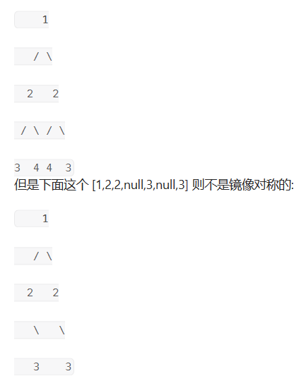
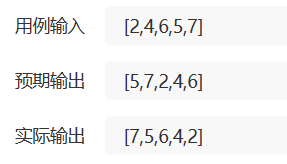
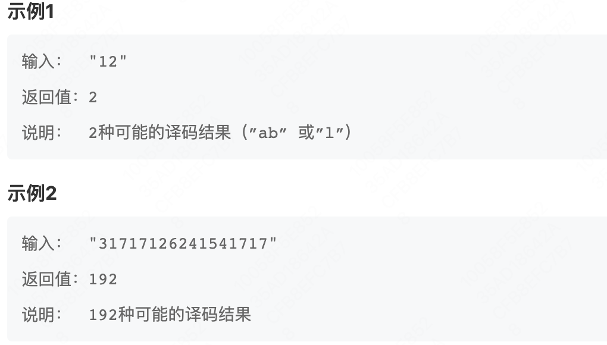
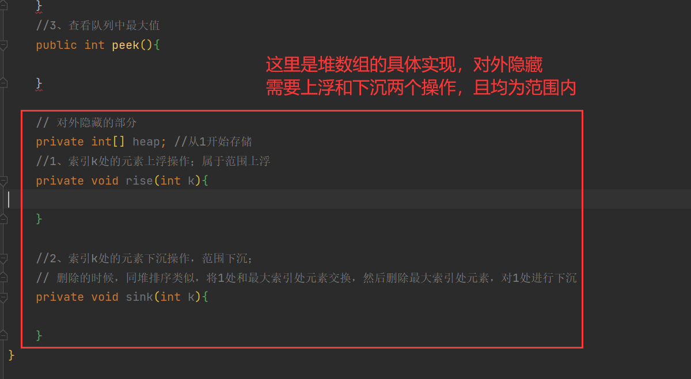
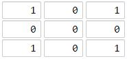
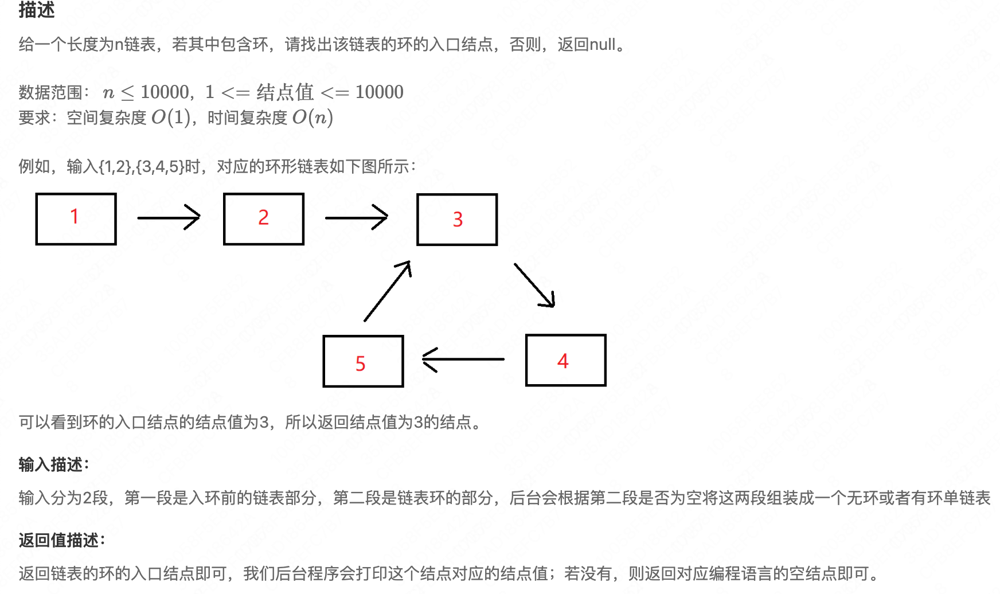
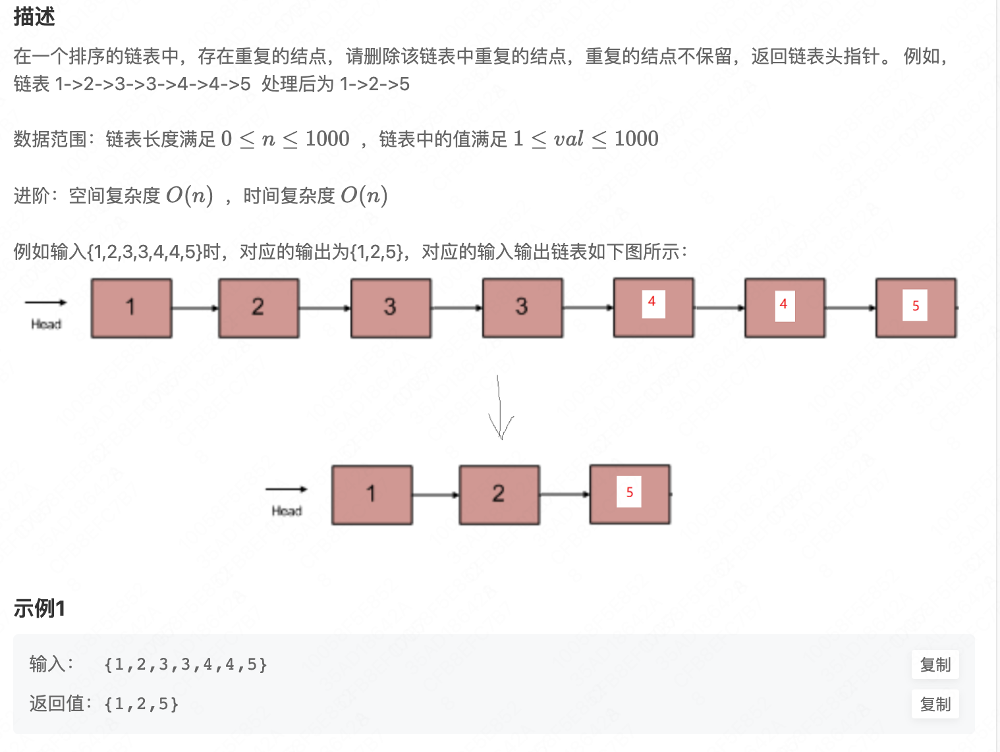

# 0、常见数字要求


- 奇数、偶数都是指的自然数，0，1，2，3，.......
- 0是偶数，满足0%2==0；
- **质数一定是2或奇数；**合数不一定是奇数或偶数，无规律（例如，8、9）
- 奇数、偶数---->>>>质数、合数没有规律；

## 质数、合数、质因子的概念均指的正整数，不含0

即求一个数的质因子时，有这个说法就肯定这个被求的数是正整数，然后1是唯一一个没有质因子的正整数。


## **1、判断一个数为素数（质数）**

素数又称[质数](https://so.csdn.net/so/search?q=质数&spm=1001.2101.3001.7020)，**大于1的正整数**，且除了1和它自身外，不能被其他正整数整除。否则称为合数（规定1既不是质数也不是合数）。

==2是质数；1不是质数也不是合数==（为什么把2单独拿出来呢，因为它无法按照正常的判断质数的逻辑去看）

判断：遍历从**2到n-1**的所有数字，判断是否有可以整除n的数字，如果没有，则为质数。（n % i == 0 ：这个就是n被i整除了）。数学证明优化：**只需要判断2到 平方根 Math.sqrt(n) 即可**

```java
// 素数是一个大于1 的自然数
public static boolean isprim(int n) {
    if (n==1) return false;
    if (n == 2) return true;
    for (int i = 2; i <= n - 1; i++) {
        if (n % i == 0) return false;
    }
    return true;
}
```


## **2 、求质因子**

（和上面的质数不一样哦）

- 质因数，指能整除给定**正整数**的**质数**。	例如，30可以被2、3、5这三个质数整除。

- 一个数可能有多个质因子，例如6的质因子是2和3，也可能只有一个质因子，例如7、11等。

- 质数 ===》》》 只有一个质因子！！！（倒过来不对）

例如：

- 只有1没有质因子。（1只能被1整除，8能被2整除）
- 5只有1个质因子，5本身。（5是质数。）
- 6的质因子是2和3。(6 = 2×3)
- 2、4、8、16等只有1个质因子：2。
- 100有2个质因子：2和5。


**【质因数分解定理】每个正整数都可以分解成若干个质数的乘积，如果一个正整数没有质因子，那么它只能是1**

```java
// 求一个正整数的所有质因子。100 ：【2，2，5，5】
// 分解质因数思路：依次从小到大选取质数2、3、5...，拿2去整除它，一直循环整除直到不能整除为止，再拿3去整除，再拿5去整除
```

```java
public static List<Integer> getprimfactor(int n){
    List<Integer> list = new ArrayList<>();
    for (int i = 2; i <= n; i++) { // 这里一定是2-n的范围选取，因为5的质因子是5
        if (!isprim(i)) continue;
        while (n % i == 0) {
            list.add(i);
            n /= i;
        }
    }
    System.out.println(list);
}
        
public static boolean isprim(int n) {
    if (n == 2) return true;
    for (int i = 2; i <= n - 1; i++) {
        if (n % i == 0) return false;
    }
    return true;
}
```


## 3、判断一个数是奇数

奇数（odd）指不能被2整除的整数 ，数学表达形式为：2k+1， 奇数可以分为正奇数和负奇数。

（规定0是偶数，且 0%2=0 即0可以被2整除，计算🆗）

```java
// 奇数有正、负之分。一个不能被2整除的整数
public boolean isOdd(int n){
    return n%2!=0;
}
```


## **4、与、或、异或、位运算**

- **&（与）**
  - 用于两个数字就是==比较二进制，都是1则为1；==
  - 用于逻辑运算符就是 两个条件都为true，结果才为true，一定会去判断两个表达式；
  - ==进位信息==
  
- **|（或）**
  - 用于两个数字就是==比较二进制位，有一个为1则为1；==
  - 用于逻辑运算符就是，两个条件有一个为true，结果为true，一定会去判断两个表达式；
  - ==无进位和==
  
- **^（异或）**
  
  - 两个数字就是==比较二进制位，当数字不相同是为1；==
  - 用于逻辑运算符，一般不用。
  
- **\>>（右移）和<<（左移）**  
  - 将二进制位进行右移或左移操作；如1 << 2
  
  **（右移）>> 运算符**  将二进制表示的整数向右移动指定的位数，同时保留符号位（即正负号）。
  
  ​	对于有符号整数，右移操作会**用符号位填充**左侧的空位，即高位保持与原值相同的符号位。
  
  > 例如，对于整数-8（二进制表示为11111111111111111111111111111000），执行右移操作-8 >> 2，结果为-2（二进制表示为11111111111111111111111111111110）。这里，符号位1被用来填充左侧的空位。
  
  **（左移）<< 运算符**  将二进制表示的整数向左移动指定的位数，并在右侧**用零填充**。
  
  ​	左移操作将整数的每个位都向左移动指定的位数，结果为原整数的值乘以2的移动位数次幂。
  
  > 例如，对于整数3（二进制表示为11），执行左移操作3 << 2，结果为12（二进制表示为1100）。这里，每个位向左移动两位，所以原值3乘以2的2次幂（即4）得到12。
  
  


## 5、int表示范围

`int的取值范围为： -2^31——2^31-1，即-2147483648——2147483647`

- 处于 10^9等级里面；十进制下十位有效，第一位为2；`2.147e9`

long的取值范围，是8个字节，64个比特，一个符号位。`-2^63——2^63-1`   9223372036854775807

- 处于10^18次方里面，第一位为9；`9.22e18`


## 6、Random

```java
Random random = new Random();
System.out.println(random.nextInt()); // int类型范围内随机
System.out.println(random.nextInt(100)); // [0, 100) 随机
System.out.println(random.nextInt(200) - 100); // [-100, 100) 随机
System.out.println(random.nextLong()); // long类型范围内随机
System.out.println(random.nextDouble()); //[0.0, 1.0)
System.out.println(random.nextBoolean()); 
```


## 7、byte的取值范围是-128到127，以及数值溢出问题

**1、byte的取值范围是-128到127**

其实很简单的理解就是：对于有符号的整数，最高位用来表示正负，即为0的话表示正的，为1表示负的；

这样对于正整数和负整数就有，7个二进制位来表示具体数值，2^7最大表示范围是127哈，按理说范围就是-127～～127，但是对于一个特殊的数字——0，他就有正0和负0，两种，这肯定是不行的，所以计算机约定将负0表示为最小的负数-2147483648。

**2、数值溢出问题**

环绕现象：在计算机中，整数类型的数值范围是有限的。当一个整数类型的变量的值超出了其数值范围时，就会发生溢出现象。在int类型中，当一个正数超出了其最大值时，会发生正数溢出，数值会从最大值变为最小值，继续增加。这种情况称为环绕现象。

例如，当int类型的值为2147483647时，再加1就会发生正数溢出，变为-2147483648。

- -2147483648 - 1 = 2147483647

- -2147483648 * 2 = 0


# 0、常用技巧

## 1. 如何使用比特位表示一个字符串中含有的不同字母

**对于仅含小写字母的情况，**因为只有26个小写字母，所以我们可以使用int类型表示，因为它有32位，去掉符号位有31位，满足要求；每一位可以表示一个小写字母，从低位到高位依次表示a,b,c,d,.....

以下是一个示例代码，演示如何使用比特位来表示字符串中包含的字母个数：

```java

    public static void main(String[] args) {
        String str = "hello";
        int count = 0;
        for (char c : str.toCharArray()) {
            if (c >= 'a' && c <= 'z') {
                int index = c - 'a';
                count |= (1 << index); // 将对应位置的比特位设为1
            }
        }
        System.out.println("字母个数表示为比特位：" + Integer.toBinaryString(count));
    }
```

在上面的示例中，我们遍历字符串中的每个字符。如果字符是小写字母，则计算出它在比特位中的索引（即字母'a'到当前字符的距离），然后将对应位置的比特位设为1。最后，我们使用`Integer.toBinaryString()`方法将整数转换为二进制字符串，并打印出来。

注意，**由于int类型是32位的**，只能表示26个小写字母的出现情况。如果需要考虑更多的字符，你可以使用**长整型`long`，它是64位的**，可以表示更多的比特位。同样的原理适用于`long`类型。


# 1、Scanner

**空格符 / TAB符 是分割符**，无论一个还是多个都是一样的，scanner的底层采用的是**正则表达式；**

**回车符是终止符**，即对于任意一个`next() or nextInt()`，无论你输入什么多长啊，内容啊，他只会在遇到了 回车符后，这条语句才会结束；

> Scanner 采用的**就是迭代器的底层实现，他会把你的输入按照空格/tab进行分割存入到集合**，然后next方法就是类似迭代器的那个next方法，只不过做了一些增强如nextInt，限制读取的类型，hasNext也是一样的，判断当前迭代器指针指向的位置有没有元素，有的话就会返回true。

**1、输入数字**

- ```java
  Scanner in = new Scanner(System.in);
  int i = in.nextInt(); //读取输入内容的第一个整数类型，以空格/tab为分隔符
  											//（底层会进行return Integer.parseInt(s, radix)）
  double v = in.nextDouble();
  float v1 = in.nextFloat();
  ```

- 

- **循环输入数字**

  也就是题目说需要输入多组数据的情况，使用`in.hasNextInt()`或者就是`for循环就行`

**字符串操作：**

- ```java
  Scanner in = new Scanner(System.in);
  //获取输入的第一个字符串（空格/tab分割 集合里面第一个）
  String next = in.next(); 
  
  //获取输入的那一整行！！这个特殊，这就是以回车键进行分割的
  String s = in.nextLine(); 
  ```

- 
- 


# 2、约瑟夫环

已知n个人坐成一圈，按顺时针由1开始给大家编号。然后由第一个人开始顺时针循环报数从1开始，数到m的人出局，然后从下一个人接着开始从1报数，循环此过程直到最后只剩一个人。给定两个int **n**和**m**，要求编写函数返回最后一个人的编号。保证n和m小于等于1000。

【单向循环链表XXXX不灵活】【双端队列去做】

```java
public static int getResult(int n, int m){
    //约瑟夫使用队列去做，直接拿双端队列
    Deque<Integer> deque = new ArrayDeque<>();
    //存入每一个人的编号，
    for (int i = 1; i <= n; i++) {
        deque.offer(i);
    }
    //依次出队列，并且报数。不踢出的就出了队列后，接着放入队列尾部，踢出去的就踢出去
    int count = 0;
    while (true){
        count++;
        Integer gay = deque.poll();
        if (count==m){
            count = 0;
        } else {
            deque.offer(gay);
        }
        // 这里判断如果队列只有一个元素了，就stop
        if (deque.size()==1){
            break;
        }
    }
    return deque.poll();
}
```

- 1、构建这个单向循环链表；一共n个人，编号就是1—n，链表的节点值就是他们的编号，然后先拿到第一个人的，因为是从他开始报数，也就是我们这个链表的头节点。

  然后for循环去构建这个节点，并且依次挂在头节点的后面；

  注意到，最后一个节点那里，在for循环内是没有指向头节点的！！所以要最后加一个！

- 2、开始约瑟夫过程；注意到这里的删除不是判断节点值啊，判断的是计数器，数到几了，和节点值无关。

  然后，删除节点就要找到被删的前一个节点！！这里有两种方案，

  第一：搞两个指针，一个指向头节点，一个指向尾节点（头节点的上一个就是尾节点）最后链表里面只有一个元素时就是，两个指针指向同一个元素，单个节点闭环了；

  **第二：直接一个指针，指向尾节点就行了，**因为我们从头节点开始判断撒，头节点的前一个不就是尾节点。

```java
import java.util.Scanner;
public class 约瑟夫1 {
    public static void main(String[] args) {
        Scanner in = new Scanner(System.in);
        String next = in.next();
        String[] split = next.split(",");
        int n = Integer.parseInt(split[0]);//n个人
        int m = Integer.parseInt(split[1]);//数到该数m出列
        //采用单向循环链表去做, 节点值是这个人的编号
        //1.构建单向循环链表
        ListNode first = new ListNode(1);
        ListNode temp = first;
        for (int i = 2; i <= n; i++) {
            ListNode node = new ListNode(i);
            temp.next = node;
            temp = temp.next;
        }
        //此时temp处于最后第n个节点,这里完成链表循环
        temp.next  = first;

        // 循环链表第一个节点（编号为1）为first；
        // 既然要删除节点，那么就需要找到被删节点的前一个才行！
        // 我们直接取第一个节点的前一个不就行了，也就是最后一个节点
        ListNode node = temp;
        int count = 0; //记录报的数字
        while (node.next!=node){ //注意第一个节点可能一来就被删啊
            count++;
            if (count==m){
                node.next = node.next.next;
                count = 0;
                continue;
            }
            //
            node = node.next;
        }
        System.out.println(node.val);
    }
}
class ListNode{
    public int val;
    public ListNode next;
    public ListNode(){};
    public ListNode(int val){this.val = val;};
}
```


# 3、约瑟夫环2

链接：https://www.nowcoder.com/questionTerminal/ff063da83b1a4d91913dd1b1e8b01466
来源：牛客网

现有n个人围坐一圈，顺时针给大家编号，第一个人编号为1，然后顺时针开始报数。第一轮依次报1，2，1，2...没报1的人出局。接着第二轮再从上一轮最后一个报数的人开始依次报1，2，3，1，2，3...没报1的人都出局。以此类推直到剩下以后一个人。现给定一个int **n**，要求返回最后一个人的编号。 

  测试样例： 

```java
5
返回：5
```

【难】这里使用链表就不行了，因为我要判断这是第几轮，所以我们使用两个双端队列！！！，先把所有人放入第一个队列，然后依次出队列，并且计数，报数为1 的就进入第二个队列，不为1的就丢弃。当1号队列为空时，说明报数完成了一轮；此时判断第二个队列是不是只有一个元素，是则结束了；不是，我们就接着再来一次，将q1、q2的指向交换，接着让q1去执行相同的操作。

```java
public class 约瑟夫2 {

    public int getResult(int n) {
        // write code here
        //1.两个队列解决这个问题，因为我们要记录循环了几次，第一个队列挨个到第二个队列里面去
        Deque<Integer> queue1 = new LinkedList<>();
        Deque<Integer> queue2 = new LinkedList<>();
        for (int i = 1; i <= n; i++) {
            queue1.offer(i);
        }
        //开始报数，报一个数出一个队列
        int count = 0; //记录报数
        int num = 1; 
        while (true) { 
          	num++;
          	if (queue1.size()==1){
                return queue1.poll();
            }
            while (!queue1.isEmpty()) { //q1全部出去了，表示一轮结束了
                count++;
                Integer gay = queue1.poll();
                if (count == 1) {
                    queue2.offer(gay);
                }
                if (count == num) {
                    count = 0;
                }
            }
            //接着第二轮再从上一轮最后一个报数的人开始依次报, 最后一个报数的在q2的尾巴啊，要把他拿到前面来，使用双端队列才行
            queue2.offerFirst(queue2.pollLast());
            // 让q1、q2交换指针指向，
            Deque<Integer> temp = queue1;
            queue1 = queue2;
            queue2 = temp;
            count = 0;
        }
    }
}
```

# 4、糖果美味值

吃第i个糖果就不能吃第i-1, i-2 , i+1 ,i+2个，每个糖果有一个美味值，求最大美味值。一共有n个糖果，每个糖果的美味值以数组形式给出。


【打家劫舍啊】最简单的线性版本；只是这里是相邻的两个不能被偷；本质上跳跃着从数组里面选数，可以左右横跳，求可以选的最大和是多少。

==易错点： 对输入的简单判断，往前考虑不往后考虑！！！==。这里相邻就意味着，选了 i 房子，就不能选 i-1、i+1的房子，这里i+1我们是不考虑的，真的是上当了，因为dp数组从前往后考虑的啊，轮到我的第 i+1的房子的时候，我就考虑到了和 i 的关系啊！！！

- dp[ i ]: 表示从i个糖果里面选，得到的最大美味值；

- 递推更简单啊

  ```java
  dp[i] = MAX( dp[i-1], dp[i-3]+value[i-1] );
  ```


# 5、火车进站系列1-判断

剑指 Offer 31. 栈的压入、弹出序列

输入两个整数序列，第一个序列表示栈的压入顺序，请判断第二个序列是否为该栈的弹出顺序。假设压入栈的所有数字均不相等。例如，序列 {1,2,3,4,5} 是某栈的压栈序列，序列 {4,5,3,2,1} 是该压栈序列对应的一个弹出序列，但 {4,3,5,1,2} 就不可能是该压栈序列的弹出序列。

**【分析】**

这里给了两个序列，并且序列内没有重复的元素（这是必须的），然后判断第二个序列有没有可能是第一个序列的出栈顺序。关键点在于：**某个火车进来之后，可以马上出去，**并不是说所有的火车都压入栈了，然后依次出去！！！

**背下来：**压栈顺序是固定的，只看压栈，但出去的顺序有很多种。

每个元素压栈之后，判断栈顶的元素是不是等于那个出栈序列的指针元素（指针先指向第一个），==假如等于就循环出栈== 将栈顶出栈，并且出栈序列指针后移，重复这个过程，直到栈顶元素不等于出栈序列指针或者栈为空了。==栈为空peek会报错==。

然后接着入栈。最后假如栈里面还有元素，那么GG，按着这个出栈顺序不行！！

> 不循环出栈的话，就会只出去一个，如12345，54321.

```java
class Solution3 {
    public boolean IsPopOrder(int [] pushA, int [] popA) {
        //先将元素入栈，然后判断栈顶元素和出栈序列的指针，如果相等则循环出栈直到不相等，最后判断栈是否为空即可。
        Stack<Integer> stack = new Stack<>();
        int p = 0;
        for (int i = 0; i < pushA.length; i++) {
            //先入
            stack.push(pushA[i]);
            //judge
            if (stack.peek() == popA[p]) {
                while (!stack.isEmpty() && stack.peek() == popA[p]) {
                    stack.pop();
                    p++;
                }
            }
        }

        return stack.isEmpty();
    }
}
```

# 6、火车进站系列2-输出

[火车进站_牛客题霸_牛客网 (nowcoder.com)](https://www.nowcoder.com/practice/97ba57c35e9f4749826dc3befaeae109?tpId=37&tqId=21300&rp=1&ru=/exam/oj/ta&qru=/exam/oj/ta&sourceUrl=%2Fexam%2Foj%2Fta%3Fpage%3D1%26pageSize%3D50%26search%3D%E7%81%AB%E8%BD%A6%26tpId%3D37%26type%3D37&difficulty=undefined&judgeStatus=undefined&tags=&title=火车)

给定一个正整数N代表火车数量，0<N<10，接下来输入火车入站的序列，一共N辆火车，每辆火车以数字1-9编号，火车站只有一个方向进出，同时停靠在火车站的列车中，只有后进站的出站了，先进站的才能出站。

要求输出所有火车出站的方案，以字典序排序输出。

输入：

```
3
1 2 3
输出：
1 2 3
1 3 2
2 1 3
2 3 1
3 2 1
```

```
第一种方案：1进、1出、2进、2出、3进、3出
第二种方案：1进、1出、2进、3进、3出、2出
第三种方案：1进、2进、2出、1出、3进、3出
第四种方案：1进、2进、2出、3进、3出、1出
第五种方案：1进、2进、3进、3出、2出、1出
请注意，[3,1,2]这个序列是不可能实现的。     
```

# 7、剑指 Offer 04. 二维数组中的查找

在一个 n * m 的二维数组中，每一行都按照从左到右 **非递减** 的顺序排序，每一列都按照从上到下 **非递减** 的顺序排序。请完成一个高效的函数，输入这样的一个二维数组和一个整数，判断数组中是否含有该整数。

**示例:**

现有矩阵 matrix 如下：

```
[
  [1,   4,  7, 11, 15],
  [2,   5,  8, 12, 19],
  [3,   6,  9, 16, 22],
  [10, 13, 14, 17, 24],
  [18, 21, 23, 26, 30]
]
```

给定 target = `5`，返回 `true`。

给定 target = `20`，返回 `false`。

【好难好难】妈的，我想的是既然都是升序排列，那么我可以先找到这个数在哪一行的范围，因为下面的列也是递增的，所以呢我们再遍历这一行，找到该元素所在的列范围，然后再往下遍历这一列就行了。其实是不对的！！！！这两个递增的含义搞混淆了，可能第二行的最大值，小于第三行的最小值呢。什么的，反正很复杂啊，这种搞不清楚的。我们就暴力就行了。

或者对每一行进行二分法查找，但是二分法要求严格递增才可以找到对应元素的位置，否则会找到多个位置，这里只要知道有没有出现，所以没关系，就用二分去做。

```java
public boolean findNumberIn2DArray(int[][] matrix, int target) {
    if (matrix.length==0) return false;
    if (matrix[0].length==0) return false;
    int row = matrix.length;
    int col = matrix[0].length;
    //每一行是非递减的，可以使用二分去做，半暴力
    for (int i = 0; i < row; i++) {
        //这里是二分法的实现，我草，差一点写错了还
        int left = 0;
        int right = col-1;
        int mid = (left+right)/2;
        while (left<=right){
            if (matrix[i][mid]==target){
                return true;
            }else if(target>matrix[i][mid]){
                left = mid+1;
                mid = (left+right)/2;
            }else {
                right = mid-1;
                mid = (left+right)/2;
            }
        }
    }
    return false;
}
```


# 8、剑指offer11. 旋转数组的最小数字✅

把一个数组最开始的若干个元素搬到数组的末尾，我们称之为数组的旋转。

给你一个可能存在 **重复** 元素值的数组 `numbers` ，它原来是一个升序排列的数组，并按上述情形进行了一次旋转。请返回旋转数组的**最小元素**。例如，数组 `[3,4,5,1,2]` 为 `[1,2,3,4,5]` 的一次旋转，该数组的最小值为 1。 注意，数组 `[a[0], a[1], a[2], ..., a[n-1]]` 旋转一次 的结果为数组 `[a[n-1], a[0], a[1], a[2], ..., a[n-2]]` 。


**示例 1：**

```
输入：numbers = [3,4,5,1,2]
输出：1
```

 【这道题目】越看越奇怪啊，其实就是原来是非递减的数组，然后我们搞了一个环形，取了前面的放到数组的末尾，导致最后数组会先递增然后下降一下，然后又递增了（非严格），这个下降的点就是那个最小的数字啊。

```java
    public int minNumberInRotateArray(int [] array) {
        //直接从前往后判断，如果一直递增，说最小数字是第一个；否则找到第一个非递增的点即可
        int ans = array[0];
        for(int i=0; i < array.length-1; i++){
            if(array[i+1]>=array[i]){}
            else{
                ans = array[i+1];
                break;
            }
        }

        return ans;
    }
```

简言之：旋转数组=两个升序数组的组合；例如**【34512】**这个；其实这种类型的题目查找最小值啊、或者查找某**一个元素啊，可以使用二分法。**暴力也可以就是只能过20%样例。


看不懂啊！[剑指 Offer 11. 旋转数组的最小数字 - 力扣（Leetcode）](https://leetcode.cn/problems/xuan-zhuan-shu-zu-de-zui-xiao-shu-zi-lcof/solutions/340801/xuan-zhuan-shu-zu-de-zui-xiao-shu-zi-by-leetcode-s/)

最后，left、right相等的时候，那就是答案。所以不要进行最后相等时的判断。

```java
    public int getRes(int[] numbers) {
        // 首先这里数组元素会有重复的的，会稍微复杂一点点
        // 本质上就是两段升序数组拼凑起来，找最小值；我们可以使用二分法。
        int left = 0;
        int right = numbers.length - 1;
        int mid = left + (right - left) / 2; //防止数值溢出
        while (left < right) {
            if (numbers[mid] > numbers[right]){
                // 说明，mid以及它的左边部分肯定是递增的，下一次搜索应该是【mid+1，right】肯定不包括mid这个点的，因为我们找的是最小值
                left = mid+1;
                mid = left + (right - left) / 2;
            } else if (numbers[mid] < numbers[right]) {
                // 说明，mid以及它右边的部分是递增的，包括mid在里面，那是不是也可能这个mid点就是最小值，所以下一次搜索区间应该是【left，mid】
                right = mid;
                mid = left + (right - left) / 2;
            }else {
                // 这里是重复元素的情况，比较复杂。我们可以简单理解为一段上升+一段平行，此时最小值是左边还是右边就无法确定了，方法就是缩小区间，去掉right值的判断
                // 因为我们知道mid=right的值，假如这个相等的值就是最小的，那也不影响，因为我们去掉right值的区间有最小值
                right--;
                mid = left + (right - left) / 2;
            }
        }
        return numbers[mid];
    }
```


# 9、剑指12. 矩阵中的路径

给定一个 `m x n` 二维字符网格 `board` 和一个字符串单词 `word` 。如果 `word` 存在于网格中，返回 `true` ；否则，返回 `false` 。

单词必须按照字母顺序，通过相邻的单元格内的字母构成，其中“相邻”单元格是那些水平相邻或垂直相邻的单元格。同一个单元格内的字母不允许被重复使用。

例如，在下面的 3×4 的矩阵中包含单词 "ABCCED"（单词中的字母已标出）。


 

**示例 1：**

```
输入：board = [["A","B","C","E"],["S","F","C","S"],["A","D","E","E"]], word = "ABCCED"
输出：true
```

【经典的矩阵DFS：属于递归算法】

由于我们要进行匹配字符串，所以有**回溯的操作**，比较难！！使用 **深度优先搜索（DFS）+ 回溯** 解决。我们就是暴力搜索矩阵里面的每一个点，然后每个点可以往他的上下左右四个方向进行查找。


这个点可以是矩形中的任何一个点，所以代码的大致轮廓我们应该能写出来，就是遍历矩形所有的点，然后从这个点开始往他的4个方向走，因为是二维数组，所以有两个for循环，代码如下：

```java
public boolean hasPath (char[][] matrix, String word) {
    char[] words = word.toCharArray();
    for (int i = 0; i < matrix.length; i++) {
        for (int j = 0; j < matrix[0].length; j++) {
            //从[i,j]这个坐标开始查找。会遍历矩阵的每一个点
            if (dfs(matrix, words, i, j, 0))
                return true;
        }
    }
    return false;
}
```

这里关键代码是dfs这个函数，因为每一个点我们都可以往他的4个方向查找，所以我们可以把它想象为一棵4叉树，就是每个节点有4个子节点，而树的遍历我们最容易想到的就是递归，我们来大概看一下

```java
// 返回值：从当前的【i，j】位置开始搜索，能否搜到匹配路径
boolean dfs(char[][] board, char[] word, int i, int j, int index) {
    if (边界条件的判断) {
        return;
    }

    一些逻辑处理

    boolean res;
    //往右
    res = dfs(board, word, i + 1, j, index + 1)
    //往左
    res |= dfs(board, word, i - 1, j, index + 1)
    //往下
    res |= dfs(board, word, i, j + 1, index + 1)
    //往上
    res |= dfs(board, word, i, j - 1, index + 1)
    //上面4个方向，只要有一个能查找到，就返回true；
    return res;
}
```


```java
class Solution6 {
    public boolean exist(char[][] board, String word) {
        //矩阵搜索路径类型，每个点可以上下左右搜索。采用两个for去暴力搜索
        // dfs的返回值意义是：从当前【i，j】节点开始搜索，有没有完成字符串的匹配
        int m = board.length;
        int n = board[0].length;
      	visited = new boolean[m][n];
        int index = 0;
        for (int i = 0; i < m; i++) {
            for (int j = 0; j < n; j++) {
                boolean dfs = dfs(board, i, j, word, index);
                if (dfs) return true; //有一个为true即可
            }
        }
        return false;
    }

    //index 表示当前匹配的字符索引，i，j是当前所在格子，
  	boolean[][] visited;
    private boolean dfs(char[][] board, int i, int j, String word, int index) {
        //i、j越界；当前字符和矩阵i，j字符不匹配
        if (i<0||i>board.length-1 || j<0||j>board[0].length-1){
            return false;
        }
      	if (visited[i][j]) { //已经访问过 
            return false;
        }
      	if(word.charAt(index)!=board[i][j]){
          	return false;
        }
        //注意这里不能判断index == word.length()这个条件哦，
        if (index == word.length()-1){// 因为可能全部匹配上了，但是被上面条件提前截取了
            return true;
        }
        //处理、递归、回溯;
        visited[i][j] = true; //防止重复匹配，标记已访问
        boolean res = dfs(board, i+1, j, word, index+1)  //上下左右搜索
                || dfs(board, i-1, j, word, index+1)
                || dfs(board, i, j+1, word, index+1)
                || dfs(board, i, j-1, word, index+1);
        visited[i][j] = false; //回溯
        return res;
    }
}
```


# 10、面试题13. 机器人的运动范围

地上有一个m行n列的方格，从坐标 `[0,0]` 到坐标 `[m-1,n-1]` 。一个机器人从坐标 `[0, 0] `的格子开始移动，它每次可以向左、右、上、下移动一格（不能移动到方格外），也不能进入行坐标和列坐标的数位之和大于k的格子。例如，当k为18时，机器人能够进入方格 [35, 37] ，因为3+5+3+7=18。但它不能进入方格 [35, 38]，因为3+5+3+8=19。请问该机器人能够到达多少个格子？


【典型的矩阵搜索问题——DFS】采用深度优先搜索解决；

我们只需要从矩阵的左上角【0，0】开始搜索，挨个去判断他的邻接点能不能到达，然后递归即可。并且使用一个变量记录到达的点数量。不需要进行匹配，没有回溯的操作，比上面那个题目简单一点。

[面试题13. 机器人的运动范围 - 力扣（Leetcode）](https://leetcode.cn/problems/ji-qi-ren-de-yun-dong-fan-wei-lcof/solutions/191527/ji-qi-ren-de-yun-dong-fan-wei-by-leetcode-solution/)

[面试题13. 机器人的运动范围 - 力扣（Leetcode）](https://leetcode.cn/problems/ji-qi-ren-de-yun-dong-fan-wei-lcof/solutions/1448376/by-da-fei-de-tian-kong-dhms/)


```java
class Solution {
    // m,n——矩阵的大小，k障碍物标记
    public int movingCount(int m, int n, int k) {
        boolean[][] visited = new boolean[m][n];
        //从这个【0，0】位置开始搜索即可
        dfs(m,n,k,0,0,visited);
        return result;
    }

    //需要一个visited数组，标识已经到达过的点，防止重复到达，因为每个点均可以上下左右四个方向搜索
    //i,j表示当前机器人想到达的点，
    int result = 0;
    public void dfs(int m, int n, int k, int i, int j, boolean[][] visited) {
        //2.终止条件。如果该点越界或者有障碍物或已经到达过，那么就无法到达，return
        if (i < 0 || i > m - 1 || j < 0 || j > n - 1 || getSum(i)+getSum(j)>k
        || visited[i][j]==true){
            return;
        }
        //到这一步，说明该点可以到达。上下左右四个方向
        visited[i][j] = true;
        result++;
        dfs(m, n, k, i+1, j, visited);
        dfs(m, n, k, i-1, j, visited);
        dfs(m, n, k, i, j+1, visited);
        dfs(m, n, k, i, j-1, visited);
    }

    //函数：获取某个数的数位之和
    public int getSum(int num) {
        int sum = 0;
        while (num != 0) {
            int i = num % 10;
            sum += i;
            num = num / 10;
        }
        return sum;
    }
}
```


# 11、重建二叉树

输入某二叉树的前序遍历和中序遍历的结果，请构建该二叉树并返回其根节点。

假设输入的前序遍历和中序遍历的结果中都不含重复的数字。

**示例 1:**


```
Input: preorder = [3,9,20,15,7], inorder = [9,3,15,20,7]
Output: [3,9,20,null,null,15,7]
```

```java
class Solution {
    //前序遍历和中序遍历
    public TreeNode buildTree(int[] preorder, int[] inorder) {
        //1、终止条件，当数组长度为0时，返回挂载的节点为null
        //2、后序找到根节点
        //3.根据根节点的数值划分中序遍历，得到左子树中序遍历、右子树中序遍历
        //4.根据左子树中序遍历长度，划分后序数组，得到左子树后序遍历、右子树后序遍历
        //5.递归左子树构建，递归右子树构建，得到左子树、右子树
        //6.将左子树、右子树挂载到根节点
        if (preorder.length==0){
            return null;
        }
        //1.
        int rootValue = preorder[0];
        TreeNode root = new TreeNode(rootValue);
        //2.
        int index = 0; //根节点在中序数组的索引
        for (int i = 0; i < inorder.length; i++) {
            if (inorder[i] == rootValue) {
                index = i;
                break;
            }
        }
        int[] leftInorder = Arrays.copyOfRange(inorder, 0, index);
        int[] rightInorder = Arrays.copyOfRange(inorder, index + 1, inorder.length);
        //3.
        int[] leftPreorder = Arrays.copyOfRange(preorder, 1, 1 + leftInorder.length);//左闭右开
        int[] rightPreorder = Arrays.copyOfRange(preorder, 1 + leftPreorder.length, preorder.length);
        //4.
        TreeNode left = buildTree(leftPreorder, leftInorder);
        TreeNode right = buildTree(rightPreorder, rightInorder);
        //5.
        root.left = left;
        root.right = right;
        return root;
    }
}

class TreeNode {
    int val;
    TreeNode left;
    TreeNode right;

    TreeNode(int x) {
        val = x;
    }
}
```


# 12、剑指 Offer 14- I. 剪绳子

给你一根长度为 `n` 的绳子，请把绳子剪成整数长度的 `m` 段（m、n都是整数，n>1并且m>1），每段绳子的长度记为 `k[0],k[1]...k[m-1]` 。请问 `k[0]*k[1]*...*k[m-1]` 可能的最大乘积是多少？例如，当绳子的长度是8时，我们把它剪成长度分别为2、3、3的三段，此时得到的最大乘积是18。

- `2 <= n <= 58`

【贪心就是：当n大于4时，持续拆分成多个3，假如最后剩下1、2、3、4就不再拆分了】

```java
class Solution {
    //这就是一个整数拆分的题目啊，根据贪心就是 拆分成n个3，如果最后一个数是4就保留下来，不再拆分；
    public int cuttingRope(int n) {
        if (n<2) return -1;
        //递推公式是两个for，j是拆分出的第一个正整数，1<=j<n的，因为最少拆分成两个啊,
        //那么就是j、i-j这两个部分，我们接下来只看一个 i-j 能不能继续拆分即可，两种情况+自身的dp[i]三个进行对比
        int[] dp = new int[n + 1];//dp[i]表示的是长度为i的绳子能得到的最大乘积
        //3.
        dp[0] = 0;
        dp[1] = 0;
        dp[2] = 1;
        //2.dp[i] = MAX( j*(i-j), j*dp[i-j] )
        for (int i = 3; i < dp.length; i++) {
            for (int j = 1; j < i; j++) {
                //为什么要和dp[j]比较，因为这个要被执行很多次，在forj的循环下
                dp[i] = Math.max(dp[i], Math.max( j * (i - j), j * dp[i - j]));
            }
        }
        return dp[n];
    }
}
```

```java
public int cuttingRope2(int n) {
    if (n<2) return -1;
    if (n==2) return 1;
    if (n==3) return 2;
    if (n==4) return 4;
    //大于3的时候去拆分下面的
    int res = 1;
    while (n>4){
        n = n-3;
        res = res * 3;
    }
    res = res * n;
    return res;
}
```


# 13、剑指 Offer 14- II. 剪绳子 II

给你一根长度为 `n` 的绳子，请把绳子剪成整数长度的 `m` 段（m、n都是整数，n>1并且m>1），每段绳子的长度记为 `k[0],k[1]...k[m - 1]` 。请问 `k[0]*k[1]*...*k[m - 1]` 可能的最大乘积是多少？例如，当绳子的长度是8时，我们把它剪成长度分别为2、3、3的三段，此时得到的最大乘积是18。

答案需要取模 1e9+7（1000000007），如计算初始结果为：1000000008，请返回 1。

- `2 <= n <= 1000`

此题与 面试题14- I. 剪绳子 主体等价，唯一不同在于**本题目涉及 “大数越界情况下的求余问题”** 。 建议先做上一道题，在此基础上再研究此题目的大数求余方法。乍一看去题目没有多大变化，我直接套用上一题的代码，最后结果取余，没想到直接答案错误。原来本题n的范围变大了，导致int类型范围无法存储，

**另外，10 ^ 9+7这个数好像经常用用于取模，为什么是这么数字，我查了一下大概是这么说的，一方面，该数字要足够大，另一方面，需要是一个大的质数来减少冲突。而10^9+7这个数字，相加不超过 int32，相乘不超过 int64. 一般来说x的选取只要10^x＋7保证比初始输入数据的范围大就可以。比如有些数据范围小的题为了避免用long long而把模数设定为10007。**写的有点凌乱，但大概是明白了。这道题中主要用到 10^9+7 相乘不超过 int64。


【贪心】

```java
class Solution {
    public int cuttingRope(int n) {
        if (n<2) return -1;
        if (n==2) return 1;
        if (n==3) return 2;
        if (n==4) return 4;
				//必须是long这里
        long res = 1;
        while (n>4){
            n = n-3;
            res = res * 3 %1000000007;
        }
        res = res * n %1000000007;
        return (int)res; //最后转成int
    }
}
```


# 14、剑指 Offer 25. 合并两个排序的链表

输入两个递增排序的链表，合并这两个链表并使新链表中的节点仍然是递增排序的。

**示例1：**

```
输入：1->2->4, 1->3->4
输出：1->1->2->3->4->4
```

**限制：**

```
0 <= 链表长度 <= 1000
```

【新建虚拟头节点时】，我们从头节点开始遍历，终止条件是：``while (temp.next != null) { //到达尾节点时，已经全部遍历了一遍``，先处理 `temp.next`节点，然后再移动temp指针，temp指针每次执行的是被处理节点的前一个位置；

【不新建虚拟头节点时】，我们从第一个节点开始遍历，终止条件是：`while (temp!=null){// 到达尾节点的下一个null时，全部遍历一遍`，先处理当前 `temp`节点，然后移动指针；temp指针指向被处理的当前节点

```java
class Solution {
    public ListNode mergeTwoLists(ListNode l1, ListNode l2) {
        //如果两个链表长度为0
        if (l1==null) return l2;
        if (l2==null) return l1;
        //1.新建虚拟头节点
        ListNode rhead = new ListNode(-1);
        ListNode temp = rhead;
        //2.依次比较两个链表节点,这里就不新建虚拟头节点了
        while (l1!=null && l2!=null){
            if (l1.val<=l2.val){
                temp.next = l1;
                temp = temp.next;
                l1 = l1.next;
            }else {
                temp.next = l2;
                temp = temp.next;
                l2 = l2.next;
            }
        }
        //此时有一个不为空，
        while (l1!=null){
            temp.next = l1;
            temp = temp.next;
            l1 = l1.next;
        }
        while (l2!=null){
            temp.next = l2;
            temp = temp.next;
            l2 = l2.next;
        }
        return rhead.next;
    }
}
```

# 15、剑指 Offer 26. 树的子结构

输入两棵二叉树A和B，判断B是不是A的子结构。(约定空树不是任意一个树的子结构)

B是A的子结构， 即 A中有出现和B相同的结构和节点值。


【难】（即每个节点为根节点的A子树和B去匹配，就是两棵树的匹配问题，匹配规则是完全一样）

 判断两棵树是否完全相同，直接前序遍历即可，很简单的；

```java
public class Solution {
    public boolean HasSubtree(TreeNode root1,TreeNode root2) {
        if(root2==null){ //空树不是任意一个树的子结构
            return false;
        }
        preOrderA(root1,root2);
        return ans;
    }
  	
    private boolean ans = false;
    // 前序遍历每个A的节点，依次判断每个A的子树是否与B树相等
    public void preOrderA(TreeNode node, TreeNode root2){
        if(node==null){
            return;
        }
        if(ans){
            return;
        }
        if(preOrder(node,root2)){
            ans = true;
            return;
        }
        preOrderA( node.left , root2);
        preOrderA( node.right , root2);
    }

    // 判断两棵树是否完全相等
    public boolean preOrder(TreeNode node1, TreeNode node2){
        if(node1==null && node2==null){
            return true;
        }
        if(node2==null){ //第二颗树匹配完了
            return true;
        }
        if(node1==null){
            return false;
        }
        if(node1.val != node2.val){
            return false;
        }
        return preOrder(node1.left,node2.left) && preOrder(node1.right, node2.right);
    }
}
```

# 16、剑指 Offer 27. 二叉树的镜像


```java
/**
 * Definition for a binary tree node.
 * public class TreeNode {
 *     int val;
 *     TreeNode left;
 *     TreeNode right;
 *     TreeNode(int x) { val = x; }
 * }
 */
class Solution12 {
    public TreeNode Mirror (TreeNode pRoot) {
        afterOrder(pRoot);
        return pRoot;
    }
    // 后续遍历，递归挂载即可
    public TreeNode afterOrder (TreeNode root) {
        if(root == null){
            return null;
        }
        TreeNode left = afterOrder(root.left);
        TreeNode right = afterOrder(root.right);
        root.left = right;
        root.right = left;
        return root;
    }
}
```


# 17、剑指 Offer 28. 对称的二叉树

请实现一个函数，用来判断一棵二叉树是不是对称的。如果一棵二叉树和它的镜像一样，那么它是对称的。

例如，二叉树 [1,2,2,3,4,4,3] 是对称的。



【分析】直接判断根节点下面的左右子树是否完全相同就行了啊，很简单！！！前序方式判断完全相同。

```java
    public boolean isSymmetrical (TreeNode pRoot) {
        // write code here
        if(pRoot==null) return true;
        return isSample(pRoot.left, pRoot.right);
    }

    public boolean isSample(TreeNode node1, TreeNode node2){
        if(node1 == null && node2 == null){ // 同时走到叶子节点
            return true;
        }
        if(node1==null || node2==null){ // 一个走到叶子，一个不到叶子
            return false;
        }
        if(node1.val != node2.val){ // 两个节点值不相同
            return false;
        }
        return isSample(node1.left,node2.right) && isSample(node1.right,node2.left);
    }
```


# 18、剑指 Offer 20. 表示数值的字符串

请实现一个函数用来判断字符串是否表示**数值**（包括整数和小数）。

**数值**（按顺序）可以分成以下几个部分：

1. 若干空格
2. 一个 **小数** 或者 **整数**
3. （可选）一个 `'e'` 或 `'E'` ，后面跟着一个 **整数**
4. 若干空格

**小数**（按顺序）可以分成以下几个部分：

1. （可选）一个符号字符（`'+'` 或 `'-'`）
2. 下述格式之一：
   1. 至少一位数字，后面跟着一个点 `'.'`
   2. 至少一位数字，后面跟着一个点 `'.'` ，后面再跟着至少一位数字
   3. 一个点 `'.'` ，后面跟着至少一位数字

**整数**（按顺序）可以分成以下几个部分：

1. （可选）一个符号字符（`'+'` 或 `'-'`）
2. 至少一位数字

部分**数值**列举如下：

- `["+100", "5e2", "-123", "3.1416", "-1E-16", "0123"]`

部分**非数值**列举如下：

- `["12e", "1a3.14", "1.2.3", "+-5", "12e+5.4"]`


```java
public boolean isNumber(String s){
    //预处理，去掉空格
    if (s==null || s.length()==0) return false;
    char[] chars = s.trim().toCharArray();

    //挨个判断；
    //1、对于点. 只能出现一次，一种是纯小数，一种是出现在e的前面；
    //2、对于e，只能出现一次，e的前面必须出现数，e的后面必须出现整数（可以带符号）
    //3、对于+-，只能出现在第一个位置，或者出现在e的后面第一个位置
    //4、对于数字，只能是0-9
    boolean numFlag = false;
    boolean dotFlag = false;
    boolean eFlag = false;
    for (int i = 0; i < chars.length; i++) {
        if (chars[i]=='.'){
            // 这里只判断不成立的情况；点前面不能出现e，也不能再出现点
            if (eFlag || dotFlag) {
                return false;
            }
            dotFlag = true;
        }else if (chars[i]=='e' || chars[i]=='E'){
            //这里只判断不成立的情况；e前面不能出现e，且前面必须出现了数字
            if (eFlag || !numFlag){
                return false;
            }
            eFlag = true;
            numFlag = false; //出现了e之后，后面必须再出现整数。出现了点后面不一定要出现整数
        }else if (chars[i]=='+' || chars[i]=='-'){
            //只有两种情况才是对的，其他都是不成立
            if (i!=0 && chars[i-1]!='e' && chars[i-1]!='E'){
                return false;
            }
        }else if (chars[i]>='0' && chars[i]<='9'){
            numFlag = true;
        }else { //出现其他字符均错误
            return false;
        }
    }
    return numFlag; //这里很重要哦，一定是返回numFlag，
}
```


# 19、剑指 Offer 21. 调整数组顺序使奇数位于偶数前面(1)✅

输入一个整数数组，实现一个函数来调整该数组中数字的顺序，使得所有奇数在数组的前半部分，所有偶数在数组的后半部分。

**示例：**

```
输入：nums = [1,2,3,4]
输出：[1,3,2,4] 
注：[3,1,2,4] 也是正确的答案之一。
```

要求：时间复杂度 O*(*n)，空间复杂度 O(1)

**提示：**

1. `0 <= nums.length <= 50000`
2. `0 <= nums[i] <= 10000`

```java
class Solution19 {
    // 快慢指针
    public int[] exchange(int[] nums) {
        int slow = 0;
        int fast = 0;
        while(fast < nums.length){ // 终止条件就是fast遍历完所有的元素
            if(nums[fast]%2 == 0){
                fast++;
                continue;
            }
            int temp = nums[fast];
            nums[fast] = nums[slow];
            nums[slow] = temp;
            slow++;
            fast++;
          // 这里不用有一个顾虑啊，就是交换之后，fast指针是不是要后移，新换上的元素要不要判断，这里是不用的，因为fast前面的肯定都是b
        }
        return nums;
    }
}


    public int[] exchange(int[] nums) {
        if(nums.length==0) return nums;
        // 左右双指针，左边是奇数
        int left = 0;
        int right = nums.length - 1;
        while (true) {
            //1.left找偶数
            while (left<nums.length && nums[left] % 2 != 0) {
                left++;
            }
            //2.right找奇数
            while (right >=0 && nums[right] % 2 == 0) {
                right--;
            }
            //3.判断。这里只要left大于了right就说明两边已经分好了
            if(left>right){
                return nums;
            }
            //4.交换指针，但不需要移动它了，因为left指针现在偶数了，
            int temp = nums[left];
            nums[left] = nums[right];
            nums[right] = temp;
        }
    }
```

**上面的做法无法保证元素的相对顺序，例如看一个例子：**




# 19-2、调整数组顺序使奇数位于偶数前面(2)✅

输入一个整数数组，实现一个函数来调整该数组中数字的顺序，使得所有奇数在数组的前半部分，所有偶数在数组的后半部分。

并保证奇数和奇数，偶数和偶数之间的相对位置不变。

要求：时间复杂度 O*(*n)，空间复杂度 O(*n*)

进阶：时间复杂度 O*(*n2)，空间复杂度 O(1)


【】这里要求元素的相对有序，上面的双指针和快慢指针就不行了啊，怎么搞呢？

​		**要保证有序性，一次遍历就无法保证了**

只能使用遍历几次，第一次遍历找到奇数，第二次遍历找到偶数，然后两个数组拼接起来即可。


# 20、剑指 Offer 15. 二进制中1的个数✅

编写一个函数，输入是一个无符号整数（以二进制串的形式），返回其二进制表达式中数字位数为 '1' 的个数。


【就是位运算】输入的是一个int类型，一共4个字节，32个比特位，挨个判断即可。从第1个比特开始判断，它是不是1。

```java

    public int NumberOf1 (int n) {
        // 直接拿1和每一位进行&就行了
        int ans = 0;
        for (int i = 0; i < 32; i++) {
            int num = n >> i;
            ans += num & 1;
        }
        return ans;
    }
```


# 21、剑指 Offer 29. 顺时针打印矩阵

输入一个矩阵，按照从外向里以顺时针的顺序依次打印出每一个数字。

**示例 1：**

```java
输入：matrix = [[1,2,3],[4,5,6],[7,8,9]]
输出：[1,2,3,6,9,8,7,4,5]
```

【就是螺旋矩阵撒，之前写过填充版本，这是读取版本】

```java
public int[] spiralOrder(int[][] matrix) {
    if (matrix==null) return null;
    if (matrix.length==0) return new int[0];
    if (matrix[0].length==0) return new int[0];
    // 至少有一行一列，防止索引越界
    // 重点就是 定义4个边界出来
    int m = matrix.length;
    int n = matrix[0].length;
    int l = 0;
    int r = n-1;
    int t = 0;
    int b = m-1;
    int k = 0;
    int[] nums = new int[m*n];
    // 循环结束条件，每次边界发生变化都要判断，是l>r || t>b 。
    while (true){
        //左到右、上到下、右到左、下到上
        for (int i = l; i <=r ; i++) {
            nums[k] = matrix[t][i];
            k++;
        }
        t++;
        if (l>r||t>b) break;
        //左到右、上到下、右到左、下到上
        for (int i = t; i <=b ; i++) {
            nums[k] = matrix[i][r];
            k++;
        }
        r--;
        if (l>r||t>b) break;
        //左到右、上到下、右到左、下到上
        for (int i = r; i >=l ; i--) {
            nums[k] = matrix[b][i];
            k++;
        }
        b--;
        if (l>r||t>b) break;
        //左到右、上到下、右到左、下到上
        for (int i = b; i >=t ; i--) {
            nums[k] = matrix[i][l];
            k++;
        }
        l++;
        if (l>r||t>b) break;
    }
    return nums;
}
```


# 22、螺旋矩阵

给你一个正整数 `n` ，生成一个包含 `1` 到 `n2` 所有元素，且元素按顺时针顺序螺旋排列的 `n x n` 正方形矩阵 `matrix` 。

**示例 1：**


```
输入：n = 3
输出：[[1,2,3],[8,9,4],[7,6,5]]
```


```java
public int[][] generateMatrix(int n) {
    if (n<1) return new int[0][0];
    // 至少有一行一列，防止索引越界。一共有 n*n个数字
    int[][] matrix = new int[n][n];
    // 重点就是 定义4个边界出来
    int l = 0;
    int r = matrix[0].length-1;
    int t = 0;
    int b = matrix.length-1;
    // 循环结束条件，每次边界发生变化都要判断，是l>r || t>b 。
    int num = 1;
    while (true){
        //左到右、上到下、右到左、下到上
        for (int i = l; i <=r ; i++) {
            matrix[t][i] = num;
            num++;
        }
        t++;
        if (l>r||t>b) break;
        //左到右、上到下、右到左、下到上
        for (int i = t; i <=b ; i++) {
            matrix[i][r] = num;
            num++;
        }
        r--;
        if (l>r||t>b) break;
        //左到右、上到下、右到左、下到上
        for (int i = r; i >=l ; i--) {
            matrix[b][i] = num;
            num++;
        }
        b--;
        if (l>r||t>b) break;
        //左到右、上到下、右到左、下到上
        for (int i = b; i >=t ; i--) {
            matrix[i][l] = num;
            num++;
        }
        l++;
        if (l>r||t>b) break;
    }
    return matrix;
}
```

# 23、剑指 Offer 22. 链表中倒数第k个节点

输入一个链表，输出该链表中倒数第k个节点。为了符合大多数人的习惯，本题从1开始计数，即链表的尾节点是倒数第1个节点。

例如，一个链表有 `6` 个节点，从头节点开始，它们的值依次是 `1、2、3、4、5、6`。这个链表的倒数第 `3` 个节点是值为 `4` 的节点。

**示例：**

```
给定一个链表: 1->2->3->4->5, 和 k = 2.

返回链表 4->5.
```

【新建虚拟头节点时】，我们从头节点开始遍历，终止条件是：``while (temp.next != null) { //到达尾节点时，已经全部遍历了一遍``，先处理 `temp.next`节点，然后再移动temp指针，temp指针每次执行的是被处理节点的前一个位置；

【不新建虚拟头节点时】，我们从第一个节点开始遍历，终止条件是：`while (temp!=null){// 到达尾节点的下一个null时，全部遍历一遍`，先处理当前 `temp`节点，然后移动指针；temp指针指向被处理的当前节点

```java
/**
 * Definition for singly-linked list.
 * public class ListNode {
 *     int val;
 *     ListNode next;
 *     ListNode(int x) { val = x; }
 * }
 */
		// 这道题使用虚拟头节点当输入的k不合法时，会有很多问题
    public ListNode FindKthToTail (ListNode pHead, int k) {
        // write code here
        //快慢指针、栈
        ListNode slow = pHead;
        ListNode fast = pHead;
        for (int i = 0; i < k; i++) {
            if (fast == null) { //输入k不合法
                return null;
            }
            fast = fast.next;
        }
        while (fast != null) {
            slow = slow.next;
            fast = fast.next;
        }
        return slow;
    }

class Solution {
    public ListNode getKthFromEnd(ListNode head, int k) {
        // 虚拟头节点，采用间隔指针即可
        ListNode rhead = new ListNode(-1);
        rhead.next = head;
        //快指针指向最后一个节点时，慢指针少移动k-1次，倒数第k个节点
        ListNode fast = rhead;
        ListNode slow = rhead;
        for (int i = 0; i < k-1; i++) {
            fast = fast.next; //先移动k-1次
        }
        while (fast.next!=null){
            //先处理再移动，这里没有要处理的
            fast = fast.next;
            slow = slow.next;
        }
        //此时slow指向倒数第k个节点
        return slow;
    }
}
```


# 24、剑指 Offer 16. 数值的整数次方

实现 [pow(*x*, *n*)](https://www.cplusplus.com/reference/valarray/pow/) ，即计算 x 的 n 次幂函数（即，xn）。不得使用库函数，同时不需要考虑大数问题。

**示例 1：**

```
输入：x = 2.00000, n = 10
输出：1024.00000
```

**示例 2：**

```
输入：x = 2.10000, n = 3
输出：9.26100
```

【暴力解法】

```java
public double getResult(double x, int n) {
    if (x == 1.0) return 1.0;
    if (x == 0) return 0;
    if (n == 0) return 1;
    double res = 1.0;
    for (int i = 0; i < Math.abs(n); i++) {
        res = res * x;
    }
    return n < 0 ? 1.0 / res : res;
}
```

【正确解法】

[剑指 Offer 16. 数值的整数次方 - 力扣（Leetcode）](https://leetcode.cn/problems/shu-zhi-de-zheng-shu-ci-fang-lcof/solutions/1398793/shu-zhi-de-zheng-shu-ci-fang-by-leetcode-yoqr/)

[剑指 Offer 16. 数值的整数次方 - 力扣（Leetcode）](https://leetcode.cn/problems/shu-zhi-de-zheng-shu-ci-fang-lcof/solutions/373629/fei-di-gui-he-di-gui-de-liang-chong-jie-jue-fang-s/)

```java
public double myPow(double x, int n) {
    double result = 1.0;
    for (int i = n; i != 0; i /= 2) {
        x *= x;
        if (i % 2 != 0) {
            //i是奇数
            result *= x;
        }
    }
    return n < 0 ? 1.0 / result : result;
}
```


# 25、剑指 Offer 17. 打印从1到最大的n位数

输入数字 `n`，按顺序打印出从 1 到最大的 n 位十进制数。比如输入 3，则打印出 1、2、3 一直到最大的 3 位数 999。

**示例 1:**

```
输入: n = 1
输出: [1,2,3,4,5,6,7,8,9]
```

说明：

- 用返回一个整数列表来代替打印
- n 为正整数

【暴力解法】

```java
class Solution25{
    public int[] getResult(int n){
        //2--两个9
        StringBuilder stringBuilder = new StringBuilder();//创建一个空字符串
        for (int i = 0; i < n; i++) {
            stringBuilder.append(9);
        }
        int Maxnum = Integer.parseInt(String.valueOf(stringBuilder));
        int[] nums = new  int[Maxnum];
        for (int i = 1; i <= Maxnum; i++) {
            nums[i-1]  = i;
        }
        return nums;
    }
}
```


# 26、剑指 Offer 24. 反转链表

定义一个函数，输入一个链表的头节点，反转该链表并输出反转后链表的头节点。

【一使用双指针交换法，注意第一个指针指向null，不需要虚拟头节点】

【二使用栈，注意入栈后，要将该节点的next指向null，否则会出现环】

```java
/**
 * Definition for singly-linked list.
 * public class ListNode {
 *     int val;
 *     ListNode next;
 *     ListNode(int x) { val = x; }
 * }
 */
class Solution26{
  // 双指针解法：简单
      public ListNode getResult1(ListNode head){
        ListNode left = null;
        ListNode right = head;
        while (right!=null){
            //先处理后移动
            ListNode temp = right.next;
            right.next = left;
            //move
            left = right;
            right = temp;
        }
        return left;
    }
  
  
  // Stack的解法
    public ListNode getResult(ListNode head){
        Stack<ListNode> stack = new Stack<>();
        ListNode temp = head;
        while (temp!=null){
            //先处理后移动；
            stack.push(temp);
            //注意移动时的问题：要将每个节点的next指向null，否则会出现环
            ListNode p = temp.next;
            temp.next = null;
            temp = p;
        }

        ListNode rhead = new ListNode(-1);
        ListNode tt = rhead;
        while (!stack.isEmpty()){
            tt.next = stack.pop();
            tt = tt.next;
        }
        return rhead.next;
    }
}
```

# 27、剑指 Offer 18. 删除链表的节点

给定单向链表的头指针和一个要删除的节点的值，定义一个函数删除该节点。

返回删除后的链表的头节点。

题目保证链表中节点的值互不相同。

**注意：**此题对比原题有改动

**示例 1:**

```
输入: head = [4,5,1,9], val = 5
输出: [4,1,9]
解释: 给定你链表中值为 5 的第二个节点，那么在调用了你的函数之后，该链表应变为 4 -> 1 -> 9.
```

```java
/**
 * Definition for singly-linked list.
 * public class ListNode {
 * int val;
 * ListNode next;
 * ListNode(int x) { val = x; }
 * }
 */
class Solution {
    public ListNode deleteNode (ListNode head, int val) {
        // 删除一个节点，需要知道它的父节点
        ListNode rhead = new ListNode(-1);
        rhead.next = head;
        ListNode pre = rhead;
        ListNode cur = head;

        while(cur!=null){
            if(cur.val == val){
                pre.next = cur.next;
                break;
            }
            cur = cur.next;
            pre = pre.next;
        }
        return rhead.next;
    }
}
```

# ==28、剑指 Offer 35. 复杂链表的复制==

请实现 `copyRandomList` 函数，复制一个复杂链表。在复杂链表中，每个节点除了有一个 `next` 指针指向下一个节点，还有一个 `random` 指针指向链表中的任意节点或者 `null`。

**示例 1：**


```
输入：head = [[7,null],[13,0],[11,4],[10,2],[1,0]]
输出：[[7,null],[13,0],[11,4],[10,2],[1,0]]
```

【MID】

而本题中因为随机指针的存在，当我们拷贝节点时，「当前节点的随机指针指向的节点」可能还没创建，因此我们需要变换思路。我们可以使用一个map集合存储每个节点，key—原链表节点，value—对应的新链表节点；这样我们在给random指针赋值时就直接从map集合里面去get就行了；

所以需要遍历两遍，第一次遍历原链表，对每个节点都创建一个对应的新节点，并且赋值next指针；也就是直接复制这个单链表，并且将原节点和新节点关系都放入到map集合里面；

第二遍：再次遍历原链表，同一时刻遍历新链表，然后取出原链表节点的random值对应节点，从map集合内获取这个老节点对应的新节点，赋值给我们的新节点的random值即可；

```java
class Solution28 {
    public Node copyRandomList(Node head) {
        // 先复制一个单链表
        Node newhead = new Node(-1); //虚拟
        Node oldtemp = head;
        Node newtemp = newhead;
        Map<Node,Node> map = new HashMap<>(); // old节点和它复制的新节点地址
        while (oldtemp!=null){
            Node node = new Node(oldtemp.val);
            map.put(oldtemp,node); 
            newtemp.next = node;
            newtemp = newtemp.next;
            oldtemp = oldtemp.next;
        }
        // 这个random指针，如何将新new的节点地址和之前的关联上呢；
        // 使用map，key——老节点，value——老节点new出的新节点
        oldtemp = head;
        newtemp = newhead.next; //注意哦
        while (oldtemp!=null){
            newtemp.random = map.get(oldtemp.random);
            oldtemp = oldtemp.next;
            newtemp = newtemp.next;
        }
        return newhead.next;
    }
}


class Node {
    int val;
    Node next;
    Node random;
    public Node(int val) {
        this.val = val;
        this.next = null;
        this.random = null;
    }
}
```


# ==29、剑指 Offer 40. 最小的k个数==

输入整数数组 `arr` ，找出其中最小的 `k` 个数。例如，输入4、5、1、6、2、7、3、8这8个数字，则最小的4个数字是1、2、3、4。

要求：空间复杂度 O*(*n) ，时间复杂度 O(nlogk)

**示例 1：**

```
输入：arr = [3,2,1], k = 2
输出：[1,2] 或者 [2,1]
```

【EASY】

双指针啊，将最小的k个数放到数组最前面去；或者优先队列啊，单调队列不行哦，他是一个滑动的连续范围内的选取最大值；

不对不对不对，双指针不行。只能要么排序，要么使用优先队列。

下面这种做法时间复杂度是：O（NLogN），因为往优先队列插入N个元素的复杂度就是这个，虽然说最后出队列的复杂度只有O（KLogK）

```java
class Solution29 {
    public int[] getResult(int[] arr, int k) {
        //最快解法，优先队列
        Queue<Integer> queue = new PriorityQueue<>((o1, o2) -> o1 - o2); //升序排列，小根堆
        for (int i : arr) {
            queue.offer(i);
        }
        int[] res= new int[k];
        for (int i = 0; i < k; i++) {
            res[i] = queue.poll();
        }
        return res;
    }
}
```

# ==30、剑指 Offer 30. 包含min函数的栈（手写数据结构）==

定义栈的数据结构，请在该类型中实现一个能够得到栈的最小元素的 min 函数在该栈中，调用 min、push 及 pop 的时间复杂度都是 O(1)。

**示例:**

```
MinStack minStack = new MinStack();
minStack.push(-2);
minStack.push(0);
minStack.push(-3);
minStack.min();   --> 返回 -3.
minStack.pop();
minStack.top();      --> 返回 0.
minStack.min();   --> 返回 -2.
```

【对比火车进站1】很相似的题目，神韵到位。

【一】使用两个栈去做，第一个就是普通的栈使用即可，第二个存放当前A栈内的最小元素。每次入A栈时，和B栈的top去比较，将两者的较小值存入B栈。那么就得到了此时A栈内的最小值。A出栈时B也跟着出栈即可；两个栈的元素个数是相同的。


```java
class Solution30{
    //还是一个栈，至少多了一个功能，可以直接求出栈里面的最小值
    class MinStack {
        Stack<Integer> stack1;
        Stack<Integer> stack2;
        public MinStack() {
            stack1 = new Stack<>();
            stack2 = new Stack<>();
        }

        public void push(int x) {
            stack1.push(x);
            if (stack2.isEmpty()){
                stack2.push(x);
            }else {
                stack2.push(Math.min(stack2.peek(),x));
            }
        }

        public void pop() {
            stack1.pop();
            stack2.pop();
        }

        public int top() {
            return stack1.peek();
        }

        public int min() {
            return stack2.peek();
        }
    }
}
```


# ==31、剑指 Offer 41. 数据流中的中位数（手写数据结构）==

如何得到一个数据流中的中位数？如果从数据流中读出奇数个数值，那么中位数就是所有数值排序之后位于中间的数值。如果从数据流中读出偶数个数值，那么中位数就是所有数值排序之后中间两个数的平均值。

例如，

[2,3,4] 的中位数是 3

[2,3] 的中位数是 (2 + 3) / 2 = 2.5

设计一个支持以下两种操作的数据结构：

- void addNum(int num) - 从数据流中添加一个整数到数据结构中。
- double findMedian() - 返回目前所有元素的中位数。

**示例 1：**

```
输入：
["MedianFinder","addNum","addNum","findMedian","addNum","findMedian"]
[[],[1],[2],[],[3],[]]
输出：[null,null,null,1.50000,null,2.00000]
```

```java
class MedianFinder {
    /** initialize your data structure here. */
    public MedianFinder() {

    }
    
    public void addNum(int num) {

    }
    
    public double findMedian() {

    }
}
/**
 * Your MedianFinder object will be instantiated and called as such:
 * MedianFinder obj = new MedianFinder();
 * obj.addNum(num);
 * double param_2 = obj.findMedian();
 */
```

【难题，灵活使用现有的数据结构】


- 使用两个优先队列（即大根堆、小根堆去维护），大根堆到小根堆是有序的，且大根堆的数量奇数是多1
- 右边大根堆，左边小根堆；大根堆存放数组的前一半数据（n、n+1），小根堆存放后半段数（n、n）
- 当两个堆的数量相等时，即为偶数，那么mid = （大根堆堆顶+小根堆堆顶）/2
- 不相等，即奇数，那么mid = 大根堆堆顶；
-  插入时数据时，分为数组整体大小奇数、偶数两种情况，
- 奇数时：肯定是右边小根堆元素加1。先把num加入大根堆内排序，然后把大根堆最大值弹出加入右边
- 偶数时：肯定是左边大根堆元素加1。先把num加入右边小根堆内排序，然后把小根堆最小值弹出加入左边

**时间复杂度：**

- 单操作查找中位数 O(1)：获取堆顶元素使用 O(1)时间；

- 单操作添加数字 O(log⁡N)：堆的插入和弹出一个元素操作使用 O(log⁡N)时间。为当前树的高度。

**空间复杂度 O(N)：** 其中 N 为数据流中的元素数量，小顶堆 A 和大顶堆 B 最多同时保存 N 个元素


```java
class MedianFinder {
  
    // 要得到更好的时间复杂度，那么哪种排序算法支持插入的时候复杂度低了，肯定就是堆排序了，插入一个新元素看当前树的高度O（logk）。
    // 并且题目只要求返回中位数，不要返回所有的元素，所以我们利用大根堆小根堆想办法下手
    private Queue<Integer> bigHeap = new PriorityQueue<>((o1, o2)->o2 - o1);
    private Queue<Integer> smallHeap = new PriorityQueue<>();

    public MedianFinder() {

    }

    public void addNum(int num) {
        //规定奇数个元素时，多的放入大根堆
        if (bigHeap.size() == smallHeap.size()) {
            bigHeap.offer(num);
        } else {
            smallHeap.offer(num);
        }
        // 两个堆进行元素调整
        //每次只加入一个元素，所以我们管好这一个元素位置就行了
        if (smallHeap.size() != 0 && bigHeap.peek() > smallHeap.peek()) { 
            smallHeap.offer(bigHeap.poll());
            bigHeap.offer(smallHeap.poll());
        }
    }

    public double findMedian() {
        int count = bigHeap.size() + smallHeap.size();
        if (count % 2 == 0) {
            return (bigHeap.peek() + smallHeap.peek()) / 2.0;
        } else {
            return bigHeap.peek() / 1.0;
        }
    }
}
```


# ==32、剑指 Offer 42. 连续子数组的最大和==

输入一个整型数组，数组中的一个或连续多个整数组成一个子数组。求所有子数组的和的最大值。

要求时间复杂度为O(n)。

 

**示例1:**

```
输入: nums = [-2,1,-3,4,-1,2,1,-5,4]
输出: 6
解释: 连续子数组 [4,-1,2,1] 的和最大，为 6。
```

 

**提示：**

- `1 <= arr.length <= 10^5`
- `-100 <= arr[i] <= 100`

【分析】

连续子数组，求最大和，但是数组元素不是非负的，不能使用滑动窗口；

只求出最大和，所以使用dp，套一下子序列问题解法。

```java
class Solution32{
  
     */
    public int FindGreatestSumOfSubArray (int[] array) {
        // dp——子序列问题
        // dp[i]: 以第i个元素结尾的所有连续子数组中，最大和为dp[i]；
        int[] dp = new int[array.length+1];
        dp[1] = array[0];

        // 第i个元素肯定包含在里面
        // dp[i-1]>0  ,dp[i-1]<=0
        int ans = dp[1];
        for(int i=2; i<dp.length; i++){
            if(dp[i-1] > 0){
                dp[i] = dp[i-1] + array[i-1];
            }else{
                dp[i] = array[i-1];
            }
            ans = Math.max(ans,dp[i]);
        }

        return ans;
    }
}
```

# 33、剑指 Offer 36. 二叉搜索树与双向链表


【就是按照中序遍历来构建】

按照中序遍历保持各个节点到List集合，然后一个个改变节点的左指针右指针指向即可，第一个节点左指针指向null，最后一个节点右指针指向null。

```java
/**
public class TreeNode {
    int val = 0;
    TreeNode left = null;
    TreeNode right = null;

    public TreeNode(int val) {
        this.val = val;
    }
}
*/
import java.util.*;
class Solution33 {
  
    public TreeNode Convert(TreeNode pRootOfTree) {
      
        List<TreeNode> list = new ArrayList<>();
        // 中序遍历得到递增
        inOrder(pRootOfTree, list);
        TreeNode pre, cur, after;
        //三指针才行，中间指针是本次操作节点
        for (int i = 0; i < list.size(); i++) {
            if (i - 1 < 0) {
                pre = null;
            } else {
                pre = list.get(i - 1);
            }
            cur = list.get(i);
            if (i + 1 > list.size() - 1) {
                after = null;
            } else {
                after = list.get(i + 1);
            }
            cur.left = pre;
            cur.right = after;
        }
        return list.size() != 0 ? list.get(0) : null;
    }

    public void inOrder(TreeNode node, List<TreeNode> list) {
        if (node == null) {
            return;
        }
        inOrder(node.left, list);
        list.add(node);
        inOrder(node.right, list);
    }
}
```


# ==34、剑指 Offer 37. 序列化二叉树==

序列化是将一个数据结构或者对象转换为连续的比特位的操作，进而可以将转换后的数据存储在一个文件或者内存中，同时也可以通过网络传输到另一个计算机环境，采取相反方式重构得到原数据。

请设计一个算法来实现二叉树的序列化与反序列化。这里不限定你的序列 / 反序列化算法执行逻辑，你只需要保证一个二叉树可以被序列化为一个字符串并且将这个字符串反序列化为原始的树结构。

**示例：**


```
输入：root = [1,2,3,null,null,4,5]
输出：[1,2,3,null,null,4,5]
```


**【分析】难点就是如何 根据中序遍历结果 重建二叉树**

一定要想到使用Queue队列，进行节点的存储遍历！！！！就可以做出来

```java
class Codec {

    // Encodes a tree to a single string.
    public String serialize(TreeNode root) {
        if (root==null) return "";
        //easy
        List<Integer> ans = new ArrayList<>();
        Queue<TreeNode> queue = new LinkedList<>(); // 其他两个实现类不能添加null空指针进队列
        List<TreeNode> list = new ArrayList<>();
        queue.offer(root);
        while (!queue.isEmpty()) {

            while (!queue.isEmpty()) {
                TreeNode poll = queue.poll();
                ans.add(poll == null ? null : poll.val);
                list.add(poll);
            }
            for (int i = 0; i < list.size(); i++) {
                TreeNode node = list.get(i);
                if(node==null) continue;
                queue.add(node.left);
                queue.add(node.right);
            }
            list.clear();
        }
        // 去掉最后多余的null指针
        for (int i = ans.size()-1; i >=0 ; i--) {
            if(ans.get(i)!=null){
                break;
            }
            ans.remove(i);
        }
        return ans.toString();
    }

    // 不能使用数组进行每个元素的遍历，因为我们要按照数组从前往后遍历节点，无法直接根据索引i定位已经被挂载的节点地址，所以想到queue
    public TreeNode deserialize(String data) {
        if(data.length()==0) return null;
        //hard
        data = data.substring(1, data.length() - 1);
        String[] valString = data.split(", ");
      
        Queue<TreeNode> queue = new ArrayDeque<>();
        int p = 0; // 指针指向数组中未被挂载的元素
        TreeNode root = new TreeNode(Integer.parseInt(valString[p]));
        queue.offer(root);
        p++;
        while (p < valString.length) {
            TreeNode poll = queue.poll();
            if (valString[p].equals("null")) {
                poll.left = null;
            } else {
                TreeNode node = new TreeNode(Integer.parseInt(valString[p]));
                poll.left = node;
                queue.offer(node);
            }
            p++;
            if (p >= valString.length) break;
            if (valString[p].equals("null")) {
                poll.right = null;
            } else {
                TreeNode node = new TreeNode(Integer.parseInt(valString[p]));
                poll.right = node;
                queue.offer(node);
            }
            p++;
        }
        return root;
    }
}
```


# 35、剑指 Offer 38. 字符串的排列

输入一个字符串，打印出该字符串中字符的所有排列。

你可以以任意顺序返回这个字符串数组，但里面不能有重复元素。

**示例:**

```
输入：s = "abc"
输出：["abc","acb","bac","bca","cab","cba"]
```


【去重第一步排序啊】

1、使用Set防止元素重复使用, `set.contains(i)`

2、树层去重：``i>0 && nums[i]==nums[i-1] && !set.contain(i-1)``

```java
class Solution35 {
    // 排列的树层去重版本。使用Set防止元素重复使用。第一步排序
    // 树层去重：i>0 && nums[i]==nums[i-1] && !set.contain(i-1)
    public String[] getResult(String s){
        //去重第一步排序啊我草
        char[] chars = s.toCharArray();
        Arrays.sort(chars);
        s = String.valueOf(chars);
        backTracking(s);
        String[] res = new String[pathList.size()];
        for (int i = 0; i < pathList.size(); i++) {
            res[i] = pathList.get(i);
        }
        return res;
    }

    //回溯
    StringBuilder path = new StringBuilder();
    List<String> pathList = new ArrayList<>();
    Set<Integer> usedIndex = new HashSet<>();
    public void backTracking(String s){
        //终止条件
        if (path.length()==s.length()){
            pathList.add(path.toString());
            return;
        }
        // 回溯搜索
        for (int i = 0; i < s.length(); i++) {
            // 防止同一个元素重复使用
            if (usedIndex.contains(i)){
                continue;
            }
            // 进行树层去重（元素索引不同，但数值相同）
            if (i>0 && s.charAt(i)==s.charAt(i-1)
                    && !usedIndex.contains(i-1)){
                continue;
            }
            //
            path.append(s.charAt(i));
            usedIndex.add(i);
            backTracking(s);
            usedIndex.remove(i);
            path.deleteCharAt(path.length()-1);
        }

    }
}
```


# 36、剑指 Offer 43. 1～n 整数中 1 出现的次数（实习-美的）

输入一个整数 `n` ，求1～n这n个整数的十进制表示中1出现的次数。

例如，输入12，1～12这些整数中包含1 的数字有1、10、11和12，1一共出现了5次。

**示例 1：**

```
输入：n = 12
输出：5
```

```java
import java.util.*;
public class Solution {
    public int NumberOf1Between1AndN_Solution(int n) {
        int ans = 0;
        for(int i=1; i<=n;i++){
            String s = String.valueOf(i);
            for(int j=0; j<s.length();j++){
                if(s.charAt(j)=='1') ans++;
            }
        }
        return ans;
    }
}
```


# 37、剑指 Offer 39. 数组中出现次数超过一半的数字

数组中有一个数字出现的次数超过数组长度的一半，请找出这个数字。你可以假设数组是非空的，并且给定的数组总是存在多数元素。

**示例 1:**

```
输入: [1, 2, 3, 2, 2, 2, 5, 4, 2]
输出: 2
```


```java
class Solution37{
    public int getResult(int[] nums){
        //统计数组里面每个元素出现次数即可。哈希表
        // 不知道会出现哪些元素，使用map过
        Map<Integer,Integer> map = new HashMap<>();
        for (int num : nums) {
            if (map.containsKey(num)){
                map.put(num,map.get(num)+1);
            }else {
                map.put(num,1);
            }
        }
        //遍历map集合即可；
        // 三种方式遍历，一种是keySet，一种是Map.entrySet，一种是lambda
        int res = 0;
        Set<Map.Entry<Integer, Integer>> entries = map.entrySet();
        for (Map.Entry<Integer, Integer> entry : entries) {
            if (entry.getValue()> nums.length/2){
                res = entry.getKey();break;
            }
        }
        return res;
    }
}
```


# 38、剑指 Offer 32 - I. 从上到下打印二叉树

从上到下打印出二叉树的每个节点，同一层的节点按照从左到右的顺序打印。

**提示：**`节点总数 <= 1000`

例如:

给定二叉树: `[3,9,20,null,null,15,7]`,

```
    3
   / \
  9  20
    /  \
   15   7
```

返回：

```
[3,9,20,15,7
```


```java
/**
 * Definition for a binary tree node.
 * public class TreeNode {
 *     int val;
 *     TreeNode left;
 *     TreeNode right;
 *     TreeNode(int x) { val = x; }
 * }
 */
class Solution38{
    // 层序遍历啊
    public int[] getResult(TreeNode root){
        if (root==null) return new int[0];
        Queue<TreeNode> queue = new LinkedList<>();
        queue.add(root);
        List<TreeNode> list = new ArrayList<>();
        List<Integer> dataLIst = new ArrayList<>();
        while (!queue.isEmpty()){
            while (!queue.isEmpty()){
                list.add(queue.poll());
            }
            for (TreeNode node : list) {
                dataLIst.add(node.val);
                if (node.left!=null) queue.offer(node.left);
                if (node.right!=null) queue.offer(node.right);
            }
            list.clear();
        }
        int[] res = new int[dataLIst.size()];
        for (int i = 0; i < dataLIst.size(); i++) {
            res[i] = dataLIst.get(i);
        }
        return res;

    }

}
```


# 39、剑指 Offer 32 - II. 从上到下打印二叉树 II

从上到下按层打印二叉树，同一层的节点按从左到右的顺序打印，每一层打印到一行。

例如:
给定二叉树: `[3,9,20,null,null,15,7]`,

```
    3
   / \
  9  20
    /  \
   15   7
```

返回其层次遍历结果：

```
[
  [3],
  [9,20],
  [15,7]
]
```

 

```java
/**
 * Definition for a binary tree node.
 * public class TreeNode {
 *     int val;
 *     TreeNode left;
 *     TreeNode right;
 *     TreeNode(int x) { val = x; }
 * }
 */
class Solution39{
    public List<List<Integer>> getResult(TreeNode root){
        //1.
        List<List<Integer>> resList = new ArrayList<>();
        if (root==null) return resList;

        //2.
        Queue<TreeNode> queue = new LinkedList<>();
        queue.add(root);
        //3.
        List<TreeNode> nodeList = new ArrayList<>();
        while (!queue.isEmpty()){
            //按照层取出该层的所有节点
            while (!queue.isEmpty()){
                nodeList.add(queue.poll());
            }
            //将下一层节点全部放入queue，并且封装结果
            List<Integer> list = new ArrayList<>();
            for (TreeNode node : nodeList) {
                list.add(node.val);
                if (node.left!=null) queue.offer(node.left);
                if (node.right!=null) queue.offer(node.right);
            }
            nodeList.clear();
            resList.add(list);
        }
        return resList;

    }
}
```


# ==40、剑指 Offer 44. 数字序列中某一位的数字(背诵)==


数字以0123456789101112131415…的格式序列化到一个字符序列中。在这个序列中，第5位（从下标0开始计数）是5，第13位是1，第19位是4，等等。

请写一个函数，求任意第n位对应的数字。

**示例 1：**

```
输入：n = 3
输出：3
```

**示例 2：**

```
输入：n = 11
输出：0
```


[剑指 Offer 44. 数字序列中某一位的数字 - 力扣（Leetcode）](https://leetcode.cn/problems/shu-zi-xu-lie-zhong-mou-yi-wei-de-shu-zi-lcof/solutions/1262747/js-5xing-dai-ma-ji-shi-xing-zhu-shi-by-o-2skd/)

首先我们应该找到它的虚拟隔间位置，此例中按照每 2 数位一隔间，我们可以利用 21/2 = 10 得到，它在第 10 个隔间 （下标均从0开始)  之后我们需要确定它在隔间的位置，很简单，求余即可，21 % 2 = 1

        // 每个数字字符宽度都补成当前位数i, 那么最后我们要找的数字区间的数是 k/i ,区间内最后得到的数是 k%i.
        // 例如i为3时，数字序列补为 000 001 002 003 004 005 006 007 008 009 010 011... 前面补0后n要右移对应的长度
        // 例如求n=11时，由于11>10,所以把前面的0..9都补一个0，n=21，那么就是先得到10这个数字（21/2），然后索引是1（21%2）。
        // 如何判断间隔宽度，即每个数字新增多少个0？
        // 一位数的假想序列长度为10，二位数的假想序列为200（000102...9899），三位数3000以此类推，所以假想序列的长度为 i*10^i
        // 而实际的 n 应该落在这个假想序列的范围内。当 i*10^i < n 时，我们需要新增数位操作，来满足条件。

```java
 public int findNthDigit(int n) {
        // 核心就是填充0
        //第一步找到n位的元素，现在对应的是真实的几位数了，如122（三位数字）
        //最大数字是一位数时，n <=10的，最大数字是两位数字时（0-99），我们将每一个非2位的数字前面补上0，（000102，99）它的长度最大是200，并且我原来的第n位需要后移10^(i-1)，i是当前最大数的位数。
        //确定了求的那个数字的位数后。使用（k / i )就可以得到我的那个数字，具体是哪一位呢，使用k%i得到。
  
        // 核心就是找出当前索引的n值，先进行补0；注意这个n是索引哦
        int t = 1;
        long maxLen = 10; //当前数位下最大长度 10/200/3000
        long k = n; //换成long类型，是求的索引
        while (k > maxLen-1) {
            k += Math.pow(10, t); // 后移10/100/1000
            t++;
            maxLen = (long)Math.pow(10, t) * t; // 200
        }
        String num = String.valueOf(k / t);
        int ans = num.charAt((int) (k % t)) - '0';
        return ans;
}
```


# 41、剑指 Offer 32 - III. 从上到下打印二叉树 III

请实现一个函数按照之字形顺序打印二叉树，即第一行按照从左到右的顺序打印，第二层按照从右到左的顺序打印，第三行再按照从左到右的顺序打印，其他行以此类推。

例如:
给定二叉树: `[3,9,20,null,null,15,7]`,

```
    3
   / \
  9  20
    /  \
   15   7
```

返回其层次遍历结果：

```
[
  [3],
  [20,9],
  [15,7]
]
```


```java
/**
 * Definition for a binary tree node.
 * public class TreeNode {
 *     int val;
 *     TreeNode left;
 *     TreeNode right;
 *     TreeNode(int x) { val = x; }
 * }
 */
class Solution41 {
    public List<List<Integer>> getResult(TreeNode root) {
        //很简单，弄一个计数器，记录操作的是第几层即可。偶数层就逆序一下list
        List<List<Integer>> resList = new ArrayList<>();
        if (root==null) return resList;
        //
        Queue<TreeNode> queue = new LinkedList<>();
        queue.offer(root);
        //
        List<TreeNode> nodeList = new ArrayList<>();
        int k = 1; //记录处理的是第几层
        while (!queue.isEmpty()){
            while (!queue.isEmpty()){
                nodeList.add(queue.poll());
            }
            List<Integer> dataList = new ArrayList<>();  //存放每一层遍历的存储节点值
            for (TreeNode node : nodeList) {
                //先放入下一层节点
                if (node.left!=null) queue.offer(node.left);
                if (node.right!=null) queue.offer(node.right);
                //处理该层结果
                dataList.add(node.val);
            }
            nodeList.clear(); //注意这里罗
            //放入结果集，判断是否逆序,偶数逆序
            if (k%2==0){
                Collections.reverse(dataList);
                resList.add(dataList);
            }else {
                resList.add(dataList);
            }
            k++;
        }
        return resList;
    }
}
```


# ==42、剑指 Offer 33. 二叉搜索树的后序遍历序列==

输入一个整数数组，判断该数组是不是某二叉搜索树的后序遍历结果。如果是则返回 `true`，否则返回 `false`。假设输入的数组的任意两个数字都互不相同。

参考以下这颗二叉搜索树：

```
     5
    / \
   2   6
  / \
 1   3
```

**示例 1：**

```
输入: [1,6,3,2,5]
输出: false
```


【因为是二叉搜索树】所以知道了后序，也就知道了中序，还原就是根据后序+中序判断构建出来的二叉树，是不是一颗二叉搜索树。暴力一点的办法就是，直接先构建，然后再写一个验证二叉搜索树的方法，但之前我们的验证二叉搜索树是通过获取树中序遍历判断是否严格递增实现的，这里就有问题，所以说，如果可以成功构建出来那么就肯定是合理的后序，不能构建出来就是不合理的；那不合理的条件在构建过程中怎么判断呢，这里是不得行的！！！所以这种构造的办法去判断不行。而且麻烦呢。

**【采用后序遍历递归解决】**

 **【大佬的解题思路】**

1. 实际上二叉搜索树的中序遍历和后序遍历对应着一种栈的压入、弹出序列, 而对后序遍历序列从小到大排序就得到了中序遍历序列
2. 我们得到中序遍历序列后, 将其作为入栈序列, 检查后序遍历序列是不是一个合法的出栈序列即可

```java
    public boolean verifyPostorder(int [] sequence) {
        if (sequence.length == 0) {
            return false;
        }
        //左右根，最后一个为根节点，因为是二叉搜索树，所以得到中序遍历
        // 可以使用递归进行切分判断
        int[] afterOrder = Arrays.copyOfRange(sequence, 0, sequence.length);
        Arrays.sort(sequence);
        return postorderTraverse(sequence, afterOrder);
    }

    // 前序遍历
    public boolean preorderTraverse(int[] inOrder, int[] afterOrder) {
        if (inOrder.length <= 1) {
            return true;
        }
        //1. 切分序列
        int rootValue = afterOrder[afterOrder.length - 1];
        int rootIndex = 0;
        for (int i = 0; i < inOrder.length; i++) {
            if (inOrder[i] == rootValue) {
                rootIndex = i;
                break;
            }
        }
        int[] leftIn = Arrays.copyOfRange(inOrder, 0, rootIndex);
        int[] rightIn = Arrays.copyOfRange(inOrder, rootIndex + 1, inOrder.length);
        int[] leftAfter = Arrays.copyOfRange(afterOrder, 0, leftIn.length);
        int[] rightAfter = Arrays.copyOfRange(afterOrder, leftIn.length,
                                              afterOrder.length - 1);
      	//2. 判断当前节点
        for (int i = 0; i < leftAfter.length; i++) {
            if (rootValue < leftAfter[i]) {
                return false;
            }
        }
        for (int i = 0; i < rightAfter.length; i++) {
            if (rootValue > rightAfter[i]) {
                return false;
            }
        }
        //3. 递归处理左子树和右子树
        boolean leftAns = preorderTraverse(leftIn, leftAfter);
        boolean rightAns = preorderTraverse(rightIn, rightAfter);
        return leftAns && rightAns;
      
    }
```

```java
public class Solution {
    public boolean VerifySquenceOfBST(int [] sequence) {
        //二叉搜索树的中序遍历，对应压栈顺序，判断后序遍历是否为一种合格的出栈顺序
        int[] postOrder = Arrays.copyOfRange(sequence, 0, sequence.length);
        int[] inOrder = sequence;
        Arrays.sort(sequence);
        Stack<Integer> stack = new Stack<>();
        int p = 0;
        for (int i = 0; i < inOrder.length; i++) {
            stack.push(inOrder[i]);
            while (!stack.isEmpty() && stack.peek() == postOrder[p]) {
                stack.pop();
                p++;
            }
        }

        return stack.isEmpty();
    }
}
```


# 43、1008. 前序遍历构造二叉搜索树

给定一个整数数组，它表示BST( **二叉搜索树** )的 **先序遍历** ，构造树并返回其根。

**保证** 对于给定的测试用例，总是有可能找到具有给定需求的二叉搜索树。

**二叉搜索树** 是一棵二叉树，其中每个节点， `Node.left` 的任何后代的值 **严格小于** `Node.val` , `Node.right` 的任何后代的值 **严格大于** `Node.val`。

二叉树的 **前序遍历** 首先显示节点的值，然后遍历`Node.left`，最后遍历`Node.right`。

**示例 1：**


```
输入：preorder = [8,5,1,7,10,12]
输出：[8,5,10,1,7,null,12]
```

【之前学过普通的二叉树，构建需要最少两个遍历数组】但是二叉搜索树，只需要前序、后序就可以完成构建，因为我们可以对「前序遍历」的结果 **排序** 得到「中序遍历」的结果。就把问题还原了。


# 44、剑指 Offer 50. 第一个只出现一次的字符

在字符串 s 中找出第一个只出现一次的字符。如果没有，返回一个单空格。 s 只包含小写字母。

**示例 1:**

```
输入：s = "abaccdeff"
输出：'b'
```

**示例 2:**

```
输入：s = "" 
输出：' '
```

**限制：**

```
0 <= s 的长度 <= 50000
```


```java
class Solution44{
    public char getResult(String s){
        if (s.equals("")) return ' ';
        //使用map统计字符出现的次数，由于这里已知了只会出现26个小写字母
        //所以可以使用数组做哈希表，降低复杂度
        int[] nums = new int[26]; // 'a'--0索引
        for (int i = 0; i < s.length(); i++) {
            int index = s.charAt(i) - 'a'; //该字符的哈希表索引
            nums[index] ++;
        }
        // 注意哦，可能有多个字符均只出现一次，这里是找出第一个字符，还要有顺序我去。
        // 哦，那我们就再次遍历字符串，并且同时get出每个字符的频次判断即可
        for (int i = 0; i < s.length(); i++) {
            int index = s.charAt(i) - 'a'; //该字符的哈希表索引
            if (nums[index] ==1) return s.charAt(i);
        }
        return ' '; //如果没有一个字符只出现一次
    }
}

// MAP 也可以
    public int FirstNotRepeatingChar(String str) {
        Map<Character, Integer> map = new HashMap<>();
        for (int i = 0; i < str.length(); i++) {
            if (map.containsKey(str.charAt(i))) {
                map.put(str.charAt(i), map.get(str.charAt(i)) + 1);
            } else {
                map.put(str.charAt(i),1);
            }
        }
        // 直接优先队列即可啊，小根堆，不对有可能出现多个只出现一次的字符。
        //再来一次for
        for (int i = 0; i < str.length(); i++) {
            if(map.get(str.charAt(i))==1){
                return i;
            }
        }
        return -1;
    }
```


# ==45、剑指 Offer 34. 二叉树中和为某一值的路径(背诵)==

给你二叉树的根节点 `root` 和一个整数目标和 `targetSum` ，找出所有 **从根节点到叶子节点** 路径总和等于给定目标和的路径。

**叶子节点** 是指没有子节点的节点。

**示例 1：**


```
输入：root = [5,4,8,11,null,13,4,7,2,null,null,5,1], targetSum = 22
输出：[[5,4,11,2],[5,8,4,5]]
```

```
输入：root = [1,2], targetSum = 0
输出：[]
```

【采用半暴力解法，**不要剪枝了**，直接先获取二叉树的所有路径再说，然后再来一次所有路径的遍历】这样最简单，而且不会忘记，我试了优质解法，太麻了，很多细节要注意！！！

【其次】**path和pathList在二叉树这块，均采用 List< TreeNode>**，必须的肯定这样做，而且不会出错，空间复杂度多不了多少，实测。这样做之后，我们获取二叉树所有路径的代码就很简短，无非是在主函数里面多写一点，但逻辑就很简单了。

```java
class Solution45 {
    // 二叉树的路径问题，直接暴力前序遍历即可,注意中间有回溯
    public List<List<Integer>> pathSum(TreeNode root, int targetSum) {
        getAllPaths(root);
        List<List<Integer>> resList = new ArrayList<>();
        int sum = 0;
        List<Integer> dataList = new ArrayList<>();
        for (List<TreeNode> path : pathList) {
            // 遍历一条路径情况
            sum = 0;
            dataList.clear();
            for (TreeNode node : path) {
                sum +=node.val;
                dataList.add(node.val);
            }
            if (sum == targetSum) {
                resList.add(new ArrayList<>(dataList));
            }
        }
        return resList;
    }

    // 直接递归前序+回溯
    List<List<TreeNode>> pathList = new ArrayList<>();
    List<TreeNode> path = new ArrayList<>();
    public void getAllPaths(TreeNode node) {
        path.add(node); //这个写在第一行
        //2.stop
        if (node == null) {
            return;
        }
        // 收集到一条完整路径
        if (node.left == null && node.right == null) {
            pathList.add(new ArrayList<>(path));
        }
        //3.单层递归逻辑;根左右
        getAllPaths(node.left);
        path.remove(path.size() - 1); //每次递归完一次后需要回溯一下
        getAllPaths(node.right);
        path.remove(path.size() - 1);
    }
}
```


# ==46、剑指 Offer II 031. 最近最少使用缓存（手写数据结构）==

运用所掌握的数据结构，设计和实现一个 [LRU (Least Recently Used，最近最少使用) 缓存机制](https://baike.baidu.com/item/LRU) 。

实现 `LRUCache` 类：

- `LRUCache(int capacity)` 以正整数作为容量 `capacity` 初始化 LRU 缓存

- `int get(int key)`  如果关键字 `key` 存在于缓存中，则返回关键字的值，否则返回 `-1` 。

- `void put(int key, int value)`  如果关键字已经存在，则变更其数据值；如果关键字不存在，则插入该组「关键字-值」。当缓存容量达到上限时，它应该在写入新数据之前删除最久未使用的数据值，从而为新的数据值留出空间。

- 函数 `get` 和 `put` 必须以 `O(1)` 的平均时间复杂度运行。

  

 **示例：**

```java
输入
["LRUCache", "put", "put", "get", "put", "get", "put", "get", "get", "get"]
[[2], [1, 1], [2, 2], [1], [3, 3], [2], [4, 4], [1], [3], [4]]
输出
[null, null, null, 1, null, -1, null, -1, 3, 4]

解释
LRUCache lRUCache = new LRUCache(2);
lRUCache.put(1, 1); // 缓存是 {1=1}
lRUCache.put(2, 2); // 缓存是 {1=1, 2=2}
lRUCache.get(1);    // 返回 1
lRUCache.put(3, 3); // 该操作会使得关键字 2 作废，缓存是 {1=1, 3=3}
lRUCache.get(2);    // 返回 -1 (未找到)
lRUCache.put(4, 4); // 该操作会使得关键字 1 作废，缓存是 {4=4, 3=3}
lRUCache.get(1);    // 返回 -1 (未找到)
lRUCache.get(3);    // 返回 3
lRUCache.get(4);    // 返回 4
```


【分析】只使用双向链表也可以实现这个功能，但是get操作就不是O（1）运行了，对于put操作是O(1)。只使用一个MAP的话，可以做到get为O（1），put为O（1），但无法知道里面key的使用顺序。单向链表不行哦，因为双向删除某个已知节点时复杂度为O(1)，删除尾节点也是O(1)，而单向是O(n)，他不能直接获取被删除节点的上一个节点。

所以我们结合这两点的优势，将**每个key的使用顺序信息存储在双向链表里面，头节点是最近使用的，尾节点是最久没有使用的**，**MAP存储的键值对是 `key: 该key的链表节点`！**

**对于GET操作：**先去MAP找这个key，直接O(1)得到链表节点，然后获取value值，最后将这个节点从链表里删除再插入到头部位置；一系列操作都是O（1）复杂度。

**对于PUT操作：**先去MAP找这个key，

- 如果已经存在则要覆盖其value，直接O(1)得到链表节点，然后修改value值，最后将这个节点从链表里删除再插入到头部位置；
- 如果不存在则存入新缓存数据，新建一个节点listNode，存入MAP里面，再将节点插入链表头部位置。最后判断是否超出容量，如果超出了容量，则删除尾巴节点，并且从尾节点获取key去MAP里面删除对应的key-value。

【注意易错点】

- 1、双向链表节点要存储 key、value两个值，因为在超出容量时需要把map集合内的那个key也要移除出去；

- 2、将已存在的节点，移动到第一个位置时，要先删除节点后才插入节点！！！否则中间就断开了，很难排除出来问题；

- 3、不用考虑null的二义性问题了，输入都是合理的，不可能存储null的key和value；

- 4、节点的移动删除操作，可以单独抽出来一个方法，这样不会写错；一共就三个方法；

  - 将节点插入头部位置；
  - 将节点删除；
  - 移除尾部的节点；

  【注意】新建的节点插入到头部位置只用调一个方法；

  ​				已经存在节点移动到头部位置，需要先删除、再插入，调用两个方法；

```java
//存键值对，使用哈希表——map，但map是无序的，需要想办法让其有序才行，肯定不可能让这个集合有序，只能想一些其他办法；
//linkedHashMap：hashMap+双向链表。它可以按两种顺序排列，一种是按照插入的顺序，一种是按照读取的顺序；
//逻辑：put、get调用的缓存就是最新的缓存，需要放到链表的头部；
// map集合，key——存入的key，value——链表节点（节点内存了真正的value）；之所以使用双向链表，因为它在已知了某个节点的地址后，可以O(1)操作完成移动
class doubleListNode {
    public int val;
    public int key;
    public doubleListNode pre;
    public doubleListNode next;

    public doubleListNode(int key, int val) {
        this.key = key;
        this.val = val;
    }
}

public class LRUCache {

    //1. 成员变量
    public int capacity; //缓存容量
    public int size; //目前存储的数据量
    private Map<Integer, doubleListNode> mapcache;
    private doubleListNode rhead;
    private doubleListNode tail;

    public LRUCache(int capacity) {
        this.capacity = capacity;
        this.size = 0;
        mapcache = new HashMap<>();
        //我草，还有一个双向链表需要定义，但这个链表对外其实是不可见的，我们就直接在内部写就行了，头节点和尾节点
        rhead = new doubleListNode(-1, -1);
        tail = new doubleListNode(-1, -1);
        rhead.next = tail;
        tail.pre = rhead;
    }

    public int get(int key) {
        doubleListNode node = mapcache.get(key);
        if (node == null) return -1;
        //node存在，则需要移动它的位置到链表头部
        removeNode(node);
        addToHead(node);
        return node.val;
    }

    public void put(int key, int value) {
        //put操作：1、判断是否已有，有就覆盖节点里面的val，并且移动节点到头部
        //2、没有就新建节点，存入map，并且移动到头部
        //3、最后要判断是否超出容量了
        doubleListNode node = mapcache.get(key);
        if (node == null) {
            doubleListNode newNode = new doubleListNode(key, value);
            mapcache.put(key, newNode);
            //将newNode插到链表第一个位置
            addToHead(newNode);
            this.size++;
            //判断是否超出容量，超出则需要踢出最后一个节点，同时移除map的缓存
            if (size > capacity) {
                doubleListNode removenode = removeToTail();
                mapcache.remove(removenode.key);
                this.size--;
            }
        } else {
            node.val = value;
            //node存在，则需要移动它的位置到链表头部
            //1.将node移除出去
            removeNode(node);
            //2.将node插到链表第一个位置
            addToHead(node);
        }
    }
  

    //双向链表的方法，抽出来的
    //1、传入要插入的节点，将其插入到头部第一个位置
    public void addToHead(doubleListNode node){
        doubleListNode temp = rhead.next;
        rhead.next = node;
        node.pre = rhead;
        node.next = temp;
        temp.pre = node;
    }
    //2、传入被删除的节点，将其删除，返回被删除的节点
    public void removeNode(doubleListNode node){
        node.pre.next = node.next;
        node.next.pre = node.pre;
    }
    //3、直接删除尾部的节点，返回被删除的节点;
    public doubleListNode removeToTail(){
        doubleListNode node = tail.pre;
        removeNode(node);
        return node;
    }

}
```

【直接借用LinkedHashMap】

```java
class LRUCache extends LinkedHashMap<Integer, Integer>{
    private int capacity;
    
    public LRUCache(int capacity) {
        super(capacity, 0.75F, true);
        this.capacity = capacity;
    }

    public int get(int key) {
        return super.getOrDefault(key, -1);
    }

    public void put(int key, int value) {
        super.put(key, value);
    }

    @Override
    protected boolean removeEldestEntry(Map.Entry<Integer, Integer> eldest) {
        return size() > capacity; 
    }
}
```


# 47、621. 任务调度器


# 48、剑指 Offer 55 - I. 二叉树的深度


输入一棵二叉树的根节点，求该树的深度。从根节点到叶节点依次经过的节点（含根、叶节点）形成树的一条路径，最长路径的长度为树的深度。

例如：

给定二叉树 `[3,9,20,null,null,15,7]`，

```
    3
   / \
  9  20
    /  \
   15   7
```

返回它的最大深度 3 。

```java
/**
 * Definition for a binary tree node.
 * public class TreeNode {
 * int val;
 * TreeNode left;
 * TreeNode right;
 * TreeNode(int x) { val = x; }
 * }
 */
class Solution {
    //后序，返回值是该节点的高度
    public int maxDepth(TreeNode root) {
        if (root == null) return 0;
        int leftDepth = maxDepth(root.left);
        int rightDepth = maxDepth(root.right);
        int maxDepth = Math.max(leftDepth, rightDepth) + 1;
        return maxDepth;
    }
}
```


# ==49、剑指 Offer 56 - I. 数组中数字出现的次数==

一个整型数组 `nums` 里除两个数字之外，其他数字都出现了两次。请写程序找出这两个只出现一次的数字。

要求时间复杂度是O(n)，**空间复杂度是O(1)**。

**限制：**

- `2 <= nums.length <= 10000`

**示例 1：**

```
输入：nums = [4,1,4,6]
输出：[1,6] 或 [6,1]
```

**示例 2：**

```
输入：nums = [1,2,10,4,1,4,3,3]
输出：[2,10] 或 [10,2]
```

【分析】如何保证空间复杂度是常数呢，说明我们不能借助任何辅助的数据结构存东西，也就是不能使用Map、数组这些；

那么就可以借助位运算来，因为相同的两个数字进行异或后为0（这就是为什么数字出现两次的原因）

- 数组元素中，只有一个只出现一次，那么我们把所有的数字进行异或，结果就是这个只出现一次的数字；
- 那么，有两个数字的情况下，如何做呢？我们进行二分组，将这两个数字分到不同的组，其他数字（相同的数字会被分到同一个的组中）

> 先对所有数字进行一次异或，得到两个出现一次的数字的异或值。
>
> 在异或结果中找到任意为 111 的位。
>
> 根据这一位对所有的数字进行分组。
>
> 在每个组内进行异或操作，得到两个数字。
>
> [剑指 Offer 56 - I. 数组中数字出现的次数 - 力扣（LeetCode）](https://leetcode.cn/problems/shu-zu-zhong-shu-zi-chu-xian-de-ci-shu-lcof/solutions/222307/shu-zu-zhong-shu-zi-chu-xian-de-ci-shu-by-leetcode/)

```java
    public int[] FindNumsAppearOnce (int[] nums) {
        // write code here
        int xorAll = 0;
        for (int num : nums) {
            xorAll = xorAll ^ num;
        }
        int div = 1;
        for (int i = 1; i < 32; i++) {
            if ( (div & xorAll) != 0) {
                break;
            }
            div = div << i;
        }
        int ansA = 0, ansB = 0;
        for (int num : nums) {
            if ((div & num) == 0) {
                ansA ^= num;
            } else {
                ansB ^= num;
            }
        }
        if(ansA>ansB){
            int temp = ansA;
            ansA = ansB;
            ansB = temp;
        }
        return new int[]{ansA,ansB};

    }
```


# 50、剑指 Offer 56 - II. 数组中数字出现的次数 II

在一个数组 `nums` 中除一个数字只出现一次之外，其他数字都出现了三次。请找出那个只出现一次的数字。

**示例 1：**

```
输入：nums = [3,4,3,3]
输出：4
```

**限制：**

- `1 <= nums.length <= 10000`
- `1 <= nums[i] < 2^31`


# 51、剑指 Offer 57. 和为s的两个数字

输入一个递增排序的数组和一个数字s，在数组中查找两个数，使得它们的和正好是s。如果有多对数字的和等于s，则输出任意一对即可。

**示例 1：**

```
输入：nums = [2,7,11,15], target = 9
输出：[2,7] 或者 [7,2]
```

**示例 2：**

```
输入：nums = [10,26,30,31,47,60], target = 40
输出：[10,30] 或者 [30,10]
```


【两数之和啊】哈希表做即可。

```java
class Solution51{
    public int[] getResult(int[] nums, int target){
        //使用哈希表做，直接输出数字即可，使用Set；加法变减法
        Set<Integer> set = new HashSet<>();
        int[] res = new int[2];
        for (int num : nums) {
            if (num>target) return new int[0];
            if (set.contains(target-num)){
                res[0] = num;
                res[1] = target-num;
                return res;
            }else {
                set.add(num);
            }
        }
        return new int[0];
    }
}
```


# ==52、剑指 Offer 45. 把数组排成最小的数==

输入一个非负整数数组，把数组里所有数字拼接起来排成一个数，打印能拼接出的所有数字中最小的一个。

**示例 1:**

```
输入: [10,2]
输出: "102"
```

**示例 2:**

```
输入: [3,30,34,5,9]
输出: "3033459"
```

**提示:**

- `0 < nums.length <= 100`


【思路】先拿一个例子进行分析：


就是，我们要比较所有数组元素的第一个数位，找出最小的那个元素就是最后结果的第一个位置；假如有多个元素第一个数位相等，那么就依次类推，比较第二个数位，找到最小的，放在第一个位置。所以我们知道了，问题的本质就是一个排序，排序的规则是从高到低比较数位；采用高级排序算法实现，如快排、堆排、归并排序、希尔排序。堆排有优先队列的实现，还有Arrays.sort的实现；

最后比较规则如何制定？不可能一个个拆分数位吧，这里有一个很好的办法，就是使用字符串的比较大小规则，String.compareTo(String s)；"123445" < "2"，从第一位开始依次比较，刚好满足我们需要的数位高到低比较！

**所以我们将原数字数组，变成一个字符串数组，然后按照从小到大进行排序后，拼接起来即可。**

但是出错了


原因是在 字符串的大小比较中，"3" < "30" 的，但我们实际是30放在前面，因为303 和330这里应该是30放在前面，==所以上面的排序规则错误！！！==

==排序规则是：两个相邻位置o1、o2的字符串，如果o1+o2字符串 >o2+o1字符串，那么o1、o2这两个字符串在数组交换位置==（如3、30，330>303，所以交换位置变成 30、3）。然后依次比较实际上就是排序算法，依次将最大的放在后面。

```java
// 本质上就是一个排序，但这个排序规则有很多坑
// 按照特定的排序规则从小到大即可；
// 规则就是 return ("o1"+"o2").compareTo("o2"+"o1")
// 意思就是 "o1o2"字符串大于"o2o1"的话就交换两个元素的位置。最后就是将最大的组合元素方式扔到最后面（冒泡类似）
// 注意到Arrays.sort()自定义排序规则只能针对泛型进行排序哦！哎呀直接string类型数组走起


    public String PrintMinNumber (int[] numbers) {
        // 排序规则：利用字符串的比较，然后不能直接比较，要比较o1+o2, o2+o1，小的放在前面。
        // 普通排序 / 高级排序
        StringBuilder stringbuilder = new StringBuilder();
        for (int i = numbers.length - 1; i >= 1; i--) {
            for (int j = 0; j <= i - 1; j++) {
                String o12 = String.valueOf(numbers[j]) + String.valueOf(numbers[j + 1]);
                String o21 = String.valueOf(numbers[j + 1]) + String.valueOf(numbers[j]);
                int flag = o12.compareTo(o21);
                if (flag > 0) {
                    int temp = numbers[j];
                    numbers[j] = numbers[j + 1];
                    numbers[j + 1] = temp;
                }
            }
        }
        for (int i = 0; i < numbers.length; i++) {
            stringbuilder.append(numbers[i]);
        }
        return stringbuilder.toString();
    }


public String getResult(int[] nums){
    List<String> stringList = new ArrayList<>();
    for (int num : nums) {
        stringList.add(""+num);
    }
    Collections.sort(stringList,((o1, o2) -> (o1+o2).compareTo(o2+o1)));
  
  //输出
    StringBuilder stringBuilder = new StringBuilder();
    for (String s : stringList) {
        stringBuilder.append(s);
    }
    return stringBuilder.toString();
}
```


# 53、快乐数

编写一个算法来判断一个数 `n` 是不是快乐数。

**「快乐数」** 定义为：

- 对于一个正整数，每一次将该数替换为它每个位置上的数字的平方和。
- 然后重复这个过程直到这个数变为 1，也可能是 **无限循环** 但始终变不到 1。
- 如果这个过程 **结果为** 1，那么这个数就是快乐数。

如果 `n` 是 *快乐数* 就返回 `true` ；不是，则返回 `false` 。

 

**示例 1：**

```
输入：n = 19
输出：true
解释：
12 + 92 = 82
82 + 22 = 68
62 + 82 = 100
12 + 02 + 02 = 1
```

```java
    public boolean happynum (int n) {
        // write code here
        Set<Integer> set = new HashSet<>();
        while (true) {
            if (n == 1) {
                return true;
            }
            if (set.contains(n)) {
                return false;
            }
            set.add(n);
            n = getNext(n);
        }
    }

    public int getNext(int n) {
        int ans = 0;
        while (n != 0) {
            ans += (n % 10) * (n % 10);
            n = n / 10;
        }
        return ans;
    }
```


# ==54、无重复字符的最长子串（同63、剑指 Offer 48）==

给定一个字符串 `s` ，请你找出其中不含有重复字符的 **最长子串** 的长度。子串在原字符串中是连续的。

- `0 <= s.length <= 5 * 104`
- `s` 由英文字母、数字、符号和空格组成

**示例 1:**

```
输入: s = "abcabcbb"
输出: 3 
解释: 因为无重复字符的最长子串是 "abc"，所以其长度为 3。
```

**示例 2:**

```
输入: s = "bbbbb"
输出: 1
解释: 因为无重复字符的最长子串是 "b"，所以其长度为 1。
```


【DP法？子序列问题？】

NO，仔细分析你会发现dp法无法解决，因为是求连续的，所以一定是以第i个元素结尾的情况，然后只能和前一个元素的dp对比，但是这两者没有递推关系。

所以这道题只能暴力去解，两个for的优化——采用滑动窗口可解；

==for + while 可以==

```java
    public int lengthOfLongestSubstring(String s) {
        //使用一个Set记录窗口内的所有元素，来判断是否重复
        char[] chars = s.toCharArray();
        int start = 0;
        Set<Character> set = new HashSet<>();
        int ans = 0;
        int currentLen = 0;
        for (int i = 0; i < chars.length; i++) { // i——结束位置
            if (!set.contains(chars[i])) {
                set.add(chars[i]);
                currentLen++;
                ans = Math.max(ans, currentLen);
            } else {
                //这里需要一直移动到，指针满足要求的位置
                while (set.contains(chars[i]) && start < i) {
                    set.remove(chars[start]);
                    start++;
                    currentLen--;
                }
                // 最后加入当前元素
                set.add(chars[i]);
                currentLen++;
                ans = Math.max(ans, currentLen);
            }
        }
        return ans;
    }
```


# ==55、剑指 Offer 57 - II. 和为s的连续正数序列==

输入一个正整数 `target` ，输出所有和为 `target` 的连续正整数序列（至少含有两个数）。

序列内的数字由小到大排列，不同序列按照首个数字从小到大排列。

**示例 1：**

```
输入：target = 9
输出：[[2,3,4],[4,5]]
```

**示例 2：**

```
输入：target = 15
输出：[[1,2,3,4,5],[4,5,6],[7,8]]
```

**限制：**

- `1 <= target <= 10^5`

【非回溯解法】回溯求解的组合、排列、子集、分割、棋盘都不是连续的情况，这里使用滑动窗口解法，我觉得可以！

```java
public class 和为s的连续正数序列 {
    public static void main(String[] args) {
        getRes(15);
    }
    
    public static ArrayList<ArrayList<Integer> > FindContinuousSequence(int sum) {
        //可选区范围是[1, sum/2 +1]，因为最少两个数
        int[] nums = new int[sum / 2 + 1];
        int x = 1;
        for(int i=0; i<nums.length; i++){
            nums[i] = x++;
        }
        //滑动窗口开始，for+指针
        int start = 0;
        int pathSum = 0;
        ArrayList<Integer> path = new ArrayList<>();
        ArrayList<ArrayList<Integer> > pathList = new ArrayList<>();
        for (int i = 0; i < nums.length; i++) { //窗口终止位置
            pathSum += nums[i];
            path.add(nums[i]);
            if (pathSum == sum && path.size()>=2) {
                pathList.add(new ArrayList<>(path));
            }
            if (pathSum > sum) {
                // 循环缩小开始区间
                while (pathSum > sum && start<=i) {
                    pathSum -= nums[start];
                    path.remove(0);
                    start++;
                }
                //注意，这里容易漏掉
                if (pathSum == sum  && start<=i && path.size()>=2) {
                    pathList.add(new ArrayList<>(path));
                }
            }
        }

        return pathList;
    }
}
```


# ==56、剑指 Offer 46. 把数字翻译成字符串==


给定一个数字，我们按照如下规则把它翻译为字符串：0 翻译成 “a” ，1 翻译成 “b”，……，11 翻译成 “l”，……，25 翻译成 “z”。一个数字可能有多个翻译。请编程实现一个函数，用来计算一个数字有多少种不同的翻译方法。

**示例 1:**

```
输入: 12258
输出: 5
解释: 12258有5种不同的翻译，分别是"bccfi", "bwfi", "bczi", "mcfi"和"mzi"
```

**提示：**

- `0 <= num < 2^31`


【分割问题】

- startIndex——分割线，每次分割出的部分【startIndex, i】，将num转换成String做，因为方便获取substring；
- 分割线就是指的索引，所以结束条件为startIndex == num.length()，直接放入最后结果集，条件满足放到回溯的for里面。

```java
public class 把数字翻译成字符串 {
    public static void main(String[] args) {
        Scanner sc = new Scanner(System.in);
        int num = sc.nextInt();
        getRes(num);
    }

    /**
     * [[5, 0, 6], [5, 06]] 第二种方案不成立，因为没有 06 对应的字符，这个题目没有明确说啊，有问题出的，测试用例是这样写的
     */
    //这是一个连续切割问题啊，问多少种切割方案让切割出的元素均满足要求。回溯法
    //startIndex——分割线，每次分割出的部分【startIndex, i】，将num转换成String做，因为方便获取substring
    public static int getRes(int num) {
        backTracking(String.valueOf(num),0);
        System.out.println(pathList.size());
        System.out.println(pathList);
        return pathList.size();
    }

    public static List<String> path = new ArrayList<>();
    public static List<List<String>> pathList = new ArrayList<>();

    // startIndex——既是分割线，也是数据集切换
    public static void backTracking(String num, int startIndex) {
        //2.stop
        if (startIndex == num.length()) {
            pathList.add(new ArrayList<>(path));
            return;
        }
        //3.回溯过程（处理递归回溯）
        for (int i = startIndex; i < num.length(); i++) {
            //判断剪枝; 最多两位，然后大小不超过25
            String substring = num.substring(startIndex, i + 1);
            if (Integer.parseInt(substring) > 25 || i - startIndex + 1 > 2) {
                continue;
            }
            //加一个判断[[5, 0, 6], [5, 06]]的，即两个数位是第一位不能为0
            if (i-startIndex+1 == 2 && num.charAt(startIndex)=='0'){
                continue;
            }
            path.add(substring);
            backTracking(num, i + 1);
            path.remove(path.size()-1);
        }
    }
}
```

【解法二：DP】因为只需要求出最后的方案数，不需要分割的具体方案，所以试试DP能不能行。

这里是连续的分割情况哦，我们试试哈；

```java
class Solution {
    public int translateNum(int num) {
        if(num == 0){
            return 1;
        }
        String str = String.valueOf(num);
        //dp[i]: 前i个元素的数字，有多少种不同的方法（全序列问题哦）
        int[] dp = new int[str.length()+1];

        dp[0] = 1; //
        dp[1] = 1;

        // dp[i] = ...
        // 最后一个数字0-9，看题意肯定合法
        // 最后两个数字，需要限制在0-25，判断合法
        for( int i=2; i< dp.length; i++){
            int twonum = Integer.parseInt(str.substring(i-2,i)); // 最后两个数字
            int firstnum = Integer.parseInt(str.substring(i-2,i-1)); // 最后两个数字的前一个，07是不合法的
            if(0 <= twonum && twonum <= 25 && firstnum!=0){
                dp[i] = dp[i-1] + dp[i-2];
            }else{
                dp[i] = dp[i-1];
            }
        }
        return dp[str.length()];
    }
}
```


# ==56、**JZ46** 把数字翻译成字符串（牛客）==

有一种将字母编码成数字的方式：'a'->1, 'b->2', ... , 'z->26'。

现在给一串数字，返回有多少种可能的译码结果

数据范围：字符串长度满足 0< n<=90

进阶：空间复杂度 O(n)，时间复杂度 O(n)



```java
    public int solve (String nums) {
        if (nums.length() == 0) {
            return 0;
        }
        // 本质上是一个分割问题，每段区间保证合法即可，只要求得出有多少种不同的结果；
        // 就不需要使用回溯了，使用dp先尝试，这不是子序列问题哦，这是求全序列的结果！！！
        // dp[i]: 前i个元素的序列有多少种结果；
        int[] dp = new int[nums.length() + 1];

        dp[0] = 1; //由递归公式得到
        dp[1] = nums.charAt(0) == '0' ? 0 : 1;

        for (int i = 2; i < dp.length; i++) {
            int twonum = Integer.parseInt(nums.substring(i - 2, i));
            int firstnum = Integer.parseInt(nums.substring(i - 2, i-1));
            int lastnum = Integer.parseInt(nums.substring(i - 1, i));
            // firstnum属于两个数字的判断条件
            if (1 <= twonum && twonum <= 26 && firstnum!=0 && lastnum != 0) {
                // 最后两个数字、最后一个数字都合法
                dp[i] = dp[i - 1] + dp[i - 2];
            } else if (1 <= twonum && twonum <= 26  && firstnum!=0 && lastnum == 0) {
                // 最后两个数字合法、最后一个数字不合法
                dp[i] = dp[i - 2];
            }else if((1 > twonum || twonum > 26 || firstnum==0)&& lastnum != 0) {
                // 最后两个数字不合法、最后一个数字合法
                dp[i] = dp[i - 1];
            }else {
                // 最后两个数字、最后一个数字都不合法
                dp[i] = 0;
            }

        }
        return dp[nums.length()];
    }
```


# ==57、剑指 Offer 52. 两个链表的第一个公共节点==

输入两个链表，找出它们的第一个公共节点。

如下面的两个链表**：**

[](https://assets.leetcode-cn.com/aliyun-lc-upload/uploads/2018/12/14/160_statement.png)

在节点 c1 开始相交。

 经典题目】两个节点一起跑。

- **易错点1：**判断两个指针为空的操作写在了最后面，中间是指针的移动 ===》导致死循环，在有相交节点情况没有问题，在无相交节点时就死循环了，因为两个指针同时移动到了null后，没有马上进行判断；

  因为原则1为：指针移动后马上接判断，同之前的先处理后移动原则

- 易错点2：已经保证了判断AB指针==操作在最前面，判断空操作在中间，指针移动在最后面； ==》》导致B链表是嵌入在A里面时，找到的节点不对。因为在指针进行空判断后，马上切到了另外指针的头部，此时也需要马上进行判断，之前是切换到了头部后，马上又接了一个.next操作，从意义来看，就是连续移动了两次！！！

  因此原则2为：A指针从自己的null节点切换到B链表的头节点时，也相当于移动了一次，需要马上判断，不能再移动了

**【错误解法：】**

```java
public class Solution {
    public ListNode FindFirstCommonNode(ListNode pHead1, ListNode pHead2) {
        // 这个采用遍历双链表法，两边同时开始遍历，如果两个指针相遇则判断是否为null，不为空就是有公共节点
        ListNode p1 = pHead1;
        ListNode p2 = pHead2; //只进行遍历，不需要虚拟头节点了
        if(pHead1==null || pHead2==null){
            return null;
        }
        while (true) {
            if (p1 == p2) {
                return p1 == null ? null : p1;
            }
            if(p1 == null){
                p1 = pHead2;
            }
            if(p2 == null){
                p2 = pHead1;
            }
            p1 = p1.next;
            p2 = p2.next;
        }
    }
}
```

**【正确解法：】**

```java
class Solution57{
    public ListNode getRes(ListNode headA, ListNode headB){
        //判断两个链表为空情况
        if (headA==null || headB==null) return null;
        //两个节点一起跑，先跑自己的部分，再跑别人的部分，终止条件是两个指针相等 A==B
        //直接遍历即可，其实不需要虚拟头节点，处理temp即可，temp！=null
        ListNode tempA = headA;
        ListNode tempB = headB;
        while (true){
            if (tempA == tempB){
                //找到了，要么为一个节点要么为null
                return tempA;
            }
            if (tempA == null){
                tempA = headB;
            }else {
                tempA = tempA.next;
            }
            if (tempB==null){
                tempB = headA;
            }else {
                tempB = tempB.next;
            }
        }
    }
}
```


# 58、剑指 Offer 47. 礼物的最大价值

在一个 m*n 的棋盘的每一格都放有一个礼物，每个礼物都有一定的价值（价值大于 0）。你可以从棋盘的左上角开始拿格子里的礼物，并每次向右或者向下移动一格、直到到达棋盘的右下角。给定一个棋盘及其上面的礼物的价值，请计算你最多能拿到多少价值的礼物？

**示例 1:**

```
输入: 
[
  [1,3,1],
  [1,5,1],
  [4,2,1]
]
输出: 12
解释: 路径 1→3→5→2→1 可以拿到最多价值的礼物
```

提示：

- `0 < grid.length <= 200`
- `0 < grid[0].length <= 200`

```java
public class 礼物的最大价值 {
    public static void main(String[] args) {
        int[][] grid = new int[][]{
                {1,2},
                {5,6},
                {1,1}
        };
        getRes(grid);
    }

    public static int getRes(int[][] grid) {
        //
        if (grid.length==0 || grid[0].length==0) return 0;
        //1、dp[i][j] 到达该棋盘索引[i,j]位置能拿到的最大价值；
        int m = grid.length;
        int n = grid[0].length;
        int[][] dp = new int[m][n];

        //3.chushihua
        dp[0][0] = grid[0][0];
        int sum = grid[0][0];
        for (int i = 1; i < n; i++) {
            sum += grid[0][i];
            dp[0][i] = sum;
        }
        sum = grid[0][0];
        for (int i = 1; i < m; i++) {
            sum += grid[i][0];
            dp[i][0] = sum;
        }
        //2、dp[i][j]: MAX(dp[i-1][j]+ 当前位置的礼物，(dp[i][j-1]+ 当前位置的礼物 ）
        for (int i = 1; i <dp.length; i++) {
            for (int j =1; j <dp[0].length; j++) {
                dp[i][j] = Math.max(dp[i - 1][j] + grid[i][j], dp[i][j - 1] + grid[i][j]);
            }
        }
        System.out.println(dp[m-1][n-1]);
        return dp[m-1][n-1];
    }
}
```


# 59、剑指 Offer 58 - I. 翻转单词顺序

输入一个英文句子，翻转句子中单词的顺序，但单词内字符的顺序不变。为简单起见，标点符号和普通字母一样处理。例如输入字符串"I am a student. "，则输出"student. a am I"。

**示例 1：**

```
输入: "the sky is blue"
输出: "blue is sky the"
```

**示例 2：**

```
输入: "  hello world!  "
输出: "world! hello"
解释: 输入字符串可以在前面或者后面包含多余的空格，但是反转后的字符不能包括。
```

```java
public class 翻转单词顺序 {
    public static void main(String[] args) {
        Scanner sc = new Scanner(System.in);
        String s = sc.nextLine();
        getRes(s);
    }
    //
    public static String getRes(String s){
        //1.
        s = s.trim();
        if (s.length()==0) return "";
        String[] split = s.split(" ");
        StringBuilder stringBuilder = new StringBuilder();
        for (int i = split.length-1; i >=0 ; i--) {
            if (!split[i].equals("")){
                stringBuilder.append(split[i]).append(" ");
            }
        }
        stringBuilder.deleteCharAt(stringBuilder.length()-1);
        String resString = stringBuilder.toString();
        System.out.println(resString);
        return resString;

    }
}
```

\


# ==60、剑指 Offer 53 - I. 在排序数组中查找数字 I==

统计一个数字在排序数组中出现的次数。

你必须设计并实现时间复杂度为 `O(log n)` 的算法解决此问题。

 **提示：**

- `0 <= nums.length <= 105`
- `-109 <= nums[i] <= 109`
- `nums` 是一个非递减数组
- `-109 <= target <= 109`

**示例 1:**

```
输入: nums = [5,7,7,8,8,10], target = 8
输出: 2
```

【分析】属于很有技巧的题目，没有做过不会做，然后那个左边界、右边界的默认值-1，这里是hard难度，容易想不到

参考解法：[34. 在排序数组中查找元素的第一个和最后一个位置 - 力扣（LeetCode）](https://leetcode.cn/problems/find-first-and-last-position-of-element-in-sorted-array/solutions/2339323/bu-yao-jiu-jie-zhi-jie-yong-er-fen-cha-z-y2wm/)

在 searchRight 函数中，先将左边界 left 初始化为数组的起始位置，将右边界 right 初始化为数组的末尾位置。然后，通过二分查找的方式来缩小查找范围，直到找到目标值。如果找到目标值，则更新右边界 rightRange 为当前位置 mid，并继续向右搜索，即将左边界 left 更新为 mid + 1。如果目标值在左半部分，则更新右边界 right 为 mid - 1；如果目标值在右半部分，则更新左边界 left 为 mid + 1。

```java
public class Solution {

    public int GetNumberOfK (int[] nums, int k) {
        int target = k;
        // 1.初始判断
        if (nums.length == 0) return 0;
        int n = nums.length;
        int min = nums[0];
        int max = nums[n - 1];
        if (min > target || target > max) {
            return 0;
        }
        //2. 开始寻找左右边界
        int left = dichotomyLeft(nums, target);
        int right = dichotomyRight(nums, target);
        if(left==-1 || right==-1){ //如果没有找到相等的值
            return 0;
        }
        return right - left + 1;
    }
    public int dichotomyLeft(int[] nums, int target) {
        int left = 0;
        int right = nums.length - 1;
        int mid = left + (right - left) / 2;
        int leftIndex = -1; //如果没有找到，这是默认值
        while (left <= right) {
            if (nums[mid] == target) {
                leftIndex = mid;
                right = mid - 1;
            } else if (target > nums[mid]) {
                left = mid + 1;
            } else {
                right = mid - 1;
            }
            mid = left + (right - left) / 2;
        }
        return leftIndex;
    }

    public int dichotomyRight(int[] nums, int target) {
        int left = 0;
        int right = nums.length - 1;
        int mid = left + (right - left) / 2;
        int rightIndex = 0; //如果没有找到，这是默认值
        while (left <= right) {
            if (nums[mid] == target) {
                rightIndex = mid;
                left = mid + 1;
            } else if (target > nums[mid]) {
                left = mid + 1;
            } else {
                right = mid - 1;
            }
            mid = left + (right - left) / 2;
        }
        return rightIndex;
    }
}
```


# 61、剑指 Offer 58 - II. 左旋转字符串

字符串的左旋转操作是把字符串前面的若干个字符转移到字符串的尾部。请定义一个函数实现字符串左旋转操作的功能。比如，输入字符串"abcdefg"和数字2，该函数将返回左旋转两位得到的结果"cdefgab"。

 

**示例 1：**

```
输入: s = "abcdefg", k = 2
输出: "cdefgab"
```

**示例 2：**

```
输入: s = "lrloseumgh", k = 6
输出: "umghlrlose"
```


# 62、剑指 Offer 53 - II. 0～n-1中缺失的数字

一个长度为n-1的递增排序数组中的所有数字都是唯一的，并且每个数字都在范围0～n-1之内。在范围0～n-1内的n个数字中有且只有一个数字不在该数组中，请找出这个数字。

-  1 <= 数组长度 <= 10000

**示例 1:**

```
输入: [0,1,3]
输出: 2
```

**示例 2:**

```
输入: [0,1,2,3,4,5,6,7,9]
输出: 8
```


# ==63、剑指 Offer 48. 最长不含重复字符的子字符串（手撕）==

请从字符串中找出一个最长的不包含重复字符的子字符串，计算该最长子字符串的长度。子串这里是连续的必须。

**示例 1:**

```
输入: "abcabcbb"
输出: 3 
解释: 因为无重复字符的最长子串是 "abc"，所以其长度为 3。
```

**示例 3:**

```
输入: "pwwkew"
输出: 3
解释: 因为无重复字符的最长子串是 "wke"，所以其长度为 3。
     请注意，你的答案必须是 子串 的长度，"pwke" 是一个子序列，不是子串。
```

【一个字符串中，最长连续子序列长度】

子序列问题，一个字符串，一维dp，以第i个元素结尾的子序列，它的最长不重复子串的长度（必须是第i个元素结尾），最后结果遍历dp数组取最大值。不对，这个子串是不重复啊，那dp做不了啊哥，因为第i哥元素要和前面每个元素比较重复；

滑动窗口，我们要记录窗口内所有的元素，判断新来的有没有重复。

```java
// 滑动窗口法：forwhile，窗口有效性，ifelse   
public int lengthOfLongestSubstring (String s) {
        // write code here
        int start = 0;
        Set<Character> set = new HashSet<>();
        int ans = 0;
        int curlen = 0;
        for (int i = 0; i < s.length(); i++) {
            if(!set.contains(s.charAt(i))){
                set.add(s.charAt(i));
                curlen++;
                ans = Math.max(ans, curlen);
            }else{
                while(set.contains(s.charAt(i)) && start<i){
                    set.remove(s.charAt(start));
                    curlen--;
                    start++;
                }
                set.add(s.charAt(i));
                curlen++;
                ans = Math.max(ans, curlen);
            }
        }
        return ans;
    }
```


# 64、剑指 Offer 54. 二叉搜索树的第k大节点（easy）

给定一棵二叉搜索树，请找出其中第 `k` 大的节点的值。

**示例 1:**

```
输入: root = [3,1,4,null,2], k = 1
   3
  / \
 1   4
  \
   2
输出: 4
```

```java
/**
 * Definition for a binary tree node.
 * public class TreeNode {
 *     int val;
 *     TreeNode left;
 *     TreeNode right;
 *     TreeNode(int x) { val = x; }
 * }
 */
class Solution {
    public int kthLargest(TreeNode root, int k) {
        //中序遍历，递增序列
        inOrder(root);
        return list.get(list.size()-k);

    }
    List<Integer> list = new ArrayList<>();
    public void inOrder(TreeNode root){
        if (root==null){
            return;
        }
        inOrder(root.left);
        list.add(root.val);
        inOrder(root.right);
    }
}
```


# ==65、剑指 Offer 49. 丑数==

我们把只包含质因子 2、3 和 5 的数称作丑数（Ugly Number）。求按从小到大的顺序的第 n 个丑数。

**示例:**

```
输入: n = 10
输出: 12
解释: 1, 2, 3, 4, 5, 6, 8, 9, 10, 12 是前 10 个丑数。
```

**说明:** 

1. 规定`1` 是丑数。
2. `n` **不超过**1690。
3. `1 <= n <= 1690`


**质因子，是指一个数的所有质因数。**

- 常规解法，先拿到每个正整数的所有质因子，然后判断质因子是不是只含有2、3、5三个。————————超时
- 其实可以优化，在拿所有质因子的时候就判断！！！不要求出所有的质因子了！！

**【优化后——90%】这种的时间复杂度还是高，因为是从2开始一个个顺序遍历。**

其实我们要发现一个规律，最小的丑数是1对吧，那么下一个丑数是不是只可能为 1x2 或1x3或1x5这三个里面的最小值，这就是为什么题目规定最小的丑数是1的原因，如果1不算是丑数，那么就只能2算一次、3算一次、5算一次，就只能按照我现在下面的方法来做了！！！

**方法: 最小堆（Queue+Set）**

要得到从小到大的第 n 个丑数，可以使用最小堆实现
初始时堆为空。首先将最小的丑数 1 加入堆。
每次取出堆顶元素 x，则 x 是堆中最小的丑数，由于 2x,3x,5x 也是丑数，因此将 2x,3x,5x加入堆。
上述做法会导致堆中出现重复元素的情况。为了避免重复元素，可以使用哈希集合去重，避免相同元素多次加入堆。
在排除重复元素的情况下，第 n 次从最小堆中取出的元素即为第 n 个丑数

```java
public class 丑数 {
    public int getRes(int n) {
        //使用list存储n个丑数即可
        List<Integer> list = new ArrayList<>();
        list.add(1); //特殊的丑数先加进来
        int num = 2;
        while (true) {
            if (list.size() == n) {
                break; //已经找到了前面n个丑数
            }
            if (isValid(num)){
                list.add(num);
            }
            num++;
        }
        System.out.println(list.get(n - 1));
        return list.get(n - 1);
    }
    //判断正整数的质因子是否仅仅只有2、3、5这三个里面的
    public boolean isValid(int n) {
        int[] num = new int[]{2, 3, 5};
        for (int i = 0; i < num.length; i++) {
            while (n % num[i] == 0) {
                n /= num[i];//这里一定是最小为1，肯定是正整数
            }
        }
        //如果最后 n==1，说明n仅仅可以被 2、3、5这三个整除
        return n == 1;
    }
}
```

 最小堆（Queue+Set）
```java
    public int GetUglyNumber_Solution (int index) {
        // 使用Long的原因是可能会溢出，但我还是不理解，为什么最终返回值又是int呢？瞎搞
        Queue<Long> queue = new PriorityQueue<>(); // small
        Set<Long> set = new HashSet<>();
        queue.add(1L);
        set.add(1L);
        int count = 0; //记录第几个出队列
        int[] nums = new int[]{2,3,5};
        while(true){
            Long poll = queue.poll();
            count++;
            if(count == index){
                return poll.intValue();
            }
            for(int i=0; i<nums.length; i++){
                Long num = poll * nums[i];
                if(!set.contains(num)){
                    set.add(num);
                    queue.add(num);
                }
            }
        }
    }
```


# ==66、剑指 Offer 65. 不用加减乘除做加法==


写一个函数，求两个整数之和，要求在函数体内不得使用 “+”、“-”、“*”、“/” 四则运算符号。

**示例:**

```
输入: a = 1, b = 1
输出: 2
```

**提示：**

- `a`, `b` 均可能是负数或 0
- 结果不会溢出 32 位整数


【位运算做 **整数**的加减乘除】

**1、加法**

- （进位）与&操作：两个整数相与后，结果为二进制下的进位，但进位信息的位置不对，要往前移一位，也就是左移。

  即`int t1 = (a&b) <<1; //进位`;

- （无进位和）异或^操作：两个整数异或，结果为二进制下无进位的相加，就是抹去了进位信息；

- 所以结合 **&**操作 和 **^ **操作，就可以直到进位信息和无进位相加信息，做加法！！！

- 最后当进位信息为0时，对应的异或操作就是最后相加结果。

**2、减法**

- 很简单，写出来了加法后，如果求`a-b`直接在输入上变成 `a+(-b)`即可;


```java
public class 不用加减乘除做加法 {
    public static void main(String[] args) {
        getRes(1,2);
    }

    public static int getRes(int a, int b){
        int t1 = (a&b) <<1; //进位
        int t2 = a^b; //无进位和
      
        while (t1!=0){ //stop：进位为0啊，必须是进位
            int tt = (t1&t2) <<1;
            t2 = t1^t2;
            t1 = tt;
        }
        System.out.println(t2);
        return t2;
    }
}
```


# ==67、剑指 Offer 59 - I. 滑动窗口的最大值（手写数据结构）==

给定一个数组 `nums` 和滑动窗口的大小 `k`，请找出所有滑动窗口里的最大值。

**示例:**

```
输入: nums = [1,3,-1,-3,5,3,6,7], 和 k = 3
输出: [3,3,5,5,6,7] 
解释: 

  滑动窗口的位置                最大值
---------------               -----
[1  3  -1] -3  5  3  6  7       3
 1 [3  -1  -3] 5  3  6  7       3
 1  3 [-1  -3  5] 3  6  7       5
 1  3  -1 [-3  5  3] 6  7       5
 1  3  -1  -3 [5  3  6] 7       6
 1  3  -1  -3  5 [3  6  7]      7
```

**提示：**

你可以假设 *k* 总是有效的，在输入数组 **不为空** 的情况下，`1 ≤ k ≤ nums.length`。


**【单调队列】求窗口的最大值，所以单调递减队列，队头为最大值。**

优先队列做不了，因为滑动窗口每次移动出去的都是最左边的那个元素；

双端队列实现单调队列：只能队尾插入，可以两端删除，内部存储的元素值成单调性。队列内元素小于窗口元素个数。手写数据结构，三个操作，一个属性

- 【获取最大值】通过 O(1) 的时间，获取容器中元素的最大值。
- 【删除某个值】通过 O(1) 的时间，删除某个元素；
- 【插入某个值】通过 O(1) 的时间，插入某个元素；


# ==68、剑指offer59 - II. 队列的最大值（手写数据结构）==

请定义一个队列并实现函数 `max_value` 得到队列里的最大值，要求函数`max_value`、`push_back` 和 `pop_front` 的**均摊**时间复杂度都是O(1)。

若队列为空，`pop_front` 和 `max_value` 需要返回 -1

**示例 1：**

```
输入: 
["MaxQueue","push_back","push_back","max_value","pop_front","max_value"]
[[],[1],[2],[],[],[]]
输出: [null,null,null,2,1,2]
```


【就是单调队列啊】

==单调队列Plus版本==，之前我就一直想前面实现的弹出操作poll，需要传入参数，就很奇怪，这里就限制了不传入参数，我们需要再多一个队列去存储插入的每一个数据，就是一个正常的队列！！

```java
class MaxQueue {
    Deque<Integer> queue1 = new ArrayDeque<>(); //正常的队列
    Deque<Integer> queue2 = new ArrayDeque<>(); //d

    public MaxQueue() {

    }
    public int max_value() {
        if(queue1.isEmpty()) return -1;
        return queue2.peek();
    }
    
    public void push_back(int value) {
        queue1.add(value);
        if(queue2.isEmpty()){
            queue2.add(value);
        }else{
            while(!queue2.isEmpty() && queue2.peekLast()<value){
                queue2.pollLast();
            }
            queue2.add(value);
            System.out.println(queue2);
        }
    }
    
    public int pop_front() {
        if(queue1.isEmpty()){
            return -1;
        }
        int poll = queue1.poll();
        if( poll == queue2.peekFirst()){
            queue2.poll();
        }
        return poll;
    }
}
```


# ==69、剑指 Offer 66. 构建乘积数组==

给定一个数组 `A[0,1,…,n-1]`，请构建一个数组 `B[0,1,…,n-1]`，其中 `B[i]` 的值是数组 `A` 中除了下标 `i` 以外的元素的积, 即 `B[i]=A[0]×A[1]×…×A[i-1]×A[i+1]×…×A[n-1]`。不能使用除法。

**示例:**

```
输入: [1,2,3,4,5]
输出: [120,60,40,30,24]
```

**提示：**

- 所有元素乘积之和不会溢出 32 位整数
- `a.length <= 100000`


【采用暴力的话】就是两个for，肯定不行的！！！

【技巧】

- 第一遍从前往后，记录每个元素前面所有元素的乘积；
- 第二遍从后往前，记录每个元素后面所有元素的乘积；
- 第三遍遍历前面记录的两个集合或数组，得到结果；
- 三个for循环解决问题。

```java
public class 构建乘积数组 {
    public static void main(String[] args) {

    }

    public static int[] getRes(int[] a){
        //1、从前往后
        int[] nums1 = new int[a.length];
        int mulptiply = 1;
        for (int i = 0; i < a.length; i++) {
            nums1[i] = mulptiply;
            mulptiply *= a[i];
        }
        //2、从后往前
        int[] nums2 = new int[a.length];
        mulptiply = 1;
        for (int i =  a.length-1; i >=0; i--) {
            nums2[i] = mulptiply;
            mulptiply *= a[i];
        }
        //3、对应相乘
        int[] res = new int[a.length];
        for (int i = 0; i < res.length; i++) {
            res[i] = nums1[i] * nums2[i];
        }
        System.out.println(Arrays.toString(res));
        return res;
    }
}
```


# 70、剑指 Offer 60. n个骰子的点数

把n个骰子扔在地上，所有骰子朝上一面的点数之和为s。输入n，打印出s的所有可能的值出现的概率。

你需要用一个浮点数数组返回答案，其中第 i 个元素代表这 n 个骰子所能掷出的点数集合中第 i 小的那个的概率。

**示例 1:**

```
输入: 1
输出: [0.16667,0.16667,0.16667,0.16667,0.16667,0.16667]
```

​	**示例 2:**

```
输入: 2
输出: [0.02778,0.05556,0.08333,0.11111,0.13889,0.16667,0.13889,0.11111,0.08333,0.05556,0.02778]
```


```java
public class n个骰子的点数 {
    public static void main(String[] args) {
        dicesProbability(2);
    }

    public static double[] dicesProbability(int n){
        //组合问题，组合n个数即可，求每个和有多少种组合，【23】【32】是两种哦，不同的集合去取，比较简单，不属于排列
        backTracking( n,0);
        int mapvalueSum = 0;
        mapvalueSum = (int)Math.pow(6,n);
        Set<Map.Entry<Integer,Integer>> entries = map.entrySet();
        double[] res = new double[map.size()];
        int i = 0;
        for (Map.Entry<Integer,Integer> entry: entries){
            // 这里我们求组合的时候，是按照从小大大来的，不用再排序了
            double v = (double) entry.getValue() / (double) mapvalueSum;
            v = Double.parseDouble(String.format("%.5f",v));
            res[i++] = v;
        }
        System.out.println(Arrays.toString(res));
        return res;
    }

    // index：切换不同数据集, 从0开始
    // map 存放每个可能出现的点数和，它出现的次数
    static Map<Integer,Integer> map = new HashMap<>();
    static int sum = 0;
    static int[] nums = new int[]{1,2,3,4,5,6};
    public static void backTracking(int n, int index){
        if (index == n){
            if (map.containsKey(sum)){
                map.put(sum, map.get(sum)+1);
            }else {
                map.put(sum,1);
            }
            return;
        }
        //
        for (int i = 0; i < nums.length ; i++) {
            sum += nums[i];
            backTracking(n,index+1);
            sum -= nums[i];
        }
    }
}
```


[剑指 Offer 60. n个骰子的点数 - 力扣（Leetcode）](https://leetcode.cn/problems/nge-tou-zi-de-dian-shu-lcof/solutions/1333417/by-smooth-b-t2ez/)


# 71、剑执offer67. 把字符串转换成整数

写一个函数 StrToInt，实现把字符串转换成整数这个功能。不能使用 atoi 或者其他类似的库函数。

 

首先，该函数会根据需要丢弃无用的开头空格字符，直到寻找到第一个非空格的字符为止。

当我们寻找到的第一个非空字符为正或者负号时，则将该符号与之后面尽可能多的连续数字组合起来，作为该整数的正负号；假如第一个非空字符是数字，则直接将其与之后连续的数字字符组合起来，形成整数。

该字符串除了有效的整数部分之后也可能会存在多余的字符，这些字符可以被忽略，它们对于函数不应该造成影响。

注意：假如该字符串中的第一个非空格字符不是一个有效整数字符、字符串为空或字符串仅包含空白字符时，则你的函数不需要进行转换。

在任何情况下，若函数不能进行有效的转换时，请返回 0。

**说明：**

假设我们的环境只能存储 32 位大小的有符号整数，那么其数值范围为 [−231, 231 − 1]。如果数值超过这个范围，请返回  INT_MAX (231 − 1) 或 INT_MIN (−231) 。

**示例 1:**

```
输入: "42"
输出: 42
```

**示例 2:**

```
输入: "   -42"
输出: -42
解释: 第一个非空白字符为 '-', 它是一个负号。
     我们尽可能将负号与后面所有连续出现的数字组合起来，最后得到 -42 。
```

**示例 3:**

```
输入: "4193 with words"
输出: 4193
解释: 转换截止于数字 '3' ，因为它的下一个字符不为数字。
```

**示例 4:**

```
输入: "words and 987"
输出: 0
解释: 第一个非空字符是 'w', 但它不是数字或正、负号。
     因此无法执行有效的转换。
```

**示例 5:**

```
输入: "-91283472332"
输出: -2147483648
解释: 数字 "-91283472332" 超过 32 位有符号整数范围。 
     因此返回 INT_MIN (−231) 。
```


```java
class Solution {
    public int strToInt(String str) {
        int start = 0; //数字部分开始索引
        int end = 0; //结束索引
        boolean flag = false; //是否为负数
        for (int i = 0; i < str.length(); i++) {
            if (str.charAt(i) == '-' && (i + 1 < str.length()) && '0' <= str.charAt(i + 1) && str.charAt(i + 1) <= '9') {
                flag = true;
            }
            if ('0' <= str.charAt(i) && str.charAt(i) <= '9') {
                start = i;
                for (int j = i; j < str.length(); j++) {
                    if ('0' <= str.charAt(j) && str.charAt(j) <= '9') {
                        end = j;
                    }
                }
                break;
            }
        }
        // 数字的前面只能为空格（注意负号）
        if (flag) {
            for (int i = 0; i < start - 1; i++) {
                if (str.charAt(i) != ' ') {
                    return 0;
                }
            }
        } else {
            for (int i = 0; i < start; i++) {
                if (str.charAt(i) != ' ') {
                    return 0;
                }
            }
        }

        // 取出数字部分（包括负号）
        String num;
        if (flag) {
            num = str.substring(start - 1, end + 1);
        } else {
            num = str.substring(start, end + 1);
        }
        // 进行范围判断
        if (num.length() >= 12) { // int最多表示9位
            return flag ? Integer.MIN_VALUE : Integer.MAX_VALUE;
        }
        long longnum = Long.parseLong(num);
        if (Integer.MIN_VALUE <= longnum && longnum <= Integer.MAX_VALUE) {
            return (int) longnum;
        } else {
            return flag ? Integer.MIN_VALUE : Integer.MAX_VALUE;
        }
    }
}
```


# ==71、剑指offer61. 扑克牌中的顺子==

从**若干副扑克牌**中随机抽 `5` 张牌，判断是不是一个顺子，即这5张牌是不是连续的。

2～10为数字本身，A为1，J为11，Q为12，K为13，而大、小王为 0 ，可以看成任意数字。A 不能视为 14。

**示例 1:**

```
输入: [1,2,3,4,5]
输出: True
```

**示例 2:**

```
输入: [0,0,1,2,5]
输出: True
```

**限制：**

数组长度为 5 ；数组的数取值为 [0, 13] .


【分析】A2345678910JQK，0万能牌，并且输入的数可以重复，是从若干副扑克牌抽取；

这里只需要保证，输入的数组是有序的就行了耶，不需要对应和扑克牌的关系，然后0可以填充任意数上去；

**【进阶】我要是输入的是真实的扑克牌呢，就直接问，输入的5张扑克牌是不是顺子？这就难了啊**

- 这道题其实是做了简化，告诉我们先要进行有效的数字对应关系转换，就简单了。


```java

public class Solution {

    public boolean IsContinuous (int[] numbers) {
        // write code here
        // 先把扑克牌翻译成数字，然后从小到大排序
        Arrays.sort(numbers);
        int countO = 0;
        Set<Integer> set = new HashSet<>();
        for (int i = 0; i < numbers.length; i++) {
            if (numbers[i] == 0) {
                countO++;
            }
            if(set.contains(numbers[i]) && numbers[i]!=0){
                return false;
            }
            set.add(numbers[i]);
        }
        int min = numbers[countO]; //最小数字
        int max = numbers[numbers.length - 1];//最大数字
        int needNum = (max - min - 1); //中间需要几个数字填充
        int exist = numbers.length - 1 - countO - 1; //已经填充了几个数字了
        if ( needNum - exist  <= countO) { // 0是否可以补上空缺
            return true;
        }
        return false;

    }
}
```


# ==72、剑指 Offer 55 - II. 平衡二叉树==

输入一棵二叉树的根节点，判断该树是不是平衡二叉树。如果某二叉树中**任意节点的左右子树**的深度相差不超过1，那么它就是一棵平衡二叉树。

**示例 1:**

给定二叉树 `[3,9,20,null,null,15,7]`

```
    3
   / \
  9  20
    /  \
   15   7
```

返回 `true` 。

**限制：**

- `0 <= 树的结点个数 <= 10000`

```java
/**
 * Definition for a binary tree node.
 * public class TreeNode {
 *     int val;
 *     TreeNode left;
 *     TreeNode right;
 *     TreeNode(int x) { val = x; }
 * }
 */
class Solution72 {
    public boolean isBalanced(TreeNode root) {
        //注意是任意节点哦，这就需要我们对树中每个节点都要判断合法性。
      // 如何判断呢？通过后序，我们不是可以知道每个节点的左子树高度和右子树高度吗，那我们在这里多加一个判断啊，对吧，之前求树的高度的时候，不就是取的Math.max嘛。我们取-1为标志位，如果不合法就把当前节点高度设置为-1。
        int depth = getDepth(root);
        return depth!=-1;
    }

    //
    public int getDepth(TreeNode node){
        if (node == null) return 0;
        // 后序
        int leftDepth = getDepth(node.left);
        int rightDepth = getDepth(node.right);
        if (leftDepth==-1 || rightDepth == -1) return -1;
        if (Math.abs(leftDepth-rightDepth)>1) return -1;
        int nodeDepth = Math.max(leftDepth,rightDepth) + 1;
        return nodeDepth;
    }
}
```


# 73、剑指 Offer 62. 圆圈中最后剩下的数字

0,1,···,n-1这n个数字排成一个圆圈，从数字0开始，每次从这个圆圈里删除第m个数字（删除后从下一个数字开始计数）。求出这个圆圈里剩下的最后一个数字。

例如，0、1、2、3、4这5个数字组成一个圆圈，从数字0开始每次删除第3个数字，则删除的前4个数字依次是2、0、4、1，因此最后剩下的数字是3。

**示例 1：**

```
输入: n = 5, m = 3
输出: 3
```

**示例 2：**

```
输入: n = 10, m = 17
输出: 2
```

**限制：**

- `1 <= n <= 10^5`
- `1 <= m <= 10^6`


【约瑟夫】这里看到m、n就可以知道，按照之前的队列做法，一定会超时，因为要删除n-1次，并且每次要遍历m次，复杂度就是mn等级的，哎呀，很烦。

```java
    public int LastRemaining_Solution (int n, int m) {
        // write code here
        Queue<Integer> queue = new ArrayDeque<>();
        // 返回最后的编号，编号从0开始
        int count = 0;
        for(int i=0; i<n ; i++){
            queue.add(i);
        }
        while(queue.size()!=1){
            int poll = queue.poll();
            count++;
            if(count==m){
                count=0;
                continue;
            }
            queue.offer(poll);
        }
        return queue.poll();
    }

```

【高级解法】

```java
class Solution {
    public int lastRemaining(int n, int m) {
        int x = 0; // 最终活下来那个人的初始位置(数组中的下标)
        for (int i = 2; i <= n; i++) {
            x = (x + m) % i;  // 每次循环右移
        }
        return x;//数组中的下标
    }
}
//这里的数组：【0，1，2,...n-1】（n个人）每个人编号是数组内元素
```


# ==74、剑指 Offer 63. 股票的最大利润==

假设把某股票的价格按照时间先后顺序存储在数组中，请问买卖该股票一次可能获得的最大利润是多少？

**示例1:**

```
输入: [7,1,5,3,6,4]
输出: 5
解释: 在第 2 天（股票价格 = 1）的时候买入，在第 5 天（股票价格 = 6）的时候卖出，最大利润 = 6-1 = 5 。
     注意利润不能是 7-1 = 6, 因为卖出价格需要大于买入价格。
```

**示例 2:**

```
输入: [7,6,4,3,1]
输出: 0
解释: 在这种情况下, 没有交易完成, 所以最大利润为 0。
```

**限制：**

```
0 <= 数组长度 <= 10^5
```


==其实就是选一个最大值，一个最小值，且最小值在前面==

```java
    public int maxProfit (int[] prices) {
        if(prices.length==0){
            return 0;
        }
        // dp[i][0]: 第i天持有获得的最大利润
        // dp[i][1]: 第i天不持有股票的最大利润
        int n = prices.length;
        int[][] dp = new int[n+1][2];
        dp[1][0] = - prices[0];
        dp[1][1] =  0;
        // dp[i][0] = dp[i-1][0], -prices[i-1] max（只能买卖一次）
        // dp[i][1] = dp[i-1][1], dp[i-1][0]+prices[i-1] max
        for(int i=2; i<dp.length; i++){
            for(int j=0; j<2; j++){
                dp[i][0] = Math.max(dp[i-1][0], - prices[i-1]);
                dp[i][1] = Math.max(dp[i-1][1], dp[i-1][0]+prices[i-1]);
            }
        }
        return dp[n][1];
        
    }
```

==非dp解法，一定掌握！==

```java
    public int maxProfit (int[] prices) {
        // 其实就是选一个最大值，一个最小值，且最小值在前面。按照我们正常的思路该如何去解呢
        // 对于每个元素，知道它之前元素的最小值是多少，就可以知道目前可以得到的最大差值。
        int n = prices.length;
        if (n <= 1) {
            return 0;
        }
        int[] mineleArray = new int[n]; // 前缀数组，最小值
        int min = Integer.MAX_VALUE;
        for (int i = 0; i < mineleArray.length; i++) {
            min = Math.min(min, prices[i]);
            mineleArray[i] = min;
        }
        int maxPro = 0;
        for (int i = 1; i < prices.length; i++) { //从1开始
            maxPro = Math.max(maxPro, prices[i] - mineleArray[i - 1]);
        }
        return maxPro;
    }
```


# 75、剑指 Offer 64. 求1+2+…+n

求 `1+2+...+n` ，要求不能使用乘除法、for、while、if、else、switch、case等关键字及条件判断语句（A?B:C）。

**示例 1：**

```
输入: n = 3
输出: 6
```

**示例 2：**

```
输入: n = 9
输出: 45
```

**限制：**

- `1 <= n <= 10000`


```java
public class 求阶乘 {
    public static void main(String[] args) {
        int res = getRes2(9);
        System.out.println(res);
    }

    /**
     * 先写递归的版本，然后我们想办法去掉这个if条件
     */
    // 返回值：出入数字n的累计和结果
    public static int getRes(int n) {
        if (n == 1) return 1;
        n = n + getRes(n - 1);
        return n;
    }
    /**
     * 想起来我们的短路逻辑运算，&& || 前面一个假如满足要求后面就不会再执行了
     * 与此对应的是 & | 这两个是两边一定会执行
     */
    public static int getRes2(int n) {
        // n>1成立时，后面的一定会执行；
        // n>1不成立时，后面的就不用执行了
        boolean b = n > 1 && (n += getRes(n - 1))>1000000; //这个>1000随便写，不然会报错
        return n;
    }
}
```


# ==76、剑指 Offer 68 - I. 二叉搜索树的最近公共祖先==

定一个二叉搜索树, 找到该树中两个指定节点的最近公共祖先。

[百度百科](https://baike.baidu.com/item/最近公共祖先/8918834?fr=aladdin)中最近公共祖先的定义为：“对于有根树 T 的两个结点 p、q，最近公共祖先表示为一个结点 x，满足 x 是 p、q 的祖先且 x 的深度尽可能大（**一个节点也可以是它自己的祖先**）。”

例如，给定如下二叉搜索树: root = [6,2,8,0,4,7,9,null,null,3,5]


 

**示例 1:**

```
输入: root = [6,2,8,0,4,7,9,null,null,3,5], p = 2, q = 8
输出: 6 
解释: 节点 2 和节点 8 的最近公共祖先是 6。
```

【Easy】

半暴力，先找出这两个节点的路径出来，**path和pathList在二叉树这块，均采用 List< TreeNode>**。然后从前往后依次对比，找到分叉点。然后这里因为是二叉搜索树，所以我们可以进一步加一个条件，去搜左子树、右子树其实一个即可；

==我草又写错了，这里是二叉树的递归回溯啊，因为我们找所有路径撒，不要管这个二叉搜索树，直接按照普通二叉树的模板写，递归回溯递归回溯啊啊啊啊==，然后得到路径==找分岔点也写错了，哎呀妈呀==，两个路径长度可能不一样，直接一个for，加两个if判断即可很简单的


```java
class Solution76{
    public TreeNode lowestCommonAncestor( TreeNode root, TreeNode p, TreeNode q){
        getRes(root,p,q);
        //拿到两条路径
        List<TreeNode> pPath = pathList.get(0);
        List<TreeNode> qPath = pathList.get(1);
        int point = 0;
        // 找分岔点
        while (point < pPath.size() && point < qPath.size()) {
            if (pPath.get(point) != qPath.get(point)) {
                return pPath.get(point - 1).val;
            }
            point++;
        }
        // 如果遍历完某条路径还没有找到，说明两者是嵌入关系，指针的上一个位置就是
				return qPath.get(point - 1).val;

    }
    //前序递归函数; 我草又写错了
    public List<TreeNode> path = new ArrayList<>();
    public List<List<TreeNode>> pathList = new ArrayList<>();
    public void getRes(TreeNode node, TreeNode p, TreeNode q){
        path.add(node); //中逻辑放在最前面，后面一定发送回溯
        if (node == null) {
            return;
        }
        if (node.val == p || node.val == q) {
            pathList.add(new ArrayList<>(path));
            // return; 啊啊啊啊又写错了，这里不能停止啊！
        }
        //3.前序遍历
        getRes(node.left,p,q);
        path.remove(path.size()-1);
        getRes(node.right,p,q);
        path.remove(path.size()-1);
    }
}
```


# 77、面试题 08.08. 有重复字符串的排列组合

有重复字符串的排列组合。编写一种方法，计算某字符串的所有排列组合。

**示例1:**

```
 输入：S = "qqe"
 输出：["eqq","qeq","qqe"]
```

**示例2:**

```
 输入：S = "ab"
 输出：["ab", "ba"]
```

**提示:**

1. 字符都是英文字母。
2. 字符串长度在[1, 9]之间。


【排列】问题——树层去重；

- 排列防止同一个元素重复使用——Set；
- 排列树层去重——三个条件 `i>0 && !set.contains(i-1) && nums[i]==nums[i-1] `

对比组合问题——树层去重；

- 组合防止【12】【21】出现——startIndex；防止同一个元素重复使用——i+1；
- 组合树层去重——两个条件 `i>startIndex, nums[i]==nums[i-1]`


```java
class Solution77 {
    public String[] permutation(String S) {
        char[] chars = S.toCharArray();
        //1、去重第一步：排序
        Arrays.sort(chars);
        backTracking(chars);
        String[] res = new String[pathList.size()];
        for (int i = 0; i < res.length; i++) {
            res[i] = pathList.get(i);
        }
        return res;
    }

    // 有重复元素，树层去重
    List<String> pathList = new ArrayList<>();
    StringBuilder path = new StringBuilder();
    Set<Integer> set = new HashSet<>(); //使用过的索引就不能再使用了
    public void backTracking(char[] nums) {
        //2.stop
        if (path.length() == nums.length) {
            pathList.add(path.toString());
            return;
        }
        //3.回溯搜索。处理、递归、回溯
        for (int i = 0; i < nums.length; i++) {
            //2、树层去重条件
            if (i>0 && !set.contains(i-1) && nums[i]==nums[i-1] ){
                continue;
            }
            if (set.contains(i)) continue;
            path.append(nums[i]);
            set.add(i);
            backTracking(nums);
            set.remove(i);
            path.deleteCharAt(path.length() - 1);
        }
    }
}
```


# 78、剑指 Offer 09. 用两个栈实现队列

用两个栈实现一个队列。队列的声明如下，请实现它的两个函数 `appendTail` 和 `deleteHead` ，分别完成在队列尾部插入整数和在队列头部删除整数的功能。(若队列中没有元素，`deleteHead` 操作返回 -1 )

**示例 1：**

```
输入：
["CQueue","appendTail","deleteHead","deleteHead","deleteHead"]
[[],[3],[],[],[]]
输出：[null,null,3,-1,-1]
```

**提示：**

- `1 <= values <= 10000`
- 最多会对` appendTail、deleteHead `进行` 10000` 次调用

```java
public class Solution {
    Stack<Integer> stack1 = new Stack<Integer>(); // 入队
    Stack<Integer> stack2 = new Stack<Integer>(); // 出队

    public void push(int node) {
        stack1.push(node);
    }

    public int pop() {
        if (stack2.isEmpty()) {
            while (!stack1.isEmpty()) {
                stack2.push(stack1.pop());
            }
        }
        return stack2.pop();

    }
}

```


# 79、剑指 Offer 10- I. 斐波那契数列

写一个函数，输入 `n` ，求斐波那契（Fibonacci）数列的第 `n` 项（即 `F(N)`）。斐波那契数列的定义如下：

```
F(0) = 0,   F(1) = 1
F(N) = F(N - 1) + F(N - 2), 其中 N > 1.
```

斐波那契数列由 0 和 1 开始，之后的斐波那契数就是由之前的两数相加而得出。

答案需要取模 1e9+7（1000000007），如计算初始结果为：1000000008，请返回 1。


# 80、两两交换链表中的节点（腾讯）✅

给你一个链表，两两交换其中相邻的节点，并返回交换后链表的头节点。你必须在不修改节点内部的值的情况下完成本题（即，只能进行节点交换）

**示例 1：**


```
输入：head = [1,2,3,4]
输出：[2,1,4,3]
```

【这道题，要使用递归去解决。不要使用指针去指向，很麻烦，容易写错】

**【1】两两交换链表中的节点**

**【2】两个节点为一对，进行两两交换**

```java
/**
 * Definition for singly-linked list.
 * public class ListNode {
 *     int val;
 *     ListNode next;
 *     ListNode() {}
 *     ListNode(int val) { this.val = val; }
 *     ListNode(int val, ListNode next) { this.val = val; this.next = next; }
 * }
 */
class Solution80 {
    // 两两交换链表中的节点
    //递归法：返回值是当前节点为头节点的链表交换之后的新头节点
    public ListNode swapPairs(ListNode head) {
        if (head == null || head.next == null){
            return head;
        }
        //
        ListNode newHead = head.next;
        head.next = swapPairs(newHead.next);
        newHead.next = head;
        return newHead;
    }
  
  
  
  

    // 两个节点为一对，进行两两交换
    // 返回值是当前节点为头节点的链表交换完之后的新头节点
    public ListNode swapPairs2(ListNode head){
        //少于三个节点不需要交换（0，1，2）
        if (head ==null || head.next==null || head.next.next==null){
            return head;
        }
        //
        ListNode newHead = head.next.next;
        if (newHead.next!=null) { //当第二对有两个元素时
            head.next.next = swapPairs2(newHead.next.next);
            newHead.next.next = head;
        }
        if (newHead.next==null) { //当第二队只有一个元素时
            head.next.next = swapPairs2(newHead.next);
            newHead.next = head;
        }

        return newHead;
    }
}
```


```java
// 容易写错的写法——指针指向交换
class Solution2{
    public ListNode swapPairs(ListNode head){
        //头节点
        ListNode rhead = new ListNode();
        rhead.next = head;
        //1.链表为空，和链表只有一个节点
        if (rhead.next==null) return null;
        if (rhead.next.next==null) return head;
        //2.链表有两个节点以上
        // 定义两个节点，一个是指向被交换的两个位置对的前一个，一个是这对的第一个位置
        ListNode first = rhead;
        ListNode second = rhead.next;
        while (true){
            //开始三步走交换指向
            first.next = second.next;
            second.next = second.next.next;
            first.next.next = second;
            // 移动两个指针(第一个两下，第二个一下）
            first = first.next.next;
            second = second.next;
            // 判断是否继续交换（看后面是否还有两个节点）
            if (second==null || second.next==null){
                break;
            }
        }
        return rhead.next;
    }
}
```


# 81、手写最大优先队列

实现 `MaxPriorityQueue` 类：

- `MaxPriorityQueue(int capacity)`： 以正整数作为容量 `capacity` 初始化 MaxPriorityQueue对象
- `void offer(int value)` ：往队列中添加元素value
- `int poll()` ：弹出队列中的最大值；
- `int peek()` ：查看队列中的最大值；


> 手写最大优先队列——手写大根堆；数组1处为最大值
>
> 手写最小优先队列——手写小根堆；数组1处为最小值
>
> 其实就是，堆排序原理的第一种方式实现，手写堆，然后一个个得到删除的元素，就是了。




```java
public class MaxPriorityQueue {
    public int capacity; //队列容量
    public int size; //当前队列元素个数

    public MaxPriorityQueue(int capacity){
        this.capacity = capacity;
        this.size = 0;
        this.heap = new int[capacity+1];
    }
    //1、往队列中添加元素value
    public void offer(int value){
        if (size==capacity) return;
        size++;
        heap[size] = value;
        rise(size);
    }
    //2、弹出队列中最大值
    public int poll(){
        if (size==0) return -1; //无元素弹出
        int temp = heap[1];
        heap[1] = heap[size];
        heap[size] = temp;
        // 弹出的元素
        int res = heap[size];
        size--;
        sink(1);
        return res;
    }
    //3、查看队列中最大值
    public int peek(){
        if (size==0) return -1;
        return heap[1];
    }

    // 对外隐藏的部分
    private int[] heap; //从1开始存储
    //1、索引k处的元素上浮操作；属于范围上浮
    private void rise(int k){
        while (k/2>=1){ //存在父节点
            if (heap[k]>heap[k/2]){
                int temp = heap[k];
                heap[k] = heap[k/2];
                heap[k/2] = temp;
                k = k/2; //
            }else {
                break;
            }
        }
    }

    //2、索引k处的元素下沉操作，范围下沉；
    // 删除的时候，同堆排序类似，将1处和最大索引处元素交换，然后删除最大索引处元素，对1处进行下沉
    private void sink(int k){
        int maxIndex = size;
        while (2*k<=maxIndex){ //size就是heap堆数组中有效最大索引
            int maxChild = 0;
            if (2*k+1<=maxIndex){
                if (heap[2*k]>heap[2*k+1]){
                    maxChild = 2*k;
                }else maxChild = 2*k+1;
            }else {
                maxChild = 2*k;
            }
            //
            if (heap[k]<heap[maxChild]){
                int temp = heap[k];
                heap[k] = heap[maxChild];
                heap[maxChild] = temp;
                //
                k = maxChild;
            }else {
                break;
            }
        }
    }
}
```


# 82、剑指 Offer II 094. 最少回文分割

给定一个字符串 `s`，请将 `s` 分割成一些子串，使每个子串都是回文串。

返回符合要求的 **最少分割次数** 。

**示例 1：**

```
输入：s = "aab"
输出：1
解释：只需一次分割就可将 s 分割成 ["aa","b"] 这样两个回文子串。
```

**示例 2：**

```
输入：s = "a"
输出：0
```


先得到所有的分割方案，然后每种方案的分割次数就是其 长度-1。这种是先回溯，暴力解法，我们可以得到具体的分割方式，但是它只求最少分割次数；要使用DP去做的；


```java
/**
 * 解法2:DP
 * 难点是如何定义这个数组
 */
public int getResByDP(String s) {
    // 我们定义dp[i]: 将前i个字符（[0:i-1]) 分割为若干回文串的最小分割次数，那么最终答案为dp[n]。
    int[] dp = new int[s.length() + 1];
    dp[0] = 0;
    dp[1] = 0;
    //2.dp[i] 和前面的dp[i-1]关系
    // 如果i个字符是回文的，则直接=0；
    // 如果不是，那么dp[i]和dp[i-1]的关系在于，如后面这段字串如果为回文，则dp[i]=dp[i-1]+1;大概就是这个意思
    // 从右向左依次判断，【left，i-1】（left是索引，left=i-1，left>=1）如果被判断的是回文则，dp[i] = dp[left]+1，并且这里会有多种方案，我们要取最小的;
    // 反正肯定是可以分割的，就是全部为单个字符；
    for (int i = 2; i < dp.length; i++) {
        dp[i] = i - 1;
        if (isPalindrome(s.substring(0, i))) {
            dp[i] = 0;
        } else {
            for (int left = i - 1; left >= 1; left--) {
                if (isPalindrome(s.substring(left, i))) {
                    dp[i] = Math.min(dp[left] + 1, dp[i]);
                }
            }
        }
    }
    return dp[s.length()];
}
```


# ==83、剑指 Offer II 001. 整数除法==

给定两个整数 `a` 和 `b` ，求它们的除法的商 `a/b` ，要求不得使用乘号 `'*'`、除号 `'/'` 以及求余符号 `'%'` 。

**注意：**

- 整数除法的结果应当截去（`truncate`）其小数部分，例如：`truncate(8.345) = 8` 以及 `truncate(-2.7335) = -2`
- 假设我们的环境只能存储 32 位有符号整数，其数值范围是 `[−231, 231−1]`。本题中，如果除法结果溢出，则返回 `231 − 1`

**示例 1：**

```
输入：a = 15, b = 2
输出：7
解释：15/2 = truncate(7.5) = 7
```

**示例 2：**

```
输入：a = 7, b = -3
输出：-2
解释：7/-3 = truncate(-2.33333..) = -2
```

**提示:**

- `-231 <= a, b <= 231 - 1`
- `b != 0`

【分析思路】

一个最直观的方法就是循环使用a-b，计算减了多少次，即可得到结果。 但请注意a、b的取值范围，如果a为2 ^ 31−1，b为1那么仅一次就需要计算2 ^ 31−1次，所以这个思路是不可行的。 那么，既然不能从被除数上下手，能否通过除数进行操作呢？如果大家对二分搜索熟悉，相信很快能找到思路。

```java
    public int divide(int a, int b) {
        // 首先判断越界情况，即-128变成128这种。因为int的表示范围-2^31——2^31-1。最小的负数转换正数会溢出
        if (a == Integer.MIN_VALUE && b == -1) {
            System.out.println(Integer.MAX_VALUE);
            return Integer.MAX_VALUE; //越界1
        }
        // 记录正负数情况，我们全部变成负数，因为-128不能变成正数
        boolean flag = true; //最后结果为负
        if (a > 0 && b > 0 || a < 0 && b < 0) {
            flag = false;
        }
        a = a > 0 ? -a : a;
        b = b > 0 ? -b : b;
        // 计算结果，采用除数倍增法，直接每次乘以2倍增，对应的次数也是倍增的
        int ans = 0;
        int tempAns;
        int divideB = b;
        // 每一轮找到该被除数下最大的那个可以减的数，必须是2倍增的即x2
        while (a <= b) { //必须是等于哦，a=b时
            tempAns = 1;
//            while (a <= 2 * b) { // 啊，我知道到了，这里当b为-2147483648时，执行这个就会溢出了
            while ((a - b) <= b) { // 这样就行了，所以有三个地方要解决溢出问题
                b = 2 * b;
                tempAns = 2 * tempAns;
            }
            a = a - b;
            b = divideB;
            ans += tempAns;
        }
        ans = flag ? -ans : ans;  //这里对于-2147483648/1是如何处理的？
        System.out.println(ans);
        return ans;
    }
```


# 85、剑指 Offer II 103. 最少的硬币数目

给定不同面额的硬币 `coins` 和一个总金额 `amount`。编写一个函数来计算可以凑成总金额所需的最少的硬币个数。如果没有任何一种硬币组合能组成总金额，返回 `-1`。

你可以认为每种硬币的数量是无限的。

**提示：**

- `1 <= coins.length <= 12`
- `1 <= coins[i] <= 231 - 1`
- `0 <= amount <= 104`

**示例 1：**

```
输入：coins = [1, 2, 5], amount = 11
输出：3 
解释：11 = 5 + 5 + 1
```

```java
    public int getRes(int[] coins, int amount) {
        // dp[i][j]: 从前i个物品选，容量为j的背包装满所用的最少物品数
        //1、定义dp数组
        int bagSize = amount;
        int[] weights = coins;
        int[][] dp = new int[weights.length + 1][bagSize + 1];
        //3、dp初始化
        Arrays.fill(dp[0], Integer.MAX_VALUE - 2);
        for (int i = 0; i < dp.length; i++) {
            dp[i][0] = 0;
        }
        dp[0][0] = 0;
        //2、递推公式
        // dp[i][j]  第i个物品能不能选
        // 能选：我又可以选或者不选 dp[i][j] = dp[i][j-weights[i-1]] + 1 || dp[i-1][j]
        // 不能选：dp[i][j] = dp[i-1][j];
        //4、遍历顺序
        for (int i = 1; i < dp.length; i++) {
            for (int j = 1; j < dp[0].length; j++) {
                if (j - weights[i - 1] >= 0) {
                    dp[i][j] = Math.min(dp[i][j - weights[i - 1]] + 1, dp[i - 1][j]);
                } else {
                    dp[i][j] = dp[i - 1][j];
                }
            }
        }
        int ans = dp[weights.length][bagSize] == Integer.MAX_VALUE - 2 ? -1 : dp[weights.length][bagSize];
        System.out.println(ans);
        return ans;
    }
```


# 86、剑指 Offer II 059. 数据流的第 K 大数值

设计一个找到数据流中第 `k` 大元素的类（class）。注意是排序后的第 `k` 大元素，不是第 `k` 个不同的元素。

请实现 `KthLargest` 类：

- `KthLargest(int k, int[] nums)` 使用整数 `k` 和整数流 `nums` 初始化对象。
- `int add(int val)` 将 `val` 插入数据流 `nums` 后，返回当前数据流中第 `k` 大的元素。

```java
// 思路1，按照正常的想法来做：保存所有的元素，排序，得到第k大的。插入一个元素就要排序一次，复杂度为nlogn，可以使用数组来实现，排序完后支持随机访问
// 思路2，不保存所有的元素，只要前k个大的元素即可，就可以使用优先队列实现了—小根堆，队头是最小的，队列长度为k，每次和队头元素比较即可，假如更大就踢掉队头，插入新的；
// 复杂度为：第一次需要klogk进行堆排，后面就不是每次都需要排序。
class KthLargest {

    private Queue<Integer> priorityQueue;
    private int k;
    private int capacity; //当前队列数据量

    public int add(int val) {
        if (capacity < k) {
            priorityQueue.offer(val);
            capacity++;
        } else {
            if (priorityQueue.peek() < val) {
                priorityQueue.poll();
                priorityQueue.offer(val);
            }
        }
        return priorityQueue.peek();
    }

    public KthLargest(int k, int[] nums) {
        this.priorityQueue = new PriorityQueue<>((o1, o2) -> o1 - o2);
        this.k = k;
        if (nums.length <= k) {
            for (int i = 0; i < nums.length; i++) {
                priorityQueue.add(nums[i]);
                capacity++;
            }
        } else {
            for (int i = 0; i < k; i++) {
                priorityQueue.offer(nums[i]);
                capacity++;
            }
            for (int i = k; i < nums.length; i++) {
                if (!priorityQueue.isEmpty() && priorityQueue.peek() < nums[i]) {
                    priorityQueue.poll();
                    priorityQueue.offer(nums[i]);
                }
            }
        }
    }
}
```

# 87、剑指 Offer II 027. 回文链表

给定一个链表的 **头节点** `head` **，**请判断其是否为回文链表。

如果一个链表是回文，那么链表节点序列从前往后看和从后往前看是相同的。

**进阶：**能否用 O(n) 时间复杂度和 O(1) 空间复杂度解决此题？

**提示：**

- 链表 L 的长度范围为 `[1, 105]`
- `0 <= node.val <= 9`

**示例 1：**

****

```
输入: head = [1,2,3,3,2,1]
输出: true
```

```java
    public boolean isPalindrome(ListNode head) {
        // 这是单链表，先遍历一次结果存到集合list，然后双指针，复杂度为n
        List<Integer> list = new ArrayList<>();
        while (head!=null){
            list.add(head.val);
            head = head.next;
        }
        int left = 0;
        int right = list.size()-1;
        while (left<right){
            if (!list.get(left).equals(list.get(right))){
                return false;
            }
            left++;
            right--;
        }
        return true;
    }
```


# 88、剑指 Offer II 094. 最少回文分割

给定一个字符串 `s`，请将 `s` 分割成一些子串，使每个子串都是回文串。

返回符合要求的 **最少分割次数** 。

- `1 <= s.length <= 2000`
- `s` 仅由小写英文字母组成

**示例 1：**

```
输入：s = "aab"
输出：1
解释：只需一次分割就可将 s 分割成 ["aa","b"] 这样两个回文子串。
```

**1. 暴力回溯法，万金油解法，但会超时**

```java
public class 最少回文分割094 {

    public int getRes(String s) {
        backtracking(s, 0);
        if (pathList.size() == 0) return -1;
        int ans = Integer.MAX_VALUE;
        for (List<String> list : pathList) {
            ans = Math.min(ans, list.size() - 1);
        }
        return ans;
    }

    //1、暴力解法：回溯得到所有的具体分割方案
    private List<String> path = new ArrayList<>();
    private List<List<String>> pathList = new ArrayList<>();

    private void backtracking(String s, int startIndex) {
        //2. stop
        if (startIndex == s.length()) {
            pathList.add(new ArrayList<>(path));
            return;
        }
        //3. for + cursion
        for (int i = startIndex; i < s.length(); i++) {
            //
            String substring = s.substring(startIndex, i + 1);
            if (!isPalindrome(substring)) {
                continue;
            }
            path.add(substring);
            //
            backtracking(s, i + 1);
            //
            path.remove(path.size() - 1);
        }
    }

    private boolean isPalindrome(String s) {
        int start = 0;
        int end = s.length() - 1;
        while (start < end) {
            if (s.charAt(start) != s.charAt(end)) {
                return false;
            }
            start++;
            end--;
        }
        return true;
    }
}
```

**2、这个不超时肯定是DP，那么如何定义呢**

```java

    private boolean isPalindrome(String s) {
        int start = 0;
        int end = s.length() - 1;
        while (start < end) {
            if (s.charAt(start) != s.charAt(end)) {
                return false;
            }
            start++;
            end--;
        }
        return true;
    }

    /**
     * 解法2:DP
     * 难点是如何定义这个数组
     */
    public int getResByDP(String s) {
        // 我们定义dp[i]: 将前i个字符（[0:i-1]) 分割为若干回文串的最小分割次数，那么最终答案为dp[n]。
        int[] dp = new int[s.length() + 1];
        dp[0] = 0;
        dp[1] = 0;
        //2.dp[i] 和前面的dp[i-1]关系
        // 如果i个字符是回文的，则直接=0；
        // 如果不是，那么dp[i]和dp[i-1]的关系在于，如后面这段字串如果为回文，则dp[i]=dp[i-1]+1;大概就是这个意思
        // 从右向左依次判断，【left，i-1】（left是索引，left=i-1，left>=1）如果被判断的是回文则，dp[i] = dp[left]+1，并且这里会有多种方案，我们要取最小的;
        // 反正肯定是可以分割的，就是全部为单个字符；
        for (int i = 2; i < dp.length; i++) {
            dp[i] = i - 1;
            if (isPalindrome(s.substring(0, i))) {
                dp[i] = 0;
            } else {
                for (int left = i - 1; left >= 1; left--) {
                    if (isPalindrome(s.substring(left, i))) {
                        dp[i] = Math.min(dp[left] + 1, dp[i]);
                    }
                }
            }
        }
        return dp[s.length()];
    }
```

# 89、搜索旋转排序数组（阿里）✅

**先做前面这道题：剑指offer11. 旋转数组的最小数字**

整数数组 `nums` 按升序排列，数组中的值 **互不相同** 。

在传递给函数之前，`nums` 在预先未知的某个下标 `k`（`0 <= k < nums.length`）上进行了 **旋转**，使数组变为 `[nums[k], nums[k+1], ..., nums[n-1], nums[0], nums[1], ..., nums[k-1]]`（下标 **从 0 开始** 计数）。例如， `[0,1,2,4,5,6,7]` 在下标 `3` 处经旋转后可能变为 `[4,5,6,7,0,1,2]` 。

给你 **旋转后** 的数组 `nums` 和一个整数 `target` ，如果 `nums` 中存在这个目标值 `target` ，则返回它的下标，否则返回 `-1` 。

你必须设计一个时间复杂度为 `O(log n)` 的算法解决此问题。

- `1 <= nums.length <= 5000`
- `-104 <= nums[i] <= 104`
- `nums` 中的每个值都 **独一无二**
- 题目数据保证 `nums` 在预先未知的某个下标上进行了旋转
- `-104 <= target <= 104`

**示例 1：**

```
输入：nums = [4,5,6,7,0,1,2], target = 0
输出：4
```

```java
    public int getRes(int[] nums, int target) {
        // 这道题同第一道旋转数组类似，但这个比较简单一点，无重复元素，也是二分法
        int left = 0;
        int right = nums.length - 1;
        int mid = left + (right - left) / 2;

        while (left <= right) {
            if (nums[mid] == target) {
                return mid;
            } else if (nums[mid] > nums[right]) {
                // 【left,mid】区间有序，我们直接判断
                if (target >= nums[left] && target < nums[mid]) {
                    right = mid-1;
                }else {
                    left = mid+1;
                }
                mid = left + (right - left) / 2;
            } else {
                // [mid, right] 区间有序
                if (target > nums[mid] && target <= nums[right]){
                    left = mid+1;
                }else {
                    right = mid-1;
                }
                mid = left + (right - left) / 2;
            }
        }
        return -1;
    }
```

# 90、搜索旋转排序数组 II✅

已知存在一个按非降序排列的整数数组 `nums` ，**数组中的值有重复。**

在传递给函数之前，`nums` 在预先未知的某个下标 `k`（`0 <= k < nums.length`）上进行了 **旋转** ，使数组变为 `[nums[k], nums[k+1], ..., nums[n-1], nums[0], nums[1], ..., nums[k-1]]`（下标 **从 0 开始** 计数）。例如， `[0,1,2,4,4,4,5,6,6,7]` 在下标 `5` 处经旋转后可能变为 `[4,5,6,6,7,0,1,2,4,4]` 。

给你 **旋转后** 的数组 `nums` 和一个整数 `target` ，请你编写一个函数来判断给定的目标值是否存在于数组中。如果 `nums` 中存在这个目标值 `target` ，则返回 `true` ，否则返回 `false` 。

**提示：**

- `1 <= nums.length <= 5000`
- `-104 <= nums[i] <= 104`
- 题目数据保证 `nums` 在预先未知的某个下标上进行了旋转
- `-104 <= target <= 104`

**示例 1：**

```
输入：nums = [2,5,6,0,0,1,2], target = 0
输出：true
```


```java
    public boolean getRes(int[] nums, int target) {
        // 这道题同第二道旋转数组类似，但这个比较难一点一点，重复元素，也是二分法
        int left = 0;
        int right = nums.length - 1;
        int mid = left + (right - left) / 2;

        while (left <= right) {
            if (nums[mid] == target) {
                return true;
            }
            if (nums[mid] > nums[right]) {
                // [left,mid]
                if (nums[left] <= target && target < nums[mid]) {
                    right = mid - 1;
                } else {
                    left = mid + 1;
                }
                mid = left + (right - left) / 2;
            } else if (nums[mid] < nums[right]){
                // [mid, right]
                if (nums[mid] < target && target <= nums[right]) {
                    left = mid + 1;
                } else {
                    right = mid - 1;
                }
                mid = left + (right - left) / 2;
            }else {
                // 因为数组重复，所以这里多一种情况，直接抛弃right就行了
                right--;
                mid = left + (right - left) / 2;
            }
        }
        return false;
    }
```


# 91、剑指 Offer II 010. 和为 k 的子数组1

给定一个非负整数数组和一个整数k *，请找到该数组中和为* *k* *的连续子数组的个数。*

这是我自己改的题目。（注意k是一个整数）

```java
    public int getRes(int[] nums, int k) {
        // 元素非负且连续子数组，可以滑动窗口，forwhile
        int sum = 0;
        int start = 0; //start
        int ans = 0;
        for (int i = 0; i < nums.length; i++) {// i: end
            sum += nums[i];
            if (sum == k) {
                ans++;
                while (sum == k) { //数组出现0情况的判断
                    sum -= nums[start];
                    start++;
                    if (sum == k) ans++;
                }
            } else if (sum > k) {
                //循环移动
                while (sum > k && start <= i) { // k小于0时，有非法区间
                    sum -= nums[start];
                    start++;
                }
                if (sum == k && start <= i) ans++; // 易错，因为start可能是i+1，已经不是一个有效区间
            }
        }
        System.out.println(ans);
        return ans;
    }
```


# 92、剑指 Offer II 010. 和为 k 的子数组2

给定一个整数数组和一个整数 `k` **，**请找到该数组中和为 `k` 的连续子数组的个数。

**提示:**

- `1 <= nums.length <= 2 * 104`
- `-1000 <= nums[i] <= 1000`
- `-107 <= k <= 107`

**示例 1：**

```
输入:nums = [1,1,1], k = 2
输出: 2
解释: 此题 [1,1] 与 [1,1] 为两种不同的情况
```

**示例 2：**

```
输入:nums = [1,2,3], k = 3
输出: 2
```

​															**！！！！！前缀和思想！！！！！**

 ```java
     public int getRes(int[] nums, int k) {
         // 不能使用滑动窗口了，因为数组不是非负整数；
         // 我们使用暴力，第一个for确定终止位置，第二个for确定起始位置，然后区间求和，这个求和过程可以优化的；从后往前求，很巧妙，和之前一个思想特别像，一下子想不起来了。
         // 这样就从 n3 变成了 n2
         int ans = 0;
         for (int i = 0; i < nums.length; i++) {
             int sum = 0;
             for (int j = i; j >=0 ; j--) {
                 sum += nums[j];
                 if (sum == k) ans++;
             }
         }
         return ans;
     }
 ```


# 93、剑指 Offer II 107. 矩阵中的距离 

给定一个由 `0` 和 `1` 组成的矩阵 `mat` ，请输出一个大小相同的矩阵，其中每一个格子是 `mat` 中对应位置元素到最近的 `0` 的距离。

两个相邻元素间的距离为 `1` 。

**提示：**

- `m == mat.length`
- `n == mat[i].length`
- `1 <= m, n <= 104`
- `1 <= m * n <= 104`
- `mat[i][j] is either 0 or 1.`
- `mat` 中至少有一个 `0 `

**示例 1：**


```
输入：mat = [[0,0,0],[0,1,0],[0,0,0]]
输出：[[0,0,0],[0,1,0],[0,0,0]]
```

【分析】这是矩阵的搜索类型：一般是DFS递归回溯法，但这个要找最近的，我们只能BFS搜索,借助辅助数据结构队列实现。其次矩阵的每个位置都要搜索一次。

这道题和前几天的打卡题 **「1162.地图分析」** 一毛一样！那道题是可以理解为需要找到每个 0 最近的 1，而今天这道题是找每个 1 最近的 0。

**思路：**

- 对于 **「Tree 的 BFS」 （典型的「单源 BFS」）** 大家都已经轻车熟路了：
  - 首先把 root 节点入队，再一层一层无脑遍历就行了。
- 对于 **「图 的 BFS」 （「多源 BFS」）** 做法其实也是一样滴～，与 「Tree 的 BFS」的区别注意以下两条就 ok 辣～
  - Tree 只有 1 个 root，而图可以有多个源点，所以首先需要把多个源点都入队；
  - Tree 是有向的因此不需要标识是否访问过，而对于无向图来说，必须得标志是否访问过哦！并且为了防止某个节点多次入队，需要在其入队之前就将其设置成已访问！【 看见很多人说自己的 BFS 超时了，坑就在这里哈哈哈】

**看我自己写的思路：**

- 就是和树的BFS思路一样，借助一个Queue，然后一个个外圈遍历判断来的；中间使用一个visited数组，标识访问过的元素。

- 

  ```java
  
      public int[][] getRes(int[][] mat) {
          // 矩阵的搜索类型：一般是DFS递归回溯法，但这个要找最近的，我们只能BFS搜索,借助辅助数据结构队列实现
          // 其次矩阵的每个位置都要搜索一次
          int[][] ans = new int[mat.length][mat[0].length];
          for (int i = 0; i < mat.length; i++) {
              for (int j = 0; j < mat[0].length; j++) {
                  ans[i][j] = bfs(mat, i, j);
              }
          }
          return ans;
      }
  		// bfs
      private int bfs(int[][] mat, int i, int j) {
          if (mat[i][j] == 0) return 0;
          int distance = 0;
          Queue<int[]> queue = new ArrayDeque<>();
          List<int[]> list = new ArrayList<>();
          boolean[][] visited = new boolean[mat.length][mat[0].length];
  
          queue.offer(new int[]{i, j}); // 与Tree的BFS不同，这里要防止某个节点多次入队
          visited[i][j] = true;
          while (true) { //外层还有一个循环
              distance++;
              while (!queue.isEmpty()) { // 判断一个外圈的所有元素
                  int[] ints = queue.poll();
                  i = ints[0];
                  j = ints[1];
                  if (0 <= i + 1 && i + 1 < mat.length && 0 <= j && j < mat[0].length && !visited[i+1][j]) {
                      if (mat[i + 1][j] == 0) return distance;
                      list.add(new int[]{i + 1, j});
                      visited[i+1][j] = true;
                  }
                  if (0 <= i - 1 && i - 1 < mat.length && 0 <= j && j < mat[0].length && !visited[i-1][j]) {
                      if (mat[i - 1][j] == 0) return distance;
                      list.add(new int[]{i - 1, j});
                      visited[i-1][j] = true;
                  }
                  if (0 <= i && i < mat.length && 0 <= j + 1 && j + 1 < mat[0].length && !visited[i][j+1]) {
                      if (mat[i][j+1] == 0) return distance;
                      list.add(new int[]{i, j + 1});
                      visited[i][j+1] = true;
                  }
                  if (0 <= i && i < mat.length && 0 <= j - 1 && j - 1 < mat[0].length && !visited[i][j-1]) {
                      if (mat[i][j-1] == 0) return distance;
                      list.add(new int[]{i, j - 1});
                      visited[i][j-1] = true;
                  }
              }
              for (int[] ints1 : list) { //没有找到，下一个外圈入队列
                  queue.offer(ints1);
              }
              list.clear();
          }
      }
  ```

**更好的思路：扩散法**

- leetcode官方题解：逻辑逆着写，从0找1；先把所有的0找出来，然后一依次bfs找1，找到一个1后，就可以知道这个最短为1，然后这个1入队列，由他又可以继续向外扩展。
- 求每个元素到最近0的距离：为什么**只能从0找1呢**，因为我们能已知0元素的距离是0，但对于其他元素我们无法直接得出，也就不能由它进行扩散；

```java

    public int[][] getResByLC(int[][] mat) {
        int m = mat.length;
        int n = mat[0].length;
        int[][] ans = new int[m][n]; // 结果数组
        Queue<int[]> queue = new ArrayDeque<>();
        List<int[]> list = new ArrayList<>();
        boolean[][] visited = new boolean[m][n];
        // 1、距离数组初始化，0元素为0，其他元素设置为最大值
        for (int i = 0; i < m; i++) {
            for (int j = 0; j < n; j++) {
                if (mat[i][j] == 0) {
                    ans[i][j] = 0;
                    queue.offer(new int[]{i, j}); // 0入队
                    visited[i][j] = true; // 标记已遍历
                } else ans[i][j] = Integer.MAX_VALUE;
            }
        }
        // bfs
        int[][] direction = new int[][]{{1, 0}, {-1, 0}, {0, 1}, {0, -1}}; // 方向数组
        while (!queue.isEmpty()) {
            int i = queue.peek()[0], j = queue.peek()[1];
            queue.poll();
            // 上下左右
            for (int[] dir : direction) {
                int i_new = i + dir[0];
                int j_new = j + dir[1];
                if (0 <= i_new && i_new < m && 0 <= j_new && j_new < n && !visited[i_new][j_new]) {
                    visited[i_new][j_new] = true;
                    if (ans[i_new][j_new] > ans[i][j] + 1) {
                        ans[i_new][j_new] = ans[i][j] + 1;
                        list.add(new int[]{i_new, j_new}); // 已知距离的1入队，继续扩散
                    }
                }
            }
            queue.addAll(list);
            list.clear();
        }
      
        return ans;
    }
```


# 93-2、地图分析

你现在手里有一份大小为 `n x n` 的 网格 `grid`，上面的每个 单元格 都用 `0` 和 `1` 标记好了。其中 `0` 代表海洋，`1` 代表陆地。

请你找出一个海洋单元格，这个海洋单元格到离它最近的陆地单元格的距离是最大的，并返回该距离。如果网格上只有陆地或者海洋，请返回 `-1`。

我们这里说的距离是「曼哈顿距离」（ Manhattan Distance）：`(x0, y0)` 和 `(x1, y1)` 这两个单元格之间的距离是 `|x0 - x1| + |y0 - y1|` 。

**提示：**

- `n == grid.length`
- `n == grid[i].length`
- `1 <= n <= 100`
- `grid[i][j]` 不是 `0` 就是 `1`

**示例 1：**

****

```
输入：grid = [[1,0,1],[0,0,0],[1,0,1]]
输出：2
解释： 
海洋单元格 (1, 1) 和所有陆地单元格之间的距离都达到最大，最大距离为 2。
```

```java
    public int getRes(int[][] grid) {
        //题目：找海洋（0）离陆地（1）的最大距离
        //解法：逆向从1找0，得出所有元素的距离矩阵，采用bfs
        int m = grid.length;
        int n = grid[0].length;
        int[][] ans = new int[m][n];
        Queue<int[]> queue = new ArrayDeque<>();
        boolean[][] visited = new boolean[m][n];
        //1. 初始化距离矩阵
        for (int i = 0; i < m; i++) {
            for (int j = 0; j < n; j++) {
                if (grid[i][j] == 1) {
                    queue.offer(new int[]{i, j}); //所有1入队
                    ans[i][j] = 0;
                    visited[i][j] = true;
                } else ans[i][j] = Integer.MAX_VALUE;
            }
        }
        if (queue.isEmpty() || queue.size() == m * n) return -1; //全部为0或1时的，异常判断
        //2. bfs
        int[][] direction = new int[][]{{1, 0}, {-1, 0}, {0, 1}, {0, -1}};
        while (!queue.isEmpty()) {
            int i = queue.peek()[0], j = queue.peek()[1];
            queue.poll();
            // sxzy
            for (int[] dir : direction) {
                int i_new = i + dir[0];
                int j_new = j + dir[1];
                if (0 <= i_new && i_new < m && 0 <= j_new && j_new < n && !visited[i_new][j_new]) {
                    if (ans[i_new][j_new] > ans[i][j] + 1) {
                        ans[i_new][j_new] = ans[i][j] + 1;
                        queue.offer(new int[]{i_new, j_new}); //已知距离的0入队，继续扩散
                    }
                    visited[i_new][j_new] = true;
                }
            }
        }
        // 3.
        int maxDist = Integer.MIN_VALUE;
        for (int i = 0; i < m; i++) {
            for (int j = 0; j < n; j++) {
                maxDist = Math.max(maxDist, ans[i][j]);
            }
        }
        return maxDist;
    }
```


# 94、剑指 Offer II 109. 开密码锁

一个密码锁由 4 个环形拨轮组成，每个拨轮都有 10 个数字： `'0', '1', '2', '3', '4', '5', '6', '7', '8', '9'` 。每个拨轮可以自由旋转：例如把 `'9'` 变为 `'0'`，`'0'` 变为 `'9'` 。每次旋转都只能旋转一个拨轮的一位数字。

锁的初始数字为 `'0000'` ，一个代表四个拨轮的数字的字符串。

列表 `deadends` 包含了一组死亡数字，一旦拨轮的数字和列表里的任何一个元素相同，这个锁将会被永久锁定，无法再被旋转。

字符串 `target` 代表可以解锁的数字，请给出解锁需要的最小旋转次数，如果无论如何不能解锁，返回 `-1` 。

**示例 1:**

```
输入：deadends = ["0201","0101","0102","1212","2002"], target = "0202"
输出：6
解释：
可能的移动序列为 "0000" -> "1000" -> "1100" -> "1200" -> "1201" -> "1202" -> "0202"。
注意 "0000" -> "0001" -> "0002" -> "0102" -> "0202" 这样的序列是不能解锁的，因为当拨动到 "0102" 时这个锁就会被锁定。
```

**提示：**

- `1 <= deadends.length <= 500`
- `deadends[i].length == 4`
- `target.length == 4`
- `target` **不在** `deadends` 之中
- `target` 和 `deadends[i]` 仅由若干位数字组成

https://leetcode.cn/problems/open-the-lock/solutions/843888/shou-hua-tu-jie-tu-bfs-lin-jie-guan-xi-7-ud8c/


- "0000" 经过一次旋转，可变成的字符串是 0000 的邻接节点
- 维护一个队列，逐个考察这一层的所有 “节点”，安排它们的邻接点入列
- 1100 - 1000 - 1100 这样变回来，徒增转换的次数，违背求最小的要求
- 所以要跳过访问过的节点，同时也要跳过“死亡点”
- 一层一层地遍历节点，当访问到目标节点时，返回当前所在的层次，即为最小旋转次数。

```java
import java.util.*;

public class 开密码锁109 {
    //
    public int getRes(String[] deadends, String target) {
        // 最少次数只能用BFS，暴力搜索, 初始状态是0000,然后0000旋转一次得到的状态有限，我们放入队列依次判断（是否等于target，是否碰到死亡密码），如果没有就将每个状态的下一个所有旋转状态放入队列判断。并且记录旋转次数
        // 还要注意，因为我们的方向是无向的，所以要防止重复入队，否则会超时
        String start = "0000";
        Queue<String> queue = new ArrayDeque<>();
        queue.add(start);
        List<String> list = new ArrayList<>();
        Set<String> deadSet = new HashSet<>(); // 将死亡密码存入set集合中，快速判断死亡
        for (int i = 0; i < deadends.length; i++) {
            deadSet.add(deadends[i]);
        }
        Set<String> outdateSet = new HashSet<>(); // 存储已经判断过的密码状态
        // begin
        int step = 0;
        while (!queue.isEmpty()) {
            while (!queue.isEmpty()) { //判断当前层所有的情况
                String current = queue.poll();
                if (Objects.equals(current, target)) { //判断目标值
                    return step;
                }
                if (deadSet.contains(current)) { //判断死亡密码，这里将死亡密码存入set集合中
                    continue;
                }
                if (outdateSet.contains(current)) { // 防止重复入队
                    continue;
                } else outdateSet.add(current);
                list.add(current);
            }
            for (String s : list) { //将下一层的所有状态放入队列
                queue.addAll(getAllState(s));
            }
            list.clear();
            step++; // 记录旋转次数+1
        }
        return -1; //还有一种是无法开锁
    }


    // 某个锁状态，旋转一次后可能得到的所有状态
    private List<String> getAllState(String curState) {
        List<String> list = new ArrayList<>();
        int[] state = new int[]{1, -1};
        for (int i = 0; i < curState.length(); i++) { //i：此次旋转的数字索引
            Integer index = getIndexByCharMap.get(curState.charAt(i)); //根据当前旋转数字定位索引，然后就可以找到前一个后一个字符了
            for (int sta : state) {
                int new_index = index + sta;
                if (new_index == 10) new_index = 0;
                if (new_index == -1) new_index = 9;
                Character new_char = allChar.get(new_index);
                String new_string = curState.substring(0, i) + new_char + curState.substring(i + 1);
                list.add(new_string);
            }
        }
        return list;
    }

    // 每个密码的位置可能出现的状态
    private List<Character> allChar = new ArrayList<Character>() {{
        add('0');
        add('1');
        add('2');
        add('3');
        add('4');
        add('5');
        add('6');
        add('7');
        add('8');
        add('9');
    }};
    // 根据当前密码字符定位索引
    private Map<Character, Integer> getIndexByCharMap = new HashMap<Character, Integer>() {{
        put('0', 0);
        put('1', 1);
        put('2', 2);
        put('3', 3);
        put('4', 4);
        put('5', 5);
        put('6', 6);
        put('7', 7);
        put('8', 8);
        put('9', 9);
    }};
}

```


# 95、剑指 Offer II 013. 二维子矩阵的和

给定一个二维矩阵 `matrix`，以下类型的多个请求：

- 计算其子矩形范围内元素的总和，该子矩阵的左上角为 `(row1, col1)` ，右下角为 `(row2, col2)` 。

实现 `NumMatrix` 类：

- `NumMatrix(int[][] matrix)` 给定整数矩阵 `matrix` 进行初始化
- `int sumRegion(int row1, int col1, int row2, int col2)` 返回左上角 `(row1, col1)` 、右下角 `(row2, col2)` 的子矩阵的元素总和。

**示例 1：**


```
输入: 
["NumMatrix","sumRegion","sumRegion","sumRegion"]
[[[[3,0,1,4,2],[5,6,3,2,1],[1,2,0,1,5],[4,1,0,1,7],[1,0,3,0,5]]],[2,1,4,3],[1,1,2,2],[1,2,2,4]]
输出: 
[null, 8, 11, 12]

解释:
NumMatrix numMatrix = new NumMatrix([[3,0,1,4,2],[5,6,3,2,1],[1,2,0,1,5],[4,1,0,1,7],[1,0,3,0,5]]]);
numMatrix.sumRegion(2, 1, 4, 3); // return 8 (红色矩形框的元素总和)
numMatrix.sumRegion(1, 1, 2, 2); // return 11 (绿色矩形框的元素总和)
numMatrix.sumRegion(1, 2, 2, 4); // return 12 (蓝色矩形框的元素总和)
```

**提示：**

- `m == matrix.length`
- `n == matrix[i].length`
- `1 <= m, n <= 200`
- `-105 <= matrix[i][j] <= 105`
- `0 <= row1 <= row2 < m`
- `0 <= col1 <= col2 < n`
- 最多调用 `104` 次 `sumRegion` 方法


​													**！！！！！前缀和！！！！！**

```java
/**
 * 前缀和解法！凡是这种连续元素累计求和的，都可以使用前缀和。这道题和该系列010思想一模一样
 * 为什么要这样做，不直接累计和呢？
 * 1、一劳永逸和每次重复性机械工作是不一样的，计算sumRegion的次数越多，差距越大
 * 2、缓存的思想 你不懂
 */
class NumMatrixPrefix {
    private int[][] matrix;
    private int[][] matrixPrefix; // 每一行的前缀和数组

    public int sumRegion(int row1, int col1, int row2, int col2) {
        int sum = 0;
        for (int i = row1; i <= row2; i++) {
            sum += matrixPrefix[i][col2] - matrixPrefix[i][col1] + matrix[i][col1];
        }
        return sum;
    }
    
    public NumMatrixPrefix(int[][] matrix) {
        int m = matrix.length;
        int n = matrix[0].length;
        this.matrix = matrix;
        this.matrixPrefix = new int[m][n];
        for (int i = 0; i < m; i++) {
            int sum = 0;
            for (int j = 0; j < n; j++) {
                sum += matrix[i][j];
                matrixPrefix[i][j] = sum;
            }
        }
    }
}
```


```java
/**
 * 暴力解法1
 */
class NumMatrix {
    private int[][] matrix;

    public int sumRegion(int row1, int col1, int row2, int col2) {
        int sum = 0;
        for (int i = row1; i <= row2; i++) {
            for (int j = col1; j <= col2; j++) {
                sum += matrix[i][j];
            }
        }
        return sum;
    }


    public NumMatrix(int[][] matrix) {
        this.matrix = matrix;
    }
}
```


# ==96、剑指 Offer II 106. 二分图==

存在一个 **无向图** ，图中有 `n` 个节点。其中每个节点都有一个介于 `0` 到 `n - 1` 之间的唯一编号。

给定一个二维数组 `graph` ，表示图，其中 `graph[u]` 是一个节点数组，由节点 `u` 的邻接节点组成。形式上，对于 `graph[u]` 中的每个 `v` ，都存在一条位于节点 `u` 和节点 `v` 之间的无向边。该无向图同时具有以下属性：

- 不存在自环（`graph[u]` 不包含 `u`）。
- 不存在平行边（`graph[u]` 不包含重复值）。
- 如果 `v` 在 `graph[u]` 内，那么 `u` 也应该在 `graph[v]` 内（该图是无向图）
- 这个图可能不是连通图，也就是说两个节点 `u` 和 `v` 之间可能不存在一条连通彼此的路径。

**二分图** 定义：如果能将一个图的节点集合分割成两个独立的子集 `A` 和 `B` ，并使图中的每一条边的两个节点一个来自 `A` 集合，一个来自 `B` 集合，就将这个图称为 **二分图** 。

如果图是二分图，返回 `true` ；否则，返回 `false` 。

**示例 1：**


```
输入：graph = [[1,2,3],[0,2],[0,1,3],[0,2]]
输出：false
解释：不能将节点分割成两个独立的子集，以使每条边都连通一个子集中的一个节点与另一个子集中的一个节点。
```

**示例 2：**


```
输入：graph = [[1,3],[0,2],[1,3],[0,2]]
输出：true
解释：可以将节点分成两组: {0, 2} 和 {1, 3} 。 
```

**提示：**

- `graph.length == n`
- `1 <= n <= 100`
- `0 <= graph[u].length < n`
- `0 <= graph[u][i] <= n - 1`
- `graph[u]` 不会包含 `u`
- `graph[u]` 的所有值 **互不相同**
- 如果 `graph[u]` 包含 `v`，那么 `graph[v]` 也会包含 `u`


**解法：红绿色盲法**

1. 我们从开始节点遍历，并且将它染成红色，然后将其所有的邻接节点染成绿色，再将这些绿色节点直接相连的所有节点染成红色，依次类推。
2. 如果可以全部染色成功，则可以二分，如果染色过程中，出现了邻接节点和父节点颜色一样，则染色失败了，表示不能二分。

```java
    public boolean isBipartiteBydfs(int[][] graph) {
        nodeColor = new int[graph.length]; // 0：表示无颜色
        visited = new boolean[graph.length];
        dfs(0, graph, RED);
        return ans;
    }

    private static final int RED = 1;
    private static final int GREEN = 2;
    private int[] nodeColor; // 记录每个节点颜色；
    private boolean ans = true; // 是否为二分图
    private boolean[] visited; // 标记节点已访问

    // dfs
    // x：当前节点；
    private void dfs(int x, int[][] graph, int color) {
        nodeColor[x] = color;
        visited[x] = true;
        int curColor = color == RED ? GREEN : RED; //邻接点颜色
        for (int y : graph[x]) {
            if (visited[y]) { // 已经被染色
                if (nodeColor[y] == nodeColor[x]) { //颜色一致，则false
                    ans = false;
                    return;
                } else continue; // 跳过
            }
            dfs(y, graph, curColor);
        }
    }
```

**BFS**

```java
    public boolean isBipartiteBybfs(int[][] graph) {
        bfs(0, graph);
        return result;
    }

    // BFS搜索
    private static final int RED = 1;
    private static final int GREEN = 2;
    private boolean result = true;
    private void bfs(int x, int[][] graph) {
        Queue<Integer> queue = new ArrayDeque<>();
        List<Integer> list = new ArrayList<>();
        boolean[] visited = new boolean[graph.length];
        int[] nodeColor = new int[graph.length];
        queue.offer(x);
        int color = GREEN;
        while (!queue.isEmpty()) {
            color = color == RED ? GREEN : RED;
            while (!queue.isEmpty()) { // 该层节点判断
                Integer node = queue.poll();
                nodeColor[node] = color;
                visited[node] = true;
                list.add(node);
            }
            // 遍历该层所有节点的所有邻接表
            for (Integer node : list) {
                for (int y : graph[node]) {
                    if (visited[y]) {
                        if (nodeColor[y] == color) {
                            result = false;
                            return;
                        }
                    } else {
                        queue.offer(y);
                    }
                }
            }
            list.clear();
        }
    }
```


# 97、剑指 Offer II 093. 最长斐波那契数列

如果序列 `X_1, X_2, ..., X_n` 满足下列条件，就说它是 *斐波那契式* 的：

- `n >= 3`
- 对于所有 `i + 2 <= n`，都有 `X_i + X_{i+1} = X_{i+2}`

给定一个**严格递增**的正整数数组形成序列 `arr` ，找到 `arr` 中最长的斐波那契式的子序列的长度。如果一个不存在，返回 0 。

（回想一下，子序列是从原序列 `arr` 中派生出来的，它从 `arr` 中删掉任意数量的元素（也可以不删），而不改变其余元素的顺序。例如， `[3, 5, 8]` 是 `[3, 4, 5, 6, 7, 8]` 的一个子序列）

**示例 1：**

```
输入: arr = [1,2,3,4,5,6,7,8]
输出: 5
解释: 最长的斐波那契式子序列为 [1,2,3,5,8] 。
```

**示例 2：**

```
输入: arr = [1,3,7,11,12,14,18]
输出: 3
解释: 最长的斐波那契式子序列有 [1,11,12]、[3,11,14] 以及 [7,11,18] 。
```

**提示：**

- `3 <= arr.length <= 1000`
- `1 <= arr[i] < arr[i + 1] <= 10^9`

【解析】这一看就是使用dp做，然后分析是子序列问题且对象是一维数组，使用 ” 前i个元素中，以第i个元素结尾的xxxx ” （以后都使用索引表示吧，代码可读性更高，即[0,i]中，以索引i结尾的xxxx）。

立即推：dp[i]: 前面【0，i】中，以索引i元素结尾的斐波那契数列最长长度。然后找关系发现做不出来，因为dp[i]  不仅和前面一个dp[i-1]有关，也不是和前面所有的元素相关，而是和前面某一个dp，然后它前面还有一个，我真是是服了，所以一维的数组肯定不行！！，此时我们就要考虑到二维的情况了，这道题很难，之前没有遇到过。

**正确思路：**

```java
1. dp[i][j]：在[0,j]的子数组中，以索引i元素和索引j元素作为最后两个数字的斐波那契子序列的最大长度，必须以j结尾，这一点还是一样的，i小于j（就是在之前基础上，多加了一维dp）
2. 现在我们已知了序列最后两个元素，那么求dp[i][j]，（固定了结尾元素j，要去遍历前面所有的i，找i前面有没有k）就需要知道arr[i]前面是否存在符合要求的元素，arr[k]+arr[i]=arr[j]
3. 如果满足，那么 dp[i][j] = Math.max(dp[k][i]+1, 3) 不满足那么就是0. 这里要注意的就是索引k元素要从后往前遍历
```

```java
    public int getRes(int[] arr) {
        int n = arr.length;
        int[][] dp = new int[n][n];
        Map<Integer, Integer> map = new HashMap<>(); // 根据元素值获取索引
        for (int i = 0; i < arr.length; i++) {
            map.put(arr[i], i);
        }
        int ans = 0;
        for (int j = 2; j < n; j++) {
            for (int i = j - 1; i >= 1; i--) {
                Integer k = map.getOrDefault(arr[j] - arr[i], -1);
                if (k >= 0 && k < i) {
                    dp[i][j] = Math.max(dp[k][i] + 1, 3);
                }
                ans = Math.max(dp[i][j], ans);
            }
        }
        return ans;
    }
```


# ==98、剑指 Offer II 005. 单词长度的最大乘积==

给定一个字符串数组 `words`，请计算当两个字符串 `words[i]` 和 `words[j]` 不包含相同字符时，它们长度的乘积的最大值。假设字符串中只包含英语的小写字母。如果没有不包含相同字符的一对字符串，返回 0。

**示例 1:**

```
输入: words = ["abcw","baz","foo","bar","fxyz","abcdef"]
输出: 16 
解释: 这两个单词为 "abcw", "fxyz"。它们不包含相同字符，且长度的乘积最大。
```

**示例 2:**

```
输入: words = ["a","ab","abc","d","cd","bcd","abcd"]
输出: 4 
解释: 这两个单词为 "ab", "cd"。
```

**提示：**

- `2 <= words.length <= 1000`
- `1 <= words[i].length <= 1000`
- `words[i]` 仅包含小写字母


```java
    public int getRes(String[] words) {
        //1. 获取每个字符串含有的字符，使用比特位表示
        int[] bitChar = new int[words.length];
        for (int i = 0; i < words.length; i++) {
            for (int j = 0; j < words[i].length(); j++) {
                int index = words[i].charAt(j) - 'a';
                bitChar[i] |= (1 << index); // 对应比特位置为1（或：有一个1就是1）
            }
        }
        // 依次遍历判断
        int ans = 0;
        boolean flag = true;
        for (int i = 0; i < words.length; i++) {
            for (int j = i + 1; j < words.length; j++) {
                if ((bitChar[i] & bitChar[j]) != 0) { //相与不为0，则两个字符串出现了相同的字符

                } else {
                    ans = Math.max(ans, words[i].length() * words[j].length());
                }
            }
        }
        return ans;
    }
```


# 99、剑指 Offer II 096. 字符串交织

给定三个字符串 `s1`、`s2`、`s3`，请判断 `s3` 能不能由 `s1` 和 `s2` **交织（交错）** 组成。

两个字符串 `s` 和 `t` **交织** 的定义与过程如下，其中每个字符串都会被分割成若干 **非空** 子字符串：

- `s = s1 + s2 + ... + sn`
- `t = t1 + t2 + ... + tm`
- `|n - m| <= 1`
- **交织** 是 `s1 + t1 + s2 + t2 + s3 + t3 + ...` 或者 `t1 + s1 + t2 + s2 + t3 + s3 + ...`

**提示：**`a + b` 意味着字符串 `a` 和 `b` 连接。

**示例 1：**


```
输入：s1 = "aabcc", s2 = "dbbca", s3 = "aadbbcbcac"
输出：true
```

**示例 2：**

```
输入：s1 = "aabcc", s2 = "dbbca", s3 = "aadbbbaccc"
输出：false
```

**提示：**

- `0 <= s1.length, s2.length <= 100`
- `0 <= s3.length <= 200`
- `s1`、`s2`、和 `s3` 都由小写英文字母组成

```java
    /**
     * 采用分割的思路肯定做不了，很混乱
     */
    // 使用DP的方法做，也没见过这种的题目
    public boolean getRes(String s1, String s2, String s3) {
        if (s3.length() != (s1.length() + s2.length())) return false;
        // dp[i][j]: 前i个元素的字符串s1和前j个元素的字符串s2，能否组成前（i+j）个元素的字符串s3。求dp[n1][n2]
        boolean[][] dp = new boolean[s1.length() + 1][s2.length() + 1];

        // 初始化，第一行第一列
        for (int i = 1; i < dp[0].length; i++) {
            if (s2.substring(0, i).equals(s3.substring(0, i))) {
                dp[0][i] = true;
            } else dp[0][i] = false;
        }
        for (int i = 1; i < dp.length; i++) {
            if (s1.substring(0, i).equals(s3.substring(0, i))) {
                dp[i][0] = true;
            }else dp[i][0] = false;
        }
        dp[0][0] = true;

        // dp[i][j] = dp[i-1][j], dp[i][j-1], dp[i-1][j-1];
        for (int i = 1; i < dp.length; i++) {
            for (int j = 1; j < dp[0].length; j++) {
                if (dp[i - 1][j] && s1.charAt(i - 1) == s3.charAt(i + j - 1)) {
                    dp[i][j] = true;
                } else if (dp[i][j - 1] && s2.charAt(j - 1) == s3.charAt(i + j - 1)) {
                    dp[i][j] = true;
                } else if (dp[i - 1][j - 1]) {
                    //这种情况起始已经被上面两种情况包括了
                } else {
                    dp[i][j] = false;
                }
            }
        }
        return dp[s1.length()][s2.length()];
    }
```


# 100、剑指 Offer II 085. 生成匹配的括号

正整数 `n` 代表生成括号的对数，请设计一个函数，用于能够生成所有可能的并且 **有效的** 括号组合。

**示例 1：**

```
输入：n = 3
输出：["((()))","(()())","(())()","()(())","()()()"]
```

**示例 2：**

```
输入：n = 1
输出：["()"]
```

**提示：**

- `1 <= n <= 8`

```java
    public List<String> getRes(int n) {
        //1.生成n个（和n个）的所有排列哦，不是组合
        List<String> allSymbol = new ArrayList<>();
        for (int i = 0; i < n; i++) {
            allSymbol.add("(");
        }
        for (int i = 0; i < n; i++) {
            allSymbol.add(")");
        }
        Set<Integer> indexSet = new HashSet<>();
        backtracking(allSymbol, indexSet);
        System.out.println(pathList);
        //2.使用栈结构，判断所有组合是否合法
        Stack<String> stack = new Stack<>();
        List<String> ans = new ArrayList<>();
        for (List<String> stringList : pathList) {
            stack.clear();
            for (String s : stringList) {
                if (stack.isEmpty()) stack.push(s);
                else if (s.equals(")") && stack.peek().equals("(")) { // 判断即将入栈元素是否匹配栈顶元素
                    stack.pop();
                } else {
                    stack.push(s);
                }
            }
            if (stack.isEmpty()) { // 该组合满足要求
                StringBuilder stringBuilder = new StringBuilder();
                for (String s : stringList) {
                    stringBuilder.append(s);
                }
                ans.add(stringBuilder.toString());
            }
        }
        return ans;
    }

    // 求所有排列,注意有树层去重（结果去重）去重先排序相同的放在一起，回溯
    public List<List<String>> pathList = new ArrayList<>();
    public List<String> path = new ArrayList<>();

    public void backtracking(List<String> list, Set<Integer> indexSet) {
        // 2.stop
        if (path.size() == list.size()) {
            pathList.add(new ArrayList<>(path));
            return;
        }
        //3.回溯搜索（处理递归回溯）
        for (int i = 0; i < list.size(); i++) {
            if (indexSet.contains(i)) { //避免放入重复的元素
                continue;
            }
            if (i>0 && list.get(i).equals(list.get(i-1)) && !indexSet.contains(i-1)){
                continue;
            }
            path.add(list.get(i));
            indexSet.add(i);
            backtracking(list, indexSet);
            indexSet.remove(i);
            path.remove(path.size() - 1);
        }
    }
```


# 101、剑指 Offer II 062. 实现前缀树

**[Trie](https://baike.baidu.com/item/字典树/9825209?fr=aladdin)**（发音类似 "try"）或者说 **前缀树** 是一种树形数据结构，用于高效地存储和检索字符串数据集中的键。这一数据结构有相当多的应用情景，例如自动补完和拼写检查。

请你实现 Trie 类：

- `Trie()` 初始化前缀树对象。
- `void insert(String word)` 向前缀树中插入字符串 `word` 。
- `boolean search(String word)` 如果字符串 `word` 在前缀树中，返回 `true`（即，在检索之前已经插入）；否则，返回 `false` 。
- `boolean startsWith(String prefix)` 如果之前已经插入的字符串 `word` 的前缀之一为 `prefix` ，返回 `true` ；否则，返回 `false` 。

**示例：**

```
输入
inputs = ["Trie", "insert", "search", "search", "startsWith", "insert", "search"]
inputs = [[], ["apple"], ["apple"], ["app"], ["app"], ["app"], ["app"]]
输出
[null, null, true, false, true, null, true]

解释
Trie trie = new Trie();
trie.insert("apple");
trie.search("apple");   // 返回 True
trie.search("app");     // 返回 False
trie.startsWith("app"); // 返回 True
trie.insert("app");
trie.search("app");     // 返回 True
```

**提示：**

- `1 <= word.length, prefix.length <= 2000`
- `word` 和 `prefix` 仅由小写英文字母组成
- `insert`、`search` 和 `startsWith` 调用次数 **总计** 不超过 `3 * 104` 次

**前缀树知识点！！！！！！！面试容易问到！！！！！！！！**

```java
class Trie {

    private Trie[] children;
    private boolean isWord;

    public Trie() {
        children = new Trie[26];
        isWord = false;
    }
  
    public void insert(String s) {
        Trie node = this; // 跟节点（不存放数据）
        for (int i = 0; i < s.length(); i++) {
            char ch = s.charAt(i);
            int index = ch - 'a';
            if (node.children[index] == null) {
                node.children[index] = new Trie();
            }
            node = node.children[index]; // 移动到当前字符的节点
        }
        node.isWord = true;
    }

    public boolean search(String s) {
        Trie node = this;
        for (int i = 0; i < s.length(); i++) {
            char ch = s.charAt(i);
            int index = ch - 'a';
            if (node.children[index] == null) { // 路径找不到
                return false;
            }
            node = node.children[index];
        }
        return node.isWord; // 找到了路径，还要判断是否存储了者条路径！！！
    }

    public boolean startsWith(String prefix) { // 和前面的是一模一样
        Trie node = this;
        for (int i = 0; i < prefix.length(); i++) {
            char ch = prefix.charAt(i);
            int index = ch - 'a';
            if (node.children[index] == null) { // 路径找不到
                return false;
            }
            node = node.children[index];
        }
        return true; // 找到了路径就可以了
    }


}
```


**暴力解法勉强更过，但这道题考察了一个重要知识点，面试经常问到！！！！**

```java
class Trie {
    private Set<String> allElement;
    private Set<String> allPrefix;

    public void insert(String s) {
        allElement.add(s);
        for (int i = 0; i < s.length(); i++) {
            String s1 = s.substring(0, i + 1);
            allPrefix.add(s1);
        }
    }
    public boolean search(String s) {
        if (allElement.contains(s)) {
            return true;
        }
        return false;
    }
    public boolean startsWith(String prefix) {
        if (allPrefix.contains(prefix)){
            return true;
        }
        return false;
    }

    public Trie() {
        this.allElement = new HashSet<>();
        this.allPrefix = new HashSet<>();
    }
}
```


# 102、剑指 Offer II 067. 最大的异或

给你一个整数数组 `nums` ，返回 `nums[i] XOR nums[j]` 的最大运算结果，其中 `0 ≤ i ≤ j < n` 。

**示例 1：**

```
输入：nums = [3,10,5,25,2,8]
输出：28
解释：最大运算结果是 5 XOR 25 = 28.
```

**示例 2：**

```
输入：nums = [14,70,53,83,49,91,36,80,92,51,66,70]
输出：127
```

**提示：**

- `1 <= nums.length <= 2 * 105`
- `0 <= nums[i] <= 2^31 - 1`

【解析】：2的31次方，最大表示数字为2的31次方-1。

这道题目还是蛮有意思的，用到前缀树的思想来将复杂度降低到 `O(N)`。 我们分两步来解决这个问题：

1. 构建二进制前缀树 具体来说就是利用数的二进制表示，从高位到低位构建一棵树（因为只有0和1 两个值，所以是一棵二叉树），每个从根节点到叶子节点的路径都表示一个数。（构建的树看下图）

2. 搜索前缀树 然后遍历数组中的数字，将每一个二进制位，在对应的层中找到一个异或的最大值，也就是：如果是1，找0的那条路径，如果是0，找1的那条路径。 这样搜索下来的路径就是这个数字和整个数组异或的最大值，看下图


具体步骤是： 对于2， 二进制从高到低是 0，0，1，0

- 第一步：二进制位是0，我们到第四层去选择，有1，我们选择1这个节点，异或计算结果是1
- 第二步：二进制位是0，在第三层，上一步选择的节点没有为1的子节点，所以我们只能选择0，异或计算结果是0
- 第三步：二进制位是1，在第二层，上一步选择的节点的子节点下有0的节点，我们选择0，异或计算结果是1
- 第四部：二进制位是0，在第一层，上一步选择的节点的子节点下只有一个0，所以选择0，异或计算结果是0

所以我们异或的结果是1010， 十进制表示是10.

**分析：**其实每个数字还是都要和其他数字做个异或，不过利用了前缀树和贪心思想，每一步都挑一个最大的值，把其他路径都剪枝掉了。

**复杂度分析：**

- 构建前缀树，遍历一个数字，是O(N), 对于每个数字，遍历每一个二进制位，由于数字最大是32位，所以是常数，总的复杂度为 O(N)，树的最大层次也是32层(这个还可以优化，取当前数组中所有数的最长二进制表示即可，肯定小于等于32位)

- 搜索前缀树，遍历每一个数字，是O(N), 对于数字的每个二进制位，我们要往下搜索树，**不过树的层次是一个常数，所以总的复杂度还是O(N)**

总体复杂度为 O(N)

```java
public class 最大的异或067_2 {
    /**
     * 和前一个思路一样，这里直接写成了一个数据结构，看起来感觉比较舒服
     */
    public int findMaximumXOR(int[] nums) {
        XORTrie xorTrie = new XORTrie();
        int ans = 0;
        for (int num : nums) {
            xorTrie.insert(num);
            ans = Math.max(xorTrie.getMaxXOR(num), ans);
        }
        return ans;
    }
}

class XORTrie{
    public static final int HIGH_BIT = 30;
    private XORTrie[] children; //[0]:标识0, [1]:标识1

    public XORTrie(){
        children = new XORTrie[2];
    }

    // 元素插入前缀树里面
    public void insert(int num){
        XORTrie node = this; // 根节点：我们在外部调用初始化的那个，内部是没有根节点的
        for (int i = HIGH_BIT; i >=0 ; i--) { // 从高到低哦
            int bit = (num >> i) & 1;
            if (bit == 0){
                if (node.children[0] == null){
                    node.children[0] = new XORTrie();
                }
                node = node.children[0];
            }else {
                if (node.children[1] == null){
                    node.children[1] = new XORTrie();
                }
                node = node.children[1];
            }
        }
    }

    // 求出当前数与前缀树中已有数字的最大异或（从高到低哦）
    public int getMaxXOR(int num){
        XORTrie node = this;
        int maxXOR = 0;
        for (int i = HIGH_BIT; i >=0 ; i--) {
            int bit = (num >> i) & 1;
            if (bit == 0){
                if (node.children[1] != null){
                    maxXOR = maxXOR * 2 + 1;
                    node = node.children[1];
                }else {
                    maxXOR = maxXOR * 2;
                    node = node.children[0];
                }
            }else {
                if (node.children[0] != null){
                    maxXOR = maxXOR * 2 + 1;
                    node = node.children[0];
                }else {
                    maxXOR = maxXOR * 2;
                    node = node.children[1];
                }
            }
        }
        return maxXOR;
    }

}
```


# 103、剑指 Offer II 064. 神奇的字典

设计一个使用单词列表进行初始化的数据结构，单词列表中的单词 **互不相同** 。 如果给出一个单词，请判定能否只将这个单词中**一个**字母换成另一个字母，使得所形成的新单词存在于已构建的神奇字典中。

实现 `MagicDictionary` 类：

- `MagicDictionary()` 初始化对象
- `void buildDict(String[] dictionary)` 使用字符串数组 `dictionary` 设定该数据结构，`dictionary` 中的字符串互不相同
- `bool search(String searchWord)` 给定一个字符串 `searchWord` ，判定能否只将字符串中 **一个** 字母换成另一个字母，使得所形成的新字符串能够与字典中的任一字符串匹配。如果可以，返回 `true` ；否则，返回 `false` 。

**示例：**

```
输入
inputs = ["MagicDictionary", "buildDict", "search", "search", "search", "search"]
inputs = [[], [["hello", "leetcode"]], ["hello"], ["hhllo"], ["hell"], ["leetcoded"]]
输出
[null, null, false, true, false, false]

解释
MagicDictionary magicDictionary = new MagicDictionary();
magicDictionary.buildDict(["hello", "leetcode"]);
magicDictionary.search("hello"); // 返回 False
magicDictionary.search("hhllo"); // 将第二个 'h' 替换为 'e' 可以匹配 "hello" ，所以返回 True
magicDictionary.search("hell"); // 返回 False
magicDictionary.search("leetcoded"); // 返回 False
```

**提示：**

- `1 <= dictionary.length <= 100`
- `1 <= dictionary[i].length <= 100`
- `dictionary[i]` 仅由小写英文字母组成
- `dictionary` 中的所有字符串 **互不相同**
- `1 <= searchWord.length <= 100`
- `searchWord` 仅由小写英文字母组成
- `buildDict` 仅在 `search` 之前调用一次
- 最多调用 `100` 次 `search`

**【分析】这道题**一开始我就想到了使用前缀树来做，先存储所有字符串到字典里面去，然后去查找输入的字符串，但是啊，这里是需要替换一个字符，那在树的哪个路径去替换呢，这就不知道，只能暴力回溯，相当于是在前缀树上进行dfs或者bfs，这个就有点麻烦；

另一个思路：首先我们肯定是要判断输入字符串的长度，如果没有对应相等的，肯定就找不到，如果有的话，我们就从那几个长度相等的字符串一个个去匹配就行了，复杂度的话起始就不高，O（mn）还行。使用一个map集合就行，因为`dictionary` 中的所有字符串 **互不相同**，所以没问题，我觉得这种方法比较好。

```java
class MagicDictionary {

    private Map<String, Integer> map;

    public MagicDictionary() {
        map = new HashMap<>();
    }

    public void buildDict(String[] dictionary) {
        for (String s : dictionary) {
            map.put(s, s.length());
        }
    }

    public boolean search(String searchWord) {
        int n = searchWord.length();
        Set<Map.Entry<String, Integer>> entrySet = map.entrySet();
        for (Map.Entry<String, Integer> entry : entrySet) {
            if (entry.getValue() == n) {
                // compare
                String key = entry.getKey();
                int p = 0;
                int count = 0;
                while (p < n) {
                    if (searchWord.charAt(p) != key.charAt(p)){
                        count++;
                    }
                    p++;
                }
                if (count==1) return true;
            }
        }
        return false;
    }
}
```


# 104、剑指 Offer II 060. 出现频率最高的 k 个数字

给定一个整数数组 `nums` 和一个整数 `k` ，请返回其中出现频率前 `k` 高的元素。可以按 **任意顺序** 返回答案。

**示例 1:**

```
输入: nums = [1,1,1,2,2,3], k = 2
输出: [1,2]
```

**示例 2:**

```
输入: nums = [1], k = 1
输出: [1]
```

**提示：**

- `1 <= nums.length <= 105`
- `k` 的取值范围是 `[1, 数组中不相同的元素的个数]`
- 题目数据保证答案唯一，换句话说，数组中前 `k` 个高频元素的集合是唯一的

 

```java
public int[] topKFrequent(int[] nums, int k) {
    // 直接统计数组里面每个元素出现的次数就行了，然后使用大根堆得出前k个，直接拿出优先队列即可，排序规则为次数
    Map<Integer, Integer> map = new HashMap<>();
    for (int num : nums) {
        if (map.containsKey(num)) {
            map.put(num, map.get(num) + 1);
        } else {
            map.put(num, 1);
        }
    }
    Set<Map.Entry<Integer, Integer>> set = map.entrySet();
    //
    Queue<Map.Entry<Integer, Integer>> queue = new PriorityQueue<>((o1, o2) -> o2.getValue() - o1.getValue());
    for (Map.Entry<Integer, Integer> entry : set) {
        queue.offer(entry);
    }
    int[] ans = new int[k];
    for (int i = 0; i < k; i++) {
        ans[i] = queue.poll().getKey();
    }
    return ans;
}
```


# ==105、剑指 Offer II 009. 乘积小于 K 的子数组==

给定一个正整数数组 `nums`和整数 `k` ，请找出该数组内乘积小于 `k` 的连续的子数组的个数；

**示例 1:**

```
输入: nums = [10,5,2,6], k = 100
输出: 8
解释: 8 个乘积小于 100 的子数组分别为: [10], [5], [2], [6], [10,5], [5,2], [2,6], [5,2,6]。
需要注意的是 [10,5,2] 并不是乘积小于100的子数组。
```

**示例 2:**

```
输入: nums = [1,2,3], k = 0
输出: 0
```

**提示:** 

- `1 <= nums.length <= 3 * 104`
- `1 <= nums[i] <= 1000`
- `0 <= k <= 106`


【这道题很好啊】

```java
public int numSubarrayProductLessThanK(int[] nums, int k) {
    //只需要输出个数，直接dp；滑动窗口也可以；dp好像做不了，算了，滑动起来for+while
    // 注意forwhile只能求大于的条件，我们可以逆序转换成大于的条件,这道题有点难
    int multiply = 1;
    int start = 0;
    int ans = 0;
    for (int i = 0; i < nums.length; i++) { // 终止位置
        multiply *= nums[i];
        if (multiply < k) {
            ans += i - start + 1; // 以窗口右端点结尾的子连续数组的个数
        } else {
            while (multiply >= k && start <= i) {
                multiply /= nums[start];
                start++;
            }
            if (start <= i){
                ans += i - start + 1; // 以窗口右端点结尾的子连续数组的个数
            }
        }
    }
    return ans;
}
```


# 106、剑指 Offer II 045. 二叉树最底层最左边的值

给定一个二叉树的 **根节点** `root`，请找出该二叉树的 **最底层 最左边** 节点的值。

假设二叉树中至少有一个节点。

**示例 1:**


```
输入: root = [2,1,3]
输出: 1
```

**示例 2:**


```
输入: [1,2,3,4,null,5,6,null,null,7]
输出: 7 
```

**提示:**

- 二叉树的节点个数的范围是 `[1,104]`
- `-231 <= Node.val <= 231 - 1` 


```java
    // bfs
    Queue<TreeNode> queue = new ArrayDeque<>();
    List<TreeNode> list = new ArrayList<>();
    queue.offer(root);
    TreeNode ans;
    while (!queue.isEmpty()){
        while (!queue.isEmpty()){
            TreeNode poll = queue.poll();
            list.add(poll);
        }
        ans = list.get(0); // 记录该层的左端节点
        for (TreeNode node : list) {
            if (node.left!=null){
                queue.offer(node.left);
            }
            if (node.right!=null){
                queue.offer(node.right);
            }
        }
        list.clear();
        // 判断是否到了最后一层，此时队列为空了
        if (queue.isEmpty()){
            return ans.val;
        }
    }
    return -1;
}
```


# 107、剑指 Offer II 044. 二叉树每层的最大值

给定一棵二叉树的根节点 `root` ，请找出该二叉树中每一层的最大值。

**示例1：**

```
输入: root = [1,3,2,5,3,null,9]
输出: [1,3,9]
解释:
          1
         / \
        3   2
       / \   \  
      5   3   9 
```

**示例2：**

```
输入: root = [1,2,3]
输出: [1,3]
解释:
          1
         / \
        2   3
```

**提示：**

- 二叉树的节点个数的范围是 `[0,104]`
- `-231 <= Node.val <= 231 - 1`


```java
public List<Integer> getRes(TreeNode root) {
        // bfs
        List<Integer> ans = new ArrayList<>();
        Queue<TreeNode> queue = new ArrayDeque<>();
        List<TreeNode> list = new ArrayList<>();
        int maxLayer;
        queue.offer(root);

        while (!queue.isEmpty()) {
            maxLayer = Integer.MIN_VALUE;
            while (!queue.isEmpty()) {
                TreeNode poll = queue.poll();
                maxLayer = Math.max(maxLayer, poll.val);
                list.add(poll);
            }
            ans.add(maxLayer);
            for (TreeNode node : list) {
                if (node.left != null) {
                    queue.offer(node.left);
                }
                if (node.right != null) {
                    queue.offer(node.right);
                }
            }
            list.clear();
        }
        return ans;
}
```


# 108、剑指 Offer II 118. 多余的边==（并查集）==

树可以看成是一个连通且 **无环** 的 **无向** 图。

给定往一棵 `n` 个节点 (节点值 `1～n`) 的树中添加一条边后的图。添加的边的两个顶点包含在 `1` 到 `n` 中间，且这条附加的边不属于树中已存在的边。图的信息记录于长度为 `n` 的二维数组 `edges` ，`edges[i] = [ai, bi]` 表示图中在 `ai` 和 `bi` 之间存在一条边。

请找出一条可以删去的边，删除后可使得剩余部分是一个有着 `n` 个节点的树。如果有多个答案，则返回数组 `edges` 中最后出现的边。

**示例 1：**


```
输入: edges = [[1,2],[1,3],[2,3]]
输出: [2,3]
```

**示例 2：**


```
输入: edges = [[1,2],[2,3],[3,4],[1,4],[1,5]]
输出: [1,4]
```

**提示:**

- `n == edges.length`
- `3 <= n <= 1000`
- `edges[i].length == 2`
- `1 <= ai < bi <= edges.length`
- `ai != bi`
- `edges` 中无重复元素
- 给定的图是连通的 

[代码随想录 (programmercarl.com)](https://www.programmercarl.com/0684.冗余连接.html#java)

【解析】怎么说呢，主要是你如何去想到要用并查集数组这个数据结构，他是一个数组的抽象树，**特点是可以快速判断两个元素是否在同一颗树里面**或者说同一个组里面，并查集两个函数：判断两个元素是否在同一个树、将一个元素加入到这个树里面；

**这道题应用并查集的思路：**每条边都判断该边的两个节点是否已在并查集中，已经在则说明要加入的这条边多余了不能再加入，是需要被删除的边，不在则将新节点加入到并查集里面（因为正常的多叉树是连通的，再随便多一条就形成了一个环）

```java
import java.util.Arrays;

public class 多余的边118 {
    public static void main(String[] args) {
        int[][] edges = new int[][]{{1, 2}, {2, 3}, {3, 4}, {1, 4}, {1, 5}};
        System.out.println(Arrays.toString(new 多余的边118().findRedundantConnection(edges)));
    }

    public int[] findRedundantConnection(int[][] edges) {
        UF uf = new UF();
        int[] ans = new int[2];
        for (int[] edge : edges) { // 判断每一条边
            int i = edge[0];
            int u = edge[1];
            if (uf.isConnect(i, u)) { // 如果该边两个节点已经在并查集中
                ans = edge;
            } else { // 不在，则将该边加入到并查集
                uf.union(i, u);
            }
        }
        System.out.println(Arrays.toString(uf.eleFather));
        return ans;
    }

}

class UF {
    public int[] eleFather;

    public UF() {
        eleFather = new int[6]; // 题目说了最多1000个节点，索引代表每个节点的编号
        for (int i = 0; i < eleFather.length; i++) {
            eleFather[i] = i;
        }
    }

    // 将 v->u v节点加入到u所在并查集中,这个看题目给的那端是根节点
    // 哇！！！那所有节点都直接连在同一个节点上了啊，最后发现就是这样的，完全没了输入的树结构
    public void union(int u, int v) {
        int uroot = find(u);
        int vroot = find(v);
        eleFather[vroot] = uroot;
    }

    // 找出元素的根节点（该并查集的头）
    public int find(int ele) {
        if (ele == eleFather[ele]) {
            return ele;
        }
        return find(eleFather[ele]);
    }

    // 判断两个元素是否在并查集中
    public boolean isConnect(int i, int u) {
        int iroot = find(i);
        int uroot = find(u);
        return iroot == uroot;
    }
}
```


# 109、剑指 Offer II 047. 二叉树剪枝

给定一个二叉树 **根节点** `root` ，树的每个节点的值要么是 `0`，要么是 `1`。请剪除该二叉树中所有节点的值为 `0` 的子树。

节点 `node` 的子树为 `node` 本身，以及所有 `node` 的后代。

**示例 1:**

```
输入: [1,null,0,0,1]
输出: [1,null,0,null,1] 
解释: 
只有红色节点满足条件“所有不包含 1 的子树”。
右图为返回的答案。
```


**示例 2:**

```
输入: [1,0,1,0,0,0,1]
输出: [1,null,1,null,1]
解释: 
```


**提示:**

- 二叉树的节点个数的范围是 `[1,200]`
- 二叉树节点的值只会是 `0` 或 `1`


```java
public class 二叉树剪枝047 {

    public TreeNode pruneTree(TreeNode root) {
        // 直接dfs，且带返回值的
        // dfs写完了，那每个节点都需要判断一次啊，然后进行删除,现在是要前序遍历，再来一个dfs
        // 删除需要知道该节点的上一个节点
        TreeNode rRoot = new TreeNode();
        rRoot.left = root;
        preOrder(rRoot.left, rRoot);
        return rRoot.left;
    }

    public void preOrder(TreeNode root, TreeNode pre) {
        if (root == null) return;
        if (dfs(root)) {
            if (pre.left == root) { //比较引用地址
                pre.left = null;
            } else {
                pre.right = null;
            }
            return; // 当前节点都没了，不用往下判断子节点了
        }
        preOrder(root.left, root);
        preOrder(root.right, root);
    }

    // 以当前节点为根节点的树，是否全为0
    public boolean dfs(TreeNode node) {
        if (node == null) return true;
        boolean left = dfs(node.left);
        boolean right = dfs(node.right);
        if (node.val == 0 && left && right) {
            return true;
        }
        return false;
    }
}
```


# ==110、剑指 Offer II 019. 最多删除一个字符得到回文==

给定一个非空字符串 `s`，请判断如果 **最多** 从字符串中删除一个字符能否得到一个回文字符串。

**示例 1:**

```
输入: s = "aba"
输出: true
```

**示例 2:**

```
输入: s = "abca"
输出: true
解释: 可以删除 "c" 字符 或者 "b" 字符
```

**示例 3:**

```
输入: s = "abc"
输出: false
```

**提示:**

- `1 <= s.length <= 105`
- `s` 由小写英文字母组成

```java
public boolean getRes(String s) {
    // 就是删或者不删呗，暴力
    if (isPalindrome(s)) {
        return true;
    }
    //删除哪一个呢，双指针从头尾开始,遇到不同字符暂停， 可以试着删除其中一个字符,再判断中间部分回文
    int left = 0;
    int right = s.length() - 1;
    while (left < right) {
        if (s.charAt(left) != s.charAt(right)) { //找到第一个不相等的判断就可以了，时间复杂度很低哦
            //删除left
            String leftString = s.substring(left + 1, right + 1); // [left+1, right]
            if (isPalindrome(leftString)) {
                return true;
            }
            //删除right
            String rightString = s.substring(left, right);
            if (isPalindrome(rightString)) {
                return true;
            }
            // 如果前面两个删除方法都不是回文，则整体结果就false
            return false;
        }
        left++;
        right--;
    }
    return true;
}

private boolean isPalindrome(String s) {
    int left = 0;
    int right = s.length() - 1;
    while (left < right) {
        if (s.charAt(left) != s.charAt(right)) {
            return false;
        }
        left++;
        right--;
    }
    return true;
}
```


# 111、剑指 Offer II 077. 链表排序

给定链表的头结点 `head` ，请将其按 **升序** 排列并返回 **排序后的链表** 。 

**示例 1：**


```
输入：head = [4,2,1,3]
输出：[1,2,3,4]
```

**示例 2：**


```
输入：head = [-1,5,3,4,0]
输出：[-1,0,3,4,5]
```

**提示：**

- 链表中节点的数目在范围 `[0, 5 * 104]` 内
- `-105 <= Node.val <= 105`


# ==112、剑指 offer 23.链表中环的入口结点==



```java
public class Solution {

    public ListNode EntryNodeOfLoop(ListNode pHead) {
        // 链表有环问题+环的入口；分为两部分做
        //1.链表有环?
        if (pHead == null || pHead.next == null || pHead.next.next == null) {
            return null; // 肯定无环
        }
        ListNode fast = pHead;
        ListNode slow = pHead;
        boolean flag = false; //有环的标识
        while (fast != null && fast.next != null) {
            fast = fast.next.next;
            slow = slow.next;
            if (fast == slow) {
                flag = true;
                break;
            }
        }
        //2.求环的入口
        if (!flag) return null;
        ListNode temp = pHead;
        while (temp != slow) {
            temp = temp.next;
            slow = slow.next;
        }
        return slow;
    }


}

```


# ==113、剑指 offer 23.删除链表中重复的节点==



```java
public class Solution {
    public ListNode deleteDuplication(ListNode pHead) {
        // 链表节点的删除，需要前置节点
        ListNode rhead = new ListNode(-1);
        rhead.next = pHead;
        ListNode pretemp = rhead;
        // 使用两个Set，遍历一次得到重复的节点数值
        Set<Integer> set1 = new HashSet<>();
        Set<Integer> repeatNum = new HashSet<>();
        while (pretemp.next != null) {
            if (set1.contains(pretemp.next.val)) {
                repeatNum.add(pretemp.next.val);
            } else {
                set1.add(pretemp.next.val);
            }
            pretemp = pretemp.next;
        }
        // 开始删除重复的节点
        pretemp = rhead; //前置节点
        ListNode temp = pretemp.next;
        while (temp != null) {
            if (repeatNum.contains(temp.val)) {
                pretemp.next = temp.next;
                temp = temp.next; 
            }else{
                pretemp = pretemp.next;
                temp = temp.next;
            }
        }
        return rhead.next;
    }
}
```


# DFS和BFS总结

有关DFS和BFS主要在树中（最常见的二叉树）和图中见到很多，但在这两种数据结构中的写法有所不同，虽然思路是一样的，我们需要注意一下并且记下来，后面写代码就不会混乱，写的更快。

==以下都是使用邻接表进行树、图的搜索解法==

## DFS

==以下都是使用邻接表进行树、图的搜索解法==

​	这个是一般而言用的最多的，而且代码结构也比较简短。但在**求最短路径这一类**的搜索题目中就不行了，只能使用BFS，所以两种搜索方法都要掌握。

**树：方向唯一，不会往回递归，函数参数有pre**

​		因为方向一直是向下的，所以如何不往回遍历呢，只需要加一个“if(y==pre) continue;”就可以了，如果邻接点是现节点的父节点，就跳过该节点的判断。

```java
public void dfs(int pre, int x, List<List<Integer>> ver){
  	//1. 结束条件
  	if(ver[x].size()==0) return;
  	......
  	// 遍历邻接表
  	for(int y : ver.get(x)){
      	if(y==pre) continue;
      	dfs(x, y, ver);
    }
}
```

**图：方向不定，会递归到已经遍历的节点，函数参数无pre，有visited**

​		因为方式是多向的，只加一个对于父节点的跳过判断是不行的，因为可能现节点的邻接点的邻接点是现节点的父节点，所以这里必须是加一个**visited数组**，标识节点已经访问过；

```java
public void dfs(int x, List<List<Integer>> ver, boolean[] visited){
  	visited[x] = true; // 标记已搜索
  	......
  	for(int y: ver.get(x)){ //   遍历邻接表
      	if(visited[y]) { // 
          	......
            continue;
        }
        dfs(y, ver, visited);
    }
}
```


## BFS

==以下都是使用邻接表进行树、图的搜索解法==

这个在树的搜索和图的搜索都是一样的思路，**一个Queue加List，两个While **就可以；

有的时候，这种会比较难写一点，但要会写。

**树：方向唯一；形参简单，遍历有pre**

​		

**图：方向不定；形参简单，遍历有visited**

```java
private void bfs(int x, int[][] graph) {
  	Queue<Integer> queue = new ArrayDeque<>();
    List<Integer> list = new ArrayList<>();
    boolean[] visited = new boolean[graph.length];
  	queue.offer(x);
  	......
    while (!queue.isEmpty()) {
      ......
      while (!queue.isEmpty()) {
        	Integer node = queue.poll();
        	......
          list.add(node);
      }
      // 遍历该层所有节点的所有邻接表
      for (int node : list) {
          for (int y : graph[node]) {
              if (visited[y]) {
									......
              } else {
                  queue.offer(y);
              }
          }
      }
    }
  
}
```


# 前缀树

## 从二叉树说起

前缀树，也是一种树。为了理解前缀树，我们先从二叉树说起。

常见的二叉树结构是下面这样的：

```kotlin
class TreeNode {
    int val;
    TreeNode* left;
    TreeNode* right;
}
```

可以看到一个树的节点包含了三个元素：该节点本身的值，左子树的指针，右子树的指针。二叉树可视化是下面这样的：


二叉树的每个节点只有两个孩子，那如果每个节点可以有多个孩子呢？这就形成了多叉树。多叉树的子节点数目一般不是固定的，所以会用变长数组来保存所有的子节点的指针。多叉树的结构是下面这样：

```cpp
class TreeNode {
    int val;
    vector<TreeNode*> children;
}
```

多叉树可视化是下面这样：


对于普通的多叉树，每个节点的所有子节点可能是没有任何规律的。而本题讨论的「前缀树」就是每个节点的 children 有规律的多叉树。

## 前缀树

（只保存小写字符的）「前缀树」是一种特殊的多叉树，它的 TrieNode 中 chidren 是一个大小为 26 的一维数组，分别对应了26个英文字符 'a' ~ 'z'，也就是说形成了一棵 26叉树。

前缀树的结构可以定义为下面这样。 里面存储了两个信息：

- isWord 表示从根节点到当前节点为止，该路径是否形成了一个有效的字符串。
- children 是该节点的所有子节点。

```c++
class TrieNode {
public:
    vector<TrieNode*> children;
    bool isWord;
    TrieNode() : isWord(false), children(26, nullptr) {
    }
    ~TrieNode() {
        for (auto& c : children)
            delete c;
    }
};
```

## 构建

在构建前缀树的时候，按照下面的方法

- 根节点不保存任何信息；

- 关键词放到「前缀树」时，需要把它拆成各个字符，每个字符按照其在` 'a' ~ 'z' `的序号，放在对应的 chidren 里面。下一个字符是当前字符的子节点。

- 一个输入字符串构建「前缀树」结束的时候，需要把该节点的 isWord 标记为 true，说明从根节点到当前节点的路径，构成了一个关键词。

下面是一棵「前缀树」，其中保存了 `{"am", "an", "as", "b", "c", "cv"} `这些关键词。图中红色表示 isWord 为 true。 看下面这个图的时候需要注意：

- 所有以相同字符开头的字符串，会聚合到同一个子树上。比如 `{"am", "an", "as"} `；

- 并不一定是到达叶子节点才形成了一个关键词，只要 isWord 为true，那么从根节点到当前节点的路径就是关键词。比如 `{"c", "cv"} `；


有些题解把字符画在了节点中，我认为是不准确的。因为前缀树是根据 字符在 children 中的位置确定子树，而不真正在树中存储了 'a' ~ 'z' 这些字符。树中每个节点存储的 isWord，表示从根节点到当前节点的路径是否构成了一个关键词。

## 查询

在判断一个关键词是否在「前缀树」中时，需要依次遍历该关键词所有字符，在前缀树中找出这条路径。可能出现三种情况：

1. 在寻找路径的过程中，发现到某个位置路径断了。比如在上面的前缀树图中寻找 "d" 或者 "ar" 或者 "any" ，由于树中没有构建对应的节点，那么就查找不到这些关键词；
2. 找到了这条路径，但是最后一个节点的 isWord 为 false。这也说明没有改关键词。比如在上面的前缀树图中寻找 "a" ；
3. 找到了这条路径，并且最后一个节点的 isWord 为 true。这说明前缀树存储了这个关键词，比如上面前缀树图中的 "am" , "cv" 等。

## 应用

上面说了这么多前缀树，那前缀树有什么用呢？

其实我们生活中就有应用。比如我们常见的电话拨号键盘，当我们输入一些数字的时候，后面会自动提示以我们的输入数字为开头的所有号码。

比如我们的英文输入法，当我们输入半个单词的时候，输入法上面会自动联想和补全后面可能的单词。

再比如在搜索框搜索的时候，输入"负雪"，后面会联想到 负雪明烛 。


