#   十大排序算法


# 简单排序算法

## ==1、冒泡排序（N*N）==

基本思想是：通过对待排序序列**从前向后（从下标较小的元素开始）**,依次比较相邻元素的值，若发现**逆序则交换**，使值**较大的元素逐渐从前移向后部**，就象水底下的气泡一样逐渐向上冒。

> 因为排序的过程中，各元素不断接近自己的位置，如果一趟比较下来没有进行过交换，就说明序列有序，因此要在排序过程中设置一个标志flag判断元素是否进行过交换。从而减少不必要的比较。(这里说的优化，可以在冒泡排序写好后，在进行)

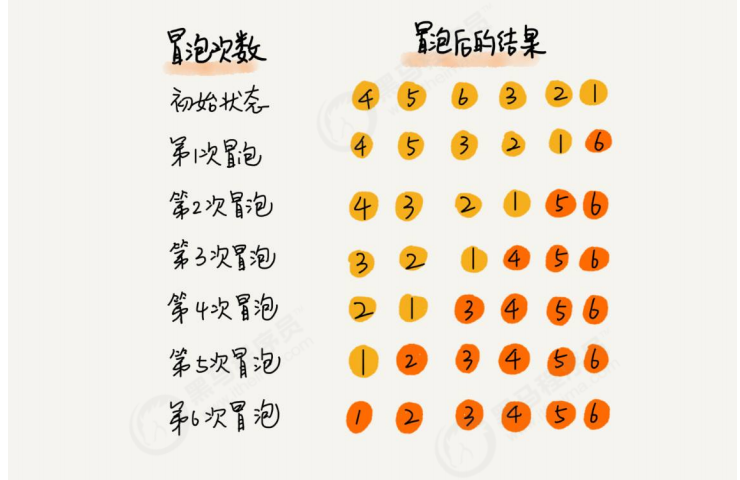

```java
public class BubbleSort {
    public static void sort(int[] nums){
        //依次冒泡出最大值到数组末尾，冒泡完后的最大值不参与后续冒泡,每次都是从第一个开始
        //对比选择排序，是排序好的放在数组最前面，这里是最后面
        for (int i = nums.length-1; i >=0; i--) { //i——此次冒泡好的最大值位置
            for (int j = 0; j <= i-1; j++) { //冒泡范围
                if (nums[j]>nums[j+1]){
                    int temp = nums[j]; //exchange
                    nums[j] = nums[j+1];
                    nums[j+1] = temp;
                    //然后不需要移动j位置，因为后面有j++，会保证下一个j指向上次两个比较的最大值
                }
            }
            
        }
        
    }
}
```

**冒泡排序的时间复杂度分析** 冒泡排序使用了双层for循环，其中内层循环的循环体是真正完成排序的代码，所以，我们分析冒泡排序的时间复杂度，主要分析一下内层循环体的执行次数即可。

在最坏情况下，也就是假如要排序的元素为{6,5,4,3,2,1}逆序，那么：

元素比较的次数为：

 		(N-1)+(N-2)+(N-3)+...+2+1=((N-1)+1)*(N-1)/2=N^2/2-N/2;

元素交换的次数为：

​		 (N-1)+(N-2)+(N-3)+...+2+1=((N-1)+1)*(N-1)/2=N^2/2-N/2;

总执行次数为：

​		 (N^2/2-N/2)+(N^2/2-N/2)=N^2-N;

按照大O推导法则，保留函数中的最高阶项那么最终冒泡排序的时间复杂度为O(N^2).

==冒泡排序优化：==

 如果我们发现在某趟排序中，没有发生一次交换， 可以**提前结束冒泡排序**。这个就是优化

> 大循环——（len-1）次
>
> 小循环——【0——（len-1-i）】，里面我们是用的j+1，是和后一位进行比较，所以可以取到最后一位


## 2、选择排序（n*n）

**小到大：依次选出最小值放到数组最前面**

选择排序（select sorting）也是一种简单的排序方法。它的基本思想是：第一次从arr[0]~ arr[n-1]中选取最小值，与arr[0]交换，第二次从arr[1]~ arr[n-1]中选取最小值，与arr[1]交换，第三次从arr[2]~ arr[n-1]中选取最小值，与arr[2]交换，…，第i次从arr[i-1]~arr[n-1]中选取最小值，与arr[i-1]交换，…, 第n-1次从arr[n-2]~arr[n-1]中选取最小值，与arr[n-2]交换，总共通过n-1次，得到一个按排序码从小到大排列的有序序列。

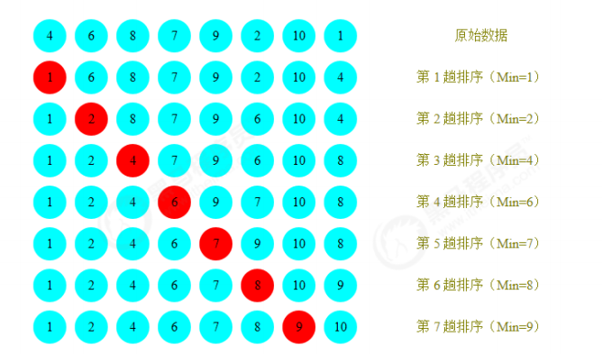

```java
	//选择排序
	public static void selectSort(int[] arr) {
		//在推导的过程，我们发现了规律，因此，可以使用for来解决
		//选择排序时间复杂度是 O(n^2)
		for (int i = 0; i < arr.length - 1; i++) {
			int minIndex = i;
			int min = arr[i];
			for (int j = i + 1; j < arr.length; j++) {
				if (min > arr[j]) { // 说明假定的最小值，并不是最小
					min = arr[j]; // 重置min
					minIndex = j; // 重置minIndex
				}
			}
			// 将最小值，放在arr[i], 即交换
			if (minIndex != i) {
				arr[minIndex] = arr[i];
				arr[i] = min;
			}
	}
```

**选择排序的时间复杂度分析：**

选择排序使用了双层for循环，其中外层循环完成了数据交换，内层循环完成了数据比较，所以我们分别统计数据交换次数和数据比较次数：

数据比较次数：

​		 (N-1)+(N-2)+(N-3)+...+2+1=((N-1)+1)*(N-1)/2=N^2/2-N/2;

数据交换次数：

​		 N-1

时间复杂度：`N^2/2-N/2+（N-1）=N^2/2+N/2-1;`

根据大O推导法则，保留最高阶项，去除常数因子，时间复杂度为O(N^2);


## ==3、插入排序（n*n）==

**排序原理：**

1.把所有的元素分为两组，已经排序的和未排序的；(开始时有序表为一个元素，无序表为N-1)

2.找到未排序的组中的第一个元素，向已经排序的组中进行插入；

3.**倒叙遍历**已经排序的元素，依次和待插入的元素进行比较，如果比待插入的大，则这两个元素交换位置，然后接着往前面走，再次比较，再次换位置。

**稳定：**

- 如果碰见一个和插入元素相等的，那么把要插入的元素放在相等元素的后面。所以，相等元素的前后顺序没有改变，从原无序序列出去的顺序就是排好序后的顺序，所以插入排序是稳定的。

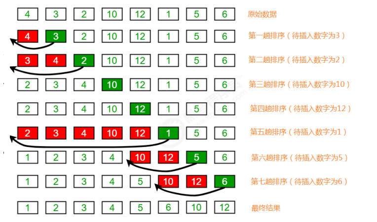

```java
public class InsertSort {
    public static void main(String[] args) {
        int[] nums = new int[]{100,2,3,40,5,10};
        sort(nums);
        System.out.println(Arrays.toString(nums));
    }
  
    public static void sort(int[] nums){
        //将数组分为有序序列+无序两部分
        //初始时，有序序列就是数组第一个元素，然后依次将无序序列从前往后放入
        for (int i = 1; i < nums.length; i++) { //无序序列
            int k = i; //重要，不加就错了
            for (int j = i-1; j >=0 ; j--) { //有序部分（索引）
                if (nums[k]>=nums[j]){
                     break;
                }else {
                    int temp = nums[k];//exchange
                    nums[k] = nums[j];
                    nums[j] = temp;
                    k = j; //此时新入元素所在位置j
                }
            }
        }
    }
}
```


**插入排序的时间复杂度分析**

插入排序使用了双层for循环，其中内层循环的循环体是真正完成排序的代码，所以，我们分析插入排序的时间复杂度，主要分析一下内层循环体的执行次数即可。

最坏情况，也就是待排序的数组元素为{12,10,6,5,4,3,2,1}，那么：

比较的次数为：

​		(N-1)+(N-2)+(N-3)+...+2+1=((N-1)+1)*(N-1)/2=N^2/2-N/2;

交换的次数为：

​		(N-1)+(N-2)+(N-3)+...+2+1=((N-1)+1)*(N-1)/2=N^2/2-N/2;

总执行次数为：

​		`(N^2/2-N/2)+(N^2/2-N/2)=N^2-N;`

按照大O推导法则，保留函数中的最高阶项那么最终插入排序的时间复杂度为O(N^2)


# 高级排序算法

之前我们学习过基础排序，包括冒泡排序，选择排序还有插入排序，并且对他们在最坏情况下的时间复杂度做了分析，发现都是**O(N^2)**，而平方阶通过我们之前学习算法分析我们知道，随着输入规模的增大，时间成本将急剧上升，所以这些基本排序方法不能处理更大规模的问题，接下来我们学习一些高级的排序算法，争取降低算法的时间复杂度最高阶次幂。


## 1、希尔排序（不知道）

希尔排序也是一种插入排序，它是简单插入排序经过改进之后的一个更高效的版本，也称为递减增量排序算法，同时该算法是冲破 `O(n²)` 的第一批算法之一。

我们来看下希尔排序的基本步骤，在此我们选择增量      `h=length/2`，缩小增量继续以 `h = h/2` 的方式，这种增量选择我们可以用一个序列来表示，`{n/2, (n/2)/2, ..., 1}`，称为**增量序列**。希尔排序的增量序列的选择与证明是个数学难题，我们选择的这个增量序列是比较常用的，也是希尔建议的增量，称为希尔增量，但其实这个增量序列不是最优的。此处我们做示例使用希尔增量。

- **排序原理：**

  1.选定一个增长量`h=length/2`，按照增长量h作为数据分组的依据，对数据进行分组；

  2.对分好组的每一组数据完成插入排序；

  3.减小增长量 h = h /2 ，最小减为1，重复第二步操作。


> 这个分组策略，我详细讲一下：
>
> 首先，总共十个元素，我们看成10组。
>
> 第一步：10/2 = 5，也就是把十个数据分为五组，步长为5，就是说，每个元素和他间隔距离=5的元素为一组（累计链式计算这种）。如对于第一个元素8，他后移5个单位为3，然后3后移5个单位没有了，所以8、3一组
>
> 第二步时：把上面的5组再次划分。5/2 = 2，这次分为两组，步长为2 。第一个数字3——后移2个单位找到1——1再后移2个单位得到0——0后移2个单位得到9——9后移两个单位得到7——7再后移两个单位，没有数据了，所以3、1、0、9、7一组。
>
> 第三步时：2/2 = 1，即分为一组，也就是所有元素一起排序。

```java
public class ShellSort {

    public static void sort(int[] nums){
        int h = nums.length/2; //初始增量
        while (h>=1){
            // h增量，==1是最后一次插入排序
            for (int i = h; i<nums.length;i++){
                // i——要插入的元素，他和前面的元素进行插入排序
                for (int j = i-h; j >=0 ; j-=h) {
                    if (nums[i]>=nums[j]) break;
                    else {
                        int temp = nums[i];
                        nums[i] = nums[j];
                        nums[j] = temp;
                        i = j;
                    }
                }
            }
            // 缩小增量
            h = h/2;
        }
    }
}
```


**希尔排序的时间复杂度分析**

在希尔排序中，增长量h并没有固定的规则，有很多论文研究了各种不同的递增序列，但都无法证明某个序列是最好的，对于希尔排序的时间复杂度分析，已经超出了我们课程设计的范畴，所以在这里就不做分析了。

我们可以使用**事后分析法**对希尔排序和插入排序做性能比较。

在资料的测试数据文件夹下有一个reverse_shell_insertion.txt文件，里面存放的是从100000到1的逆向数据，我们可以根据这个批量数据完成测试。测试的思想：在执行排序前前记录一个时间，在排序完成后记录一个时间，两个时间的时间差就是排序的耗时。

通过测试发现，**在处理大批量数据时**，希尔排序的性能确实高于插入排序。

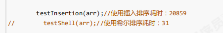


## ==2、归并排序O(NlogN)==

归并排序是建立在归并操作上的一种有效的排序算法，该算法是采用**分治法**的一个非常典型的应用。

**排序原理：递归思想.........split()**

1. ==尽可能的一组数据拆分成两个元素相等的左右子组，并对每一个子组继续拆分，直到拆分后的每个子组的元素个数是1为止。==

2. ==将相邻的两个子组进行合并成一个有序的大组；（治的时候进行排序）==

3. ==不断的重复步骤2，直到最终只有一个组为止。==

4. 归并排序需要与原数组大小相同的**辅助数组！！！**

**特点：先只递归分split，合并时排序merge**

​		==1、划分方式一样，left、mid、right，然后区分左右两边==

​		==2、合并时，永远都是两个相邻的子组合并，不会出现跨的情况==（每次【left，mid】和【mid+1，right】这两部分存储是连续的，合并起来就是原数组的【left，right】，由前面划分方式特点决定的）


```java
package sort;

/**
 * 归并排序算法
 */
public class MergeSort {

    static int[] tempArr; //必须使用辅助数组

    public static void sort(int[] nums) {
        tempArr = new int[nums.length];
        split(nums,0,nums.length-1);
    }

    // 第一个环节：递归拆分,(left、right--数组索引--表示需要排序的数组范围）
    private static void split(int[] nums, int left, int right) {
        //递归终止条件：left=right，只有一个元素时
        if (left == right) return;
        int mid = (left + right) / 2;
        split(nums, left, mid); //递归划分左半区
        split(nums, mid + 1, right); // 递归划分右半区
        merge(nums, left, mid, right); //合并排序
    }
    
    // 第二个环节：合并
    // 遍历1，移动p1指针和p2指针，比较对应索引处的值，将较小的那个放到辅助数组指针对应的索引位置
    private static void merge(int[] nums, int left, int mid, int right) {
        // 左数组【left，mid】，右数组【mid+1，right】
        // 【双指针+while】这里需要使用辅助数组，先把合并有序的放入辅助数组，然后将有序排好的这部分复制给nums，必须在这里复制过去，因为下次排序和上一次的元素有关
        int p1 = left;
        int p2 = mid + 1;
        int index = left; //tempArr
        while (p1 <= mid && p2 <= right) {
            if (nums[p1] <= nums[p2]) {
                tempArr[index] = nums[p1];
                p1++;index++;
            } else {
                tempArr[index] = nums[p2];
                p2++;index++;
            }
        }
        // 2.判断哪个数组有剩余，前面是必有一个数组遍历完了
        while (p1 <= mid) {
            tempArr[index] = nums[p1];
            p1++;index++;
        }
        while (p2 <= right) {
            tempArr[index] = nums[p2];
            p2++;index++;
        }
        // 3.最后复制这段给原数组
        System.arraycopy(tempArr, left, nums, left, right-left+1);
    }
}
```


**具体实现：**

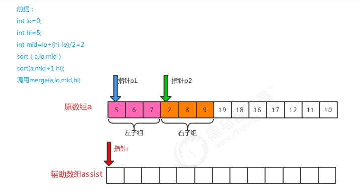

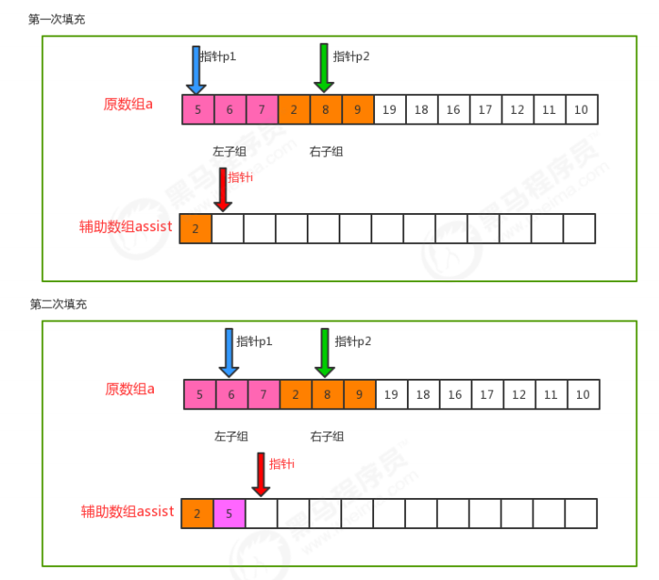

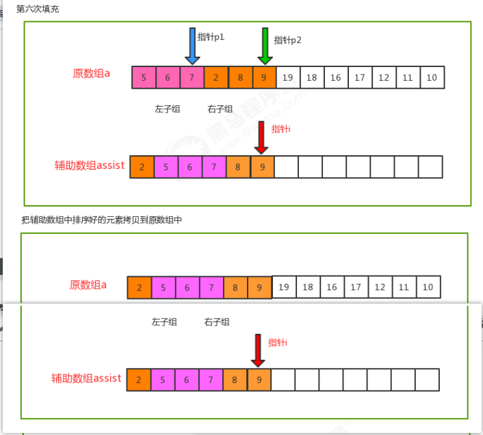


### **时间复杂度分析：**

- 假设元素的个数为n，那么使用归并排序拆分的次数为 log2(n)【向上取整】,所以共log2(n)层，时间复杂度为 **O(logN)**
- 然后每一层归并的时间复杂度为 **O(N)**，每个元素都需要比较一次
- 最终的为 **O(NlogN)**

归并排序是分治思想的最典型的例子，上面的算法中，对a[lo...hi]进行排序，先将它分为a[lo...mid]和a[mid+1...hi]两部分，分别通过递归调用将他们单独排序，最后将有序的子数组归并为最终的排序结果。

该递归的出口在于如果一个数组不能再被分为两个子数组，那么就会执行merge进行归并，在归并的时候判断元素的大小进行排序。

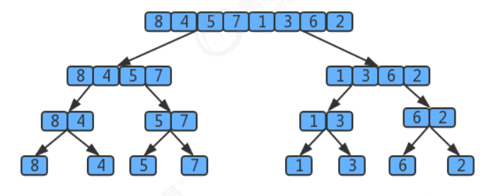

用树状图来描述归并，如果一个数组有8个元素，那么它将每次除以2找最小的子数组，共拆log8次，值为3，所以树共有3层,那么自顶向下第k层有2^ k个子数组，每个数组的长度为2^ (3-k)，每个数组归并最多需要2^(3-k)次比较。因此每层的比较次数为 2^k * 2^ (3-k)=2^3,那么3层总共为 3*2^3。

**假设元素的个数为n，那么使用归并排序拆分的次数为 log2(n),所以共log2(n)层，**那么使用log2(n)替换上面3*2^3中的3这个层数，最终得出的归并排序的时间复杂度为：

log2(n) * 2^(log2(n))=log2(n)*n,根据大O推导法则，忽略底数，==最终归并排序的时间复杂度为   **O(nlogn);  **==


**归并排序的缺点：**

- 需要申请额外的数组空间，导致空间复杂度提升，是典型的以空间换时间的操作。


## 3、快速排序O(nlogn)

==递归！！！==

**排序原理：递归思想——指针为左闭右闭**

1.首先从序列中挑出一个元素设定为分界值，通过该分界值将数组分成左右两部分；**一般我们就取最后一个元素即可**

2.将大于或等于分界值的数据放到到数组右边，小于分界值的数据放到数组的左边。==这里实现有点意思==

3.然后，左边数组递归、右边数组递归，**终止条件是左指针>=右指针（left>=right) **，会出现直接left>right的情况哦（只有两个元素是最后一次比较、或者只有三个元素）


```java
public class QuickSort {
    // 入口
    public static void sort(int[] nums) {
        recursion(nums, 0, nums.length - 1);
    }

    //递归
    private static void recursion(int[] nums, int left, int right) {
        if (left >= right) return;

        int value = nums[right];//分解值，索引是right处
        //移动元素，进行分区,将所有比value小的放在数组最前面；采用双指针单移动法
        int slow = left; //最后slow指针左边元素均小于value（不含value）
        int fast = left;
        while (fast < right) {
            if (nums[fast] < value) {
                int tt = nums[fast];
                nums[fast] = nums[slow];
                nums[slow] = tt;
                slow++;
            }
            fast++; //这个是一定++的啊，之前写错了
        }
        // 最后交换slow指针和value基准值的元素; slow指针索引是基准值所在位置
        int tt = nums[slow];
        nums[slow] = nums[right];
        nums[right] = tt;
      
        // 左区间递归+右区间递归
        recursion(nums, left, slow - 1); //左区间递归
        recursion(nums, slow + 1, right);
    }
}
```

 	

### 快排和归排的区别：

快速排序是另外一种分治的排序算法，它将一个数组分成两个子数组，将两部分独立的排序。快速排序和归并排序是互补的：

- 归并排序将数组分成两个子数组分别排序，并将有序的子数组归并从而将整个数组排序，而快速排序的方式则是当两个数组都有序时，整个数组自然就有序了

- 在归并排序中，一个数组被等分为两半，归并调用发生在处理整个数组之前，在快速排序中，切分数组的位置取决于数组的内容，递归调用发生在处理整个数组之后。

  

### **时间复杂度分析：**

快速排序的一次切分从两头开始交替搜索，直到left和right重合，因此，==一次切分算法的时间复杂度为O(n),  但整个快速排序的时间复杂度和切分的次数相关。==

**最优情况：**每一次切分选择的基准数字刚好将当前序列等分。

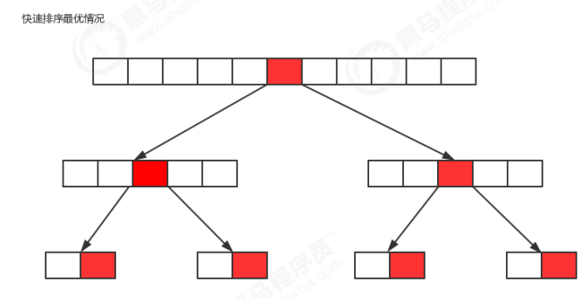

如果我们把数组的切分看做是一个树，那么上图就是它的最优情况的图示，共切分了logn次，所以，最优情况下快速排序的时间复杂度为O(nlogn);


**最坏情况：**每一次切分选择的基准数字是当前序列中最大数或者最小数，这使得每次切分都会有一个子组，那么总共就得切分n次，所以，最坏情况下，快速排序的时间复杂度为O(n^2);


**平均情况：**每一次切分选择的基准数字不是最大值和最小值，也不是中值，这种情况我们也可以用数学归纳法证明，  ==快速排序的时间复杂度为O(nlogn)==   ,由于数学归纳法有很多数学相关的知识，容易使我们混乱，所以这里就不对平均情况的时间复杂度做证明了。


## 4、堆排序

### 1、堆的基础概念

堆是计算机科学中一类特殊的数据结构的统称，堆通常可以被看做是一棵**完全二叉树的数组对象。**

**堆的特性：**

 **1.它是完全二叉树，**除了树的最后一层结点不需要是满的，其它的每一层从左到右都是满的，如果最后一层结点不是满的，那么要求左满右不满。


 **2.它通常用数组来存储。**

将二叉树的结点按照**层序遍历放入数组**中，**根结点在位置1（废弃0索引）**，它的子结点在位置2和3，而子结点的子结点则分别在位置4,5,6和7，以此类推。


已知一个结点的索引位置为 **[k]**，则它的父结点的位置为**[k/2]**,而它的两个子结点的位置则分别为 **左节点：[2k]**、**右：[2k+1]**；

这样，在不使用指针的情况下，我们也可以通过计算数组的索引在树中上下移动：将**a[k]**向上一层，就将**a[k]和a[k/2]两个交换**，向下一层就和2k或2k+1交换。


 **3.大根堆—每个结点都大于等于它的两个子结点。**

这里要注意堆中仅仅规定了每个结点大于等于它的两个子结点，但这**两个子结点的顺序并没有做规定，**跟我们之前学习的二叉查找树是有区别的。


**4.大根堆、小根堆**

**将根结点最大的堆叫做大根堆，根结点最小的堆叫做小根堆**。常见的堆有二叉堆、斐波那契堆等。

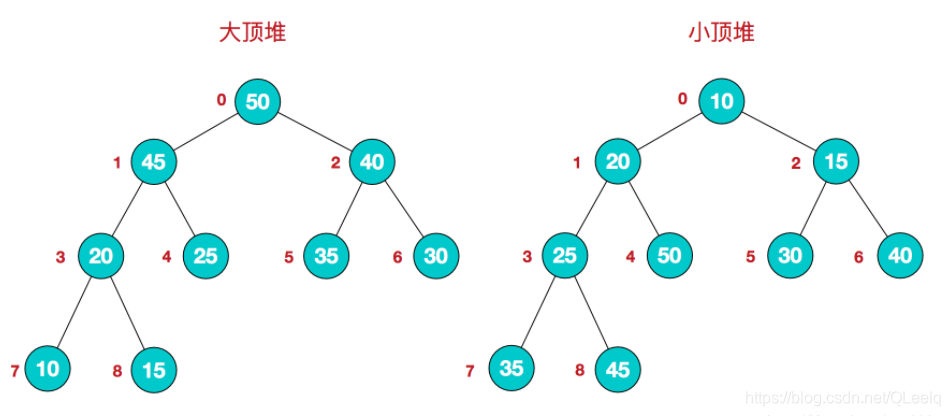


### 2、堆排序原理

有两种实现方式：

- **一、手写大根堆——不断向堆中插入元素，最后输出插入所有元素的有序序列；**涉及到上浮和下沉两个操作；
- **二、直接给你一个数组，直接进行排序；**只涉及到下沉操作；

一般而言，要我们写一个堆排序就是问的第二种，给一个数组、集合进行排序即可。

**上浮操作：**新插入的元素在数组最后面，然后需要将该元素和他的父节点进行比较，不断向上，直到找到一个父节点大于该节点的位置；终止条件是 `k/2<1`，该位置没有父节点了

**下沉操作：**一般就是针对无序的情况，在二中，我们第一个元素是不满足要求的，需要将该元素和他的左右子节点比较，如果大于子节点则ok，否则要将左、右子节点的最大值节点和其交换，终止条件是 `2*k>N`，即该位置没有孩子节点了。

### 3、堆排序2

==二、直接给你一个数组，直接进行排序；只涉及到下沉操作；==

**实现步骤：从小到大**

**1.构造大根堆；**直接复制一份原数组，然后我们将每个父节点（非叶子）进行下沉即可，最后一个父节点的索引是 `(nums.length-1)/2`，从该索引位置，依次往上如5、4、3、2、1索引，进行下沉操作，最后得到的就是一个合格的堆；

**2.得到堆顶元素，这个值就是最大值；**然后交换堆顶元素和数组中的最后一个元素，即 `(nums.length-1)和1两个索引`，这样最大值就已经放在了合适位置；

**3.然后我们对第一个堆顶元素进行范围下沉（最后一个元素不参与），**下沉的范围是因为它刚刚被替换上去，不在合适位置；

**4.重复2、3这个步骤，**直到堆中剩一个元素为止

==好烦啊，我们使用集合去做不行嘛==，使用数组的话第三步这个最后一个元素不参与的操作，我们还要设置一个范围，集合的话直接删除就好了，给他复制给一个新数组；

==不行，因为集合中无法直接交换两个元素==


```java
public class HeapSort {
    public static void main(String[] args) {
        int[] nums = new int[]{100,2,3,40,5,10};
        sort(nums);
        System.out.println(Arrays.toString(nums));
    }

    static int[] heap; //构建的堆数组
    //入口——排序方法——从小到大（int[] 类型数组）
    public static void sort(int[] nums){
        heap = new int[nums.length+1]; //加1，因为是从1开始存储
        System.arraycopy(nums,0,heap,1,nums.length);
        createHeap();
        // 到这里heap[1,heap.length-1]就是我们构建的堆
        // 索引1处为最大值，将他和堆数组最后一个元素交换，然后再对索引1元素进行范围下沉
        getSortHeap();
        // 此时heap[1,heap.length-1] 是已经排序好的数组，最后修改原nums数组即可
        System.arraycopy(heap,1,nums,0,nums.length);
    }

    //1、根据原数组，构建一个大根堆，索引为1的元素是最大值
    private static void createHeap(){
        // 对 索引[N-1/2，..1] 这些节点依次下沉
        int maxIndex = heap.length - 1;
        for (int i = maxIndex/2; i >=1 ; i--) {
            sink(i,maxIndex);
        }
    }
    // 2、对堆中索引为k的元素进行下沉操作; maxIndex是数组范围下沉——堆下沉范围是[1,maxIndex]
    private static void sink(int k, int sinkIndex){
        while (2*k<=sinkIndex){
            //1、找到子节点的最大值
            int maxChild = 0;
            if (2*k+1 <= sinkIndex){//存在右子节点，取两者最大值
                if (heap[2*k]> heap[2*k+1]) maxChild = 2*k;
                else maxChild = 2*k+1;
            }else {
                maxChild = 2*k;
            }
            //2、和子节点最大值进行比较
            if (heap[k] >= heap[maxChild]){
                break;
            }else {
                //交换
                int temp = heap[k];
                heap[k] = heap[maxChild];
                heap[maxChild] = temp;
                //
                k = maxChild;
            }
        }
    }

    //3、对已构建好的堆数组heap，进行从小到大排序，就在原heap进行，采用范围下沉
    // 排序完的heap就不是堆数组了哦
    private static void getSortHeap(){
        int sinkIndex = heap.length-1;
        while(sinkIndex!=1){ //直到下沉的范围只有一个元素为止，即堆只有一个元素了
            int temp = heap[1];
            heap[1] = heap[sinkIndex];
            heap[sinkIndex] = temp;
            sinkIndex--;
            sink(1,sinkIndex);
        }
        // heap[1,..sinkIndex]这部分依然是大根堆数组
    }

}
```


### ==4、手写优先队列==

- 手写最大优先队列——手写大根堆；数组1处为最大值
- 手写最小优先队列——手写小根堆；数组1处为最小值

其实就是，堆排序原理的第一种方式实现，手写堆，然后一个个得到删除的元素，就是了。


实现 `MaxPriorityQueue` 类：

- `MaxPriorityQueue(int capacity)`： 以正整数作为容量 `capacity` 初始化 MaxPriorityQueue对象
- `void offer(int value)` ：往队列中添加元素value
- `int poll()` ：弹出队列中的最大值；
- `int peek()` ：查看队列中的最大值；


```java
public class MaxPriorityQueue {
    public int capacity; //队列容量
    public int size; //当前队列元素个数

    public MaxPriorityQueue(int capacity){
        this.capacity = capacity;
        this.size = 0;
        this.heap = new int[capacity+1];
    }
    //1、往队列中添加元素value
    public void offer(int value){
        if (size==capacity) return;
        size++;
        heap[size] = value;
        rise(size);
    }
    //2、弹出队列中最大值
    public int poll(){
        if (size==0) return -1; //无元素弹出
        int temp = heap[1];
        heap[1] = heap[size];
        heap[size] = temp;
        // 弹出的元素
        int res = heap[size];
        size--;
        sink(1);
        return res;
    }
    //3、查看队列中最大值
    public int peek(){
        if (size==0) return -1;
        return heap[1];
    }

    // 对外隐藏的部分
    private int[] heap; //从1开始存储
    //1、索引k处的元素上浮操作；属于范围上浮
    private void rise(int k){
        while (k/2>=1){ //存在父节点
            if (heap[k]>heap[k/2]){
                int temp = heap[k];
                heap[k] = heap[k/2];
                heap[k/2] = temp;
                k = k/2; //
            }else {
                break;
            }
        }
    }

    //2、索引k处的元素下沉操作，范围下沉；
    // 删除的时候，同堆排序类似，将1处和最大索引处元素交换，然后删除最大索引处元素，对1处进行下沉
    private void sink(int k){
        int maxIndex = size;
        while (2*k<=maxIndex){ //size就是heap堆数组中有效最大索引
            int maxChild = 0;
            if (2*k+1<=maxIndex){
                if (heap[2*k]>heap[2*k+1]){
                    maxChild = 2*k;
                }else maxChild = 2*k+1;
            }else {
                maxChild = 2*k;
            }
            //
            if (heap[k]<heap[maxChild]){
                int temp = heap[k];
                heap[k] = heap[maxChild];
                heap[maxChild] = temp;
                //
                k = maxChild;
            }else {
                break;
            }
        }
    }
}
```


## 5、排序的稳定性

**稳定性的定义：**

数组arr中有若干元素，其中A元素和B元素相等，并且A元素在B元素前面，如果使用某种排序算法排序后，能够保证A元素依然在B元素的前面，可以说这个该算法是稳定的。


**稳定性的意义：**

如果一组数据只需要一次排序，则稳定性一般是没有意义的，如果一组数据需要**多次排序**，稳定性是**有意义的**。例如要排序的内容是一组商品对象，第一次排序按照价格由低到高排序，第二次排序按照销量由高到低排序，如果第二次排序使用稳定性算法，就可以使得相同销量的对象依旧保持着价格高低的顺序展现，只有销量不同的对象才需要重新排序。这样既可以保持第一次排序的原有意义，而且可以减少系统开销。


第二次按照销量进行从高到低排序：

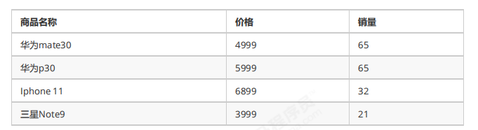


**常见排序算法的稳定性：**

- ==**冒泡排序：稳定**==

​		只有当arr[i]>arr[i+1]的时候，才会交换元素的位置，而相等的时候并不交换位置，所以冒泡排序是一种稳定排序算法。

- **选择排序:**

​		选择排序是给每个位置选择当前元素最小的,例如有数据{5(1)，8 ，5(2)， 2， 9 },第一遍选择到的最小元素为2，所以5(1)会和2进行交换位置，此时5(1)到了5(2)后面，破坏了稳定性，所以选择排序是一种不稳定的排序算法。

- ==**插入排序：稳定**==

比较是从有序序列的末尾开始，也就是想要插入的元素和已经有序的最大者开始比起，如果比它大则直接插入在其后面，否则一直往前找直到找到它该插入的位置。如果碰见一个和插入元素相等的，那么把要插入的元素放在相等元素的后面。所以，相等元素的前后顺序没有改变，从原无序序列出去的顺序就是排好序后的顺序，所以插入排序是稳定的。

- **希尔排序：**

希尔排序是按照不同步长对元素进行插入排序 ,虽然一次插入排序是稳定的，不会改变相同元素的相对顺序，但在不同的插入排序过程中，相同的元素可能在各自的插入排序中移动，最后其稳定性就会被打乱，所以希尔排序是不稳定的。

- ==**归并排序：稳定**==

归并排序在归并的过程中，只有arr[i]<arr[i+1]的时候才会交换位置，如果两个元素相等则不会交换位置，所以它并不会破坏稳定性，归并排序是稳定的。

- **快速排序：**

快速排序需要一个基准值，在基准值的右侧找一个比基准值小的元素，在基准值的左侧找一个比基准值大的元素，然后交换这两个元素，此时会破坏稳定性，所以快速排序是一种不稳定的算法。

