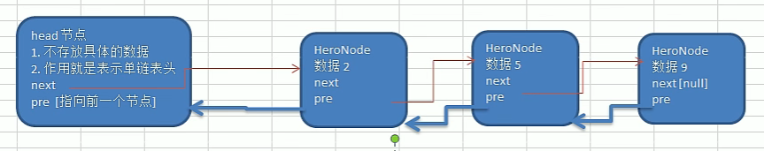
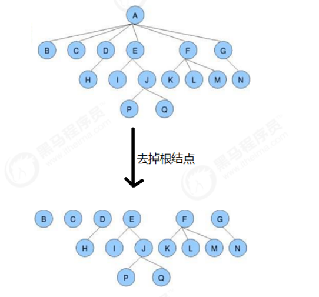
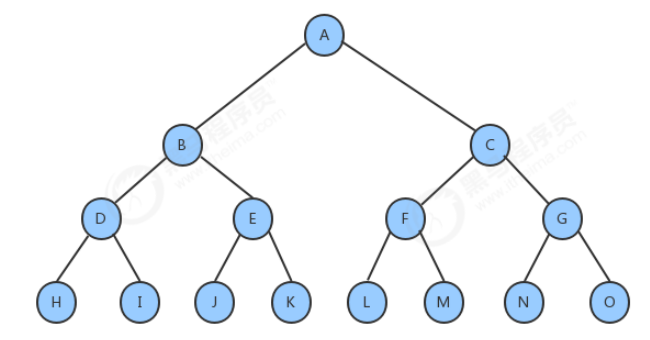
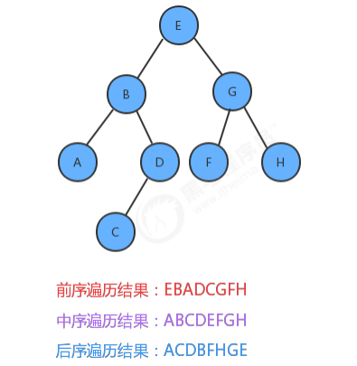

# 1、八大数据结构

[数据结构](https://so.csdn.net/so/search?q=数据结构&spm=1001.2101.3001.7020)是计算机存储、组织数据的方式。一种好的数据结构可以带来更高的运行或者存储效率。数据在内存中是呈线性排列的，但是我们可以使用指针等道具，构造出类似“树形”的复杂结构。下面介绍八个常见的数据结构。


## 一. 数组

数组是一种线性结构，而且在物理内存中也占据着**一块连续空间**。

- **优点**：支持==随机访问==数据。
- **缺点**：==添加和删除==数据比较耗时间。（出现元素元素的前向移动、后移）
- **使用场景**：频繁查询，对存储空间要求不大，很少增加和删除的情况。


**数据访问**：由于数据是存储在连续空间内，所以每个数据的内存地址都是通过数据小标算出，所以可以直接访问目标数据。（这叫做“随机访问”）。比如下方，可以直接使用a[2]访问Red。


**数据添加**：数据添加需要移动其他数据。首先增加足够的空间，然后把已有的数据一个个移开。


**数据删除**：反过来，如果想要输出数据Green，也是一样挨个把数据往反方向移动。


## 二. 链表

链表是物理存储单元上非连续的、非顺序的存储结构，数据元素的逻辑顺序是通过链表的指针地址实现，每个元素包含两个结点，**一个是存储元素的数据域 (内存空间)，另一个是指向下一个结点地址的指针域。**

- **优点**：数据==添加和删除==方便
- **缺点**：==访问比较耗费时间==，不支持随机访问
- **适用场景**：数据量较小，需要频繁增加，删除操作的场景


数组和链表数据结构对比列表如下：


**数据访问**：因为数据都是分散存储的，所以想要访问数据，只能从第一个数据开始，顺着指针的指向逐一往下访问。


**数据添加**：将Blue的指针指向的位置变成Green，然后再把Green的指针指向Yellow。


**数据删除：**只要改变指针的指向就可以了，比如删除Yellow，只需把Green指针指向的位置从Yellow编程Red即可。


### 1.单链表

单链表 **(带头结点)** 逻辑结构示意图如下：头节点不存放任何信息，而且千万不能乱动，头节点变化的话，这个链表就找不到了。

**链表尾节点**的标志：next域为null。


下面这个准确说是不带有头节点的。


### 2.双向链表

单链表中的指针域只能指向节点的下一个节点。

双链表：每一个节点有两个指针域，一个指向下一个节点，一个指向上一个节点。

双链表 既可以向前查询也可以向后查询。

如图所示：

 

**就是比单向链表多了一个属性，多一个pre域，指向前一个节点。**




```java
//定义HeroNode2 ， 每个HeroNode 对象就是一个节点
class HeroNode2 {
    public int no;
    public String name;
    public String nickname;
    public HeroNode2 next; //指向下一个节点
    public HeroNode2 pre;
		..............
}
```


### 3.循环链表

循环链表，顾名思义，链表整体要形成一个圆环状。在单向链表中，最后一个节点的指针为null，不指向任何结点，因为没有下一个元素了。要实现循环链表，我们只需要让单向链表的最后一个节点的指针指向头结点即可。


**解决：约瑟夫问题**


### 4.链表节点自定义代码

在leetCode里面，节点代码是给你提供了的，但是ACM需要你自己去写才行。

leetcode：

统一写法：

```java
public class ListNode {
     public int val;  //private也可以，但写算法就算了，麻烦
     public ListNode next;
  	 public ListNode pre;
   
     public ListNode() {}
     public ListNode(int val) { this.val = val; }
     public ListNode(int val, ListNode next) { 
       this.val = val; this.next = next; 
     }
 }
```


## 三. 栈

栈也是一种数据呈线性排列的数据结构，不过在这种结构中，我们==只能访问最新添加==的数
据。    从栈顶放入元素的操作叫入栈，取出元素叫出栈。

- 特点：先进后出（Last In First Out，简称LIFO）


## 四. 队列

### 1.FIFO

队列中的添加和删除数据的操作分别是在两端进行的。队列可以在一端添加元素，在另一端取出元素。==只能访问两端的元素==

- 特点：先进先出（First In First Out，简称FIFO）
- 队列元素个数一般用一个额外变量存储，**入队** 时加一，**出队** 时减一。这样获取队列元素的时候就不需要遍历整个队列。通过 O(1) 的时间复杂度获取队列元素个数


### 2.双端队列

**双端队列** 是一种具有 **队列** 和 **栈** 的性质的数据结构，是我们常说的 **deque**（**double-ended queue**），是一种限定 **插入** 和 **删除** 操作在表的两端进行的线性表。这两端分别被称为 **队首** 和 **队尾**。

如果把条件放松一下，允许两头都进，两头都出，这种队列叫双端队列（Double Ended Queue），学名`Deque`。Java集合提供了接口`Deque`来实现一个双端队列，它的功能是：

- 既可以添加到队尾，也可以添加到队首；
- 既可以从队首获取，又可以从队尾获取。

**队列元素个数**一般用一个额外变量存储，**入队** 时加一，**出队** 时减一。这样获取队列元素的时候就不需要遍历整个队列。通过O(1) 的时间复杂度获取队列元素个数


### 3.单调队列

**单调队列** 就是能够完美支持下面三种操作的一种容器：

1）【询问】通过 O(1) 的时间，获取容器中元素的最大值。

2）【删除】通过 O(1) 的时间，删除元素；

3）【插入】通过 O(1) 的时间，插入元素；

4）并不关心队列内元素的个数问题，也就是说


 **1、定义**

单调队列是一个限制只能 **队尾插入**，但是可以 **两端删除** 的 **双端队列** 。**单调队列** 存储的元素值，是从 **队首** 到 **队尾** 呈单调性的（要么单调递增，要么单调递减）。

对于求解最大值的问题，则需要维护一个 **单调递减** 的队列。


> 如图所示，**⑨** 为原先的 **队首元素**，执行 **队首删除（出队）** 操作以后，**⑥** 成为新的 **队首元素**；而在队尾执行插入**④**这个元素的时候，为了保持单调性，需要将**①②**依次从队尾删除；当队尾执行插入**②**这个元素的时候，满足单调性。

 **2、查询**

由于单调队列是单调递减的，所以队首元素 **最大**，直接 O(1) 获取队首元素。

**3、删除**

删除分为 **队首删除** 和 **队尾删除**。 

- 队首删除即直接队首元素出队， O(1) 即可完成操作。
- **队尾删除** 一般是配合 **队尾插入** 进行的。

**4、插入**

在进行 **队尾插入** 的时候，我们往往需要明白一个重要的点，就是需要保证它 **单调递减** 的性质，所以如果 **插入元素  >= 队尾元素 ** ，则当前的 **队尾元素** 是需要执行删除操作的（也就是上文提到的 **队尾删除**），直到满足 **队尾元素** > **插入元素**，才能真正执行 **插入** 操作。

这样才能保证，执行 **队尾插入** 后，单调队列仍然是 **单调递减** 的。插入过程，虽然伴随着元素的删除，但是每个元素至多被 **插入一次** 和 **删除一次**，所以均摊时间复杂度还是 O(1) 的。

**1）保序性**

由于单调队列执行插入的时候，一定是从队尾进行插入，所以单调队列中的数据，从队首到队尾的顺序，一定是**和原序列严格相对保序的**，就是说每个数据的相对位置一定是一样的，原序列在前面的数据到了单调队列时还是在前面。

**2）下标存储**，也可以存真实数据，都行

为了让单调队列的数据足够干净，在单调队列中，**一般存储 原序列的下标** 即可，而不需要存储原序列的值，根据保序性，**存储的下标一定是单调递增的；**


### 4.优先队列

普通的队列是一种先进先出的数据结构，元素在队列尾追加，而从队列头删除。在某些情况下，我们可能需要找出队列中的最大值或者最小值，例如使用一个队列保存计算机的任务，一般情况下计算机的任务都是有优先级的，我们需要在这些计算机的任务中找出优先级最高的任务先执行，执行完毕后就需要把这个任务从队列中移除。普通的队列要完成这样的功能，需要每次遍历队列中的所有元素，比较并找出最大值，效率不是很高，这个时候，我们就可以使用一种特殊的队列来完成这种需求，**优先队列——基于堆这种数据结构完成**。


优先队列按照其作用不同，可以分为以下两种：

- **最大优先队列：**可以获取并删除队列中最大的值
- **最小优先队列：**可以获取并删除队列中最小的值

**分别使用堆这种数据完成，分别是大根堆和小根堆**，将队列里面所有元素取出时间复杂度为O(nlogn)，分别是由建立N个元素的堆复杂度O（N），删除一个堆顶元素为O（logn），全部删除的平均时间复杂度就是O(nlogn)。也就是说假如不全部取出优先队列的元素，那么时间复杂度就是会低于O(nlogn)。


### 5.搜索优先队列

在之前实现的最大优先队列和最小优先队列，他们可以分别快速访问到队列中最大元素和最小元素，但是他们有一个缺点，就是**没有办法通过索引访问已存在于优先队列中的对象，**并更新它们。为了实现这个目的，在优先队列的基础上，学习一种新的数据结构，索引优先队列。


### 6.优先队列和单调队列的区别

优先队列：队列里面存了进来的所有元素，仅仅保证队首为最大值或最小值。其他元素没有排序的。

单调队列：队列里面没有存放进来的所有元素，保证了队首为最大值，并且队列内的元素是从大到小排序的。

两个的典型应用就是：优先队列可以挨个求数组区间里面的最大值（就是堆排序嘛）；单调队列只能求数组区间里面的唯一最大值


## 五. 哈希表

哈希表，也叫散列表，是根据==关键码和值 (key和value) 直接进行访问的数据结构==，通过key和value来映射到集合中的一个位置，这样就可以很快找到集合中的对应元素。例如，键(key)为人名，value为性别。

一般来说，我们可以把**键当作数据的标识符，把值当作数据的内容。**


- **数据存储**

假设我们需要存储5个元素，**首先使用哈希函数(Hash)计算Joe的键，也就是字符串"Joe"的哈希值**，得到4928，然后**取余mod5，**将哈希值除以数组长度5(mod运算)，求得其余数-**存储索引**。因此，我们将Joe的数据存进数组的3号箱子中。


- **冲突**

如果两个哈希值取余的结果相同，我们称这种情况为“ **Hash冲突** ”。假设Nell键的哈希值为6276，mod 5的结果为1。但此时1号箱已经存储了Sue的数据，==可使用链表在已有的数据的后面继续存储新的数据。==


- **查询**

假设最终的哈希表为：


如果要查找 Ally 的性别，首先算出Alley键的哈希值，然后对它进行mod运算。最终结果为3。


然而3号箱中数据的**键是Joe而不是Ally**。此时便需要==**对Joe所在的链表进行线性查找**==。找到了键为Ally的数据。取出其对应的值，便知道了Ally的性别为女( F )。

- **特点**

==可以利用哈希函数快速访问到数组的目标数据。如果发生哈希冲突，就使用链表进行存储。==

如果数组的空间太小，使用哈希表的时候就容易发生冲突，线性查找的使用频率也会更高；反过来，如果数组的空间太大，就会出现很多空箱子，造成内存的浪费。因此，给数组设定合适的空间非常重要。

在存储数据的过程中，如果发生冲突，可以利用链表在已有数据的后面插入新数据来解决冲突。这种方法被称为 **“链地址法”**。

除了链地址法以外，还有几种解决冲突的方法。其中，应用较为广泛的是 **“开放地址法”。**

### 1.数组就是一张哈希表

哈希表是==根据关键码的值==而==直接进行访问==的数据结构。

哈希表中关键码就是数组的索引下标，然后通过下标直接访问数组中的元素，如下图所示：


## 六. 堆

堆是计算机科学中一类特殊的数据结构的统称，堆通常可以被看做是一棵==完全二叉树的数组实现。==

==**作用：**==

- 构建优先队列
- 支持堆排序。复杂度为**O(nlogn)**
- 快速找出一个集合中的最小值（或者最大值）

> 堆排序是指利用堆积树这种数据结构所设计的一种[排序算法](https://so.csdn.net/so/search?q=排序算法&spm=1001.2101.3001.7020)，它是选择排序的一种。可以利用数组的特点快速定位指定索引的元素。堆是一个优先级队列，对于大顶堆而言，堆顶元素的权值最大。将待排序的数组建堆，然后不断地删除堆顶元素，就实现了排序。
>
> 对N个元素初始化堆的时间复杂度为O(N)，删除一个堆顶元素的时间复杂度为O(logN)，尽管随着元素的不断删除，堆的调度越来越小，但是总的而言，删除堆所有元素的时间复杂度为O(NlogN)。故堆排序的时间复杂度为O(NlogN)，空间复杂度为O(1)。

**堆的特性：**

 **1.它是完全二叉树，**除了树的最后一层结点不需要是满的，其它的每一层从左到右都是满的，如果最后一层结点不是满的，那么要求左满右不满。


 **3.每个结点都大于等于它的两个子结点。**

这里要注意堆中仅仅规定了每个结点大于等于它的两个子结点，但==这两个子结点的顺序并没有做规定==，跟我们之前学习的二叉查找树是有区别的。

 **3.具体用数组来实现。**

具体方法就是将二叉树的结点按照==层序遍历==放入数组中，**根结点在位置1（废弃0索引）**，它的子结点在位置2和3，而子结点的子结点则分别在位置4,5,6和7，以此类推。


如果一个结点的位置为  **k**，则它的父结点的位置为**[k/2]**,     而它的两个子结点的位置则分别为**2k和2k+1**。

这样，在不使用指针的情况下，我们也可以通过计算数组的索引在树中上下移动：==从a[k]向上一层，就令k等于k/2,向下一层就令k等于2k或2k+1。==


**4.大根堆、小根堆**

**将根结点最大的堆叫做大根堆，根结点最小的堆叫做小根堆**。常见的堆有二叉堆、斐波那契堆等。


## 七. 树

### **1、为什么需要树这种数据结构**

1）数组存储方式的分析

- **优点**：支持==随机访问==数据。
- **缺点**：==增删==数据比较耗时间。（出现元素元素的前向移动、后移）

2）链表存储方式的分析

- **优点**：数据==增删==方便
- **缺点**：==访问比较耗费时间==，不支持随机访问

3）树存储方式的分析

既可以提高数据==访问效率==，也可以提高数据==增删效率==，

比如利用二叉排序树(Binary Sort Tree)，既可以保证数据的检索速度，同时也可以保证数据的插入，删除, 修改的速度。


### **2、树的介绍**

它是由n（n>=1）个==有限节点==组成一个具有层次关系的集合。把它叫做 “树” 是因为它看起来像一棵倒挂的树，也就是说它是根朝上，而叶朝下的。它具有以下的特点：


树具有以下特点：

 1.每个结点有零个或多个子结点；

 2.没有父结点的结点为根结点（只有一个）；

 3.每一个非根结点只有一个父结点；

 4.每个结点及其后代结点整体上可以看做是一棵树，称为当前结点的父结点的一个子树；


### **3、树的相关术语**

**结点的度：**

​		一个结点含有的子树的个数称为该结点的度；（E节点的度为2）（F的度为3）

**叶结点：**

​		度为0的结点称为叶结点，也可以叫做终端结点

**分支结点：**

​		度不为0的结点称为分支结点，也可以叫做非终端结点

**结点的层次：**

​		从根结点开始，根结点的层次为1，根的直接后继层次为2，以此类推

**结点的层序编号：**

​		将树中的结点，按照从上层到下层，同层从左到右的次序排成一个线性序列，把他们编成连续的自然数。（ABCDEFG。。。）

**树的度：**

​		所有结点的度的最大值

**树的高度(深度)：**

​		树中结点的最大层次

**森林：**

​		 m（m>=0）个互不相交的树的集合，将一颗非空树的根结点删去，树就变成一个森林；给森林增加一个统一的根结点，森林就变成一棵树



**孩子结点（子节点）：**

​		一个结点的直接后继结点称为该结点的孩子结点

**双亲结点(父结点)：**

​		一个结点的直接前驱称为该结点的双亲结点

**兄弟结点：**

​		同一双亲结点的孩子结点间互称兄弟结点


### 4、二叉树

二叉树就是度不超过2的树(每个结点最多有两个子结点)


#### **满二叉树：**

一个二叉树，如果每一个层的结点树都达到最大值，则这个二叉树就是满二叉树。



#### **完全二叉树：**

叶节点只能出现在**最下层和次下层**，并且最下面一层的结点都集中在**该层最左边**的若干位置的二叉树


#### **二叉树的遍历**

==二叉树主要有两种遍历方式：==

1. **深度优先遍历：先往深走，遇到叶子节点再往回走。**
2. **广度优先遍历：一层一层的去遍历。**

> 这两种遍历是图论中最基本的两种遍历方式，后面在介绍图论的时候 还会介绍到。

那么从深度优先遍历和广度优先遍历进一步拓展，才有如下遍历方式：

- **深度优先遍历**

  - **前序遍历（递归法，迭代法）**

    先访问**根结点**，再访问左子树，最后访问右子树

  - **中序遍历（递归法，迭代法）**

    先访问左子树，中间访问**根节点**，最后访问右子树

  - **后序遍历（递归法，迭代法）**

    先访问左子树，再访问右子树，最后访问**根节点**

- **广度优先遍历**

  - **层次遍历（迭代法）**

如果我们分别对下面的树使用深度优先遍历遍历方式进行遍历，得到的结果如下：



所谓的层序遍历，就是从根节点（第一层）开始，依次向下，获取每一层所有结点的值，有二叉树如下：


那么层序遍历的结果是：**EBGADFHC**

==遍历实现方式==

- 最后再说一说二叉树中深度优先和广度优先遍历实现方式，我们做二叉树相关题目，经常会使用递归的方式来实现深度优先遍历，也就是**实现前中后序遍历，使用递归是比较方便的**。


- **之前我们讲栈与队列的时候，就说过栈其实就是递归的一种实现结构**，也就说前中后序遍历的逻辑其实都是可以**借助栈使用非递归的方式**来实现的。

- 而**广度优先遍历的实现一般使用队列来实现**，这也是队列先进先出的特点所决定的，因为需要先进先出的结构，才能一层一层的来遍历二叉树。

- 队列先进先出，符合一层一层遍历的逻辑，而用栈先进后出适合模拟深度优先遍历也就是递归的逻辑。

**这里其实我们又了解了栈与队列的一个应用场景了。**


#### 二叉树的深度与高度


#### 二叉树的存储方式

**二叉树可以链式存储，也可以顺序存储。**

那么链式存储方式就用指针， 顺序存储的方式就是用数组。

顾名思义就是顺序存储的元素在内存是连续分布的，而链式存储则是通过指针把分布在各个地址的节点串联一起。

链式存储如图：


链式存储是大家很熟悉的一种方式，那么我们来看看如何顺序存储呢？

其实就是用数组来存储二叉树，顺序存储的方式如图：


用数组来存储二叉树如何遍历的呢？

**如果父节点的数组下标是 i，那么它的左孩子就是 i \* 2 + 1，右孩子就是 i \* 2 + 2。**

但是用链式表示的二叉树，更有利于我们理解，所以**一般我们都是用链式存储二叉树。**

**所以大家要了解，用数组依然可以表示二叉树。**


### 5、二叉搜索树（二叉查找树）

前面介绍的树，都没有数值的，而二叉搜索树是有数值的了，**二叉搜索树是一个有序树**。

- 若它的左子树不空，则左子树上所有结点的值均小于它的根结点的值；（左子树小）
- 若它的右子树不空，则右子树上所有结点的值均大于它的根结点的值；（右子树大）
- **注意数值是不能有重复的**

==然后注意到二叉搜素树的特征：中序遍历是递增的，这是一个充分必要条件哦。左中右。==


### 6、平衡树

之前我们学习过二叉查找树，发现它的查询效率比单纯的链表和数组的查询效率要高很多，大部分情况下，确实是这样的，但不幸的是，在最坏情况下，二叉查找树的性能还是很糟糕。

例如我们依次往二叉查找树中插入9,8,7,6,5,4,3,2,1这9个数据，那么最终构造出来的树是长得下面这个样子：


我们会发现，如果我们要**查找1这个元素**，查找的效率依旧会很低，每个数字都需要遍历一遍才找到。效率低的原因在于这个树并不平衡，全部是向左边分支，**如果我们有一种方法，能够不受插入数据的影响，让生成的树都像完全二叉树那样**，那么即使在最坏情况下，查找的效率依旧会很好。==所以引入了我们的平衡树。==

一棵平衡二叉树定义为：

> 一个二叉树*每个节点* 的左右两个子树的高度差的绝对值不超过 1 。如下图第一个是平衡树，第二个不是平衡树。


## 八、并查集

并查集是一种**树型的数据结构** ，并查集可以高效地进行如下操作：

- ==查询元素p和元素q是否属于同一组（同一棵树里面）==

- 合并元素p和元素q所在的组


但这棵树跟我们之前讲的二叉树、红黑树、B树等都不一样，这种树的要求比较简单：

1. 每个元素都唯一的对应一个结点；

2. 每一组数据中的多个元素都在同一颗树中；

3. 一个组中的数据对应的树和另外一个组中的数据对应的树之间**没有任何联系**；

4. 元素在树中**并没有子父级关系**的硬性要求；


### 1、并查集实现1—数组

这里初始化方式，比较简单，然后具体使用数组这种结构形式管理我们的分组，存在的问题就是时间复杂度太高！！

- 合并两个分组那里需要优化，不能采用数组形式管理我们的分组


```java
public class UF_array {
    private int[] eleAndGroup; //每个元素和它的分组
    private int count; //该并查集中分组个数

    //初始化的规则：
    // 1.一共有N个元素，分别是0——N-1，为数组的索引
    // 2.最初每个元素各自单独一组，即共有N个分组，数组存储数值；
    //初始化结果就是，0元素在0号分组，1元素在1号分组,.....
    public UF_array(int N){
        this.count = N;
        eleAndGroup = new int[N];
        for (int i = 0; i < eleAndGroup.length; i++) {
            eleAndGroup[i] = i;
        }
    }
    //1.获得当前并查集中有多分组，输出每个分组编号和组内元素
    public int count(){
        HashMap<Integer, List<Integer>> hashMap = new HashMap<>();
        for (int i = 0; i < eleAndGroup.length; i++) {
            int groupNum = eleAndGroup[i];
            if (hashMap.containsKey(groupNum)){
                hashMap.get(groupNum).add(i);
            }else { //匿名内部类写法
                int finalI = i;
                hashMap.put(groupNum, new ArrayList<Integer>(){
                    {
                        add(finalI);
                    }
                });
            }
        }
        System.out.print(hashMap);
        return this.count;
    }
    //2. 判断元素p、q是否在同一个分组
    public boolean connected(int p, int q){
        return eleAndGroup[p]==eleAndGroup[q];
    }
    //3.获取当前元素所在分组编号（这里是非树的结构实现）
    public int getGroupNum(int ele){
        return eleAndGroup[ele];
    }
    //4.将p、q元素所在分组进行合并，全部合并到p分组去
    public void union(int p, int q){
        if (connected(p,q)) return;
        int pGroup = eleAndGroup[p];
        // 遍历数组，将q分组所有元素变成p分组去
        int qgroup = eleAndGroup[q];
        for (int i = 0; i < eleAndGroup.length; i++) { //这里是用数组实现的弊端，将所有元素合并需要O（N^2）
            if (eleAndGroup[i] ==qgroup){
                eleAndGroup[i] = pGroup;
            }
        }
        this.count--;
    }
}
```


### 2、并查集实现2—树

如果我们并查集存储的每一个整数表示的是一个大型计算机网络中的计算机，则我们就可以通过connected(int p,int q)来检测，该网络中的某两台计算机之间是否连通？如果连通，则他们之间可以通信，如果不连通，则不能通信，此时我们又可以调用union(int p,int q)使得p和q之间连通，这样两台计算机之间就可以通信了。

一般像计算机这样网络型的数据，我们要求网络中的每两个数据之间都是相连通的，也就是说，我们需要调用很多次union方法，使得网络中所有数据相连，其实我们很容易可以得出，如果要让网络中的数据都相连，则我们至少要调用N-1次union方法才可以，但由于我们的union方法中使用for循环遍历了所有的元素，所以很明显，我们之前实现的合并算法的时间复杂度是O(N^2)，如果要解决大规模问题，它是不合适的，所以我们需要对算法进行优化。


**为了提升union算法的性能，**我们需要重新设计getGroupNum方法和union方法的实现，此时我们先需要对我们的之前数据结构中的eleAndGourp数组的含义进行重新设定：

1. 我们仍然让eleAndGroup数组的索引作为某个结点的元素；

2. **eleAndGroup[i]的值不再是当前结点所在的分组标识，而是该结点的父结点；**


```java
public class UF_tree {
    private int[] eleAndGroup;
    private int count;

    //初始化的规则：树的管理
    // 1.一共有N个元素，分别是0——N-1，为数组的索引
    // 2.数组存储该元素节点的父节点，如果节点值等于父节点，说明该节点是根节点了
    //初始化结果就是每个元素都是单独的根节点，0元素根节点为0，1元素根节点为1,.....
    public UF_tree(int N) {
        this.count = N;
        eleAndGroup = new int[N];
        for (int i = 0; i < eleAndGroup.length; i++) {
            eleAndGroup[i] = i;
        }
    }
    //1.获得当前并查集中有多分组，输出每个分组编号和组内元素
    public int count() {
        // key——分组的根节点，list——该分组的所有元素
        HashMap<Integer, List<Integer>> hashMap = new HashMap<>();
        for (int i = 0; i < eleAndGroup.length; i++) {
            if (i == eleAndGroup[i]) {
                //找到一个根节点
                List<Integer> list = new ArrayList<>();
                for (int j = 0; j < eleAndGroup.length; j++) {
                    if(getGroupNum(j)==i) list.add(j); //h
                }
                hashMap.put(i, list);
            }
        }
        System.out.println(hashMap);
        return this.count;
    }
    //2. 判断元素p、q是否在同一个分组
    public boolean connected(int p, int q) {
        return getGroupNum(p) == getGroupNum(q);
    }
    //3.获取当前元素所在分组编号（这里是树的结构实现）
    public int getGroupNum(int ele) {
        //树的根节点处
        while (ele != eleAndGroup[ele]) {
            ele = eleAndGroup[ele];
        }
        return ele;
    }
    //4.将p、q元素所在分组进行合并，全部合并到p分组去
    // 这里我们只需要将q元素所在的根节点，它的父节点变成p元素的根节点即可
    public void union(int p, int q){
        int pGroupNum = getGroupNum(p);
        int qGroupNum = getGroupNum(q);
        eleAndGroup[qGroupNum] = pGroupNum;
        this.count--;
    }

}
```


### **3、路径压缩**

通过树结果管理分组时，会出现极端的情况，也就是当我们的树是一边倒的时候，获取某个元素的根节点时就会遍历整个树，导致最差的实践复杂度为N的平方，其实也就是树不平衡导致的，例如下面：


解决措施就是：**让树尽可能平衡，**在合并的时候解决这个问题，将树深度较小的合并到大树上去，这样树的高度就不会增加了。

之前我们在union算法中，合并树的时候将任意的一棵树连接到了另外一棵树，这种合并方法是比较暴力的，如果我们把并查集中每一棵树的大小记录下来，然后在每次合并树的时候，把较小的树连接到较大的树上，就可以减小树的深度。


```java
public class UF_tree_weight {
    private int[] eleAndGroup;
    private int count;
    private int[] size; //记录每个根节点所在树他的节点个数

    //初始化的规则：树的管理
    // 1.一共有N个元素，分别是0——N-1，为数组的索引
    // 2.数组存储该元素节点的父节点，如果节点值等于父节点，说明该节点是根节点了
    //初始化结果就是每个元素都是单独的根节点，0元素根节点为0，1元素根节点为1,.....
    public UF_tree_weight(int N) {
        this.count = N;
        eleAndGroup = new int[N];
        size = new int[N];
        for (int i = 0; i < eleAndGroup.length; i++) {
            eleAndGroup[i] = i;
            size[i] = 1;
        }

    }
    //1.获得当前并查集中有多分组，输出每个分组编号和组内元素
    public int count() {
        // key——分组的根节点，list——该分组的所有元素
        HashMap<Integer, List<Integer>> hashMap = new HashMap<>();
        for (int i = 0; i < eleAndGroup.length; i++) {
            if (i == eleAndGroup[i]) {
                //找到一个根节点
                List<Integer> list = new ArrayList<>();
                for (int j = 0; j < eleAndGroup.length; j++) {
                    if(getGroupNum(j)==i) list.add(j);
                }
                hashMap.put(i, list);
            }
        }
        System.out.println(hashMap);
        return this.count;
    }
    //2. 判断元素p、q是否在同一个分组
    public boolean connected(int p, int q) {
        return getGroupNum(p) == getGroupNum(q);
    }
    //3.获取当前元素所在分组编号（这里是树的结构实现）
    public int getGroupNum(int ele) {
        //树的根节点处
        while (ele != eleAndGroup[ele]) {
            ele = eleAndGroup[ele];
        }
        return ele;
    }
    //4.将p、q元素所在分组进行合并，全部合并到p分组去
    // 这里我们只需要将q元素所在的根节点，它的父节点变成p元素的根节点即可
    public void union(int p, int q){
        int pGroupNum = getGroupNum(p);
        int qGroupNum = getGroupNum(q);
//        eleAndGroup[qGroupNum] = pGroupNum;
        if (size[pGroupNum]>size[qGroupNum]){
            //将q分组合并到p分组
            eleAndGroup[qGroupNum] = pGroupNum;
            size[pGroupNum] += size[qGroupNum];
        }else {
            eleAndGroup[pGroupNum] = qGroupNum;
            size[qGroupNum] += size[pGroupNum];
        }
        this.count--;
    }

}
```

### 4、案例-**畅通工程**

某省调查城镇交通状况，得到现有城镇道路统计表，表中列出了每条道路直接连通的城镇。省政府“畅通工程”的目标是使全省任何两个城镇间都可以实现交通（但不一定有直接的道路相连，只要互相间接通过道路可达即可）。问最少还需要建设多少条道路？

示例1：下面是对数据的解释：总共有20个城市，目前已经修改好了7条道路，问还需要修建多少条道路，才能让这20个城市之间全部相通？


解题思路∶

1、创建—个并查集UF_Tree_Weight(20);

2、分别调用union(0,1),union(6,9),union(3,8),union(5,11),union(2,12),union(6,10),union(4,8)，表示已经修建好的道路把对应的城市连接起来;

3、如果城市全部连接起来，那么并查集中剩余的分组数目为1，所有的城市都在一个树中，所以，只需要获取当前并查集中剩余的数目，减去1，就是还需要修建的道路数目；

如果这道题要知道具体是修建哪几条道路，那么就需要使用图论了。


## 九、图的入门

### 1.图的定义以及分类

**定义：**图是由一组顶点和一组能够将两个顶点相连的边组成的


**特殊的图：**

1. 自环：即一条连接一个顶点和其自身的边；

2. 平行边：连接同一对顶点的两条边；


**图的分类：**

按照连接两个顶点的边的不同，可以把图分为以下两种：

​	无向图：边仅仅连接两个顶点，没有其他含义；

​	有向图：边不仅连接两个顶点，并且具有方向；


### 2.无向图

### 2.1**图的相关术语**

**相邻顶点：**

​	当两个顶点通过一条边相连时，我们称这两个顶点是相邻的，并且称这条边依附于这两个顶点。

**度：**

​	某个顶点的度就是依附于该顶点的边的个数

**子图：**

​	是一幅图的所有边的子集(包含这些边依附的顶点)组成的图；

**路径：**

​	是由边顺序连接的一系列的顶点组成

**环：**

​	是一条至少含有一条边且终点和起点相同的路径


**连通图：**

​		如果图中任意一个顶点都存在一条路径到达另外一个顶点，那么这幅图就称之为连通图.

**连通子图：**

​		一个非连通图由若干连通的部分组成，每一个连通的部分都可以称为该图的连通子图


### 2.2 **图的存储结构**

要表示一幅图，只需要表示清楚以下两部分内容即可：

1. 图中所有的顶点；

2. 所有连接顶点的边；

常见的图的存储结构有两种：**邻接矩阵**和**邻接表**


#### 1.**邻接矩阵**

1. `使用一个V*V的二维数组int[V][V] adj,把索引的值看做是顶点；`

2. `如果顶点v和顶点w相连，我们只需要将adj[v][w]和adj[w][v]的值设置为1,否则设置为0即可。`

   **为什么是两个1呢，因为我们这是无向图，两个1说明可以是7指向8，也可以是8指向7！**


很明显，邻接矩阵这种存储方式的空间复杂度是V^2的，如果我们处理的问题规模比较大的话，内存空间极有可能不够用。


#### 2.邻接表

1.使用一个大小为V的**队列数组** Queue[V] adj，把**索引看做是顶点；**

2.每个索引处`adj[v]`存储了一个队列，该队列中存储的是所有与该顶点相邻的其他顶点


很明显，邻接表的空间并不是是线性级别的，所以后面我们一直采用==邻接表这种存储形式==来表示图。


### 2.3 无向图的API设计


```java
public class Graph {

    // 顶点数量
    private final int V;

    // 边的数量
    private int E;

    // 邻接表
    public Queue<Integer>[] adj;

    public Graph(int V){
        this.V = V;
        this.E = 0;
        this.adj = new Queue[V];

        //  初始化邻接表中的空队列
        for (int i = 0; i< adj.length;i++){
            adj[i] = new Queue<Integer>();
        }
    }

    // 获取图中顶点的数量
    public int V(){
        return V;
    }
    // 获取图中边的数量
    public int E(){
        return E;
    }

    // 向图中添加一条边 v-w
    public void addEdge(int v, int w){
        // 因为是无向图，所以既可以说v到w，也可以说w到v
        // 把顶点w添加到顶点v的队列中，这样顶点v就多了一个相邻的点
        adj[v].enqueue(w);
        adj[w].enqueue(v);
        E++;
    }

    // 获取和顶点v相邻的所有顶点的队列
    public Queue<Integer> adj(int v){
        return adj[v];
    }


}
```


### 2.4 图的搜索

在很多情况下，我们需要遍历图，得到图的一些性质，例如，找出图中与指定的顶点相连的所有顶点，或者判定某个顶点与指定顶点是否相通，是非常常见的需求。

有关图的搜索，最经典的算法有**深度优先搜索**和**广度优先搜索**，接下来我们分别讲解这两种搜索算法。

#### 1. **深度优先搜索**

所谓的深度优先搜索，指的是在搜索时，如果遇到一个结点既有**子结点**，又**有兄弟结点**，那么先找子结点，然后找兄弟结点。

**什么是兄弟节点和子节点呢？**看下面的案例说明一下：从0节点开始找，那么0队列里面有6、2、1、5，我们先找6，此时6的兄弟节点就是2、1、5，然后6的子节点就是4，这个意思，懂了把


**其中注意到：**很明显，在由于边是没有方向的，所以，如果4和5顶点相连，那么4会出现在5的相邻链表中，5也会出现在4的相邻链表中，**那么为了不对顶点进行重复搜索**，应该要有相应的标记来表示当前顶点有没有搜索过，可以使用一个布尔类型的数组 **boolean[V] marked,**索引代表顶点，值代表当前顶点是否已经搜索，如果已经搜索，标记为true，如果没有搜索，标记为false；


```java
package graph;

import java.util.Queue;

// 使用深度优先搜索找出与s顶点所有相通顶点
public class DepthFirstSearch {
    private boolean[] marked; //索引代表顶点，表示当前顶点是否被搜索过了
    private int count; //记录有多少个顶点和s相通

    public DepthFirstSearch(Graph G, int s) {
        this.marked = new boolean[G.getV()];
        this.count = 0;
        dfs(G, s);
    }

    //1、使用dfs找出与s顶点所有相通顶点
    private void dfs(Graph G, int s) {
        // 先把s顶点标识为已经被搜索
        marked[s] = true;
        // 遍历邻接表
        Queue<Integer> adjV = G.getAdjV(s);
        for (Integer w : adjV) {
            //判断w顶点是否被搜索过
            if (!marked[w]) {
                dfs(G, w);
            }
        }
        //相通顶点数量+1
        count++;
    }
    //2、判断w顶点与s是否相通
    public boolean marked(int w){
        return marked[w]; //true-相通
    }
    //3、获取与顶点s相通的所有顶点数
    public int getCount(){
        return count;
    }
}
```

```java
package graph;

public class DepthFirstSearchTest {
    public static void main(String[] args) {
        //准备一个Graph对象
        Graph G = new Graph(13);
        G.addEdge(0,5);
        G.addEdge(0,1);
        G.addEdge(0,2);
        G.addEdge(0,6);
        G.addEdge(5,3);
        G.addEdge(5,4);
        G.addEdge(3,4);
        G.addEdge(6,4);

        G.addEdge(7,8);

        G.addEdge(9,11);
        G.addEdge(9,10);
        G.addEdge(9,12);
        G.addEdge(11,12);
        //准备dfs对象
        DepthFirstSearch search = new DepthFirstSearch(G,0);
        //测试与某个顶点相通的顶点数量
        System.out.println(search.getCount());
        //测试某个顶点与起点是否相通
        System.out.println(search.marked(5));
        System.out.println(search.marked(7));
    }
}
```


#### 2.广度优先搜索

所谓的深度优先搜索，指的是在搜索时，如果遇到一个结点既有子结点，又有兄弟结点，那么先找兄弟结点，然后找子结点。

==就是二叉树的层序遍历，需要使用额外数据结构—队列Queue搜索。==


```java
public class BreadthFirstSearch {
    private boolean[] marked;
    private int count;
    private Queue<Integer> queue; //层序遍历辅助
    public List<Integer> ans = new ArrayList<>();

    //使用广度优先搜索找出G图中s顶点的所有相邻顶点
    public BreadthFirstSearch(Graph G, int s) {
        this.marked = new boolean[G.getV()];
        this.count = 0;
        this.queue = new ArrayDeque<>();
        bfs(G, s);
    }

    //1、bfs
    public void bfs(Graph G, int s) {
        queue.offer(s);
        List<Integer> list = new ArrayList<>();
        while (!queue.isEmpty()) {
            while (!queue.isEmpty()) {
                Integer poll = queue.poll();
                list.add(poll);
                count++;
                ans.add(poll);
            }
            for (Integer e : list) {
                marked[e] = true; //需要两个地方都来一次true
                for (Integer w : G.getAdjV(e)) {
                    //遍历每个节点的邻接表
                    if (marked[w]) continue;
                    queue.add(w);
                    marked[w] = true; //需要两个地方都来一次true，因为子节点可能重复被添加
                }
            }
            list.clear();
        }
    }

    //2、判断w顶点与s顶点是否相通
    public boolean marked(int w){
        return marked[w];
    }

    //3、获取与顶点s相通的所有顶点的总数
    public int getCount(){
        return count;
    }


}
```

```java
public class BreadthFirstSearchTest {
    public static void main(String[] args) {
        //准备一个Graph对象
        Graph G = new Graph(13);
        G.addEdge(0,5);
        G.addEdge(0,1);
        G.addEdge(0,2);
        G.addEdge(0,6);
        G.addEdge(5,3);
        G.addEdge(5,4);
        G.addEdge(3,4);
        G.addEdge(6,4);

        G.addEdge(7,8);

        G.addEdge(9,11);
        G.addEdge(9,10);
        G.addEdge(9,12);
        G.addEdge(11,12);
        //准备dfs对象
        BreadthFirstSearch search = new BreadthFirstSearch(G,0);
        System.out.println(search.ans);
        //测试与某个顶点相通的顶点数量
        System.out.println(search.getCount());
        //测试某个顶点与起点是否相通
        System.out.println(search.marked(5));
        System.out.println(search.marked(7));
    }
}
```


### 2.5案例畅通工程续1


总共有20个城市，目前已经修改好了7条道路，问9号城市和10号城市是否相通？9号城市和8号城市是否相通？


### 2.6 路径查找

在实际生活中，地图是我们经常使用的一种工具，通常我们会用它进行导航，输入一个出发城市，输入一个目的地城市，就可以把路线规划好，而在规划好的这个路线上，会路过很多中间的城市。这类问题翻译成专业问题就是：从s顶点到v顶点是否存在一条路径？如果存在，请找出这条路径。


例如在上图上查找顶点0到顶点4的路径用红色标识出来,那么我们可以把该路径表示为 0-2-3-4。


### 3.有向图


 


# 数据结构-平衡树详解

之前我们学习过二叉查找树，发现它的查询效率比单纯的链表和数组的查询效率要高很多，大部分情况下，确实是这样的，但不幸的是，在最坏情况下，二叉查找树的性能还是很糟糕。

例如我们依次往二叉查找树中插入9,8,7,6,5,4,3,2,1这9个数据，那么最终构造出来的树是长得下面这个样子：


我们会发现，如果我们要**查找1这个元素**，查找的效率依旧会很低，每个数字都需要遍历一遍才找到。效率低的原因在于这个树并不平衡，全部是向左边分支，**如果我们有一种方法，能够不受插入数据的影响，让生成的树都像完全二叉树那样**，那么即使在最坏情况下，查找的效率依旧会很好。


## 1. **2-3查找树**

### 1.1 2-3树的定义

为了保证查找树的平衡性，我们需要一些灵活性，因此在这里我们允许树中的一个结点保存多个键。确切的说，我们将一棵标准的二叉查找树中的结点称为2-结点(含有一个键和两条链)，而现在我们引入3-结点，它含有两个键和三条链。2-结点和3-结点中的每条链都对应着其中保存的键所分割产生的一个区间。

​	一棵2-3查找树要么为空，要么满足满足下面两个要求：

**2-结点：**

​	含有一个键(及其对应的值)和两条链，左链接指向2-3树中的键都小于该结点，右链接指向的2-3树中的键都大于该结点。

**3-结点：**

​	含有两个键(及其对应的值)和三条链，左链接指向的2-3树中的键都小于该结点，中链接指向的2-3树中的键都位于该结点的两个键之间，右链接指向的2-3树中的键都大于该结点。


### 1.2 **查找**

将二叉查找树的查找算法一般化我们就能够直接得到2-3树的查找算法。要判断一个键是否在树中，我们先将它和根结点中的键比较。如果它和其中任意一个相等，查找命中；否则我们就根据比较的结果找到指向相应区间的连接，并在其指向的子树中递归地继续查找。如果这个是空链接，查找未命中。


### 1.3 **插入**

#### 1. **向2-结点中插入新键**

往2-3树中插入元素和往二叉查找树中插入元素一样，首先要进行查找，然后将节点挂到未找到的节点上。2-3树之所以能够保证在最差的情况下的效率的原因在于其插入之后仍然能够保持平衡状态。如果查找后未找到的节点是一个2-结点，那么很容易，我们只需要将新的元素放到这个2-结点里面使其变成一个3-结点即可。但是如果查找的节点结束于一个3-结点，那么可能有点麻烦。


#### 2. **向一棵只含有一个3-结点的树中插入新键**

假设2-3树只包含一个3-结点，这个结点有两个键，没有空间来插入第三个键了，最自然的方式是我们假设这个结点能存放三个元素，暂时使其变成一个4-结点，同时他包含四条链接。然后，我们将这个4-结点的中间元素提升，左边的键作为其左子结点，右边的键作为其右子结点。插入完成，变为平衡2-3查找树，树的高度从0变为1。


#### 3.**向一个父结点为2-结点的3-结点中插入新键**

和上面的情况一样一样，我们也可以将新的元素插入到3-结点中，使其成为一个临时的4-结点，然后，将该结点中的中间元素提升到父结点即2-结点中，使其父结点成为一个3-结点，然后将左右结点分别挂在这个3-结点的恰当位置。


#### 4.**向一个父结点为3-结点的3-结点中插入新键**

当我们插入的结点是3-结点的时候，我们将该结点拆分，中间元素提升至父结点，但是此时父结点是一个3-结点，插入之后，父结点变成了4-结点，然后继续将中间元素提升至其父结点，直至遇到一个父结点是2-结点，然后将其变为3-结点，不需要继续进行拆分。


#### 5.**分解根结点**

当插入结点到根结点的路径上全部是3-结点的时候，最终我们的根结点会编程一个临时的4-结点，此时，就需要将根结点拆分为两个2-结点，树的高度加1。


### 1.4 **2-3树的性质**

通过对2-3树插入操作的分析，我们发现在插入的时候，2-3树需要做一些局部的变换来保持2-3树的平衡。

一棵完全平衡的2-3树具有以下性质：

1. 任意空链接到根结点的路径长度都是相等的。

2. 4-结点变换为3-结点时，树的高度不会发生变化，只有当根结点是临时的4-结点，分解根结点时，树高+1。

3. 2-3树与普通二叉查找树最大的区别在于，普通的二叉查找树是自顶向下生长，而2-3树是自底向上生长。

### 1.5 **2-3树的实现**

直接实现2-3树比较复杂，因为：

- 需要处理不同的结点类型，非常繁琐；
- 需要多次比较操作来将结点下移；
- 需要上移来拆分4-结点；
- 拆分4-结点的情况有很多种；

2-3查找树实现起来比较复杂，在某些情况插入后的平衡操作可能会使得效率降低。但是2-3查找树作为一种比较重要的概念和思路对于我们后面要讲到的**红黑树、B树和B+树**非常重要。


## 2. 红黑树（2-3树思想的简单实现）

我们前面介绍了2-3树，可以看到2-3树能保证在插入元素之后，树依然保持平衡状态，它的最坏情况下所有子结点都是2-结点，树的高度为**lgN**,相比于我们普通的二叉查找树，最坏情况下树的高度为**N**，确实保证了最坏情况下的时间复杂度，但是2-3树实现起来过于复杂，所以我们介绍一种2-3树思想的简单实现：红黑树。

==红黑树主要是对2-3树进行编码，红黑树背后的**基本思想**是用**标准的二叉查找树**(完全由2-结点构成)和一些**额外的信息**(替换3-结点)来表示2-3树。我们将树中的链接分为两种类型：==

- **红链接：**将两个2-结点连接起来构成一个3-结点； 

- **黑链接：**则是2-3树中的普通链接。

确切的说，我们将3-结点表示为由由一条**左斜**的红色链接(两个2-结点其中之一是另一个的左子结点)相连的两个2-结点。**这种表示法的一个优点是，我们无需修改就可以直接使用标准的二叉查找树的get方法。**


### 2.1 **红黑树的定义**

红黑树是含有红黑链接并满足下列条件的二叉查找树：

1. 红链接均为左链接；

2. 没有任何一个结点同时和两条红链接相连；

3. 该树是**完美黑色平衡**的，即任意空链接到根结点的路径上的黑链接数量相同；

下面是**红黑树与2-3树**的对应关系：


### 2.2 **红黑树结点API**

因为每个结点都只会有一条指向自己的链接（从它的父结点指向它），我们可以在之前的Node结点中添加一个布尔类型的变量color来表示链接的颜色。如果指向它的链接是红色的，那么该变量的值为true，如果链接是黑色的，那么该变量的值为false


```java
//结点类
private class Node {
    //存储键
    public Key key;
    //存储值
    private Value value;
    //记录左子结点
    public Node left;
    //记录右子结点
    public Node right;
    //由其父结点指向它的链接的颜色
    public boolean color;

    public Node(Key key, Value value, Node left, Node right, boolean color) {
        this.key = key;
        this.value = value;
        this.left = left;
        this.right = right;
        this.color = color;
    }
}
```


### 2.3 平衡化

在对红黑树进行一些增删改查的操作后，很有可能会出现红色的右链接或者两条连续红色的链接，而这些都不满足红黑树的定义，所以我们需要对这些情况通过旋转进行修复，让红黑树保持平衡。

#### 1.左旋

当某个结点的左子结点为黑色，右子结点为红色，此时需要左旋。

**前提：**当前结点为h，它的右子结点为x；

**左旋过程：**

1. 让x的左子结点变为h的右子结点：h.right=x.left;

2. 让h成为x的左子结点：x.left=h;

3. 让h的color属性变为x的color属性值：x.color=h.color;

4. 让h的color属性变为RED：h.color=true;


#### 2.右旋

当某个结点的左子结点是红色，且左子结点的左子结点也是红色，需要右旋

**前提：**当前结点为h，它的左子结点为x；

**右旋过程：**

1. 让x的右子结点成为h的左子结点：h.left = x.right;

2. 让h成为x的右子结点：x.right=h;

3. 让x的color变为h的color属性值：x.color = h.color;

4. 让h的color为RED；


==注意到：==这里红连接出现在了右连接，这是明显错误的，后面讲到颜色反转时回去解决这个问题！！！！


### 2.4**向单个2-结点中插入新键**

一棵只含有一个键的红黑树只含有一个2-结点。

- **如果新键小于当前结点的键**，我们只需要新增一个红色结点即可，新的红黑树和单个3-结点完全等价。


- **如果新键大于当前结点的键**，那么新增的红色结点将会产生一条红色的右链接，此时我们需要通过左旋，把红色右链接变成左链接，插入操作才算完成。形成的新的红黑树依然和3-结点等价，其中含有两个键，一条红色链接。


### 2.5 **向底部的2-结点插入新键**

用和二叉查找树相同的方式向一棵红黑树中插入一个新键，会在树的底部新增一个结点（可以保证有序性），唯一区别的地方是我们会用红链接将新结点和它的父结点相连。如果它的父结点是一个2-结点，那么刚才讨论的两种方式仍然适用。


### 2.6 **颜色反转**

当一个结点的左子结点和右子结点的color都为RED时，也就是出现了临时的**4-结点**，此时只需要把左子结点和右子结点的颜色变为BLACK，同时让当前结点的颜色变为RED即可。


### 2.7 **向一棵双键树(即一个3-结点)中插入新键**

这种情况有可以分为三种子情况：

1. **新键大于原树中的两个键**


2. **新键小于原树中的两个键**

   

3. **新键介于原数中两个键之间**

   

   

### 2.8 **根结点的颜色总是黑色**

之前我们介绍结点API的时候，在结点Node对象中color属性表示的是父结点指向当前结点的连接的颜色，由于根结点不存在父结点，**所以每次插入操作后，我们都需要把根结点的颜色设置为黑色。**


### 2.9 **向树底部的3-结点插入新键**

假设在树的底部的一个3-结点下加入一个新的结点。前面我们所讲的3种情况都会出现。

- 指向新结点的链接可能是3-结点的右链接（此时我们只需要转换颜色即可），或是左链接(此时我们需要进行右旋转然后再转换)，或是中链接(此时需要先左旋转然后再右旋转，最后转换颜色)。
- 颜色转换会使中间结点的颜色变红，相当于将它送入了父结点。这意味着父结点中继续插入一个新键，我们只需要使用相同的方法解决即可，直到遇到一个2-结点或者根结点为止。


### 2.10 **红黑树的API设计**


```java
public class RedBlackTree<Key extends Comparable<Key>, Value> {
    //根节点
    private Node root;
    //记录树中元素的个数
    private int N;
    //红色链接
    private static final boolean RED = true;
    //黑色链接
    private static final boolean BLACK = false;


    //结点类
    private class Node {
        //存储键
        public Key key;
        //存储值
        private Value value;
        //记录左子结点
        public Node left;
        //记录右子结点
        public Node right;
        //由其父结点指向它的链接的颜色
        public boolean color;

        public Node(Key key, Value value, Node left, Node right, boolean color) {
            this.key = key;
            this.value = value;
            this.left = left;
            this.right = right;
            this.color = color;
        }
    }
  
  .................成员方法.......................
}
```


## 3.B-树


前面我们已经学习了二叉查找树、2-3树以及它的实现红黑树。2-3树中，一个结点做多能有两个key，它的实现红黑树中使用对链接染色的方式去表达这两个key。接下来我们学习另外一种树型结构B树，这种数据结构中，一**个结点允许多于两个key的存在**。

B树是一种**树状数据结构**，它能够存储数据、对其进行排序并允许以**O(logn)**的时间复杂度进行查找、顺序读取、插入和删除等操作。

### 3.1 B树的特性

B树中允许一个结点中包含多个key，可以是3个、4个、5个甚至更多，并不确定，需要看具体的实现。现在我们选择一个参数M，来构造一个B树，我们可以把它称作是M阶的B树，那么该树会具有如下特点：

- 每个结点最多有M-1个key，并且以升序排列；
- 每个结点最多能有M个子结点；
- 根结点至少有两个子结点；


在实际应用中B树的阶数一般都比较大（通常大于100），所以，即使存储大量的数据，B树的高度仍然比较小，这样在某些应用场景下，就可以体现出它的优势

### 3.2 **B树存储数据**

若参数M选择为5，那么每个结点最多包含4个键值对，我们以5阶B树为例，看看B树的数据存储。


### 3.3 **B树在磁盘文件中的应用**

在我们的程序中，不可避免的需要通过IO操作文件，而我们的文件是存储在磁盘上的。计算机操作磁盘上的文件是通过文件系统进行操作的，在文件系统中就使用到了B树这种数据结构。

#### 1.磁盘

磁盘能够保存大量的数据，从GB一直到TB级，但是 他的读取速度比较慢，因为涉及到机器操作，读取速度为毫秒级 。


磁盘由盘片构成,每个盘片有两面，又称为盘面 。盘片中央有一个可以旋转的主轴，他使得盘片以固定的旋转速率旋转，通常是5400rpm或者是7200rpm,一个磁盘中包含了多个这样的盘片并封装在一个密封的容器内 。盘片的每个表面是由一组称为磁道同心圆组成的 ，每个磁道被划分为了一组扇区 ，每个扇区包含相等数量的数据位，通常是512个子节，扇区之间由一些间隙隔开,这些间隙中不存储数据 。

#### 2.**磁盘IO**


磁盘用磁头来读写存储在盘片表面的位，而磁头连接到一个移动臂上，移动臂沿着盘片半径前后移动，可以将磁头定位到任何磁道上，这称之为寻道操作。一旦定位到磁道后，盘片转动，磁道上的每个位经过磁头时，读写磁头就可以感知到该位的值，也可以修改值。对磁盘的访问时间分为 **寻道时间**，**旋转时间**，以及**传送时间**。

由于存储介质的特性，磁盘本身存取就比主存慢很多，再加上机械运动耗费，因此为了提高效率，要尽量减少磁盘I/O，减少读写操作。 为了达到这个目的，磁盘往往不是严格按需读取，而是每次都会预读，即使只需要一个字节，磁盘也会从这个位置开始，顺序向后读取一定长度的数据放入内存。这样做的理论依据是计算机科学中著名的局部性原理：当一个数据被用到时，其附近的数据也通常会马上被使用。由于磁盘顺序读取的效率很高（不需要寻道时间，只需很少的旋转时间），因此预读可以提高I/O效率。

页是计算机管理存储器的逻辑块，硬件及操作系统往往将主存和磁盘存储区分割为连续的大小相等的块，每个存储块称为一页（1024个字节或其整数倍），预读的长度一般为页的整倍数。主存和磁盘以页为单位交换数据。当程序要读取的数据不在主存中时，会触发一个缺页异常，此时系统会向磁盘发出读盘信号，磁盘会找到数据的起始位置并向后连续读取一页或几页载入内存中，然后异常返回，程序继续运行。

文件系统的设计者利用了磁盘预读原理，将一个结点的大小设为等于一个页（1024个字节或其整数倍），这样每个结点只需要一次I/O就可以完全载入。那么3层的B树可以容纳1024*1024*1024差不多10亿个数据，如果换成二叉查找树，则需要30层！假定操作系统一次读取一个节点，并且根节点保留在内存中，**那么B树在10亿个数据中查找目标值，只需要小于3次硬盘读取就可以找到目标值，但红黑树需要小于30次，因此B树大大提高了IO的操作效率。**


## 4. B+树

B+树是对B树的一种变形树，它与B树的差异在于：

1. 非叶结点仅具有**索引**作用，也就是说，非叶子结点只存储key，不存储value；

2. 树的所有叶结点构成一个**有序链表**，可以按照key排序的次序遍历全部数据。

### 4.1**B+树存储数据**

若参数M选择为5，那么每个结点最多包含4个键值对，我们以5阶B+树为例，看看B+树的数据存储。


### 4.2 **B+树和B树的对比**

**B+** **树的优点在于：**

1.由于B+树在非叶子结点上不包含真正的数据，只当做索引使用，因此在内存相同的情况下，能够存放更多的key。

 2.B+树的叶子结点都是相连的，因此对整棵树的遍历只需要一次线性遍历叶子结点即可。而且由于数据顺序排列并且相连，所以便于**区间查找和搜索**。而B树则需要进行每一层的递归遍历。

**B树的优点在于：**

由于B树的每一个节点都包含key和value，因此我们根据key查找value时，只需要找到key所在的位置，就能找到value，但B+树只有叶子结点存储数据，索引每一次查找，都必须一次一次，一直找到树的最大深度处，也就是叶子结点的深度，才能找到value。

### 4.3 **B+树在数据库中的应用**

在数据库的操作中，**查询操作**可以说是最频繁的一种操作，因此在设计数据库时，必须要考虑到查询的效率问题，

在很多数据库中，都是用到了**B+树来提高查询的效率**；在操作数据库时，我们为了提高查询效率，可以基于某张表的某个字段**建立索引**，就可以提高查询效率，那其实这个索引就是B+树这种数据结构实现的。


**3.3.2** **建立主键的索引查询**


执行 `select * from user where id>=12 and id<=18 ,`如果有了索引，由于B+树的叶子结点形成了一个有序链表，所以我们只需要找到id为12的叶子结点，按照遍历链表的方式顺序往后查即可，效率非常高。


