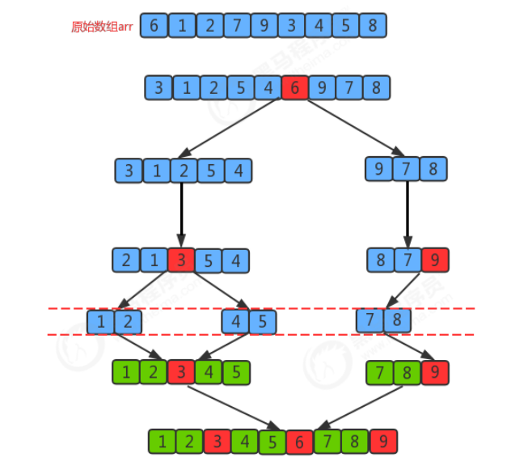
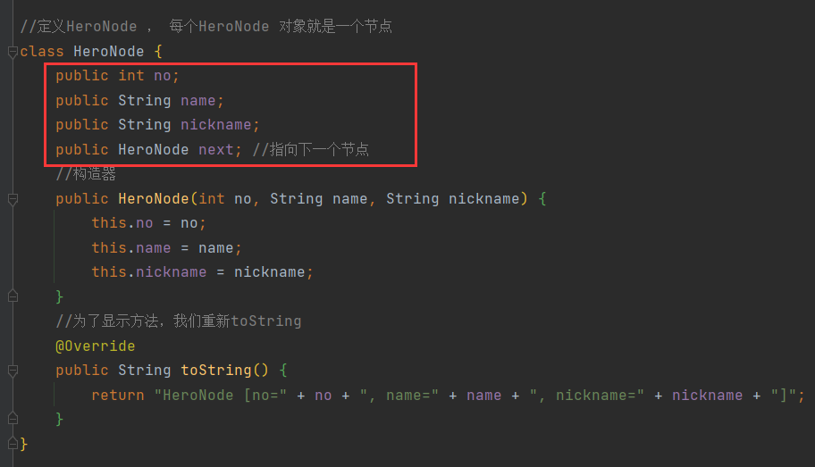
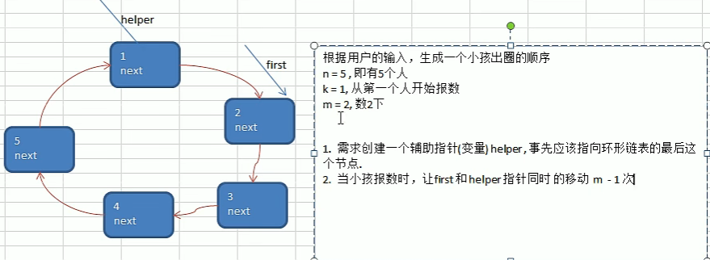
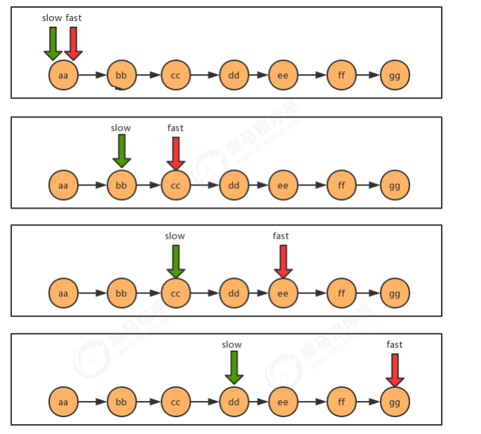
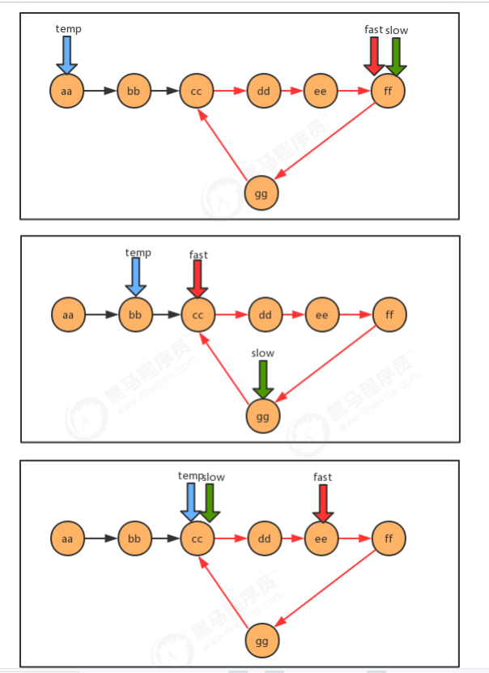
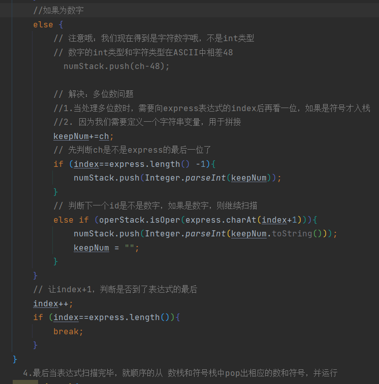
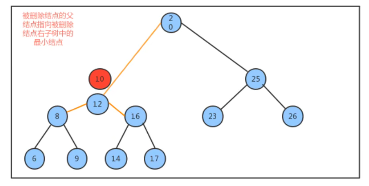
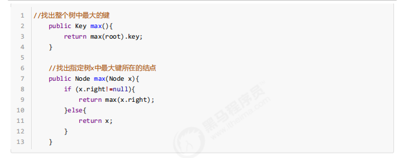

$\color{#FF69B4}{ 1}$

# 整体概述

算法是程序的灵魂，优秀的程序可以在海量数据计算时，依然保持高速计算;

一般来讲 程序会使用了内存计算框架(比如Spark)和缓存技术(比如Redis等)来优化程序,再深入的思考一下，这些计算框架和缓存技术， 它的核心功能是哪个部分呢？

拿实际工作经历来说, 在Unix下开发服务器程序，功能是要支持上千万人同时在线， 在上线前，做内测，一切OK,可上线后，服务器就支撑不住了, 公司的CTO对代码进行优化，再次上线，坚如磐石。你就能感受到程序是有灵魂的，就是算法。

**数据结构和算法的关系**

- 数据data结构(structure)是一门研究组织**数据**方式的学科，有了编程语言也就有了数据结构.学好数据结构可以编写出更加漂亮,更加有效率的代码。
- 要学习好数据结构就要多多考虑如何将生活中遇到的问题,用程序去实现解决.
- 程序 = **数据结构** + 算法
- 数据结构是算法的基础, 换言之，想要学好算法，需要把数据结构学到位。


# 数据结构概述

## **1.什么是数据结构？**

**官方解释：**

数据结构是一门研究非数值计算的程序设计问题中的操作对象，以及他们之间的关系和操作等相关问题的学科。

**大白话：**

数据结构就是把数据元素按照一定的关系组织起来的集合，用来组织和存储数据


## **2.数据结构分类**

传统上，我们可以把数据结构分为逻辑结构和物理结构两大类。

**逻辑结构分类：**

逻辑结构是从具体问题中抽象出来的模型，是**抽象意义上**的结构，按照对象中数据元素之间的相互关系分类，也是我们后面课题中需要关注和讨论的问题。

a.集合结构：集合结构中数据元素除了属于同一个集合外，他们之间没有任何其他的关系。


b.线性结构：线性结构中的数据元素之间存在一对一的关系


c.树形结构：树形结构中的数据元素之间存在一对多的层次关系


d.图形结构：图形结构的数据元素是多对多的关系


**物理结构分类：**

物理结构：是逻辑结构在**计算机中真正的表示方式(是前面逻辑结构的实现）**（又称为映像），也可以叫做存储结构。常见的物理结构有**顺序存储结构、链式存储结构**。

$\color{#FF69B4}{顺序存储结构：}$

把数据元素放到地址连续的存储单元里面，其**数据间的逻辑关系和物理关系是一致的** ，比如我们常用的数组就是顺序存储结构。


顺序存储结构存在一定的**弊端**，就像生活中排时也会有人插队也可能有人有特殊情况突然离开，这时候整个结构都处于变化中，此时就需要链式存储结构。

$\color{#FF69B4}{链式存储结构：}$

是把数据元素存放在任意的存储单元里面，这组存储单元可以是连续的也可以是不连续的。

此时，数据元素之间并**不能**反映元素间的逻辑关系，因此在链式存储结构中引进了一个**指针**存放数据元素的地址，这样通过地址就可以找到相关联数据元素的位置


**数据结构包括：线性结构和非线性结构。**

$\color{#FF69B9}{线性结构}$

1. 线性结构作为最常用的数据结构，其特点是**数据元素之间存在一对一的线性关系**
2. 线性结构有两种不同的存储结构，即**顺序存储结构（数组）**和**链式存储结构（链表）**。
3. 顺序存储的线性表称为顺序表，**顺序表中的存储元素是连续的**。
4. 链式存储的线性表称为链表，**链表中的存储元素不一定是连续**的，元素节点中存放数据元素以及相邻元素的地址信息
5. 线性结构常见的有：**数组、队列、链表和栈**，后面我们会详细讲解.


$\color{#FF69B9}{非线性结构}$

非线性结构包括：**二维数组，多维数组，广义表，树结构，图结构**


# 算法概述

**官方解释：**

算法是指解题方案的准确而完整的描述，是一系列解决问题的清晰指令，算法代表着用系统的方法解决问题的策略机制。也就是说，能够对一定规范的输入，在有限时间内获得所要求的输出。

**大白话：**

根据一定的条件，对一些数据进行计算，得到需要的结果。

在生活中，我们如果遇到某个问题，常常解决方案不是唯一的，算法就是需要去找到最佳的解决方案！！！

对于程序而言，算法就是在解决一个问题时，如何**花费最少的时间、最低的内存需求**来解决这个问题。


# 算法分析

前面我们已经介绍了，研究算法的最终目的就是如何花更少的时间，如何占用更少的内存去完成相同的需求，并且也通过案例演示了不同算法之间时间耗费和空间耗费上的差异，但我们并不能将时间占用和空间占用量化，因此，接下来我们要学习有关**算法时间耗费**和**算法空间耗费**的描述和分析。

- 有关算法时间耗费分析，我们称之为算法的时间复杂度分析；

- 有关算法的空间耗费分析，我们称之为算法的空间复杂度分析。

  

## 1.时间复杂度分析

我们要计算算法时间耗费情况，首先我们得度量算法的执行时间，那么如何度量呢？

==**事后分析估算方法：**==

比较容易想到的方法就是我们把算法执行若干次，然后拿个计时器在旁边计时，这种事后统计的方法看上去的确不错，并且也并非要我们真的拿个计算器在旁边计算，因为计算机都提供了计时的功能。这种统计方法主要是通过设计好的测试程序和测试数据，利用计算机计时器对不同的算法编制的程序的运行时间进行比较，从而确定算法效率的高低.。

但是这种方法有**很大的缺陷**：必须依据算法实现编制好的测试程序，通常要花费大量时间和精力，测试完了如果发现测试的是非常糟糕的算法，那么之前所做的事情就全部白费了，并且不同的测试环境(硬件环境)的差别导致测试的结果差异也很大。


==**事前分析估算方法：**==

在计算机程序编写前，依据统计方法对算法进行估算，经过总结，我们发现一个高级语言编写的程序程序在计算机

上运行所消耗的时间取决于下列因素：

 **1.算法采用的策略和方案；**

 2.编译产生的代码质量；（编译器做的事情）

 **3.问题的输入规模  (所谓的问题输入规模就是输入量的多少)；**

 4.机器执行指令的速度；

由此可见，抛开这些与计算机硬件、软件有关的因素，一个程序的运行时间依赖于算法的好坏和问题的输入规模。如果算法固定，那么该算法的执行时间就只和问题的输入规模有关系了。


我么再次以之前的求和案例为例，进行分析。

**需求：**计算1到100的和。

第一种解法：


​		这里真正求和的代码，是sum += i；

第二种解法：


​		这里真正求和的代码，是sum = (n+1)*n/2;

因此，当输入规模为n时，第一种算法执行了1+1+(n+1)+n=2n+3次；第二种算法执行了1+1+1=3次。如果我们把第一种**算法的循环体看做是一个整体，忽略结束条件的判断**，那么其实这两个算法运行时间的差距就是n和1的差距。


**为什么循环判断在算法1里执行了n+1次，看起来是个不小的数量，但是却可以忽略呢？我们来看下一个例子：**

**需求：** 计算100个1+100个2+100个3+...100个100的结果

代码：


上面这个例子中，如果我们要精确的研究循环的条件执行了多少次，是一件很麻烦的事情，并且，由于真正计算和的代码是内循环的循环体，所以，在研究算法的效率时，我们只考虑核心代码的执行次数，这样可以简化分析，**只要关注核心代码部分，忽略条件循环语句！！**

再其次因为我们研究算法复杂度，侧重的是当输入规模不断增大时，算法的增长量的一个抽象(规律)，而不是精确地定位需要执行多少次，因为如果是这样的话，我们又得考虑回编译期优化等问题，容易主次跌倒。

我们不关心编写程序所用的语言是什么，也不关心这些程序将跑在什么样的计算机上，我们只关心它所实现的算法。这样，不计那些循环索引的递增和循环终止的条件、变量声明、打印结果等操作，最终在分析程序的运行时间时，最重要的是把程序看做是独立于程序设计语言的算法或一系列步骤。**我们分析一个算法的运行时间，最重要的就是把核心操作的次数和输入规模关联起来**


## 2.常见的时间复杂度

**时间频度**

一个算法花费的时间与算法中语句的执行次数成正比例，哪个算法中语句执行次数多，它花费时间就多。`一个算法中的语句执行次数称为语句频度或时间频度。记为T(n)。`


**时间复杂度——大O记法**

一般情况下，算法中的基本操作语句的重复执行次数是问题规模n的某个函数，用T(n)表示，若有某个辅助函数f(n)，使得当n趋近于无穷大时，T(n) / f(n) 的极限值为不等于零的常数，则称**f(n)是T(n)的同数量级函数**。记作 T(n)=Ｏ( f(n) )，称**Ｏ( f(n) )**  为算法的渐进时间复杂度，简称时间复杂度。

T(n) 不同，但时间复杂度可能相同。 如：T(n)=n²+7n+6 与 T(n)=3n²+2n+2 它们的T(n) 不同，但时间复杂度相同，都为O(n²)。

常见时间复杂度：


常见的算法时间复杂度由小到大依次为：

`Ο(1)＜Ο(log2n)＜Ο(n)＜Ο(nlog2n)＜Ο(n2)＜Ο(n3)＜ Ο(nk) ＜Ο(2n)` ，随着问题规模n的不断增大，上述时间复杂度不断增大，算法的执行效率越低。

### 1、常数阶O(1)


无论代码执行了多少行，只要是没有循环等复杂结构，那这个代码的时间复杂度就都是O(1)；

上述代码在执行的时候，它消耗的时候并不随着某个变量的增长而增长，那么无论这类代码有多长，即使有几万几十万行，都可以用O(1)来表示它的时间复杂度。

### 2、对数阶O(log2n)

对数，属于高中数学的内容，我们分析程序以程序为主，数学为辅，所以不用过分担心。


由于每次i*2之后，就距离n更近一步，假设有x个2相乘后大于n，则会退出循环。由于是2^x=n,得到x=log(2)n,所以这个循环的时间复杂度为O(logn);

对于对数阶，由于随着输入规模n的增大，不管底数为多少，他们的增长趋势是一样的，所以我们会忽略底数。


### 3、线性阶O(n)


说明：这段代码，for循环里面的代码会执行n遍，因此它消耗的时间是随着n的变化而变化的，因此这类代码都可以用O(n)来表示它的时间复杂度‘


### 4、线性对数阶O(nlogN)


说明：线性对数阶O(nlogN) 其实非常容易理解，将时间复杂度为O(logn)的代码循环N遍的话，那么它的时间复杂度就是 n * O(logN)，也就是了`O(nlogN)`


### 5、平方阶O(n²)


说明：平方阶O(n²) 就更容易理解了，如果把 O(n) 的代码再嵌套循环一遍，它的时间复杂度就是 O(n²)，这段代码其实就是嵌套了2层n循环，它的时间复杂度就是 `O(n*n)`，即  O(n²) 如果将其中一层循环的n改成m，那它的时间复杂度就变成了 `O(m*n)`

### 6、立方阶O(n³)、K次方阶O(n^k)


### 7、平均时间复杂度、最坏时间复杂度

1. 平均时间复杂度是指所有可能的输入实例均以等概率出现的情况下，该算法的运行时间。
2. 最坏情况下的时间复杂度称最坏时间复杂度。==一般讨论的时间复杂度均是最坏情况下的时间复杂度。==


## 3.空间复杂度

一个算法的空间复杂度(Space Complexity)定义为该算法所耗费的存储空间，它也是问题规模n的函数。

空间复杂度(Space Complexity)是对一个算法在运行过程中临时占用存储空间大小的量度。有的算法需要占用的临时工作单元数与解决问题的规模n有关，它随着n的增大而增大，当n较大时，将占用较多的存储单元，例如快速排序和归并排序算法就属于这种情况

在做算法分析时，**主要讨论的是时间复杂度**。从用户使用体验上看，更看重的程序执行的速度。一些缓存产品(redis, memcache)和算法( 基数排序 )本质就是用空间换时间.

由于java中有内存垃圾回收机制，并且jvm对程序的内存占用也有优化（例如即时编译），我们无法精确的评估一个java程序的内存占用情况，但是了解了java的基本内存占用，使我们可以对java程序的内存占用情况进行估算。

但是，如果你做的程序是嵌入式开发，尤其是一些传感器设备上的内置程序，由于这些设备的内存很小，一般为几kb，这个时候对算法的空间复杂度就有要求了，但是一般做java开发的，基本上都是服务器开发，一般不存在这样的问题。


# 简单排序算法

## 1、冒泡排序（N*N）

基本思想是：通过对待排序序列**从前向后（从下标较小的元素开始）**,依次比较相邻元素的值，若发现**逆序则交换**，使值**较大的元素逐渐从前移向后部**，就象水底下的气泡一样逐渐向上冒。

> 因为排序的过程中，各元素不断接近自己的位置，如果一趟比较下来没有进行过交换，就说明序列有序，因此要在排序过程中设置一个标志flag判断元素是否进行过交换。从而减少不必要的比较。(这里说的优化，可以在冒泡排序写好后，在进行)


```java
	// 将前面额冒泡排序算法，封装成一个方法
	public static void bubbleSort(int[] arr) {
		// 冒泡排序 的时间复杂度 O(n^2), 自己写出
		int temp = 0; // 临时变量
		boolean flag = false; // 标识变量，表示是否进行过交换
		for (int i = 0; i < arr.length - 1; i++) {

			for (int j = 0; j < arr.length - 1 - i; j++) {
				// 如果前面的数比后面的数大，则交换
				if (arr[j] > arr[j + 1]) {
					flag = true;
					temp = arr[j];
					arr[j] = arr[j + 1];
					arr[j + 1] = temp;
				}
			}
			//System.out.println("第" + (i + 1) + "趟排序后的数组");
			//System.out.println(Arrays.toString(arr));

			if (!flag) { // 在一趟排序中，一次交换都没有发生过
				break;
			} else {
				flag = false; // 重置flag!!!, 进行下次判断
			}
		}
	}
```

**冒泡排序的时间复杂度分析** 冒泡排序使用了双层for循环，其中内层循环的循环体是真正完成排序的代码，所以，我们分析冒泡排序的时间复杂度，主要分析一下内层循环体的执行次数即可。

在最坏情况下，也就是假如要排序的元素为{6,5,4,3,2,1}逆序，那么：

元素比较的次数为：

 		(N-1)+(N-2)+(N-3)+...+2+1=((N-1)+1)*(N-1)/2=N^2/2-N/2;

元素交换的次数为：

​		 (N-1)+(N-2)+(N-3)+...+2+1=((N-1)+1)*(N-1)/2=N^2/2-N/2;

总执行次数为：

​		 (N^2/2-N/2)+(N^2/2-N/2)=N^2-N;

按照大O推导法则，保留函数中的最高阶项那么最终冒泡排序的时间复杂度为O(N^2).

==冒泡排序优化：==

 如果我们发现在某趟排序中，没有发生一次交换， 可以**提前结束冒泡排序**。这个就是优化

> 大循环——（len-1）次
>
> 小循环——【0——（len-1-i）】，里面我们是用的j+1，是和后一位进行比较，所以可以取到最后一位


## 2、选择排序（n*n）

**小到大：**选择排序（select sorting）也是一种简单的排序方法。它的基本思想是：第一次从arr[0]~ arr[n-1]中选取最小值，与arr[0]交换，第二次从arr[1]~ arr[n-1]中选取最小值，与arr[1]交换，第三次从arr[2]~ arr[n-1]中选取最小值，与arr[2]交换，…，第i次从arr[i-1]~arr[n-1]中选取最小值，与arr[i-1]交换，…, 第n-1次从arr[n-2]~arr[n-1]中选取最小值，与arr[n-2]交换，总共通过n-1次，得到一个按排序码从小到大排列的有序序列。


```java
	//选择排序
	public static void selectSort(int[] arr) {
		//在推导的过程，我们发现了规律，因此，可以使用for来解决
		//选择排序时间复杂度是 O(n^2)
		for (int i = 0; i < arr.length - 1; i++) {
			int minIndex = i;
			int min = arr[i];
			for (int j = i + 1; j < arr.length; j++) {
				if (min > arr[j]) { // 说明假定的最小值，并不是最小
					min = arr[j]; // 重置min
					minIndex = j; // 重置minIndex
				}
			}

			// 将最小值，放在arr[0], 即交换
			if (minIndex != i) {
				arr[minIndex] = arr[i];
				arr[i] = min;
			}

			//System.out.println("第"+(i+1)+"轮后~~");
			//System.out.println(Arrays.toString(arr));// 1, 34, 119, 101
		}
```

**选择排序的时间复杂度分析：**

选择排序使用了双层for循环，其中外层循环完成了数据交换，内层循环完成了数据比较，所以我们分别统计数据交换次数和数据比较次数：

数据比较次数：

​		 (N-1)+(N-2)+(N-3)+...+2+1=((N-1)+1)*(N-1)/2=N^2/2-N/2;

数据交换次数：

​		 N-1

时间复杂度：`N^2/2-N/2+（N-1）=N^2/2+N/2-1;`

根据大O推导法则，保留最高阶项，去除常数因子，时间复杂度为O(N^2);


## 3、插入排序（n*n）

**排序原理：**

1.把所有的元素分为两组，已经排序的和未排序的；(开始时有序表为一个元素，无序表为N-1)

2.找到未排序的组中的第一个元素，向已经排序的组中进行插入；

3.**倒叙遍历**已经排序的元素，依次和待插入的元素进行比较，如果比待插入的大，则这两个元素交换位置，然后接着往前面走，再次比较，再次换位置。（或者说直到找到一个元素小于等于待插入元素，那么就把待插入元素放到这个位置，其他的元素向后移动一位；）


```java
	//插入排序
	public static void insertSort(int[] arr) {
		int insertVal = 0;
		int insertIndex = 0;
		//使用for循环来把代码简化
		for(int i = 1; i < arr.length; i++) {
			//定义待插入的数
			insertVal = arr[i];
			insertIndex = i - 1; // 即arr[1]的前面这个数的下标
	
			// 给insertVal 找到插入的位置
			// 说明
			// 1. insertIndex >= 0 保证在给insertVal 找插入位置，不越界
			// 2. insertVal < arr[insertIndex] 待插入的数，还没有找到插入位置
			// 3. 就需要将 arr[insertIndex] 后移
			while (insertIndex >= 0 && insertVal < arr[insertIndex]) {
				arr[insertIndex + 1] = arr[insertIndex];// arr[insertIndex]
				insertIndex--;
			}
			// 当退出while循环时，说明插入的位置找到, insertIndex + 1
			// 举例：理解不了，我们一会 debug
			//这里我们判断是否需要赋值
			if(insertIndex + 1 != i) {
				arr[insertIndex + 1] = insertVal;
			}
	
			//System.out.println("第"+i+"轮插入");
			//System.out.println(Arrays.toString(arr));
		}
  }
```


**插入排序的时间复杂度分析**

插入排序使用了双层for循环，其中内层循环的循环体是真正完成排序的代码，所以，我们分析插入排序的时间复杂度，主要分析一下内层循环体的执行次数即可。

最坏情况，也就是待排序的数组元素为{12,10,6,5,4,3,2,1}，那么：

比较的次数为：

​		(N-1)+(N-2)+(N-3)+...+2+1=((N-1)+1)*(N-1)/2=N^2/2-N/2;

交换的次数为：

​		(N-1)+(N-2)+(N-3)+...+2+1=((N-1)+1)*(N-1)/2=N^2/2-N/2;

总执行次数为：

​		`(N^2/2-N/2)+(N^2/2-N/2)=N^2-N;`

按照大O推导法则，保留函数中的最高阶项那么最终插入排序的时间复杂度为O(N^2)


# 高级排序算法

之前我们学习过基础排序，包括冒泡排序，选择排序还有插入排序，并且对他们在最坏情况下的时间复杂度做了分析，发现都是**O(N^2)**，而平方阶通过我们之前学习算法分析我们知道，随着输入规模的增大，时间成本将急剧上升，所以这些基本排序方法不能处理更大规模的问题，接下来我们学习一些高级的排序算法，争取降低算法的时间复杂度最高阶次幂。


## 1、希尔排序（不知道）

希尔排序是希尔（Donald Shell）于1959年提出的一种排序算法。希尔排序也是一种**插入排序**，它是简单插入排序经过改进之后的一个**更高效的版本**，也称为缩小增量排序。

前面学习插入排序的时候，我们会发现一个很不友好的事儿，如果已排序的分组元素为{2,5,7,9,10}，未排序的分组元素为{1,8}，那么下一个待插入元素为1，我们需要拿着1从后往前，依次和10,9,7,5,2进行交换位置，才能完成真正的插入，每次交换只能和相邻的元素交换位置。那如果我们要提高效率，直观的想法就是一次交换，能把1放到更前面的位置，比如一次交换就能把1插到2和5之间，这样一次交换1就向前走了5个位置，可以减少交换的次数，这样的需求如何实现呢？接下来我们来看看希尔排序的原理。

- **排序原理：**

   1.选定一个增长量h，按照增长量h作为数据分组的依据，对数据进行分组；

   2.对分好组的每一组数据完成插入排序；

   3.减小增长量，最小减为1，重复第二步操作。


> 这个分组策略，我详细讲一下：
>
> 首先，总共十个元素，我们看成10组。
>
> 第一步：10/2 = 5，也就是把十个数据分为五组，步长为5，就是说，每个元素和他间隔距离=5的元素为一组（累计链式计算这种）。如对于第一个元素8，他后移5个单位为3，然后3后移5个单位没有了，所以8、3一组
>
> 第二步时：把上面的5组再次划分。5/2 = 2，这次分为两组，步长为2 。第一个数字3——后移2个单位找到1——1再后移2个单位得到0——0后移2个单位得到9——9后移两个单位得到7——7再后移两个单位，没有数据了，所以3、1、0、9、7一组。
>
> 第三步时：2/2 = 1，即分为一组，也就是所有元素一起排序。


增长量h的确定：增长量h的值每一固定的规则，我们这里采用以下规则：

```java
int h=1
while(h < 数组长度/2){
		h=2h+1；//3,7
}
//循环结束后我们就可以确定h的最大值；
h的减小规则为：
		h=h/2
```


```java
public class Shell {

    /*
    对数组a中的元素进行希尔排序
    */
    public static void sort(Comparable[] a) {
        // 1.确定增量h初始值
        int h =1;
        while(h<a.length /2){
            h = 2*h +1;
        }

        // 2.h》=1时进行排序
        while(h>=1){
            // 排序
            //1. 找到待插入的元素索引
            for (int i = h; i <= a.length-1 ; i++) {
                //2.将待插入的元素插入到有序序列中（插入排序）
                for (int j = i;j>=h;j-=h){  //j>=h因为我们要比较a[j]和a[j-h]，j-h>=0
                    // 待插入元素是a[j],需要比较a[j]和a[j-h]
                    if(greater(a[j-h],a[j])){
                        // 交换元素
                        exch(a,j,j-h);
                    }else {
                        // 不交换则说明，待插入元素已经找到了合适的位置,结束此次插入排序
                        break;
                    }
                }
            }

            // 增量减少
            h = h /2;
        }
    }

    /*
        比较v元素是否大于w元素
    */
    private static boolean greater(Comparable v,Comparable w){
        return v.compareTo(w)>0;
    }

    /*
        数组元素i和j交换位置
    */
    private static void exch(Comparable[] a,int i,int j){
        Comparable t = a[i];
        a[i]=a[j];
        a[j]=t;
    }
}
```

**希尔排序的时间复杂度分析**

在希尔排序中，增长量h并没有固定的规则，有很多论文研究了各种不同的递增序列，但都无法证明某个序列是最好的，对于希尔排序的时间复杂度分析，已经超出了我们课程设计的范畴，所以在这里就不做分析了。

我们可以使用**事后分析法**对希尔排序和插入排序做性能比较。

在资料的测试数据文件夹下有一个reverse_shell_insertion.txt文件，里面存放的是从100000到1的逆向数据，我们可以根据这个批量数据完成测试。测试的思想：在执行排序前前记录一个时间，在排序完成后记录一个时间，两个时间的时间差就是排序的耗时。

通过测试发现，**在处理大批量数据时**，希尔排序的性能确实高于插入排序。


## 2、归并排序O(NlogN)

### 2.1递归

正式学习归并排序之前，我们得先学习一下递归算法。

**定义：**

定义方法时，在方法内部调用方法本身，称之为递归.


**作用：**

它通常把一个大型复杂的问题，层层转换为一个与原问题相似的，规模较小的问题来求解。递归策略只需要少量的程序就可以描述出解题过程所需要的多次重复计算，大大地减少了程序的代码量。

**注意事项：**

在递归中，不能无限制的调用自己，==必须要有边界条件，能够让递归结束==，因为每一次递归调用都会在**栈内存开辟新的空间**，重新执行方法，如果递归的层级太深，很容易造成**栈内存溢出**。


**需求：**

请定义一个方法，使用递归完成求N的阶乘；


```java
public class FactorialTest {
    public static void main(String[] args) {
        long factorial = factorial(10);
        System.out.println(factorial);
    }

    public static long factorial(int n){
        if(n == 1){
            return 1;
        }
        return n*factorial(n-1);
    }
}
```

### 2.2递归排序 

归并排序是建立在归并操作上的一种有效的排序算法，该算法是采用**分治法**的一个非常典型的应用。将已有序的子序列合并，得到完全有序的序列；即先使每个子序列有序，再使子序列段间有序。若将两个有序表合并成一个有序表，称为二路归并。

**排序原理：**

1. ==尽可能的一组数据拆分成两个元素相等的左右子组，并对每一个子组继续拆分，直到拆分后的每个子组的元素个数是1为止。==

2. ==将相邻的两个子组进行合并成一个有序的大组；（治的时候进行排序）==

3. ==不断的重复步骤2，直到最终只有一个组为止。==

4. ==归并排序需要与原数组大小相同的辅助数组！！！==

**特点：**

​		单从上面的文字只是简单描述无法完全展示细节，从下面的图示可以看出其固定特点：

​		==1、划分方式一样，left、mid、right，然后区分左右两边==

​		==2、合并时，永远都是两个相邻的子组合并，不会出现跨的情况==（每次【left，mid】和【mid+1，right】这两部分存储是连续的，合并起来就是原数组的【left，right】，由前面划分方式特点决定的）


```java
package Algorithm;

/**
 * 归并排序算法
 */
public class MergeSort {

    // 归并排序的入口
    public int[] mergeSort(int[] nums) {
        // 1、分配辅助数组，存储排序后的元素，最后把这个数组复制给原数组
        int[] tempArr = new int[nums.length];
        // 开始进行归并排序（先分后治）
        split(nums, tempArr, 0, nums.length - 1);
        return nums;
    }


    // 第一个环节：拆分,(left、right--数组索引--表示需要排序的数组范围）
    public void split(int[] nums, int[] tempArr, int left, int right) {
        // 如果只有一个元素，那么就不需要再划分，其本身就是有序的，只需要被归并即可,
        // 也就是left=right时停止划分，开始归并
        if (left == right) {
            return;
        }
        // 找中间点
        int mid = (left + right) / 2;
        // 递归划分左半区
        split(nums, tempArr, left, mid);
        // 递归划分右半区
        split(nums, tempArr, mid + 1, right);
        // 合并两个部分，并且排序(递归就是方法往栈里面压，第一次走到这一步时，说明到了left、right相邻了）
        // 合并【left，mid】和【mid+1，righ】
        merge(nums, tempArr, left, mid, right);
    }

    // 第二个环节：合并
    public void merge(int[] nums, int[] tempArr, int left, int mid, int right) {
        // 用到了核心的双指针
        int index = left;  // 定义指针，指向tempArr数组中开始填充数据的索引
        int p1 = left;  //定义指针，指向第一组数据的第一个元素
        int p2 = mid + 1;  //定义指针，指向第二组数据的第一个元素
        // 遍历1，移动p1指针和p2指针，比较对应索引处的值，将较小的那个放到辅助数组指针对应的索引位置
        while (p1 <= mid && p2 <= right) {
            if (nums[p1] <= nums[p2]) {
                tempArr[index++] = nums[p1++];
            } else {
                tempArr[index++] = nums[p2++];
            }
        }
        // 遍历2，如果p1的指针没有走完，那么顺序移动p1指针，把元素放到辅助数组里面
        while (p1 <= mid) {
            tempArr[index++] = nums[p1++];
        }
        // 遍历3，如果p2的指针没有走完，那么顺序移动p2指针，把元素放到辅助数组里面
        while (p2 <= right) {
            tempArr[index++] = nums[p2++];
        }
        // 复制到原数组，将tempArr的这次排序部分复制过去
        for (int i = left; i <= right; i++) {
            nums[i] = tempArr[i];
        }
    }
}

```

**归并原理：**


```java
/*
对数组中，从lo到mid为一组，从mid+1到hi为一组，对这两组数据进行归并
 */
    // 第二个环节：合并
    public void merge(int[] nums, int[] tempArr, int left, int mid, int right) {
        // 用到了核心的双指针
        int index = left;  // 定义指针，指向tempArr数组中开始填充数据的索引
        int p1 = left;  //定义指针，指向第一组数据的第一个元素
        int p2 = mid + 1;  //定义指针，指向第二组数据的第一个元素
        // 遍历1，移动p1指针和p2指针，比较对应索引处的值，将较小的那个放到辅助数组指针对应的索引位置
        while (p1 <= mid && p2 <= right) {
            if (nums[p1] <= nums[p2]) {
                tempArr[index++] = nums[p1++];
            } else {
                tempArr[index++] = nums[p2++];
            }
        }
        // 遍历2，如果p1的指针没有走完，那么顺序移动p1指针，把元素放到辅助数组里面
        while (p1 <= mid) {
            tempArr[index++] = nums[p1++];
        }
        // 遍历3，如果p2的指针没有走完，那么顺序移动p2指针，把元素放到辅助数组里面
        while (p2 <= right) {
            tempArr[index++] = nums[p2++];
        }
        // 复制到原数组，将tempArr的这次排序部分复制过去
        for (int i = left; i <= right; i++) {
            nums[i] = tempArr[i];
        }
    }
```


### **时间复杂度分析：**

- 假设元素的个数为n，那么使用归并排序拆分的次数为 log2(n)【向上取整】,所以共log2(n)层，时间复杂度为 **O(logN)**
- 然后每一层归并的时间复杂度为 **O(N)**，每个元素都需要比较一次
- 最终的为 **O(NlogN)**


归并排序是分治思想的最典型的例子，上面的算法中，对a[lo...hi]进行排序，先将它分为a[lo...mid]和a[mid+1...hi]两部分，分别通过递归调用将他们单独排序，最后将有序的子数组归并为最终的排序结果。

该递归的出口在于如果一个数组不能再被分为两个子数组，那么就会执行merge进行归并，在归并的时候判断元素的大小进行排序。


用树状图来描述归并，如果一个数组有8个元素，那么它将每次除以2找最小的子数组，共拆log8次，值为3，所以树共有3层,那么自顶向下第k层有2^ k个子数组，每个数组的长度为2^ (3-k)，每个数组归并最多需要2^(3-k)次比较。因此每层的比较次数为 2^k * 2^ (3-k)=2^3,那么3层总共为 3*2^3。

**假设元素的个数为n，那么使用归并排序拆分的次数为 log2(n),所以共log2(n)层，**那么使用log2(n)替换上面3*2^3中的3这个层数，最终得出的归并排序的时间复杂度为：

log2(n) * 2^(log2(n))=log2(n)*n,根据大O推导法则，忽略底数，==最终归并排序的时间复杂度为   **O(nlogn);  **==

**归并排序的缺点：**

需要申请额外的数组空间，导致空间复杂度提升，是典型的以空间换时间的操作。

**归并排序与希尔排序性能测试：**

之前我们通过测试可以知道希尔排序的性能是由于插入排序的，那现在学习了归并排序后，归并排序的效率与希尔排序的效率哪个高呢？我们使用同样的测试方式来完成一样这两个排序算法之间的性能比较。

在资料的测试数据文件夹下有一个reverse_arr.txt文件，里面存放的是从1000000到1的逆向数据，我们可以根据这个批量数据完成测试。测试的思想：在执行排序前前记录一个时间，在排序完成后记录一个时间，两个时间的时间差就是排序的耗时。

```java
package test;

import Algorithm.Merge;
import Algorithm.Shell;

import java.io.BufferedReader;
import java.io.FileInputStream;
import java.io.InputStreamReader;
import java.util.ArrayList;

public class SortCompare {
    public static void main(String[] args) throws Exception{
        ArrayList<Integer> list = new ArrayList<>();
        //读取a.txt文件
        BufferedReader reader = new BufferedReader((new InputStreamReader(new FileInputStream("F:\\Java_Project\\DataStructure&Algorithm\\HeiMa\\src\\test\\reverse_arr.txt"))));
        String line=null;
        while((line=reader.readLine())!=null){
//把每一个数字存入到集合中
            list.add(Integer.valueOf(line));
        }
        reader.close();
//把集合转换成数组
        Integer[] arr = new Integer[list.size()];
        list.toArray(arr);

         testMerge(arr);//使用归并排序耗时：1200
        testShell(arr);//使用希尔排序耗时：1277
    }
    public static void testMerge(Integer[] arr){
//使用插入排序完成测试
        long start = System.currentTimeMillis();
        Merge.sort(arr);
        long end= System.currentTimeMillis();
        System.out.println("使用归并排序耗时："+(end-start));
    }
    public static void testShell(Integer[] arr){
//使用希尔排序完成测试
        long start = System.currentTimeMillis();
        Shell.sort(arr);
        long end = System.currentTimeMillis();
        System.out.println("使用希尔排序耗时："+(end-start));
    }

}
```

通过测试，发现希尔排序和归并排序在处理大批量数据时差别不是很大。


## 3、快速排序O(nlogn)

快速排序是对**冒泡排序**的一种改进。它的基本思想是：通过一趟排序将要排序的数据分割成独立的两部分，其中一部分的所有数据都比另外一部分的所有数据都要小，然后再按此方法对这两部分数据分别进行快速排序，整个排序过程可以递归进行，以此达到整个数据变成有序序列。

**排序原理：**

1.首先设定一个分界值，通过该分界值将数组分成左右两部分；

2.将大于或等于分界值的数据放到到数组右边，小于分界值的数据放到数组的左边。此时左边部分中各元素都小于或等于分界值，而右边部分中各元素都大于或等于分界值；

3.然后，左边和右边的数据可以独立排序。对于左侧的数组数据，又可以取一个分界值，将该部分数据分成左右两部分，同样在左边放置较小值，右边放置较大值。右侧的数组数据也可以做类似处理。

4.重复上述过程，可以看出，这是一个**递归定义**。通过递归将左侧部分排好序后，再递归排好右侧部分的顺序。当左侧和右侧两个部分的数据排完序后，整个数组的排序也就完成了。




 	

```java
package Algorithm;

public class Quick {
    /*
     比较v元素是否小于w元素
  */
    private static boolean less(Comparable v, Comparable w) {
        return v.compareTo(w) < 0;
    }

    /*
   数组元素i和j交换位置
    */
    private static void exch(Comparable[] a, int i, int j) {
        Comparable t = a[i];
        a[i] = a[j];
        a[j] = t;
    }

    //对数组内的元素进行排序
    public static void sort(Comparable[] a) {
        int lo = 0;
        int hi = a.length-1;
        sort(a,lo,hi);
    }

    //对数组a中从索引lo到索引hi之间的元素进行排序
    private static void sort(Comparable[] a, int lo, int hi) {
        //安全性校验
        if(lo>=hi){
            return; //这个就是递归边界条件
        }
        // 需要对数组中lo索引到hi索引的值的元素进行分组（左子组和右子组）
        int partition = partition(a, lo, hi); //返回的是分组的分界值所在的索引，分界值位置变换后的索引。
        // 让左子组有序
        sort(a,lo,partition-1);
        // 让右子组有序
        sort(a,partition+1,hi);
    }

    //                      核心代码处
    // 对数组a中，从索引 lo到索引 hi之间的元素进行分组，并返回分组界限对应的索引
    public static int partition(Comparable[] a, int lo, int hi) {

    }
}
```


**切分原理：**

把一个数组切分成两个子数组的基本思想：

1.找一个基准值，用两个指针分别指向数组的头部和尾部；

2.先从尾部向头部开始搜索一个比基准值小的元素，搜索到即停止，并记录指针的位置；

3.再从头部向尾部开始搜索一个比基准值大的元素，搜索到即停止，并记录指针的位置；

4.交换当前左边指针位置和右边指针位置的元素；

5.重复2,3,4步骤，直到左边指针的值大于右边指针的值停止。


```java
//                      核心代码处
// 对数组a中，从索引 lo到索引 hi之间的元素进行分组，并返回分组界限对应的索引
public static int partition(Comparable[] a, int lo, int hi) {
    // 确定分界值
    Comparable key = a[lo];
    // 定义两个指针，分别指向待切分元素的最小索引处和最大索引处的下一个位置
    int left = lo;
    int right = hi+1;

    // 切分
    while(true){
        // 先从右往左扫描，移动right指针，找到一个比分界值小的元素，停止。
        while(less(key,a[--right])){
            if (right==lo){
                break;
            }
        }
        // 再从左往右扫描，移动left指针，找到一个比分界值大的元素，停止。
        while (less(a[++left],key)){
            if (left==hi){
                break;
            }
        }
        //判断left是否大于等于right，是的话，则证明元素扫描完了，结束循环了该，如果不是则交换两个指针指向的元素
        if (left>=right){
            break;

        }else {
            exch(a,left,right);
        }
    }
    // 最后交换rigth索引处和基准值所在的索引处的值
    exch(a,lo,right);
    return right;
}
```


**快速排序和归并排序的区别：**

快速排序是另外一种分治的排序算法，它将一个数组分成两个子数组，将两部分独立的排序。快速排序和归并排序是互补的：

- 归并排序将数组分成两个子数组分别排序，并将有序的子数组归并从而将整个数组排序，而快速排序的方式则是当两个数组都有序时，整个数组自然就有序了

- 在归并排序中，一个数组被等分为两半，归并调用发生在处理整个数组之前，在快速排序中，切分数组的位置取决于数组的内容，递归调用发生在处理整个数组之后。

  

### **时间复杂度分析：**

快速排序的一次切分从两头开始交替搜索，直到left和right重合，因此，==一次切分算法的时间复杂度为O(n),  但整个快速排序的时间复杂度和切分的次数相关。==

**最优情况：**每一次切分选择的基准数字刚好将当前序列等分。


如果我们把数组的切分看做是一个树，那么上图就是它的最优情况的图示，共切分了logn次，所以，最优情况下快速排序的时间复杂度为O(nlogn);


**最坏情况：**每一次切分选择的基准数字是当前序列中最大数或者最小数，这使得每次切分都会有一个子组，那么总共就得切分n次，所以，最坏情况下，快速排序的时间复杂度为O(n^2);


**平均情况：**每一次切分选择的基准数字不是最大值和最小值，也不是中值，这种情况我们也可以用数学归纳法证明，  ==快速排序的时间复杂度为O(nlogn)==   ,由于数学归纳法有很多数学相关的知识，容易使我们混乱，所以这里就不对平均情况的时间复杂度做证明了。


## 4、排序的稳定性

**稳定性的定义：**

数组arr中有若干元素，其中A元素和B元素相等，并且A元素在B元素前面，如果使用某种排序算法排序后，能够保证A元素依然在B元素的前面，可以说这个该算法是稳定的。


**稳定性的意义：**

如果一组数据只需要一次排序，则稳定性一般是没有意义的，如果一组数据需要**多次排序**，稳定性是**有意义的**。例如要排序的内容是一组商品对象，第一次排序按照价格由低到高排序，第二次排序按照销量由高到低排序，如果第二次排序使用稳定性算法，就可以使得相同销量的对象依旧保持着价格高低的顺序展现，只有销量不同的对象才需要重新排序。这样既可以保持第一次排序的原有意义，而且可以减少系统开销。


第二次按照销量进行从高到低排序：


**常见排序算法的稳定性：**

- ==**冒泡排序：稳定**==

​		只有当arr[i]>arr[i+1]的时候，才会交换元素的位置，而相等的时候并不交换位置，所以冒泡排序是一种稳定排序算法。

- **选择排序:**

​		选择排序是给每个位置选择当前元素最小的,例如有数据{5(1)，8 ，5(2)， 2， 9 },第一遍选择到的最小元素为2，所以5(1)会和2进行交换位置，此时5(1)到了5(2)后面，破坏了稳定性，所以选择排序是一种不稳定的排序算法。

- ==**插入排序：稳定**==

比较是从有序序列的末尾开始，也就是想要插入的元素和已经有序的最大者开始比起，如果比它大则直接插入在其后面，否则一直往前找直到找到它该插入的位置。如果碰见一个和插入元素相等的，那么把要插入的元素放在相等元素的后面。所以，相等元素的前后顺序没有改变，从原无序序列出去的顺序就是排好序后的顺序，所以插入排序是稳定的。

- **希尔排序：**

希尔排序是按照不同步长对元素进行插入排序 ,虽然一次插入排序是稳定的，不会改变相同元素的相对顺序，但在不同的插入排序过程中，相同的元素可能在各自的插入排序中移动，最后其稳定性就会被打乱，所以希尔排序是不稳定的。

- ==**归并排序：稳定**==

归并排序在归并的过程中，只有arr[i]<arr[i+1]的时候才会交换位置，如果两个元素相等则不会交换位置，所以它并不会破坏稳定性，归并排序是稳定的。

- **快速排序：**

快速排序需要一个基准值，在基准值的右侧找一个比基准值小的元素，在基准值的左侧找一个比基准值大的元素，然后交换这两个元素，此时会破坏稳定性，所以快速排序是一种不稳定的算法。


# 数据结构-线性表

线性表是最基本、最简单、也是最常用的一种数据结构。一个线性表是n个具有相同特性的数据元素的有限序列。

前驱元素：若A元素在B元素的前面，则称A为B的前驱元素

后继元素：若B元素在A元素的后面，则称B为A的后继元素

**线性表的特征：**数据元素之间具有一种“一对一”的逻辑关系。

1. 第一个数据元素没有前驱，这个数据元素被称为头结点；

2. 最后一个数据元素没有后继，这个数据元素被称为尾结点；

3. 除了第一个和最后一个数据元素外，其他数据元素有且仅有一个前驱和一个后继。

**线性表的分类：**

线性表中数据存储的方式可以是顺序存储，也可以是链式存储，按照数据的存储方式不同，可以把线性表分为顺序表和链表。

## **1.** **顺序表**

**顺序表是在计算机内存中以数组的形式保存的线性表**，线性表的顺序存储是指用一组地址连续的存储单元，依次存储线性表中的各个元素、使得线性表中再逻辑结构上响铃的数据元素存储在相邻的物理存储单元中，**即通过数据元素物理存储的相邻关系来反映数据元素之间逻辑上的相邻关系。**


**1.1.4** **顺序表的时间复杂度**

**get(i):**  不难看出，不论数据元素量N有多大，只需要一次eles[i]就可以获取到对应的元素，所以时间复杂度为O(1);

**insert(int i,T t):**  每一次插入，都需要把i位置后面的元素移动一次，随着元素数量N的增大，移动的元素也越多，时间复杂为O(n);

**remove(int i):**  每一次删除，都需要把i位置后面的元素移动一次，随着数据量N的增大,移动的元素也越多，时间复杂度为O(n);

问题：**由于顺序表的底层由数组实现**，数组的长度是固定的，所以在操作的过程中涉及到了**容器扩容操作**。这样会导致顺序表在使用过程中的时间复杂度不是线性的，在某些需要扩容的结点处，耗时会突增，尤其是元素越多，这个问题越明显！！！


 **java中ArrayList实现**

java中ArrayList集合的底层也是一种顺序表，使用数组实现，同样提供了增删改查以及扩容等功能。


## 2、链表

之前我们已经使用顺序存储结构实现了线性表，我们会发现虽然顺序表的查询很快，时间复杂度为O(1),但是增删的效率是比较低的，因为每一次增删操作都伴随着大量的数据元素移动。这个问题有没有解决方案呢？

有，我们可以使用另外一种存储结构实现线性表，链式存储结构。链表是一种物理存储单元上非连续、非顺序的存储结构，其物理结构不能只管的表示数据元素的逻辑顺序，数据元素的逻辑顺序是通过链表中的指针链接次序实现的。链表由一系列的结点（链表中的每一个元素称为结点）组成，结点可以在运行时动态生成。

链表是有序的列表——链式表，但是它在内存中是存储如下：


小结:

1. 链表是以节点的方式来存储,是**链式存储**
2. 每个节点包含 data 域， next 域：指向下一个节点.
3. 如图：发现链表的各个节点不一定是连续存储.
4. 链表分**带头节点**的链表和**没有头节点**的链表，根据实际的需求来确定


### 1. 单链表



==注意注意》》》》：==

查询修改的时候： temp以后都取**第一个数据点**，统一一下写法！！，正因为如此，每次第一步是：判断链表是否为空，否则取不到第一个数据点。

添加的时候：temp只能取head。因为他没数据的嘛。

删除的时候，temp只能取head，因为他要找到前一个元素来往后判断。


单链表 **(带头结点)** 逻辑结构示意图如下：头节点不存放任何信息，而且千万不能乱动，头节点变化的话，这个链表就找不到了。

**链表尾节点的标志：next域为null。**


**应用实例：**

使用带head头的单向链表实现 –水浒英雄排行榜管理；

- 完成对英雄人物的增删改查操作。
- 第一种方法在添加英雄时，直接添加到链表的尾部。
- 第二种方式在添加英雄时，根据排名将英雄插入到指定位置 (如果有这个排名，则添加失败，并给出提示)

**第一种方法添加：**


部分代码：


```java
//添加节点到单向链表
//思路，当不考虑编号顺序时
//1. 找到当前链表的最后节点
//2. 将最后这个节点的next 指向 新的节点
public void add(HeroNode heroNode) {

   //因为head节点不能动，因此我们需要一个辅助遍历 temp
   HeroNode temp = head;
   //遍历链表，找到最后
   while(true) {
      //找到链表的最后
      if(temp.next == null) {//
         break;
      }
      //如果没有找到最后, 将将temp后移
      temp = temp.next;
   }
   //当退出while循环时，temp就指向了链表的最后
   //将最后这个节点的next 指向 新的节点
   temp.next = heroNode;
}

//显示链表[遍历]
	public void list() {
		//判断链表是否为空
		if(head.next == null) {
			System.out.println("链表为空");
			return;
		}
		//因为头节点，不能动，因此我们需要一个辅助变量来遍历
		HeroNode temp = head.next;
		while(true) {
			//输出节点的信息
			System.out.println(temp);
			//判断是否到链表最后
			if (temp.next==null){
				break;
			}
			//将temp后移， 一定小心
			temp = temp.next;
		}
	}
```

**第二种方法添加：**


这里很细节哦：首先我们插入的时候，肯定是插入temp和temp.next的中间位置对吧，所以我们判断的时候，只能根据temp.next和新节点比较，因为temp只能获取下一个节点的信息，不能获取上一个节点！！！，插入替换操作需要，对应三个节点的信息！！！。

部分代码：

```java
//第二种方式在添加英雄时，根据排名将英雄插入到指定位置
//(如果有这个排名，则添加失败，并给出提示)
public void addByOrder(HeroNode heroNode) {
   //因为头节点不能动，因此我们仍然通过一个辅助指针(变量)来帮助找到添加的位置
   //因为单链表，因为我们找的temp 是位于 添加位置的前一个节点，否则插入不了
   HeroNode temp = head;
   boolean flag = false; // flag标志添加的编号是否存在，默认为false
   while(true) {
      if(temp.next == null) {//说明temp已经在链表的最后
         break; //
      }
      if(temp.next.no > heroNode.no) { //位置找到，就在temp的后面插入
         break;
      } else if (temp.next.no == heroNode.no) {//说明希望添加的heroNode的编号已然存在

         flag = true; //说明编号存在
         break;
      }
      temp = temp.next; //后移，遍历当前链表
   }
   //判断flag 的值
   if(flag) { //不能添加，说明编号存在
      System.out.printf("准备插入的英雄的编号 %d 已经存在了, 不能加入\n", heroNode.no);
   } else {
      //插入到链表中, temp的后面
      heroNode.next = temp.next;
      temp.next = heroNode;
   }
}
```

**修改节点信息：**

根据编号no进行每个数据的唯一标识，拿着这个找到对应的节点。

```java
//修改节点的信息, 根据no编号来修改，即no编号不能改.
//说明
//1. 根据 newHeroNode 的 no 来修改即可
public void update(HeroNode newHeroNode) {
   //判断是否空
   if(head.next == null) {
      System.out.println("链表为空~");
      return;
   }
   //找到需要修改的节点, 根据no编号
   //定义一个辅助变量
   HeroNode temp = head.next;
   boolean flag = false; //表示是否找到该节点
   while(true) {
      if(temp.no == newHeroNode.no) {
         //找到
         flag = true;
         break;
      }
      if (temp.next == null) {
         break; //已经遍历完链表
      }
      temp = temp.next;
   }
   //根据flag 判断是否找到要修改的节点
   if(flag) {
      temp.name = newHeroNode.name;
      temp.nickname = newHeroNode.nickname;
   } else { //没有找到
      System.out.printf("没有找到 编号 %d 的节点，不能修改\n", newHeroNode.no);
   }
}
```

**删除节点**

根据节点的no进行删除


```java
//删除节点
//思路
//1. head 不能动，因此我们需要一个temp辅助节点找到待删除节点的前一个节点
//2. 说明我们在比较时，是temp.next.no 和  需要删除的节点的no比较
public void del(int no) {
   HeroNode temp = head;
   boolean flag = false; // 标志是否找到待删除节点的
  
   while(true) {
      if(temp.next == null) { //已经到链表的最后
         break;
      }
      if(temp.next.no == no) {
         //找到的待删除节点的前一个节点temp
         flag = true;
         break;
      }
      temp = temp.next; //temp后移，遍历
   }
   //判断flag
   if(flag) { //找到
      //可以删除
      temp.next = temp.next.next;
   }else {
      System.out.printf("要删除的 %d 节点不存在\n", no);
   }
}
```


### 2. 双链表

就是比单向链表多了一个属性，多一个pre域，指向前一个节点。


还是用前面的水浒传英雄的例子：

新建对象，加了一个pre对象。

```java
//定义HeroNode2 ， 每个HeroNode 对象就是一个节点
class HeroNode2 {
    public int no;
    public String name;
    public String nickname;
    public HeroNode2 next; //指向下一个节点
    public HeroNode2 pre;
		..............
}
```

**添加节点：**

```java
//添加节点到双向链表
    //思路，当不考虑编号顺序时
    //1. 找到当前链表的最后节点
    //2. 将最后这个节点的next 指向 新的节点，新节点的pre指向这个节点
    public void add(HeroNode2 heroNode2) {

        //因为head节点不能动，因此我们需要一个辅助遍历 temp
        HeroNode2 temp = head;
        //遍历链表，找到最后
        while(true) {
            //找到链表的最后
            if(temp.next == null) {//
                break;
            }
            //如果没有找到最后, 将将temp后移
            temp = temp.next;
        }
        //当退出while循环时，temp就指向了链表的最后
        temp.next = heroNode2;
        heroNode2.pre = temp;
    }
```

**删除节点：**

```java
//删除节点
    //思路：因为是双向的，所以我们直接找到这个被删除节点即可；
    public void del(int no) {
        if (head.next==null){
            return;
        }
        HeroNode2 temp = head.next;
        boolean flag = false; // 标志是否找到待删除节点的
        while(true) {
            if(temp.no == no) {
                //找到的待删除节点的前一个节点temp
                flag = true;
                break;
            }
            if(temp.next == null) { //已经到链表的最后
                break;
            }
            temp = temp.next; //temp后移，遍历
        }
        //判断flag
        if(flag) {
            temp.pre.next = temp.next;
            if (temp.next!=null){
                //这里有问题，当被删除的为最后一个节点时，出现空指针异常；所以必须先判断是不是最后一个
                temp.next.pre = temp.pre;
            }
        }else {
            System.out.printf("要删除的 %d 节点不存在\n", no);
        }
    }
```

**修改节点：**

```java
//修改节点的信息, 根据no编号来修改，即no编号不能改.
    //根据 newHeroNode 的 no 来修改即可
    public void update(HeroNode2 newHeroNode) {
        //判断是否空
        if(head.next == null) {
            System.out.println("链表为空~");
            return;
        }
        //找到需要修改的节点, 根据no编号
        //定义一个辅助变量
        HeroNode2 temp = head.next;
        boolean flag = false; //表示是否找到该节点
        while(true) {
            if(temp.no == newHeroNode.no) {
                //找到
                flag = true;
                break;
            }
            if (temp.next == null) {
                break; //已经遍历完链表
            }
            temp = temp.next;
        }
        //根据flag 判断是否找到要修改的节点
        if(flag) {
            temp.name = newHeroNode.name;
            temp.nickname = newHeroNode.nickname;
        } else { //没有找到
            System.out.printf("没有找到 编号 %d 的节点，不能修改\n", newHeroNode.no);
        }
    }
```

### 3. 单向环形链表

循环链表，顾名思义，链表整体要形成一个圆环状。在单向链表中，最后一个节点的指针为null，不指向任何结点，因为没有下一个元素了。要实现循环链表，我们只需要让单向链表的最后一个节点的指针指向头结点即可。


**问题描述：**

Josephu(约瑟夫、约瑟夫环)  问题

设编号为1，2，… n的n个人围坐一圈，约定编号为k（1<=k<=n）的人从1开始报数，数到m 的那个人出列，它的下一位又从1开始报数，数到m的那个人又出列，依次类推，直到所有人出列为止，由此产生一个出队编号的序列。

**思路：**

用一个**不带头结点的单向循环链表**来处理Josephu 问题：先构成一个有n个结点的单循环链表，然后由k结点起从1开始计数，计到m时，对应结点从链表中删除，然后再从被删除结点的下一个结点又从1开始计数，直到最后一个结点从链表中删除算法结束。


**我们简单写一个例子分析：**


具体单向环形链表实现思路：

1、添加第一个节点时，first是固定指向的，类似于头节点不要乱动。必须让第一个节点自己指向自己。


2、添加后续节点时，新建一个辅助指针---curBoy，指向first这里；然后curBoy的next指向新节点boy，新节点boy的next指向first这里；最后curBoy = curBoy.next；；boy不是均是指的要加进来的新节点撒。


3、遍历环形链表

1. 先让一个辅助指针(变量) curBoy，指向first节点
2. 然后通过一个while循环遍历 该环形链表即可 curBoy.next  == first 结束

**代码实现：**


**创建对应的链表：**

```java
//创建环形单向链表
class CircleSingleLinkedList{
  
    // 第一个first节点，当前没有编号
    private Boy first = null;

    //添加小孩节点，构建一个环形的链表, 参数为小孩的个数
    public void addBoy(int nums){
        //数据检验，至少有一个小孩
        if (nums < 1){
            System.out.println("nums的数值错误");
        }
      
        Boy curBoy = null;  //辅助指针
        // 使用for循环创建环形链表
        for (int i = 1; i <= nums; i++) {
            //根据编号创建小孩节点（从1开始编号）
            Boy boy = new Boy(i);
            //如果是第一个小孩
            if (i==1){
                first = boy;
                first.setNext(first);
                curBoy = first;
            }else {
                // 后续小孩
                curBoy.setNext(boy);
                boy.setNext(first);
                curBoy = curBoy.getNext();
            }
        }
    }

}
```

**遍历：**

```java
//    遍历链表
    public void showBoy(){
        if (first==null){
            System.out.println("链表为空");
            return;
        }
        //因为first不能动，所以需要辅助指针
        Boy temp = first;
        while (true){
            System.out.println("小孩编号为："+temp.getNo());
            if (temp.getNext()==first){
                break;
            }
            temp = temp.getNext();
        }
    }
```


**出圈的顺序：**





写在`class CircleSingleLinkedList`内部方法:

```java
/**
 * 根据用户的输出，计算出圈的顺序
 * @param startNo  表示从第几个小孩开始数--k
 * @param countNum  表示数几下--m
 * @param nums  表示最初有多少个小孩--n
 */
public void countBoy(int startNo, int countNum, int nums){
    // 数据校验
    if (first==null||startNo<1||startNo>nums){
        System.out.println("数据不合理");
        return;
    }
  
    // 创建辅助指针,让他指向最后一个节点
    Boy hepler = first;
    while (true){
        if (hepler.getNext()==first){
            break;
        }
        hepler = hepler.getNext();
    }
  
    // 小孩报数前，先让 first 和  helper 移动 k - 1次
    for (int j=0;j<startNo-1;j++){
        first = first.getNext();
        hepler = hepler.getNext();
    }
  
    // 当小孩报数时，让first 和 helper 指针同时的移动m-1 次,然后出圈
    while (true) {
        //只剩下一个小孩时，break；假如看剩下的两个小孩就是：hepler.getNext()==first
        if (hepler==first){
            break;
        }
        //让first 和 helper 指针同时 的移动m-1 次
        for (int j =0; j<countNum-1;j++){
            first = first.getNext();
            hepler = hepler.getNext();
        }
        // 此时first指向的节点就是要出圈的小孩
        System.out.println("小孩出圈的编号为："+first.getNo());
        first = first.getNext();
        hepler.setNext(first);
    }
    System.out.println("最后留在圈里面的小孩编号为："+first.getNo());
}
```


### 4.1 查找单链表中的倒数第k个结点

```java
//思路
//1. 编写一个方法，接收head节点，同时接收一个index
//2. index 表示是倒数第index个节点
//3. 先把链表从头到尾遍历，得到链表的总的长度 getLength
//4. 得到size 后，我们从链表第一个数据点开始遍历 (size-index)个，就可以得到
//5. 如果找到了，则返回该节点，否则返回null
public static HeroNode findLastIndexNode(HeroNode head, int index) {
   //判断如果链表为空，返回null
   if(head.next == null) {
      return null;//没有找到
   }
   //第一个遍历得到链表的长度(节点个数)
   int size = getLength(head);
   //第二次遍历  size-index 位置，就是我们倒数的第K个节点
   //先做一个index的校验
   if(index <=0 || index > size) {
      return null;
   }
   //定义给辅助变量， for 循环定位到倒数的index
   HeroNode cur = head.next; //从第一个数据点开始
   for(int i =0; i< size - index; i++) {
      cur = cur.next;
   }
   return cur;
}
```


### **4.2 单链表的翻转**


思路如下：


```java
	//将单链表反转
	public static void reversetList(HeroNode head) {
		//如果当前链表为空，或者只有一个节点，无需反转，直接返回
		if(head.next == null || head.next.next == null) {
			return ;
		}

		//定义一个辅助的指针(变量)，帮助我们遍历原来的链表
		HeroNode temp = head.next;
		HeroNode next = null;// 指向当前节点[temp]的下一个节点
		HeroNode reverseHead = new HeroNode(0, "", "");
		//遍历原来的链表，每遍历一个节点，就将其取出，并放在新的链表reverseHead 的最前端
		//动脑筋
		while(true) {
			next = temp.next;//先暂时保存当前节点的下一个节点，因为后面需要使用
			temp.next = reverseHead.next;//将temp的下一个节点指向新的链表的最前端
			reverseHead.next = temp; //将temp 连接到新的链表上
			if (next==null){
				break;
			}
			temp = next;//让temp后移
		}
		//将head.next 指向 reverseHead.next , 实现单链表的反转
		head.next = reverseHead.next;
	}
```


### **4.3 从尾到头打印单链表**


```java
//可以利用栈这个数据结构，将各个节点压入到栈中，然后利用栈的先进后出的特点，就实现了逆序打印的效果
public static void reversePrint(HeroNode head) {
   //空链表，不能打印
   if(head.next == null) {
      return;
   }
   //创建要给一个栈，将各个节点压入栈
   Stack<HeroNode> stack = new Stack<>();
   HeroNode temp = head.next;
   //将链表的所有节点压入栈
   while(true) {
      stack.push(temp);
      if (temp.next==null){//如果为最后一个节点，则break，不再后移
         break;
      }
      temp = temp.next; //temp后移，这样就可以压入下一个节点
   }
   //将栈中的节点进行打印,pop 出栈
   while (stack.size() > 0) {
      System.out.println(stack.pop()); //stack的特点是先进后出
   }
}
```


### 4.4 快慢指针

快慢指针指的是定义两个指针，这两个指针的移动速度一块一慢，以此来制造出自己想要的差值，这个差值可以然我们找到链表上相应的结点。一般情况下，快指针的移动步长为慢指针的两倍。

#### 1、中间值问题

我们先来看下面一段代码，然后完成需求。

**需求：**

请完善测试类Test中的getMid方法，可以找出链表的中间元素值并返回。

当链表元素个数为奇数时，只有一个中间值。当链表元素个数为偶数时，有两个中间值，取后值

> 首先通过一个while循环，遍历整个链表，计算链表节点个数
>
> 通过if else预计判断链表节点个数为奇数还是偶数
>
> 如果是偶数就遍历取nums/2+1位置的节点为新链表的头节点
>
> 如果是奇数就遍历取(nums+1)/2位置的节点为新链表的头节点

```java
public class FastSlowTest {

    public static void main(String[] args) throws Exception {
        //创建结点
        Node<String> first = new Node<String>("aa", null);
        Node<String> second = new Node<String>("bb", null);
        Node<String> third = new Node<String>("cc", null);
        Node<String> fourth = new Node<String>("dd", null);
        Node<String> fifth = new Node<String>("ee", null);
        Node<String> six = new Node<String>("ff", null);
        Node<String> seven = new Node<String>("gg", null);

        //完成结点之间的指向
        first.next = second;
        second.next = third;
        third.next = fourth;
        fourth.next = fifth;
        fifth.next = six;
        six.next = seven;

        //查找中间值
        String mid = getMid(first);
        System.out.println("中间值为："+mid);
    }

    /**
     * @param first 链表的首结点
     * @return 链表的中间结点的值
     */
    public static String getMid(Node<String> first) {

    }

    //结点类
    private static class Node<T> {
        //存储数据
        T item;
        //下一个结点
        Node next;

        public Node(T item, Node next) {
            this.item = item;
            this.next = next;
        }
    }
}
```


利用快慢指针，我们把一个链表看成一个跑道，假设a的速度是b的两倍，那么当a跑完全程后，b刚好跑一半，以此来达到找到中间节点的目的。

如下图，最开始，slow与fast指针都指向链表第一个节点，然后slow每次移动一个指针，fast每次移动两个指针。



```java
    /**
     * @param first 链表的首结点
     * @return 链表的中间结点的值
     */
    public static String getMid(Node<String> first) {
        //定义两个指针
        Node<String> fast = first;
        Node<String> slow = first;
        // 首先判断链表不为空（没有头节点）
        if (first == null){
            return "链表为空";
        }
        //使用两个指针遍历链表，当快指针指向的结点无法再移到下一个结点了，就可以结束了，
        // 结束之后，慢指针指向的结点就是中间值
        while(fast!=null && fast.next!=null){
            //变化fast的值和slow的值
            fast = fast.next.next;
            slow=slow.next;
        }
        return slow.item;
    }
```


#### 2、单向链表是否有环问题


```java
public class CircleListCheckTest {
    public static void main(String[] args) throws Exception {
        //创建结点
        Node<String> first = new Node<String>("aa", null);
        Node<String> second = new Node<String>("bb", null);
        Node<String> third = new Node<String>("cc", null);
        Node<String> fourth = new Node<String>("dd", null);
        Node<String> fifth = new Node<String>("ee", null);
        Node<String> six = new Node<String>("ff", null);
        Node<String> seven = new Node<String>("gg", null);

        //完成结点之间的指向
        first.next = second;
        second.next = third;
        third.next = fourth;
        fourth.next = fifth;
        fifth.next = six;
        six.next = seven;
//        //产生环
//        seven.next = third;

        //判断链表是否有环
        boolean circle = isCircle(first);
        System.out.println("first链表中是否有环："+circle);
    }

    /**
     * 判断链表中是否有环
     * @param first 链表首结点
     * @return ture为有环，false为无环
     */
    public static boolean isCircle(Node<String> first) {

    }

    //结点类
    private static class Node<T> {
        //存储数据
        T item;
        //下一个结点
        Node next;

        public Node(T item, Node next) {
            this.item = item;
            this.next = next;
        }
    }
}
```

**需求：**请完善测试类Test中的isCircle方法，返回链表中是否有环。

使用快慢指针的思想，还是把链表比作一条跑道，链表中有环，那么这条跑道就是一条圆环跑道，在一条圆环跑道中，两个人有速度差，那么迟早两个人会相遇，只要相遇那么就说明有环。


```java
        /**
         * 判断链表中是否有环
         * @param first 链表首结点
         * @return ture为有环，false为无环
         */
        public static boolean isCircle(Node<String> first) {

            Node<String> fast = first;
            Node<String> slow = first;
            System.out.println();

            //链表不为空
            if (first==null){
                System.out.println("链表为空");
                return false;
            }
            //
            while (fast!=null && fast.next!=null){
                fast = fast.next.next;
                slow = slow.next;
                //如果两个节点相遇了，说明有环
                if (fast.equals(slow)){
                    return true;
                }
            }
            return false;
        }
```


#### 3、有环链表入口问题

同样看下面这段代码，完成需求：

请完善Test类中的getEntrance方法，查找有环链表中环的入口结点。


```java
package test;

public class CircleListInTest {
    public static void main(String[] args) throws Exception {
        Node<String> first = new Node<String>("aa", null);
        Node<String> second = new Node<String>("bb", null);
        Node<String> third = new Node<String>("cc", null);
        Node<String> fourth = new Node<String>("dd", null);
        Node<String> fifth = new Node<String>("ee", null);
        Node<String> six = new Node<String>("ff", null);
        Node<String> seven = new Node<String>("gg", null);

        //完成结点之间的指向
        first.next = second;
        second.next = third;
        third.next = fourth;
        fourth.next = fifth;
        fifth.next = six;
        six.next = seven;
        //产生环
        seven.next = third;

        //查找环的入口结点
        Node<String> entrance = getEntrance(first);
        System.out.println("first链表中环的入口结点元素为："+entrance.item);
    }

    /**
     * 查找有环链表中环的入口结点
     * @param first 链表首结点
     * @return 环的入口结点
     */
    public static Node getEntrance(Node<String> first) {

    }
    //结点类
    private static class Node<T> {
        //存储数据
        T item;
        //下一个结点
        Node next;

        public Node(T item, Node next) {
            this.item = item;
            this.next = next;
        }
    }
}
```

当快慢指针相遇时，我们可以判断到链表中有环，这时重新设定一个新指针指向链表的起点，且步长与慢指针一样为1，则慢指针与“新”指针相遇的地方就是环的入口。证明这一结论牵涉到数论的知识，这里略，只讲实现。



```java
/**
 * 查找有环链表中环的入口结点
 * @param first 链表首结点
 * @return 环的入口结点
 */
public static Node getEntrance(Node<String> first) {
    //定义快慢指针
    Node<String> fast = first;
    Node<String> slow = first;
    Node<String> temp = null;

    //遍历链表，先找到环(快慢指针相遇),准备一个临时指针，指向链表的首结点，继续遍历，直到慢指针和临时指针相遇，那么相遇时所指向的结点就是环的入口
    while(fast!=null && fast.next!=null){
        //变换快慢指针
        fast = fast.next.next;
        slow = slow.next;

        //判断快慢指针是否相遇
        if (fast.equals(slow)){
            temp = first;
            continue;
        }

        //让临时结点变换
        if (temp!=null){
            temp = temp.next;
            //判断临时指针是否和慢指针相遇
            if (temp.equals(slow)){
                break;
            }
        }
    }

    return temp;
}
```


## 3、稀疏数组


分析问题: 

因为该二维数组的很多值是默认值0, 因此记录了很多没有意义的数据.


**基本介绍**

当一个数组中大部分元素为０，或者为同一个值的数组时，可以使用稀疏数组来保存该数组。

稀疏数组的处理方法是:

1. 第一行记录数组一共有几行几列，有多少个不同的值（非0）；
2. 把具有不同值的元素的行列及值记录在一个小规模的数组中，从而缩小程序的规模；


**实例：**


二维数组 转 稀疏数组的思路：

1. 遍历原始的二维数组，得到有效数据的个数 sum
2. 根据sum 就可以创建 稀疏数组 sparseArr   **int[sum + 1] [3]**
3. 将二维数组的有效数据数据存入到稀疏数组


稀疏数组转原始的二维数组的思路：

1. 先读取稀疏数组的第一行，根据第一行的数据，创建原始的二维数组，比如上面的  **chessArr2 = int [11] [11]**
2. 在读取稀疏数组后几行的数据，并赋给 原始的二维数组 即可.

**代码实现：**SparseArray.java


## 4、队列

队列介绍

- 队列是一个有序列表，可以用**数组**或是**链表**来实现。
- 遵循**先入先出**的原则。即：先存入队列的数据，要先取出。后存入的要后取出。


### **1. 数组模拟队列**

- 队列本身是有序列表，若使用数组的结构来存储队列的数据，则队列数组的声明如下图, 其中 **maxSize** 是该队列的最大容量。

- 因为队列的输出、输入是分别从前后端来处理，因此需要两个变量 **front**及 **rear**分别记录队列前后端的下标，front 会随着数据输出而改变，而 rear则是随着数据输入而改变，如图所示:

- **核心细节**就是，对于一个数的队列，front和rear该怎么去指，这两个值相等就代表空，要么front指向当前队头数下标，rear指向后一个下标；要么front指向前一个下标，rear指向当前数下标。老师这里的最后一个图有问题的。


 当我们将数据存入队列时称为”**addQueue**”，addQueue 的处理需要有两个步骤：

1. 将尾指针往后移：rear+1 , 当front == rear 【空】
2. 若尾指针 rear 小于队列的最大下标 maxSize-1，则将数据存入 rear所指的数组元素中，否则无法存入数据。 rear  == maxSize - 1 [队列满]

**代码实现：**ArrayQueueDemo.java

问题分析并优化

1. 目前数组使用一次就不能用，没有达到复用的效果
2. 将这个数组使用算法，改进成一个环形的队列取模:  **%**


### 2. 数组模拟环形队列


**详细说明：**

**====>>>>队列为空：**

​	front指向当前队头数下标，rear指向队尾数后一个下标；初始值均为0；

​	因为为0开始，所以是先存数据，后移下标，先拿数据，后移下标。这里写法是预留一个空位置做约定，这个位置是空的，即只能存maxSize-1个数。

​	条件：front= =rear；

**====>>>>当前front、rear的下一个指向位置：**

​	front：正常情况下，下一个下标就是front+1，但是我们在到达最后一个索引时，要回到0位置，所以我们需要对M取模才行。即：（front+1）% M；

​	rear：即（rear+1）% M；

**====>>>>队列满：**

​	最简单的思路：

​			当前rear的下一个下标，等于当前front的下标指向，即满了。

​			条件：（rear+1）% M = front

​	其他思路：

​			因为为0开始，所以是先存数据，后移下标，先拿数据，后移下标。这里写法是预留一个空位置做约定，这个位置是空的，即只能存maxSize-1个数。

​			1. 只存未取：当rear存完arr[M-2]后，rear=M-1，此时就判断满了，虽然我们实际情况下没有存M个数，但还是假装存了M个，只是有一个位置我们存的是空的预留空间。所以条件为：`rear-front+1=M`。（通过数组下标获取中间存放数据数量哦）

​			2. 存了取了：分两段判断，front—M-1 区间的长度：M-1-front+1；0—rear的区间：rear-0+1。加起来条件就是：M-front+rear+1=M；即条件：`rear+1=front`。其中这里直接想都可以知道，不用算。

​			满足这两个条件任意一个即为存满了。

**====>>>>队列中有效数据长度：**

​	前面说了我们只能存M-1个数，所以有效数据最多为M-1。

​	思路：rear-front +1 -1表示这两个下标之间存的数据个数，当rear>front的时候，这个值为正，就是实际的有效数据个数，当rear<front的时候，值为负，表示数组里面有几个位置没有存值，这里也包括了哪个预留的位置。


## 4、栈

**简介：**

1. 栈的英文为(stack)
2. 栈是一个**先入后出** (FILO-First In Last Out) 的**有序列表**。
3. 栈(stack)是限制线性表中元素的插入和删除只能在线性表的同一端进行的一种特殊线性表。允许插入和删除的一端，为变化的一端，称为**栈顶(Top)**，另一端为固定的一端，称为**栈底(Bottom)。**
4. 根据栈的定义可知，最先放入栈中元素在栈底，最后放入的元素在栈顶，而删除元素刚好相反，最后放入的元素最先删除，最先放入的元素最后删除


**栈的应用场景：**

- 子程序的调用：在跳往子程序前，会先将下个指令的地址存到堆栈中，直到子程序执行完后再将地址取出，以回到原来的程序中。 	
- 处理递归调用：和子程序的调用类似，只是除了储存下一个指令的地址外，也将参数、区域变量等数据存入堆栈中。
- 表达式的转换 **[中缀表达式转后缀表达式]** 与求值(实际解决)。
- 二叉树的遍历。
- 图形的深度优先(depth一first)搜索法。


### 1. 数组模拟栈

用数组模拟栈的使用，由于栈是一种有序列表，当然可以使用数组的结构来储存栈的数据内容，下面我们就用数组模拟栈的出栈，入栈等操作。


下面两部分代码写在一个java文件里面；

```java
public class ArrayStackDemo {
    public static void main(String[] args) {
        //测试一下ArrayStack 是否正确
        //先创建一个ArrayStack对象->表示栈
        ArrayStack stack = new ArrayStack(4);
        String key = "";
        boolean loop = true; //控制是否退出菜单
        Scanner scanner = new Scanner(System.in);

        while(loop) {
            System.out.println("show: 表示显示栈");
            System.out.println("exit: 退出程序");
            System.out.println("push: 表示添加数据到栈(入栈)");
            System.out.println("pop: 表示从栈取出数据(出栈)");
            System.out.println("请输入你的选择");
            key = scanner.next();
            switch (key) {
                case "show":
                    stack.list();
                    break;
                case "push":
                    System.out.println("请输入一个数");
                    int value = scanner.nextInt();
                    stack.push(value);
                    break;
                case "pop":
                    try {
                        int res = stack.pop();
                        System.out.printf("出栈的数据是 %d\n", res);
                    } catch (Exception e) {
                        // TODO: handle exception
                        System.out.println(e.getMessage());
                    }
                    break;
                case "exit":
                    scanner.close();
                    loop = false;
                    break;
                default:
                    break;
            }
        }

        System.out.println("程序退出~~~");
    }
}
```

```java
// 定义一个ArrayStack，表示栈
class ArrayStack{
    private int maxSize;  // 栈的大小
    private int[] stack; //数组模拟栈，数据放在这个数组
    private int top = -1;  //top——栈顶，初始化-1

    // 构造器
    public ArrayStack(int maxSize) {
        this.maxSize = maxSize;
        stack = new int[maxSize];
    }

//    栈满了
    public boolean isFull(){
        return top==maxSize-1;
    }
//    栈空
    public boolean isEmpty(){
        return top==-1;
    }
//    入栈-push
    public void push(int value){
        // 判断栈满
        if (isFull()){
            System.out.println("栈满");

            return;
        }
        top++;
        stack[top] = value;
    }
//    出栈--pop
    public int pop(){
        if (isEmpty()){
            throw new RuntimeException("栈空");
        }
        int value = stack[top];
        top--;
        return value;
    }
//    遍历栈--从栈顶往下遍历哦，按着出栈的顺序
    public void list(){
        if (isEmpty()){
            System.out.println("栈空");
            return;
        }
        for (int i = top; i>=0;i--){
            System.out.printf("stack[%d] = %d\n",i,stack[i]);
        }
    }
}
```

### 2. 栈实现计算器

思路如下：


这里具体计算的时候，是后出栈的那个数写在运算的前面哦！！！！！


<<<<<<< HEAD
然后这里最难的一个地方就是：如何解决多位数字的情况！！




### 3. 前缀、中缀、后缀表达书

**前缀表达式 ——(波兰表达式)**

前缀表达式的运算符位于操作数之前。

举例说明： (3+4)×5-6 对应的前缀表达式就是 - × + 3 4 5 6

从右至左扫描表达式，遇到数字时，将数字压入堆栈，遇到运算符时，弹出栈顶的两个数，用运算符对它们做相应的计算（栈顶元素 和 次顶元素），并将结果入栈；重复上述过程直到表达式最左端，最后运算得出的值即为表达式的结果。

例如: (3+4)×5-6 对应的前缀表达式就是 - × + 3 4 5 6 , 针对前缀表达式求值步骤如下:

1. 从右至左扫描，将6、5、4、3压入堆栈
2. 遇到+运算符，因此弹出3和4（3为栈顶元素，4为次顶元素），计算出3+4的值，得7，再将7入栈
3. 接下来是×运算符，因此弹出7和5，计算出7×5=35，将35入栈
4. 最后是 - 运算符，计算出35-6的值，即29，由此得出最终结果。

**中缀表达式**

中缀表达式就是常见的运算表达式，如(3+4)×5-6

中缀表达式的求值是我们人最熟悉的，但是对计算机来说却不好操作(前面我们讲的案例就能看的这个问题)，因此，在计算结果时，往往会将中缀表达式转成其它表达式来操作(一般转成后缀表达式.)

**后缀表达式（计算机主要用这个）**

后缀表达式又称逆波兰表达式,与前缀表达式相似，只是运算符位于操作数之后

举例说明： (3+4)×5-6 对应的后缀表达式就是 3 4 + 5 × 6 –

从左至右扫描表达式，遇到数字时，将数字压入堆栈，遇到运算符时，弹出栈顶的两个数，用运算符对它们做相应的计算（次顶元素 和 栈顶元素），并将结果入栈；重复上述过程直到表达式最右端，最后运算得出的值即为表达式的结果

例如: (3+4)×5-6 对应的后缀表达式就是 3 4 + 5 × 6 - , 针对后缀表达式求值步骤如下:

1. 从左至右扫描，将3和4压入堆栈；
2. 遇到+运算符，因此弹出4和3（4为栈顶元素，3为次顶元素），计算出3+4的值，得7，再将7入栈；
3. 将5入栈；
4. 接下来是×运算符，因此弹出5和7，计算出7×5=35，将35入栈；
5. 将6入栈；
6. 最后是-运算符，计算出35-6的值，即29，由此得出最终结果

### 4、逆波兰计算器

**实现要求：**

- 输入一个逆波兰表达式( 后缀表达式 )，使用栈(Stack), 计算其结果;
- 支持小括号和多位数整数，因为这里我们主要讲的是数据结构，因此计算器进行简化，只支持对整数的计算。

思路就是前面写的那样，其中用到了正则表达式取出多位数的数字，使用一个List存储后缀表达式的每一个字符，而且这里做了一定的简化，就是按照每个数字、运算符空格隔开了！！！，这样我们就可以很轻松的获得每一个数字和运算符，不用考虑多位数的问题。

```java
public class PolandNotation {
    public static void main(String[] args) {
        //先定义给逆波兰表达式
        //(30+4)×5-6  => 30 4 + 5 × 6 - => 164
        //说明为了方便，逆波兰表达式 的数字和符号使用空格隔开
        String suffixExpression = "30 4 + 5 * 6 -";
        //思路
        //1. 先将 "3 4 + 5 × 6 - " => 放到ArrayList中
        //2. 将 ArrayList 传递给一个方法，遍历 ArrayList 配合栈 完成计算

        List<String> list = getListString(suffixExpression);
        System.out.println("rpnList=" + list);

        int res = calculate(list);
        System.out.println("计算的结果是=" + res);
    }
  
//    方法1.将一个波兰表达书，依次将数据和运算符放入到ArrayList里面
    public static List<String> getListString(String suffixExpression){
        // 将suffixExpression分割
        String[] split = suffixExpression.split(" ");
        List<String> list = new ArrayList<>();
        for (String ele : split) {
            list.add(ele);
        }
        return list;
    }
    //完成对逆波兰表达式的运算
// /*
//  * 1)从左至右扫描，将3和4压入堆栈；
//    2)遇到+运算符，因此弹出4和3（4为栈顶元素，3为次顶元素），计算出3+4的值，得7，再将7入栈；
//    3)将5入栈；
//    4)接下来是×运算符，因此弹出5和7，计算出7×5=35，将35入栈；
//    5)将6入栈；
//    6)最后是-运算符，计算出35-6的值，即29，由此得出最终结果
//  */

    public static int calculate(List<String> list){
        // 创建栈
        Stack<String> stack = new Stack<>();
        for (String item : list) {
            //使用正则表达式取出数字
            if (item.matches("\\d+")){
                stack.push(item);
            }
            else {
                // 如果为运算符
                int num1 = Integer.parseInt(stack.pop());
                int num2 = Integer.parseInt(stack.pop());
                int res = 0;
                switch (item){
                    case "+":
                        res = num2 + num1;
                        break;
                    case "-":
                        res = num2 - num1;
                        break;
                    case "*":
                        res = num2 * num1;
                        break;
                    case "/":
                        res = num2 / num1;
                        break;
                    default:
                        throw new RuntimeException("运算符有误");
                }
                stack.push(String.valueOf(res));
            }
        }
        // 最后留在stack就是运算结果
        return Integer.parseInt(stack.pop());

    }
}
```

### 5、**中缀表达式转换为后缀**

大家看到，后缀表达式适合计算式进行运算，但是人却不太容易写出来，尤其是表达式很长的情况下，因此在开发中，我们需要将 中缀表达式转成后缀表达式。

**具体步骤如下:**


这里我们中缀表达式就是正常的运算表达式了，如1+((2+3)×4)-5，很连贯的式子，没有用什么空格分开，所以第一个问题就是如何将多位数、运算符单独拿出来，放到List集合里面，方便我们使用，这个前面在 ”栈实现计算器“ 写过，基本一样的思路。

- // ASCII码  数字0-9对应的48—57

**1. 将中缀表达式 转换成对应的List，方便我们遍历**

```java
//1. 将中缀表达式 转换成对应的List，方便我们遍历

//    "1+((2+3)×4)-5" => ArrayList [1,+,(,(,2,+,3,),*,4,),-,5]
    public static List<String> toInfixExpressionList(String express){
        List<String> list = new ArrayList<>();
        int index = 0; //字符串索引，
        String str = ""; // 多位数的拼接
        char c; // 扫描到的每一个字符
        while (index < express.length()){
            c = express.charAt(index);
            //1. c为非数字,直接加到List里面
            // ASCII码 数字0-9对应的48—57
            if (c<48 || c>57){
                list.add(c+"");
                index++;
            }
            else {
                //2. c为数字
                str += c;  //先拼上数字,后面必须都用这个str进行操作才行
                // 先判断是不是到了表达式的最后一位，假如最后一位，直接加到list
                if (index==express.length()-1){
                    list.add(str);
                    index++;
                }else {

                // 不是表达式的最后一位，往后再判断下一位，是不是运算符，
                    // 是运算符，则直接当前位加到list，
                    // 不是运算符，则把当前位的字符拼接到str;
                    if (express.charAt(index+1)<48||express.charAt(index+1)>57){
                        list.add(str);
                        index++;
                        str = "";
                    }else {
                        index++;
                    }
                }
            }
        }
        return list;
    }
```

**2.将中缀表达式的list转为后缀表达式的list**

```java
// 2.将中缀表达式的list转为后缀表达式的list
//    即 ArrayList [1,+,(,(,2,+,3,),*,4,),-,5]  =》 ArrayList [1,2,3,+,4,*,+,5,–]
    public static List<String> parseSuffixExpressionList(List<String> list){
        // 定义两个栈
        Stack<String> s1 = new Stack<>();  //符号栈
//        Stack<String> s2 = new Stack<>();  //存储中间结果的栈
        //说明：因为s2 这个栈，在整个转换过程中，没有pop操作，而且后面我们还需要逆序输出
        //因此比较麻烦，这里我们就不用 Stack<String> 直接使用 List<String> s2
        List<String> s2 = new ArrayList<>();

        // 遍历list
        for (String item : list) {
            //1. 如果为数字，则入s2
            if (item.matches("\\d+")){
                s2.add(item);
            }else if (item.equals("(")){
            // 2. 括号情况
                s1.push(item);
            }else if (item.equals(")")){
                //如果是右括号“)”，则依次弹出s1栈顶的运算符，并压入s2，直到遇到左括号为止，此时将这一对括号丢弃
                while (!s1.peek().equals("(")){
                    s2.add(s1.pop());
                }
                s1.pop(); //弹出 （ ，消除小括号
            }else {
            // 3. 运算符情况
                // 当item的优先级小于等于栈顶运算符，将s1栈顶的运算符弹出并压入到s2中，再次转到(4.1)与s1中新的栈顶运算符相比较
                // 这里在下面写了一个比较运算符优先级高低的方法_Operation.getValue()
                while (s1.size()!= 0 && Operation.getValue(item)<=Operation.getValue(s1.peek())){
                    s2.add(s1.pop());
                }
                // 上面的循环结束时，要么空栈了，要么运算符比栈顶的级别高，则把item入栈
                s1.push(item);
            }
        }
        // 将s1中剩余的运算符依次弹出并压入s2
        while (s1.size()!=0){
            s2.add(s1.pop());
        }
        return s2;
    }

}

// 编写一个类，可以返回一个运算符对应的优先级数字（自定义）
class Operation {
    private static int ADD = 1;
    private static int SUB = 1;
    private static int MUL = 2;
    private static int DIV = 2;

    // 返回对应的运算符的优先级数字
    public static int getValue(String operation){
        int res = 0;  //非运算符设为0，优先级最低
        switch (operation){
            case "+":
                res = ADD;
                break;
            case "-":
                res = SUB;
                break;
            case "*":
                res = MUL;
                break;
            case "/":
                res = DIV;
                break;
            default:
                break;
        }
        return res;
    }

}
```

## 5、递归回溯

简单的说: 递归就是方法自己调用自己,每次调用时传入不同的变量.递归有助于编程者解决复杂的问题,同时可以让代码变得简洁。

首先我们先理解递归方法在java内存内部的调用：

最左边的区域是：栈空间。

1、压栈到递归的末尾


2、再一个个进行出栈


```
递归调用规则：
1. 当程序执行到一个方法时，就会开辟一个独立的空间(栈)
2. 每个空间的数据(局部变量)，是独立的.
```

**递归用于解决什么样的问题**

- 各种数学问题如: 8皇后问题 , 汉诺塔, 阶乘问题, 迷宫问题, 球和篮子的问题(google编程大赛)
- 各种算法中也会使用到递归，比如快排，归并排序，二分查找，分治算法等.
- 将用栈解决的问题-->递归代码比较简洁

**递归需要遵守的重要规则**

1. 执行一个方法时，就创建一个新的受保护的独立空间(栈空间)
2. 方法的局部变量是独立的，不会相互影响, 比如n变量
3. 如果方法中使用的是引用类型变量(比如数组)，就会共享该引用类型的数据.
4. 递归必须向退出递归的条件逼近，否则就是无限递归,出现StackOverflowError，死龟了:)
5. 当一个方法执行完毕，或者遇到return，就会返回，遵守谁调用，就将结果返回给谁，同时当方法执行完毕或者返回时，该方法也就执行完毕。

### 1.迷宫问题

红色的方格为墙，不能走，这里我们设定问题为：小球从8x7的地图出发位置为  [1] [1] 目标位置为；最右下角[6] [5]


说明: 

- 小球得到的路径，和程序员设置的找路策略有关即：找路的上下左右的顺序相关
- 再得到小球路径时，可以先使用(下右上左)，再改成(上右下左)，看看路径是不是有变化
- 测试回溯现象
- 思考: 如何求出最短路径?   

对于最短路径的情况，我们这里只能改变每次的找路策略，然后记录看看哪种策略的路径最短，暂时没有其他办法。

```java


public class MiGong {
    public static void main(String[] args) {
        // 先创建一个二维数组，模拟迷宫
        // 地图
        int[][] map = new int[8][7];
        // 使用1 表示墙
        // 上下全部置为1
        for (int i = 0; i < 7; i++) {
            map[0][i] = 1;
            map[7][i] = 1;
        }

        // 左右全部置为1
        for (int i = 0; i < 8; i++) {
            map[i][0] = 1;
            map[i][6] = 1;
        }
        //设置挡板, 1 表示
        map[3][1] = 1;
        map[3][2] = 1;

        // 输出地图
        System.out.println("地图的情况");
        for (int i = 0; i < 8; i++) {
            for (int j = 0; j < 7; j++) {
                System.out.print(map[i][j] + " ");
            }
            System.out.println();
        }
        // 使用递归回溯给小球找路
        setWay(map,1,1);

        //输出新的地图，是小球走过的并且标识过的地图
        System.out.println("输出新的地图，是小球走过的并且标识过的地图");
        for (int i = 0; i < 8; i++) {
            for (int j = 0; j < 7; j++) {
                System.out.print(map[i][j] + " ");
            }
            System.out.println();
        }
    }

    // 使用递归回溯来给小球找路
    // 1.map表示地图
    // 2.i，j表示地图上的小球出发位置
    // 3. 如果小球可以到map[6][5]，则说明路径找到了
    // 4. 约定，当map[i][j]，为0，表示该点没有走过，为1表示墙，为2表示通路可以走，为3表示该点走过，但是不通
    //5. 走迷宫的时候，需要指定一个策略：例如下->右->上->左 , 如果该点走不通，再回溯
    public static boolean setWay(int[][] map, int i, int j){
        if (map[6][5]==2){  //通路已经找到
            return true;
        }else {
            if (map[i][j]==0){  //如果当前这个点还没有走过
                // 按照策略 下->右->上->左 进行移动
                map[i][j] = 2; //假设该点可以走通
                if (setWay(map, i+1, j)){ //向下走
                    return true;
                }else if (setWay(map,i,j+1)){ //向右走
                    return true;
                }else if (setWay(map,i-1,j)){ //向上
                    return true;
                }else if (setWay(map, i, j-1)){  //向左
                    return true;
                }else {
                    // 说明该点是走不通的，是死路
                    map[i][j] = 3;
                    return false;
                }
            }else {  // 如果map[i][j] != 0,可能是1，2，3
                return false;
            }
        }
    }
   // 小球的寻址路径为：上右下左
    public static boolean setWay2(int[][] map, int i, int j){
        if (map[6][5]==2){  //通路已经找到
            return true;
        }else {
            if (map[i][j]==0){  //如果当前这个点还没有走过
                // 按照策略 下->右->上->左 进行移动
                map[i][j] = 2; //假设该点可以走通
                if (setWay(map, i-1, j)){ //向上走
                    return true;
                }else if (setWay(map,i,j+1)){ //向右走
                    return true;
                }else if (setWay(map,i+1,j)){ //向下
                    return true;
                }else if (setWay(map, i, j-1)){  //向左
                    return true;
                }else {
                    // 说明该点是走不通的，是死路
                    map[i][j] = 3;
                    return false;
                }
            }else {  // 如果map[i][j] != 0,可能是1，2，3
                return false;
            }
        }
    }
}
```

### 2.八皇后问题

八皇后问题是一个古老而著名的问题，是回溯算法的典型案例。该问题是国际西洋棋棋手马克斯·贝瑟尔于1848年提出：在8×8格的国际象棋上摆放八个皇后，使其不能互相攻击，即：**任意两个皇后都不能处于同一行、同一列或同一斜线上，问有多少种摆法。**

==八皇后问题算法思路分析==

1. 第一个皇后先放第一行第一列
2. 第二个皇后放在第二行第一列、然后判断是否OK， 如果不OK，继续放在第二列、第三列、依次把所有列都放完，找到一个合适
3. 继续第三个皇后，还是第一列、第二列……直到第8个皇后也能放在一个不冲突的位置，算是找到了一个正确解
4. 当得到一个正确解时，在栈回退到上一个栈时，就会开始回溯，即将第一个皇后，放到第一列的所有正确解，全部得到.
5. 然后回头继续第一个皇后放第二列，后面继续循环执行 1,2,3,4的步骤. 

**说明：**理论上应该创建一个二维数组来表示棋盘，但是实际上可以通过算法，用一个一维数组即可解决问题. arr[8] = {0 , 4, 7, 5, 2, 6, 1, 3}  //对应arr 下标 表示第几行，即第几个皇后，arr[i] = val , val 表示第i+1个皇后，放在第i+1行的第val+1列。

```java
package com.ccooky.recursion;

public class Queue8 {

    //定义一个max表示共有多少个皇后
    int max = 8;
    //定义数组array，保存皇后放置的位置比如 arr = {0 , 4, 7, 5, 2, 6, 1, 3}
    int[] array = new int[max];
    static int count = 0;
    public static void main(String[] args) {
        // 测试一下，8皇后是否ok
        Queue8 queue8 = new Queue8();
        queue8.check(0);
        System.out.printf("一共有%d解法", count);

    }
    // 编写一个方法，放置第n个皇后
    // 特别注意：check时每一次递归时，进入到check中都有 for (int i = 0; i<max; i++)，因此会有回溯！
    private void check(int n){
        if (n==max){
            // 8个皇后就已经放好了
            print();
            return;
        }
        else {
            // 依次放入皇后，判断是否冲突
            for (int i = 0; i<max; i++){
                // 先把这个皇后n，放到该行的第一列
                array[n] = i;
                // 判断当把这个n皇后，放到第i列时，是否会冲突
                if (judge(n)){
                    // 当这个n皇后不冲突时
                    // 接着放第n+1个皇后，即开始递归了
                    check(n+1);
                }
                // 如果冲突的话，就会继续执行array[n] = i;即将第n个皇后放置到本行的下一个位置
            }
        }
    }

    // 查看当我们放置第n个皇后时，就去检测该皇后是否和前面已经摆放的皇后冲突了
    private boolean judge(int n){
        for (int i = 0; i < n; i++) {
            // 说明
            //1. array[i] ==array[n] 表示判断第n个皇后是否和前面的n-1个皇后在同一列
            //2. Math.abs(n-i) == Math.abs(array[n]-array[i]) 表示第n个皇后和第i个皇后是否在同一个斜线
            if (array[i] == array[n] || Math.abs(n-i) == Math.abs(array[n]-array[i]) ) {
                return false;
            }
        }
        return true;
    }

    // 写一个方法，可以将皇后摆放的位置输出
    private void print(){
        count++;
        for (int i : array) {
            System.out.print(i );
        }
        System.out.println();
    }
}
```

# 数据结构—树的入门

## **1.树的基本定义**

树是我们计算机中非常重要的一种数据结构，同时使用树这种数据结构，可以描述现实生活中的很多事物，例如家谱、单位的组织架构、等等。

**树是由n（n>=1）个有限结点组成一个具有层次关系的集合。** 把它叫做“树”是因为它看起来像一棵倒挂的树，也就是说它是根朝上，而叶朝下的。


树具有以下特点：

 1.每个结点有零个或多个子结点；

 2.没有父结点的结点为根结点（只有一个）；

 3.每一个非根结点只有一个父结点；

 4.每个结点及其后代结点整体上可以看做是一棵树，称为当前结点的父结点的一个子树；

**树的相关术语**

**结点的度：**

​		一个结点含有的子树的个数称为该结点的度；（E节点的度为2）（F的度为3）

**叶结点：**

​		度为0的结点称为叶结点，也可以叫做终端结点

**分支结点：**

​		度不为0的结点称为分支结点，也可以叫做非终端结点

**结点的层次：**

​		从根结点开始，根结点的层次为1，根的直接后继层次为2，以此类推

**结点的层序编号：**

​		将树中的结点，按照从上层到下层，同层从左到右的次序排成一个线性序列，把他们编成连续的自然数。（ABCDEFG。。。）

**树的度：**

​		所有结点的度的最大值

**树的高度(深度)：**

​		树中结点的最大层次

**森林：**

​		 m（m>=0）个互不相交的树的集合，将一颗非空树的根结点删去，树就变成一个森林；给森林增加一个统一的根结点，森林就变成一棵树


**孩子结点（子节点）：**

​		一个结点的直接后继结点称为该结点的孩子结点

**双亲结点(父结点)：**

​		一个结点的直接前驱称为该结点的双亲结点

**兄弟结点：**

​		同一双亲结点的孩子结点间互称兄弟结点


## **2.二叉树的基本定义**

二叉树就是度不超过2的树(每个结点最多有两个子结点)


**满二叉树：**

一个二叉树，如果每一个层的结点树都达到最大值，则这个二叉树就是满二叉树。


**完全二叉树：**

叶节点只能出现在**最下层和次下层**，并且最下面一层的结点都集中在**该层最左边**的若干位置的二叉树


##  **3.二叉查找树的创建**


### **3.1二叉树的结点类**

根据对图的观察，我们发现二叉树其实就是由一个一个的结点及其之间的关系组成的，按照面向对象的思想，我们设计一个**结点类**来描述结点这个事物。（链表来实现）。


> 存储的数据为键值对的类型。

```java
private class Node<Key,Value>{
        //存储键
        public Key key;
        //存储值
        private Value value;
        //记录左子结点
        public Node left;
        //记录右子结点
        public Node right;

        public Node(Key key, Value value, Node left, Node right) {
            this.key = key;
            this.value = value;
            this.left = left;
            this.right = right;
        }
}
```


### **3.2** **二叉查找树API设计**


### 3.3 二叉查找树实现

**1、插入方法put实现思想：**

1.如果当前树中没有任何一个结点，则直接把新结点当做根结点使用

2.如果当前树不为空，则从根结点开始：

​	2.1 如果新结点的key < 当前结点的key且当前节点左子节点为空，则新节点插入到当前节点的左子节点，否则继续找当前结点的左子结点；

​	2.2如果新结点的key > 当前结点的key且当前节点右子节点为空，则新节点插入到当前节点的右子节点，则继续找当前结点的右子结点；

​	2.3如果新结点的key == 当前结点的key，则树中已经存在这样的结点，替换该结点的value值即可。


```java
public class BinaryTree<Key extends Comparable<Key>, Value> {
    //记录根结点
    private Node root;
    //记录树中元素的个数
    private int N;

    private class Node {
        //存储键
        public Key key;
        //存储值
        private Value value;
        //记录左子结点
        public Node left;
        //记录右子结点
        public Node right;

        public Node(Key key, Value value, Node left, Node right) {
            this.key = key;
            this.value = value;
            this.left = left;
            this.right = right;
        }
    }

    //获取树中元素的个数
    public int size() {
        return N;
    }

    //1、向树中添加元素key-value
    public void put(Key key, Value value) {
        root = put(root, key, value); //root就可以代表整棵树
    }

    //向指定的树x中添加key-value,并返回添加元素后新的树
    private Node put(Node x, Key key, Value value) {
        //如果x子树为空，新节点为根节点
        if (x==null){
            N++;
            return new Node(key,value, null,null);
        }

        //如果x子树不为空
        //比较x结点的键和key的大小：
        int cmp = key.compareTo(x.key);
        // 如果key小于x节点的键，那么继续找x节点的左子树
        if(cmp<0){
            x.right = put(x.right, key, value);
        }
        // 如果key大于x节点的键，那么继续找x节点的右子树
        if(cmp>0){
            x.left = put(x.left,key,value);
        }
        // 如果key等于x节点的键，则替换x节点的值为value
        if(cmp==0){
            x.value = value;
        }
        return x;

    }
}
```


**2、查询方法get实现思想：**

从根节点开始：

 1.如果要查询的key小于当前结点的key，则继续找当前结点的左子结点；

 2.如果要查询的key大于当前结点的key，则继续找当前结点的右子结点；

 3.如果要查询的key等于当前结点的key，则树中返回当前结点的value。

```java
    //查询树中指定key对应的value
    public Value get(Key key) {
        return get(root, key);
    }

    //从指定的树x中，查找key对应的值
    public Value get(Node x, Key key) {
        //x树为null
        if (x==null){
            return null;
        }

        //x树不为null

        //比较key和x结点的键的大小
        int cmp = key.compareTo(x.key);
        if (cmp>0){
            //如果key大于x结点的键，则继续找x结点的右子树
            return get(x.right,key);

        }else if(cmp<0){
            //如果key小于x结点的键，则继续找x结点的左子树
            return get(x.left,key);
        }else{
            //如果key等于x结点的键，就找到了键为key的结点，只需要返回x结点的值即可
            return x.value;
        }

    }
```


**3、删除方法delete实现思想：**

 1.找到被删除结点；

 2.找到被删除结点右子树中的最小结点minNode

 3.删除右子树中的最小结点

 4.让被删除结点的左子树称为最小结点minNode的左子树，让被删除结点的右子树称为最小结点minNode的右子树

 5.让被删除结点的父节点指向最小结点minNode




```java
//删除树中key对应的value
public void delete(Key key) {
    delete(root, key);
}

//删除指定树x中的key对应的value，并返回删除后的新树
public Node delete(Node x, Key key) {
    // x树为null
    if(x==null) {
      return null;
    }
    // x 树不为空
    int cmp = key.compareTo(x.key);
    if (cmp>0){
        //如果key大于x结点的键，则继续找x结点的右子树
        x.right = delete(x.right, key);
    }else if(cmp<0){
        //如果key小于x结点的键，则继续找x结点的左子树
        x.left = delete(x.left, key);
    }else{
        //新结点的key等于当前结点的key,当前x就是要删除的结点
        // 让元素个数-1
        N--;
        //1.如果当前结点的右子树不存在，则直接返回当前结点的左子结点
        if (x.right == null) {
            return x.left;
        }
        //2.如果当前结点的左子树不存在，则直接返回当前结点的右子结点
        if (x.left == null) {
            return x.right;
        }
        //3.当前结点的左右子树都存在
        //3.1找到右子树中最小的结点
        Node minNode = x.right;
        while (minNode.left!=null){
            minNode = minNode.left;
        }
        //3.2 删除右子树中最小节点
        Node n = x.right;
        while (n.left!=null){
            if(n.left.left == null){
                n.left = null;
                break;
            }else {
                n = n.left;
            }
        }
        //3.3 让x节点的左子树成为minNode的左子树
        minNode.left = x.left;
        //3.4 让x节点的右子树成为minNode的右子树
        minNode.right = x.right;
        //3.5 让x节点的父节点指向minNode
        x = minNode;


    }

    return x;
}
```

### 3.4.**二叉查找树其他便捷方法**

在某些情况下，我们需要查找出树中存储所有元素的键的最小值，比如我们的树中存储的是学生的排名和姓名数

据，那么需要查找出排名最低是多少名？这里我们设计如下两个方法来完成：





## 4.**二叉树的基础遍历**

很多情况下，我们可能需要像遍历数组数组一样，遍历树，从而拿出树中存储的每一个元素，由于树状结构和线性结构不一样，它没有办法从头开始依次向后遍历，所以存在如何遍历，也就是按照什么样的**搜索路径**进行遍历的问题。


我们把树简单的画作上图中的样子，由一个根节点、一个左子树、一个右子树组成，那么按照根节点什么时候被访

问，我们可以把二叉树的遍历分为以下三种方式：

 **1.前序遍历；**

​		先访问根结点，然后再访问左子树，最后访问右子树

 **2.中序遍历；**

​		先访问左子树，中间访问根节点，最后访问右子树

 **3.后序遍历；**

​		先访问左子树，再访问右子树，最后访问根节点

如果我们分别对下面的树使用三种遍历方式进行遍历，得到的结果如下：


### 4.1**1** **前序遍历**

我们在前面中创建的树上，添加前序遍历的API：


实现过程中，我们通过前序遍历，把,把每个结点的键取出，放入到队列中返回即可。

**实现步骤：**

1.把当前结点的key放入到队列中;

2.找到当前结点的左子树，如果不为空，递归遍历左子树

3.找到当前结点的右子树，如果不为空，递归遍历右子树

```java
//获取整个树中所有的键
public Queue<Key> preErgodic(){
    Queue<Key> keys = new Queue<>();
    preErgodic(root, keys);
    return keys;
}

//获取指定树x的所有键，并放到keys队列中
private void preErgodic(Node x,Queue<Key> keys){

    //1、把x节点的key放到队列keys中
    if (x == null){  //先要确定边界条件
        return;
    }
    keys.enqueue(x.key);

    // 2、递归遍历x节点的左子树
    if(x.left != null){
        preErgodic(x.left, keys);
    }
    // 3、递归遍历x节点的右子树
    if (x.right != null){
        preErgodic(x.right, keys);
    }

}

//测试代码
       
        BinaryTree<String, String> bt = new BinaryTree<>();
        bt.put("E", "5");
        bt.put("B", "2");
        bt.put("G", "7");
        bt.put("A", "1");
        bt.put("D", "4");
        bt.put("F", "6");
        bt.put("H", "8");
        bt.put("C", "3");
        Queue<String> queue = bt.preErgodic();
        for (int i = 0; i < 8; i++) {
            String dequeue = queue.dequeue();
            System.out.println(dequeue);
        }
```

## 5.**二叉树的层序遍历**

所谓的层序遍历，就是从根节点（第一层）开始，依次向下，获取每一层所有结点的值，有二叉树如下：


那么层序遍历的结果是：EBGADFHC

我们在中创建的树上，添加层序遍历的API：


**实现步骤：**

1.创建队列，存储每一层的结点；

2.使用循环从队列中弹出一个结点：

 2.1获取当前结点的key；

 2.2如果当前结点的左子结点不为空，则把左子结点放入到队列中

 2.3如果当前结点的右子结点不为空，则把右子结点放入到队列中


```java
//使用层序遍历，获取整个树中所有的键
public Queue<Key> layerErgodic() throws InterruptedException {
    // 定义两个队列，分别存储遍历后的键和树中的节点
    Queue<Key> keys = new Queue<>();
    Queue<Node> nodes = new Queue<>();

    //第一步，初始化往节点队列中放入根节点
    nodes.enqueue(root);

    // 开始遍历
    while (!nodes.isEmpty()){
        // 弹出一个节点，把key放入keys中
        Node n = nodes.dequeue();
        keys.enqueue(n.key);
        // 先判断当前节点有没有左子节点，有则放入到nodes中
        if (n.left != null){
            nodes.enqueue(n.left);
        }
        // 再判断当前节点有没有右子节点，有则放入到nodes中
        if (n.right != null){
            nodes.enqueue(n.right);
        }
    }
    return keys;
}
```


## 6.树的最大深度问题

给定一棵树，请计算树的最大深度（树的根节点到最远叶子结点的最长路径上的结点数）；


上面这棵树的最大深度为4。

**实现：**

我们在1.4中创建的树上，添加如下的API求最大深度：


**实现步骤：**

1.如果根结点为空，则最大深度为0；

2.计算左子树的最大深度；

3.计算右子树的最大深度；

4.当前树的最大深度=左子树的最大深度和右子树的最大深度中的较大者+1

```java
//获取指定树x的最大深度
private int maxDepth(Node x){
    // 定义边界条件，节点为null时返回深度为0
    if (x == null){
        return 0;
    }

    int max = 0;
    int maxL = 0;
    int maxR = 0;
    // 计算x节点左子树的最大深度
    if (x.left!=null){
        maxL = maxDepth(x.left);
    }
    // 计算x节点右子树的最大深度
    if (x.right!=null){
        maxR = maxDepth(x.right);
    }

    // 比较左右子树的最大深度，取较大值+1
    max = maxL>maxR ? maxL+1:maxR+1;

    return max;
}


```


## 7.折纸问题

**需求：**

请把一段纸条竖着放在桌子上，然后从纸条的下边向上方对折1次，压出折痕后展开。此时 折痕是凹下去的，即折痕突起的方向指向纸条的背面。如果从纸条的下边向上方连续对折2 次，压出折痕后展开，此时有三条折痕，从上到下依次是下折痕、下折痕和上折痕。

给定一 个输入参数N，代表纸条都从下边向上方连续对折N次，请从上到下打印所有折痕的方向 例如：N=1时，打印： down；N=2时，打印： down down up


**分析：**

我们把对折后的纸张翻过来，让粉色朝下，这时把第一次对折产生的折痕看做是根结点，那第二次对折产生的下折痕就是该结点的左子结点，而第二次对折产生的上折痕就是该结点的右子结点，这样我们就可以使用树型数据结构来描述对折后产生的折痕。

这棵树有这样的特点：

1.根结点为下折痕；

2.每一个结点的左子结点为下折痕；

3.每一个结点的右子结点为上折痕；


**实现步骤：**

 1.定义结点类

 2.构建深度为N的折痕树；

 3.使用中序遍历，打印出树中所有结点的内容；


**如何构建深度为N的折痕树：**

1.第一次对折，只有一条折痕，创建根结点；

2.如果不是第一次对折，则使用队列保存根结点；

3.循环遍历队列：

```
3.1从队列中拿出一个结点；

3.2如果这个结点的左子结点不为空，则把这个左子结点添加到队列中；

3.3如果这个结点的右子结点不为空，则把这个右子结点添加到队列中；

3.4判断当前结点的左子结点和右子结点都不为空，如果是，则需要为当前结点创建一个值为down的左子结点，一个值为up的右子结点。
```

```java
package tree;
import sun.misc.Queue;

public class PagerFoldingTest {
    public static void main(String[] args) throws InterruptedException {
        // 构建深度为N的折痕树；模拟出纸张折叠效果
        Node tree = createTree(2);
        printTree(tree);

        // 使用中序遍历，打印出树中所有结点的内容；
    }


    // 构建深度为N的折痕树；
    public static Node createTree(int N) throws InterruptedException {
        // 定义根节点
        Node<String> root = null;
        for (int i = 0; i < N; i++) {

            //1.当前是第一次对折
            if (i == 0){
                root = new Node<>("down",null,null);
            }
            //2. 当前不是第一次对折
            if(i != 0){
                // 定义一个辅助队列，通过层序遍历的思想，找到叶子节点。给叶子节点添加子节点
                Queue<Node> queue = new Queue<Node>();
                queue.enqueue(root);
                // 循环遍历队列
                while (!queue.isEmpty()){

                    // 从队列中弹出一个节点
                    Node<String> tmp = queue.dequeue();
                    // 如果有左子节点，则放入队列中
                    if(tmp.left != null){
                        queue.enqueue(tmp.left);
                    }
                    // 如果有右子节点，则放入队列中
                    if (tmp.right != null){
                        queue.enqueue(tmp.right);
                    }
                    // 如果两个都没有，则说明这是叶子节点，只需要给该节点添加左子节点和右子节点即可。
                    if (tmp.right==null && tmp.left ==null){
                        tmp.left = new Node<String>("down",null,null);
                        tmp.right = new Node<String>("up",null,null);
                    }
                }
            }
        }
        return root;
    }

    // 中序遍历，打印树
    public static void printTree(Node<String> root) {
        if (root == null) {
            return;
        }
        // 打印左子节点的每个节点
        if (root.left != null) {
            printTree(root.left);
        }
        // 打印当前节点
        System.out.print(root.item+",");
        // 打印右子节点的每个节点
        if (root.right != null){
            printTree(root.right);
        }
    }


    // 节点类
    public static class Node<T>{
        public T item; //存储的元素
        public Node left;
        public Node right;

        public Node(T item, Node left, Node right) {
            this.item = item;
            this.left = left;
            this.right = right;
        }
    }

}
```

# 数据结构-堆

## 1.堆的定义

堆是计算机科学中一类特殊的数据结构的统称，堆通常可以被看做是一棵**完全二叉树的数组对象。**

**堆的特性：**

 **1.它是完全二叉树，**除了树的最后一层结点不需要是满的，其它的每一层从左到右都是满的，如果最后一层结点不是满的，那么要求左满右不满。


 **2.它通常用数组来实现。**

具体方法就是将二叉树的结点按照层级顺序放入数组中，**根结点在位置1（废弃0索引）**，它的子结点在位置2和3，而子结点的子结点则分别在位置4,5,6和7，以此类推。


如果一个结点的位置为k，则它的父结点的位置为**[k/2]**,而它的两个子结点的位置则分别为2k和2k+1。这样，在不使用指针的情况下，我们也可以通过计算数组的索引在树中上下移动：从a[k]向上一层，就令k等于k/2,向下一层就令k等于2k或2k+1。

 **3.每个结点都大于等于它的两个子结点。**

这里要注意堆中仅仅规定了每个结点大于等于它的两个子结点，但这两个子结点的顺序并没有做规定，跟我们之前学习的二叉查找树是有区别的。


## 2.堆的api设计


## 3.堆的实现

### 3.1 insert插入方法的实现

堆是用数组完成数据元素的存储的，由于数组的底层是一串连续的内存地址，所以我们要往堆中插入数据，我们只能往数组中从索引0处开始，依次往后存放数据，但是**堆中对元素的顺序是有要求的**，每一个结点的数据要大于等于它的两个子结点的数据，所以每次插入一个元素，都会使得堆中的数据顺序变乱，这个时候我们就需要通过一些方法让刚才插入的这个数据放入到合适的位置。


所以，如果往堆中新插入元素，我们只需要不断的比较新结点**a[k]**和它的**父结点a[k/2]**的大小，然后根据结果完成数据元素的交换，就可以完成堆的有序调整。

```java

public class Heap<T extends Comparable<T>> {

    //存储堆中的元素
    private T[] items;

    //记录堆中元素的个数
    private int N;

    public Heap(int capacity) {
        this.items= (T[]) new Comparable[capacity+1];
        this.N=0;
    }

    //判断堆中索引i处的元素是否小于索引j处的元素
    private boolean less(int i,int j){
        return items[i].compareTo(items[j])<0;
    }

    //交换堆中i索引和j索引处的值
    private void exch(int i,int j){
        T temp = items[i];
        items[i] = items[j];
        items[j] = temp;
    }

    //往堆中插入一个元素
    public void insert(T t){
        items[++N] = t;
        swim(N);
    }

    //使用上浮算法，使索引k处的元素能在堆中处于一个正确的位置
    private void swim(int k){

        // 通过循环不断比较当前节点的值和其父节点的值，若发现父节点小，则交换两个节点的位置
        // 新结点a[k]和它的父结点a[k/2]
        while (k>1){
            // 比较当前节点和其父节点
            if (less(k/2, k)){
                exch(k/2,k);
                k = k/2;
            }else{
                break;
            }
        }


    }

    //删除堆中最大的元素,并返回这个最大元素
    public T delMax(){
        T max = items[1];
        // 交换索引1处的元素和索引值最大的元素，让完全二叉树的最右边元素变成一个临时根节点
        exch(1,N);
        // 删除索引最大值的元素,元素个数-1
        items[N] = null;
        N--;
        // 通过下沉算法，让堆重新有序
        sink(1);
        return max;


    }

    //使用下沉算法，使索引k处的元素能在堆中处于一个正确的位置
    private void sink(int k){
        //通过循环不断的对比当前k结点和其左子结点2*k以及右子结点2k+1处中的较大值的元素大小，
        // 如果当前结点小，则需要交换位置
        while (2*k <= N){  //判断停止条件：该节点无子节点了说明到了叶子节点，就不用判断了
            // 获取当前节点的子节点中的交大值索引
            int max;
            if(2*k+1 <= N){  //如果存在右子节点
                if (less(2*k, 2*k+1)){
                    max = 2*k +1 ;
                }else {
                    max = 2*k;
                }
            }else{  //不存在右子节点
                max = 2*k;
            }
            // 比较当前节点值和较大值
            if (!less(k,max)){
                break;
            }else {
                //当前结点小，则交换k索引处的值和max索引处的值
                exch(k,max);
                // 交换k的值
                k = max;
            }
        }
    }


  // 测试
    public static void main(String[] args) {
        Heap<String> heap = new Heap<String>(20);
        heap.insert("A");
        heap.insert("B");
        heap.insert("C");
        heap.insert("D");
        heap.insert("E");
        heap.insert("F");
        heap.insert("G");


        String del = null;
        while((del=heap.delMax())!=null){
            System.out.print(del+",");
        }

    }
}
```


### 3.2 **delMax删除最大元素方法的实现**

由堆的特性我们可以知道，**索引1处**的元素，也就是根结点就是最大的元素，当我们把根结点的元素删除后，**需要有一个新的根结点出现**，这时我们可以**暂时把堆中最后一个元素放到索引1处，**充当根结点，但是它有可能不满足堆的有序性需求，这个时候我们就需要通过一些方法，让这个新的根结点放入到合适的位置。


**所以，当删除掉最大元素后，只需要将最后一个元素放到索引1处，并不断的拿着当前结点a[k]与它的子结点a[2k]和a[2k+1]中的较大者交换位置，即可完成堆的有序调整。**

```java

public class Heap<T extends Comparable<T>> {

    //存储堆中的元素
    private T[] items;

    //记录堆中元素的个数
    private int N;

    public Heap(int capacity) {
        this.items= (T[]) new Comparable[capacity+1];
        this.N=0;
    }

    //判断堆中索引i处的元素是否小于索引j处的元素
    private boolean less(int i,int j){
        return items[i].compareTo(items[j])<0;
    }

    //交换堆中i索引和j索引处的值
    private void exch(int i,int j){
        T temp = items[i];
        items[i] = items[j];
        items[j] = temp;
    }

    //往堆中插入一个元素
    public void insert(T t){
        items[++N] = t;
        swim(N);
    }

    //使用上浮算法，使索引k处的元素能在堆中处于一个正确的位置
    private void swim(int k){

        // 通过循环不断比较当前节点的值和其父节点的值，若发现父节点小，则交换两个节点的位置
        // 新结点a[k]和它的父结点a[k/2]
        while (k>1){
            // 比较当前节点和其父节点
            if (less(k/2, k)){
                exch(k/2,k);
                k = k/2;
            }else{
                break;
            }
        }


    }

    //删除堆中最大的元素,并返回这个最大元素
    public T delMax(){
        T max = items[1];
        // 交换索引1处的元素和索引值最大的元素，让完全二叉树的最右边元素变成一个临时根节点
        exch(1,N);
        // 删除索引最大值的元素,元素个数-1
        items[N] = null;
        N--;
        // 通过下沉算法，让堆重新有序
        sink(1);
        return max;


    }

    //使用下沉算法，使索引k处的元素能在堆中处于一个正确的位置
    private void sink(int k){
        //通过循环不断的对比当前k结点和其左子结点2*k以及右子结点2k+1处中的较大值的元素大小，
        // 如果当前结点小，则需要交换位置
        while (2*k <= N){  //判断停止条件：该节点无子节点了说明到了叶子节点，就不用判断了
            // 获取当前节点的子节点中的交大值索引
            int max;
            if(2*k+1 <= N){  //如果存在右子节点
                if (less(2*k, 2*k+1)){
                    max = 2*k +1 ;
                }else {
                    max = 2*k;
                }
            }else{  //不存在右子节点
                max = 2*k;
            }
            // 比较当前节点值和较大值
            if (!less(k,max)){
                break;
            }else {
                //当前结点小，则交换k索引处的值和max索引处的值
                exch(k,max);
                // 交换k的值
                k = max;
            }
        }
    }


  // 测试
    public static void main(String[] args) {
        Heap<String> heap = new Heap<String>(20);
        heap.insert("A");
        heap.insert("B");
        heap.insert("C");
        heap.insert("D");
        heap.insert("E");
        heap.insert("F");
        heap.insert("G");


        String del = null;
        while((del=heap.delMax())!=null){
            System.out.print(del+",");
        }

    }
}
```


## 4.堆排序

给定一个数组：

 String[] arr = {"S","O","R","T","E","X","A","M","P","L","E"}

请对数组中的字符按从小到大排序。

**实现步骤：**

1.构造堆；

2.得到堆顶元素，这个值就是最大值；

3.交换堆顶元素和数组中的最后一个元素，此时所有元素中的最大元素已经放到合适的位置；

4.对堆进行调整，重新让除了最后一个元素的剩余元素中的最大值放到堆顶；

5.重复2~4这个步骤，直到堆中剩一个元素为止


###**4.1** **堆构造过程**

堆的构造，最直观的想法就是另外再创建一个和新数组数组，然后从左往右遍历原数组，每得到一个元素后，添加到新数组中，并通过上浮，对堆进行调整，最后新的数组就是一个堆。

上述的方式虽然很直观，也很简单，但是我们可以用更聪明一点的办法完成它。创建一个新数组，把原数组`0~ length-1`的数据拷贝到新数组的`1~length`处，再从**新数组长度的一半处**开始往1索引处扫描（从右往左），然后对扫描到的每一个元素做下沉调整即可。

为什么是长度的一半呢？以为堆的特点，堆索引a[k]的父节点是a[k/2]，所以这样的话我们直接就可以从 叶子节点的父节点开始下沉，因为叶子节点根部不需要下沉！！！这样做的话性能更好。


```java
public class HeapSort {

    //判断heap堆中索引i处的元素是否小于索引j处的元素
    private static  boolean less(Comparable[] heap, int i, int j) {
        return heap[i].compareTo(heap[j])<0;
    }

    //交换heap堆中i索引和j索引处的值
    private static  void exch(Comparable[] heap, int i, int j) {
        Comparable tmp = heap[i];
        heap[i] = heap[j];
        heap[j] = tmp;
    }


    //根据原数组source，构造出堆heap
    private static void createHeap(Comparable[] source, Comparable[] heap) {
        //把source中的元素拷贝到heap中，heap中的元素就形成一个无序的堆
        System.arraycopy(source,0,heap,1,source.length);

        //对堆中的元素做下沉调整(从长度的一半处开始，往索引1处扫描)
        for (int i = (heap.length /2 ); i >0 ; i--) {
            sink(heap,i, heap.length-1);
        }

    }

    //在heap堆中，对target处的元素做下沉，范围是0~range
    private static void sink(Comparable[] heap, int target, int range){
        while (2*target <= range){

            //找出当前节点的较大的字节点
            int max;
            if(2*target+1<=range){
                if (less(heap,2*target,2*target+1)){
                    max = 2*target + 1;
                }else {
                    max = 2*target;
                }
            }else {
                max = 2*target;
            }
            // 比较当前节点的值和较大子节点的值
            if (!less(heap,target,max)){
                break;
            }else {
                exch(heap,target,max);
                target = max;
            }
        }
    }
}
```

### 4.2 **堆排序过程**


