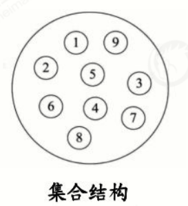
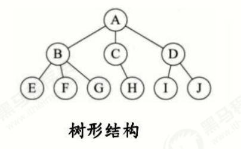
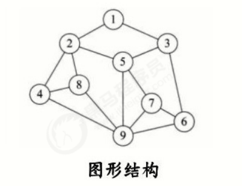
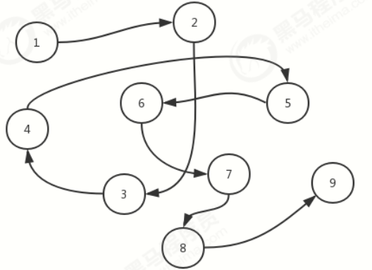
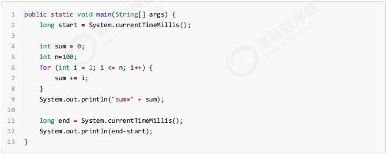
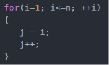

# 整体概述

算法是程序的灵魂，优秀的程序可以在海量数据计算时，依然保持高速计算;

一般来讲 程序会使用了内存计算框架(比如Spark)和缓存技术(比如Redis等)来优化程序,再深入的思考一下，这些计算框架和缓存技术， 它的核心功能是哪个部分呢？

拿实际工作经历来说, 在Unix下开发服务器程序，功能是要支持上千万人同时在线， 在上线前，做内测，一切OK,可上线后，服务器就支撑不住了, 公司的CTO对代码进行优化，再次上线，坚如磐石。你就能感受到程序是有灵魂的，就是算法。

**数据结构和算法的关系**

- 数据data结构(structure)是一门研究组织**数据**方式的学科，有了编程语言也就有了数据结构.学好数据结构可以编写出更加漂亮,更加有效率的代码。
- 要学习好数据结构就要多多考虑如何将生活中遇到的问题,用程序去实现解决.
- 程序 = **数据结构** + 算法
- 数据结构是算法的基础, 换言之，想要学好算法，需要把数据结构学到位。

# 数据结构概述

## **1.什么是数据结构？**

**官方解释：**

数据结构是一门研究非数值计算的程序设计问题中的操作对象，以及他们之间的关系和操作等相关问题的学科。

**大白话：**

数据结构就是把数据元素按照一定的关系组织起来的集合，用来组织和存储数据

## **2.数据结构分类**

传统上，我们可以把数据结构分为逻辑结构和物理结构两大类。

**逻辑结构分类：**

逻辑结构是从具体问题中抽象出来的模型，是**抽象意义上**的结构，按照对象中数据元素之间的相互关系分类，也是我们后面课题中需要关注和讨论的问题。

a.集合结构：集合结构中数据元素除了属于同一个集合外，他们之间没有任何其他的关系。

b.线性结构：线性结构中的数据元素之间存在一对一的关系

c.树形结构：树形结构中的数据元素之间存在一对多的层次关系

d.图形结构：图形结构的数据元素是多对多的关系

**物理结构分类：**

物理结构：是逻辑结构在**计算机中真正的表示方式(是前面逻辑结构的实现）**（又称为映像），也可以叫做存储结构。常见的物理结构有**顺序存储结构、链式存储结构**。

$\color{#FF69B4}{顺序存储结构：}$

把数据元素放到地址连续的存储单元里面，其**数据间的逻辑关系和物理关系是一致的** ，比如我们常用的数组就是顺序存储结构。

顺序存储结构存在一定的**弊端**，就像生活中排时也会有人插队也可能有人有特殊情况突然离开，这时候整个结构都处于变化中，此时就需要链式存储结构。

$\color{#FF69B4}{链式存储结构：}$

是把数据元素存放在任意的存储单元里面，这组存储单元可以是连续的也可以是不连续的。

此时，数据元素之间并**不能**反映元素间的逻辑关系，因此在链式存储结构中引进了一个**指针**存放数据元素的地址，这样通过地址就可以找到相关联数据元素的位置

**数据结构包括：线性结构和非线性结构。**

$\color{#FF69B9}{线性结构}$

1. 线性结构作为最常用的数据结构，其特点是**数据元素之间存在一对一的线性关系**
2. 线性结构有两种不同的存储结构，即**顺序存储结构（数组）**和**链式存储结构（链表）**。
3. 顺序存储的线性表称为顺序表，**顺序表中的存储元素是连续的**。
4. 链式存储的线性表称为链表，**链表中的存储元素不一定是连续**的，元素节点中存放数据元素以及相邻元素的地址信息
5. 线性结构常见的有：**数组、队列、链表和栈**，后面我们会详细讲解.

$\color{#FF69B9}{非线性结构}$

非线性结构包括：**二维数组，多维数组，广义表，树结构，图结构**

# 算法概述

**官方解释：**

算法是指解题方案的准确而完整的描述，是一系列解决问题的清晰指令，算法代表着用系统的方法解决问题的策略机制。也就是说，能够对一定规范的输入，在有限时间内获得所要求的输出。

**大白话：**

根据一定的条件，对一些数据进行计算，得到需要的结果。

在生活中，我们如果遇到某个问题，常常解决方案不是唯一的，算法就是需要去找到最佳的解决方案！！！

对于程序而言，算法就是在解决一个问题时，如何**花费最少的时间、最低的内存需求**来解决这个问题。

# 算法分析

前面我们已经介绍了，研究算法的最终目的就是如何花更少的时间，如何占用更少的内存去完成相同的需求，并且也通过案例演示了不同算法之间时间耗费和空间耗费上的差异，但我们并不能将时间占用和空间占用量化，因此，接下来我们要学习有关**算法时间耗费**和**算法空间耗费**的描述和分析。

- 有关算法时间耗费分析，我们称之为算法的时间复杂度分析；

- 有关算法的空间耗费分析，我们称之为算法的空间复杂度分析。

  

## 1. 时间复杂度分析

我们要计算算法时间耗费情况，首先我们得度量算法的执行时间，那么如何度量呢？

==**事后分析估算方法：**==

比较容易想到的方法就是我们把算法执行若干次，然后拿个计时器在旁边计时，这种事后统计的方法看上去的确不错，并且也并非要我们真的拿个计算器在旁边计算，因为计算机都提供了计时的功能。这种统计方法主要是通过设计好的测试程序和测试数据，利用计算机计时器对不同的算法编制的程序的运行时间进行比较，从而确定算法效率的高低.。

但是这种方法有**很大的缺陷**：必须依据算法实现编制好的测试程序，通常要花费大量时间和精力，测试完了如果发现测试的是非常糟糕的算法，那么之前所做的事情就全部白费了，并且不同的测试环境(硬件环境)的差别导致测试的结果差异也很大。

==**事前分析估算方法：**==

在计算机程序编写前，依据统计方法对算法进行估算，经过总结，我们发现一个高级语言编写的程序程序在计算机

上运行所消耗的时间取决于下列因素：

 **1.算法采用的策略和方案；**

 2.编译产生的代码质量；（编译器做的事情）

 **3.问题的输入规模  (所谓的问题输入规模就是输入量的多少)；**

 4.机器执行指令的速度；

由此可见，抛开这些与计算机硬件、软件有关的因素，一个程序的运行时间依赖于算法的好坏和问题的输入规模。如果算法固定，那么该算法的执行时间就只和问题的输入规模有关系了。

我么再次以之前的求和案例为例，进行分析。

**需求：**计算1到100的和。

第一种解法：

​		这里真正求和的代码，是sum += i；

第二种解法：

​		这里真正求和的代码，是sum = (n+1)*n/2;

因此，当输入规模为n时，第一种算法执行了1+1+(n+1)+n=2n+3次；第二种算法执行了1+1+1=3次。如果我们把第一种**算法的循环体看做是一个整体，忽略结束条件的判断**，那么其实这两个算法运行时间的差距就是n和1的差距。

**为什么循环判断在算法1里执行了n+1次，看起来是个不小的数量，但是却可以忽略呢？我们来看下一个例子：**

**需求：** 计算100个1+100个2+100个3+...100个100的结果

代码：

上面这个例子中，如果我们要精确的研究循环的条件执行了多少次，是一件很麻烦的事情，并且，由于真正计算和的代码是内循环的循环体，所以，在研究算法的效率时，我们只考虑核心代码的执行次数，这样可以简化分析，**只要关注核心代码部分，忽略条件循环语句！！**

再其次因为我们研究算法复杂度，侧重的是当输入规模不断增大时，算法的增长量的一个抽象(规律)，而不是精确地定位需要执行多少次，因为如果是这样的话，我们又得考虑回编译期优化等问题，容易主次跌倒。

我们不关心编写程序所用的语言是什么，也不关心这些程序将跑在什么样的计算机上，我们只关心它所实现的算法。这样，不计那些循环索引的递增和循环终止的条件、变量声明、打印结果等操作，最终在分析程序的运行时间时，最重要的是把程序看做是独立于程序设计语言的算法或一系列步骤。**我们分析一个算法的运行时间，最重要的就是把核心操作的次数和输入规模关联起来**

## 2. 常见的时间复杂度

**时间频度**

一个算法花费的时间与算法中语句的执行次数成正比例，哪个算法中语句执行次数多，它花费时间就多。`一个算法中的语句执行次数称为语句频度或时间频度。记为T(n)。`

**时间复杂度——大O记法**

一般情况下，算法中的基本操作语句的重复执行次数是问题规模n的某个函数，用T(n)表示，若有某个辅助函数f(n)，使得当n趋近于无穷大时，T(n) / f(n) 的极限值为不等于零的常数，则称**f(n)是T(n)的同数量级函数**。记作 T(n)=Ｏ( f(n) )，称**Ｏ( f(n) )**  为算法的渐进时间复杂度，简称时间复杂度。

T(n) 不同，但时间复杂度可能相同。 如：T(n)=n²+7n+6 与 T(n)=3n²+2n+2 它们的T(n) 不同，但时间复杂度相同，都为O(n²)。

常见时间复杂度：

常见的算法时间复杂度由小到大依次为：

`Ο(1)＜Ο(log2n)＜Ο(n)＜Ο(nlog2n)＜Ο(n2)＜Ο(n3)＜ Ο(nk) ＜Ο(2n)` ，随着问题规模n的不断增大，上述时间复杂度不断增大，算法的执行效率越低。

### 1、常数阶O(1)

无论代码执行了多少行，只要是没有循环等复杂结构，那这个代码的时间复杂度就都是O(1)；

上述代码在执行的时候，它消耗的时候并不随着某个变量的增长而增长，那么无论这类代码有多长，即使有几万几十万行，都可以用O(1)来表示它的时间复杂度。

### 2、对数阶O(log2n)

对数，属于高中数学的内容，我们分析程序以程序为主，数学为辅，所以不用过分担心。

由于每次i*2之后，就距离n更近一步，假设有x个2相乘后大于n，则会退出循环。由于是2^x=n,得到x=log(2)n,所以这个循环的时间复杂度为O(logn);

对于对数阶，由于随着输入规模n的增大，不管底数为多少，他们的增长趋势是一样的，所以我们会忽略底数。

### 3、线性阶O(n)

说明：这段代码，for循环里面的代码会执行n遍，因此它消耗的时间是随着n的变化而变化的，因此这类代码都可以用O(n)来表示它的时间复杂度‘

### 4、线性对数阶O(nlogN)

说明：线性对数阶O(nlogN) 其实非常容易理解，将时间复杂度为O(logn)的代码循环N遍的话，那么它的时间复杂度就是 n * O(logN)，也就是了`O(nlogN)`

### 5、平方阶O(n²)

说明：平方阶O(n²) 就更容易理解了，如果把 O(n) 的代码再嵌套循环一遍，它的时间复杂度就是 O(n²)，这段代码其实就是嵌套了2层n循环，它的时间复杂度就是 `O(n*n)`，即  O(n²) 如果将其中一层循环的n改成m，那它的时间复杂度就变成了 `O(m*n)`

### 6、立方阶O(n³)、K次方阶O(n^k)

### 7、平均时间复杂度、最坏时间复杂度

1. 平均时间复杂度是指所有可能的输入实例均以等概率出现的情况下，该算法的运行时间。
2. 最坏情况下的时间复杂度称最坏时间复杂度。==一般讨论的时间复杂度均是最坏情况下的时间复杂度。==

## 3. 空间复杂度

一个算法的空间复杂度(Space Complexity)定义为该算法所耗费的存储空间，它也是问题规模n的函数。

空间复杂度(Space Complexity)是对一个算法在运行过程中临时占用存储空间大小的量度。有的算法需要占用的临时工作单元数与解决问题的规模n有关，它随着n的增大而增大，当n较大时，将占用较多的存储单元，例如快速排序和归并排序算法就属于这种情况

在做算法分析时，**主要讨论的是时间复杂度**。从用户使用体验上看，更看重的程序执行的速度。一些缓存产品(redis, memcache)和算法( 基数排序 )本质就是用空间换时间.

由于java中有内存垃圾回收机制，并且jvm对程序的内存占用也有优化（例如即时编译），我们无法精确的评估一个java程序的内存占用情况，但是了解了java的基本内存占用，使我们可以对java程序的内存占用情况进行估算。

但是，如果你做的程序是嵌入式开发，尤其是一些传感器设备上的内置程序，由于这些设备的内存很小，一般为几kb，这个时候对算法的空间复杂度就有要求了，但是一般做java开发的，基本上都是服务器开发，一般不存在这样的问题。

